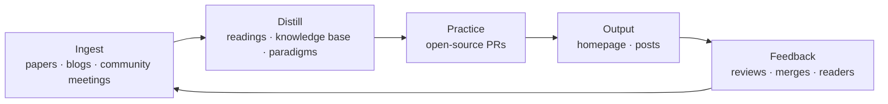

<h1 align="center">Orrery</h1>

<p align="center">
  <b>A personal system for distilling what I read into what I build and share.</b><br>
  Curated sources go in, get distilled into dense notes and working paradigms, turn into open-source contributions, and come back out as public writing. One closed loop.
</p>

<p align="center">
  <a href="https://chaoyuwang.vercel.app">Homepage</a> ·
  <a href="docs/00-START.md">Handbook (中文)</a> ·
  <a href="AGENTS.md">Agent entry</a>
</p>

---

An orrery is a mechanical model of the solar system: every body runs on its own orbit, and the whole machine keeps returning to where it started. This repository works the same way. Each subsystem is independent, and together they form one loop that keeps turning.

## The loop



## Two principles

1. **Decoupled.** Every workflow, template and directory convention is written for any project, current or future, never for one in particular. Examples are only examples.
2. **Closed loop.** Taking information in is half the job. Every stage should feed the next, and the output (merged PRs, the homepage, public posts) is what closes the loop.

## Subsystems

| Stage | What lives here | Where |
|---|---|---|
| Ingest | Material I pick by hand, a daily cloud job that screens trending arXiv papers, notes from open-source community meetings | [`readings/`](readings/), [`meetings/`](meetings/) |
| Distill | Long-form reads of technical reports and papers; source-level reads of open-source projects; a knowledge base of first principles; an interview question bank with LeetCode and a mock-interview trainer | [`reports/`](reports/), [`opensource/`](opensource/), [`knowledge/`](knowledge/), [`questions/`](questions/), [`leetcode/`](leetcode/), [`interview/`](interview/) |
| Paradigms | The current best way to work with Claude and Codex in each situation, kept as a living library rather than a changelog | [`paradigms/`](paradigms/) |
| Practice | A ledger of contributions to open-source projects | [`contrib/`](contrib/) |
| Output | My homepage, built and deployed independently | `site/` |

Coverage is broad on purpose: AI infrastructure and agents first, then compilers and hardware, cloud native, databases and storage, operating systems, and quantitative finance.

## Working with agents

Markdown is the database: no database server, everything is plain text tracked by git. Claude Code and Codex both read [`AGENTS.md`](AGENTS.md) (Claude via a one-line `CLAUDE.md` import), so a session needs no warm-up prompt:

1. Drop in a link, a PDF, a meeting transcript, a skill, or a one-line idea.
2. The agent routes it to the one handbook that covers it and answers with a short intent card: what it understood, where the result will land, and what is still open.
3. One confirmation, then it runs to the end: write, verify, update the queue, commit.
4. When a task wraps up, it proposes at most one better way of working, and good ones go into `paradigms/`.

## Run it locally

```bash
npm install
npm run dev        # reading site on http://localhost:3001
npm test           # full content and structure checks
```

Requires Node.js 20+. The homepage has its own toolchain: `pnpm --dir site install && pnpm --dir site dev`.

Stack: Next.js · React · TypeScript · Tailwind CSS · react-markdown with KaTeX and Mermaid · Vitest.

## Layout

```text
reports/  readings/     long-form reads of reports, papers and web material
opensource/             source-level reads of open-source projects (sources in projects/, not tracked)
knowledge/  questions/  first-principles knowledge base and interview question bank
leetcode/  interview/   LeetCode lists and the mock-interview trainer
paradigms/  meetings/   working paradigms and community-meeting notes
contrib/                open-source contribution ledger
site/                   the homepage
docs/                   handbooks (Chinese), one per workflow
app/ components/ lib/   the reading site
scripts/ tests/         maintenance scripts and checks
```

Most content is written in Chinese.
