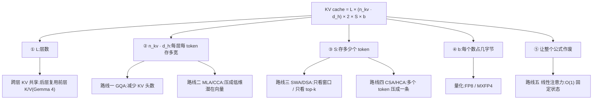

# 前沿模型架构总览

> ⚠️ 旧版:本篇写于写作契约确立之前,尚未按新标准审查重写。标准见 docs/05-知识库写作契约.md,样板见「GPU架构与执行模型」。

一句话:**2026 年架构竞争的唯一主战场,是在「不变笨」的前提下把 KV cache 和长上下文的注意力开销砍下来**。其他所有变化——MoE 怎么切、优化器换谁、残差怎么连——都是围绕这条主线的配套动作。另一个要先立住的认知来自 Raschka 对 93 个开源模型 config 的对照:**架构是效率的战场,不是智力的战场**,架构变化主要降低运行成本,质量表现主要由数据质量、数据量和训练配方驱动。

本篇管全局:公式、路线图、路线之争、耦合关系与判断框架。每条路线的机制细节让位给分篇(本系列另有 GQA、MLA、SWA、稀疏注意力、线性注意力、Hybrid注意力、注意力配件、RoPE 各一篇)。

## 一、为什么主战场是砍开销

因为模型的用途变了。2023 年的模型是「问一句答一句」,2026 年的模型是 **reasoning + agent**:一次任务要吐几万 token 的思考链、读几十个工具返回、维持几十万 token 的上下文。这时瓶颈不再是「参数够不够多」,而是三件事:

- **KV cache 占显存**:上下文越长缓存越大,能同时服务的用户越少;
- **prefill 是平方复杂度**:注意力对长为 $L$ 的序列要算 $O(L^2)$,长文档一次读入的开销随长度爆炸;
- **decode 是内存带宽瓶颈**:每生成一个 token,都要把整个 KV cache 从显存完整读一遍——纯搬运开销,跟算力无关。

> 类比:decode 像一个人边写边回顾,每写一个字都要把前面的笔记从头翻一遍。写得快不快,取决于翻页速度(带宽)而不是脑子转速(算力)。

所以 2026 年几乎每篇技术报告的架构章节,标题里都有 "efficiency" 或 "long-context"。

## 二、一个公式看懂所有路线

先说 KV cache 是什么:生成第 100 个 token 时,前 99 个 token 的 K(索引标签)和 V(实际内容)已经算过了,存起来复用,这就是 KV cache。它的大小:

$$
\text{KV cache} = \underbrace{L_{\text{layers}}}_{\text{①层数}} \times \underbrace{n_{kv} \times d_h}_{\text{②每层存多宽}} \times 2 \times \underbrace{S}_{\text{③存几个 token}} \times \underbrace{b}_{\text{④每个数几字节}}
$$

它随上下文长度 $S$ 线性增长。两个数感受一下差距:

- **Gemma 3 27B**:496 KiB/token(所有层存全长的上界口径),128k 上下文约 62 GB——一张 80 GB 的 H100 光缓存就吃掉大半,模型权重还没放;
- **DeepSeek V4-Flash**:5.4 KiB/token,差了近 **100 倍**。

这近百倍的差距,就是过去两年架构进化的全部意义。所有主流技术路线,都是在砍这个公式里的某一项:

## 三、五条技术路线一览

| 路线 | 一句话原理(类比) | 代表模型 | 细节见 |
|---|---|---|---|
| **减 KV 头(GQA)** | 几个 query 头分组共用一套 K/V——从「每个学生配一个图书管理员」改成「每个班配一个」 | Llama 3/4、Qwen3 全系、GLM-4.5/4.7、GPT-OSS、MiniMax M2.x、Gemma 3/4 | KV共享注意力 篇 |
| **压 token 表示(MLA/CCA)** | 不存完整 K/V,压缩成低维潜在向量,用时再展开——书压成摘要存着;CCA 更激进,直接在压缩空间里算注意力 | DeepSeek V3/V3.2、Kimi K2、GLM-5、Mistral Large 3、ZAYA1(CCA) | MLA 篇 |
| **少看 token(SWA/DSA)** | SWA 只看最近 N 个(不翻回第一页,只看最近两页);DSA 用轻量选择器动态挑最相关的 top-k(按索引挑出最相关的十页) | Gemma 3/4、GPT-OSS(SWA);DeepSeek V3.2、GLM-5/5.1(DSA) | SWA 篇、稀疏注意力篇 |
| **压缩序列(CSA/HCA)** | 前几条压「每个 token 存多少」,这条压「存多少个 token」:CSA 每 4 个 token 压成 1 条缓存再稀疏挑选,HCA 每 128 个压 1 条后稠密全扫,两种层交替使用 | DeepSeek V4(2026 年最新最狠的一招) | 稀疏注意力篇 |
| **去 cache(线性注意力)** | 不存历史,只维护固定大小的状态——不是每天写一篇日记全留着,而是只维护一份不断更新的「近况总结」 | Qwen3-Next/3.5/3.6(GDN)、Kimi Linear/K3(KDA)、Ling 2.5(Lightning)、Nemotron 3(Mamba-2) | 线性注意力篇、Hybrid注意力篇 |

线性注意力的账最狠,直接改掉了增长率:

$$
\text{softmax 注意力:} O(L) \text{ 缓存} \quad\longrightarrow\quad \text{线性注意力:} O(1) \text{ 状态}
$$

代价也一目了然:固定状态装不下所有细节,必须决定忘掉什么,精确检索(大海捞针)是经典弱项。所以没人用纯线性,都是混着用——大部分层线性、少数层 softmax,3:1 是各家独立收敛出的事实标准(展开见 Hybrid注意力篇)。

公式里还有两根小杠杆:跨层 KV 共享砍①(Gemma 4 端侧型号在用,但报告只给了共享比例、没给拓扑也没单独给节省量,见 注意力配件 篇)、量化砍④。QK-Norm、输出门控、attention sink 这类不改复杂度的小件见 注意力配件 篇;RoPE/NoPE/YaRN 的分层玩法见 RoPE 篇。

## 四、2026 年的三条路线之争

「最新模型都用 hybrid attention」是不准确的说法。准确的说法是:三条路线并行,各家按自己的场景下注。

| 路线 | 代表 | 赌的是什么 |
|---|---|---|
| **Hybrid 线性** | Qwen3.5/3.6、Kimi Linear/K3、Ling 2.5、Nemotron 3 | 上下文会一直变长(→1M),必须干掉随长度线性增长的缓存 |
| **压缩 + 稀疏 softmax** | DeepSeek V3.2/V4、GLM-5/5.1 | 保留 softmax 的表达力,靠压缩和稀疏把成本压下去 |
| **保守全注意力** | MiniMax M2.x、Mistral | 200k 上下文够用了,架构简单换来训练稳定和实现可靠 |

最重要的反例点到为止:**MiniMax 掉头了**。MiniMax-01 曾是最早的大规模线性混合模型之一,但从 M2 起回到朴素的 62 层 GQA 全注意力,一路保持到 M2.7——AA 综合分 38.1、Agent 分 61.5,在开源模型里名列前茅,综合分超过同期用 hybrid 的 Qwen3.5(32.0)。含义有三:hybrid 不是免费午餐(买长上下文吞吐,卖部分精确检索能力和工程复杂度);目标上下文 196k 时 GQA 的 248 KiB/token 还扛得住;架构选择和产品定位耦合——coding/agent 恰恰要在几十万 token 里精确定位代码片段,正是线性的弱项。

## 五、架构变量总清单(精简版)

注意力之外还有哪些旋钮,每个一行(完整展开见对应分篇与手册):

| 维度 | 现状一句话 |
|---|---|
| 注意力 | 上面五条路线 + 混合比例 + 配件(QK-Norm 近标配、输出门控、attention sink) |
| 位置编码 | RoPE 绝对主流;全局层常用 NoPE / partial RoPE;YaRN 长度外推只在全局层用 |
| MoE | 专家从 8 个涨到 896 个、越切越细(直觉是组合数:8 选 2 只有 28 种,256 选 8 约 $4\times10^{14}$ 种);稀疏度低至 1.8%(Kimi K3);router 打分从 softmax 转向 sigmoid/哈希/分位数;DeepSeek 的 aux-loss-free 负载均衡被广泛采用;共享专家仍有分歧(Qwen3 去掉、Qwen3.5 又加回) |
| 归一化 | RMSNorm 已完全统一;位置上 pre-norm 主流,OLMo 坚持 post-norm,另有 sandwich |
| FFN/激活 | SwiGLU 是事实标准;例外:ReLU²(Nemotron Nano 4B)、双倍宽 GELU(Gemma 4 E2B) |
| 残差流 | 2026 年的新战场:单流 → 多条并行流 mHC(DeepSeek V4)、跨深度检索 AttnRes(Kimi K3) |
| 训练目标 | MTP 从 MTP-1(DeepSeek V3)涨到 MTP-3(GLM-4.7、MiniMax M2.5/M2.7 等) |
| 优化器 | AdamW 的挑战者是 Muon 系:报告约 2 倍计算效率、省显存、大 batch 更稳;Kimi K2 的 MuonClip 在 15.5T token 上无 loss spike;注意微调要与预训练优化器一致,不匹配会明显变差 |
| 数值精度 | BF16 默认;FP8 训练(DeepSeek V3 起);MXFP4 权重发布(Kimi K3) |

再强调那个反直觉事实:这张表里**几乎没有一项直接决定模型聪不聪明**——它们决定的是同样的智力跑起来多贵。

## 六、选择不是独立的:五条耦合关系

单点背下来不如看懂配套,这五条是理解各家「全家桶」的钥匙:

1. **线性注意力 ↔ 极致稀疏 MoE**:两者砍的是同一瓶颈的两半——线性砍 KV cache 显存,稀疏 MoE 砍每 token 计算量。只做一半,另一半立刻成为新瓶颈(缓存降 12 倍但计算不降,GPU 就算不过来了)。所以 hybrid 模型几乎全是成对出现:Qwen3-Next 80B/3B、Kimi K3 的 16/896 专家(1.8%)。
2. **MoE 稀疏度 ↔ router ↔ 优化器**:越稀疏,每个专家分到的梯度越少,router 越难训。因果链:想更稀疏 → router 必须更鲁棒(哈希路由、分位数路由)→ 优化器也要跟着换(Muon 系)。Kimi K3 和 DeepSeek V4-Pro 都是整套一起换的。
3. **局部/全局层 ↔ 位置编码**:局部层的窗口本身自带位置信息,配完整 RoPE;全局层要外推到训练时没见过的长度,配 NoPE 或 partial RoPE,YaRN 只在全局层用——OLMo 3 是这条规律最干净的证据。
4. **MTP ↔ 投机解码**:agent 场景下 decode 步数是延迟大头,MTP 的额外预测头恰好能当投机解码的 draft,不需要单独的小模型。于是 MTP 从训练技巧变成推理必需品,这就是 MTP-1 涨到 MTP-3 的推力。
5. **小模型试验 → 旗舰采用**:Qwen3-Next(80B)验证 GDN → Qwen3.5(397B)采用;Kimi Linear(48B)验证 KDA → K3(2.8T)采用;mHC 论文在 27B 上实验 → DeepSeek V4(1.6T)采用。这条规律可以拿来做预测:现在小模型上的新东西(CCA、逐层注意力预算、ReLU²),大概率 6–12 个月后进旗舰。

## 七、判断框架:看到新模型的四层 12 问

拿到一份新模型技术报告,按这个顺序问:

**第一层:它在哪条路线上?**

1. KV/token 是多少?(单个数字里信息量最大的一个)
2. 有没有线性注意力/SSM?比例多少?
3. softmax 层用的是 GQA、MLA 还是压缩变体?
4. 局部:全局比例多少?窗口多大?

**第二层:MoE 怎么切?**

5. 总专家数 / 激活数 / 稀疏度百分比?
6. 有没有共享专家?
7. Router 打分函数是什么?负载均衡怎么做?

**第三层:配套件齐不齐?**

8. 位置编码是不是分层不同?
9. 有没有 MTP?几个?
10. 优化器是 AdamW 还是 Muon 系?
11. 残差流改了没有?

**第四层:最重要的一问**

12. **有没有消融实验?** 如果报告只给「新架构 vs 上一代」的端到端对比,那所有收益都是数据 + 配方 + 架构的混合结果,**不能归因给架构**。DeepSeek V4 的 CSA/HCA 就是这个情况:1M 上下文下 cache 降到 7–10%、FLOPs 降到 10–27% 的数字来自完整 V4 配方(里面还混着更好的数据、Muon、mHC 和推理系统改动),论文没有消融。

## 八、闭源模型:我们不知道什么

- GPT-5.x、Claude、Gemini 系列**都没有公开架构细节**。任何声称知道它们架构的材料,都值得高度怀疑。
- GPT-4 的「1.76T MoE」只是传言,OpenAI 从未确认。
- **GPT-OSS 是 OpenAI 唯一的官方开放窗口**(SWA/全局 1:1 交替 + attention sink + attention bias),可以合理推测它反映了部分内部设计偏好,但不能假设 GPT-5 就是放大版的 GPT-OSS。
- Gemma 是 Google 的开源线,Google 从未说过 Gemma 与 Gemini 共享架构。

所以一切公开的「前沿架构对比」(包括本篇)的准确定位都是:**开源前沿模型的架构对比**。

## 九、面试考点串联

高频问法(与题库联动的切片点):

1. 为什么 2026 年大家都在砍 KV cache →「一」三大瓶颈 +「二」公式
2. KV cache 大小怎么算、Gemma 3 与 DeepSeek 差在哪 →「二」公式与百倍对比
3. 五条路线各砍公式哪一项 →「三」+ mermaid;单点机制去 GQA/MLA/SWA/稀疏注意力/线性注意力各篇
4. hybrid 的层比例怎么定、为什么 3:1 成了事实标准 → Hybrid注意力篇
5. MiniMax 为什么放弃线性混合回到全注意力 →「四」(架构选择与产品定位耦合)
6. 线性注意力为什么总跟极稀疏 MoE 一起出现 →「六」耦合①
7. 拿到新模型技术报告怎么快速读 →「七」四层 12 问,先看 KV/token
8. 「XX 架构让模型更聪明」这类说法怎么评价 → 架构是效率战场 + 无消融不能归因(「七」第 12 问)
9. GPT-5/Claude 用什么架构 →「八」(标准答案:不知道,只有 GPT-OSS 这扇窗)

## 相关文献

- Sebastian Raschka, LLM Architecture Gallery(93 个开源模型 config 对照,本文主要数据来源)— https://sebastianraschka.com/llm-architecture-gallery/
- DeepSeek V3(MLA + aux-loss-free 负载均衡 + MTP 的集大成)— [arXiv:2412.19437](https://arxiv.org/abs/2412.19437)
- DeepSeek V3.2(DSA 稀疏注意力首次上线)— [arXiv:2512.02556](https://arxiv.org/abs/2512.02556)
- Kimi K2(MuonClip 在 1T 规模的验证)— [arXiv:2507.20534](https://arxiv.org/abs/2507.20534)
- Qwen3(GQA 保守路线的代表性旗舰)— [arXiv:2505.09388](https://arxiv.org/abs/2505.09388)
- MiniMax M2 系列(从线性混合回归全注意力的反例)— [arXiv:2605.26494](https://arxiv.org/abs/2605.26494)
- GLM-5(MLA + DSA 路线跟进)— [arXiv:2602.15763](https://arxiv.org/abs/2602.15763)
