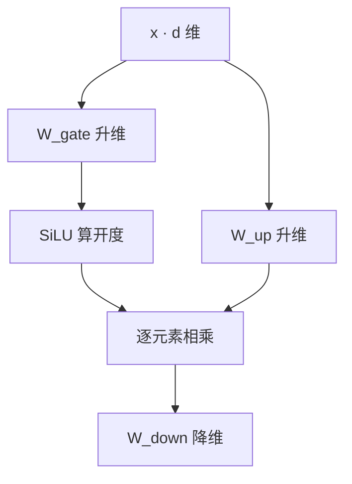

# FFN 与激活函数(SwiGLU / GELU / ReLU²)

> 🔴 重点考点:本篇是当前复习重点,文末「面试考点串联」给出问法对照。

一句话:注意力负责在 token 之间搬信息,**FFN 负责在通道之间加工信息**——它对每个位置独立地「先摊宽、过一遍非线性、再折回来」,顺带装下了 dense Transformer 约三分之二的参数;而那道非线性(激活函数)从 Sigmoid 一路演化到今天的 SwiGLU 门控结构,是面试里少数几个能从「为什么需要非线性」一直追到「怎么公平比量化」的连续链条。

## 一、最前置的一步:为什么必须有非线性

### 没有激活,几十层能合并成一层

把两层不带激活的线性层直接串起来:

$$
W_2(W_1 x + b_1) + b_2 = (W_2 W_1)\,x + (W_2 b_1 + b_2) = W' x + b'
$$

这个式子说的是:**两个矩阵乘出来还是一个矩阵,两个偏置加起来还是一个偏置**——中间没有非线性时,整个两层网络就是一个仿射变换。推广到 $L$ 层也一样,$W_L \cdots W_1$ 仍然只是一个矩阵,而且秩还被最窄的那一层卡住。所以「无激活的多层网络等价于单层线性模型」不是类比,是恒等式:**堆层数只增加了参数,一点表达能力都没增加**。插进逐元素激活之后,每个神经元多了一道「弯折」,正负区间被区别对待,多层叠起来才拼得出弯曲的分段决策边界。

### 但「有非线性」不等于「只有激活函数」

反过来用这条恒等式最容易翻车。**Transformer 里的非线性不止激活函数一处**:注意力的 softmax、门控结构里的逐元素乘法、Norm 里的除法都是非线性运算。所以「某个 FFN 去掉了标量激活」推不出「整个网络退化成线性模型」。这条边界在第三节还会再用一次。

## 二、六种激活:形状、饱和区与代价

| 激活 | 形式 | 饱和区与梯度行为 | 输出范围 | 硬件成本 | 典型问题 |
|---|---|---|---|---|---|
| Sigmoid | $\sigma(x)=1/(1+e^{-x})$ | 两端都饱和;导数峰值只有 0.25($x=0$),到 $\lvert x\rvert=5$ 已降到约 0.007 | $(0,1)$ | 一次 exp | 梯度消失最严重;输出恒正、非零中心 |
| Tanh | $(e^x-e^{-x})/(e^x+e^{-x})$ | 两端同样饱和;导数峰值 1,比 Sigmoid 好一档 | $(-1,1)$ | 一次 exp | 零中心解决了,饱和区没解决 |
| ReLU | $\max(0,x)$ | 正半轴导数恒 1、**不饱和**;负半轴导数精确 0 | $[0,+\infty)$ | 一次比较,最便宜 | 死亡 ReLU;非零中心;零点不可导 |
| Leaky ReLU | $\max(ax,x)$,常取 $a=0.01$ | 负半轴导数是 $a$ 而不是 0 | $(-\infty,+\infty)$ | 同 ReLU | 多一个超参 $a$;大规模上收益不稳定 |
| GELU | $x\,\Phi(x)$ | 处处可导、轻微非单调;负区间保留一小截负值(最低约 $-0.17$) | 约 $(-0.17,+\infty)$ | erf 或 tanh 近似,较贵 | 无精确零;比 ReLU 贵 |
| SiLU / Swish | $x\,\sigma(x)$ | 曲线与 GELU 几乎重合;最低约 $-0.28$ | 约 $(-0.28,+\infty)$ | 一次 sigmoid,比 erf 便宜 | 同 GELU |

> 🖼️ 占位:Sigmoid / Tanh / ReLU / GELU / SiLU / ReLU² 六条曲线与各自导数曲线的对比图(突出饱和区、零点附近平滑度、负半轴行为)

### Sigmoid 和 Tanh 输在哪:饱和区

**饱和**指的是输入绝对值一大、曲线就压平、导数趋近 0。反向传播是逐层把导数乘起来,一路乘一串小于 1 的数,梯度到浅层就没了。给个量级:Sigmoid 导数最大只有 0.25,**十层连乘的上界就是 $0.25^{10}\approx 10^{-6}$**——这就是深层 Sigmoid 网络训不动的算术原因。Sigmoid 还有第二个毛病,**输出恒为正、不是零中心**,某一层权重的梯度符号全都相同,更新只能走「全体变大或全体变小」的锯齿路径;Tanh 修掉了这条,饱和区却一点没修。

它们今天没消失,只是退回了合适的岗位:**Sigmoid 做二分类概率、做 LSTM 与 GLU 的门**(值域 $(0,1)$ 正好当「开度」),**Tanh 做循环网络的候选状态**(值域有界,状态不会爆)。

### ReLU 缓解了什么,又没有彻底解决什么

**它治的是「激活函数造成的梯度消失」**:正半轴导数恒为 1,不管 $x$ 多大都不衰减,反向连乘时这一环不再往下压;而且只要一次比较,便宜到几乎不计成本。但它**没有彻底解决深层网络的梯度问题**,三条要说准:

1. **死亡 ReLU**:负半轴导数精确为 0,某个神经元一旦被推到对所有样本都输出负值,梯度永远是 0、再也活不回来(大学习率或大的负偏置最容易触发)。这是把梯度消失从两端搬到了负半轴,不是消灭。
2. **激活函数只是链条的一环**。反向每层还要乘一次权重矩阵,梯度是爆是消还取决于权重谱、初始化和层数。**真正让上百层能训起来的是残差连接与归一化**,不是换激活函数(见 残差流 篇与 Norm位置 篇)。
3. 它对训练中的尺度漂移毫无作用,那是 Norm 的活。

**Leaky ReLU 只补第 1 条**:负半轴给一个小斜率 $a$,梯度不再精确为 0,神经元有机会被拉回来(PReLU 更进一步把 $a$ 变成可学习参数)。代价是多一个要调的超参,大规模语言模型上收益并不稳定;它既没解决零点不可导,也没有「按输入大小平滑调节开度」的性质。所以它在 CV 与 GAN 判别器里常见,**LLM 主干上基本不用**。

### GELU 与 SiLU:把硬闸门换成软闸门

**GELU 的概率解读**:$\Phi(x)$ 是标准正态分布的 CDF,$x\Phi(x)$ 正好是「以 $\Phi(x)$ 的概率保留 $x$、否则置零」这个随机开关的期望值。**输入越大越可能被放行。** ReLU 是非开即关的硬闸门,GELU 把它换成一扇按输入大小渐变开度的软闸门:零点附近处处可导,负区间保留一小截负值而不是一刀切死。原论文还给了一个用三次多项式加 tanh 拟合正态 CDF 的近似式,**省掉 erf 这种昂贵函数**,曲线几乎看不出差别。

SiLU 走同一条路,只把 $\Phi$ 换成 logistic 的 CDF(也就是 sigmoid)。这个形状被独立提出过三次:GELU 论文里作为 sigmoid 版本顺带定义并命名为 SiLU;Elfwing 等人在强化学习里提出并命名 SiLU;Ramachandran 等人用搜索找到同一形状,叫 Swish($x\sigma(\beta x)$)。所以「**SiLU 就是 $\beta=1$ 的 Swish**」是准确说法。但要挡住一句过度归因:**没有理论保证平滑激活在所有模型上必胜 ReLU**,结论都来自控制了参数量与训练预算的消融。

### GELU、SiLU 和 SwiGLU 是什么关系(最高频混淆点)

| 名字 | 它是什么 | 输入 → 输出 | 带参数吗 |
|---|---|---|---|
| GELU | **标量激活函数** | 一个数 → 一个数,逐元素作用 | 无 |
| SiLU / Swish | **标量激活函数** | 一个数 → 一个数,逐元素作用 | 无(Swish 的 $\beta$ 可选可学习) |
| SwiGLU | **一整个门控 FFN 结构** | 一个 $d$ 维向量 → 一个 $d$ 维向量 | **三个大矩阵** |

一句话:**前两个是「装在闸门上的那条曲线」,SwiGLU 是「整条带两个入口的管道」。** 把 SwiGLU 和 GELU 摆在一起问「哪个激活函数更好」,问法本身就错位了。正确的对照有两种:「GELU FFN vs SwiGLU FFN」(结构之争),或者「GEGLU vs SwiGLU」(同为门控结构,只换阀门里那条曲线)。

### sin/cos 能不能做激活函数

**能训,但不适合当通用默认项。** sin 当然是非线性,**SIREN 就是整张网络用正弦做隐藏层激活**,拟合图像、音频、有符号距离场这类连续信号效果很好,还顺带给出漂亮的高阶导数;但它**配了专门的频率尺度与初始化方案**,不是把 ReLU 换成 sin 就完事。不好训的原因是周期性:相隔整数个周期的输入被映到同一个值,导数符号反复翻转,损失面上多出大量等价的局部极小,常规初始化下优化不稳。

一句边界必须说准:**位置编码用 sin/cos 和把 sin 当激活函数是两回事**——前者是预先构造的坐标特征,加在表示上,不参与逐层的非线性变换(见 RoPE 篇)。

## 三、FFN:通道维的加工车间

### 结构:升维、非线性、降维

Transformer 每层由注意力和 FFN 交替组成。**FFN 里没有任何跨位置的运算**:同一层里一千个 token 各自走一遍同一组权重,彼此不通信。经典形式是两层 MLP:

$$
\mathrm{FFN}(x) = W_{down}\,\sigma(W_{up}\,x + b_{up}) + b_{down}
$$

这个式子说的是:一个 token 的 $d$ 维向量先被 $W_{up}$ 拉宽到 $d_{ff}$,逐元素过一遍激活,再被 $W_{down}$ 压回 $d$ 维。忽略偏置,参数量是 $2\,d\,d_{ff}$,每个 token 的矩阵计算量同量级(现代 LLM 普遍不带 bias)。

**为什么先升维再降维?** **升维是给激活函数备料**——激活逐元素作用,它能表达多少种分段模式完全取决于有多少个「元素」,宽到 $d_{ff}$ 就是给了 $d_{ff}$ 个独立开关;中间层要是不比 $d$ 宽,所有特征挤在一个瓶颈里筛选,这一步就白做了。**降维则是残差流的硬约束**——残差主路的宽度全网固定为 $d$,输出必须回到 $d$ 才能相加(见 残差流 篇)。所以「宽」只能是中间的临时工作台,不能是常驻宽度。

> **类比**:一条「先摊开、再折叠」的流水线。把紧凑的 $d$ 维表示摊到几倍宽的工作台上($W_{up}$),在宽敞空间里逐个开关筛选($\sigma$),再把有用的部分折叠打包回原宽度($W_{down}$)。

### 和自注意力各混合哪个维度,能不能交换或合并

| | 自注意力 | FFN |
|---|---|---|
| 混合哪个维度 | **token 之间**(token mixing) | **通道之间**(channel mixing) |
| 权重从哪来 | 由输入现算($QK^\top$ 后 softmax) | 训练完就固定,与输入无关 |
| 跨位置吗 | 是 | 否,逐位置独立 |
| 每层参数量 | MHA 四个投影共 $4d^2$ | $2dd_{ff}$,$d_{ff}=4d$ 时为 $8d^2$ |

**两者混的是正交的两个维度,这就是 Transformer 交替堆叠它们的根本原因**:一层里先跨位置把信息取过来,再在通道里加工一遍,叠 $N$ 层就是「取—加工—再取—再加工」。只做前者,每个位置的表示没被充分变换;只做后者,位置之间永远不通气。

- **能交换顺序吗?** 结构上跑得通(改的只是先跨 token 还是先跨通道),但那是另一个模型,权重不能直接搬,好坏要重训后拿实验说话。
- **能合并成一个算子吗?** 记法上可以——注意力也能写成「一次权重由输入现算的 token 维混合」。但只要还想保留「内容决定的跨位置读取」和「大容量的逐位置加工」这两件事,参数和计算一点省不掉,合并是统一记号,不是免费午餐。注意力本身的机制见 注意力基础 篇。

### 删掉 FFN 会怎样

**网络仍然是非线性的**,理由就是第一节末尾那条:softmax 还在,门控乘法与 Norm 的除法也还在,所以不能说「去掉 FFN 就成了纯线性网络」。但能力损失非常大,分三条:**丢掉主要的逐位置非线性加工**(通道之间的变换只剩注意力那几个线性投影)、**丢掉参数容量的大头**(按 $d_{ff}=4d$ 算每层约三分之二参数在 FFN,账见第四节)、**丢掉知识存储的主要载体**(见下面的 key-value memories)。现实里有的是「重新分配预算」的做法,比如混合结构里 FFN 层数少于注意力层——那是取舍,不是白拿。

### key-value memories:知识为什么说存在 FFN 里

Geva 等人的解读:**FFN 就是一个可微的键值存储**。

- $W_{up}$ 的每一**行**是一个「查询键」,负责检测某种输入模式;$\sigma(W_{up}x)$ 的每一维就是当前 token 对该模式的命中程度;
- $W_{down}$ 的每一**列**是一个「知识值」,大致对应词表上的一个分布偏移;
- 输出 = 按命中程度加权求和的值。命中哪些键,就取出哪些知识。

> **类比**:图书馆的索引卡系统。$W_{up}$ 的行是一抽屉索引卡,激活值是逐张卡片的匹配度,$W_{down}$ 的列是卡片背后那本书;一次前向 = 拿当前 token 刷一遍卡片,把匹配上的书按相关度混合借走。

论文的证据形态是人工检查这些「键」各自对应什么模式(浅层偏表层的 n-gram 模式,深层偏语义主题),再把「值」投到词表上看它偏向哪些词。这是一个有实证支撑的**视角**,不是「每条事实对应一个神经元」的强主张。它解释了两件事:知识编辑类工作为什么都去改 FFN 权重;**MoE 为什么只复制 FFN 不复制注意力**——要扩容的是仓库,不是搬运工。

## 四、SwiGLU 与宽度账

### 两条升维分支:一条运水,一条拧阀门

上面的激活都是「一条通路过一道闸门」。GLU 门控家族换了拓扑:**两条并行的升维投影,一条过激活函数当阀门,一条裸投影当内容,逐元素相乘,再降维**:

$$
\mathrm{SwiGLU}(x) = \bigl(\mathrm{SiLU}(x W_{gate}) \odot x W_{up}\bigr) W_{down}
$$

这个式子说的是:$W_{gate}$ 那条支路只用来算「每一维该开多大」,$W_{up}$ 那条提供「开出来的是什么内容」,两者逐元素相乘之后才降维。

> **类比**:经典 FFN 里信号既当水又当开关,水流自己拧自己的龙头。门控把两件事分开:一条管道专门运水,旁边一条细管测完水质去拧阀门;$d_{ff}$ 根水管每根配一个独立阀门,开度由输入现场决定。

**门控为什么可能更强?** 因为这是**乘性交互**:内容通路的每一维被另一条数据依赖的通路动态缩放,等价于一个由输入现算出来的逐维特征选择器,单条通路的逐元素激活做不到这件事。但证据只到「实测更好」为止——Shazeer 在参数与计算对齐的 T5 配置上做了对照,GEGLU/SwiGLU 的 log 困惑度从 ReLU 基线的 1.677 降到 1.633 / 1.636;他在结论里明说不解释为什么,把这些结构的成功归于 "divine benevolence"(神圣恩典)。**从 ReLU 到 SwiGLU,激活函数选型至今仍是经验跑赢理论。**

把阀门里的曲线换掉,就得到同一篇论文里的 GLU 家族:**Bilinear**(不放激活,两条投影裸乘)、**ReGLU**(ReLU)、**GEGLU**(GELU)、**SwiGLU**(SiLU)。论文里 GEGLU 与 SwiGLU 分数几乎并列,工业界最后统一到了 SwiGLU。

### 怎样公平比较参数和计算

门控必须有两条分支——一条算「开多大」,一条给「开什么」,少一条就退回普通 FFN。于是矩阵从两个变成三个:**同样的 $d_{ff}$ 下参数与计算都涨 50%**($2dd_{ff} \to 3dd_{ff}$)。这时候直接拿 SwiGLU 比 GELU FFN 的困惑度,赢的可能只是那多出来的 50%,结论一文不值。

**公平做法是先对齐参数量或 FLOPs,再比质量**:把 $d_{ff}$ 乘 $\frac{2}{3}$。原论文就是这么做的——T5 base 的 $d_{model}=768$、$d_{ff}=3072$(正好 $4d$),GLU 变体把 $d_{ff}$ 降到 2048,参数与运算量与基线持平。$4d \times \frac{2}{3} = \frac{8}{3}d \approx 2.67d$,这就是 LLM 里那个「怪比例」的来历:LLaMA 明说用 $\frac{2}{3}\cdot 4d$ 代替 PaLM 的 $4d$;Llama / Llama 2 的 7B 用 $d=4096$ 配 $d_{ff}=11008$,正是 $\frac{8}{3}\times 4096\approx 10923$ 向上取整到 256 的倍数。

除了参数,还有三件容易漏掉的对齐项:**中间宽度**、**实现**(有没有融合 kernel,不然三次投影的访存开销会掩盖一切)、**训练预算**(步数、数据、超参必须相同,否则归因不到结构头上)。

### $4d$ 是怎么来的,为什么不是普适最优

**出处很朴素**:原始 Transformer 的 base 配置是 $d_{model}=512$、$d_{ff}=2048$,big 是 1024 / 4096,都是 4 倍。论文没有给任何关于「为什么是 4」的推导,它就是一组跑通了的超参;BERT、GPT 一路沿用成默认值,用久了看起来就像定理。**但它不是常数**,三个方向都在把它推走:门控结构一来,同参数预算下变成 $\frac{8}{3}d$;现代模型按参数预算、硬件对齐(取 128 / 256 的倍数、必须被张量并行度整除)和「宽 vs 深」的取舍现调,Llama 3 8B 就用了 $d_{ff}=14336$,即 $3.5d$;MoE 专家的 $d_{ff}$ 则远小于 $d$。顺带一句常被追问的:**加宽和加深不能直接互换**——加宽扩的是单层的特征容量,加深加的是连续变换与信息传递的次数,对应的能力不是一回事。

### 参数账:FFN 占多大头

| 配置 | FFN 参数量 | 取值惯例 |
|---|---|---|
| 经典 2 矩阵(ReLU / GELU) | $2\,d\,d_{ff}$ | $d_{ff}=4d \Rightarrow 8d^2$ |
| SwiGLU 3 矩阵 | $3\,d\,d_{ff}$ | $d_{ff}=\frac{8}{3}d \Rightarrow 8d^2$(与上一行持平) |

MHA 的 Q/K/V/O 四个 $d\times d$ 投影一共 $4d^2$,所以每层 $\frac{8d^2}{8d^2+4d^2}=\frac{2}{3}$ 的参数在 FFN——这就是「FFN 占 dense Transformer 约三分之二参数」的账。换成 GQA 之后 K/V 投影缩小,注意力那一头还要往下掉,**FFN 占比只会更高**(KV 头共享见 KV共享注意力 篇)。注意这笔账只数 Transformer block,不含 embedding 与输出头;小模型里词表相关的参数占比可能相当可观。

### MoE:同一个 FFN 横着复制 N 份

**MoE 就是把一层里那唯一的 FFN 复制成 N 个结构相同、宽度更小的专家,再由一个 router 给每个 token 只挑其中几个来算**——总参数量与每 token 计算量就此脱钩。专家本身仍然是 SwiGLU FFN,所以本篇关于 FFN 的所有结论对专家平移即用。专家粒度、共享专家、路由打分与负载均衡属于另一套机制,见 MoE基础 篇与 MoE路由 篇。

## 五、细节与坑

### 显存与并行

- **激活值是训练显存的大头**:$d_{ff}$ 是全网络最宽处,SwiGLU 反向还要同时留住 gate 与 up 两条 $d_{ff}$ 宽的中间结果。所以 FFN 是 activation checkpointing(只存边界、反向重算)的重点照顾对象——省的是这批激活,代价是反向时多跑一遍前向。
- **张量并行的整除约束**:TP 沿 $d_{ff}$ 维切分(gate/up 列切、down 行切),$d_{ff}$ 必须被 TP 度整除。$\frac{8}{3}d$ 这类怪数字最终都要向「能整除、对齐硬件 tile」妥协,这是各家 $d_{ff}$ 数值五花八门的工程原因(切法见 并行策略 篇)。

### 激活函数怎样影响低精度量化,应该怎样公平验证

先说**影响的三条机制**:

1. **输出范围**。量化误差由「要覆盖多大动态范围」决定。ReLU 输出恒非负,同样的比特数全部用在 $[0,\max]$ 上;GELU/SiLU 带一小截负值(最低约 $-0.17$ / $-0.28$),如果和正侧共用一个对称 scale,这段小幅负区间会被量化步长直接抹平。
2. **有没有精确零**。ReLU 与 ReLU² 的负半轴精确等于 0,零值在低比特下天然无误差,还能被稀疏感知 kernel 整片跳过;GELU/SiLU 只是接近 0,量化后变成一堆小的非零噪声。
3. **门控乘法会放大尖峰**。SwiGLU 把两条通路逐元素相乘,$W_{down}$ 的输入端更容易冒出量级远超其余通道的离群值,per-tensor 静态量化会被少数几个通道直接撑爆,实践上要配 per-channel / per-token 缩放,或者把难度从激活侧挪到权重侧。

再说**怎样才算公平验证**,这才是追问真正想听的:**同一个量化配方下比**(相同比特宽度、相同粒度、相同校准集与样本数、相同的离群值处理——拿 A 的 per-channel 结果去比 B 的 per-tensor 结果毫无意义);**报掉点而不只报直方图**(同一 checkpoint 量化前后在同一批任务上的差值才是可比量);**分清「激活函数的差别」和「模型的差别」**(换激活函数要重训,两个 checkpoint 的数据、步数、超参必须对齐);**最后落到目标硬件**(有没有对应的低精度融合 kernel,直接决定部署里是不是真的更快)。一句要挡住的话:**「更平滑」不自动等于「更好量化」。** 量化的公式、粒度与 PTQ/QAT 见 权重与激活量化 篇。

## 六、例外角:谁在不用 SwiGLU,图什么

**现状先摆清楚**:截至 2026 年 8 月的架构手册横扫里,几乎所有开源模型的 dense FFN 与 MoE 专家都是 SwiGLU(个别用同族的 GEGLU,把阀门里的 SiLU 换成 GELU)。dense 主干上的激活函数之争基本已经结束,现役例外只有两三个:

- **Nemotron 3 Nano 4B 用 ReLU²**,即 $\max(0,x)^2$,出自 Primer 的架构搜索。两个好处:**kernel 友好**——一次比较一次乘,没有 exp/erf 这类超越函数,极好写高效融合 kernel;**激活天然稀疏**——负半轴精确为 0(GELU/SiLU 只是接近 0),配稀疏感知的推理 kernel 可以整片跳过。
- **Gemma 4 E2B 用双倍宽的 GELU MLP**:退回无门控的经典两层结构,把 $d_{ff}$ 翻倍补回容量,换取端侧部署实现上的简单。
- DECO 提出的 NormSiLU 还没进主流模型。

**为什么换的都是小模型?** 因为小模型是试验田:训一次便宜、评测周期短,敢做单变量的激进尝试。架构手册总结的经验规律是「小模型上出现的东西大概率 6–12 个月后进旗舰」——Qwen3-Next(80B,2025-09)验证 GDN 后 Qwen3.5(397B,2026-02)采用,Kimi Linear(48B,2025-10)验证 KDA 后 Kimi K3 采用,ReLU² 也被列在这条预测清单上。**注意这是观察到的经验规律,不是保证。**

## 七、面试考点串联

| 高频问法 | 本文哪一节 |
|---|---|
| 为什么神经网络需要非线性?无激活的多层网络为什么等价于单层线性模型 | 一 |
| Sigmoid、Tanh、ReLU、Leaky ReLU、GELU、SiLU 各什么特点?怎么影响梯度 | 二(对照表) |
| ReLU 缓解了什么梯度问题?是否彻底解决了深层网络的梯度问题 | 二 |
| Leaky ReLU 是为了解决什么?为什么 LLM 主干上不用它 | 二 |
| GELU 比 ReLU 好在哪?它的概率解读是什么?SiLU 和 Swish 什么关系 | 二 |
| GELU、SiLU 和 SwiGLU 是什么关系 | 二(三行对照表) |
| sin/cos 能不能做激活函数?SIREN 和位置编码用 sin/cos 是一回事吗 | 二 |
| Transformer FFN 的结构、维度变化和作用?为什么先升维再降维 | 三 |
| FFN 与自注意力各自混合哪个维度?能否交换或合并 | 三(对照表) |
| 删除 FFN 后网络还算不算非线性?能力会损失在哪里 | 三 |
| LLM 的事实性知识主要存在哪里?依据是什么 | 三(key-value memories) |
| SwiGLU 为什么有两条升维分支?怎样公平比较参数和计算 | 四 |
| $d_{ff}=4d$ 是怎么来的?为什么不是普适最优值 | 四 |
| 为什么 SwiGLU 常把 $d_{ff}$ 收到 $\frac{8}{3}d$?11008 这个数怎么来的 | 四 |
| FFN 占一层参数的多大比例?换成 GQA 之后会怎么变 | 四(参数账) |
| MoE 怎样从普通 FFN 扩展而来 | 四(展开见 MoE基础 篇) |
| 激活函数怎样影响低精度量化?应该怎样公平验证 | 五 |
| FFN 在训练显存和张量并行切分上各埋着什么坑 | 五 |
| 有哪些模型不用 SwiGLU,各图什么 | 六 |

边界说明:MoE 的粒度、路由与负载均衡见 MoE基础 篇与 MoE路由 篇;注意力机制本身见 注意力基础 篇;Norm 的类型与位置见 Norm位置 篇;残差连接为什么有效见 残差流 篇;量化的粒度与流程见 权重与激活量化 篇。

## 相关文献

- Attention Is All You Need(FFN 的原始定义;base 配 $d_{model}=512$ / $d_{ff}=2048$)— [arXiv:1706.03762](https://arxiv.org/abs/1706.03762)
- Gaussian Error Linear Units (GELUs)(GELU;文中也用 logistic CDF 定义并命名了 SiLU)— [arXiv:1606.08415](https://arxiv.org/abs/1606.08415)
- Sigmoid-Weighted Linear Units for Neural Network Function Approximation in Reinforcement Learning(SiLU 的独立提出)— [arXiv:1702.03118](https://arxiv.org/abs/1702.03118)
- Searching for Activation Functions(Swish,$x\sigma(\beta x)$)— [arXiv:1710.05941](https://arxiv.org/abs/1710.05941)
- Language Modeling with Gated Convolutional Networks(GLU 门控结构的出处)— [arXiv:1612.08083](https://arxiv.org/abs/1612.08083)
- GLU Variants Improve Transformer(SwiGLU 与 $\frac{2}{3}$ 宽度缩放,Shazeer)— [arXiv:2002.05202](https://arxiv.org/abs/2002.05202)
- Transformer Feed-Forward Layers Are Key-Value Memories — [arXiv:2012.14913](https://arxiv.org/abs/2012.14913)
- LLaMA: Open and Efficient Foundation Language Models(明确写用 $\frac{2}{3}\cdot 4d$ 代替 $4d$)— [arXiv:2302.13971](https://arxiv.org/abs/2302.13971)
- Primer: Searching for Efficient Transformers for Language Modeling(架构搜索发现 ReLU²)— [arXiv:2109.08668](https://arxiv.org/abs/2109.08668)
- Implicit Neural Representations with Periodic Activation Functions(SIREN,正弦激活)— [arXiv:2006.09661](https://arxiv.org/abs/2006.09661)
