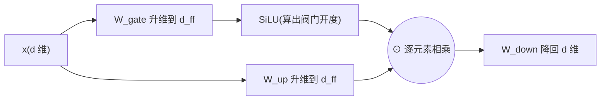

# FFN 与激活函数(SwiGLU / GELU / ReLU²)

> ⚠️ 旧版:本篇写于写作契约确立之前,尚未按新标准审查重写。标准见 docs/05-知识库写作契约.md,样板见「GPU架构与执行模型」。

一句话:**FFN 占了 dense Transformer 约三分之二的参数,是模型的「知识仓库」**;FFN 里唯一的非线性——激活函数——经过十年演化,以 SwiGLU 的门控结构胜出告终,如今几乎所有主流模型的 FFN 和 MoE 专家都是它。

## 一、FFN 是什么:升维、非线性、降维

Transformer 每层由注意力和 FFN(前馈网络)交替组成:注意力负责在 token 之间搬运信息,FFN 则**对每个 token 独立做一次「查资料 + 加工」**——它不看别的 token,只把当前位置的表示变换一遍。经典形式是两层 MLP:

$$
\mathrm{FFN}(x) = W_2\, \sigma(W_1 x)
$$

- $W_1 \in \mathbb{R}^{d_{ff} \times d}$:把 $d$ 维表示**升维**到 $d_{ff}$(经典惯例 $d_{ff} = 4d$);
- $\sigma$:逐元素激活函数,整个 FFN 唯一的非线性来源;
- $W_2 \in \mathbb{R}^{d \times d_{ff}}$:**降维**回 $d$,好接回残差流。

> **类比**:一条「先摊开、再折叠」的流水线。把 $d$ 维的紧凑表示摊开到 4 倍宽的工作台上($W_1$),在宽敞空间里逐个开关筛选($\sigma$),再把有用的部分折叠打包回原宽度($W_2$)。

### key-value memories:知识为什么说存在 FFN 里

Geva et al. 的著名解读:**FFN 就是一个可微的键值存储**。

- $W_1$ 的每一**行**是一个「查询键」(key):检测输入模式,比如「在聊 90 年代的体育」「句子快收尾了」;$\sigma(W_1 x)$ 的每一维就是当前 token 对该模式的命中程度;
- $W_2$ 的每一**列**是一个「知识值」(value):大致对应词表上的一个分布偏移;
- 输出 = 按命中程度加权求和的值:命中哪些键,就取出哪些知识。

> **类比**:图书馆的索引卡系统。$W_1$ 的行是一抽屉索引卡(每张写着一种主题特征),激活值是逐张卡片的匹配度,$W_2$ 的列是卡片背后对应的那本书;一次前向 = 拿当前 token 刷一遍卡片、把匹配上的书按相关度混合借走。

这个视角解释了两件事:其一,**事实性知识主要存在 FFN 权重里**——知识编辑类工作(定位并改写某条事实)就是基于它;其二,**MoE 为什么只拆 FFN 不拆注意力**——要扩容的是「仓库」而不是「搬运工」,把 FFN 复制成 N 个专家、每个 token 只查其中几个,知识容量与每 token 计算量就此脱钩(展开见「MoE基础」篇)。

## 二、激活函数简史:ReLU → GELU → SiLU

| 激活 | 公式 | 特点 | 代表时代 |
|---|---|---|---|
| ReLU | $\max(0, x)$ | 快、简单;零点硬拐角,负半轴完全死区 | 原始 Transformer(2017) |
| GELU | $x \cdot \Phi(x)$ | 平滑,有概率解读 | BERT / GPT-2 / GPT-3 |
| SiLU(Swish) | $x \cdot \sigma(x)$ | 曲线与 GELU 几乎重合,计算更便宜 | SwiGLU 的组件 |

GELU 的概率解读:$\Phi(x)$ 是标准正态的 CDF,GELU 相当于「以 $\Phi(x)$ 的概率保留输入 $x$」的期望——输入越大越可能被放行。把 ReLU 那扇非开即关的硬闸门,换成一扇**按输入大小渐变开度**的软闸门,零点附近处处可导,梯度更顺。SiLU 则用 sigmoid 代替 $\Phi$,形状几乎一样,却省掉了 erf 这种昂贵函数(SiLU 与 GELU 出自同一篇论文)。

> 🖼️ 占位:ReLU / GELU / SiLU / ReLU² 四条曲线对比图(横轴 $x$,纵轴激活值,突出零点附近平滑度与负半轴行为差异)

## 三、SwiGLU:门控结构的胜利

上面的激活都是「一条通路过一道闸门」。GLU(Gated Linear Unit)门控家族换了拓扑:**两条并行投影,一条过激活函数当「阀门」,一条裸投影当「内容」,逐元素相乘**:

$$
\mathrm{SwiGLU}(x) = \left(\mathrm{SiLU}(x W_{gate}) \odot x W_{up}\right) W_{down}
$$

> **类比**:经典 FFN 里,信号既当水又当开关——水流自己拧自己的龙头。SwiGLU 把两件事分开:一条管道专门运水($W_{up}$ 的内容通路),旁边一条细管测完水质去拧阀门($W_{gate} \to \mathrm{SiLU}$);$d_{ff}$ 根水管每根配一个独立阀门,开度由输入现场决定。

SwiGLU 不是孤例而是一族:把阀门里的激活换掉,就得到 GLU 家族的各个变体(同出自 Shazeer 那篇论文):

| 变体 | 阀门激活 | 备注 |
|---|---|---|
| Bilinear | 无(两条投影裸乘) | 最简门控 |
| ReGLU | ReLU | |
| GEGLU | GELU | Gemma 早期代际用过 |
| SwiGLU | SiLU | 胜出者,今日事实标准 |

三个关键点:

- **参数守恒惯例 $d_{ff} = \frac{8}{3}d$**:三个矩阵而非两个,若仍取 $d_{ff}=4d$ 参数会从 $8d^2$ 涨到 $12d^2$;惯例是把 $d_{ff}$ 缩到 $\frac{8}{3}d \approx 2.67d$,使 $3 \cdot d \cdot d_{ff} = 8d^2$ 与经典持平——Llama 系列 $d=4096$ 配 $d_{ff}=11008$ 这类「怪数字」就是 $\frac{8}{3} \times 4096 \approx 10923$ 取整到 256 倍数的产物。
- **门控为什么好**:$\sigma(W_1 x)$ 只能对每一维做固定形状的非线性;门控是**逐维的乘性交互**——内容通路的每一维被另一条「数据依赖」的通路动态缩放,等价于一个由输入现算出来的特征选择器,表达能力更强,实测困惑度稳定更低。
- **著名的自嘲**:提出 SwiGLU 的 Shazeer 论文只有实验、没有理论,结论里写道:对这些架构为何有效不作解释,其成功「一如既往,归于神圣恩典」("divine benevolence")。十几年过去,激活函数选型依然是经验跑赢理论。

**当今地位**:SwiGLU(用 SiLU 的门控 MLP)是**事实标准**——手册横扫的开源模型里,几乎所有 dense FFN 与 MoE 专家都是它(个别用同族的 GeGLU,把阀门里的 SiLU 换成 GELU)。dense 主干上的激活函数之争基本宣告终结。

## 四、例外角:谁在不用 SwiGLU,图什么

手册 5.2 记录的两个现役例外:

- **Nemotron 3 Nano 4B 用 ReLU²(平方 ReLU)**:$\max(0,x)^2$,Primer 论文用架构搜索找出来的。两个好处:一是 **kernel 友好**——一次 max 一次乘,没有 exp/erf 这类超越函数,极好写高效 fused kernel;二是**激活天然稀疏**——负半轴精确为 0(GELU/SiLU 只是接近 0),配合稀疏感知的推理 kernel 可以整片跳过零值。
- **Gemma 4 E2B 用双倍宽的 GELU MLP**:退回无门控的经典两层结构,把 $d_{ff}$ 翻倍补回容量,换取端侧部署实现上的简单。
- 另有 DECO 提出 NormSiLU,尚未进入主流模型。

**为什么是小模型在换?** 小模型是「试验田」:训一次便宜、评测周期短,敢做单变量的激进尝试,验证过硬再进旗舰——Qwen3-Next 验证 GDN 后 Qwen3.5 采用、Kimi Linear 验证 KDA 后 K3 采用,都是这条路。手册明确把 ReLU² 列入「大概率 6–12 个月后进旗舰」的候选(规律详见「架构总览」篇的「小模型试验 → 旗舰采用」)。

## 五、维度设计与参数账

| 配置 | FFN 参数量 | 取值惯例 |
|---|---|---|
| 经典 2 矩阵(ReLU/GELU) | $2 \cdot d \cdot d_{ff}$ | $d_{ff}=4d \Rightarrow 8d^2$ |
| SwiGLU 3 矩阵 | $3 \cdot d \cdot d_{ff}$ | $d_{ff}=\frac{8}{3}d \Rightarrow 8d^2$(守恒) |

- **与注意力的比例**:MHA 四个投影矩阵共 $4d^2$,FFN 是 $8d^2$——每层约 $\frac{2}{3}$ 的参数在 FFN,这就是开头那句「三分之二」的账;换 GQA 后 K/V 投影缩小,FFN 占比还会更高。
- 实际 $d_{ff}$ 都会取整到硬件友好的数(64/128/256 的倍数);也有模型刻意加宽,如 Llama 3 8B 用了 $3.5d$。
- **MoE 专家 = 缩小版 SwiGLU FFN**:同样的 gate/up/down 三矩阵结构,只是 $d_{ff}$ 小得多(细粒度专家的 $d_{ff}$ 甚至远小于 $d$);本篇关于 FFN 的所有结论对专家平移即用。

## 六、细节与坑

- **激活值是训练显存大头**:$d_{ff}$ 是全网络最宽处,SwiGLU 反向传播还要同时留住 gate 和 up 两条 $d_{ff}$ 宽的中间结果,所以 FFN 是 activation checkpointing(只存边界、反向重算)的重点照顾对象——省的是这批激活,代价是多算一遍前向。
- **张量并行的整除约束**:TP 沿 $d_{ff}$ 维切分(gate/up 列切、down 行切),$d_{ff}$ 必须被 TP 度整除;$\frac{8}{3}d$ 这类怪数字最终都要向「能整除、对齐硬件 tile」妥协,这是各家 $d_{ff}$ 数值五花八门的工程原因。
- **激活离群值与量化**:LLM 激活分布带长尾,少数通道会冒出量级大好几个数量级的离群值,门控的逐元素乘法尤其容易放大 down 投影输入端的尖峰;per-tensor 静态量化会被直接撑爆,所以 W8A8/FP8 实践中常配 per-channel/per-token 缩放,或 SmoothQuant 式地把离群难度从激活侧挪到权重侧。

## 七、面试考点串联

1. 默写 SwiGLU 公式,说清 gate/up/down 三个矩阵各自的角色 →「三、SwiGLU」
2. 为什么 $d_{ff}$ 从 $4d$ 变成 $\frac{8}{3}d$ →「三、参数守恒」+「五、参数账」
3. LLM 的知识主要存在哪里?依据是什么 →「一、key-value memories」
4. MoE 为什么只拆 FFN 不拆注意力 →「一、key-value memories」+「MoE基础」篇
5. GELU 比 ReLU 好在哪?SiLU 和 GELU 什么关系 →「二、简史」
6. 有哪些模型不用 SwiGLU、各图什么 →「四、例外角」
7. FFN 在显存、并行切分、量化里各埋着什么坑 →「六、细节与坑」

## 相关文献

- GELU(同文提出 SiLU)— [arXiv:1606.08415](https://arxiv.org/abs/1606.08415)
- GLU Variants Improve Transformer(SwiGLU 提出,Shazeer)— [arXiv:2002.05202](https://arxiv.org/abs/2002.05202)
- Transformer Feed-Forward Layers Are Key-Value Memories — [arXiv:2012.14913](https://arxiv.org/abs/2012.14913)
- Primer(架构搜索发现 ReLU²)— [arXiv:2109.08668](https://arxiv.org/abs/2109.08668)
