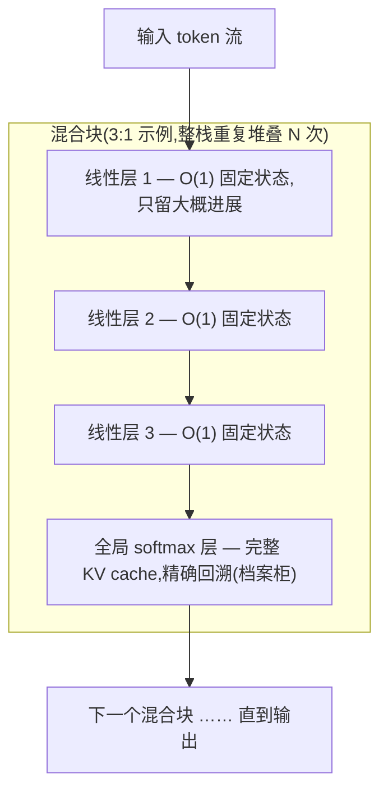

# Hybrid 注意力(线性 + softmax 混合)

> ⚠️ 旧版:本篇写于写作契约确立之前,尚未按新标准审查重写。标准见 docs/04-知识库写作契约.md,样板见「GPU架构与执行模型」。

一句话:**大部分层用便宜的线性注意力,少数层保留 softmax 注意力的精确回溯**——买的是长上下文的吞吐与显存,卖的是一部分精确检索能力。2026 年的 Qwen3.5/3.6、Kimi Linear/K3、Ling 2.5、Nemotron 3 都押在这条路上,但它不是唯一答案(见后文 MiniMax 反例)。

## 一、核心矛盾与解法

两个极端各有结构性缺陷(两边的机制细节分别见「线性注意力」与「GQA」「MLA」各篇):

- **纯 softmax 注意力**:KV cache 随序列长度线性增长。GQA/MLA 这类压缩只能减小常数,改变不了增长率;
- **纯线性注意力**:只维持一个固定大小的状态,新 token 来了就更新它。缓存 $O(1)$,但状态装不下所有细节,必须决定忘掉什么——「大海捞针」类精确检索是经典弱项。

$$
\text{softmax:}\ O(L)\ \text{缓存增长} \quad\longrightarrow\quad \text{线性:}\ O(1)\ \text{固定状态}
$$

**混合的解法**:大部分层用线性(便宜),每隔几层插一个 softmax 层(保留对任意历史位置的精确访问)。

> **类比**:一个团队里大部分人只记得「项目大概进展」,但每隔几个人留一个**有完整档案柜**的人。需要查具体某天发生什么时,问他。整个团队既跑得快(不是人人都背着档案柜),又没丢掉查档能力。

**有趣的发现**:混合架构不只是「接近」纯 softmax——研究发现它在**检索和长度外推上甚至能超过**纯 softmax。原因猜测:线性层承担了「压缩总结」的工作,让 softmax 层能把有限的注意力预算集中花在真正需要精确定位的地方。用类比说:档案柜管理员不用再操心日常琐碎,专职查档,反而查得更准。

## 二、Raschka 的关键提醒:看比例,别看标签

**「层比例」比「hybrid attention」这个标签本身信息量大得多。** 说某个模型「用了 hybrid」约等于没说,要问的是 **3:1 还是 7:1**:

- 比例越激进(线性层占比越高),缓存越省、吞吐越高;
- 但「档案柜」越稀疏,精确检索的容错越小。

下面的表里,同挂一个「hybrid」标签,KV/token 从 6 KiB 到 30 KiB 能差 5 倍——不看比例和机制组合,这个标签什么也预测不了。

## 三、各家比例大表

| 模型 | 线性:softmax | 层数拆解 | 线性机制 | softmax 机制 | KV/token |
|---|---|---|---|---|---|
| Qwen3-Next 80B-A3B | 3:1 | 36 GDN + 12 门控注意力 | Gated DeltaNet | Gated Attention | 24 KiB |
| Qwen3.5 397B-A17B | 3:1 | 45 GDN + 15 | Gated DeltaNet | Gated Attention | 30 KiB |
| Qwen3.6 35B-A3B | 3:1 | 30 GDN + 10 | Gated DeltaNet | Gated Attention | 20 KiB |
| Kimi Linear 48B-A3B | ~3:1 | 20 KDA + 7 MLA | KDA | 门控 MLA(NoPE) | **7.9 KiB** |
| Ling 2.5 1T | **7:1** | 70 Lightning + 10 MLA | Lightning Attention | MLA | 11.2 KiB |
| Nemotron 3 Nano 30B | ~4:1 | 23 Mamba-2 + 6 GQA + 23 MoE | Mamba-2 | GQA | **6 KiB** |
| Nemotron 3 Super 120B | 5:1 | 40 Mamba-2 + 8 GQA + 40 MoE | Mamba-2 | GQA | 8 KiB |
| Nemotron 3 Nano 4B | ~5:1 | 21 Mamba-2 + 4 GQA + 17 FFN | Mamba-2 | GQA | 16 KiB |
| Kimi K3 2.8T | 未公开 | — | KDA | 门控 MLA | — |

读表注意:Nemotron 3 的「层数拆解」里 MoE/FFN 是独立的层(如 Nano 30B 的 23 Mamba-2 + 6 GQA + 23 MoE 加起来正好 52 层),比例只数线性:softmax。

四个值得注意的观察:

1. **3:1 是事实标准**。Qwen 全系和 Kimi Linear 独立收敛到同一个比例,这不像巧合;
2. **NVIDIA 走得最极端**。Nemotron 3 Nano 的 52 层里只有 **6 层**是注意力。它敢这么做,可能和 NVIDIA 有自家推理栈、能吃下 Mamba 内核优化红利有关;
3. **Ling 2.5 用 7:1,激活参数却高达 63B**——它做了个不同的取舍:省下的缓存预算换成了更宽的计算路径,「线性层多」与「激活参数多」是一枚硬币的两面;
4. **Kimi Linear 把两半都换了**:线性半边从 GDN 换成遗忘门更细粒度(每特征通道一个)的 KDA,softmax 半边从普通注意力换成门控 MLA,且 MLA 层用 NoPE(不加位置编码)。这个组合把 KV 压到 7.9 KiB/token。

## 四、堆叠结构示意

以 3:1 为例,整个网络就是下面这个混合块的重复堆叠:

线性层负责一路压缩总结,softmax 层每隔几层做一次「全局对账」。整个模型的 KV cache 只由少数 softmax 层贡献,这就是省显存的全部来源。

## 五、反方证据:MiniMax 掉头回全注意力

这是关于 hybrid 最重要的一条反例,不能跳过。

**时间线**:MiniMax-01 是最早的大规模线性混合模型之一(1:7 的 Lightning:MLA)。但从 **M2 开始,MiniMax 掉头回到了全注意力 GQA**,M2.5、M2.7 一路保持。Raschka 的模型卡写得很直白:MiniMax M2.5 **刻意避开**滑动窗口和线性注意力混合,就用朴素的 62 层 GQA。

**结果**:M2.7 的 AA 综合分 38.1、Agent 分 61.5,在所有开源模型里名列前茅——**超过了同期用 hybrid 的 Qwen3.5(32.0)**。最早吃螃蟹的厂商退了出来,反而拿到了顶级成绩。

三条教训:

1. **hybrid 不是免费午餐**。它买的是长上下文的吞吐和显存,卖的是(部分)精确检索能力,外加训练/推理栈的复杂度——线性内核、混合调度都要自己啃;
2. **如果目标上下文是 200k 而不是 1M,全注意力可能依然是更好的选择**。M2 系列上下文 196k,在这个长度上 GQA 的 248 KiB/token 还扛得住;
3. **架构选择与产品定位耦合**,不是纯技术优劣。MiniMax 主打 coding 和 agent——这类任务要在几十万 token 里**精确定位某段代码片段**,恰好踩在线性注意力最弱的点上。

所以「最新的基础模型都用 hybrid attention」这个说法不准确。准确的说法是下一节的三条并行路线。

## 六、三条路线,各自下注

| 路线 | 代表 | 赌的是什么 |
|---|---|---|
| **Hybrid 线性** | Qwen3.5/3.6、Kimi Linear/K3、Ling 2.5、Nemotron 3 | 上下文会一直变长(→1M),必须干掉线性增长的缓存 |
| **压缩 + 稀疏 softmax** | DeepSeek V3.2/V4、GLM-5/5.1 | 保留 softmax 的表达力,靠压缩和稀疏把成本压下去 |
| **保守全注意力** | MiniMax M2.x、Mistral | 200k 够用了,架构简单换来训练稳定和实现可靠 |

第二条路线(DSA/CSA/HCA)见「稀疏注意力」篇;三条路线的全景对照见「架构总览」篇。

## 七、细节与常见坑

- **比例是训练时定死的,不能事后调**。哪层线性、哪层 softmax 是结构超参,权重就是按这个结构训出来的;推理时没有「调档」一说,想换比例等于重训;
- **全局层的 KV cache 仍随长度线性涨(木桶效应)**。$O(1)$ 只属于线性层,整个模型的缓存 = softmax 层数 × 每 token 缓存 × 序列长度,依然是 $O(L)$——只是系数小了一个量级。Kimi Linear 的 7.9 KiB/token 基本就是那 7 层门控 MLA 贡献的,1M 上下文下这笔账仍要算;
- **评测要专门看捞针类任务**。检索能力的损失会被综合平均分稀释,必须单独看大海捞针/长上下文检索类基准——这正是 MiniMax 那三条教训的来源;
- **系统级吞吐宣称不能孤立归因**。Ling 2.5 宣称 32k 序列下吞吐是 Kimi K2 的 3.5 倍,但这是厂商自报的**系统级**对比,混着完整实现和推理栈,不能把 3.5× 全记在 Lightning Attention 头上。

## 八、面试考点串联

高频问法(与题库联动的切片点):

1. 为什么混合架构在检索/外推上反而能**超过**纯 softmax →「一、有趣的发现」(线性层压缩总结,softmax 层预算花在刀刃上);
2. 线性与 softmax 层的比例怎么定、业界都是多少 →「二、三」(3:1 事实标准;Ling 7:1、Nemotron 更极端的例外及其理由);
3. MiniMax 为什么从 hybrid 掉头回 GQA、说明什么 →「五」(三条教训,重点是上下文目标与产品定位);
4. 一个 hybrid 模型的 KV 预算怎么估 →「七」(只数 softmax 层;KV/token × 序列长度,警惕木桶效应);
5. GDN / KDA / Lightning / Mamba-2 有什么区别 → 见「线性注意力」篇(本篇只看它们怎么被混着用)。

## 相关文献

- MiniMax-01(最早的大规模线性混合模型之一)— [arXiv:2501.08313](https://arxiv.org/abs/2501.08313)
- The MiniMax-M2 Series(掉头回全注意力 GQA 的反方证据)— [arXiv:2605.26494](https://arxiv.org/abs/2605.26494)
- Kimi Linear(KDA + 门控 MLA 的 ~3:1 混合)— [arXiv:2510.26692](https://arxiv.org/abs/2510.26692)
- Jamba(SSM-Transformer 混合先例)— [arXiv:2403.19887](https://arxiv.org/abs/2403.19887)
- Samba(Mamba + 滑动窗口注意力的简单混合)— [arXiv:2406.07522](https://arxiv.org/abs/2406.07522)
