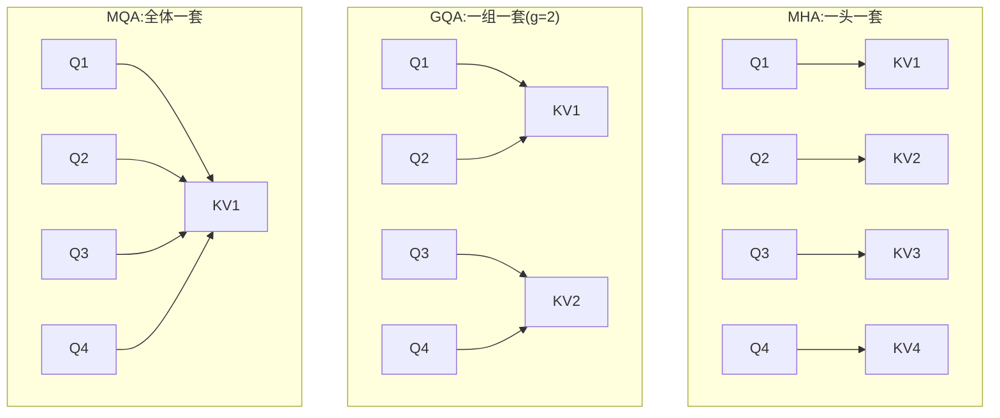

# GQA(MHA → MQA → GQA 谱系)

> ⚠️ 旧版:本篇写于写作契约确立之前,尚未按新标准审查重写。标准见 docs/04-知识库写作契约.md,样板见「GPU架构与执行模型」。

一句话:**让多个 query 头共享同一套 K/V 头,把 KV cache 按组数直接砍下来**——不改注意力的数学本质、不加新模块,是 2023 年以来开源模型的绝对主流,到 2026 年依然是「保守派」的默认选择。

> **类比**(架构手册的说法):MHA 是每个学生配一个专属图书管理员;MQA 是全校共用一个;GQA 是每个班配一个。学生(query 头)各有各的问题,但管理员(K/V 头)维护的书架索引大同小异——所以砍管理员比砍学生划算。

## 一、先讲清 MHA 与 KV cache

### 注意力公式与多头拆分

单头注意力:

$$
\mathrm{Attention}(Q, K, V) = \mathrm{softmax}\!\left(\frac{QK^\top}{\sqrt{d_k}}\right)V
$$

- $Q$(query):当前位置「想找什么」;$K$(key):每个历史位置的「索引标签」;$V$(value):对应位置的「实际内容」;
- $\sqrt{d_k}$:缩放因子,防止点积随维度增大而方差爆炸、softmax 进入饱和区。

多头 = 把隐藏维切成 $h$ 份,各自在低维子空间里独立做一遍注意力再拼回:

$$
\mathrm{head}_i = \mathrm{Attention}(XW_i^Q,\ XW_i^K,\ XW_i^V),\qquad \mathrm{MHA}(X)=\mathrm{Concat}(\mathrm{head}_1,\dots,\mathrm{head}_h)\,W^O
$$

每个头学一种「看法」(有的盯语法、有的盯指代)。**MHA 里每个 query 头都配一套自己的 $W_i^K, W_i^V$**——这正是后面动刀的地方。

### KV cache:存下来,别重算

自回归生成第 $t$ 个 token 时,前 $t-1$ 个位置的 K、V 与上一步完全相同,没必要重算——**存起来复用,这就是 KV cache**。代价是它随上下文线性增长,每 token 的缓存(手册 2.1):

$$
\text{KV cache 每 token} = L \times n_{kv} \times d_h \times 2 \times b
$$

即 层数 $L$ × KV 头数 $n_{kv}$ × 头维度 $d_h$ × 2(K 和 V 各一份)× 每元素字节数 $b$(bf16 为 2);乘上序列长度 $S$ 就是总量。

这笔账有多痛:Gemma 3 27B 每 token 要 496 KiB,128k 上下文 ≈ 62 GB——一张 80 GB 的 H100 光缓存就吃掉大半,权重还没放。而且 decode 每一步都要把整个 cache 从显存完整读一遍,是纯内存带宽开销,与算力无关。**MQA/GQA 砍的就是公式里的 $n_{kv}$。**

## 二、MQA:一步砍到底

**MQA(Multi-Query Attention)**,Shazeer 2019 提出:$h$ 个 query 头**全部共用一套 K/V**($n_{kv}=1$)。

- 收益:KV cache 直接变成 MHA 的 $1/h$,decode 的带宽压力同比例下降;
- 代价:**质量掉得比较明显**,训练也更易不稳。所有头被迫用同一份「索引 + 内容」,头与头之间「检索什么」的多样性没了,信息瓶颈全压在唯一一套 KV 投影上——全校共用一个图书管理员,他的编目方式不可能同时适合所有人。

## 三、GQA:分组折中

### 机制与谱系

**GQA(Grouped-Query Attention)**把 $h$ 个 query 头分成 $g$ 组,**每组共用一套 K/V**($n_{kv}=g$):

$$
\frac{\text{GQA 缓存}}{\text{MHA 缓存}} = \frac{g}{h}
$$

它是一个谱系而非单点:**$g=h$ 退化为 MHA,$g=1$ 退化为 MQA**,中间任取。典型配置是 4:1 到 8:1(几个 query 头共用一套 KV),也有更激进的:Qwen3 235B 是 64Q:4KV = 16:1;Llama 3 全系固定 8 个 KV 头,8B/70B/405B 的组比分别为 4:1 / 8:1 / 16:1。

### 为什么几乎无损

MHA 训出来的多套 K/V 头**冗余度很高**:不同头的 key/value 投影学到的内容大量重叠,真正需要多样性的是「问什么」(Q),而不是「书架怎么编目」(K/V)。GQA 保留少数几套不同的 KV 子空间就足以撑住绝大部分表达力——质量随 $g$ 下降的曲线长期平坦,只有逼近 $g=1$(MQA)才明显掉头。

### uptraining:旧模型也能低成本改造

GQA 论文的另一半贡献:不必从头训。拿现成 MHA checkpoint,把每组内的 K/V 头**平均池化**成一套作为初始化,再用**原预训练约 5% 的算力**继续训练(uptraining),即可得到接近 MHA 质量、接近 MQA 速度的模型。迁移成本低到「没有借口不用」。

## 四、数字:2026 年在役的 GQA 模型

取自架构手册 3.1 表(bf16,KV/token 越小越好):

| 模型 | 规模(总/激活) | 层结构 | KV/token | 上下文 |
|---|---|---|---|---|
| Qwen3 235B-A22B | 235B / 22B | 94 层 GQA + QK-Norm | 188 KiB | 128k |
| GLM-4.5 / 4.7 | 355B / 32B | 92 层 GQA + QK-Norm | 368 KiB | 128k / 203k |
| MiniMax M2 / M2.5 / M2.7 | 230B / 10B | 62 层 GQA + QK-Norm | 248 KiB | 196k |
| Grok 2.5 | 270B | 64 层 GQA | 256 KiB | 131k |
| Llama 4 Maverick | 400B / 17B | GQA,36 分块 + 12 全局 | 192 KiB | 1M |
| GPT-OSS 120B | 117B / 5.1B | GQA + sink,18 SWA + 18 全局 | 72 KiB | 128k |

拿 Qwen3 235B 验一下第一节的公式:94 层 × 4 个 KV 头 × 128 维 × 2(K、V)× 2 字节 = 192,512 B ≈ **188 KiB**,对上了。若它仍是 64 头 MHA,这个数要 ×16 ≈ 3 MiB/token,128k 上下文约 376 GB——GQA 一刀省出 16 倍。

对照组:MLA 阵营的 DeepSeek V3(671B,61 层)每 token 只要 68.6 KiB,参数量近 GLM-4.5 的两倍、缓存却只有其五分之一——「压 KV 头数」之外还能「压每头的表示」,那条路线见 MLA 篇。

## 五、为什么 2026 年仍是「保守派默认」

手册对 2026 的总结是三条并行路线:hybrid 线性、压缩 + 稀疏 softmax、保守全注意力——GQA 是第三条的基石。它的护城河不在数学而在工程:

- **实现简单、训练稳**:相对 MHA 只是改了 KV 投影的形状,没有新算子、没有新超参;
- **生态全兼容**:FlashAttention、vLLM/SGLang 等推理引擎、各类微调栈都把 GQA 当一等公民支持,MLA / 线性注意力则都需要专门适配;
- **反例实锤**:MiniMax-01 曾是最早的大规模线性混合模型之一,但从 M2 起**掉头回纯 GQA**(62 层),M2.7 的 Agent 分 61.5 在开源模型里名列前茅——在 196k 上下文量级上,朴素 GQA 的 248 KiB/token 还扛得住,换来训练稳定与精确检索能力不打折。来龙去脉见 Hybrid注意力 篇。

## 六、细节与坑

- **$g$ 要迁就张量并行(TP)**:推理时注意力头按 TP 度切到多张卡,**KV 头数最好能被 TP 度整除**;若 TP 度 > $n_{kv}$,引擎只能把 KV 头整头复制到多卡,复制掉的正是 GQA 省下的显存。所以 $n_{kv}$ 几乎都取 2 的幂(4/8/16),Llama 3 固定 8 个 KV 头正好对应 TP=8 时一卡一头。
- **组内是「共享」不是「平均」**:前向把共享的 K/V broadcast 给组内每个 query 头,反向梯度从组内所有头汇聚回同一套 KV 权重;实现用 `repeat_kv`/broadcast 视图,别真的物化复制张量,否则显存收益归零。
- **QK-Norm 常配套**:上表里 Qwen3、GLM-4.5、MiniMax M2 全是「GQA + QK-Norm」——算分前对 Q、K 各做一次 RMSNorm 防注意力 logits 爆炸,已接近标配,细节见 注意力配件 篇。
- **GQA 改不了增长率**:它把缓存砍成 $g/h$,但总量仍随序列长度**线性增长**;想动增长率要靠滑动窗口 / 稀疏 / 线性注意力那些路线(见 Hybrid注意力 篇)。

## 七、面试考点串联

1. 默写注意力公式与多头拆分,说清 $\sqrt{d_k}$ 的作用 →「一、注意力公式与多头拆分」
2. KV cache 是什么、给一份 config 现场算每 token 缓存 →「一、KV cache」公式 +「四」的 Qwen3 验算
3. MQA 为什么明显掉质量、GQA 为什么几乎无损 →「二」+「三、为什么几乎无损」
4. $g$ 怎么选:质量、显存、TP 整除三方权衡 →「三、机制与谱系」+「六」第一条
5. 手上有 MHA 旧模型,怎么低成本改成 GQA →「三、uptraining」(约 5% 算力)
6. GQA 与 MLA 怎么取舍、为什么 2026 还有旗舰坚持纯 GQA →「四」对照 +「五」

## 相关文献

- Attention Is All You Need(Transformer 与 MHA 原论文)— [arXiv:1706.03762](https://arxiv.org/abs/1706.03762)
- Fast Transformer Decoding: One Write-Head is All You Need(Shazeer,MQA 提出)— [arXiv:1911.02150](https://arxiv.org/abs/1911.02150)
- GQA: Training Generalized Multi-Query Transformer Models from Multi-Head Checkpoints(GQA 与 uptraining)— [arXiv:2305.13245](https://arxiv.org/abs/2305.13245)
- The Llama 3 Herd of Models(GQA 大规模实践)— [arXiv:2407.21783](https://arxiv.org/abs/2407.21783)
