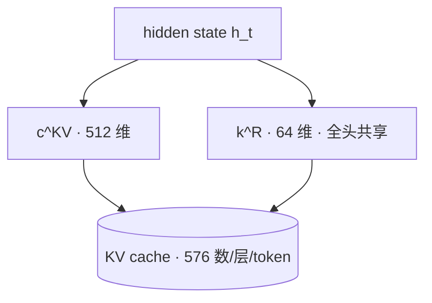

# MLA(Multi-head Latent Attention)

> 🔴 重点考点:本篇是当前复习重点,文末「面试考点串联」给出问法对照。

一句话:**不存完整的 K/V,把它们压成一个低维「潜在向量」存进缓存,用的时候再投影回去**——DeepSeek 的招牌注意力,出自 DeepSeek-V2,V3/R1 一路沿用,如今已是「压缩派」的事实标准。

> **类比**:GQA 是「几个人共用一本书」,MLA 是「把书压缩成摘要存着,要用时再展开」。更妙的是,靠矩阵吸收技巧,读者后来学会了直接读摘要——**连「展开」这一步都省了**。

先澄清一个常见误写:MLA 的全称是 **Multi-head Latent Attention**,不是 Multi-Loop Attention。

## 一、动机:decode 的瓶颈是搬字节,不是算数

自回归生成时每个历史 token 的 K/V 都要缓存,总量随上下文线性增长(完整公式与阶段分析见 KV共享注意力 篇):

$$
\text{KV bytes} = 2 \times B \times L \times S \times \underbrace{n_{kv} \times d_h}_{\text{MLA 压这里}} \times b
$$

也就是说,GQA 减小的是括号里的 $n_{kv}$(减头数),而 MLA 换了个方向:**把 $n_{kv} \times d_h$ 这一整块低秩压缩成一个远小于它的 $d_c$**(压维度)。

直观的数:Gemma 3 27B 每 token 要 496 KiB,单条 128k 上下文约 62 GiB,一张 80 GB 的 H100 光缓存就吃掉大半。

> 🖼️ 占位:DeepSeek-V2 论文中 MHA / GQA / MQA / MLA 四种方案「缓存里存什么」的对比示意图

## 二、核心机制:压缩、缓存、解压

### 下投影:缓存里只存潜在向量

对每个 token 的 hidden state $h_t \in \mathbb{R}^{d}$,先做一次低秩下投影:

$$
c_t^{KV} = W^{DKV} h_t \in \mathbb{R}^{d_c}, \qquad d_c \ll n_h d_h
$$

**进缓存的只有这个 $c_t^{KV}$。** DeepSeek-V2/V3 里 $d_c = 512$,而完整的 K、V 各是 $n_h d_h = 128 \times 128 = 16384$ 维——**一个 512 维向量同时顶替了 K、V 两份 16384 维的存储**。

### 上投影:用时再还原出各头的 K/V

$$
k_t^C = W^{UK} c_t^{KV}, \qquad v_t^C = W^{UV} c_t^{KV}
$$

每个头有自己的 $W^{UK}$、$W^{UV}$ 切片,所以从同一个 latent 里能读出**各头不同的**有效 K/V——这正是它和 MQA 的分水岭:MQA 让所有 query 头直接吃同一份 K/V,MLA 只是让它们共用同一份**压缩原料**。

query 也做同样的低秩压缩($c_t^Q = W^{DQ} h_t$,$q_t^C = W^{UQ} c_t^Q$),但 query 不进缓存——**这一步省的不是缓存,是训练时的激活显存**。

### 矩阵吸收:decode 时根本不用真的解压

注意力分数里,上投影矩阵正好夹在中间,可以预先合并:

$$
(q_t^C)^\top k_s^C = (W^{UQ} c_t^Q)^\top (W^{UK} c_s^{KV}) = (c_t^Q)^\top \underbrace{(W^{UQ})^\top W^{UK}}_{\text{可预先合并进 query 侧}} c_s^{KV}
$$

这个式子说的是:既然 $W^{UQ}$ 和 $W^{UK}$ 中间没有别的东西,就把它俩提前乘成一个固定矩阵贴到 query 那边,历史 token 的 latent 直接参与计算,不必先还原成 K。

value 侧同理:注意力输出要过输出投影 $W^{O}$,而 $v = W^{UV} c^{KV}$,所以 $W^{UV}$ 可以吸收进 $W^{O}$。

于是 decode 时**完整 K/V 从头到尾不需要被展开**,注意力直接在潜在空间里算。数学上它等价于一个「所有 query 头共享同一份潜在 K/V」的超宽 MQA,但每个头经由各自的 $W^{UK}$ 切片读出不同的有效 K,**逐头表达力没有丢**。

## 三、RoPE 的麻烦与 decoupled RoPE(面试高频)

RoPE 是位置相关的旋转矩阵 $R_t$,它恰好插在要被吸收的两个矩阵中间:

$$
q_t^\top k_s = (c_t^Q)^\top (W^{UQ})^\top R_t^\top R_s W^{UK} c_s^{KV} = (c_t^Q)^\top (W^{UQ})^\top R_{s-t} W^{UK} c_s^{KV}
$$

问题就在这:中间那坨 $(W^{UQ})^\top R_{s-t} W^{UK}$ **随相对位置 $s - t$ 变化**,每对 token 都不一样,没法预先合并成一个固定矩阵——**旋转和吸收天然不兼容**。

DeepSeek 的解法是 **decoupled RoPE(解耦旋转位置编码)**:潜在部分完全不加位置编码,另外单独留一小段「专门携带 RoPE 的 key」,与潜在部分拼接:

$$
q_{t,i} = [\,q_{t,i}^C;\ q_{t,i}^R\,], \qquad k_{s,i} = [\,k_{s,i}^C;\ k_s^R\,], \qquad k_s^R = \mathrm{RoPE}(W^{KR} h_s)
$$

意思是把 Q、K 各劈成两段:一段走低秩压缩、可以吸收;另一段专门扛位置信息、不吸收。注意力分数就是两段内积相加。

- $k^R$ 维度很小(V2/V3 里 $d_h^R = 64$),而且**所有头共享一份**(MQA 式),直接进缓存;
- 于是每层每 token 的缓存 = $d_c + d_h^R = 512 + 64 = 576$ 个数。

**别漏算这 64 维**——它是缓存里的「隐藏行李」,漏掉就得不出下面的 68.6 KiB。

## 四、算账:省多少、亏多少

**省的账**:DeepSeek V3 671B 有 61 层,每 token 缓存 $61 \times 576 \times 2\,\text{B} = 70{,}272\,\text{B} \approx 68.6$ KiB。对比 Gemma 3 27B 的 496 KiB——**参数量大 25 倍,缓存反而小 7 倍**。

**亏的账**:多了压缩、解压两次矩阵乘,prefill 和训练的注意力 FLOPs 不降反微升。

为什么仍然划算?因为**两个阶段的瓶颈不一样**:

| 阶段 | 瓶颈 | MLA 的影响 |
|---|---|---|
| Prefill | 算力(一次处理很多 token,矩阵够大) | 额外投影**是净成本**;收益只在少写缓存、省显存 |
| Decode | **内存带宽**(每步读全部历史缓存) | 要搬的字节砍到约 1/7,多出的矩阵乘吃的是**本来就闲着的算力** |

所以 MLA 的本质是**拿富余的 FLOPs 换稀缺的带宽**。上下文越长、并发越高,这笔交易越赚;短序列小批量下它甚至可能不划算。

## 五、数据流:三条路径,写一次读两种

缓存写进去之后,读的方式分两种:

| 路径 | 什么时候走 | 怎么算 |
|---|---|---|
| 展开路径 | 训练 / prefill(算力富余) | 用 $W^{UK}$、$W^{UV}$ 从 latent 还原出完整 K/V,走标准多头注意力 |
| 吸收路径 | decode(带宽受限) | 不还原;$W^{UK}$ 吸进 query 侧、$W^{UV}$ 吸进输出投影,直接在潜在空间算 |

**推理引擎必须同时维护这两套逻辑**,这也是 MLA 实现门槛高于 GQA 的主要原因。

## 六、谁在用

| 模型 | 配置 | KV/token |
| --- | --- | --- |
| DeepSeek V3 / R1 / V3.2 | 61 层 MLA(V3.2 叠加 DSA 稀疏) | 68.6 KiB |
| Kimi K2 / K2.5 / K2.6 | 1T 参数,61 层 MLA(与 V3 同骨架) | 68.6 KiB |
| GLM-5 / 5.1 | 78 层 MLA + DSA | 87.8 KiB |
| Mistral Large 3 | 61 层 MLA | 68.6 KiB |
| Mistral Small 4 | 36 层 MLA | 22.5 KiB |
| Kimi Linear / K3 | KDA 线性层与门控 MLA 混合(约 3:1) | 7.9 KiB / 未公开 |
| Ling 2.5 | 70 Lightning + 10 MLA(7:1) | 11.2 KiB |
| 其他 | Sarvam 105B、LongCat 系(RoPE/NoPE 混用) | — |

最有意思的组合是 **Kimi Linear:MLA 层干脆用 NoPE**(不加位置编码)——位置信息全交给 KDA 线性层承担,连 decoupled RoPE 这块补丁都省了,吸收路径更干净。NoPE 与层间分工见 RoPE 篇,KDA 见 线性注意力 篇,混合比例见 Hybrid注意力 篇。

## 七、延伸:CCA——干脆在压缩空间里算注意力

MLA 有件「没做完的事」:它只把 KV **存**成压缩形式,算注意力时还是要展开回完整头空间——缓存省了,prefill 和训练的 FLOPs 一点没省,还因上投影略贵。

**CCA(Compressed Convolutional Attention,压缩卷积注意力)**,Zyphra 提出,更激进:Q/K/V 全部下投影,**整个注意力运算直接在压缩空间里做**,算完再展开。缓存、参数、注意力 FLOPs 一起省。

- 名字里的「卷积」是补丁:压缩让 Q、K 变窄、表达力下降,于是加一个轻量卷积给压缩后的 Q、K 补充局部上下文;
- **卷积只加在 Q、K 上,不加在 V 上**——因为 Q、K 决定「看哪里」需要精细,V 只是「被加权平均的内容」,精度要求低;
- 与头共享(GQA)正交,可组合成 CCGQA;
- 采用者:ZAYA1-8B(在 AMD GPU 上训练的 8.4B MoE)。论文自报同压缩率下优于 MLA/GQA,**但没有第三方复现**,当成值得关注的方向而非定论。

## 八、细节与常见坑

### MLA vs GQA:压维度,不是减头数

| 维度 | GQA | MLA |
| --- | --- | --- |
| 思路 | 减少 KV 头数(组内共享 K/V) | 低秩压缩整个 KV 表示 |
| 缓存内容 | 若干组完整 K/V 头 | 一个 $c^{KV}$ + 一小段 RoPE key |
| 逐头表达力 | 组内共享,打折 | 每头读出不同的有效 K/V,保留 |
| 额外计算 | 无 | 多两次投影(decode 可吸收) |
| 实现门槛 | 标准 FlashAttention 即可 | 需专用 kernel |

同等缓存预算下 MLA 质量通常更好(DeepSeek-V2 自报甚至略优于原版 MHA),代价是实现复杂度。

### MLA 的低秩和 LoRA 的低秩,不是一回事

两者都叫「低秩」,但作用对象完全不同——这是高频混淆点:

| | MLA | LoRA |
|---|---|---|
| 低秩作用在 | **激活**(K/V 的表示) | **参数增量**($\Delta W = BA$) |
| 目的 | 压缩 KV cache 与激活显存 | 减少可训练参数与优化器状态 |
| 是否属于模型结构 | 是,永久存在于前向路径 | 否,推理时可合并回主权重 |
| 什么时候起作用 | 训练和推理都在 | 主要在微调阶段 |

一句话:**MLA 压的是「算出来的东西」,LoRA 压的是「要学的东西」。**

### 其他坑

- **对推理栈有硬要求**:吸收后的注意力形状特殊(单份 576 维共享 KV),需要专用 kernel。DeepSeek 开源了 FlashMLA,vLLM/SGLang 均有 MLA 后端;换用小众引擎前先确认支持。
- **低秩不是免费的**:$d_c$ 是信息瓶颈,压得太狠伤容量,512 这个数是训练配方的一部分,不是随手调的推理参数。
- **改造不了现成模型**:训好的 GQA 模型不能零成本换成 MLA,需要权重转换加继续训练。

## 九、面试考点串联

| 高频问法 | 本文哪一节 |
|---|---|
| MLA 和 GQA 都省 KV cache,本质区别是什么 | 八(对比表) |
| MLA 的缓存里到底存了什么、每 token 多大 | 二 + 三(576 的账) |
| 矩阵吸收怎么做?为什么 decode 不需要展开 K/V | 二 |
| RoPE 为什么和矩阵吸收冲突?decoupled RoPE 怎么设计 | 三(最高频细节) |
| MLA 相比 MQA 为什么能兼顾表达力和低缓存 | 二(每头有各自的上投影切片) |
| 省了显存却多两次矩阵乘,为什么还划算 | 四(带宽 vs 算力) |
| 这些机制在 prefill 和 decode 阶段各有什么特点 | 四(阶段表)+ 五(两条路径) |
| MLA 里的低秩压缩和 LoRA 的低秩有什么本质区别 | 八 |
| 长上下文服务一定要选 MLA 吗 | 四 + 八(实现门槛与 kernel 支持) |
| 哪些模型在用?Kimi Linear 的 NoPE 组合妙在哪 | 六 |
| 比 MLA 更进一步的方向有哪些 | 七(CCA);稀疏化路线见 稀疏注意力 篇 |

## 相关文献

- DeepSeek-V2(MLA 首次提出)— [arXiv:2405.04434](https://arxiv.org/abs/2405.04434)
- DeepSeek-V3(MLA + MoE 大规模实战)— [arXiv:2412.19437](https://arxiv.org/abs/2412.19437)
- Compressed Convolutional Attention(CCA/CCGQA,Zyphra)— [arXiv:2510.04476](https://arxiv.org/abs/2510.04476)
- Kimi Linear(KDA + 门控 MLA + NoPE 组合)— [arXiv:2510.26692](https://arxiv.org/abs/2510.26692)
