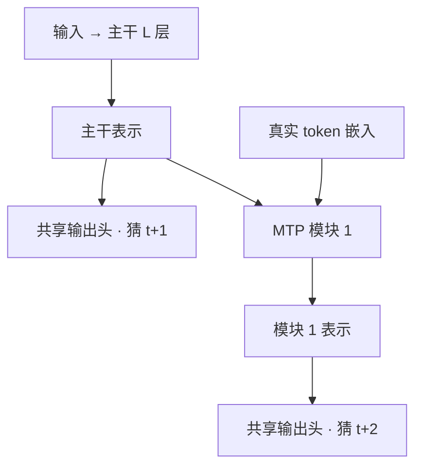

# MTP(Multi-Token Prediction,多 Token 预测)

> 🔴 重点考点:本篇是当前复习重点,文末「面试考点串联」给出问法对照。

一句话:**MTP 改的是训练目标——每个位置除了猜下一个 token,再顺手把后面第 2、3、4 个也猜一遍**;语料一个字没多加,回传给主干的监督信号却成倍变密,训完还白送几个能当投机解码草稿用的预测头。

> **类比**:背棋谱只背「下一手」,开局够用,但走不出计划;教练逼你每落一子先在脑子里往后推三步,棋谱一页没多翻,棋力却变了。MTP 就是给语言模型加这条教练要求——**正式对局仍然一手一手落**,多想的那几步是为了让当下这一手更有章法。

## 一、它改了什么:损失函数多加了几项

### 旧目标浪费在哪

标准的 next-token prediction(NTP,下一 token 预测)对每个位置只提供**一个**监督信号:

$$
\mathcal{L}_{\text{NTP}} = -\sum_t \log p_\theta\big(x_{t+1} \mid x_{\le t}\big)
$$

这个式子说的是:模型看着前 $t$ 个 token,给真实的第 $t+1$ 个 token 打的概率越高越好。

浪费有两处。**第一,信号太稀**——一段 4k token 的文本只换来 4k 条「下一步是什么」的梯度,至于「这句要转折」「这个括号得在三行后闭合」这类结构信息,损失函数一点没显式用上。**第二,模型没被要求想超过一步**——只要下一个词像样就能拿满分,三个词之后会不会把自己写进死胡同,目标函数根本不关心。

### 加出来的那几项

MTP 在主头之外再挂 $D$ 个深度,深度 $k$ 负责预测更远一格的 token,各自算一次交叉熵后加权并进总损失:

$$
\mathcal{L} = \mathcal{L}^{0} + \sum_{k=1}^{D} \lambda_k \, \mathcal{L}^{k}
$$

人话:$\mathcal{L}^{0}$ 就是原来那个 NTP 主损失(猜 $x_{t+1}$),$\mathcal{L}^{k}$ 是深度 $k$ 猜 $x_{t+1+k}$ 的损失,$\lambda_k$ 是一个小于 1 的权重,负责**别让辅助目标喧宾夺主**。

两个必须说准的口径:

- **日常说的 MTP-1 / MTP-3,数的是 $D$——额外深度的个数,不含主头。** DeepSeek V3 的 $D=1$ 意思是「除了下一个 token,每个位置再多预测一个」。
- **深度 $k$ 会吃掉序列末尾 $k$ 个位置。** 因为它要预测第 $t+1+k$ 个 token,而序列最后那几个位置根本没有对应的目标,只能丢掉。深度越大,每条样本能算损失的位置越少;长文本上可以忽略,短样本上损失的比例就不小了。

### $\lambda$ 为什么必须压着,还要退火

远处的 token 天然更难猜——离得越远,合法的续写分支越多,条件熵越高,这几项的 loss 和梯度都比主项躁。**上线要用的是主头,MTP 项是来帮它塑形的,不是来跟它抢方向的**,所以权重必须压小。

DeepSeek V3 的做法是退火:前 10T token 取 0.3,之后 4.8T token 降到 0.1;V4 沿用同一套(大部分训练阶段 0.3,学习率开始衰减后降到 0.1)。这两组数字来自仓库里的一手报告解读。

**报告没有解释为什么后期要降。** 一个合理读法是「早期需要更密的信号帮表示成型,后期把优化重心还给主任务」——但这是解读,不是报告结论。另外,$\lambda$ 需要退火这件事本身就说明:**这个辅助目标和主目标并非完全同向。**

## 二、两种实现:并排的头,还是串起来的模块

### 并排独立头(Gloeckle 原版)

主干照常算出位置 $t$ 的表示,上面并排接若干个小输出头,各自独立预测 $x_{t+1}, x_{t+2}, \dots$。结构最简单,推理时想丢就丢。

> **类比**:几个同学同时被问「后面第 2 / 3 / 4 个词是什么」,但互相不许通气——猜第 3 个的那位并不知道第 2 个已经定成什么了。条件链是断的,越往远猜越离谱。

它有一个非常具体的工程麻烦:**logits 撑爆显存**。每个头都要物化一份「token 数 × 词表大小」的 logits,而词表通常是几万到十几万、远大于隐藏维 $d$,几个头叠起来直接成为显存峰值,batch 开不大。论文的解法是把各头**顺序**做前向和反向、在主干处累加梯度、算完一个头就当场释放它的 logits,长期只保留 $d$ 维的主干梯度——峰值从「$D+1$ 份词表大小的 logits」压回「1 份」,batch 就能开到和普通模型一样大。

### 串行 MTP 模块(DeepSeek V3)

V3 不并排,改成 $D$ 个**顺序**模块,每个模块往后推一格,并且**保持完整的因果链**。

单个模块有四个部件:一个与主模型**共享**的嵌入层、一个与主模型**共享**的输出头、一个自己的 Transformer 块、一个把拼接后的 $2d$ 维压回 $d$ 维的投影矩阵。深度 $k$ 的模块吃两样东西——上一深度传下来的表示,和第 $t+k$ 个**真实** token 的词嵌入(训练时用 teacher forcing 直接拿现成的);两者各自归一化后拼接、投影、过自己那个 Transformer 块,再交给共享输出头出分布。

> **类比**:接力赛。每一棒都握着上一棒递来的接力棒(表示)**加上刚刚揭晓的那个真实的词**再往下猜,因果链是连着的——所以第 $k$ 个预测不是隔空瞎蒙,而是一次条件明确的预测。

### 差在哪,各自付什么代价

| 维度 | 并排独立头 | 串行 MTP 模块 |
|---|---|---|
| 结构 | 主干 + 若干并排小头 | $D$ 个含完整 Transformer 块的模块串联 |
| 深度 $k$ 能看到什么 | 只有主干表示 | 主干表示 + 上一深度表示 + 真实的中间 token |
| 条件概率链 | 断的(跳着猜) | 完整 |
| 额外参数 | 小 | 每深度一个 Transformer 块 + 一个投影矩阵 |
| 能否并行算 | 各头之间可以并行 | **深度之间必须串行** |
| 主要工程麻烦 | logits 显存峰值 | 串行深度拉长关键路径;共享参数的摆放要迁就并行切分 |

**DeepSeek 选串行,买的就是那条完整的因果链。** 并排的头预测第 3 个未来 token 时看不到「第 2 个未来 token 是什么」,只能从当前表示硬猜,它学到的是一个把中间不确定性揉进去的边缘分布;串行结构把这个信息给足了,学的是条件明确的分布。代价就是表格最后两行:深度之间不能并行,而且每加一层深度都是实打实的一个 Transformer 块。

## 三、为什么有效:三条「因为」,外加一条诚实的边界

### 因为同一份数据被榨出更多梯度

每个位置从 1 条监督变成 $D+1$ 条,语料一个字没加,回传主干的信号成倍增加。这是最容易说、也最浅的一条——**它只解释了「信号更多」,没解释「信号更好」**,单靠它答不住追问。

### 因为它逼表示提前把话想完

这才是关键。要在**看不见** $x_{t+1}$ 的情况下答对 $x_{t+2}$,位置 $t$ 的隐藏状态就不能只编码「下一个词大概是什么」,还得编码「这句话接下来要往哪走」。**MTP 把「规划」从模型的可选行为,变成了损失函数直接索要的行为。**

这里有个容易含糊的地方要说清:**两种实现给主干加的规划压力强度不同**。并排独立头把「看不见中间 token 还要答对」的压力全压在主干表示上;串行模块喂了真实的中间 token,这份压力小一些,但主干表示仍要为所有深度供货,规划压力并没有消失。

### 因为它给「岔路口 token」加了权

teacher forcing 下的纯 NTP 有个已知的短视问题:大部分 token 靠局部模式就能猜中(冠词、标点、闭合括号),真正决定后文走向的只有少数几个「岔路口 token」,而损失函数对两者一视同仁。多预测几步之后,岔路口猜错的代价会在后面几个深度里**连续兑现**,等于隐式给这些位置加了权。

**这条是机制层面的解释,不是被实验分离出来的结论**——公开报告都没做过「MTP 是否真的提高了岔路口 token 的准确率」这类针对性消融。

### 收益有多大,以及谁不同意

Gloeckle 等人的论文报告:13B 模型比可比的 NTP 模型在 HumanEval 上多解 **12%** 的题、MBPP 上多解 **17%**,用 4-token 预测训出来的模型推理最快可到 3 倍。论文同时强调**收益随模型规模变大而增强**——反过来说,小模型上不一定看得到。

DeepSeek V3 的消融(只加 1 个深度、其余不变,推理时把模块整个丢掉,所以两边推理成本完全相同):

| Benchmark | 小模型基线 | 小模型 +MTP | 大模型基线 | 大模型 +MTP |
|---|---:|---:|---:|---:|
| HumanEval | 20.7 | **26.8** | 44.5 | **53.7** |
| GSM8K | 25.4 | **31.4** | 72.3 | **74.0** |
| MMLU | 50.0 | **53.3** | **67.5** | 66.6 |
| NaturalQuestions | **22.7** | 22.3 | 27.2 | **28.5** |

小模型 15.7B / 1.33T token,大模型 228.7B / 540B token。两条必须一起背的边界:

1. **收益不均匀。** 代码数学涨得最猛(大模型 HumanEval +9.2),知识类基本持平甚至略降(大模型 MMLU 掉 0.9,小模型 NaturalQuestions 掉 0.4)。
2. **消融规模止于 228.7B,671B 上没有对照。** 所以**不能拿 V3 的整体成绩给 MTP 单项记功**——那次换代同时改了架构、规模、训练 token 数和数据质量,报告自己也是这么说的。

反例同样要记住:Moonshot 在 Muon 那篇论文里明确说**不用 MTP**,理由是「在我们的实验中 MTP 对预训练没有显示出显著收益」;Kimi K2 的技术报告里 MTP 一次都没出现。**「MTP 一定涨点」不是共识,它是一个和训练配方强耦合的技巧。**

## 四、推理侧:MTP 头天然就是一个草稿模型

这一节只讲**接口**,不讲投机解码本身。

投机解码需要一个「先猜几个 token、再由主模型一次性核对」的便宜草稿来源。传统做法是另外准备一个小模型,麻烦在于:要单独训练、单独部署、词表必须与主模型一致,而且它和主模型是两套独立学出来的分布,猜的东西未必对主模型胃口。

MTP 头把这几件事一次性省掉了,**因为它本来就是为了猜远处 token 才被训出来的**:

- **零额外模型**——它是主模型预训练的一部分,不需要再备一份权重、一条训练流水线;
- **分布天生对齐**——它与主干共享嵌入层和输出头,读的是主干当场算出来的表示,猜的就是主模型自己「心里想的下一步」;
- **顺路产出**——主前向已经把主干表示算出来了,MTP 头只在它上面多走一个小模块。

**再往下的一切——草稿怎么被验证、接受率怎么定义、加速比怎么从接受率推出来、被拒绝的 token 的 KV cache 怎么回滚、验证环节的同步点怎么消除——全部属于 投机解码 篇,本篇一律不重复。** 本篇只引用一个事实口径:DeepSeek V3 报告里深度 1 的草稿接受率在 **85%–90%** 之间、跨生成主题稳定,由此带来约 **1.8 倍 TPS**(每秒 token 数)。

### 留还是丢:一道纯部署题

MTP 模块在推理时**可以整个丢掉**,主模型独立工作(V3 的消融正是这么做的,所以加不加 MTP 两边推理成本相同)。于是「留不留」变成一道成本题:

| 选择 | 得到什么 | 付出什么 |
|---|---|---|
| 训练用、推理丢 | 只吃「监督更密」这一半红利;线上零成本、零复杂度 | 白扔一个现成的草稿头 |
| 训练用、推理也留 | 再吃一份 decode 加速 | 多一份权重与激活常驻;serving 侧要处理草稿逻辑 |

**注意这是训练期就锁死的选择**:推理时想加深草稿,预训练里必须先把深度加上去。事后想补,只能另外训一个草稿头(见下一节 Gemma 4 那条)。

## 五、配置谱:各家用几个,以及为什么往上加

| 模型 | MTP 怎么用的 |
|---|---|
| DeepSeek V3 / V4 | 深度 1,串行模块;$\lambda$ 从 0.3 退火到 0.1;推理可丢可留 |
| Kimi K3 | 1 层 MTP;线上草稿模型走 EAGLE-3 方案,**拿这层 MTP 模块做初始化**,训练时展开 7 步 |
| Kimi K2 | 技术报告里一次都没提 MTP;同门的 Muon 论文明确说实验中没看到显著收益 |
| Gemma 4 | 每个尺寸配一个 MTP 草稿头(4 层 Transformer,cross-attend 主模型的 KV,省掉草稿头自己建缓存);首发两周后才单独发布,更像附加组件 |
| GLM-5V-Turbo | MMTP:把 MTP 扩到图像输入,视觉 token 换成共享占位符;深度报告里没写 |
| GLM-4.7、MiniMax M2.5 / M2.7 等 | 深度 3 |

前五行来自仓库 `reports/` 下的一手报告解读;**最后一行是本知识库的架构追踪结论,仓库内没有对应的一手报告解读,引用时要说明这个口径差别**。

Kimi K3 那行值得单拎出来:**「有 MTP 层」不等于「MTP 头直接上线当草稿」**。K3 把预训练出来的 MTP 模块当作草稿模型的**初始化**,再按 EAGLE-3 的路子专门训一遍。所以面试里听到「他家有 MTP」,得追一句「训练用还是推理也用?是直接当草稿还是当草稿的起点?」

### 为什么深度从 1 往上加

推力来自 agent 负载:一次任务动辄几十轮工具调用、每轮成百上千步 decode,总延迟约等于 decode 步数乘每步时间,**decode 步数成了延迟大头**。想让自投机一步多吐几个 token,前提是**手上得有那么多草稿**——深度 1 的 MTP 一次只给得出 1 个草稿,天花板就钉在那儿。要往上顶,只能在预训练阶段把深度加上去。于是 MTP 从「锦上添花的训练技巧」被推成了「架构选型的一格」。

### 那为什么不干脆加到 8

三条压力,全在 MTP 这一侧:

- **越远越难学。** 深度 $k$ 要预测的位置离得越远,合法续写的分支越多、条件熵越高,那几个头学出来的分布会越来越平,回传主干的梯度信噪比越来越低。
- **成本是线性堆的。** 串行实现下每加一层深度就多一个 Transformer 块的前向反向和一份激活,而且深度之间串行,不能靠并行摊掉;同时每条样本还要多丢一个末尾位置。
- **深处的草稿越来越难兑现。** 越靠后的草稿要被用上,前面的必须全中,边际收益递减——**具体怎么衰减、盈亏平衡线在哪,见 投机解码 篇**。

三条叠起来,当前公开配置的甜点位在 1 到 3 之间。

## 六、细节与坑

- **后训练还要不要带 MTP 损失?** 要么带,要么上线前重新校准。如果 SFT / RL 阶段只更新主干、把 MTP 损失摘掉,主模型的分布漂了而 MTP 头还停在预训练时的样子,它当草稿的命中率会一路下滑。反过来看,RL 的 rollout 本身是 decode 密集的,自投机正好用来加速采样,所以有的 RL 框架支持在线跟着更新 MTP 层(rollout 本身见 GRPO 篇)。
- **训练开销没有公开数字。** 串行实现每加一层深度就是一整个 Transformer 块的前向反向加一份激活,但 DeepSeek V3 报告**既没有给** MTP 带来的训练时间或显存增量,**也没有说明**为什么深度停在 1。面试里被问「大概贵多少」,老实说没有公开依据,比编一个百分比强。
- **共享参数会绑住并行切分。** MTP 模块与主模型共享嵌入层和输出头,而这两组参数分别住在模型的最浅处和最深处。V3 的做法是把最浅的层(含嵌入)与最深的层(含输出头)**摆到同一个流水线并行 rank 上**,这样两组参数和梯度才能物理共享,不必跨 stage 复制(流水线并行本身见 并行策略 篇;MoE 的切分见 MoE基础 篇)。
- **长上下文下代价按长度走。** MTP 模块处理的序列和主干一样长,多出来的激活随长度线性涨;末尾丢弃 $k$ 个位置这件事在长序列上可以忽略,短样本上就未必(长序列训练配方见 长上下文训练 篇)。
- **多模态会把 MTP 头卡住。** MTP 头吃的是词嵌入,而图像位置根本没有 token ID。GLM-5V-Turbo 的做法是保留视觉位置、把每段连续视觉 token 折成一个共享的可学习占位符送进 MTP 头——**位置结构留下,图像内容不进去**。理由是流水线并行下让 MTP 头去要最前面那层的视觉表示,等于把一份数据从第一个 stage 一路搬到最后一个;而占位符是词嵌入表里的普通条目,最后一个 stage 查表就有。要说清边界:那份报告的相关消融只在 0.5B 规模上做过,视觉输入下的接受长度也没公布(视觉侧接法见 VLM结构 篇)。
- **别把「MTP」和「事后加装的草稿头」混为一谈。** Medusa 是在训好的模型上**事后微调**加装几个并行头,主干一个参数都不动——它改不了模型能力,只买加速;预训练里长出来的 MTP 是**先改模型,再顺带买加速**。两者名字都叫「多头预测」,定位完全不同,回答前先确认对方问的是哪一种。

## 七、面试考点串联

下表全部是**补充题**:题库里目前没有 `topic` 直接挂到本篇的真题,唯一相关的一道问的是 draft 与 target 的 KV cache 怎么回滚,那道题归 投机解码 篇。

| 高频问法 | 本文哪一节 |
|---|---|
| MTP 在训练时到底多做了什么?图什么? | 一 |
| MTP-3 是指预测 3 个 token 吗?这个数怎么数 | 一(数的是额外深度,不含主头) |
| 辅助损失的权重为什么要压小、还要退火? | 一 |
| 并排接几个头和串起来接几个模块,差在哪?DeepSeek 为什么选后者? | 二 |
| 并排多头实现最容易撞上什么工程问题?怎么绕过去? | 二(logits 显存峰值 → 逐头顺序前反向) |
| 同一份语料,MTP 凭什么比 NTP 学到更多?只是信号更密吗? | 三(规划压力 + 岔路口加权) |
| 有人报告 MTP 没有收益,怎么解释?你会怎么判断该不该上? | 三(收益不均匀 + 消融规模上限 + Moonshot 的反例) |
| MTP 头当草稿,比外挂一个小模型省掉了哪几件事? | 四(零额外模型 + 分布天生对齐 + 顺路产出) |
| 训练时挂了 MTP 头,推理时留着还是丢掉?在权衡什么? | 四(留丢对照表) |
| 为什么各家的 MTP 深度在往上加?为什么不干脆加到 8? | 五(agent 的 decode 步数 vs 三条压力) |
| 后训练阶段还要不要带着 MTP 损失一起训?不带会怎样? | 六 |
| MTP 模块和主干共享嵌入层与输出头,这在分布式训练里带来什么约束? | 六(共享参数要摆在同一个 PP rank) |
| 图像输入没有 token ID,MTP 头怎么办? | 六(共享占位符,留位置不留内容) |

边界说明:**本篇只负责 MTP 的训练侧机制、实现取舍与配置选型**。草稿被验证的流程、接受率与加速比的换算、KV cache 回滚、验证时的同步点消除,全部在 投机解码 篇;注意力本身见 注意力基础 篇,FFN 见 FFN与激活 篇,残差与 Norm 见 残差流 篇与 Norm位置 篇。

## 相关文献

- Better & Faster Large Language Models via Multi-token Prediction(Gloeckle 等,并排多头原版与显存峰值处理)— [arXiv:2404.19737](https://arxiv.org/abs/2404.19737)
- DeepSeek-V3 Technical Report(串行 MTP 模块、$\lambda$ 退火、消融与推理侧数字)— [arXiv:2412.19437](https://arxiv.org/abs/2412.19437)
- DeepSeek-V4: Towards Highly Efficient Million-Token Context Intelligence(深度仍为 1,沿用 V3 方案)— [arXiv:2606.19348](https://arxiv.org/abs/2606.19348)
- Kimi K3: Open Frontier Intelligence(1 层 MTP 作为 EAGLE-3 草稿模型的初始化)— [arXiv:2607.24653](https://arxiv.org/abs/2607.24653)
- Medusa: Simple LLM Inference Acceleration Framework with Multiple Decoding Heads(事后加装并行头的对照物)— [arXiv:2401.10774](https://arxiv.org/abs/2401.10774)
