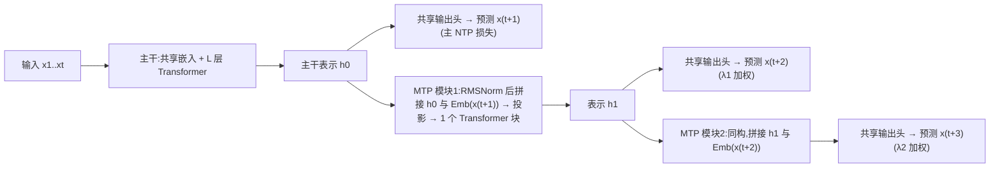
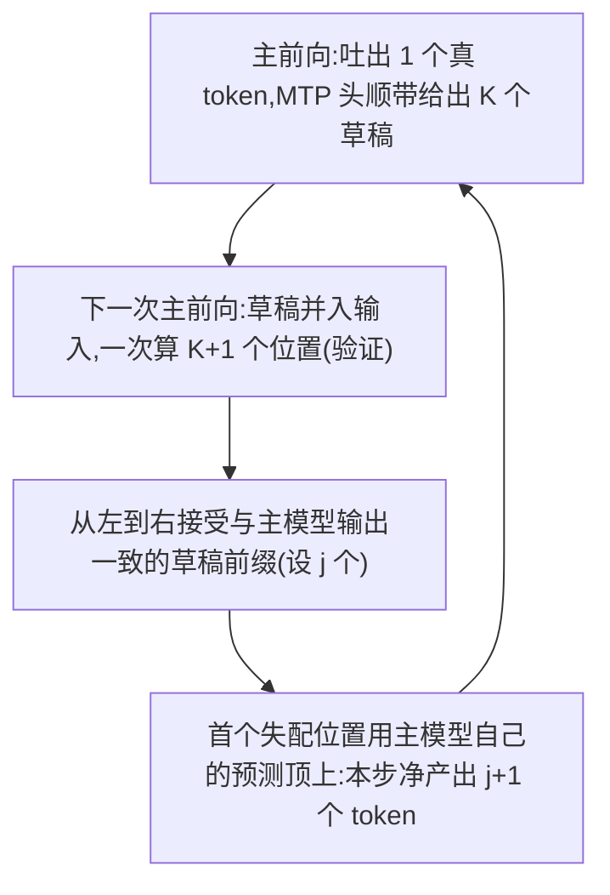

# MTP(Multi-Token Prediction)

> ⚠️ 旧版:本篇写于写作契约确立之前,尚未按新标准审查重写。标准见 docs/05-知识库写作契约.md,样板见「GPU架构与执行模型」。

一句话:**训练时不只预测下一个 token,同时把后面 2–4 个也一起预测**——同一份数据榨出更密的监督信号,顺带白送一个投机解码的 draft 头。前一半让它作为训练技巧诞生(Meta 的 Gloeckle 等人提出),后一半让它在 agent 时代升格为推理必需品(架构手册耦合④:MTP ↔ 投机解码 ↔ agent 场景)。

> **类比**:纯 NTP 像背棋谱只背「下一手」;MTP 是教练逼你每个局面都往后想两三步。看远不是为了真把后几手一次落完(正式生成仍是逐 token),而是逼你脑中先有行棋计划;顺带的红利是——实战时可以让这套「快速预判」先摆出几手候选,再由慢思考一次核对,下得又稳又快。

## 一、机制:从 NTP 损失到 MTP 损失

标准 next-token prediction 对每个位置只有一层监督:

$$
\mathcal{L}_{NTP} = \sum_t -\log p_\theta(x_{t+1} \mid x_{\le t})
$$

MTP 让每个位置同时预测未来 $K$ 个 token,按深度加权求和:

$$
\mathcal{L}_{MTP} = \sum_{k=1}^{K} \lambda_k \sum_t -\log p_\theta(x_{t+k} \mid x_{\le t})
$$

$k=1$ 就是原本的 NTP 主损失;$k \ge 2$ 才是 MTP 加出来的额外监督,$\lambda_k$ 控制它们别喧宾夺主(越远的 token 越难预测、噪声越大)。日常说的 MTP-1 / MTP-3,数的是**额外**预测深度的个数。

### 两种实现:并行独立头 vs 串行 MTP 模块

**并行独立头(Gloeckle 原版)**:共享主干输出 $h_t$,上面接 $K$ 个并行小头,各自独立预测 $x_{t+1}, \dots, x_{t+K}$。结构最简单、开销最小。

> **类比**:几个同学各自蒙「后面第 2 / 3 / 4 个词」,但互相不通气——第 2 个头猜 $x_{t+2}$ 时并不知道 $x_{t+1}$ 是什么,条件信息断了,$k$ 越大猜得越离谱。

**串行 MTP 模块(DeepSeek V3)**:每个额外 token 配一个小模块——嵌入层和输出头与主模型共享,自带一个投影矩阵和**一个完整的 Transformer 块**。深度 $k$ 的模块拿两样东西:上一深度的表示 $h^{k-1}$,和第 $t+k$ 个**真实 token** 的嵌入(训练时 teacher forcing),拼接投影后过自己的 Transformer 块,再由共享输出头预测 $x_{t+k+1}$:

> **类比**:接力赛——每一棒(深度)都握着上一棒传来的接力棒(表示)和刚揭晓的真实词再往下猜,**因果链完整**,所以第 $k$ 个预测不是隔空瞎蒙,而是正经的条件预测。

| 维度 | 并行独立头 | 串行 MTP 模块 |
| --- | --- | --- |
| 结构 | 主干 + $K$ 个并行头 | $K$ 个含 Transformer 块的小模块串联 |
| 条件信息 | 各头只见 $h_t$,互不知情 | 深度 $k$ 见上一深度表示 + 真实中间 token |
| 远端预测质量 | 随 $k$ 快速衰减 | 衰减慢,当 draft 时接受率高(V3 报告 85–90%) |
| 额外开销 | 小 | 每深度多一个块,且深度间串行 |

一个工程小细节:并行头一次要物化 $K$ 份词表大小的 logits,显存峰值随 $K$ 线性涨;Gloeckle 的解法是各头**顺序**做前向+反向、算完当场释放 logits,把峰值压回单头水平。

## 二、为什么有效(训练视角)

- **监督更密**:同一个前缀产出 $K$ 份损失而不是 1 份,同样的数据与算力预算,单位 token 提供的训练信号更多;
- **逼表示「携带未来」**:要在看不到 $x_{t+1}$ 的情况下答对 $x_{t+2}$,隐藏状态必须编码「这句话要往哪走」的计划,而不是只学表面接龙——下棋多看两步,脑中必须先有全局构思,这就是 planning 直觉;
- **矫正 NTP 的短视**:teacher forcing 下纯 NTP 容易过拟合局部模式,对真正决定后文走向的「岔路口 token」不敏感;MTP 隐式加重了这些岔路口的权重。Gloeckle 报告收益随模型规模放大,13B 模型在 HumanEval / MBPP 上分别多解约 12% / 17% 的题。

## 三、推理视角:白送的投机解码 draft(耦合④)

decode 每一步都要把全部权重与 KV cache 从显存完整搬一遍、却只产出 1 个 token,是典型的带宽受限操作,算力大量闲置(背景见「架构总览」篇)。投机解码的思路:让小 draft 先猜一段,大模型一次前向并行验证,把「串行 $K$ 步」换成「并行 1 步」。传统做法需要**单独训练、单独部署**一个小 draft 模型;MTP 头则是天然的 draft——与主模型在同一次训练里共生,分布天然对齐,零额外模型。

自投机(self-speculative)流程:

> **类比**:老板(主模型)口述文件,速记员(MTP 头)抢先替他续写几句;老板扫一眼,对的直接放行,从第一处写错的地方亲自重写。**定稿永远以老板为准,所以无损**——greedy 下与逐 token 生成完全一致,采样下用拒绝采样修正保持同分布;最差情况也保底每步 1 个 token。MTP 的特殊之处在于速记员不是外聘的(独立 draft 模型),是老板一手带出来的,想法同步,猜中率自然高。

**接受率决定加速比**。设单个草稿 token 被接受的概率为 $\alpha$(近似独立),草稿长 $K$,每次主前向的期望产出:

$$
\mathbb{E}[\text{每步产出 token 数}] = 1 + \alpha + \alpha^2 + \cdots + \alpha^K = \frac{1-\alpha^{K+1}}{1-\alpha}
$$

DeepSeek V3 报告单深度草稿的接受率 85–90%,decode 吞吐约提到 1.8 倍;若 $K=3$、$\alpha \approx 0.8$,一步期望顶约 3 步。验证前向要多算 $K$ 个位置,但 decode 本就带宽受限、算力闲着,单请求场景近乎免费(大 batch 时另说,见第五节)。

还有一处流水线巧思:验证那次前向本身也产出各位置的隐藏状态,MTP 头顺势就能给出**下一轮**草稿——草稿生成与验证折叠进同一次前向,不用额外跑。

## 四、配置谱:各家怎么用(手册 5.4)

| 配置 | 模型 | 说明 |
| --- | --- | --- |
| MTP-1 | DeepSeek V3 / R1 / V3.2 | 1 个串行模块,一次验证最多吐 2 个 token |
| MTP-3 | GLM-4.7、Step 3.5 Flash、MiniMax M2.5 / M2.7 | 3 个 MTP 模块,一次最多吐 4 个 |
| 共享权重 MTP | Nemotron 3 Super | 共享权重实现,参数开销最省 |
| 有 MTP 但只训练用 | GLM-4.5、MiniMax M2 | 当密集监督/表示塑形用,推理不上线 |

Step 3.5 Flash 明确说 MTP-3 **训练与推理都用**,这是它吞吐特别高的原因之一;GLM-4.5 和 MiniMax M2 训了 MTP 却只拿「监督更密」这一半红利,白送的 draft 没上线——两家的后续版本(GLM-4.7、MiniMax M2.5)都升到了 MTP-3。

### 为什么从 1 卷到 3

agent 负载改变了延迟结构:一次任务动辄几十轮工具调用、每轮成百上千步 decode,总延迟 ≈ decode 步数 × 每步时间,**decode 步数成了主要延迟来源**。MTP-K 直接把步数除以期望接受长度,是少数能给乘法级收益的手段——于是 MTP 从「锦上添花的训练技巧」升格为「推理必需品」,深度也从 1 卷到 3(耦合④的核心观察:agent 需求推着它涨)。

那为什么不干脆 MTP-8?看上面的加速比公式:第 $k$ 个草稿被用上的概率约 $\alpha^k$,随深度**指数衰减**,太深的草稿基本全被拒,只白付训练与验证成本——3 上下是当前的甜点位。

## 五、细节与坑

- **$\lambda$ 与主损失的平衡**:远处 token 天然更难,MTP 项权重过大会污染主 NTP 质量。DeepSeek V3 的做法是退火——前 10T token 用 $\lambda = 0.3$,之后降到 0.1;多深度时常按 $k$ 递减。
- **SFT/RL 阶段要不要留着头**:后训练若只更新主干、不带 MTP 损失,主模型分布漂移后草稿头「过时」,接受率与加速比一路下滑。要么后训练继续带上 MTP 损失共训,要么上线前单独把头校准一遍。反过来,RL 的 rollout 是 decode 密集型负载,自投机正好用来加速采样(rollout 工程细节见「GRPO」篇)。
- **显存与验证开销**:MTP 模块本身多一份参数与激活(纯推理可丢弃);验证一次算 $K+1$ 个位置,单请求免费,但**高并发大 batch 下算力余量消失**,被拒草稿的计算与 KV 写入变成纯浪费——投机解码的收益随 batch 增大而衰减,serving 时要按负载动态开关或调 $K$。
- **与独立 draft 模型对比**:独立小模型要单独训练、单独部署,还得与主模型对齐 tokenizer 和分布;MTP 头零额外模型、天然同分布,工程上干净得多。
- **与 Medusa 对比**:Medusa 是在训好的模型上**事后微调**加装并行头,再用树注意力一次验证多条候选。它改不了主干能力,接受率也逊于从预训练就串行共生的 MTP;定位是给没有 MTP 的存量模型「补票」。

## 六、面试考点串联

1. 写出 MTP 损失,说明与 NTP 的关系、$\lambda_k$ 为什么要小 →「一、机制」
2. 并行独立头与串行模块的区别,DeepSeek 为什么强调保持因果链 →「一、两种实现」
3. MTP 为什么能提升模型质量而不只是加速(planning 直觉)→「二、为什么有效」
4. 自投机解码流程、为什么无损、加速比与接受率的关系 →「三、推理视角」
5. 为什么 agent 场景把 MTP 从 1 推到 3 →「四、配置谱」
6. MTP / Medusa / 独立 draft 模型三者对比 →「五、细节与坑」
7. SFT/RL 之后接受率为什么下降、怎么办 →「五、细节与坑」

## 相关文献

- Better & Faster Large Language Models via Multi-token Prediction(并行多头原版)— [arXiv:2404.19737](https://arxiv.org/abs/2404.19737)
- DeepSeek-V3 Technical Report(串行 MTP 模块)— [arXiv:2412.19437](https://arxiv.org/abs/2412.19437)
- Fast Inference from Transformers via Speculative Decoding(投机解码)— [arXiv:2211.17192](https://arxiv.org/abs/2211.17192)
- Medusa: Simple LLM Inference Acceleration Framework with Multiple Decoding Heads — [arXiv:2401.10774](https://arxiv.org/abs/2401.10774)
