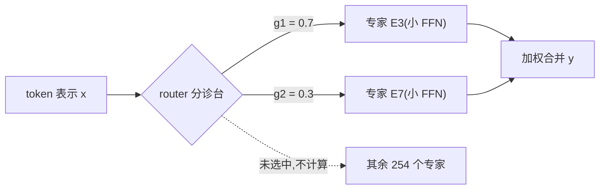

# MoE 基础(专家、粒度与共享专家)

> ⚠️ 旧版:本篇写于写作契约确立之前,尚未按新标准审查重写。标准见 docs/05-知识库写作契约.md,样板见「GPU架构与执行模型」。

一句话:**把 Transformer 的 FFN 拆成 N 个小专家,每个 token 只激活其中几个**——总参数量与每 token 计算量从此脱钩。1.6T 总参数的 DeepSeek V4-Pro,每个 token 只算 49B,占 3.1%。

> **类比**:从「一个什么都懂的全科医生」变成「一个分诊台 + 一堆专科医生」。分诊台(router)看一眼病人,挑几个最对口的专科医生来会诊;没被点名的医生完全不为这个病人花时间。

## 一、核心机制:只拆 FFN,router 挑人加权

MoE 层的输出:

$$
y = \sum_{i \in \mathrm{TopK}(x)} g_i \cdot E_i(x)
$$

三个记号逐个拆:

- $E_i$:第 $i$ 个**专家**,每个就是一个独立的小 FFN(现代实现里是小 SwiGLU);
- $\mathrm{TopK}(x)$:**router**(一个小线性层)给所有专家打分,取分数最高的 K 个——只有这 K 个真的做前向计算,其余专家对这个 token 一次乘法都不做;
- $g_i$:router 给出的门控权重,决定几位「会诊医生」的意见按什么比例合并。

两个容易忽略的边界:

- **只替换 FFN**:注意力层保持稠密,所有 token 共享同一套注意力参数——「在 token 之间搬运信息」是通用能力,「存什么知识」才按领域分工(为什么不拆注意力,见考点 5);
- **不一定每层都换**:常见做法是前几层保留 dense FFN(见「五、dense 前缀」)。

**稀疏度**是这套机制的量化指标:

$$
\text{稀疏度} = \frac{\text{激活参数量}}{\text{总参数量}}
$$

例:DeepSeek V4-Pro 总参 1.6T、每 token 激活 49B,稀疏度 $49/1600 \approx 3.1\%$。注意分子分母都包含注意力、embedding 这些「人人都过」的稠密部分和共享专家,路由专家才是拉开两者差距的来源。

## 二、为什么有效:条件计算的直觉

**不是每个 token 都需要全部知识。** 处理一段 Python 代码时,模型用不着「唐诗」「有机化学」对应的那部分参数;dense 模型却强迫每个 token 把所有权重都乘一遍。MoE 把这件事显式化——这个思想叫**条件计算**(conditional computation):算哪部分,取决于输入是什么。

总参数决定了可用容量的一部分,每 token 激活参数决定了主要矩阵计算的一部分。MoE 有机会用较少激活计算达到目标质量,但不是同算力下必然胜过 Dense:路由、数据、优化与通信都影响结果。显存和互联充足、任务需要较大容量且批量足够时更值得比较;小批低时延、资源紧张时,Dense 可能更经济。评估应固定质量目标,共同计算训练、部署显存、吞吐与时延,不能只看激活参数。

## 三、专家粒度:越来越多、越来越小

过去两年最明显的单调趋势:**专家数量越来越多,单个专家越来越小**。三个里程碑连成一条线:

Mixtral 8 选 2(2023)→ DeepSeek V3 256 选 8(2024)→ Kimi K3 896 选 16(1.8%,公开稀疏度纪录)

全景表(截至 2026-08,摘自架构手册):

| 模型 | 专家总数 | 每 token 激活 | 稀疏度 |
|---|---|---|---|
| Mixtral(2023) | 8 | 2 | 25% |
| Grok 2.5 | 少而大 | — | — |
| Llama 4 Maverick | 128 | 1 + 1 共享 | — |
| DeepSeek V3 | 256 | 8 + 1 共享 | 5.5% |
| Qwen3 235B | 128 | 8,**无共享** | 9.4% |
| Kimi K2 / K2.5 / K2.6 | **384** | 8 | 3.2% |
| Gemma 4 26B-A4B | 128 | 8 + 1 共享 | 15.1% |
| Mistral Small 4 | 128 | **4** + 1 共享 | 5.6% |
| Qwen3.6 35B-A3B | 256 | 8 + 1 共享 | 8.6% |
| Qwen3.5 397B | **512** | — | 4.3% |
| LongCat-Flash-Lite | **512 + 256 个零/恒等专家** | top-12 | 4.4% |
| DeepSeek V4-Flash | 256 | 6 + 1 共享 | 4.6% |
| DeepSeek V4-Pro | 384 | 6 + 1 共享 | **3.1%** |
| ZAYA1-8B | — | **1**(top-1) | 9% |
| **Kimi K3** | **896** | **16** | **1.8%** |

**为什么细粒度更好?直觉是组合数。** 把 K 个名额分给 N 个专家,可能的「会诊阵容」有 $\binom{N}{K}$ 种:

$$
\binom{8}{2} = 28 \qquad \text{vs} \qquad \binom{256}{8} \approx 4 \times 10^{14}
$$

总参数和激活参数都可以不变,只是切得更细,模型能表达的专家组合就多出十几个数量级——相当于医院从 8 个大科室细分成 256 个亚专科,「既懂 Rust 又懂密码学」这类组合式需求才可能被精确匹配,每个专家也得以特化到更窄的领域。

这条路线的奠基是 **DeepSeekMoE(2024 年初)**:首次系统提出「细粒度专家切分 + 共享专家隔离」两件套,论证同等参数与算力下,把专家切细、再把通用知识抽给共享专家,专家的特化程度显著更高。DeepSeek V3、Kimi K2/K3 把这个配方一路推到极致;表里的 Grok 2.5(少而大)是趋势之外的旧路线,ZAYA1 的 top-1 则是 Switch 风格的另一个极端。

## 四、共享专家:全科门诊

**共享专家 = 一个所有 token 都会经过的专家,不参与路由。**

> **类比**:专科医院里的「全科门诊」——所有病人都先过一遍,处理通用问题;专科医生只负责各自领域的特殊情况。

**目的**:语法、高频搭配这类通用知识每个 token 都用得上;没有共享专家时,每个路由专家都得自己重复学一份。抽出来共享后,通用知识只存一份,路由专家可以更彻底地特化——这正是 DeepSeekMoE 两件套的后一半。

但要不要用,是各家**真实分歧**的设计点:

| 用共享专家 | 不用 |
|---|---|
| DeepSeek V3/V3.2/V4、Llama 4、GLM-4.5、Qwen3-Next、Qwen3.5/3.6、Gemma 4 MoE、Mistral Small 4、Laguna | Qwen3 235B-A22B、MiniMax M2 系列 |

三个值得记住的细节:

- **Qwen 自己在两代之间改了主意**:Qwen3 235B 明确去掉共享专家(模型卡的理由是「优化服务效率」),Qwen3-Next 和 Qwen3.5 又加了回来——说明这个选择至今没有一边倒的答案;
- **Grok 2.5 是中间态**:没有正式的共享专家,但有一条**常开的 SwiGLU 路径**,功能上等价于共享专家;
- **LongCat 的「零/恒等专家」是反向设计**:512 个真专家之外,另设 256 个什么也不做(直接恒等映射)的专家。router 选中它们,等于宣布「这个 token 不需要额外计算」——**变相实现了每 token 的动态计算量**。共享专家是「人人必过的门诊」,零专家则是「允许病人不看病直接回家」。

## 五、Dense 前缀:前几层不路由

GLM-4.5/4.7 的做法:**前 3 层不做 MoE,用普通 dense FFN**;DeepSeek V3 也有类似的 dense 前缀。

原因有两层:

- 前几层学的是最通用的低层特征(token 级别的模式),各领域都一样,**没什么可特化的**;
- 此时 token 表示还没分化出明显差异,router 缺乏可靠的分科依据,强行路由只会增加训练不稳定。

用类比说:病人刚进门、还没量体温问病史,分诊台没有信息可分——前几站不如让所有人走同一条通道。

## 六、工程代价一览

MoE 省下的算力不是白来的,四笔账要心里有数(前两笔的细节都在「MoE路由」篇展开):

- **路由与负载均衡**:router 做的是离散选择(不可导),且天然有「强者愈强」的死循环——热门专家越练越好、冷门专家逐渐死掉。打分函数(softmax/sigmoid/ReLU/哈希/分位数)与 aux-loss-free 均衡等整套对策,见「MoE路由」篇;
- **专家并行的 all-to-all 通信**:专家分布在不同 GPU 上,每个 MoE 层都要把 token 按路由结果发到对应的卡、算完再收回。这是 MoE 特有的通信模式,常成吞吐瓶颈;压缩 token 表示以省通信的 Latent MoE 同样见「MoE路由」篇;
- **省算力不省权重显存**:稀疏免掉的是每 token 计算,**总参数在推理时一个都不能少**——1.6T 的权重就要占 1.6T 级别的存放空间,所以大 MoE 必然配多卡专家并行部署;
- **极致稀疏的新难题**:Kimi K3 在 1.8%(896 选 16)稀疏度下明确指出,每个专家分到的 token 和梯度信号太少,**路由和优化本身成为一阶难题**,必须配套更鲁棒的路由算法与优化器——展开同见「MoE路由」篇。

## 七、面试考点串联

| 面试官可能怎样问 | 回答位置 |
|---|---|
| MoE 一次前向怎样选择和组合专家? | 一 |
| 总参数很多,为什么计算不一定同样多? | 二 |
| 相比 Dense,MoE 在什么场景更划算?(P002-Q084) | 二、六 |
| 细粒度专家为什么能增加组合空间?(P002-Q083) | 三 |
| 共享专家解决什么,为什么不直接让所有专家都路由?(P002-Q083) | 四 |
| 为什么有些模型前几层仍用 Dense? | 五 |
| 上 MoE 要额外承担哪些系统成本? | 六 |

> 本表混合平台整理题与自拟题,非已核实面经;P002 对应来源档案。

## 相关文献

- GShard(条件计算规模化奠基,MoE 进 Transformer)— [arXiv:2006.16668](https://arxiv.org/abs/2006.16668)
- Switch Transformer(top-1 路由,同算力对 dense 大幅提速)— [arXiv:2101.03961](https://arxiv.org/abs/2101.03961)
- Mixtral of Experts(8 选 2,开源 MoE 出圈之作)— [arXiv:2401.04088](https://arxiv.org/abs/2401.04088)
- DeepSeekMoE(细粒度切分 + 共享专家奠基)— [arXiv:2401.06066](https://arxiv.org/abs/2401.06066)
- DeepSeek-V3(256 选 8 + aux-loss-free 大规模实战)— [arXiv:2412.19437](https://arxiv.org/abs/2412.19437)
