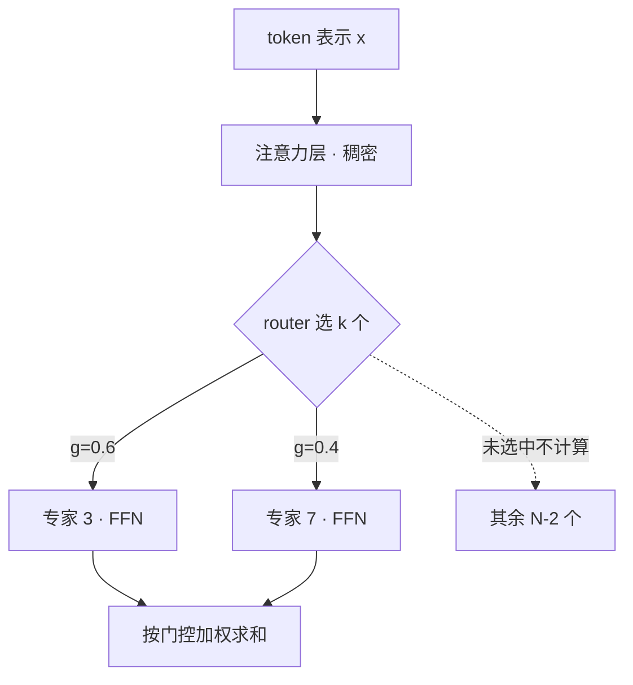

# MoE 基础(Dense 对照、专家粒度与共享专家)

> 🔴 重点考点:本篇是当前复习重点,文末「面试考点串联」给出问法对照。

一句话:**Dense 让每个 token 都把同一套 FFN 完整乘一遍,MoE 把这套 FFN 拆成 N 个更小的专家、每个 token 只算其中几个**——「模型总共装了多少参数」和「处理一个 token 要算多少」从此变成两个可以分开拧的旋钮。DeepSeek-V4-Pro 是这句话的极端案例:总参数 1.6T,每个 token 只激活 49B,占 3.1%。

> **类比**:Dense 是一位什么都懂的全科医生,每个病人都由他从头看到尾;MoE 是一个分诊台加一屋子专科医生,分诊台看一眼病人挑几位来会诊,没被点名的医生对这个病人一秒钟都不花。

router 怎么打分、负载均衡与 aux loss 怎么做,见 MoE路由 篇;专家摊到多卡之后的 all-to-all、dispatch 方案与通信重叠,见 MoE并行与DeepEP 篇。本篇只回答三件事:MoE 是什么、和 Dense 逐项差在哪、粒度怎么选。

## 一、结构差异:只拆 FFN,注意力一动不动

### 一层里到底换了什么

Dense Transformer 的一层是「注意力 + 一个 FFN」,层内所有 token 共用这一个 FFN。MoE 层把这个 FFN 换成 $N$ 个结构相同、宽度更小的专家 FFN,前面加一个 router:

$$
y=\sum_{i\in\mathcal{T}(x)} g_i\,E_i(x),\qquad \mathcal{T}(x)=\operatorname{TopK}\bigl(\{s_i(x)\}_{i=1}^{N}\bigr)
$$

这个式子说的是三件事:router 先给 $N$ 个专家各打一个分 $s_i$;取分数最高的 $k$ 个组成集合 $\mathcal{T}$,**只有这 $k$ 个专家真的做前向计算,其余 $N-k$ 个对这个 token 一次乘法都不做**;选中专家的输出再按门控权重 $g_i$ 加权求和,回到残差流。$E_i$ 本身就是一个普通的 SwiGLU FFN,只是中间宽度比 dense 版小得多(结构见 FFN与激活 篇)。

### 为什么只拆 FFN,不拆注意力

主流 MoE 一律只动 FFN,注意力层保持稠密、所有 token 共用同一套参数。三条理由:

1. **分工不同**。注意力干的是「在 token 之间搬信息」,这是所有领域都一样的通用能力;FFN 干的是「按当前内容取出知识」,这才有按领域分工的余地。要扩的是仓库,不是搬运工(FFN 作为可微键值存储的证据见 FFN与激活 篇)。
2. **参数在那边**。$d_{ff}=4d$ 的经典配置下,一层里约三分之二的参数在 FFN——想靠复制换容量,当然复制占大头的那块。
3. **工程代价**。注意力保持稠密,KV cache 的形状就不随路由变化,FlashAttention、TP 切分、分页缓存那一整套现成实现全部照用;注意力一旦按 token 路由,这些假设集体作废。

### 不一定每层都换:dense 前缀

GLM-4.5/4.7 的前 3 层用普通 dense FFN;DeepSeek-V3 一样,61 层里前 3 层保持稠密。两条理由:最浅层处理的多是词法、符号这类各领域通用的模式,**没什么可特化的**;而且此时 token 表示还没分化出明显差异,router 缺少可靠的分科依据,强行路由只会白白增加不稳定。用类比说:病人刚进门、体温病史都没量,分诊台没有信息可分,前几站不如让所有人走同一条通道。

DeepSeek-V4 换了个形式做同一件事:前 3 个 MoE 层改用按 token id 的哈希路由,不让最浅层去学一套复杂策略。

## 二、七维对照表(本篇的核心交付)

把 Dense 和稀疏 MoE 逐项摆开——这张表是「比较两者的总参数、激活参数、FLOPs、显存、通信、训练稳定性和推理延迟」的正面答案:

| 维度 | Dense | 稀疏 MoE | 为什么会这样 |
|---|---|---|---|
| **总参数** | 就是每个 token 都要用的那一套 | 可以比激活参数大十倍到几十倍 | FFN 被复制成 $N$ 份,复制出来的份数不进每 token 的计算 |
| **激活参数** | ≈ 总参数 | 注意力 + 共享专家 + top-$k$ 个路由专家 | 只有被 router 选中的专家参与前向 |
| **FLOPs** | 正比于总参数 | 正比于**激活参数**,外加一点路由开销 | router 只是一个 $d\times N$ 的小矩阵乘,可忽略;按专家排序打包的开销不可忽略 |
| **显存** | 权重按总参数算,KV cache 按注意力配置算 | 权重**同样按总参数算,一点不省**;KV cache 与 Dense 同款;训练时还多出路由中间量与 dispatch 缓冲 | 没被选中的专家权重照样要留在显存里等着被选;注意力层没动,缓存形状不变 |
| **通信** | 常规 TP / PP / DP | 每个 MoE 层多两趟 all-to-all,而且长度是数据决定的、运行时才知道 | token 必须寄到专家所在的卡,算完再寄回 |
| **训练稳定性** | 路径固定,好调试 | 多出一条离散的路由路径:专家坍塌、负载不均、路由抖动 | router 做的是硬选择,还带「强者愈强」的正反馈 |
| **推理延迟** | 与激活权重的读取量成正比,可预测 | **不自动更低**;吞吐要靠把 token 聚成足够大的批才拿得到 | 四种翻车场景见第四节 |

**这张表最容易答错的是显存那一格。**「MoE 更省」是就每 token 的 FLOPs 说的,不是就显存说的:1.6T 的权重推理时一个字节都不能少,该占的存放空间照占——这也是大 MoE 必然要多卡专家并行部署的直接原因。

## 三、稀疏激活:把「总容量」和「每 token 计算」解耦

衡量这件事只需要一个比值:

$$
\text{稀疏度}=\frac{\text{每 token 激活参数}}{\text{总参数}}
$$

它说的是「一个 token 真正用上了模型的百分之几」。分子分母都含注意力、embedding、共享专家这些人人必过的部分,真正拉开两者差距的只有路由专家那一块。

| 模型 | 总参数 | 每 token 激活 | 激活占比 | 专家配置 |
|---|---|---|---|---|
| Mixtral 8×7B(2023) | 47B | 13B | 28% | 8 选 2,无共享 |
| DeepSeek-V2(2024) | 236B | 21B | 8.9% | 2 共享 + 160 路由,选 6 |
| DeepSeek-V3(2024) | 671B | 37B | 5.5% | 1 共享 + 256 路由,选 8 |
| DeepSeek-V4-Flash | 284B | 13B | 4.6% | 1 共享 + 256 路由,选 6 |
| DeepSeek-V4-Pro | 1.6T | 49B | 3.1% | 1 共享 + 384 路由,选 6 |
| Kimi K3(约数) | 2.8T | 约 50B | 约 1.8% | 896 选 16 |

两年多时间,激活占比从 28% 一路压到 2% 以下。但这张表只能用来说明「稀疏激活能做到多稀疏」,**三条口径必须分开**:

- **激活参数 ≠ FLOPs**。两者同阶,但 MoE 的专家计算被切成 $N$ 段,每段平均只有 $Tk/N$ 个 token,矩阵一瘦算力利用率就掉;Dense 那边是一个完整连续的大 GEMM。
- **FLOPs ≠ 显存**。就是上一节那一格,权重按总参数算。
- **FLOPs ≠ 延迟**。延迟还要加上 router、排序打包、两趟 all-to-all,以及等最慢那张卡。

还有一条**归因边界**要说准:V4 报告把长上下文的效率收益记在它那套压缩稀疏注意力上,MoE 部分明确写的是「沿用 DeepSeekMoE」,报告里没有 MoE 单项的架构消融。所以 1.6T / 49B 这个数字不能反过来当成「稀疏度压到 3.1% 更好」的证据。

## 四、省的是 FLOPs,不是显存;省的是理论量,不是延迟

### 什么时候 MoE 反而比 Dense 慢

四种场景,每种的机制都不一样:

1. **小 batch、低并发的 decode**。一层收到 $T$ 个 token、top-$k$、$N$ 个专家时,平均每个专家只分到 $Tk/N$ 个。单请求 decode($T=1$)、256 选 8,就是 8 个专家各拿 1 个 token——专家 GEMM 退化成矩阵向量乘,**算力几乎全闲着,时间全花在把这 8 份权重从 HBM 读进来**。同等激活参数的 Dense 至少是一个连续的大矩阵乘。
2. **通信占比高**。每个 MoE 层两趟 all-to-all 直接躺在关键路径上,而且 decode 一步的包小到带宽根本用不满,耗时几乎全是固定延迟;几十层累起来就很可观。Dense 只有 TP 那一次 all-reduce。
3. **负载不均**。all-to-all 是全局同步点,最忙那张卡的专家计算时长直接变成整层时长,其余卡的算力烧在等待上。
4. **专家放不进单卡**。权重按总参数算,大 MoE 必然要开专家并行;EP 一旦跨节点,慢链路就进了关键路径。而同等激活参数的 Dense 可能单卡就装得下,一次跨机通信都不用发生。

把这四条合起来就是一句可以直接说出口的话:**MoE 换来的是「同等质量下更低的每 token FLOPs」,不是「同一个请求更快返回」。**

### 一个反直觉的点:并发越高,MoE 越不「省访存」

decode 是访存受限的。batch 小时一步只点到少数几个专家,读的权重确实少;但 batch 一大,**这一步之内被点到的专家并集迅速逼近全部 $N$ 个**,这一层要读的权重就从「$k$ 份」涨向「$N$ 份」。好的一面是这些字节被更多 token 摊薄,坏的一面是显存带宽的绝对压力回到了「总参数」这个量级。

于是出现一个尴尬的两头:小 batch 省访存但算力空转,大 batch 吃满算力但访存量向总参数靠拢。甜点区在哪里只能在目标硬件上实测,**不能从激活参数直接推**(怎么定量判断卡在算力还是带宽,见 Roofline与Bound分析 篇)。

## 五、专家粒度:越来越多、越来越小

### 为什么细粒度更好

过去两年最明显的单调趋势就在上一节那张表里:专家总数从 8 涨到 896,单个专家越切越小。直觉是**组合数**:

$$
\binom{8}{2}=28,\qquad \binom{256}{8}\approx 4\times 10^{14}
$$

这两个数说的是「一个 token 可能的会诊阵容有多少种」。总参数和激活参数都可以保持不变,只是把同样的宽度切得更碎,可表达的专家组合就多出十几个数量级——相当于医院从 8 个大科室细分成 256 个亚专科,「既懂 Rust 又懂密码学」这种组合式需求才可能被精确匹配,每个专家也才有机会特化到更窄的领域。

一手依据是 DeepSeekMoE:同等参数与算力下,把 $N$ 个专家切成 $mN$ 个、同时把 top-$k$ 放大到 $mk$,再隔离出共享专家,专家特化程度显著更高;论文给的对照是 DeepSeekMoE 2B 用少 1.5 倍的专家参数追平 GShard 2.9B。DeepSeek-V2 是这条路线的工程落地:单个专家的中间维度只有 1536,约为同规模稠密 FFN 的 1/8,每个 token 激活 2 共享 + 6 路由 = 8 个,**总算力刚好等于一个完整的稠密 FFN**。

第二个好处更实际:**选错的代价变小了**。8 选 2 时 router 挑错一个,等于一半的专家算力浪费在不对口的大专家上;256 选 8 时挑错一个只丢掉八分之一,而且那一格本身就很小。

### 代价

专家一多,router 打分、按专家 id 排序打包、all-to-all 的元数据全都变重;每个专家平均分到的 token 数 $Tk/N$ 变少,分组 GEMM 更碎、梯度信号更稀薄。Kimi K3 在 896 选 16 这个稀疏度上明确说,路由和优化本身已经成为一阶难题——所以极致稀疏的模型都要配套换路由算法与优化器,展开见 MoE路由 篇。

## 六、共享专家、选型与坍塌的定位

### 共享专家:全科门诊

**共享专家 = 一个所有 token 都会经过、不参与路由的专家。**

> **类比**:专科医院里的全科门诊,所有病人都先过一遍处理通用问题,专科医生只管各自领域的特殊情况。

它解决的问题很具体:语法、高频搭配这类通用知识每个 token 都要用,没有共享专家时**每个路由专家都得自己重复学一份**,这份冗余占掉的正是本该用来特化的容量。抽出来共享之后通用知识只存一份——这是 DeepSeekMoE 「细粒度 + 共享」两件套的后一半。

还有一个顺带的系统好处:共享专家人人必过、不需要路由,也就**不需要 all-to-all**。DeepSeek-V3 的 prefill 部署正是把 MLA 与共享专家放在 DP 路径上,只有路由专家走 EP。

但要不要用是**真正有分歧**的设计点:

| 用共享专家 | 不用 |
|---|---|
| DeepSeek V2/V3/V4、Llama 4、GLM-4.5、Qwen3-Next、Qwen3.5/3.6、Gemma 4 MoE、Mistral Small 4 | Qwen3 235B-A22B、MiniMax M2 系列 |

三个值得记住的细节:

- **Qwen 自己在两代之间改了主意**:Qwen3 235B 明确去掉共享专家(模型卡给的理由是优化服务效率),Qwen3-Next 与 Qwen3.5 又加了回来——说明这件事至今没有一边倒的答案;
- **Grok 2.5 是中间态**:没有正式的共享专家,但有一条常开的 SwiGLU 路径,功能上等价;
- **LongCat 的「零专家」是反向设计**:512 个真专家之外另设 256 个什么也不做的恒等专家,router 选中它们等于宣布「这个 token 不需要额外计算」,变相实现了每 token 的动态计算量。共享专家是「人人必过的门诊」,零专家是「允许病人不看病直接回家」。

### 专家数与 Top-k 怎么选:没有通用最佳值

先看历史坐标就知道为什么不能背一个数:Switch Transformer 论证 top-1 就够用(**少算,也少分发**),GShard 的代表性配置是 top-2,DeepSeekMoE 路线则是把专家切细之后多选几个。三者各自在自己的专家宽度、设备数与带宽假设下成立,直接搬到别的配置上没有依据。

被问到「设计 64 个专家时 Top-k 与容量怎么定」,答案分两半——**先定输入约束,再看要盯的指标**:

| 先定什么 | 为什么它是约束 |
|---|---|
| 质量目标与单个专家宽度 | 决定激活参数预算怎么花:是 8 个胖专家,还是 32 个瘦专家 |
| 设备数与 EP 规模 | 专家数最好能被 EP 规模整除,否则总有卡多放一个专家,那张卡天生就是慢卡 |
| 网络带宽与拓扑 | top-$k$ 每加 1,dispatch 就要多复制一份 token,通信量线性涨 |
| 能不能容忍溢出与丢弃 | 训练可以设容量上限丢 token;推理一般不能丢,丢了直接改变输出 |

然后在目标硬件上实测,盯这五条:**每个专家实际分到的 token 数**(撑不撑得起分组 GEMM)、**最忙与平均负载之比**、**溢出或丢弃率**、**all-to-all 占单层耗时的比例**、**任务质量**。任何一条崩了,前面的配比就得回头改。

### 专家坍塌与负载不均:先分清是哪一种

本篇只给现象和定位,机制与解法各有主人。**训练期**盯专家负载分布的熵(塌向少数专家时熵骤降)、长期零负载的死专家数、最忙与平均负载之比;**推理期**看多卡 trace——各 rank 的专家 GEMM 方块宽度参差、all-to-all 之前出现长条空白、通信 kernel 很长但有效带宽很低,三条一起出现基本可以定案。

第一步永远是**分清是训练期的路由坍缩,还是线上流量打出来的热点**,因为两者的解法完全不同:前者归打分函数、辅助损失与偏置均衡,见 MoE路由 篇;后者归冗余专家、动态重排与加大全局 batch,见 MoE并行与DeepEP 篇。训练分布均衡不保证线上分布也均衡。

### 两个常被追问的边界,各一句话

- **Top-k 是离散选择,router 为什么还能训练?** 因为被选中专家的输出要乘上门控权重 $g_i$ 才进残差流,梯度顺着这个乘法回到 router 的打分上;落选专家这一步拿不到主路径梯度,这正是马太效应的起点。完整讨论见 MoE路由 篇。
- **专家并行为什么总是 All-to-All,推理显存怎么优化?** 因为专家摊在不同卡上,token 必须寄到专家所在的卡、算完再收回,这一去一回就是两趟 all-to-all;显存侧的专家放置、冗余专家、量化与通信计算重叠整套都在 MoE并行与DeepEP 篇,本篇不展开。

## 七、面试考点串联

| 高频问法 | 本文哪一节 |
|---|---|
| Dense 与 MoE 的结构差异是什么?专家、路由器、Top-k 各自怎样工作 | 一 |
| 比较两者的总参数、激活参数、FLOPs、显存、通信、训练稳定性与推理延迟 | 二(七维对照表) |
| 总参数很多,为什么计算不必同样多?稀疏度怎么算 | 三 |
| MoE 省显存吗?激活参数、FLOPs、显存、延迟这四个口径差在哪 | 二 + 三(三条口径) |
| MoE 在什么情况下会比 Dense 更慢 | 四(四种场景) |
| 专家数与 Top-k 应该怎样选?设计 64 个专家时依据哪些指标 | 六(约束表 + 五条指标) |
| 专家坍塌和负载不均怎样发现、怎样缓解 | 六(现象与定位;训练侧解法见 MoE路由 篇,推理侧见 MoE并行与DeepEP 篇) |
| Top-k 是离散选择,路由器为什么仍能训练 | 六(一句话;展开在 MoE路由 篇) |
| 专家并行为什么常出现 All-to-All,推理显存怎样优化 | 六(一句话;展开在 MoE并行与DeepEP 篇) |
| MoE 为什么只拆 FFN,不拆注意力(补充题) | 一(分工、参数占比、工程代价) |
| 为什么有些模型前几层仍用 Dense(补充题) | 一(dense 前缀) |
| 细粒度专家好在哪?代价是什么(补充题) | 五(组合数 + 碎 GEMM 与稀薄梯度) |
| 共享专家解决什么问题?为什么有的模型不用(补充题) | 六(冗余、免通信、Qwen 两次改主意) |
| 并发越高,MoE 的访存优势为什么会缩水(补充题) | 四(被点到的专家并集逼近全部) |

延伸阅读顺序:本篇 → MoE路由(router 与均衡)→ MoE并行与DeepEP(多卡与通信)。

## 相关文献

- Outrageously Large Neural Networks: The Sparsely-Gated Mixture-of-Experts Layer(条件计算与稀疏门控的开山,最大 137B,插在堆叠 LSTM 之间)— [arXiv:1701.06538](https://arxiv.org/abs/1701.06538)
- GShard: Scaling Giant Models with Conditional Computation and Automatic Sharding(MoE 进 Transformer 与自动分片,代表配置 top-2)— [arXiv:2006.16668](https://arxiv.org/abs/2006.16668)
- Switch Transformers: Scaling to Trillion Parameter Models with Simple and Efficient Sparsity(top-1 路由、容量因子与丢弃策略)— [arXiv:2101.03961](https://arxiv.org/abs/2101.03961)
- Mixtral of Experts(8 选 2,47B 总参数 / 13B 激活,开源 MoE 出圈之作)— [arXiv:2401.04088](https://arxiv.org/abs/2401.04088)
- DeepSeekMoE: Towards Ultimate Expert Specialization in Mixture-of-Experts Language Models(细粒度切分 + 共享专家隔离)— [arXiv:2401.06066](https://arxiv.org/abs/2401.06066)
- MegaBlocks: Efficient Sparse Training with Mixture-of-Experts(块稀疏 kernel 执行不均匀的专家负载,去掉容量因子与丢 token)— [arXiv:2211.15841](https://arxiv.org/abs/2211.15841)
- DeepSeek-V3 Technical Report(671B / 37B,1 共享 + 256 路由选 8,前 3 层稠密)— [arXiv:2412.19437](https://arxiv.org/abs/2412.19437)
- DeepSeek-V4: Towards Highly Efficient Million-Token Context Intelligence(Flash 284B / 13B、Pro 1.6T / 49B,均为 1 共享 + 路由专家选 6;沿用 DeepSeekMoE,无 MoE 单项消融)— [arXiv:2606.19348](https://arxiv.org/abs/2606.19348)
