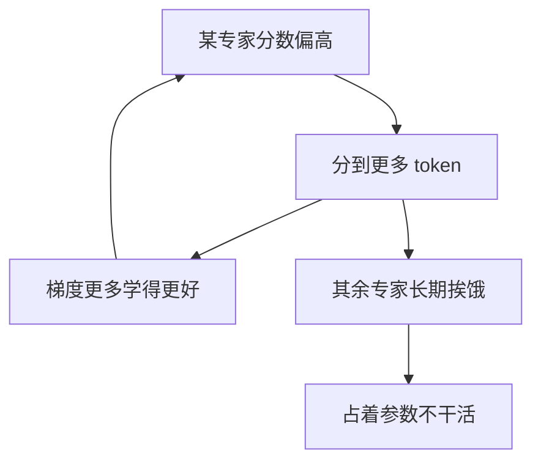

# MoE 路由(打分函数、TopK 与负载均衡)

> 🔴 重点考点:本篇是当前复习重点,文末「面试考点串联」给出问法对照。

一句话:**router 是 MoE 里唯一一个必须自己学会做离散决策的部件**——它给每个 token 挑 K 个专家,挑这个动作本身不可导,还得在几百上千个专家的规模下保证谁都别撑死、谁都别饿死。

本篇只讲**训练时的路由算法**:怎么打分、怎么选人、怎么把负载压平。MoE 本体是什么、专家怎么切细、共享专家与 Dense 前缀怎么设计,见 MoE基础 篇;路由结果出来之后的 All-to-All、专家并行切分、推理时的热专家与通信重叠,见 MoE并行与DeepEP 篇。

> **类比**:router 是医院分诊台,不看病,只凭一眼把病人分给 K 个专科医生。麻烦有两件——分诊台**吃不到药效的梯度**(病治没治好,反馈很难精确落回「当初该不该这么分」),而且天然有**名医效应**(口碑好的医生病人越来越多、经验涨得越来越快,其余医生门可罗雀)。

## 一、一次路由做三件事

### 打分 → 选人 → 加权

router 本体小得惊人:一个线性层。对 token 隐状态 $x$,给 $N$ 个专家各打一个分,取分最高的 $K$ 个,再把它们的输出按归一化后的分数加起来:

$$
s_i = \operatorname{score}\!\left(x^{\top} e_i\right), \qquad \mathcal{T} = \operatorname{TopK}\!\left(\{s_i\}_{i=1}^{N}\right), \qquad y = \sum_{i \in \mathcal{T}} \frac{s_i}{\sum_{j \in \mathcal{T}} s_j}\, E_i(x)
$$

这个式子说的是:**先给所有专家排个队,只让前 K 名干活,再按他们的分数决定各自的话语权。** $e_i$ 是专家 $i$ 的可学习「质心」向量,打分就是 token 和它做一次内积;$\operatorname{score}$ 把内积压成分数(下一节的主角);$E_i$ 是专家 FFN,它自身的结构见 FFN与激活 篇。

### Top-K 是离散选择,router 为什么还训得动

这是最高频的第一层追问,答案要落到梯度路径上,不能只说「能训」。

**被选中的那 K 条路,梯度照走。** 门控权重 $g_i = s_i / \sum_{j \in \mathcal{T}} s_j$ 是一个连续函数,它乘在专家输出上、直接进了 $y$。主任务损失对 $y$ 求导之后,梯度顺着 $g_i \to s_i \to e_i$ 一路回到 router 的权重。**不可导的只是「取前 K 名」这个索引动作**,而它在反向传播里被当成一张固定的 mask:决定哪几条路存在,自己不参与求导。

**没被选中的专家,梯度恒为 0。** 它的 $s_j$ 压根没出现在 $y$ 的表达式里,这个 token 对它一次乘法都没做。落选专家因此拿不到任何「其实我更合适」的反馈,只能等**别的 token** 选中它。

这两句合起来就是本篇后面全部内容的由头:**路由的自我修正能力天生是单向的**,被选中的越练越好,落选的连辩解的机会都没有。想让它别一路歪下去,必须从外面加干预。

### 三组旋钮,别混着说

上面三步各有一组独立的旋钮,面试里最容易被问穿的就是把它们搅在一起:

| 步骤 | 旋钮是什么 | 典型手段 |
|---|---|---|
| **打分** | 用什么函数把内积压成分数 | softmax / sigmoid / Sqrt(Softplus) / ReLU;加不加噪声;要不要 z-loss 压数值 |
| **选谁** | 怎么从分数变成一份名单 | Top-K、Top-1、加负载偏置、哈希指定、专家反选 token、容量封顶 |
| **加权** | 选中之后各占多大话语权 | 用原始分数还是加了偏置的分数、归不归一化、要不要额外缩放系数 |

记住一条:**几乎所有负载均衡方案动的都是第二列(选谁),不是第一列或第三列**。这也是下面几节的排序依据。

## 二、打分函数:softmax → sigmoid → Sqrt(Softplus) → ReLU

| 打分函数 | 代表 | 性质 |
|---|---|---|
| **Softmax** | Shazeer 2017、GShard、Switch、Mixtral | $N$ 个分数和为 1,专家之间**互相挤占**:一个高了别的必须低 |
| **Sigmoid** | DeepSeek-V3、Kimi K3 | 每个专家**独立**打分,互不挤占 |
| **Sqrt(Softplus)** | DeepSeek-V4 | 平滑、恒正、**没有上界**;V4 报告明说是从 Sigmoid 换过来的 |
| **ReLU** | ReMoE | 分数 $\le 0$ 即不激活,**连 TopK 这一步都不要**,路由全程可导 |

**softmax → sigmoid 这步迁移值得讲透。** DeepSeek-V3 报告只给了配置没给理由,通行的解释有两条:

1. **「专家互斥」这个假设不成立**。softmax 把 $N$ 个分数压成一个和为 1 的分布,等于假定专家之间零和;可一个 token 完全可能同时和两个专家高度相关(既是代码又是数学),softmax 强迫它们互相压制。sigmoid 把每个专家独立压到 $(0,1)$,允许「都拿高分」。类比:softmax 是总票数固定的投票,投给 A 就不能投 B;sigmoid 是复选框,每项独立打勾。
2. **专家一多,softmax 的分布容易走极端**。指数会放大 logit 差距,几百个专家抢同一份概率预算,训练后期很容易出现一家独大的尖峰;独立打分温和得多。改成 sigmoid 之后归一化只发生在**选中的 K 个之间**,再配一个缩放系数把路由专家和共享专家的贡献拉平(DeepSeek-V4-Flash 的这个系数是 1.5)。

**ReLU 路由(ReMoE)冲的是上一节那个「TopK 不可导」的老大难**:分数为正才激活,权重连续可调,整条路由端到端可导;稀疏度不再由 K 写死,而是靠一个自适应的 L1 正则把平均激活比例压到目标值。代价是稀疏度从「直接指定的常数」变成了「需要被调控的量」。

**顺带划清一条边界:router z-loss 不是打分函数,也不是均衡手段。** 它是 ST-MoE 提出的惩罚项,把 router logits 的 log-sum-exp 平方后加进损失,专门压住 logits 别涨太大——softmax 里的指数会放大数值误差,论文给的例子是 bf16 下 logit 在 128 量级时,半个单位的舍入就能让 softmax 输出差三成。它只管**数值稳定**,不管谁忙谁闲,所以通常和均衡损失叠着用,系数常见取 0.001。

## 三、负载不均:一个自我强化的死循环

### 循环是怎么转起来的

初始化时 router 是随机的,谁先被选纯属运气;但被选中就能拿到梯度、就能变强:

这就是 **routing collapse(路由坍缩)**。规模会放大它:8 选 2 时路由抖一下是小事,896 选 16 时每个专家平均只分到不到 2% 的 token,梯度信号本来就稀薄,router 稍偏一点专家就饿死了。

### 三笔代价

- **计算与通信热点**。同步训练每一步都要等最慢的那张卡;专家摊在不同 GPU 上,负载塌向少数专家等于把整步耗时压在几张卡上。有容量上限时,热门专家还会溢出丢 token。这笔账在系统侧能量化成「整层算力利用率上界约 $1/\rho$」($\rho$ 是最忙那张卡拿到的 token 数除以平均值),推导见 MoE并行与DeepEP 篇。
- **冷门专家白占容量**。MoE 的全部卖点是「总参数大」,而权重推理时一个都不能少。一个从来收不到 token 的专家,显存照占、通信照配、质量零贡献,**这是 MoE 最贵的一种浪费**。
- **模型质量受损**。热门专家被迫处理它并不擅长的 token,细粒度切分本来要买的那份组合优势直接作废。

一个必须说准的细节:**热门专家的权重不会因为多接了 token 就变大**。长的是待处理 token 数、激活和通信缓冲这些跟 batch 走的量。被问「负载不均会让哪些显存项涨」,答「专家权重」就露怯了。

## 四、干预手段:它们解决的不是同一个问题

这张表是本篇的骨架。**先分清每个手段动的是哪一步、治的是哪个病,再谈调参**:

| 手段 | 动哪一步 | 治什么 | 边界 |
|---|---|---|---|
| **路由噪声**(Noisy Top-K) | 打分 | **探索**:给冷门专家一个被撞见的机会,打断早期的运气锁定 | 不保证均衡;噪声太大直接损害选择质量 |
| **均衡辅助损失** | 打分(经梯度) | **长期偏好**:改变 router 以后倾向选谁 | 是一条会和主任务抢方向的梯度,系数难调 |
| **负载偏置**(aux-loss-free) | 选谁 | 同上,但**不产生任何梯度** | 更新速度与统计窗口要调;只改选择,加权仍用原始分数 |
| **容量上限**(capacity factor) | 选谁之后兜底 | **硬止损**:限制单个专家这一批最多收多少 token | 完全不改 router 的偏好;超额 token 丢弃/旁路/改派都不免费 |
| **Expert Choice** | 把选择方向反过来 | 专家挑 token,每个专家的工作量天然可控 | 每个 token 被选中的次数不再固定;要看到整批 token 才能挑,自回归解码时不能照搬 |
| **Sinkhorn 类分配** | 选谁之前 | 先把软分配调得接近双随机,当一个更匀的起点 | 之后仍按 token 取硬 Top-K,**不保证最终计数相等** |
| **哈希路由** | 绕开学习 | 固定的 token-id → expert-id 表,**天生均匀、不需要均衡损失** | 完全不看语义 |
| **router z-loss** | 打分的数值尺度 | 稳定性 | **它不做负载均衡**,见上一节 |

三条容易被追问的补充:

- **容量上限的账**。给每个专家设一个上限 $C = \mathrm{CF} \cdot TK/N$:$T$ 是这一批的 token 数,$TK/N$ 就是「完全均匀时每个专家该收到多少」,容量因子 $\mathrm{CF}$ 是在这个理想值上留的余量(ST-MoE 的训练取 1.25、评测取 2.0)。CF 小了溢出的 token 被丢掉、这一层只走残差旁路,质量掉;CF 大了缓冲全是 padding,算力和显存白花。**关键是它治标不治本**:容量只给热点封了个顶,router 的偏好一点没变。均衡做好之后这套基本退役,DeepSeek-V3 报告明说训练全程不丢任何 token。
- **Sinkhorn 不等于均衡**。以本地 2026-04 的 Megatron-LM 快照为准,它的 Sinkhorn 路由分支是在软归一化之后**仍按 token 取 Top-K**,而且代码里直接断言这条路径不能同时开均衡损失。所以软分配再匀,硬路由后的实际计数还是要单独监控。
- **哈希路由为什么只在最前面几层用**。DeepSeek-V4 把 V3 的 Dense 前缀换成了哈希 MoE:最前面 3 层用一张冻结的 token-id → expert-id 查表决定**选谁**,学出来的 gate 仍然负责给选中的专家**打分加权**。理由和 Dense 前缀是同一个——底层 token 表示还没分化,router 缺少可靠的分科依据,这时候用一张固定表既天然均匀又不会训崩;等表示分化开了,再交还给学出来的 router。

## 五、辅助均衡损失:唯一直接给 router 打梯度的那条

Switch 风格的均衡损失,直接惩罚「分配不均」:

$$
\mathcal{L}_{\text{bal}} = \alpha \cdot N \sum_{i=1}^{N} f_i P_i
$$

这个式子读作「实际负载 × 平均概率」的加权和:$f_i$ 是这一批里实际落到专家 $i$ 的 token 占比,$P_i$ 是 router 给专家 $i$ 的平均打分概率,$\alpha$ 控制力度。**一个专家越忙($f_i$ 大),继续给它高概率($P_i$)的代价就越大。**

**它为什么能改变后续的路由**,机械答案就一句:$f_i$ 是计数,不可导,反传时当常数;**梯度全从 $P_i$ 走**,直接落在 router 的打分层上,把概率质量从热门专家往冷门专家推。下一批 token 再来时,router 的打分已经变了。注意这里不能说过头——「实际负载与平均概率的点积在均匀时取全局最小」不是一个可以随口下的结论,该项在完全均匀时等于 $\alpha$,但两个任意概率向量的点积并没有这个性质。

**$\alpha$ 太大会怎样,怎么和主损失取舍。** 均衡梯度会持续把 router 往「雨露均沾」方向拽,哪怕某些 token 明明就该去某个专家。$\alpha$ 调大,负载直方图很快就平了,但主任务质量会跟着掉——**均匀本身从来不是目标,它只是让全部参数都被用上的手段**;$\alpha$ 调小,压不住热点。它还和公式的归一化写法强耦合,不同实现的系数不能直接照搬。取舍的做法是**联看**:验证损失、各层负载分布、溢出率、步耗时放在同一张图上,而不是盯着直方图调平。

## 六、aux-loss-free:把均衡从训练目标降级成调度规则

### 偏置只进选择,不进加权

给每个专家一个偏置 $b_i$,**只在 TopK 排序时加上,不进门控权重**:

$$
\mathcal{T} = \operatorname{TopK}\!\left(\{s_i + b_i\}\right), \qquad y = \sum_{i \in \mathcal{T}} \frac{s_i}{\sum_{j \in \mathcal{T}} s_j}\, E_i(x)
$$

左边用带偏置的分数决定**选谁**,右边的加权用回原始的 $s_i$。类比:不是罚医生「你今天看太多病人了」,而是**悄悄调整分诊台的推荐排序**,让忙的医生往后排一点;病人对医生的真实评价一分不改。

$b_i$ 不由梯度更新,每步结束后按一条统计规则调整:

$$
b_i \leftarrow b_i + \gamma \cdot \operatorname{sign}\!\left(\bar{c} - c_i\right)
$$

$c_i$ 是这一步专家 $i$ 实际收到的 token 数、$\bar{c}$ 是平均值:过载就把偏置往下挪一小步,闲置就往上挪一小步,步长恒为 $\gamma$。它跑在训练循环外面,是一条**调度规则**,不是训练目标。

**为什么这条路线赢了**:它不往主损失里加项,就不会产生和语言建模目标抢方向的干扰梯度——负载均衡从「训练目标」降级成「调度规则」,这正是它该待的位置。DeepSeek-V3 的落地数字很能说明它有多稳:$\gamma$ 在前 14.3T token 取 0.001,最后 500B token 直接归零;主损失里只额外留了一个系数 $\alpha = 0.0001$ 的序列级均衡损失当保险丝,报告里的说法是「只为避免单条序列内部出现极端失衡」。配套还有 node-limited routing(每个 token 最多落到 4 个节点),以及那句结论:**全程不丢任何 token**。

要说准的一点:偏置**不直接改**选中之后的加权分数,但它改变了「谁被选中」,所以质量该测还得测,不能说它对模型没有影响。

### Kimi K3 的 Quantile Balancing:不再步进,直接解到位

$\gamma$ 是这套方案里最后一个手调超参:小了适应慢,大了负载来回振荡。Kimi K3 在 896 选 16 的稀疏度下把它也去掉了——既然目标是「让专家 $i$ 恰好收到目标负载」,那就**直接把 $b_i$ 解到那个点**,而那个点正好是 router 打分间隔(margin)分布的一个分位数。做法是每步多取一名(Top-$(K{+}1)$),用第 $K{+}1$ 名的分数当每个专家必须跨过的门槛,再从这批 margin 里读出 $1 - K/N$ 分位点(专家总数 $N$ 里每个 token 挑 $K$ 个,均匀时每个专家本来就该跨过 $K/N$ 比例的 token)。

全局精确分位数算不起:margin 数以百万计,还散在各 rank 与梯度累积步上。K3 的工程解法是每个 rank 各建一个直方图,**一次 all-reduce 把 bin 计数加起来**,从合并后的计数里反读分位点——计数是可加的,所以不管 token 怎么切分,估出来的都是全局批次的分位数,精度只受 bin 宽度限制。推理时偏置冻结。

一句话记住这条演进线:**均衡损失(改梯度)→ 偏置步进(改排序,还要调步长)→ 偏置解析解(改排序,没有步长可调)**。

## 七、选型与救火

### Top-1 与 Top-K 各有什么优势

| | Top-1(Switch) | Top-K($K \ge 2$) |
|---|---|---|
| 每 token 专家计算 | 1 份,最省 | $K$ 份 |
| 分发的数据量 | 最少 | token 要被复制 $K$ 份 |
| 表达能力 | 只有 $N$ 种选择 | $\binom{N}{K}$ 种组合 |
| 梯度覆盖 | 每个 token 只喂到 1 个专家 | $K$ 个专家同时拿到梯度,冷门专家更容易被捎上 |
| 选错的代价 | 高:错了这个 token 整份计算白费 | 低:还有 $K-1$ 个兜底 |

Switch 的论点是「同样算力预算下,把 K 压到 1、把专家数翻倍更划算」;现在主流站在细粒度 + 较大 K 这一边(V3 是 256 选 8,K3 是 896 选 16)。但有一句必须说清:**K 不是均衡旋钮**。开大 K 只是让每个 token 多押几注、也多花几份计算与通信,热门专家该被选还是被选。

### 监控:不能只追求均匀

| 看什么 | 怎么看 | 为什么必须单独看 |
|---|---|---|
| 每层专家 token 分布 | 直方图 + 最忙比平均 $\rho$ | 失衡是分层的,平均到全模型就看不见了 |
| 负载分布的熵 | 逐步画曲线 | 塌向少数专家时熵先掉,比「死专家计数」报警更早 |
| 死专家数 | 长期负载趋零的专家个数 | 已经死掉的专家很难自己活回来 |
| 溢出率 | 有容量上限时的丢弃比例 | 直接对应被跳过 FFN 的 token 数 |
| 验证损失 | 和上面几项画在同一张图上 | **均匀本身不是目标**,压平了但更差就是负收益 |
| 步耗时 | 每步墙钟时间 | 均衡改善了却更慢,说明代价换到了别处 |

死循环几乎都在训练前期形成,监控重点放在前期。

### 已经严重倾斜时怎么干预

按代价从低到高,每步都能停:

1. **先排除假故障**。统计口径或计数是不是错了、这一批数据是不是本来就偏科、router logits 有没有数值异常。数值发散先上 z-loss,别急着动均衡系数。
2. **确认死专家是否还有机会**。看它的偏置有没有被推上去、有没有 token 开始回流;彻底零负载和「慢慢回暖」是两种病。
3. **再动旋钮**,一次只动一个:调大均衡系数或偏置更新速度、加探索噪声、必要时临时收紧容量上限。
4. **最后才回退到更早的健康检查点**。重置或重新初始化专家会把它已经学到的东西一起丢掉,不是无代价的修复。

## 八、往上一层:稀疏度、LatentMoE 与优化器是一条链

**LatentMoE 不是「省通信的小优化」,它是把路由问题本身放大一个量级的开关。** 做法是先把 token 从模型宽度 $d$ 投影到更窄的潜维度 $\ell$,路由专家全部在 $\ell$ 维里算,算完再投回 $d$——类比跨科室会诊不再推着整车病历跑,先把病历浓缩成一页摘要,专科医生在摘要上写意见。

关键在于省下来的额度花到哪去了。每个专家的权重和每次搬运的 token 都按 $d/\ell$ 缩小,Nemotron 3 Super 把这笔钱**原样投回稀疏度**:专家数从 $N$ 变成 $N \cdot d/\ell$,每 token 激活数从 $K$ 变成 $K \cdot d/\ell$。Super 的尺寸是 4096 → 1024(4 倍压缩),于是同样的推理成本能叫来 4 倍的专家;Ultra 是 8192 → 2048,同样 4 倍。Kimi K3 的 Stable LatentMoE 走同一条路,配的是 896 选 16。通信侧省了多少、怎么和 all-to-all 配合,见 MoE并行与DeepEP 篇。

于是有了一条很干净的因果链:**想更稀疏 → 每个专家分到的 token 和梯度更稀薄 → router 必须更鲁棒 → 路由算法和优化器都得跟着换。**

- **Kimi K3(896 选 16)**:报告直说在这个稀疏度下,路由和优化本身成了一阶难题,所以三件套打包上——Stable LatentMoE(压维度换专家数)+ Quantile Balancing(去掉最后一个均衡超参)+ Muon 系优化器;
- **DeepSeek-V4**:打分换成 Sqrt(Softplus)、去掉 V3 的分组路由限制、最前面 3 层改哈希 bootstrap,同样配 Muon。

优化器本身的机制见 优化器 篇。反过来读也成立:看到一个新模型把专家数推到几百上千,就该去它的配置里找打分函数和均衡方案动了什么——大概率不再是 softmax + TopK + aux loss。

## 九、面试考点串联

| 高频问法 | 本文哪一节 |
|---|---|
| Top-k 是离散选择,router 为什么仍然训得动? | 一(梯度走门控权重那一路,落选的恒为 0) |
| 一次 MoE 路由做了哪三件事,各自的旋钮是什么? | 一(三组旋钮表) |
| router 为什么从 softmax 换成 sigmoid?后来又换成了什么? | 二 |
| 少数专家吃掉大部分 token 会有什么影响? | 三(死循环 + 三笔代价) |
| 负载不均会让哪些显存项涨? | 三(是激活与缓冲,不是专家权重) |
| 从损失函数、路由机制、容量管理上分别怎么改善? | 四(总表)+ 五、六 |
| 辅助均衡损失为什么能改变后续的路由? | 五(梯度经平均概率 $P_i$ 走) |
| 均衡损失系数太大会怎样,怎么和主损失取舍? | 五 |
| 不加均衡损失,还能怎么调负载? | 六(偏置只进 TopK) |
| aux-loss-free 的偏置为什么不进门控权重? | 六 |
| 容量因子、探索噪声、负载偏置分别解决什么问题? | 四(三者不能混为一谈) |
| Expert Choice 和 Sinkhorn 各自保证了什么、没保证什么? | 四 |
| Top-1 和 Switch 的 Top-K 各有什么优势?K 开大能改善均衡吗? | 七(不能) |
| 负载已经严重倾斜了,训练中怎么动态干预? | 七(四步排查顺序) |
| 只盯着负载直方图调平,有什么问题? | 七(监控清单) |
| LatentMoE 只是省通信吗?(补充题) | 八 |
| 稀疏度、路由算法和优化器为什么绑在一起?(补充题) | 八 |
| 哈希路由不学习也能用,为什么只放在最前面几层?(补充题) | 四 |
| router z-loss 算不算负载均衡手段?(补充题) | 二、四(不算) |

边界说明:细粒度专家、共享专家、Dense 与 MoE 的参数与 FLOPs 账见 MoE基础 篇;All-to-All 通信开销怎么优化、推理时专家负载不均带来的延迟怎么处理、通信与计算怎么重叠,见 MoE并行与DeepEP 篇;专家 FFN 自身的结构见 FFN与激活 篇;Muon 等优化器机制见 优化器 篇。

## 相关文献

- Outrageously Large Neural Networks: The Sparsely-Gated Mixture-of-Experts Layer(Noisy Top-K 门控 + importance / load 两个均衡损失的开山之作)— [arXiv:1701.06538](https://arxiv.org/abs/1701.06538)
- GShard: Scaling Giant Models with Conditional Computation and Automatic Sharding(Top-2 路由与专家容量的规模化落地)— [arXiv:2006.16668](https://arxiv.org/abs/2006.16668)
- Switch Transformers: Scaling to Trillion Parameter Models with Simple and Efficient Sparsity(Top-1 路由、aux loss、capacity factor)— [arXiv:2101.03961](https://arxiv.org/abs/2101.03961)
- Hash Layers For Large Sparse Models(固定哈希路由:不需要路由参数,也不需要均衡损失)— [arXiv:2106.04426](https://arxiv.org/abs/2106.04426)
- ST-MoE: Designing Stable and Transferable Sparse Expert Models(router z-loss;训练容量因子 1.25、评测 2.0)— [arXiv:2202.08906](https://arxiv.org/abs/2202.08906)
- Mixture-of-Experts with Expert Choice Routing(反过来让专家挑 token)— [arXiv:2202.09368](https://arxiv.org/abs/2202.09368)
- Mixtral of Experts(8 选 2 的 softmax 路由)— [arXiv:2401.04088](https://arxiv.org/abs/2401.04088)
- DeepSeekMoE: Towards Ultimate Expert Specialization in Mixture-of-Experts Language Models(细粒度切分 + 共享专家)— [arXiv:2401.06066](https://arxiv.org/abs/2401.06066)
- Auxiliary-Loss-Free Load Balancing Strategy for Mixture-of-Experts(偏置均衡原文)— [arXiv:2408.15664](https://arxiv.org/abs/2408.15664)
- ReMoE: Fully Differentiable Mixture-of-Experts with ReLU Routing(ReLU 路由与自适应稀疏度)— [arXiv:2412.14711](https://arxiv.org/abs/2412.14711)
- DeepSeek-V3 Technical Report(sigmoid 打分、$\gamma$ 与序列级均衡损失的具体系数、全程不丢 token)— [arXiv:2412.19437](https://arxiv.org/abs/2412.19437)
- Nemotron 3 Super(LatentMoE:压维度,把省下的额度换成更多专家与更大 K)— [arXiv:2604.12374](https://arxiv.org/abs/2604.12374)
- DeepSeek-V4: Towards Highly Efficient Million-Token Context Intelligence(Sqrt(Softplus) 打分、前 3 层哈希 bootstrap)— [arXiv:2606.19348](https://arxiv.org/abs/2606.19348)
- Kimi K3: Open Frontier Intelligence(Quantile Balancing 与 Stable LatentMoE)— [arXiv:2607.24653](https://arxiv.org/abs/2607.24653)
