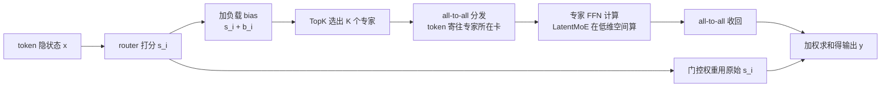

# MoE 路由(Router、负载均衡与 LatentMoE)

> 🔴 重点考点:本篇是当前复习重点,文末「面试考点串联」给出问法对照。

> ⚠️ 旧版:本篇写于写作契约确立之前,尚未按新标准审查重写。标准见 docs/05-知识库写作契约.md,样板见「GPU架构与执行模型」。

一句话:**router 是 MoE 里最容易出问题的部件**——它做的是一个不可导的离散选择(给每个 token 挑 K 个专家),还要在几百个专家、上万亿参数的规模下始终保持负载均衡。MoE 本体是什么、专家粒度与共享专家怎么设计,见「MoE基础」篇;本篇只盯着分诊台本身。

## 一、基本形态:打分 → TopK → 加权

router 本体小得惊人:一个线性层。对 token 隐状态 $x$,给 $N$ 个专家各打一个分,取前 $K$ 名,把选中专家的输出按归一化权重加起来:

$$
s_i = \operatorname{score}\!\left(x^{\top} e_i\right), \qquad \mathcal{T} = \operatorname{TopK}\!\left(\{s_i\}_{i=1}^{N}\right), \qquad y = \sum_{i \in \mathcal{T}} \frac{s_i}{\sum_{j \in \mathcal{T}} s_j}\, E_i(x)
$$

其中 $e_i$ 是专家 $i$ 的可学习"质心"向量,$\operatorname{score}$ 是打分函数(softmax / sigmoid / ReLU 等,见下节),$E_i$ 是专家 FFN。

> **类比**:router 是医院分诊台。它不亲自看病,只凭一眼判断把病人分给 K 个专科医生;可"分诊"这个动作本身吃不到药效的梯度——病治没治好,反馈很难精确落回"当初该不该这么分"。

难点全在 TopK 这一步:

- **离散选择不可导**:TopK 是硬闸门,只有"选/不选",没有"选 0.7 个"。梯度只能流进被选中的专家;落选专家收不到"其实你更合适"的反馈,只能靠 router 打分那一路间接学。
- **训练早期的随机性会被放大**:初始 router 是随机的,谁先被选纯属运气——但被选中就能拿到梯度、就能变强,运气经正反馈放大成马太效应(下文的死循环)。
- **规模放大一切**:8 选 2 时路由抖一下是小事;896 选 16(Kimi K3)时每个专家平均只分到约 1.8% 的 token,梯度信号本来就稀薄,router 稍偏,专家就"饿死"。

## 二、打分函数的演化:softmax → sigmoid → ReLU → 哈希 → 分位数

| 打分方式 | 代表 | 特点 |
|---|---|---|
| **Softmax** | Mixtral、传统做法 | 分数和为 1,专家之间**竞争**:一个高了别的必须低 |
| **Sigmoid** | DeepSeek V3 起、Laguna | 每个专家**独立**打分,互不挤占 |
| **ReLU** | ReMoE、BlockFFN | 天然输出大量零,稀疏度可平滑学习,路由全程可导 |
| **哈希** | DeepSeek V4 | 按哈希指派,大幅减少对学习出的分数的依赖 |
| **分位数(quantile)** | Kimi K3 Stable LatentMoE | 按分数分位数划线,去掉超大规模下容易崩的脆弱超参 |

**softmax → sigmoid 这步迁移值得讲透**,两个原因:

1. **竞争假设不成立**。softmax 把 N 个分数压成和为 1 的分布,隐含"专家互斥"——但一个 token 完全可能同时与两个专家高度相关(既是代码又是数学),softmax 强迫它们互相压制;sigmoid 每个专家独立挤压到 $(0,1)$,允许"都拿高分"。类比:softmax 是总票数固定的零和投票,投给 A 就不能投 B;sigmoid 是复选框,每项独立打勾。
2. **缓解极端分数分布**。softmax 的指数会急剧放大 logit 差距,训练后期容易出现一家独大的尖峰分布;sigmoid 独立打分,分布温和得多。DeepSeek V3 换 sigmoid 后还加了一个标量缩放因子,用来平衡共享专家与路由专家的贡献。

**ReLU 路由(ReMoE)瞄准的是第一节的老大难**:把 TopK 硬闸门换成 ReLU 软闸门——分数 $\le 0$ 即不激活,$> 0$ 即激活且权重连续,整条路由全程可导;再用自适应 L1 正则把平均激活比例压到目标稀疏度。**哈希与分位数**则是超大规模下"求稳"的两条路:哈希干脆少依赖学出来的分数;分位数把"选谁"变成"划及格线",门槛随分数分布自动移动,不留一个手调就崩的超参——类比按当日客流动态划定挂号线,而不是拍脑袋定死一个号数。

## 三、负载均衡:MoE 的天然死循环

### 死循环是怎么形成的

某个专家早期碰巧表现好 → router 学到"送它准没错",更多 token 被送过去 → 它见的数据更多、学得更好 → 分数更高、又被送更多……最后少数专家承担全部工作,其余专家长期拿不到梯度——**专家死亡(routing collapse)**。类比名医效应:口碑好的医生病人越来越多、经验涨得越来越快,其他医生门可罗雀,科室名存实亡。对模型这不止浪费参数:专家分布在不同 GPU 上,负载塌向少数专家等于把算力也压在几张卡上。

### 传统解法:辅助损失(aux loss)

Switch Transformer 风格的均衡损失,直接惩罚"分配不均":

$$
\mathcal{L}_{aux} = \alpha \cdot N \sum_{i=1}^{N} f_i \cdot P_i
$$

$f_i$ 是实际被分到专家 $i$ 的 token 比例(不可导),$P_i$ 是 router 给专家 $i$ 的平均打分概率(可导,梯度从这里走)。均匀分配且平均概率也均匀时,该项为 $\alpha$。实际负载在这一步视为固定计数,梯度经平均概率压低热门专家的相对吸引力;不能把两个任意概率向量的点积说成在均匀时总取全局最小。

**需要权衡:均衡目标可能与当前 token 的最佳专家匹配冲突。** 均衡梯度持续把 router 往"雨露均沾"方向拽,哪怕某些 token 明明就该去某个专家。$\alpha$ 调大,可能过度追求均匀而损害任务质量;调小,可能压不住热点;要联看验证损失、负载和吞吐来调节。

### DeepSeek 的 aux-loss-free 方案(2024 年最漂亮的 trick)

给每个专家一个 bias $b_i$,**只在 TopK 选择时加上,不进入门控权重**:

$$
\mathcal{T} = \operatorname{TopK}\!\left(\{s_i + b_i\}\right), \qquad y = \sum_{i \in \mathcal{T}} \frac{s_i}{\sum_{j \in \mathcal{T}} s_j}\, E_i(x)
$$

而 $b_i$ **不由梯度更新**,每个训练步结束后按一条简单规则调整:统计本批次各专家负载 $c_i$,过载的减、闲置的加:

$$
b_i \leftarrow b_i + \gamma \cdot \operatorname{sign}\!\left(\bar{c} - c_i\right)
$$

($\bar{c}$ 是平均负载,$\gamma$ 是很小的更新步长。)

> **类比**:不是罚医生「你今天看太多病人了」,而是**悄悄调整分诊台的排序**,让忙的医生在推荐列表里往后排。病人对医生的真实评价($s_i$,也就是最终的门控权重)一分不改。

为什么说漂亮:

- **不进损失函数**:不产生任何干扰梯度,不和语言建模目标打架——负载均衡从"训练目标"降级为"调度规则",这正是它该待的位置;
- **只影响"选谁",不影响"信多少"**:选中之后的加权仍用原始 $s_i$,不直接改动选中后的加权分数,但专家选择已改变,仍要验证任务质量;
- 原论文实测均衡更好、模型也更好。DeepSeek V3 大规模落地时只额外留了一个系数极小的序列级均衡损失当保险丝,主力全靠 bias。此后该方案被广泛采用。

### 其他均衡机制与硬路由边界

路由噪声增加探索,容量上限限制单个专家的接收量,动态偏置改变选择排序,三者不能混为一谈。容量可按平均分配量乘容量因子估计,超额 token 如何旁路、丢弃或改派取决于实现;扩大容量可能多占缓冲,并不能保证专家训练更均匀。

Expert Choice 是**专家挑 token**,每个专家可有固定容量,每个 token 获选次数则可能不同。Sinkhorn 类方法先约束软分配,若再取硬 Top-K,不能无条件保证最后的 token 计数严格相等。按本地 2026-04 Megatron-LM 源码快照,其训练 Sinkhorn 路径正是软归一化后按 token 取 Top-K,因此仍要监控硬路由负载。

Top-1 少算、少分发一条专家路径;提高 K 增加组合也增加开销,不是保证均衡的办法。路由 z-loss 主要约束 logits 的数值尺度,不能代替直接针对专家工作量的均衡机制。

### 怎样监控与干预

同时看每层的专家 token 分布、长期空闲专家、溢出率、最大与平均负载之比、验证损失和步耗时。热门专家的参数不会因多接 token 而扩大,会变化的是它的激活、缓冲与计算负载。已出现严重倾斜时先查计数、数据偏科和数值异常,再调均衡系数、偏置或探索;必要时回退健康检查点。重置专家会丢掉能力,不能随意当作常规修复。

训练分布均衡不代表线上流量均衡。通信优化、专家副本与放置调整见 MoE并行与DeepEP 篇;细粒度与共享专家的设计及 Dense 对比见 MoE基础 篇。

## 四、LatentMoE:先压缩,再会诊

Nemotron 3 Super 与 Kimi K3(Stable LatentMoE)的新招:**把 token 先投影到低维潜空间,专家在低维空间里计算**,算完再投影回来。

动机不在模型质量,在**系统**:多卡部署时专家分布在不同 GPU 上,每个 token 要通过 all-to-all 通信"寄"到它选中的专家所在的卡,算完再寄回——**通信量随 token 表示维度线性增长**,表示压得越小,寄的包裹越小。类比:跨科室会诊不再推着整车病历跑,先把病历浓缩成一页摘要,专科医生在摘要上写意见。

这是典型的「**架构为系统服务**」:动刀的理由是分布式训练/推理的通信开销,而不是损失曲线。在 K3 这种 896 专家的规模下 all-to-all 是头号瓶颈之一,LatentMoE 因此从可选优化变成配套必需品。

## 五、耦合:稀疏度 ↔ 路由 ↔ 优化器

一条清晰的因果链:**想更稀疏 → 每个专家分到的梯度信号更稀薄 → router 必须更鲁棒 → 路由算法和优化器都得跟着换。**

- **Kimi K3(16/896,稀疏度 1.8%)**:官方明说在这个稀疏度下"路由和优化本身变成一阶难题",所以打包三件套——Stable LatentMoE(压通信)+ 分位数路由(去脆弱超参)+ Muon 系优化器(稳大 batch 训练,见「优化器」篇);
- **DeepSeek V4-Pro(稀疏度 3.1%)**:配的是哈希路由 + Muon + mHC。

反过来读也成立:看到新模型把稀疏度推到 5% 以下,就该去 config 里找它的路由和优化器动了什么——大概率不再是 vanilla softmax TopK + AdamW。

## 六、一次前向的完整数据流

注意两条支路:bias 只进 TopK 那一条;门控权重从原始 $s_i$ 直接走——这正是 aux-loss-free"只动排序、不动评价"的图形化。

## 七、细节与坑

- **capacity factor 与 token 丢弃(早期方案)**:Switch 时代给每个专家设容量上限 $C = \mathrm{CF} \cdot \frac{TK}{N}$($T$ 为 batch 内 token 数),超容的 token 直接丢弃、只走残差旁路。CF 小了丢 token 伤质量,大了全是 padding 浪费算力。均衡做好之后这套基本退役——DeepSeek V3 明确宣布训练全程不丢 token。
- **expert parallelism 的通信瓶颈**:all-to-all 每个 MoE 层来回各一次,专家越多、跨的卡越多越痛。缓解手段:限制每个 token 最多路由到 M 个节点(DeepSeek 的 node-limited routing)、通信与计算重叠,以及第四节的 LatentMoE。
- **路由崩溃的监控指标**:专家负载分布的**熵**(塌向少数专家时熵骤降,最值得盯的一条曲线)、最忙/最闲专家负载比、长期负载趋零的"死专家"数量、router 打分分布的尖锐程度。死循环都是训练早期埋下的,监控重点放在前期。
- **训练均衡 ≠ 推理均衡**:线上流量分布和训练分布不同,仍可能出现热点专家;推理侧要靠 EP 的冗余专家、动态重分片等部署手段兜底。

## 八、面试考点串联

| 面试官可能怎样问 | 回答位置 |
| --- | --- |
| Top-1 与 Top-K 怎么选,路由为什么容易越训越偏? | 一、三:离散选择与正反馈 |
| 专家负载不均会影响什么,哪些显存项会长? | 三:死循环、怎样监控与干预 |
| 辅助损失为什么能改变路由,系数太大有什么问题? | 三:传统解法 |
| 噪声、容量、Expert Choice 和 Sinkhorn 分别解决什么? | 三:其他均衡机制与硬路由边界 |
| 不加均衡损失还能怎样调负载? | 三:动态偏置 |
| 负载已经严重倾斜时先查什么,怎样干预? | 三:怎样监控与干预 |
| LatentMoE 为什么能减少通信? | 四 |
| 训练均衡是否能保证推理均衡? | 七;部署措施见 MoE并行与DeepEP 篇 |

## 相关文献

- Switch Transformer(TopK 路由 + aux loss + capacity factor 奠基)— [arXiv:2101.03961](https://arxiv.org/abs/2101.03961)
- Auxiliary-Loss-Free Load Balancing Strategy for Mixture-of-Experts(bias 均衡原文)— [arXiv:2408.15664](https://arxiv.org/abs/2408.15664)
- DeepSeek-V3(sigmoid 打分 + aux-loss-free 大规模落地)— [arXiv:2412.19437](https://arxiv.org/abs/2412.19437)
- ReMoE: Fully Differentiable MoE with ReLU Routing — [arXiv:2412.14711](https://arxiv.org/abs/2412.14711)
- DeepSeekMoE(细粒度专家 + 共享专家)— [arXiv:2401.06066](https://arxiv.org/abs/2401.06066)
- Kimi K3(分位数路由 + Stable LatentMoE)— https://www.kimi.com/blog/kimi-k3

- Mixture-of-Experts with Expert Choice Routing — [arXiv:2202.09368](https://arxiv.org/abs/2202.09368)
