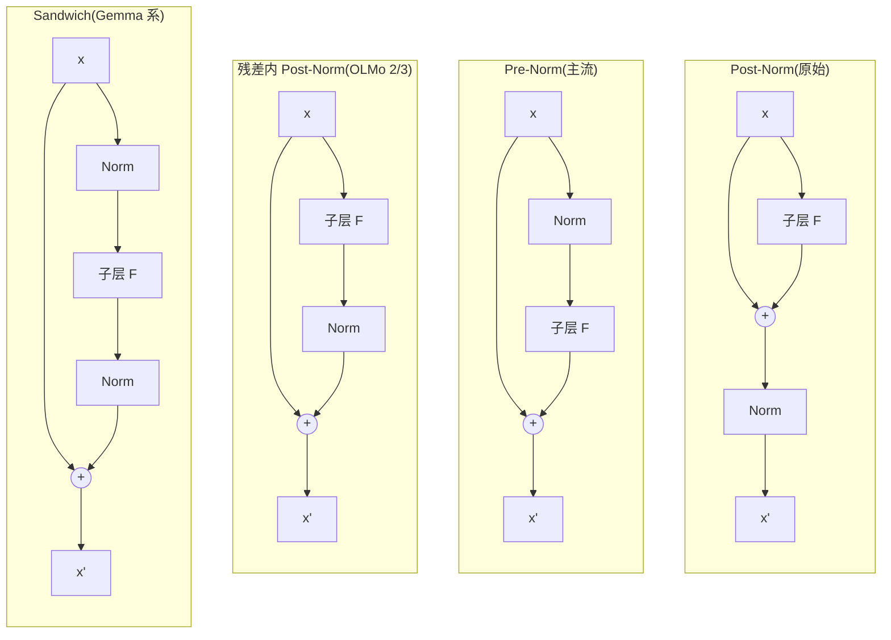

# Norm 的类型与位置(RMSNorm / PreNorm / PostNorm)

一句话:归一化有两场争论——**「类型之争」已经终结,RMSNorm 全面取代 LayerNorm;「位置之争」还活着,Pre-Norm 是绝对主流,但 OLMo 系坚持残差内 Post-Norm,Gemma 系干脆前后都加**。类比:Norm 是每层楼的稳压器,「类型」是稳压器电路怎么造(已有公认答案),「位置」是稳压器装在楼道还是装进房间(各家楼盘还在吵)。

## 一、类型之争:LayerNorm → RMSNorm(已终结)

LayerNorm(2016)对每个 token 的 $d$ 维隐向量做「减均值、除标准差、再仿射」:

$$
\mathrm{LayerNorm}(x) = \frac{x - \mu}{\sqrt{\sigma^2 + \epsilon}} \cdot \gamma + \beta,\qquad \mu = \frac{1}{d}\sum_i x_i,\quad \sigma^2 = \frac{1}{d}\sum_i (x_i - \mu)^2
$$

RMSNorm(2019)把「减均值」与偏置 $\beta$ 都砍掉,只除以均方根:

$$
\mathrm{RMSNorm}(x) = \frac{x}{\sqrt{\frac{1}{d}\sum_i x_i^2 + \epsilon}} \cdot \gamma
$$

**为什么敢砍**:纯实证。RMSNorm 论文发现 LayerNorm 起作用的关键是「限制幅度」(re-scaling 不变性),「对齐均值」(re-centering)基本没贡献——去掉后效果不掉,还省了一遍求均值、一次减法和一个参数向量。类比调音台:LayerNorm 又调零点又调音量,RMSNorm 发现只调音量就够了。单层省的算力是毛毛雨,但 Norm 是访存受限的逐 token 操作,乘上层数 × token 数不白给,且实现更简单、更好做算子融合。

**现状**:2026 年架构手册统计的 93 个前沿模型里,除了 GPT-2(LayerNorm 时代的活化石)全是 RMSNorm。这一战没有悬念了。

## 二、位置之争:梯度流决定生死(还活着)

同一块 Norm,放在残差连接的不同位置,训练动力学天差地别。核心矛盾:**残差主干这条「梯度高速公路」上要不要设收费站**。

### Post-Norm:原始 Transformer 的放法

$$
x_{l+1} = \mathrm{Norm}\big(x_l + F(x_l)\big)
$$

Norm 骑在残差相加**之后**——主干每过一层都被重整一次。反向传播时,底层的梯度要连乘一整串 Norm 的雅可比:

$$
\frac{\partial \mathcal{L}}{\partial x_l} = \frac{\partial \mathcal{L}}{\partial x_L} \prod_{k=l}^{L-1} J_{\mathrm{Norm},k}\,\big(I + F_k'\big)
$$

连乘意味着不受控:层数一深,梯度幅度在层间畸变。Xiong et al. 的初始化分析给出定量结论:Post-Norm 靠近输出层的参数梯度范数是 $O(d\sqrt{\ln d})$,**与总深度 $L$ 无关地大**。学习率必须迁就最坏的那几层,所以 Post-Norm 深网络必须用 lr warmup 伺候——先以极小学习率热身,等 Adam 的二阶矩统计稳了才敢提速,不 warmup 直接发散。

好处也真实:每层输出都被规到单位尺度,没有谁能在残差流里越积越大,层层贡献均衡,深层表示的利用率高。

### Pre-Norm:GPT-2 起的主流

$$
x_{l+1} = x_l + F\big(\mathrm{Norm}(x_l)\big)
$$

Norm 挪进子层**之前**,残差通路上不再有任何变换——从底层到顶层是一条干净的恒等路径。展开看:

$$
x_L = x_l + \sum_{k=l}^{L-1} F_k\big(\mathrm{Norm}(x_k)\big)
$$

对 $x_l$ 求导,梯度里永远有一项**未经任何衰减的恒等项**直达底层——高速公路全程不设收费站。Xiong et al. 对应的结论:Pre-Norm 的同位置梯度范数是 $O(d\sqrt{\ln d / L})$,随深度按 $1/\sqrt{L}$ 自动收敛温和,**可以去掉(或大幅缩短)warmup**、直接上大学习率。深、稳、好调,这就是它统治 GPT-2 之后几乎所有模型的原因。

**代价**:恒等主干无人管辖。每层往里加一个 O(1) 的增量,残差流的范数随深度单调膨胀($\|x_l\|$ 大致按 $\sqrt{l}$ 增长),于是第 $l$ 层的新增量相对主干占比约 $1/\sqrt{l}$,越靠后越像「小修小补」——网络的**有效深度**低于名义深度,行为趋近宽而浅的集成。类比:雪球越滚越大,后面的人再撒一把雪,也改变不了雪球的形状。

### 一张表

| 维度 | Post-Norm | Pre-Norm |
| --- | --- | --- |
| Norm 位置 | 残差相加之后 | 子层之前 |
| 残差通路 | 每层被 Norm 打断 | 干净恒等,梯度直达底层 |
| 训练稳定性 | 深网络难训,必须 warmup | 稳,可去/缩短 warmup |
| 表示质量 | 层层限幅,贡献均衡 | 主干膨胀,有效深度打折 |
| 代表 | 原始 Transformer、BERT | GPT-2 及之后的绝对主流 |

## 三、OLMo 2/3 的 Post-Norm 回归:第三条路

OLMo 2 把 Norm 搬回子层**之后**,但注意——**不是**原始 Post-Norm:Norm 只包住子层输出,不碰残差和:

$$
x_{l+1} = x_l + \mathrm{Norm}\big(F(x_l)\big)
$$

两头的好处都占:残差通路仍是恒等的(保住 Pre-Norm 的梯度高速公路),但每层**注入**残差流的增量先被规到单位尺度(找回 Post-Norm 的限幅)——哪一层想「大声喧哗」,进门先被摁到统一音量,残差流不再无界膨胀。OLMo 2 的动机就是训练稳定性,并配套 QK-Norm(注意力内部的另一处 Norm)一起压 loss spike;OLMo 3 延续同一设计。

这是「主流不等于唯一正确」的好案例:93 个模型里 Pre-Norm 一边倒,但 OLMo 系用公开的训练曲线证明另一条路走得通,且有独到的稳定性收益。

## 四、Sandwich Norm:干脆前后都加

$$
x_{l+1} = x_l + \mathrm{Norm}_{\mathrm{post}}\Big(F\big(\mathrm{Norm}_{\mathrm{pre}}(x_l)\big)\Big)
$$

子层进口、出口各设一道闸,残差通路依旧干净。Gemma 系与 Arcee Trinity 用这个方案。

- **收益**:进口 Norm 给子层稳定的输入分布(Pre 的好处),出口 Norm 限住注入幅度(OLMo 式的好处),稳定性上双保险;
- **代价**:每层 Norm 数量翻倍——单个 Norm 便宜,但它是访存受限操作,翻倍后在训练端不再完全免费;参数增量倒可忽略(每道闸只多一个 $d$ 维 $\gamma$)。

三种放法吵来吵去,本质都在回答同一个问题:**残差流的幅度由谁管控、在哪里管控**。

## 五、结构对比图

看图诀窍:盯住从 $x$ 直连「+」的那条残差边。原始 Post-Norm 是唯一让 Norm 骑在主干上的方案(Norm 在「+」之后);其余三种主干全是干净恒等,分歧只在子层分支上把 Norm 卡在进口、出口还是两头。

## 六、细节与坑

- **embedding 之后的 scale**:原始 Transformer 与 Gemma 系都在 embedding 出口乘 $\sqrt{d}$。embedding 查表的初始化幅度通常远小于残差流的工作尺度(输入输出共享权重的 tied embedding 尤甚),这一乘让第一层看到的输入与后续各层量级匹配。
- **最后的 final norm**:Pre-Norm/残差内 Post/Sandwich 的主干是恒等的,出最后一层时范数已经膨胀,必须在 lm_head 之前补一个 final norm 收口(GPT-2 的 `ln_f` 就是它),否则 logits 尺度随深度失控;原始 Post-Norm 每层自带收口,不用额外补。
- **混合精度的数值敏感**:BF16 尾数位少,对 $d$ 维向量累加平方和精度损失大,主流实现都在 Norm 内部升到 FP32 算统计量再降回;LayerNorm 的减均值还多一步大数相消的风险,RMSNorm 天然少这个坑。另外 $\epsilon$ 加在根号内还是根号外、先乘 $\gamma$ 还是先转精度,各代码库不一致,移植权重时值得核对。
- **QK-Norm 是另一个维度的 Norm**:本篇讲的是残差流上「块与块之间」的 Norm;QK-Norm 是注意力**内部**、逐头对 Q/K 做的 RMSNorm,防注意力 logits 爆炸。两者解决的问题不同、可同时存在,展开见「注意力配件」篇。

## 七、面试考点串联

1. **RMSNorm 与 LayerNorm 差在哪、为什么更快?** → 去掉均值中心化与 $\beta$;实证 re-centering 没贡献,少算少存、好融合(§一)
2. **Pre-Norm 为什么训练稳?** → 残差恒等路径让梯度含未衰减的恒等项直达底层(§二)
3. **warmup 与 Post-Norm 什么关系?** → Post-Norm 初始化时输出层附近梯度大且不随深度衰减,必须小步热身等 Adam 统计量稳定;Pre-Norm 梯度按 $1/\sqrt{L}$ 收敛温和,可省 warmup(§二,Xiong et al.)
4. **Pre-Norm 的代价?** → 残差流范数随深度累积,深层增量占比缩水,有效深度打折(§二)
5. **OLMo 2 为什么「逆行」、Norm 具体放哪?** → 残差内 Post-Norm $x + \mathrm{Norm}(F(x))$:恒等通路与逐层限幅两头占,配 QK-Norm 换训练稳定性(§三)
6. **Sandwich Norm 的收益与代价?** → 双保险稳定性 vs 双倍 Norm 访存(§四)
7. **Pre-Norm 模型忘加 final norm 会怎样?** → logits 尺度失控,数值与训练都出问题(§六)

## 相关文献

- LayerNorm — [arXiv:1607.06450](https://arxiv.org/abs/1607.06450)
- RMSNorm — [arXiv:1910.07467](https://arxiv.org/abs/1910.07467)
- On Layer Normalization in the Transformer Architecture(Pre/Post 梯度分析)— [arXiv:2002.04745](https://arxiv.org/abs/2002.04745)
- OLMo 2 — [arXiv:2501.00656](https://arxiv.org/abs/2501.00656)
- Gemma 3 — [arXiv:2503.19786](https://arxiv.org/abs/2503.19786)
