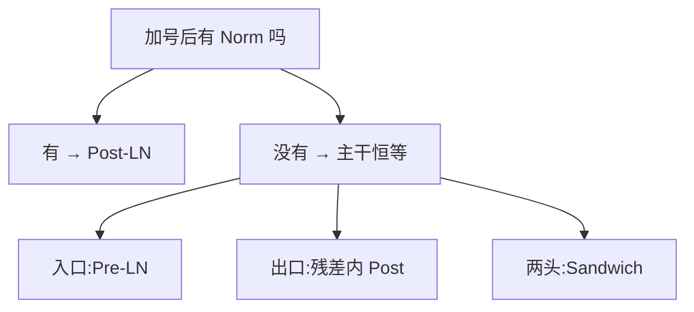

# Norm 的类型与位置(BN / LN / RMSNorm · Pre / Post / Sandwich)

> 🔴 重点考点:本篇是当前复习重点,文末「面试考点串联」给出问法对照。

一句话:归一化就是**在网络里固定的几个位置上,把一组数强行拉回可控的量级,再用可学习的参数把尺度放回去**——它有两个互相独立的旋钮,**「统计量沿哪些轴算」(类型)** 和 **「装在残差的哪一侧」(位置)**,面试里这两件事常被搅在一起问,答的时候必须先拆开。

> **类比**:Norm 是楼里的稳压器。**类型** = 这台稳压器按哪一片电路的平均电压来调(整栋楼?一层楼?一个房间?);**位置** = 它装在主干线上,还是装在每个房间的入户线上。两个问题各问各的,答案也互不决定。

## 一、先说清归一化在做什么

任何一种 Norm 都是同一个三步套路:**圈一组元素 → 用这组元素的均值方差把数值拉回标准量级 → 再乘一个可学习的 $\gamma$(必要时加 $\beta$)让模型能把尺度调回去**。

$$
\hat{x} = \frac{x - \mu_{\mathcal{S}}}{\sqrt{\sigma^2_{\mathcal{S}} + \epsilon}}, \qquad y = \gamma \odot \hat{x} + \beta
$$

这个式子里唯一会变的东西是 $\mathcal{S}$——**「和谁一起算统计量」**。BN、LN、IN、GN 的公式完全一样,差别只在 $\mathcal{S}$ 圈了哪些元素;$\gamma$、$\beta$ 是补偿件,归一化会把每一维压成同一量级、削掉模型好不容易学到的尺度差异,$\gamma$ 逐维把增益放回去,$\beta$ 逐维把偏移放回去;$\epsilon$ 是防零除的小常数。**为什么有用,口径要保守**:它把送进每个子层的数值范围管住,让梯度幅度和学习率的关系不至于随深度乱飘。最早的解释是「减少内部协变量偏移」(internal covariate shift,指每层输入分布随训练漂移),但这个归因后来争议很大——面试时讲「控制表示尺度、改善优化」比背 ICS 稳妥得多。

## 二、类型:统计量沿哪些轴算

### 五种 Norm 的计算轴对照

CV 里张量是 NCHW(样本 N、通道 C、高 H、宽 W),序列模型里是 $B \times T \times D$(批 B、位置 T、隐藏维 D)。**先说布局再说轴**,不然一定答混:

| 方法 | 统计范围(以 NCHW 为例) | 序列布局下的对应 | 训练 / 推理统计量 | 主要边界 |
|---|---|---|---|---|
| **BatchNorm** | 每个通道 C,跨 N、H、W | 每个特征维跨 B、T | **不一致**:训练用当前批,推理用运行统计 | 依赖批的组成;小批、拆批、变长时统计噪声大 |
| **LayerNorm** | 每个样本,跨指定特征维 | 每个 $(b,t)$ 跨 D | 一致 | 每个 token 自给自足,不知道别人存在 |
| **InstanceNorm** | 每个样本每个通道,跨 H、W | —(序列里少用) | 一致 | 参与统计的元素最少,常用于强调单样本风格的视觉任务 |
| **GroupNorm** | 每个样本,在一组通道及 H、W 内 | 每个 $(b,t)$ 在一组特征维内 | 一致 | 小 batch 下仍不跨样本;组数是超参 |
| **RMSNorm** | —(为序列模型提出) | 每个 $(b,t)$ 沿 D 求均方根 | 一致 | 不做中心化,标准形式只有 $\gamma$ |

一句话记法:**BN 竖着切(跨样本),LN 横着切(跨特征),GN 是把 LN 切成几段,IN 是切到每个通道一段,RMSNorm 是 LN 少做一步中心化**。BN/IN/GN 在 CV 里怎么选型、小 batch 场景怎么办,留给计划中的 归一化 篇,本篇只从 Transformer 视角回答下面两个问题。

### 为什么 Transformer 选 LN 不选 BN

三条,按重要性排:

1. **样本独立**。LN 只看当前这个 token 的 $D$ 维向量,**同一批里有谁、有几个,对结果没有任何影响**。BN 要跨样本汇总,一个样本的输出会被同批别的样本改变——这在推理端是灾难:同一句话凑进不同的 batch 发出去,结果不该不一样。
2. **适配变长序列**。序列长度天生不固定。BN 若按特征维汇总 $B$、$T$ 两轴,每个通道参与统计的元素数就随批内长度分布浮动;LN 的统计量只在 $D$ 维内部求,**序列多长都不影响每个位置自己的计算**。
3. **训练与推理算法一致**。LN 两个阶段跑的是同一段计算;BN 训练用当前批统计、推理换成运行统计,**部署时和训练时严格来说不是同一个函数**。

**不要背固定的 batch 数字。**「batch 大于多少 BN 就更好」是编的——批多大才够稳,取决于任务、分布漂移速度和统计量本身的方差,只能在推理集上验证。

### BN 的训推不一致麻烦在哪

训练时 BN 用当前 mini-batch 的均值方差;推理时没有「批」这个概念,只能用训练期间滑动平均攒下来的**运行统计**。动量决定这个滑动平均跟随新 batch 的快慢,两头都有坑:**跟随太慢**,数据分布变化快时运行统计滞后,推理拿到的是过期的均值方差;**跟随太快**,小批的噪声直接灌进运行统计,推理端跟着抖。所以动量不能拍脑袋,**要用推理集(而不是训练 loss)来验**。分布式训练还多一层:批被拆到多张卡上,每卡的局部统计更噪,要不要跨设备同步是另一个开关。

**padding 一定污染 BN 吗?不一定。** 取决于两件事:张量布局把哪些轴汇总进了统计量,以及有没有对有效位置做掩码。汇总轴里包含 $T$ 且没有掩码,padding 位就会稀释均值方差;做了 masked statistics、只统计有效 token,就不会。**答「一定污染」是错的,答「取决于布局和掩码」才对。**

真被追问「必须在 Transformer 里用 BN 怎么办」:对有效 token 做 masked statistics、跨设备同步统计量、或者冻结一份可靠的运行统计。但每一种都要复测训练与推理的分布差异,**不能因为总 batch 大就断言 BN 更优**。

## 三、RMSNorm:砍掉中心化之后

### 少做了什么

LayerNorm 同时做**重中心化**(减均值)和**重缩放**(除标准差);RMSNorm 只做后者:

$$
\operatorname{RMSNorm}(x) = \gamma \odot \frac{x}{\sqrt{\frac{1}{d}\sum_i x_i^2 + \epsilon}}
$$

分母是这个向量的均方根,衡量的是「这一组数整体有多大」。**没有 $\mu$,通常也没有 $\beta$**——省掉的是一次均值归约、一次逐元素减法和一个 $d$ 维偏置向量。

RMSNorm 论文的论点是**实证的**:LayerNorm 真正起作用的是限制幅度(re-scaling 不变性),对齐均值(re-centering)贡献很小,所以砍掉后效果不掉。要说准的是——**这是实验结论,不是数学等价**。如果模型确实依赖平移不变性,或者均值里携带了不该留的偏移,LN 仍可能更合适,得在同样的训练预算下做消融才知道。类型这一维今天基本收敛:手册统计的 93 个前沿模型里,除 GPT-2 外几乎全是 RMSNorm。

### 为什么不能写成「快百分之多少」

RMSNorm 原论文自报的运行时下降是 **7%–64%**——**一个跨了近十倍的区间**,这本身就是答案。省下的绝对时间取决于隐藏维、kernel 实现、硬件、精度,以及 Norm 在整个模型耗时里占多大比例。Norm 是**访存受限**的逐 token 算子,乘上层数 × token 数不白给,而且少一次归约意味着算子融合更好写;但**任何一个固定百分比都是错的**。

### $\gamma$、$\beta$、$\epsilon$ 各管什么

| 参数 | 作用 | LayerNorm | RMSNorm |
|---|---|---|---|
| $\gamma$ | 逐维可学习增益,把归一化削掉的尺度差异放回去 | 有 | **有** |
| $\beta$ | 逐维可学习偏移 | 有 | **标准形式没有** |
| $\epsilon$ | 防零除、限制分母下界的小常数 | 有 | 有 |

$\epsilon$ 不是随便填的:**太小**,接近零向量时分母的相对误差被放大;**太大**,相当于给分母垫了个底,归一化被削弱。它还有个隐藏坑,见下一小节。

### 混合精度实现要点

FP16/BF16 下,两种 Norm 都要对 $d$ 个数求平方和,低精度直接累加会撞两堵墙:**精度不够**(BF16 只有 7 位尾数,$d = 4096$ 个数连加时小项会被大项吃掉)和**范围不够**(FP16 最大约 65504,元素量级到 10 平方和就轻松溢出)。所以主流实现都把归约升到 FP32 再降回模型 dtype:

```python
def rmsnorm(x, gamma, eps):
    dt = x.dtype                      # 模型 dtype,比如 bf16
    xf = x.float()                    # 归约前先升到 fp32
    ms = xf.pow(2).mean(-1, keepdim=True)
    y = xf * (ms + eps).rsqrt()       # 这里 ε 加在开方内
    return y.to(dt) * gamma           # 先降回 dtype,再乘 γ
```

三个容易踩的点:

- **$\epsilon$ 加在开方内还是开方外**($\frac{1}{\sqrt{\text{ms} + \epsilon}}$ 还是 $\frac{1}{\sqrt{\text{ms}} + \epsilon}$),数值行为不同,同一个 $\epsilon$ 数值在两种写法里意义也不同——**跨框架搬权重时必须核对**。
- **先乘 $\gamma$ 还是先转精度**,各实现不一致,低精度下结果会有可观测的差异。
- **不能凭名字判断谁更稳**。LN 多一步减均值,是一个潜在的大数相消位置;但 RMSNorm 把没中心化的向量直接送进平方和,一个大的共模偏移会整个压进分母。**真正决定稳不稳的是归约精度和 $\epsilon$ 的处理方式,不是它叫 LN 还是叫 RMSNorm。**

## 四、位置:Norm 装在残差的哪一侧

本节只讲 Norm 放在残差的哪一侧。残差连接本身为什么有效、多流残差怎么改,见 残差流 篇;子层 $F$ 内部的公式,注意力见 注意力基础 篇、FFN 见 FFN与激活 篇。

### 两个公式,不能颠倒

设注意力或 FFN 子层为 $F$:

$$
\text{Post-LN: } x_{l+1} = \operatorname{Norm}\big(x_l + F(x_l)\big), \qquad
\text{Pre-LN: } x_{l+1} = x_l + F\big(\operatorname{Norm}(x_l)\big)
$$

Post-LN 是先把残差加完再整体归一化,Norm **骑在主干上**;Pre-LN 是先把输入归一化了喂给子层,残差那条加法**一路不被打断**。**原始 Transformer 用的是 Post-LN**;GPT-2 把 Norm 挪到每个子块的输入端,Pre-LN 从此成为主流。判断诀窍一句话:**看加号之后还有没有 Norm**。

### 恒等梯度路径怎么从公式里看出来

把 Pre-LN 从第 $l$ 层展开到第 $L$ 层:

$$
x_L = x_l + \sum_{k=l}^{L-1} F_k\big(\operatorname{Norm}(x_k)\big)
$$

右边第一项就是 $x_l$ 本身,**没有被任何矩阵或 Norm 碰过**。对 $x_l$ 求导时它贡献一个恒等项 $I$,于是梯度里永远有一条**不经过 Norm 的直通道**从顶层直达底层。Post-LN 展开后没有这样一项:从 $x_l$ 到 $x_L$ 的每一条路都至少穿过一次 Norm 的雅可比,梯度是一长串连乘,幅度随深度不受控。

Xiong 等人(ICML 2020)用平均场分析把它量化到初始化时刻:输出层附近参数的期望梯度范数,Post-LN 是 $\mathcal{O}(d\sqrt{\ln d})$——**与层数 $L$ 无关地大**;Pre-LN 是 $\mathcal{O}(d\sqrt{\ln d / L})$,**随深度按 $1/\sqrt{L}$ 变温和**。

### warm-up:更稳不等于能省

Post-LN 通常对 warm-up 更敏感,机制就是上面那条——初始化时输出层附近梯度大,学习率一上来就发散,只能先小步热身。Xiong 等人的实验里,Pre-LN 去掉 warm-up 也能拿到可比结果,还省了调参时间。

但有两件事必须说准。**其一,「更稳定」是训练动力学的性质,不等于最终效果必然更高或更低**;而且那个结论是在他们的理论假设与实验设置下成立的,严谨口径是「**可降低 warm-up 依赖**」,不是「Pre-LN 一定能删掉 warm-up」。**其二,warm-up 同时还在服务别的事**:Adam 的二阶矩估计要攒够样本才稳,大 batch 训练初期的梯度噪声也需要缓冲——这些和 Norm 位置无关,所以现实里的大模型配方几乎都还留着 warm-up。

### Pre-LN 一定牺牲最终精度吗

**没有无条件结论。** 有一条常被引用的机制:Pre-LN 的残差主干无人限幅,每层往里加一个增量,主干范数随深度累积,越靠后的层新增量相对主干占比越小,于是「有效深度」低于名义深度。但这条机制是否真的换成了指标下降,取决于深度、宽度、数据预算和学习率。

想公平验证,四条缺一不可:

- **同深度、同参数量、同优化器、同 token 预算、同数据顺序**,并跑多个随机种子;
- **两条臂各自调优学习率与 warm-up**——最容易做错的就是这条。拿 Pre-LN 调好的学习率直接套 Post-LN,等于让它在最不擅长的设置里比赛,结论不成立;
- **报告每条臂花掉的调参预算**,否则「哪个更好」只是「哪个被调得更认真」;
- **在目标规模上验证**。几百 M 参数上的结论不能外推到百亿千亿。

## 五、第三条路:把 Norm 挪进残差分支

Pre-LN 是主流,但主流不等于唯一正确。近年有两种做法都把 Norm 从主干挪开,又不放弃逐层限幅。

### 残差内 Post-Norm(OLMo 2 / OLMo 3)

$$
x_{l+1} = x_l + \operatorname{Norm}\big(F(x_l)\big)
$$

Norm 只包住子层的输出,不碰残差和。**两头的好处都占**:主干仍是恒等的(保住 Pre-LN 的梯度直通道),但每层**注入**残差流的增量先被规到统一量级(找回 Post-LN 的限幅),主干不再无界膨胀。OLMo 2 同时把非参数 LayerNorm 换成 RMSNorm,并加上 QK-Norm;**归因要诚实**——报告写得很清楚,这两项改动**单独用都不好,合起来才改善了梯度 L2 范数的增长与尖刺**(spike score 从 0.108 降到 0.069),所以「OLMo 2 的稳定性全是 Norm 位置带来的」属于过度归因。OLMo 3 沿用同一设计。

### Sandwich Norm:进口出口都加

$$
x_{l+1} = x_l + \operatorname{Norm}_{\text{post}}\Big(F\big(\operatorname{Norm}_{\text{pre}}(x_l)\big)\Big)
$$

子层进口一道闸、出口一道闸,残差主干依旧干净。这个做法最早由 CogView 提出(当时叫 Sandwich-LN),动机是 FP16 训练下的 NaN loss;Gemma 3 的架构描述就是「pre-norm 与 post-norm 都用 RMSNorm」。代价是每层 Norm 数量翻倍——单个 Norm 便宜,但它访存受限,翻倍后在训练端不再完全免费;参数增量倒可忽略(每道闸只多一个 $d$ 维 $\gamma$)。Peri-LN 那篇论文把 OLMo 式的出口 Norm 和 Gemma 式的两头 Norm 归为同一族(「外围放置」),并在 400M–1B 规模上做了对照。

### 四种放法一览

| 放法 | 主干上有 Norm? | 每层增量被限幅? | 代表 |
|---|---|---|---|
| Post-LN(原始) | **有** | 是(整个残差和一起) | 原始 Transformer、BERT |
| Pre-LN | 没有 | 否 | GPT-2 起的绝对主流 |
| 残差内 Post-Norm | 没有 | 是(只限增量) | OLMo 2 / OLMo 3 |
| Sandwich / Peri-LN | 没有 | 是(进口出口各一次) | CogView、Gemma 3 |



## 六、收口:三个正交维度与百层以上的配方

### DeepNorm、Sandwich-LN、RMSNorm 各改哪一维

这是个很好的收口题——**它们根本不在同一个维度上**:

| 维度 | 在问什么 | 代表做法 |
|---|---|---|
| **类型** | 统计量跟谁共享、要不要中心化 | BN / LN / IN / GN、**RMSNorm** |
| **位置** | Norm 装在残差的哪一侧 | Pre / Post / 残差内 Post / **Sandwich-LN** |
| **残差尺度** | 每层往主干注入多大的增量 | **DeepNorm** 的 $\alpha$ 与配套初始化、残差缩放 |

DeepNorm 的形式是 $\operatorname{LN}(\alpha x_l + F(x_l))$:它用的是 Post-LN 的位置,加上**把恒等项放大 $\alpha$ 倍**,再配一套按深度推导出来的初始化——靠这一组把 Transformer 训到了 1000 层。所以**换 RMSNorm 解决不了位置问题,换位置也解决不了残差尺度问题**,三个旋钮要分开答。

### 百层以上还要调什么

Norm 位置只是整体配方的一环,同样吃重的至少还有:

- **初始化**:按深度缩放子层输出权重。GPT-2 就把残差层权重按 $1/\sqrt{N}$($N$ 为残差层数)缩放,DeepNorm 则把缩放系数和 $\alpha$ 一起推导出来;
- **残差尺度**:上表第三行,决定每层增量相对主干的占比;
- **学习率与数值精度**:warm-up 长度和 Norm 位置耦合,换了位置就得重调(优化器侧的机制见 优化器 篇);用 BF16 还是 FP16、归约在什么精度做、要不要留 FP32 主权重,同样会左右深层的稳定性;
- **监控**:逐层激活范数、梯度范数、残差分支占主干的比例——出问题时这三条曲线比 loss 先说话。

### 细节与坑

- **final norm 不能忘**:Pre-LN、残差内 Post、Sandwich 的主干都是恒等的,走到最后一层时范数已经膨胀,**必须在输出头之前补一道 final norm 收口**(GPT-2 在最后一个自注意力块之后额外加的那道就是它);原始 Post-LN 每层自带收口,不用补。
- **embedding 出口乘 $\sqrt{d}$**:原始 Transformer 与 Gemma 系都这么做。embedding 查表的初始化幅度通常远小于残差流的工作尺度,这一乘让第一层看到的输入与后面各层量级对齐。
- **QK-Norm 是另一个维度**:本篇讲的是**块与块之间**、残差流上的 Norm;QK-Norm 在注意力**内部**逐头对 Q/K 做,治的是 logits 爆炸,两者解决的问题不同、可以同时存在,见 注意力配件 篇。
- **$\gamma$ 是一维参数**:weight decay 通常把它排除在外;只能优化二维矩阵的优化器(如 Muon)还要给它单开一路,见 优化器 篇。

## 七、面试考点串联

| 高频问法 | 本文哪一节 |
|---|---|
| 从计算轴比较 BN / LN / IN / GN / RMSNorm,先说清张量布局 | 二(对照表) |
| Transformer 为什么通常选 LayerNorm 而不是 BatchNorm | 二 |
| 为什么 LN 更适合变长序列与小 batch?padding 一定会污染 BN 吗 | 二(不一定,取决于布局与掩码) |
| BN 的运行均值和动量怎样影响推理?训练与推理为何要区分 | 二 |
| 如果必须在 Transformer 里用 BN,怎么处理有效位置和跨设备统计 | 二 |
| RMSNorm 为什么可以省去均值中心化?为什么不保证所有任务更好 | 三 |
| $\gamma$、$\beta$、$\epsilon$ 分别做什么,可以省略吗 | 三(参数表) |
| RMSNorm 的速度收益为什么不能写成固定百分比 | 三(原论文自报 7%–64%) |
| FP16/BF16 实现为什么常用更高精度做统计归约?$\epsilon$ 放哪 | 三(实现要点) |
| Pre-LN 与 Post-LN 分别把 Norm 放在哪?残差计算关系怎么写 | 四(两个公式) |
| Pre-LN 的恒等梯度路径怎样从公式中看出来 | 四(展开式) |
| 为什么 Post-LN 通常对 warm-up 更敏感?Pre-LN 一定能省略吗 | 四 |
| Pre-LN 是否一定牺牲最终精度?应怎样公平验证 | 四(四条验证要求) |
| OLMo 2 为什么把 Norm 挪回子层之后?稳定性该归因给谁(补充题) | 五(两项改动单独用都不好) |
| Sandwich Norm 的收益与代价分别是什么(补充题) | 五 |
| DeepNorm、Sandwich-LN 与 RMSNorm 分别改变了哪个维度的问题 | 六(三维表) |
| 百层以上 Transformer 除了改 Norm 位置还要调整什么 | 六 |
| Pre-LN 模型忘加 final norm 会怎样(补充题) | 六(细节与坑) |

## 相关文献

- Batch Normalization: Accelerating Deep Network Training by Reducing Internal Covariate Shift — [arXiv:1502.03167](https://arxiv.org/abs/1502.03167)
- Layer Normalization — [arXiv:1607.06450](https://arxiv.org/abs/1607.06450)
- Instance Normalization: The Missing Ingredient for Fast Stylization — [arXiv:1607.08022](https://arxiv.org/abs/1607.08022)
- Group Normalization — [arXiv:1803.08494](https://arxiv.org/abs/1803.08494)
- Root Mean Square Layer Normalization(RMSNorm,自报运行时下降 7%–64%)— [arXiv:1910.07467](https://arxiv.org/abs/1910.07467)
- Attention Is All You Need(原始 Transformer,Post-LN)— [arXiv:1706.03762](https://arxiv.org/abs/1706.03762)
- On Layer Normalization in the Transformer Architecture(Pre/Post 梯度范数与 warm-up 分析)— [arXiv:2002.04745](https://arxiv.org/abs/2002.04745)
- CogView: Mastering Text-to-Image Generation via Transformers(Sandwich-LN 与 FP16 稳定性)— [arXiv:2105.13290](https://arxiv.org/abs/2105.13290)
- DeepNet: Scaling Transformers to 1,000 Layers(DeepNorm 的残差缩放与初始化)— [arXiv:2203.00555](https://arxiv.org/abs/2203.00555)
- 2 OLMo 2 Furious(残差内 Post-Norm + QK-Norm,梯度 spike score 0.108 → 0.069)— [arXiv:2501.00656](https://arxiv.org/abs/2501.00656)
- Peri-LN: Revisiting Normalization Layer in the Transformer Architecture — [arXiv:2502.02732](https://arxiv.org/abs/2502.02732)
- Gemma 3 Technical Report(pre-norm 与 post-norm 都用 RMSNorm)— [arXiv:2503.19786](https://arxiv.org/abs/2503.19786)
- Language Models are Unsupervised Multitask Learners(GPT-2:Norm 移到子块输入端,残差层权重按 $1/\sqrt{N}$ 缩放)— https://cdn.openai.com/better-language-models/language_models_are_unsupervised_multitask_learners.pdf
