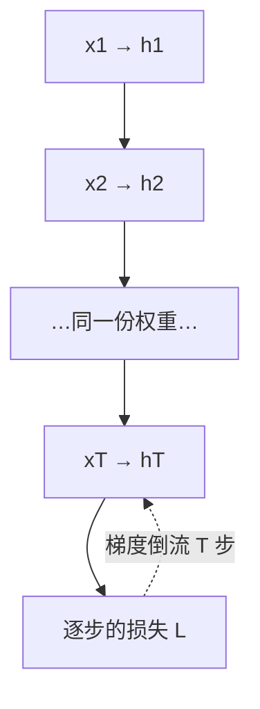

# RNN 与门控循环网络

一句话:循环网络把读过的全部历史压进**一个固定大小的隐状态**里,每来一个新输入就地改写它——推理便宜、天然流式,代价是历史会被后来的内容挤掉,而且时间步必须一步一步走。

> **类比**(全文就靠这一个):RNN 像一个只带了**一块小白板**去开长会的人。每听一句就在白板上改几笔,白板永远那么大;轮到他发言时只能看白板,听过的原话一句都没留下。LSTM 和 GRU 做的事,是给这块白板配上「橡皮」和「保护罩」,让该留的内容不被后面的涂改冲掉。

本篇只讲**循环网络这一侧的机制**。Transformer 与循环、卷积结构的建模能力与效率横向对比另有专篇负责,注意力机制本身见 注意力基础 篇。

## 一、递归形式:一个被反复改写的隐状态

### 递推式与时间维参数共享

最朴素的 RNN(常叫 Vanilla RNN 或 Elman 网络)只有一条式子:

$$
h_t = \tanh(W_{hh}\,h_{t-1} + W_{xh}\,x_t + b), \qquad y_t = W_{hy}\,h_t
$$

读法:**这一步的状态 = 上一步的状态和这一步的输入各做一次线性变换、加起来、过一个非线性**。$h_t$ 就是那块小白板,$W_{hh}$ 是「白板自己怎么随时间演化」的规则,$W_{xh}$ 是「新信息怎么写上去」的规则。关键在于:**这几组权重在所有时间步上是同一份**,第 1 步和第 1000 步用的是同一个 $W_{hh}$。这不是为了省事,是三件事同时要求它:

1. **序列长度可变**。参数量与 $T$ 无关,同一个模型才能既处理 10 个词也处理 1000 个词
2. **规律与位置无关**。「形容词后面多半跟名词」这条规律在句首句尾都成立,没理由为每个位置各学一份
3. **样本效率高**。所有时间步的梯度都累加到同一份权重上,等于用 $T$ 倍的样本去训一组参数

### BPTT:训练 RNN 等于训练一个很深的网络

**BPTT(Backpropagation Through Time,沿时间反向传播)不是新算法,就是普通的反向传播用在「按时间展开」的计算图上。** 把递推按时间步铺开,一条长度 $T$ 的序列就变成一个 $T$ 层的前馈网络,只不过这 $T$ 层用的是同一份权重。



图里要读出三件事:**一,前向是一条链**,第 $t$ 步必须等第 $t-1$ 步;**二,损失通常每一步都有**(语言模型每个位置都要预测下一个 token),梯度从各时间步分别往回流;**三,一个权重的最终梯度是所有时间步贡献之和**,这正是「共享权重」既是优点又是隐患的地方。由此得到一条直接推论:**序列长度就是有效网络深度**。1000 步的序列约等于一个 1000 层的网络,而且是最难训的那种——层间权重完全绑定,没法靠某一层的大小去抵消另一层。

### 固定状态:优点和缺点是同一件事

$h_t$ 的维度是超参数,**与序列长度无关**。这一条同时是循环网络最大的优点和最大的缺点:

- **优点**:推理时每步开销和常驻内存都是常数,与已经读了多少历史无关。实时语音、传感器流、端侧唤醒这类场景天然合适,不必像 Transformer 那样留一份随长度线性增长的 KV cache
- **缺点**:白板就那么大。第 500 步想用第 3 步的细节,得指望它一路没被后面 497 次涂改盖掉。**这是信息瓶颈,不是优化难度**——就算梯度传得完美无缺,一个 512 维的状态也装不下一整篇文档

**面试里这两句一定要一起说。** 很多人只答「RNN 记不住长依赖是因为梯度消失」,漏掉了容量这一半:梯度消失说的是「学不会」,状态容量说的是「存不下」,**两个都修好才算解决长依赖**,而下面要讲的门控只修了第一个。

## 二、梯度消失与爆炸:同一个矩阵被乘了 T 次

### 为什么是连乘,而且是同一个矩阵的连乘

损失对早期状态的梯度必须沿时间逐步倒流。先看倒退一步要付什么代价:

$$
\frac{\partial h_t}{\partial h_{t-1}} = \operatorname{diag}\big(1 - h_t^{2}\big)\, W_{hh}
$$

人话:倒着走一个时间步,梯度就被这个雅可比矩阵乘一次。对角阵那一项是 tanh 的导数($\tanh' = 1-\tanh^2$),取值在 $(0,1]$。

再看跨越 $T-k$ 步:

$$
\frac{\partial h_T}{\partial h_k} = \prod_{t=k+1}^{T} \frac{\partial h_t}{\partial h_{t-1}}
$$

人话:**跨多少步就连乘多少个因子**。一串数相乘,只要它们系统性地大于 1 或小于 1,结果就指数级发散或坍缩——这才是问题的根。

**这里有一条 RNN 独有的东西,是这道题真正的分水岭。** 深层前馈网络反向也是连乘,但每层乘的是**不同的**权重矩阵,大小可以互相抵消;RNN 因为时间维参数共享,**连乘的是同一个 $W_{hh}$**,等于在算它的 $T-k$ 次幂。矩阵幂由谱半径说了算,几乎没有中间地带。Pascanu 等人给的判据可以直接用来答题:对 tanh 单元,**$W_{hh}$ 的最大奇异值小于 1 是梯度消失的充分条件,大于 1 只是梯度爆炸的必要条件**——小于 1 一定消失,大于 1 未必真炸。这个不对称,就是下面那张表的伏笔。

### 消失和爆炸是两种病,不是一种病的两个方向

| | 梯度爆炸 | 梯度消失 |
|---|---|---|
| 现象 | loss 突然尖峰或变成 NaN,梯度范数飙升几个数量级 | **什么都不发生**:loss 照常下降,只是长依赖学不到 |
| 好不好发现 | 好发现,监控全局梯度范数就够 | 极难发现,得专门测长跨度依赖才看得出来 |
| 有没有救 | 有,梯度裁剪 | 没有直接的救法 |
| 为什么 | 方向还是对的,只是步子太大;把范数缩回阈值内、方向不变,训练就能继续 | 范数本来就小,裁剪阈值根本不触发;而且丢的是**信息**不是幅度——远处的信号在到达之前就被压没了,再乘个大数也变不回来 |

**所以这两件事的答法完全不同**:爆炸是数值问题,归优化技巧管(全局范数裁剪的阈值怎么定、它治不了什么,见 优化器 篇);消失是**结构问题**,只能改结构——这正是 LSTM 和 GRU 出场的理由。顺带纠两个高频混淆。第一,RNN 的梯度消失和 Sigmoid/Tanh **饱和**造成的梯度消失不是一回事:后者是激活函数的锅、换 ReLU 就大幅缓解(见 FFN与激活 篇),而 RNN 这里换 ReLU 反而更容易爆炸,因为正半轴不再压制幅度。第二,梯度消失不等于「网络退化」,也不等于过拟合,三者的区分见 残差流 篇。

### 这为什么卡死了长依赖

Bengio 等人 1994 年那篇的结论比「梯度会消失」狠得多:这是一个**权衡**,不是一个 bug。要让状态能稳定地把信息锁存几百步(即对噪声和小扰动鲁棒),状态转移就得落在吸引子附近;而落在吸引子附近意味着雅可比的谱半径小于 1,于是梯度必然指数衰减。**「记得住」和「学得会」在朴素 RNN 里天生打架。**

实践后果很具体:朴素 RNN 能稳定学到的依赖跨度大致在**十几到几十步**这个量级,再远基本靠运气。工程上还有一个绕不开的配套动作——**截断 BPTT**:反向只往回展 $k$ 步就砍断,否则一条长序列的显存和时间都吃不消。但截断本身也是一刀:**比 $k$ 更远的依赖在梯度上根本不存在**,不是学不好,是压根没有信号。

## 三、LSTM 与 GRU:把乘法通路改成加法通路

### LSTM 每步算什么

LSTM 每一步要算四样东西,但分两类:**三道门只决定「开多大」,一份候选内容决定「写什么」**。它们的算法是同一个模子——把 $x_t$ 和 $h_{t-1}$ 做一次线性变换再过激活,区别只在用哪套权重、过哪个激活:

| 名字 | 记号 | 激活 | 值域 | 管什么 |
|---|---|---|---|---|
| 遗忘门 | $f_t$ | sigmoid | $(0,1)$ | 上一步的记忆保留几成 |
| 输入门 | $i_t$ | sigmoid | $(0,1)$ | 这一步的新内容写进去几成 |
| 输出门 | $o_t$ | sigmoid | $(0,1)$ | 内部记忆对外暴露几成 |
| 候选内容 | $g_t$ | tanh | $(-1,1)$ | 这一步「想写什么」 |

真正的结构在下面两条状态更新上。第一条讲记忆本体怎么变:

$$
c_t = f_t \odot c_{t-1} + i_t \odot g_t
$$

人话:旧记忆按遗忘门打个折,新内容按输入门掺进来,两者**相加**。$\odot$ 是逐元素相乘,所以每一维记忆都能被独立地保留或清空。

第二条讲对外输出怎么来:

$$
h_t = o_t \odot \tanh(c_t)
$$

人话:把记忆压回 $(-1,1)$,再由输出门决定这一步给下游看多少。**所以 $c$ 和 $h$ 的分工是「仓库」和「橱窗」**:$c$ 只沿时间线传递、不直接参与输出,$h$ 才是给下一层和下一时刻用的东西,同时也是下一步算三道门的输入。

### 加法通路为什么救得了梯度

把 $c_t$ 那条式子对 $c_{t-1}$ 求导,直接通路上只剩一项:

$$
\frac{\partial c_t}{\partial c_{t-1}} = f_t
$$

人话:沿 cell state 这条线倒退一步,梯度只被乘上一个落在 $(0,1)$ 里、而且**可学习**的数。遗忘门开到接近 1 时这一环几乎就是恒等,梯度能跨几百步基本不衰减地传回去——这就是原论文说的「常数误差传送带」(CEC)。对比第二节:朴素 RNN 那一环是 $\operatorname{diag}(\tanh')W_{hh}$,**乘的是同一个矩阵、由不得你选**;LSTM 换成了一个逐维度、逐时刻各自可控的标量。这和残差连接是同一个道理:**主路上留一条不经过任何矩阵乘的加法通路**,区别只在残差的通路系数恒为 1、LSTM 的通路系数是学出来的门(残差那一侧见 残差流 篇)。

**但它是缓解,不是消灭,这句一定要主动说出来。** 两个原因:一是 $f_t$ 终究小于 1,几百步连乘照样衰减,只是衰减得慢得多;二是上式只是**直接通路**,而 $f_t$、$i_t$、$g_t$ 都由 $h_{t-1}$ 算出、$h_{t-1}$ 又依赖 $c_{t-1}$,完整的雅可比还有别的项。LSTM 把能稳定学到的跨度从几十步推到几百上千步,没有推到无穷。

### 遗忘门是后来补的

一个容易露怯的细节:**1997 年那篇原始 LSTM 论文里没有遗忘门**,只有输入门和输出门,CEC 的自连接权重固定为 1.0。问题出在不切分的连续输入流上——记忆只写不擦,$c$ 会无界增长、$\tanh(c_t)$ 一路饱和,整个单元退化。遗忘门是 2000 年 Gers 等人补的,让单元学会在合适的时候自己重置。这条不只是掌故。Greff 等人做过大规模消融(8 个变体、5400 次训练),结论是**遗忘门和输出激活是 LSTM 最关键的两个部件**,且没有哪个变体能显著超过标准 LSTM;Jozefowicz 等人则发现把遗忘门的偏置初始化成 1(即默认倾向于「记住」)就能在部分任务上把 LSTM 与 GRU 的差距抹平。「先把 forget bias 设成 1,再考虑换结构」是这条线上最省事的一句经验。

### GRU:两道门、一个状态

GRU 做了两处合并:

- **状态合并**:不再区分 $c$ 和 $h$,只留一个 $h$。仓库和橱窗合成一个,**所以 GRU 没有输出门**——状态是什么样,对外就是什么样
- **门合并**:LSTM 的输入门和遗忘门是**各自独立**的两道门,GRU 把它们绑成一道更新门 $z_t$,保留和写入的比例强制加起来等于 1

状态更新长这样:

$$
h_t = (1 - z_t) \odot h_{t-1} + z_t \odot \tilde h_t
$$

人话:$z_t$ 是这一维「翻新多少」的比例,$1-z_t$ 就是「留旧的多少」,两者是一个跷跷板。$z_t \to 0$ 时状态原样抄过去,这就是 GRU 版的加法高速公路;$z_t \to 1$ 时整维推倒重写。

候选内容前面还有一道重置门:

$$
\tilde h_t = \tanh\big(W\,x_t + U\,(r_t \odot h_{t-1})\big)
$$

人话:算「这一步想写什么」的时候,先用 $r_t$ 决定读多少历史。$r_t \to 0$ 相当于说「这一步和前文无关,从头起一句」,常见于句子边界和话题切换。**两道门的分工要说准:重置门管写之前往回看多少,更新门管写之后覆盖多少,一前一后。**

### 为什么不同资料的更新式看着相反

这是真会被追的一个坑,答案很朴素:**$z$ 到底叫「写入比例」还是「保留比例」没有统一约定,两种写法互为 $z \leftrightarrow 1-z$,不存在谁错。** Cho 等人 2014 的原文写的是 $h_t = z_t \odot h_{t-1} + (1-z_t) \odot \tilde h_t$($z$ = 保留),PyTorch 的 `nn.GRU` 文档同样把 $z_t$ 乘在 $h_{t-1}$ 上;而大量教材、课件和上面那条式子取的是相反口径($z$ = 写入)。**答题纪律:先写出你要用的式子,再照着这条式子解释门的含义,别凭记忆断言「更新门就是决定写入多少」。** 顺带一个工程差异也值得知道:原论文是先算 $r_t \odot h_{t-1}$ 再乘 $U$,PyTorch 为了把三道门在 hidden 一侧的矩阵乘合并成一次 GEMM,改成先算 $U h_{t-1}$ 再乘 $r_t$。两者不等价,但都能训得好。

### 三个结构横着看一遍

| | 朴素 RNN | LSTM | GRU |
|---|---|---|---|
| 状态 | 一个 $h$ | $c$(仓库)+ $h$(橱窗) | 一个 $h$ |
| 门 | 无 | 遗忘 / 输入 / 输出,三门独立 | 更新 / 重置,更新门耦合了写入与保留 |
| 主路是什么 | 乘 $W_{hh}$ | 加法,系数是 $f_t$ | 加法,系数是 $1-z_t$ |
| 能同时「既留旧又写新」吗 | — | 能($f$ 与 $i$ 可同时接近 1) | 不能(比例被绑成 1) |
| 每步权重组数 | 1 | 4 | 3 |

第四行是 LSTM 表达力上真正多出来的东西,也是「三门比两门细在哪」的标准答法;第五行是下一节参数量账的来源。

## 四、怎么选,以及它为什么在 LLM 时代退场

### 参数量的账,以及为什么不能背百分比

设输入维 $m$、隐藏维 $h$。两者每「一组」权重的形状完全一样:一个 $m \times h$ 的输入端矩阵、一个 $h \times h$ 的状态端矩阵,外加偏置。区别只在组数——LSTM 是 $f,i,o,g$ 四组,共 $4h(m+h+1)$;GRU 是 $z,r,\tilde h$ 三组,共 $3h(m+h+1)$。**在同 $m$、同 $h$、只数纯循环层这个理想口径下,比例正好是 3:4。**

但别把「GRU 少 25%」当结论背出去,因为真实模型里这个口径几乎不成立:

- 完整模型还有 embedding 和输出层,词表一大,循环层根本不是参数大头
- 双向、多层堆叠、LSTM 特有的投影层(把 $h$ 投到更小的维再进下一步)都会改账
- **最要命的一条**:实践中常见做法是把 GRU 的 $h$ 调大来对齐效果,一调大,省下的参数就还回去了
- 同理,「超过多少步就必须用 LSTM」「效果固定差几个点」这类规律也都不存在

### GRU 还是 LSTM:一张表加一条纪律

| 情况 | 倾向 | 为什么 |
|---|---|---|
| 数据量小 | GRU | 参数少、门少,过拟合风险和调参面都小一圈 |
| 严格流式 / 端侧 / 延迟敏感 | GRU | 每步少一组矩阵乘、少一份状态,单步延迟和常驻内存都更小 |
| 依赖跨度长、要细粒度记忆控制 | LSTM | 输入门与遗忘门独立可调,能「既保留旧的又写入新的」,GRU 的耦合门做不到 |
| 已有成熟基线 / 追极限效果 | LSTM | 调优经验多,而且 forget bias 设 1 这类零成本手段能补回大部分差距 |

**纪律只有一条:没有普适更优,必须在相同预算下实测。** Chung 等人 2014 的结论是两者「comparable」,但都明显优于朴素 tanh 单元。所谓公平比较具体指:同一份数据、同一个训练预算(而不是同样的 epoch 数)、把两边的隐藏维调到**参数量或推理延迟对齐**,再一起看验证损失、**长依赖切片**上的表现、吞吐和峰值内存。只看一个综合平均分,会把长依赖上的差异稀释掉。

### 端侧还能怎么压

循环模型在端侧仍有活路(关键词唤醒、传感器时序、流式语音前端,语音那条链见 语音识别 篇)。压缩手段和别的网络没有本质区别,按代价从小到大排:**先调小隐藏维**(参数与单步计算都随 $h^2$ 走,收益最直接)→ **低比特量化**(循环层的权重被反复复用,量化收益高;但状态是逐步累积的,量化误差会沿时间累加,必须实测长序列上的漂移)→ **结构化剪枝** → **蒸馏**。还有一条结构性的:**双向改单向**,双向必须等整段结束才能出结果,严格流式场景本来就用不了。每压一步都要回归两个指标:长依赖切片上的效果,以及**单步**延迟——流式场景卡的是单步,不是整段吞吐。

### 硬伤:时间维不能并行

这是循环网络退场的**唯一决定性原因**,其他都是次要的。第 $t$ 步的输入里有 $h_{t-1}$,而 $h_{t-1}$ 得等第 $t-1$ 步算完。于是:

- **训练的关键路径长度正比于序列长度**。哪怕有一万张卡,序列内部这 $T$ 步也只能排队走
- **硬件吃不饱**。每步是一次 $(m+h)\times h$ 规模的矩阵乘,batch 维之外没有别的并行度可榨;GPU 要靠大矩阵才能把算力喂满,反复做小矩阵乘等于大部分时间在等数据搬运

注意别把两件事混起来:**推理侧的串行是所有自回归模型的共性**,循环网络独有的问题在**训练侧**——它连「输入全都已知、只是要算一遍前向」这种场景都并行不了。反过来说,推理侧恰恰是它的强项:状态大小固定,每步开销与已生成长度无关,流式延迟稳得住。代码上看得最清楚:

```python
# RNN:时间维拆不开,这个 for 就是关键路径
h = zeros(hidden)
for t in range(T):                              # 一万张卡也得排队走 T 步
    h = tanh(W_h @ h + W_x @ x[t] + b)          # 每步一次小矩阵乘,算术强度低
    y[t] = W_o @ h

# LSTM 一步:四组权重拼成一次矩阵乘,是工程上唯一能榨的并行度
def lstm_step(x, h, c):
    i, f, g, o = split(W @ cat(x, h) + b, 4)    # 一次算完四份
    c = sigmoid(f) * c + sigmoid(i) * tanh(g)   # 加法式更新:旧记忆按 f 打折保留
    h = sigmoid(o) * tanh(c)                    # 输出门决定对外暴露多少
    return h, c
```

### 思路没死,换了个形式回来

「不留历史、只滚一个固定状态」这条路线在近几年以**线性注意力和状态空间模型**的形式回来了,而且补上了那个致命伤:它们把递推改写成**分块扫描**——块内用矩阵乘并行、块间只传一次状态,于是既保住 RNN 的常数推理开销,又拿回了序列维可并行的训练。所以更准确的说法不是「RNN 输给了 Transformer」,而是**朴素递推的训练形式**输了,状态压缩这个思想赢了。谱系、遗忘门的现代演进和它的代价见 线性注意力 篇;整条演进主线上谁接替谁,见 新架构追踪 篇。循环结构在推荐系统里的用法(如 DIEN 用 GRU 建兴趣演化)见 推荐模型 篇。

## 五、面试考点串联

| 高频问法 | 本文哪一节 |
|---|---|
| 比较 GRU 与 LSTM 的门控结构、参数量、计算、长依赖能力和适用场景 | 三(门表 + 横向表)· 四(参数账 + 选型表) |
| GRU 的更新门和重置门怎么协作?为什么不同资料的更新公式看着相反? | 三(两道门一前一后;$z \leftrightarrow 1-z$ 只是口径) |
| LSTM 的 cell state 和 hidden state 分别承担什么作用? | 三(仓库与橱窗) |
| GRU 的参数为什么通常更少?为什么不能背固定百分比? | 四(3:4 只在纯循环层同维口径下成立) |
| 实际 NLP 或时序任务里怎么公平地在 GRU 和 LSTM 之间选? | 四(相同预算、维度对齐、看长依赖切片) |
| 资源受限设备上还能怎么压缩循环模型? | 四(端侧四步 + 单步延迟口径) |
| RNN 的隐状态是什么?为什么同一组权重能吃任意长度的序列?(补充题) | 一(参数共享的三条理由) |
| BPTT 是什么?为什么说训一个 RNN 等于训一个很深的网络?(补充题) | 一(展开成 T 层,权重绑定) |
| RNN 的梯度消失和深层前馈网络的梯度消失是同一回事吗?(补充题) | 二(前者连乘同一个矩阵,是矩阵幂) |
| 梯度爆炸能靠裁剪救,梯度消失为什么救不了?(补充题) | 二(对照表:一个是幅度问题,一个是信息问题) |
| LSTM 为什么能缓解梯度消失?它彻底解决了吗?(补充题) | 三(加法通路 $\partial c_t/\partial c_{t-1}=f_t$;只是缓解) |
| 遗忘门是 LSTM 一开始就有的吗?没有它会怎样?(补充题) | 三(1997 原版没有,连续流上 $c$ 会无界增长) |
| RNN 记不住长依赖,只是梯度的问题吗?(补充题) | 一(还有状态容量这一半)· 二 |
| 循环网络为什么在 LLM 时代退场了?(补充题) | 四(训练侧时间维不可并行) |
| 固定状态压缩历史这个思路,后来在哪儿回来了?(补充题) | 四(分块扫描;细节见 线性注意力 篇) |

## 相关文献

- Long Short-Term Memory(Hochreiter & Schmidhuber,1997;LSTM 原始论文,**期刊论文,不在 arXiv 上**)— *Neural Computation* 9(8): 1735–1780,https://doi.org/10.1162/neco.1997.9.8.1735
- Learning to Forget: Continual Prediction with LSTM(Gers 等,2000;遗忘门是这一篇补上的)— *Neural Computation* 12(10): 2451–2471,https://doi.org/10.1162/089976600300015015
- Learning Phrase Representations using RNN Encoder-Decoder for Statistical Machine Translation(Cho 等,2014;GRU 出处)— [arXiv:1406.1078](https://arxiv.org/abs/1406.1078)
- Empirical Evaluation of Gated Recurrent Neural Networks on Sequence Modeling(Chung 等,2014;GRU 与 LSTM 对比)— [arXiv:1412.3555](https://arxiv.org/abs/1412.3555)
- Learning Long-Term Dependencies with Gradient Descent is Difficult(Bengio 等,1994;「记得住」与「学得会」的权衡,期刊论文)— *IEEE Transactions on Neural Networks* 5(2): 157–166,https://doi.org/10.1109/72.279181
- On the difficulty of training Recurrent Neural Networks(Pascanu 等,2013;消失与爆炸的判据、梯度裁剪)— [arXiv:1211.5063](https://arxiv.org/abs/1211.5063)
- LSTM: A Search Space Odyssey(Greff 等,2015;8 个变体、5400 次训练的消融)— [arXiv:1503.04069](https://arxiv.org/abs/1503.04069)
- An Empirical Exploration of Recurrent Network Architectures(Jozefowicz 等,ICML 2015;forget bias 设 1,**会议论文,不在 arXiv 上**)— https://proceedings.mlr.press/v37/jozefowicz15.html
- Backpropagation Through Time: What It Does and How to Do It(Werbos,1990;BPTT 的原始出处,期刊论文)— *Proceedings of the IEEE* 78(10): 1550–1560,https://doi.org/10.1109/5.58337
- torch.nn.GRU 文档(更新门乘在 $h_{t-1}$ 一侧;重置门放在矩阵乘之后)— https://docs.pytorch.org/docs/stable/generated/torch.nn.GRU.html
