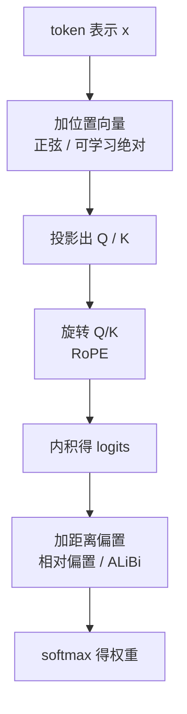

# RoPE 与位置编码

> 🔴 重点考点:本篇是当前复习重点,文末「面试考点串联」给出问法对照。

一句话:注意力是一台**只看内容、不看顺序**的机器,位置编码就是把顺序补回去的那道手续;**RoPE 的做法是把位置变成旋转角度**——第 $m$ 个位置的 Q/K 在若干二维平面里各转 $m\theta_i$,两个向量做内积时绝对角度相消,分数里只剩相对位移。

注意力本身的公式、Q/K/V 投影和复杂度账本见 注意力基础 篇;本篇只盯一条线:**位置信息从哪一步进来,进来之后长度能撑多远**。

## 一、位置信息为什么必须显式补进去

### 裸注意力分不清「猫追狗」和「狗追猫」

自注意力对输入排列本身没有顺序约束:把句子里的 token 顺序打乱,每个位置算出来的表示只是跟着挪个位置,内容一模一样(数学上叫置换等变)。**因为注意力只做「内容对内容」的匹配**——「猫」和「狗」谁在前谁在后,不影响它俩的 Q 和 K,自然也不影响那个匹配分数。所以「猫追狗」和「狗追猫」在裸注意力眼里是同一句话,位置信息必须由外部显式补进来。

**为什么不能直接把整数 0、1、2 加上去?** 两个毛病:一是幅值会随长度无上限地涨,一万个 token 的位置项能把词嵌入完全淹掉;二是所有维度被绑在同一个尺度上,模型没法分别读取「差 2 个词」和「差 2000 个词」。有界的多频率表示或者直接描述位置差的做法,才能同时给出多个距离尺度。

### 五种注入方式,差别只在「位置放到哪一步」

对比这几种方法时最容易记混的不是公式,而是**它们各自动了注意力的哪一步**——顺着一次前向走一遍就清楚了:



| 方法 | 注入位置 | 标准形式是否可学习 | 长度边界 |
|---|---|---|---|
| 固定正弦 | 加到 token 表示 | 否 | 公式能算新位置,质量不保证 |
| 可学习绝对位置 | 查表后加到表示 | 是 | 表外没有已训练条目,要扩表、插值或继续训练 |
| 相对位置偏置(T5 式) | 加到 attention logits | 常为可学习、按距离分桶 | 直接描述位置差,范围受分桶设计约束 |
| RoPE | 按位置旋转 Q/K | 标准频率固定 | 内积体现相对位移,超训练长度仍需验证 |
| ALiBi | logits 加距离线性偏置 | 原方案每头一个固定斜率 | 无位置表,但不等于无限外推 |

**「是否可学习」这一列描述的是某个具体实现,不是方法的本质属性**:RoPE 的 base、ALiBi 的斜率都存在可调或可学习的变体,相对位置偏置也有固定分桶的写法。面试里被追问「RoPE 是固定的还是学出来的」,正确答法是「标准版频率固定,但这不是方法的硬约束」。

### 一条贯穿全篇的判据:公式能算 ≠ 模型能可靠外推

**任何位置函数能生成更长位置的数值,都只说明公式在那儿有定义。** 模型是否在那个长度上还保持困惑度、检索准确率和生成质量,取决于训练长度、数据分布和注意力实际学到的行为——这是两个独立的问题,不能用前者去承诺后者。第四节讲的「崩」和四种扩窗方法,全都是这条判据的展开。

## 二、正弦位置编码:多频率与相对位移

### 公式:一个位置一串不同波长的坐标

原始 Transformer 给位置 $p$ 的第 $i$ 个维度对造一组 sin/cos:

$$
PE_{p,2i}=\sin\left(p/10000^{2i/d}\right),\qquad
PE_{p,2i+1}=\cos\left(p/10000^{2i/d}\right)
$$

这个式子的意思是:**相邻的偶数维和奇数维共用同一个频率,组成一对 sin/cos**;$i$ 越大频率越低、波长越长。整个向量就是同一个位置在一排不同快慢的时钟上的读数。

**为什么要用多个波长而不是一个?** 因为一个频率只能给一个尺度的距离:**高频对**(波长几十个 token)相邻位置角度差大,能精确分辨「前一个还是前三个」,但转几圈之后单看它分不清第 3 个和第 63 个;**低频对**(波长上万 token)相邻位置几乎不动、近处一片模糊,却撑得起「大概在开头还是结尾」。高频管近邻先后、低频覆盖长距离趋势,**合起来读才能唯一确定一个位置**,后续的线性层也才能按需取用不同粒度。

### 用三角恒等式证明固定位移可由线性旋转表示

对某个频率 $\omega$,位置从 $p$ 挪到 $p+k$,那一对 sin/cos 的新值是:

$$
\begin{bmatrix}\sin((p+k)\omega)\\\cos((p+k)\omega)\end{bmatrix}
=
\begin{bmatrix}\cos(k\omega)&\sin(k\omega)\\-\sin(k\omega)&\cos(k\omega)\end{bmatrix}
\begin{bmatrix}\sin(p\omega)\\\cos(p\omega)\end{bmatrix}
$$

这个式子说的是:**给定偏移 $k$,新位置的编码等于旧位置的编码乘上一个只依赖 $k$、不依赖 $p$ 的固定矩阵**——就是一个转 $k\omega$ 角度的旋转。展开验证只用两条和角公式($\sin(a+b)$、$\cos(a+b)$),这就是面试里要求的「用三角恒等式说明」。但注意它提供的是「相对位移**可以**被线性层表达」的结构,不是「相对位移已经被算进分数里」。

### 分水岭:正弦是加上去的,所以分数里还有交叉项

这是正弦编码和 RoPE 最关键的差别,也是最容易答错的一句。正弦编码是**加到 token 表示上**的:$x_p = \text{emb} + PE_p$。把这样的两个向量投影成 Q/K 再做内积,展开有四块——内容×内容、内容×位置、位置×内容、位置×位置。**只有最后一块只依赖 $p-q$,中间两块是内容和位置的交叉项**,它们既依赖具体的词,也依赖绝对位置。

所以准确的说法是:**正弦编码有「相对位移可线性表示」的性质,但完整的注意力分数并不只依赖 $p-q$。** RoPE 走的是另一条路(第三节),它把位置乘进 Q/K 而不是加进 token,交叉项从根上就不存在。

三个高频追问的准确答法:

- **相比可学习位置表有什么优势?** 不占位置参数,公式能直接算出表外位置;可学习表更灵活,但表外根本没有已训练的条目。
- **序列长度超过 $d$ 会失效吗?** 不会因为「位置数大于维度数」就立刻失效——限制来自训练分布、周期性、有限精度和模型实际怎么利用这些维度,不是一个维度计数问题。
- **能直接外推到百万 token 吗?** 公式能算,质量不能据此保证,必须在目标长度上训练或评测(第一节那条判据)。

## 三、RoPE:把位置转进 Q/K

### 两两配对,按位置旋转

把头维度 $d$ 的 Q/K 向量按**相邻偶奇维**两两配对,看成 $d/2$ 个二维平面。第 $i$ 对分到一个固定频率 $\theta_i = \text{base}^{-2i/d}$,位置 $m$ 上让它在自己的平面里转 $m\theta_i$:

$$
\begin{bmatrix}x'_{2i}\\x'_{2i+1}\end{bmatrix}=
\begin{bmatrix}\cos(m\theta_i)&-\sin(m\theta_i)\\
\sin(m\theta_i)&\cos(m\theta_i)\end{bmatrix}
\begin{bmatrix}x_{2i}\\x_{2i+1}\end{bmatrix}
$$

这个式子说的是:**位置不改变向量长度,只改变方向**——每一对分量被当成平面上的一根指针,位置越靠后转得越多。实现上不真乘矩阵,逐元素的 cos/sin 乘加两次就够。**标准实现同时旋转 Q 和 K,V 不旋转**:位置只该影响「谁看谁」(匹配),不该污染「看到了什么」(内容);而且只有 Q、K 两边都转,下面的相消才成立——只转一边是常见错答。

### 为什么内积只依赖相对位移

旋转矩阵正交、且按角度相加复合,所以 $R(m\theta)^\top R(n\theta) = R((n-m)\theta)$,于是:

$$
\langle R(m\theta)\, q,\; R(n\theta)\, k \rangle = \langle q,\; R((n-m)\theta)\, k \rangle
$$

这个式子说的是:**绝对位置 $m$、$n$ 在内积里消掉了,只剩差值 $n-m$。** 几何直觉更好记:两根指针同时多转相同的角度,它们之间的**夹角**不变。每个二维平面各自成立,拼回整个向量仍然成立。

两句必须说准的边界:这个点积一般**还含正弦交叉项**,不能简化成单一的 $q^\top k \cos((m-n)\theta)$;而且它保证的只是「分数依赖相对位移」,**不保证分数随距离单调衰减**(见第六节)。

### 多频率:秒针、分针、时针

第 $i$ 对的波长 $\lambda_i = 2\pi/\theta_i$,就是转满一圈需要多少个 token。整套频率是一块多指针钟表:**高频对是秒针**,相邻 token 角度差大、精确分辨局部先后,但转几圈之后单看它分不清第 3 个和第 63 个;**低频对是时针**,相邻 token 几乎不动、近处一片模糊,长尺度上的粗略方位全靠它。时分秒一起读才唯一确定一个位置,不同的头因此可以按需取用不同粒度的位置信息。

> 🖼️ 占位:同一 token 的 d/2 个二维平面以快慢不同的角速度旋转的几何示意(钟表类比:秒针 / 分针 / 时针)

### 手写实现:五个扣分点

```python
def apply_rope(x, pos, base=10000.0):
    # x: (..., seq, head_dim);pos: (seq,) 每个 token 的位置
    d = x.shape[-1]
    assert d % 2 == 0, "head_dim 必须是偶数,否则配不成对"
    # 第 i 对的频率 θ_i = base^(-2i/d),i = 0 .. d/2-1
    theta = base ** (-torch.arange(0, d, 2, dtype=torch.float32) / d)
    ang = pos[:, None].float() * theta[None, :]        # 角度 = p·θ_i,(seq, d/2)
    cos, sin = ang.cos().to(x.dtype), ang.sin().to(x.dtype)
    x = x.reshape(*x.shape[:-1], d // 2, 2)            # 相邻偶奇维配成一对
    e, o = x[..., 0], x[..., 1]
    out = torch.stack((e * cos - o * sin, e * sin + o * cos), dim=-1)
    return out.flatten(-2)

q, k = apply_rope(q, pos), apply_rope(k, pos)          # Q/K 都转,V 不转
```

1. **头维度必须是偶数**,否则最后一维配不成对。
2. **配对方式必须前后一致**:不能一边用「劈成前后两半」的布局配对,一边又用「相邻两维」的方式生成频率——两种布局混用,数值不报错但语义全错。
3. **频率是 $\text{base}^{-2i/d}$**,指数里的 $2i$ 走的是维度对的序号,不是维度序号。
4. **cos/sin 用 fp32 算完再转回 x 的 dtype**,低精度下直接算三角函数,长位置上的角度误差会明显。
5. **正确的单元测试是「同时给 $m$、$n$ 平移相同的偏移,点积不变」**;不要去测「注意力矩阵对角线最大」——随机独立的 Q/K 本来就没有这个性质。

**RoPE 比前两类方法强在哪?** 三点:每一层的注意力都重新旋转一次,位置信号不会像加法式那样在深层被冲淡;不引入位置参数,也不往 logits 上加额外的 $n \times n$ 偏置矩阵,和 FlashAttention 这类不物化分数矩阵的 kernel 天然兼容;分数里没有内容—位置交叉项,相对性是干净的。

## 四、长度外推:为什么会崩,四种扩窗怎么救

### 崩的机制:模型没学过那些新的相位组合

训练长度 $L$ 之内,高频对早就转过无数整圈、什么角度都见过;**低频对却可能连一圈都没转完**——训练只覆盖了 $[0,\ L\theta_i]$ 这一小段圆弧。推理长度一旦超过 $L$,低频对进入从未见过的角度区域,各通道拼起来就是一组训练时不存在的相位组合,注意力 logits 直接跑出分布,困惑度和长程检索一起塌。类比:模型只见过「上午」的表盘,下午一到,时针指进陌生区域,整块表读不懂了。**不是公式算不出来,是模型没学过**——这正是第一节那条判据的具体形态。

### 四种扩窗方法:改位置还是改频率

| 方法 | 核心动作 | 边界 |
|---|---|---|
| 位置插值(PI) | 把目标位置按比例压回原训练范围,$m \to m/s$ | 所有频率一起放慢,近邻的角度差被压小、局部分辨率受损,论文配合微调 |
| NTK-aware | 按频率调整尺度(等价于调大 base),高频少动、低频多动 | 内插压力分布更合理,可零微调应急;具体公式与参数依实现,源自社区方案 |
| Dynamic NTK | 按实际序列长度动态设缩放,$s=\max(1,\ l'/L)$ | 短序列不受影响、超长时平滑降级;训练与推理配置必须一致地验证 |
| YaRN | 按波长分频段插值(转够圈的高频不动、没转完的低频全插、中间过渡),再配 attention 温度缩放 | 不是只改一个 base 就无条件生效;需要少量微调 |

四行的读法:**PI 改的是位置,NTK 系改的是频率,YaRN 是「分频段改频率 + 额外调 logits 的锐度」。** YaRN 的温度项常被漏掉,但它是相对纯分频段插值的主要增量之一:上下文变长后注意力分布被摊稀、熵漂移,把 logits 整体调锐可以补偿。论文给 LLaMA 系的经验拟合是 $\sqrt{1/t} = 0.1\ln s + 1$,分段阈值取 $\alpha=1$、$\beta=32$,微调量约为原始预训练语料的 0.1%(400 步);实现上把 q、k 各乘一个常数即可,零额外开销。

### base 越大越好吗?不是

base 决定整套频率的分布,最低频对的波长约 $2\pi \cdot \text{base}$。4k 时代默认 10000;长上下文模型普遍拉高,例如 Llama 3.1 的 500000(它还叠了自己的分频段缩放,把 8k 的训练长度扩到 128k)。

但调大 base 是有代价的跷跷板:**所有通道往低频推,长程罩得住了,近邻的角度差也跟着变小、局部分辨能力下降**;而且能撑多长还受原始训练长度约束,不是把 base 拧大就自动获得长上下文。已有工作指出,微调时把 base 调大或调小都可能改善外推,存在一个由训练长度决定的「外推临界维度」——所以 **base 要结合原训练长度、目标长度和微调数据一起选**,不存在一个通用最优值。

**扩窗之后怎么验收?别只看困惑度**——长文本困惑度主要被局部预测主导,远程检索能力塌了它也看不出来,必须补上「大海捞针」类和多任务长上下文基准(如 RULER),再看长文问答与生成质量。长序列训练的课程与数据配方见 长上下文训练 篇。

## 五、少给位置甚至不给:partial RoPE 与 NoPE

### partial RoPE:只旋转一部分维度

只对头维度的一部分做旋转,其余维度不带位置。旋转的维度是「戴表的通道」,不旋转的是「纯内容通道」——既保留位置敏感的匹配能力,又留出与位置无关、天然不会进入陌生相位的通道。有分析工作把 RoPE 的最低频通道直接截掉,报告在 20 亿参数量级上不但不掉点,还略有提升。落地例子:MiniMax M2 的 GQA + QK-Norm + pRoPE,Qwen3.5 门控注意力里 256 维的头只旋 64 维,Gemma 4 在全局层用 partial RoPE。

### NoPE:干脆不加

**因果 mask 本身就泄露顺序**——每个 token 只能看见自己之前的,注意力不再是置换等变的。类比:没有表,但排队本身有先后,数一数前面站了几个人就知道自己在哪。系统实验在一组推理与数学任务上比较了几种位置编码,结论是不加显式位置编码的 decoder-only Transformer 长度泛化反而更好;理论上它能表示绝对和相对两种位置信息,但用 SGD 实际训出来的注意力模式更接近 T5 的相对位置偏置。注意这个结论的适用范围是那批任务与模型规模,**不是「大模型都该去掉位置编码」**。

工程上通常和 RoPE 分层混用:SmolLM3 每隔 4 层去掉一次 RoPE;Kimi Linear 让 softmax 那一半(MLA 层)用 NoPE,位置信息交给线性层的递归结构承担;Tiny Aya、Arcee Trinity、LongCat、Sarvam 105B 也都是 RoPE + NoPE 混用。

### 为什么这些手段都集中在全局层

机制原因只有一句:**局部层只看最近 $W$ 个,相对距离恒 $\le W$,永远落在训练见过的范围内,根本不存在外推问题**;要跨几十万 token 的全局层才会冲出训练长度。所以「减弱(partial RoPE)、去掉(NoPE)、补救(YaRN)」这三条路都只对全局层有意义。各家的局部:全局比例、窗口大小与公开证据见 SWA 篇。

## 六、边界与选型

### 三个必须驳掉的过强表述

RoPE 唯一可靠的结论是「Q/K 内积显式依赖相对位移」。下面三句都属于说过头:

| 过强表述 | 为什么不成立 |
|---|---|
| 「天然无限外推」 | 公式在任意 $m$ 上都有定义,但低频通道在训练里只走过一小段圆弧,超出后是没学过的相位组合;实测要靠扩窗方法加继续训练 |
| 「自然远程衰减」 | 衰减的上界依赖特定的分量假设,而 Q/K 是学出来的。有分析指出 Q/K 独立采样时激活的期望与相对距离无关;实测里模型反而用最高频做位置化的注意力模式、用低频做语义匹配 |
| 「显式保存绝对位置」 | RoPE 只让内积依赖 $n-m$,绝对位置并没有以可读向量的形式留在表示里——同时给 $m$、$n$ 平移相同偏移,点积不变。(因果 mask 仍会泄露顺序,但那不是 RoPE 提供的) |

### RoPE 和 ALiBi 怎么选

先说清差别:**RoPE 旋转 Q/K,ALiBi 在 logits 上按距离加一个线性偏置**(每个头一个固定斜率,原方案不学习)。ALiBi 不需要位置表、外推时不用改频率,但它对远处的惩罚随距离持续增长,效果上接近一个软性的局部窗口——**「能跑更长」不等于「远处看得更准」**,长程精确检索并不因此变好。选型没有脱离任务的绝对排名,要看四件事:**手上的 checkpoint 是哪种**(换位置编码等于重训)、**目标硬件上有没有现成高效内核**、**目标长度多少**、**有多少继续训练预算**。

### 四个高频判断题

- **可学习位置表超出原长度怎么办?** 三条路:扩表(新条目随机初始化,需要训练)、对已有表做插值、直接在更长序列上继续训练。共同点是都得付训练成本——表外本来就没有已训练的条目。
- **位置编码会被微调吗?** 可学习表会随训练更新;固定函数(正弦、标准 RoPE 频率)本身不更新,但上游的 Q/K 投影会适应它的分布,所以「没参数」不等于「微调对它没影响」。
- **从 2K 扩到 32K,只改位置编码够吗?** 通常不够。还要选缩放策略、在长序列上继续训练或微调、并跑完整评测(困惑度 + 检索 + 生成);只把配置里的长度上限改大,基本等于没做。
- **RoPE 能直接用于所有线性注意力吗?** 不一定。核映射和矩阵重排之后,$R_m^\top R_n = R_{n-m}$ 这个关系是否还保留必须**逐算法确认**;有些递归结构的状态更新本身就带顺序,干脆用 NoPE。线性注意力与 SSM 的机制见 线性注意力 篇。

另外两条跨篇边界,知道结论、细节别在本篇展开:RoPE 的旋转依赖位置,和 MLA 把投影矩阵吸收进 latent 的做法天然冲突,DeepSeek 用 decoupled RoPE 单独留一小截带旋转的维度绕开,见 MLA 篇;滑动窗口机制本身见 SWA 篇。

### 设计百万 token 模型时,位置方案之外还要验证什么

位置编码只是其中一格。还要一起定下来的至少有:**训练长度的分阶段安排与长文数据配比**、**目标长度上的检索与生成评测**(不能只看困惑度)、**KV cache 与显存预算**(缓存往往比位置编码更早撞墙)、**目标推理栈上有没有对应的 kernel 与缩放实现**。任何一项没过,位置编码选得再对也撑不住百万上下文。

## 七、面试考点串联

| 高频问法 | 本文哪一节 |
|---|---|
| Transformer 为什么需要位置信息?不加会怎样?为什么不能直接把整数位置加上去 | 一 |
| 固定正弦、可学习绝对、相对位置偏置、RoPE、ALiBi 各把位置注入到哪一步 | 一(注入图 + 对照表) |
| 固定位置函数能算更长的位置,为什么不等于可靠外推 | 一(判据)+ 四 |
| 正弦编码为什么要用多个波长?怎样用三角恒等式说明固定位移可线性表示 | 二 |
| 正弦编码和 RoPE 的作用点差在哪?为什么正弦的完整分数不只依赖 $p-q$ | 二(分水岭)+ 三 |
| 正弦编码与可学习位置表各自怎么处理表外位置?序列长度超过 $d$ 会失效吗 | 二 + 六 |
| 推导 RoPE:怎么配对、怎么旋转、内积为什么只依赖相对位移 | 三 |
| 不同频率各自管什么?高频低频分别负责哪种距离 | 三(钟表类比)+ 二 |
| 为什么旋转 Q/K 而不旋转 V?只转 K 行不行 | 三 |
| 手写 RoPE:头维度、配对布局、频率公式、怎么写测试 | 三(五个扣分点) |
| RoPE 相比绝对位置编码和其他相对位置编码有什么优势 | 三 |
| 超过训练长度为什么会退化 | 四 |
| 位置插值、NTK-aware、Dynamic NTK、YaRN 各改了什么?YaRN 除了频率还改了什么 | 四(对照表 + 温度缩放) |
| base 越大越好吗?和目标长度怎么联合选 | 四 |
| 扩窗之后怎么评测才算数 | 四 |
| partial RoPE 是什么?留出不旋转的通道有什么好处 | 五 |
| 不加位置编码为什么也能跑?这个结论的适用范围是什么 | 五 |
| 为什么治外推的手段都集中在全局层 | 五(比例与证据见 SWA 篇) |
| 「RoPE 天然无限外推 / 自然远程衰减 / 显式保存绝对位置」哪里说过头了 | 六 |
| RoPE 和 ALiBi 怎么选 | 六 |
| 可学习位置表超出原长度有哪些处理方法?位置编码会被微调吗 | 六 |
| 从 2K 扩到 32K 只改位置编码够吗?设计百万 token 模型还要验证什么 | 六 |
| RoPE 能直接用于所有线性注意力吗 | 六 |

边界说明:注意力的公式、投影与复杂度账本见 注意力基础 篇;层间局部/全局比例与各家证据见 SWA 篇;RoPE 与矩阵吸收的冲突及 decoupled RoPE 见 MLA 篇;线性注意力与 SSM 见 线性注意力 篇;扩长的训练配方见 长上下文训练 篇。

## 相关文献

- Attention Is All You Need(正弦位置编码的出处)— [arXiv:1706.03762](https://arxiv.org/abs/1706.03762)
- Exploring the Limits of Transfer Learning with a Unified Text-to-Text Transformer(T5,分桶相对位置偏置)— [arXiv:1910.10683](https://arxiv.org/abs/1910.10683)
- RoFormer: Enhanced Transformer with Rotary Position Embedding(RoPE 原始论文)— [arXiv:2104.09864](https://arxiv.org/abs/2104.09864)
- Train Short, Test Long: Attention with Linear Biases Enables Input Length Extrapolation(ALiBi)— [arXiv:2108.12409](https://arxiv.org/abs/2108.12409)
- Extending Context Window of Large Language Models via Positional Interpolation(PI)— [arXiv:2306.15595](https://arxiv.org/abs/2306.15595)
- YaRN: Efficient Context Window Extension of Large Language Models(分频段插值 + 温度缩放,并给出 Dynamic NTK 的正式表述)— [arXiv:2309.00071](https://arxiv.org/abs/2309.00071)
- NTK-aware scaled RoPE(社区原帖,bloc97 于 r/LocalLLaMA,2023-06;YaRN 论文正式引用了它)— https://www.reddit.com/r/LocalLLaMA/comments/14lz7j5/ntkaware_scaled_rope_allows_llama_models_to_have/
- Scaling Laws of RoPE-based Extrapolation(base 与训练长度的联合影响、外推临界维度)— [arXiv:2310.05209](https://arxiv.org/abs/2310.05209)
- The Impact of Positional Encoding on Length Generalization in Transformers(NoPE)— [arXiv:2305.19466](https://arxiv.org/abs/2305.19466)
- Round and Round We Go! What makes Rotary Positional Encodings useful?(高低频各自的作用、对「远程衰减」的反驳、p-RoPE)— [arXiv:2410.06205](https://arxiv.org/abs/2410.06205)
- RULER: What's the Real Context Size of Your Long-Context Language Models?(扩窗后的评测)— [arXiv:2404.06654](https://arxiv.org/abs/2404.06654)
