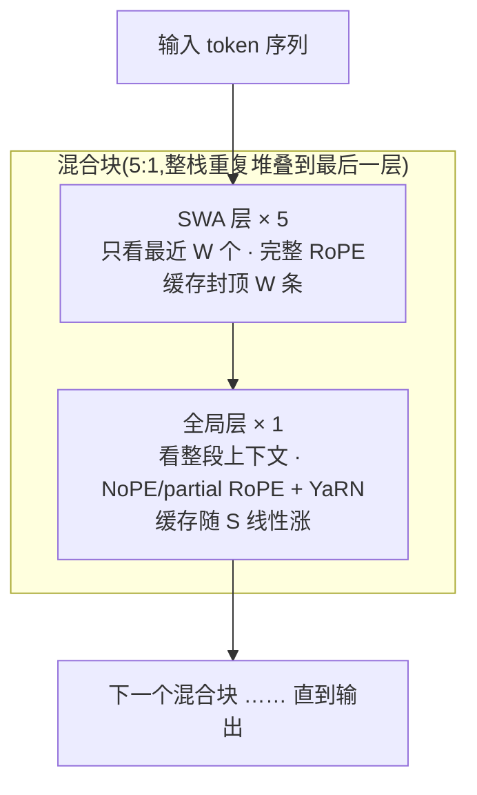

# SWA(Sliding Window Attention)

一句话:**每个 token 只对最近 $W$ 个 token 做注意力**——把全注意力的 $O(L^2)$ 计算压成 $O(L \cdot W)$,把随上下文线性膨胀的 KV cache 封顶在 $W$ 条。代价是丢长程信息,所以现代模型没有纯 SWA,全是「局部为主、全局补刀」的混合形态。

> **类比**(架构手册的说法):全注意力是每写一句都翻回第一页重读全书;SWA 是**只看最近两页**。写作的流畅连贯大部分确实只依赖最近两页,但「第三章埋的伏笔」这类远处信息,就得靠别的机制兜底。

## 一、机制:一个 mask 的事

### 窗口 mask 与复杂度

SWA 不改注意力的数学形式,只改 mask:因果注意力里位置 $i$ 本来能看 $[0, i]$ 的全部历史,SWA 收紧为只看最近 $W$ 个(含自己):

$$
\mathrm{mask}(i, j) =
\begin{cases}
0, & i - W < j \le i \\
-\infty, & \text{否则}
\end{cases}
$$

注意力矩阵从完整下三角变成一条宽 $W$ 的斜带,计算与缓存跟着降:

$$
\text{计算量: } O(L^2) \longrightarrow O(L \cdot W), \qquad \text{单层 KV cache: } O(S) \longrightarrow O(\min(S, W))
$$

$W \ll L$ 时(如 $W = 1024$、$L = 128\text{k}$)两项都是两个数量级的节省;而且 $W$ 固定后,**decode 每步的注意力开销是常数,不再随上下文变长而变慢**。

> 🖼️ 占位:注意力 mask 对比示意——左为因果全注意力的完整下三角,右为 SWA 的宽 W 斜带

### 感受野随深度叠加:传话游戏

单层只看 $W$,但堆 $k$ 层后信息可以**逐层接力传播**:第 1 层把 $[i-W,\, i]$ 聚合进位置 $i$ 的表示,第 2 层在看位置 $i-W$ 时,顺带拿到了它在第 1 层吸收的更早 $W$ 个 token 的信息……理论感受野随层数线性扩张:

$$
\text{$k$ 层 SWA 的理论感受野} \approx k \times W
$$

Mistral 7B 是教科书数字:$W = 4096$、32 层,理论感受野约 $131\text{k}$ token。

> **类比**:传话游戏。隔着十个人,消息也能传到你耳朵里——**能传到,但会失真**。每层接力都是一次有损压缩,远处信息传到高层只剩「大意」,做不了精确检索(大海捞针必挂)。这就是理论感受野很大、纯 SWA 仍然不能打的原因,也是下一节混合形态存在的理由。

## 二、没人用纯 SWA:局部:全局混合是标准形态

长程信息只能靠接力、接力必失真,所以标准做法是:**大部分层用 SWA(便宜),少数层保留全局注意力(精确回溯)**。「局部:全局的比例 + 窗口大小」是真实的设计旋钮,各家的答案(架构手册的汇总表):

| 模型 | 局部:全局 | 窗口大小 | 备注 |
|---|---|---|---|
| Gemma 2 | 1:1 | 4096 | 起点 |
| Gemma 3 / Gemma 4 | **5:1** | 1024 | 窗口缩到 Gemma 2 的 1/4 |
| GPT-OSS | **1:1** 交替 | — | 最保守 |
| OLMo 3 | 3:1 | — | YaRN 只在全局层用 |
| Step 3.5 Flash | 3:1 | — | — |
| Laguna XS.2 | 3:1 | **512** | — |
| Xiaomi MiMo-V2-Flash | 5:1 | **128** | 窗口小得离谱 |
| Arcee Trinity Large | 3:1 | — | 512k 上下文 |

趋势读法:从 Gemma 2 → Gemma 3 → MiMo,**局部层占比在涨(1:1 → 5:1),窗口在缩(4096 → 1024 → 128)**——业界在不断试探「局部层到底可以多敷衍」;3:1 是 2026 年最常见的落点。

### MiMo-V2-Flash:窗口可以压到多小

这个案例值得单独讲:40 个 SWA 层的窗口只有 **128**——每个 token 只能看前 128 个字,单层几乎退化成 n-gram 模型;**全部长程能力压在 8 个全局层上**。而它的 Agent 分是 47.3,很能打。结论:**局部窗口可以压得比直觉小得多**——局部层只需把窗口内的语法与局部语义处理干净,长程定位完全交给少数全局层就够了。

## 三、层间分工:位置编码的规律

局部/全局分层之后,位置编码也跟着分工。架构手册总结的耦合规律,各家高度一致:

| 层类型 | 位置编码 | 长度外推 |
|---|---|---|
| 局部层(SWA) | 完整 RoPE | 不需要 |
| 全局层 | NoPE 或 partial RoPE | YaRN 只在这里用 |

为什么:局部层的窗口本身就隐含位置信息(「只能看前 $W$ 个」),RoPE 只是锦上添花;更关键的是窗口内相对距离恒 $\le W$,永远落在训练分布内,**根本不存在长度外推问题**。全局层则要跨几十万 token,RoPE 在训练长度之外会失效,所以要么减弱(partial RoPE)、要么去掉(NoPE)、要么补救(YaRN)。**OLMo 3 是这条规律最干净的公开证据:YaRN 长度外推只在全局层做。** RoPE/NoPE/YaRN 的原理与细节见知识库的 RoPE 篇。

## 四、与 KV cache:封顶,且与其他手段正交

回到 KV cache 总量公式(层数 × KV 头数 × 头维度 × 2 × 序列长度 × 字节数),SWA 砍的是**序列长度这一项**:SWA 层的缓存条目封顶在 $W$,实现上用**环形缓冲区(rolling buffer)**——第 $i$ 个 token 写进 $i \bmod W$ 号槽位,覆盖最旧的条目(Mistral 7B 的做法)。混合模型的总缓存于是变成:

$$
\text{KV cache} \propto \underbrace{n_{\text{global}} \times S}_{\text{全局层,仍线性涨}} \; + \; \underbrace{n_{\text{swa}} \times \min(S, W)}_{\text{SWA 层,封顶}}
$$

5:1 配比 + 小窗口时,长上下文下基本只剩全局层的缓存在涨——这是 Gemma 3 压缓存的主力手段。

且 SWA 与其他 KV 优化**各砍公式里不同的项,可以叠加**:GQA 砍 KV 头数、跨层 KV 共享砍层数、SWA 砍序列长度。Gemma 4 三样同时用(SWA 5:1 + GQA + 同类型层间共享 KV)。GQA 见知识库的 GQA 篇;跨层共享、逐层注意力预算见注意力配件篇。

层间堆叠整体长这样(5:1 示例):

## 五、细节与坑

- **窗口边界是断崖,不是渐变**:第 $i - W$ 个 token 在本层被一刀切地看不见,没有「稍远一点还能看到一点」的软衰减。恰好落在窗口外的关键信息,只能指望高层接力或全局层捞回——接力又会失真。
- **流式场景必配 attention sink**:滑窗把开头的 token 挤出缓存后,softmax 失去了习惯性堆放注意力权重的「垃圾桶」位置,PPL 会爆炸。StreamingLLM 的发现:**永久保留开头几个 sink token + 滑动窗口**,就能无限长流式生成;GPT-OSS 进一步把 sink 做成可学习的 bias。细节见知识库的注意力配件篇。
- **prefill 仍然要算**:SWA 省的是「每个位置看多远」,不是「要不要算」。prefill 对 $L$ 个位置各算一遍窗口内注意力,复杂度 $O(L \cdot W)$——从平方降到线性,但长 prompt 下 prefill 依然是成本大头,不会因为窗口小就消失。
- **FlashAttention 原生支持**:FlashAttention-2 起自带 window size 参数,斜带 mask 不必显式物化成矩阵,分块计算时直接跳过窗口外的块。SWA 几乎零工程成本落地,这也是它普及快的原因之一。

## 六、面试考点串联

高频问法(与题库联动的切片点):

1. 为什么没人用纯 SWA →「一、传话游戏」+「二」:接力传播有损,精确长程检索必须留全局层
2. $k$ 层 SWA 的感受野怎么算 →「一、感受野」:$\approx k \times W$;Mistral 7B 的 4096 × 32 ≈ 131k 是标准引用
3. 局部:全局比例、窗口大小怎么选 →「二、比例表」:1:1 到 5:1、4096 到 128;3:1 是常见落点,MiMo-V2-Flash 证明窗口下限比直觉低得多
4. 为什么 YaRN 只在全局层用 →「三」:窗口内相对距离恒 ≤ W、无外推问题;全局层才会面对训练外的长度
5. SWA 层的 KV cache 怎么封顶、和 GQA 什么关系 →「四」:rolling buffer 环形覆盖;与 GQA/跨层共享各砍公式不同项,可叠加
6. 滑窗流式生成为什么会崩、怎么救 →「五」:挤掉开头 token 导致 sink 失效,StreamingLLM 保留 sink token

## 相关文献

- Longformer(滑动窗口注意力在 Transformer 上的系统化开山)— [arXiv:2004.05150](https://arxiv.org/abs/2004.05150)
- Mistral 7B(现代 LLM 的 SWA 代表应用:W=4096、rolling buffer、层叠感受野)— [arXiv:2310.06825](https://arxiv.org/abs/2310.06825)
- Gemma 3(5:1 局部:全局 + 1024 窗口的大规模实践)— [arXiv:2503.19786](https://arxiv.org/abs/2503.19786)
- OLMo 3(YaRN 只在全局层:层间分工规律的公开证据)— [arXiv:2512.13961](https://arxiv.org/abs/2512.13961)
- StreamingLLM(attention sink:滑动窗口流式生成的关键补丁)— [arXiv:2309.17453](https://arxiv.org/abs/2309.17453)
