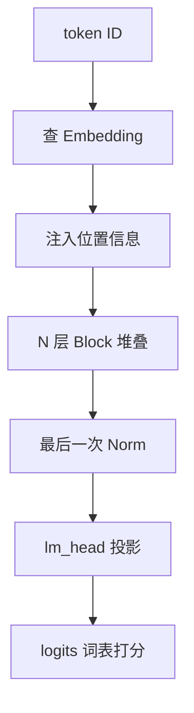

# Transformer 整体架构

一句话:Transformer 把两件事**反复交替 N 次**——先让每个位置跨位置去取信息(注意力),再让每个位置独立加工手里的信息(FFN);本篇不讲任何单个部件的内部原理,只负责**把整台机器串起来**:数据怎么从 token 流到 logits、一层里的零件按什么顺序接线、同一套零件换一下可见性怎么就变成了 BERT、GPT 和 T5。

## 一、一次前向:从 token 到 logits



设 batch 为 $B$、序列长 $L$、隐藏维 $d$、词表 $V$。形状只变两次:`[B, L]` 的整数 ID 查表后变成 `[B, L, d]`,一路保持到最后一层输出,只有 lm_head 那步把最后一维换成 $V$,再由采样把它塌回 `[B, L]`。切词见 Tokenizer 篇,位置怎么注入见 RoPE 篇,从 logits 到 token 见 解码策略 篇。**中间那么多层,宽度 $d$ 为什么全程不变?** 因为所有子层都要把结果加回同一条残差主干道,加法要求两边同宽,所以 $d$ 是全网写死的;唯一的例外就是最后那次词表投影,它已经走出主干道了(主干道为什么这么重要,见 残差流 篇)。

### 三个容易被漏掉的部件

- **位置信息不一定在图上那一步注入。** 可学习的绝对位置表和正弦编码确实是在这里直接加到 embedding 上,但 RoPE 根本不在这一步——它在**每一层的注意力里**对 Q 和 K 做旋转。所以「位置编码加在 embedding 之后」只对一类方案成立,回答前要先问清是哪种。
- **embedding 出来有时要乘 $\sqrt{d_{model}}$。** 原始 Transformer 明确写了这一步:embedding 按小方差初始化,量级偏小,而正弦位置编码的取值就在 $[-1, 1]$——不把内容那一路抬起来,位置信号会盖过内容信号。这条不是必备件,改用 RMSNorm 加 RoPE 的现代模型有做有不做,不能当通则背。
- **最后那次 Norm 不能省。** Pre-Norm 的主路是一路纯加法,走到最后一层时残差流量级已经累积得很大,直接送进 lm_head 会让 logits 尺度失控。GPT-2 就是这么处理的:把 LayerNorm 挪到每个子块的输入端,并在最后一个块之后**补一个额外的 LayerNorm**。Post-Norm 模型不用补,它最后一个子层出口本来就有 Norm。

### 写成代码就这么几行

```python
class Block(nn.Module):                       # 一层 = 两个同构的残差子层
    def forward(self, x, mask):
        x = x + self.attn(self.n1(x), mask)   # Pre-Norm:Norm 只在分支上
        return x + self.ffn(self.n2(x))       # 主路自始至终是纯加法

class LM(nn.Module):
    def forward(self, ids):                   # ids: [B, L]
        x = self.tok(ids) + self.pos(...)     # [B, L, d],位置在这里注入
        mask = causal_mask(ids.size(1))       # 上三角屏蔽未来
        for blk in self.blocks:
            x = blk(x, mask)                  # 宽度 d 全程不变
        return self.head(self.final_n(x))     # [B, L, V] logits
```

这是骨架不是可跑实现(缺拆头、缩放与 KV cache),完整版本在题库的手撕题里。**要点是那两行加法**:每个部件都只做「从主路读一份、算完加回去」,谁都不改主路本身。

### 为什么比 RNN 好并行,代价是什么

RNN 的第 $t$ 步必须等第 $t-1$ 步的隐状态算完,长度 $L$ 的序列有 $L$ 步串行依赖;Transformer 一层之内所有位置的投影和注意力是一次矩阵乘算完的,**串行深度从 $O(L)$ 降到 $O(1)$**,层与层当然还是串的,但那个深度是 $N$,与序列长度无关。

代价有两条,都得说出口:一是**拿计算量换的**,RNN 跑完整条序列是 $O(Ld^2)$,Transformer 多出一项 $O(L^2d)$ 的两两配对(账见第七节);二是**并行只在训练侧**,自回归推理时下一个 token 依赖上一个 token 的采样结果,该串行的一步都省不掉。

## 二、一层 block 里有什么

一层 block 就是两个结构完全一样的残差子层串联,只是里面装的算子不同:

$$
x' = x + \mathrm{Attn}(\mathrm{Norm}(x)), \qquad x'' = x' + \mathrm{FFN}(\mathrm{Norm}(x'))
$$

两行说的是同一件事:从残差流上读一份、归一化后送进自己的算子、把结果加回去。所以一层里其实只有四样东西:**两处 Norm**(见 Norm位置 篇)、**一个多头自注意力**(见 注意力基础 篇)、**一个 FFN**(见 FFN与激活 篇)、**两次残差加法**(见 残差流 篇)。

**其中只有注意力跨位置。** 另外三样都在每个位置内部独立干活:注意力做跨位置的信息搬运,FFN 做逐位置的信息加工,两者混的维度正交,所以必须交替、谁都不能省。也正因如此,所有「模型怎么看见上下文」的问题最后都落在注意力的可见性上——这就引出第三节。

### 顺序不能写反

上面写的是 Pre-Norm。原始 Transformer 用的是 Post-Norm:

$$
x' = \mathrm{Norm}(x + \mathrm{Attn}(x))
$$

差别只在 Norm 站在加号之前还是之后:Pre-Norm 把 Norm 留在分支上,主路从头到尾是纯加法;Post-Norm 让主路每层被重整一次。就这一个字,决定了深层能不能训稳、要不要 warm-up、最终精度差多少。完整对比连同 Sandwich Norm 与 DeepNorm,见 Norm位置 篇。

顺带答一个几乎必被追问的:**为什么这里用 LayerNorm 不用 BatchNorm**。LN 沿单个 token 的隐藏维求统计量,不看 batch 里的别人;BN 沿 batch 维求,于是变长序列里 padding 会污染统计、流式解码时 batch 只有 1、训练和推理还得用两套统计量。理由的展开同样在 Norm位置 篇。

## 三、三种架构:差别只在谁能看见谁

| 架构 | 谁能看见谁 | 训练目标 | 生成方式 | 代表 |
|---|---|---|---|---|
| Encoder-only | 输入内**双向**全可见 | 掩码语言建模,还原被挖掉的 token | 不天然生成 | BERT |
| Decoder-only | 每个位置只看**左侧** | 预测下一个 token | 逐 token 自回归 | GPT / LLaMA |
| Encoder-Decoder | 源侧双向,目标侧因果且可读全部源 | 条件生成、去噪 | 目标侧自回归 | 原始 Transformer / T5 |
| Prefix LM | **前缀内双向**,输出段因果 | 单栈里同时做理解与生成 | 输出段自回归 | UniLM |

**这四种不是四种网络,是同一套零件配四张 mask。** UniLM 讲得最直白:一个共享的 Transformer 主干,靠不同的自注意力掩码控制「预测时能条件在哪些上下文上」。所以「GPT 和 BERT 结构差在哪」的准确答法不是「一个是 decoder 一个是 encoder」,而是:**层内零件完全一样,差的是掩码形状、训练目标,以及顶上那个头**——GPT 顶着 lm_head 对每个位置算 next-token 损失,BERT 顶着 MLM 头且只在被挖掉的位置算损失。

Prefix LM 和纯因果的差别也只在掩码的左上角:纯因果里前缀的第一个 token 看不见第二个,Prefix LM 让**前缀内部互相可见**、输出段仍然只能往左看,等于把 encoder-decoder 的「双向读输入」折进了同一个栈。

### 为什么现在的 LLM 基本都是 decoder-only

1. **一套目标吃下所有数据**。预测下一个 token 不需要任何标注,互联网上随便一段文本都是合法样本;encoder-decoder 得先把数据切成输入段和输出段,切法本身就是一层先验。
2. **接口统一**。系统提示、few-shot 示例、思维链和答案全在同一条 token 流里,不用区分谁进 encoder、谁进 decoder。
3. **推理形态干净**。整条序列共用一份因果 KV cache,不必额外维护一份 encoder 输出,批处理与并行切分也只有一种形状要考虑。
4. **规模化的工程惯性**。同构堆叠更容易做张量并行、流水并行和 kernel 特化。

**但这不构成「decoder-only 更优」的证明。** Wang 等人系统跑过这件事,结论是有条件的:纯无监督的零样本泛化上,因果 decoder-only 配自回归目标最好;一旦加上多任务提示微调,**输入侧非因果可见加掩码建模目标**反而赢。所以准确的说法是,decoder-only 的流行是数据、目标与工程路线共同选出来的,不是任务上的普遍最优。

### 实际项目怎么选

- **只要向量或标签**(检索、分类、抽取):encoder-only,或者从 decoder-only 上取表示再接任务头,拿延迟和效果实测比。
- **输入固定、输出短、输入要被反复读**(翻译、结构化改写):encoder-decoder 仍然划算,源侧只编码一次,cross-attention 的 K/V 整个解码过程都不变。
- **开放式生成、多轮对话、想复用现成基座**:decoder-only。**既要理解又要生成**时两条路都走得通,依据是延迟预算和有没有现成基座,不要按「哪种架构更先进」下结论。

想把原生 BERT 拿来生成,三件事缺一不可:**换掩码**(双向改成因果或前缀式)、**换目标**(MLM 改成预测下一个 token 或 seq2seq 去噪)、**再训练**。只改推理不改训练,就会造成「训练时见过右侧、推理时见不到」的错配。词表和已学到的表示可以保留,所以现实做法通常是拿它的权重去**初始化**一个生成模型,而不是从零开始。

## 四、编码器-解码器与 cross-attention

公式和实现完全一样,**差别只在 Q 与 K/V 各自从哪根线上取**(注意力本身怎么算见 注意力基础 篇):

| 位置 | Q 来自 | K/V 来自 | 可见性 |
|---|---|---|---|
| Encoder 自注意力 | 本层残差流 | 同一份 | 非 padding 位置双向 |
| Decoder 自注意力 | 本层残差流 | 同一份 | 只看当前及左侧 |
| Cross-Attention | Decoder 残差流 | **Encoder 最后一层输出** | 整条源序列 |

一句话记法:**Q 是「谁在提问」,K/V 是「去哪本册子里查」**。翻译时 encoder 先把源句压成一册固定的表示,decoder 每生成一个词就拿当前状态去这册里查一遍。也正因如此,encoder-decoder 的解码器每层有**三个**子层(因果自注意力 → cross-attention → FFN),比 decoder-only 多一个,代价是多一组 Q/K/V/O 投影和一次额外的注意力。

### 两份 KV cache 不是一回事,而 decoder-only 干脆没有第二份

自注意力的 cache 每生成一个 token 就**追加一行**,越滚越长;cross-attention 的 K/V 只依赖源序列,**整个解码过程算一次就固定**,长度锁死在源句上。这是 encoder-decoder 在「输入长、输出短」场景下的结构性优势:源侧投影不重算,缓存也不增长(cache 机制与显存账见 KVCache 篇)。

decoder-only 没有标准 cross-attention,是因为它压根没有第二条序列:提示和回答被拼进同一条 token 流,提示位置的 K/V 就躺在同一份缓存里,后面的位置靠因果自注意力往左读就够了——**在 decoder-only 里,「读提示」和「读自己刚生成的内容」是同一个操作**。所以说它「用自注意力代替了 cross-attention」准确,说它「没有交叉注意力所以读不了输入」就错了。一个活着的例外是多模态:Q 来自文本、K/V 来自视觉编码器输出,机制原封不动,只是被查的册子换成了图像特征(见 VLM结构 篇)。

### 不加因果掩码会怎样

训练时位置 $t$ 的标签就是 $x_{t+1}$,而 $x_{t+1}$ 就躺在同一条输入序列里。不加掩码,注意力一眼看见答案,loss 会掉得非常好看,**但模型学到的是抄写而不是预测**;部署时右侧根本不存在,输出立刻崩掉。这是训练推理不一致最极端的一种形态。

## 五、可学习参数清单:逐个点名

设词表 $V$、隐藏维 $d$、FFN 中间维 $d_{ff}$、Query 头数 $h_q$、KV 头数 $h_{kv}$、头维 $d_h$。

| 组件 | 常见形状 | 干什么 |
|---|---|---|
| Token Embedding | $V \times d$ | token ID 变向量,全模型一份 |
| Q / O 投影 | $d \times h_q d_h$ 与 $h_q d_h \times d$ | 产生查询、合并各头输出 |
| K / V 投影 | 各 $d \times h_{kv} d_h$ | 产生键与值 |
| FFN | 经典两矩阵 $d \times d_{ff}$ 与 $d_{ff} \times d$;门控是 gate / up / down 三个 | 升维、过非线性、降回 $d$ |
| Norm | 每处一个长度 $d$ 的 $\gamma$ | 归一化后把尺度放回去 |
| lm_head | $d \times V$ | 隐状态变词表 logits |

中间四行每层各一份,首尾两行全模型各一份;矩阵的转置方向随框架约定变化,不必纠结。

### 六个高频追问

- **Norm 的 $\beta$ 呢?** LayerNorm 标准形式有 $\gamma$ 和 $\beta$ 两个长度 $d$ 的向量;RMSNorm 砍掉了中心化,标准实现**只有 $\gamma$**。$\epsilon$ 是防除零的常数,不是参数。
- **位置编码算不算参数?分情况。** 可学习的绝对位置表是 $L_{max} \times d$,算;原始正弦编码写死在公式里,不算;RoPE 是对 Q/K 做固定旋转,不算;相对位置偏置两种都有。**不能按「绝对还是相对」这四个字直接判断**(见 RoPE 篇)。
- **QKV 打包成一个大矩阵等于共享参数吗?不等于。** 那只是把三个 $d \times d$ 拼成 $d \times 3d$ 少发一次 kernel,切开后三份权重各是各的。真共享(强制 $W_Q = W_K$)会丢掉匹配的非对称性,是另一回事(见 注意力基础 篇)。
- **GQA / MQA 改了哪一项?** 只改 $h_{kv}$:MHA 是 $h_{kv} = h_q$,GQA 让若干 Q 头共用一组 K/V,MQA 是 $h_{kv} = 1$。K/V 投影与 KV cache 同比例缩小,Q 和 O 不动(见 KV共享注意力 篇)。
- **bias 呢?** 原始 Transformer 的线性层带 bias,现代 LLM 普遍把注意力和 FFN 的 bias 全去掉——省的参数极少,主要是发现去掉不掉点还更好训。**所以「标准 Transformer 有哪些参数」没有唯一答案**,必须跟着具体配置读。
- **哪些东西一定不是参数?** causal mask(由位置关系决定的常量布尔表)、$\sqrt{d_k}$ 这个缩放常数、softmax 的温度(除非显式设成可学习)、以及 KV cache(推理时的中间结果)。

### 权重绑定,以及参数清单不等于更新清单

$V \times d$ 与 $d \times V$ 形状正好互为转置,可以指向同一份权重。原始 Transformer 就这么做的,依据是 Press 与 Wolf 的工作:绑定能显著降低困惑度,还把翻译模型压到原来一半以下。两件事要说清:**参数不能重复计数**,$V = 128\mathrm{k}$、$d = 4096$ 时这张表约 5.2 亿参数,绑与不绑差的就是这 5.2 亿;**也不是白拿**,输入端要的是「哪些词意思相近」,输出端要的是「哪些词该被打高分」,两个目标并不完全一致,模型和词表一大现代模型反而常常解绑,LLaMA 就是不绑的。

反向传播给所有需要梯度的张量算梯度,但优化器只更新**被交给它的那些参数组**:预训练与全参微调什么也不省,参数、梯度、优化器状态三份都满;冻结基座只训任务头,或者只训 LoRA 旁路低秩矩阵,省下的是冻结部分的梯度张量与优化器状态(见 LoRA 篇)。一条容易答错的边界:**冻结不等于不参与反向**——只要更靠近输入那一侧还有要训的参数,梯度就必须从冻结层身上穿过去,省的只是它自己那份梯度和优化器状态,前向激活该存还得存。

## 六、训练和推理走的是两条路

### Teacher Forcing:喂真值,一次算完所有位置

训练时整条目标序列已知。把它右移一位当输入——输入 $[x_0, \ldots, x_{L-1}]$,标签 $[x_1, \ldots, x_L]$,再套上因果掩码:位置 $t$ 只能看见真实前缀 $x_{<t}$,却能和其他所有位置**在同一次前向里并行算出各自的损失**。这就是 Teacher Forcing。**并行的到底是哪个维度?** 是**位置维**,不是层维——$L$ 个位置的损失一次算完,但 $N$ 层还是一层层过。这句必须说准,否则追问一层就露馅。

### 输入究竟是 token ID、one-hot、Embedding 还是概率

链路是死的:**token ID → 查 Embedding → Transformer → logits → 概率 → 选出下一个 token ID**。

- **one-hot 只是查表的数学写法。** $e_i^\top E$ 和直接取 $E$ 的第 $i$ 行完全等价,但前者要显式造一个长度 $V$ 的稀疏向量,实现上没人这么干;算损失时标签也是直接喂 ID,不必展开成 one-hot。
- **概率分布不是下一步的输入。** 推理时按贪心、温度采样、top-k 或 top-p 从概率里**选出一个离散 token**,再拿它的 embedding 进下一步(策略见 解码策略 篇)。Beam Search 也一样——它确实用完整分布给多条候选打分,但每条 beam 存的仍是一串离散 token,分别喂回模型。
- **软 embedding($\bar{e} = p^\top E$)是另一种模型设计。** 它把互斥的词混成一个向量,语义上和离散文本对不上,还要处理稠密词表和跨步误差传播——可以研究,但不能拿它解释标准推理。

### 推理:串行、KV cache 与暴露偏差

推理时真实的 $x_t$ 不存在,只能一步一步来:选出第 $t$ 个 token 才算得了第 $t+1$ 个。**这个串行由自回归定义本身带来,任何工程手段都消不掉**,只能让每步更便宜,或者一次多走几步(见 投机解码 篇)。于是有了 KV cache:第 $t$ 步新增的这个 token,它的 K/V 后面每一步都会被重复读取,而它的 Q 只在当前步用一次——**所以缓存 K/V,不缓存 Q**。没有 cache,生成 $T$ 个 token 就要把前缀重算 $T$ 遍(机制与显存账见 KVCache 篇)。

两条路的 mask 也不同:训练要显式构造 $L \times L$ 的上三角掩码;增量推理时当前 query 只有一个 token,天然只能配上已经存在的 K/V,**不需要显式三角掩码**,但 padding 和分块边界照样要处理对。顺带一句:用可学习位置表的模型超过 $L_{max}$ 会直接索引越界,得扩表继续训或换可外推方案,不能假定没训过的位置自然有效(见 RoPE 篇)。

训练看真值前缀、推理看自己生成的前缀,某步一旦偏了,后面就要在训练时从没见过的前缀上继续预测,误差可能滚起来——这就是**暴露偏差**。Scheduled Sampling 的思路是训练时按概率混入模型自己采样的 token,代价是**整段并行被削弱、引入采样噪声,而且混合后的目标不再是干净的最大似然**,它和「把完整概率软喂回去」不是一回事。必须补的边界:**暴露偏差是重复、跑题、幻觉的一种解释,不是唯一解释**,这些现象同时受数据分布、训练目标、解码策略和上下文长度影响,全归给它,追问一层就答不下去。

## 七、算一笔账:参数量、算力与显存

### 参数量:一层 $12d^2$,乘层数再加词表

忽略 bias 与 Norm(它们是 $O(d)$ 量级):注意力四个投影是 $4d^2$;FFN 是 $2dd_{ff}$ 或门控的 $3dd_{ff}$,取 $d_{ff} = 4d$ 与 $\tfrac{8}{3}d$ 时都约 $8d^2$。所以

$$
N \approx 12\,n_{layer}\,d^2 + (1 \text{ 或 } 2)\,Vd
$$

这个式子说的是:主干参数量只由**层数和宽度**决定,和序列长度毫无关系;词表那一项是外挂的(绑定权重算一份,不绑算两份),小模型里它的占比可能相当可观。拿 LLaMA-7B 对一下:$d = 4096$、32 层,主干约 $6.4$B,加上两张未绑定的 $32000 \times 4096$ 表约 $0.26$B,合计约 $6.7$B——对得上。

**「FFN 大约是注意力的两倍」是怎么来的?** $8d^2 : 4d^2 = 2 : 1$。常见错答是「$d_{ff} = 4d$ 所以 FFN 是四倍」,那只比了宽度,忘了注意力有**四个**矩阵而经典 FFN 只有**两个**。FFN 宽度为什么取 $4d$、门控为什么折成 $\tfrac{8}{3}d$,见 FFN与激活 篇。

### 算力:两项,交叉点在 $L \approx 6d$

每层每条序列的乘加次数分两类:所有权重矩阵乘(QKVO 加 FFN)是 $12Ld^2$,随长度线性;注意力的两次配对($QK^\top$ 与 $AV$)是 $2L^2d$,随长度二次。令两者相等:

$$
2L^2d = 12Ld^2 \;\Longrightarrow\; L = 6d
$$

这个式子说的是:**序列要长到大约 6 倍隐藏维,二次那一项才追平权重那一项。** $d = 4096$ 的模型要到约 24k token 才打平,短上下文下真正吃算力的是权重矩阵乘而不是注意力——「注意力是二次复杂度所以一定是瓶颈」这句在多数实际长度上并不成立。(注意力基础 篇给的 $n \approx 2d$ 只比了注意力自己那两项,把 FFN 算进来交叉点就推到 $6d$,两个数字口径不同。)

两项容易漏掉的:**词表投影**每个位置要 $Vd$,$V = 128\mathrm{k}$、$d = 4096$ 时它比一整层还贵,长上下文训练里 logits 那块显存也很吓人;**Embedding 查表**只是索引,算力可以忽略,但读写这些向量仍有 $O(BLd)$ 的数据量。一个能直接说出口的换算:**前向约 $2N$ FLOPs/token,训练前向加反向约 $6N$**,这是 Kaplan 等人给的估算口径。

### 显存:训练和推理的大头不在同一处

| 场景 | 大头 | 随什么涨 |
|---|---|---|
| 训练 | 激活;朴素实现还会显式存下 $O(Bhn^2)$ 的注意力矩阵 | 对 $B$ 线性、对 $L$ 平方 |
| 训练 | 参数 + 梯度 + 优化器状态 | 只随 $N$,与 $B$、$L$ 无关 |
| 推理 | KV cache | 随 $B \times L \times n_{layer} \times d_{kv}$ 线性 |

**batch 和序列长度怎么共同影响?** 显存上两者都是乘数,但注意力矩阵那项对 $L$ 是平方,所以长上下文下能开的 batch 掉得非常快;吞吐上加 batch 通常有效(把访存受限的解码阶段往计算受限推),加长度则同时抬高每步成本和缓存占用。**「加 batch」和「加长度」不是同一种代价。** 举个能直接说出口的数:32 层、$d = 4096$ 的 MHA 模型,fp16 下每个 token 的 KV cache 是 $2 \times 32 \times 4096 \times 2\,\mathrm{B} = 512$ KiB,4k 上下文就是 2 GiB——这正是 GQA、MQA、MLA 那一系工作的动机。

**二次项真的主导时怎么办?** 记住四条出路各砍账本里的哪一项:FlashAttention 一个 FLOP 都没省、省的是 HBM 读写;滑动窗口把可见范围钉死在 $W$,序列项变 $O(LWd)$;稀疏注意力只让选中的少数 key 参与,按实际选中数量算;线性注意力去掉 softmax 换成固定大小的状态,序列项降到 $O(Ld^2)$、缓存降到 $O(1)$。完整对照见 注意力基础 篇第四节,各自的代价与适用条件在 SWA 篇、稀疏注意力 篇和 线性注意力 篇。MoE 改的则是另一个维度——让总参数量和每 token 计算量脱钩(见 MoE基础 篇)。

## 八、面试考点串联

| 高频问法 | 本文哪一节 |
|---|---|
| 讲一遍 Transformer 的整体架构:数据从 token 到 logits 走了哪几步,各部件干什么 | 一、二 |
| 为什么比 RNN 好并行?并行的到底是哪个维度,代价是什么 | 一、六 |
| 一层 block 里有哪些零件、按什么顺序接?哪个部件让位置之间说话 | 二 |
| Pre-LN 和 Post-LN 的式子怎么写?为什么用 LayerNorm 不用 BatchNorm | 二 |
| 最后那次 Norm 是干什么的,能不能省?embedding 出来为什么有时要乘 $\sqrt{d_{model}}$ | 一(补充题) |
| 整条链路的宽度 $d$ 为什么全程不变?唯一的例外在哪一步 | 一(补充题) |
| Encoder-only、Decoder-only、Encoder-Decoder、Prefix LM 的可见范围与训练目标差在哪 | 三 |
| GPT 和 BERT 结构上到底差在哪?Prefix LM 和 Causal LM 的掩码又差在哪 | 三 |
| 为什么现在的大模型基本都是 decoder-only,这能说明它更优吗?既要理解又要生成时怎么选 | 三 |
| 原生 BERT 想拿来做生成,要改哪些东西 | 三 |
| Self-Attention 和 Cross-Attention 的 Q、K、V 各从哪来 | 四 |
| Cross-Attention 的 K/V cache 和自注意力的有什么不同?decoder-only 没有它又怎么读提示 | 四 |
| 训练时不加因果掩码会发生什么 | 四 |
| encoder-decoder 的解码器每层比 decoder-only 多一个子层,多的是什么,代价在哪 | 四(补充题) |
| 标准 Transformer 有哪些可学习参数、常见形状是什么?哪些一定不是参数 | 五 |
| 位置编码算不算参数?QKV 打包等于共享参数吗?GQA 改了哪一项 | 五 |
| LayerNorm 的 $\beta$ 为什么有时不存在,RMSNorm 又有哪些参数 | 五 |
| 权重绑定省了什么?为什么现代模型反而常常解绑 | 五 |
| 预训练、全参微调和 LoRA 分别更新哪些张量?冻结的参数还参与反向吗 | 五 |
| 训练和推理时,输入究竟是 token ID、one-hot、Embedding 还是概率分布 | 六 |
| Teacher Forcing 为什么能并行,推理为什么还得串行?为什么只缓存 K/V | 六 |
| Beam Search 用了完整分布,为什么喂回模型的还是离散前缀?软 embedding 行不行 | 六 |
| 暴露偏差是什么?它能解释所有生成错误吗 | 六 |
| 训练整段前向和增量推理,mask 与 KV cache 分别怎么变 | 六 |
| Embedding、注意力和 FFN 的复杂度各是多少?谁先撞墙 | 七 |
| 参数量怎么快速估?为什么 FFN 约是注意力的两倍而不是四倍 | 七 |
| batch 和序列长度怎样共同影响吞吐与显存 | 七 |
| 线性、稀疏、滑动窗口分别改了复杂度账里的哪一项 | 七 |
| 词表很大时,输出投影会不会比一整层 Transformer 还贵 | 七(补充题) |
| 手写一个 Decoder-only Transformer,并说清训练前向和增量推理的边界 | 一(骨架)、六 |

## 相关文献

- Attention Is All You Need(原始架构、权重绑定与 $\sqrt{d_{model}}$ 缩放)— [arXiv:1706.03762](https://arxiv.org/abs/1706.03762)
- BERT: Pre-training of Deep Bidirectional Transformers for Language Understanding — [arXiv:1810.04805](https://arxiv.org/abs/1810.04805)
- Unified Language Model Pre-training for Natural Language Understanding and Generation(UniLM,同一主干换三种掩码)— [arXiv:1905.03197](https://arxiv.org/abs/1905.03197)
- What Language Model Architecture and Pretraining Objective Work Best for Zero-Shot Generalization?(架构与目标的横向对照)— [arXiv:2204.05832](https://arxiv.org/abs/2204.05832)
- Using the Output Embedding to Improve Language Models(权重绑定)— [arXiv:1608.05859](https://arxiv.org/abs/1608.05859)
- Scheduled Sampling for Sequence Prediction with Recurrent Neural Networks(暴露偏差与缓解)— [arXiv:1506.03099](https://arxiv.org/abs/1506.03099)
- Scaling Laws for Neural Language Models($C \approx 6N$ 的估算口径)— [arXiv:2001.08361](https://arxiv.org/abs/2001.08361)
- Language Models are Unsupervised Multitask Learners(GPT-2,末尾额外补一个 LayerNorm)— https://cdn.openai.com/better-language-models/language_models_are_unsupervised_multitask_learners.pdf
