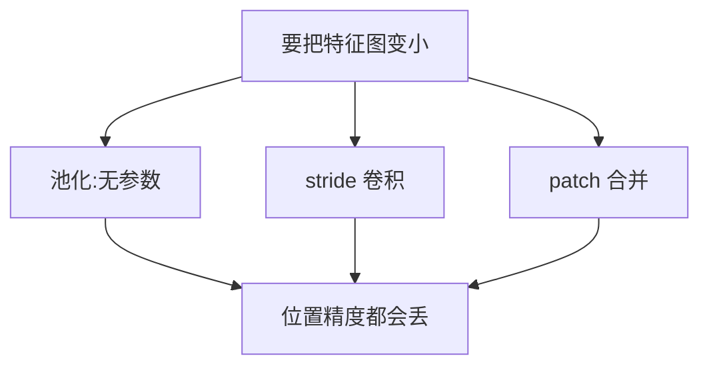

# 卷积与池化

一句话:卷积把「附近的像素才相关」和「同一个模式可能出现在任何位置」这两条假设直接写进了网络结构,用一小块权重在整张图上滑一遍;池化则负责把特征图变小、把精确位置故意模糊掉。

> **类比**:卷积核就是一枚**印章**。你拿同一枚印章在整张纸上逐格盖一遍,每盖一次记下「印得像不像」。印章只有 3×3 那么大,这是**局部连接**;从头到尾就这一枚,这是**参数共享**。CNN 的全部结构先验就是这两句话。

## 一、卷积在算什么

### 和全连接比,砍掉了什么

全连接层把输入拉平,每个输出都连到每个输入。卷积做了两处删减:一是**局部连接**,一个输出只看输入里 $k \times k$ 的一小块,窗口外的权重直接设成 0;二是**参数共享**,所有空间位置复用同一组权重,只是窗口在挪。省下多少用具体数说——输入是 $224 \times 224 \times 3$ 的图,要产出 $224 \times 224 \times 64$ 的特征:

| 做法 | 权重个数 |
|---|---|
| 全连接 | $150528 \times 3211264 \approx 4.8 \times 10^{11}$ |
| 3×3 卷积 | $3 \times 3 \times 3 \times 64 = 1728$ |

差了**八个数量级**。但要立刻补一句:省的只是**权重**。卷积的计算量还要乘上输出的高和宽,并没有跟着降到同一量级——这笔账在第四节算清。

### 一次卷积的前向与输出尺寸

输出的每个位置,是输入对应窗口和卷积核逐元素相乘再求和,最后加 bias:

$$
y_{o,i,j} = b_{o} + \sum_{c=1}^{C_{in}} \sum_{u=0}^{k-1} \sum_{v=0}^{k-1} w_{o,c,u,v} \cdot x_{c,\; si+du,\; sj+dv}
$$

这个式子在说:第 $o$ 个输出通道、第 $(i,j)$ 个位置的值,等于把**所有输入通道**在这个窗口里的数按第 $o$ 组权重加权求和。$s$ 是 stride(窗口每次挪几格),$d$ 是 dilation(窗口内采样点之间隔几格)。由此得到输出尺寸(宽同理):

$$
H_{out} = \left\lfloor \frac{H + 2P - d(k-1) - 1}{s} \right\rfloor + 1
$$

拆开读:$d(k-1)+1$ 是核**实际张开**的宽度,$H+2P$ 减掉它、再除以步长,就是能放下多少个窗口起点。代进 $k=3, s=1, d=1, P=1$ 正好得到 $H_{out} = H$,这就是常说的 same 卷积。

### 为什么要 padding

三条理由,按重要性排:

- **不补边就会一路缩没**。$k=3$ 不补边每层掉 2 个像素,224 的图撑不过 112 层,想堆深就必须补。
- **边界像素本来是被歧视的**。不补边时角落那个像素只落进 1 个窗口,中心像素落进 $k^2 = 9$ 个窗口,边缘信息的权重被系统性压低。
- **让下采样倍率可控**。想让每个 stage 的分辨率正好减半,padding 是唯一能微调的旋钮。

代价必须说清:**补进来的 0 是真实图像里不存在的东西**,模型可以从「哪一侧有一圈 0」反推自己离边界多远。这正是下一节里破坏平移等变的元凶之一。

## 二、参数共享带来的性质:等变、不变与感受野

### 归纳偏置:两条假设,不成立时就是枷锁

参数共享把两条先验硬编码进了结构:**相关性随距离衰减**(所以只看局部),**同一个模式在任何位置都该被同样地检测**(所以权重共享)。好处是样本效率——模型不必在每个位置各学一遍「什么是边缘」。坏处是**假设不成立时它是枷锁**:已经对齐好的人脸,眼睛永远在上三分之一,这时候「位置无关」反而丢掉了有用的绝对位置线索。数据量足够大时,不带这条先验的结构(比如把图切成 patch 直接做注意力)能学到超出该先验的东西。**结构先验本质是省数据的补贴,数据够多时补贴就不值钱了**。

### 等变不是不变,这是最容易答混的一对

- **平移等变**(equivariance):输入平移,输出特征图**跟着平移同样的量**,即 $f(T_\delta x) = T_\delta f(x)$。卷积给的是这个。
- **平移不变**(invariance):输入平移,输出**完全不变**,即 $f(T_\delta x) = f(x)$。卷积**不给**这个。

为什么卷积只能给等变?因为权重共享的意思就是「同一个检测器在每个位置各算一遍」。物体挪到哪儿,响应就跟着出现在哪儿——响应的**位置**变了,所以不是不变。

那分类需要的不变性从哪来?三条路:**全局平均池化**把空间维整个聚合掉,响应出现在哪最后都汇成同一个数;**局部池化逐层累积**出一点位置模糊;以及**数据增强直接教**。

**严格的等变还会被三件事破坏**,这是往下追一层时最常问的:

| 破坏者 | 为什么 |
|---|---|
| stride 大于 1 | 只有平移量恰好是 stride 的整数倍时才严格成立;平移 1 个像素而 stride 为 2,采样格点错位,输出会变(混叠) |
| padding | 补的 0 是位置相关的,物体挪到边界附近时上下文不同,响应随之改变 |
| 边界裁切 | 平移后移出画面的内容直接消失,没得等变 |

所以准确的说法是:**卷积是近似平移等变,下采样越激进近似得越差**。同理,全局平均池化给的不变性也只是「鲁棒」,不是数学上的严格不变。

### 感受野怎么长大

第 $L$ 层某个神经元能看到原图多大一块,叫感受野,它逐层累积:

$$
R_L = R_{L-1} + (k_L - 1) \prod_{l=1}^{L-1} s_l
$$

人话:每加一层,感受野的增量是「这层的核比 1 大出多少」乘上「它之前所有 stride 的乘积」。所以**下采样是放大感受野最便宜的手段**——做一次 stride 2,之后每一层的贡献都翻倍。

**小卷积核堆叠为什么优于大核**。stride 和 dilation 都为 1 时,两个 3×3 的感受野正好是 5×5,三个 3×3 是 7×7。若首尾和中间通道都是 $C$:

| 方案 | 权重数 | 非线性次数 |
|---|---|---|
| 一个 5×5 | $25C^2$ | 1 |
| 两个 3×3 | $18C^2$ | 2 |
| 一个 7×7 | $49C^2$ | 1 |
| 三个 3×3 | $27C^2$ | 3 |

省 28% 和 45% 的参数,还白赚一到两次非线性。**但这个结论有前提**:中间层通道也必须是 $C$。中间要是扩到 $2C$,两层就是 $9C \cdot 2C + 9 \cdot 2C \cdot C = 36C^2$,反而比 $25C^2$ 更多;stride 或 dilation 不为 1 时感受野也对不上,更不能直接换。工程上还有一笔代价:两层要多存一份中间激活、多一次 kernel 启动,访存受限时未必比一个大核快。

**空洞卷积**(dilated / atrous)让窗口内的采样点隔 $d-1$ 格取一个,等效核宽变成 $d(k-1)+1$,**而权重个数一点没变**。$k=3, d=2$ 就是用 9 个权重覆盖了 5×5 的范围。代价是采样点稀疏,相邻输出用到的输入点可能完全不重叠,出现网格状伪影;常见做法是让相邻层用互质的 dilation。

**理论感受野是上界,不是实际**。把输出对输入求梯度会发现贡献近似高斯分布,中心远高于边缘;有效感受野只占理论值的一小部分,而且理论值随深度线性增长时,有效值只按层数的平方根增长。所以「我算出来感受野已经覆盖全图」不等于模型真的用上了全图。

> 🖼️ 占位:两个 3×3 堆叠等效 5×5 的几何示意,右侧叠加有效感受野的高斯衰减热图

## 三、池化:前向、反向与它的替代品

### 三种局部池化,差别全在反向

前向很简单:

$$
y^{\max}_{ij} = \max_{(u,v)\in R_{ij}} x_{uv}, \qquad y^{\text{avg}}_{ij} = \frac{1}{|R_{ij}|}\sum_{(u,v)\in R_{ij}} x_{uv}
$$

左边取窗口 $R_{ij}$ 内的最大值,右边取平均;求和池化就是右边不除以窗口元素数 $m = |R_{ij}|$。前向看着差别不大,**反向的梯度路由完全不同**。设上游梯度为 $g$:

| 池化 | 每个输入拿到的梯度 | 前向要额外存什么 |
|---|---|---|
| Max | $g \cdot \mathbf{1}[i = i^*]$,只有最大值那个位置拿到 | argmax 索引 |
| Sum | $g$,窗口内每个都拿到完整的 $g$ | 只需窗口形状 |
| Avg | $g / m$,均摊 | 只需窗口形状 |

四个必须说准的点:

1. **Sum 不是平均分配**,它是每个输入都拿满 $g$;除以 $m$ 的是 Avg。Sum 的输出和梯度尺度都随窗口大小变,换 kernel 就得重调学习率。
2. **实际 CNN 里几乎见不到 Sum,原因就在上一条**:它被 Avg 严格支配——两者的信息聚合方式完全一样,只差一个常数 $1/m$,而 Avg 把尺度钉住了、Sum 没有。所以真正的选型只在 **Max 与 Avg 之间**:Max 保留窗口内最强的那个响应,对目标在窗口内小幅平移不敏感,适合"这里有没有这个特征"的判别任务;Avg 保留整体强度,适合需要全局聚合的场合(GAP 就是它)。
3. **并列最大值怎么分由实现约定**(常见是给扁平下标最小的那个),不能假设平均分。
4. **Max 的稀疏梯度不等于神经元死亡**。这个窗口这次没轮到它,换个样本、换个窗口它照样更新;和 ReLU 输入恒为负那种彻底断流是两回事。

### 手撕:带反向的最大池化

```python
import numpy as np

def maxpool2d_forward(x, k, s):
    H, W = x.shape
    oh, ow = (H - k) // s + 1, (W - k) // s + 1
    y, arg = np.empty((oh, ow)), np.empty((oh, ow), dtype=int)
    for i in range(oh):
        for j in range(ow):
            win = x[i * s:i * s + k, j * s:j * s + k]
            arg[i, j] = win.argmax()        # 存窗口内扁平下标,反向靠它路由
            y[i, j] = win.flat[arg[i, j]]   # 并列最大只取第一个
    return y, arg

def maxpool2d_backward(g, arg, x_shape, k, s):
    dx = np.zeros(x_shape)
    for i in range(g.shape[0]):
        for j in range(g.shape[1]):
            u, v = divmod(int(arg[i, j]), k)      # 扁平下标还原成窗口内坐标
            dx[i * s + u, j * s + v] += g[i, j]   # 必须累加:重叠窗口会撞同一个输入
    return dx
```

最容易写错的是最后一行:**窗口重叠时同一个输入会被多个窗口选中,梯度必须累加而不是覆盖**。Avg 的反向同理,把 $g/m$ 加到窗口内每个位置上。

### 全局平均池化与自适应池化

**全局平均池化**(GAP)把每个通道的整张特征图压成一个数,$C \times H \times W$ 变成 $C$ 维。它替掉了「展平加一个大全连接」的老分类头,省的参数很可观:ResNet-50 最后的特征图是 $7 \times 7 \times 2048$,展平后接 1000 类需要 $100352 \times 1000 \approx 1.0$ 亿个参数,GAP 之后只需要 $2048 \times 1000 \approx 205$ 万,**少了约 49 倍**。附带好处是输入尺寸可变,多大的图都输出 $C$ 维。

边界要说准:**GAP 省掉的是分类头的参数,不是把整网参数降为零**。池化算子本身通常没有可训练参数,但它后面的分类器照样有;而且如果后续结构本来就是全卷积或全局聚合,加池化也不必然减少模型参数。

**自适应池化**由目标输出尺寸反推窗口边界,第 $i$ 个窗口取 $[\lfloor iH/H' \rfloor,\ \lceil (i+1)H/H' \rceil)$。所以 $H$ 不能整除 $H'$ 时**窗口大小不等、还可能重叠**,和固定 kernel 的池化并不等价。它的用处是当接口层:不管输入分辨率多少都吐出固定形状,后面的全连接才接得上。

### kernel 和 stride 怎么选,以及为什么现代网络少用池化了

选参数的顺序是:先按想要的下采样倍率定 stride,再决定 kernel 要不要大于 stride。**kernel 大于 stride 就是重叠池化**,能减轻窗口边界处的信息断裂。小目标多的任务里激进下采样会直接把目标抹掉,这一条必须在验证集上看小目标指标,不能拍脑袋。

现代网络越来越多用 **stride 卷积**替代池化,原因是:**池化是写死的、无参数的聚合规则,而 stride 卷积把「下采样时保留哪些信息」变成了可学的**。已有工作系统地把 max pooling 换成增大 stride 的卷积,在几个图像识别基准上精度没有下降。

代价也要给:stride 卷积带来参数和计算量,而且它**同样会引入混叠**,换成可学的并不等于把 shift-variance 修好了。所以现在常见的布局是 stem 之后留一次池化、中间各 stage 用 stride 卷积、分类头前放一个 GAP;具体位置随模型版本变化,不能把一种布局推广到所有网络。



**那 ViT 呢**?原始 ViT 一上来就把图切成 16×16 的 patch 做线性投影(等价于 kernel 和 stride 都等于 16 的卷积),之后全程不改空间分辨率,分类用分类 token 的表示;层级式的视觉 Transformer 则用 patch merging,把相邻 2×2 个 patch 拼起来再投影,效果就是一次 stride 2 的下采样。也有直接对所有 token 取平均来代替分类 token 的。所以准确说法是**下采样和聚合的手段换了**,不是「大模型淘汰了池化」。

## 四、变体与复杂度账

### 三个变体:把「看邻居」和「混通道」拆开

标准卷积一次干两件事:在空间上看邻居,在通道上做混合。下面三个变体都是在拆这两件事。

**1×1 卷积**只在每个空间位置上对通道向量做一次线性变换,权重跨位置共享。它**升降通道、混合通道信息、再加一层非线性,但一点不扩大空间感受野**——感受野公式里的增量 $k-1$ 是 0。最典型的用法是瓶颈:ResNet 用 1×1 降维、3×3 在低维上算、再 1×1 升回去,256 通道的一层从 $9 \times 256 \times 256 = 589824$ 个权重降到 $16384 + 36864 + 16384 = 69632$,**约 8.5 倍**。

**分组卷积**把输入输出通道各切成 $G$ 组,第 $g$ 组的输出只看第 $g$ 组的输入,参数和计算量都除以 $G$。它最早是被显存逼出来的:AlexNet 把网络劈成两半,分别放在两块显存只有 3 GB 的 GTX 580 上。副作用是**组间信息被切断**,常见补救是在组卷积之间打乱通道顺序,也就是 ShuffleNet 的 channel shuffle。

**深度可分离卷积**等于 $G = C$ 的深度卷积(一个通道配一个核,完全不混通道)接一个 1×1 逐点卷积(只混通道)。

参数量横向对比(取 $C_{in} = C_{out} = C$,核 $k \times k$):

| 变体 | 权重数 | $C=256, k=3$ 的实际值 | 相对标准卷积 |
|---|---|---|---|
| 标准卷积 | $k^2C^2$ | 589824 | 1 倍 |
| 分组卷积($G$ 组) | $k^2C^2/G$ | 73728(取 $G=8$) | $1/G$ |
| 深度卷积($G=C$) | $k^2C$ | 2304 | $1/C$ |
| 1×1 卷积 | $C^2$ | 65536 | $1/k^2$ |
| 深度可分离 | $k^2C + C^2$ | 67840 | 约 $1/8.7$ |

深度可分离的省率上限是 $1/(1/C_{out} + 1/k^2)$,通道足够宽时趋近 $k^2$,也就是 3×3 最多省到约九分之一。

**但省下的 FLOPs 不会等比例变成加速**。看拆开后的分布:上表里深度卷积只占 2304 个权重,1×1 占 65536,**96.6% 的乘加落在了 1×1 上**(MobileNet 论文对整网的统计是 94.86% 的乘加、74.59% 的参数都在 1×1 卷积里)。深度卷积那部分虽然 FLOPs 极低,却几乎没有通道维的数据复用,算术强度很低、是访存受限的;而 1×1 卷积能直接打成 GEMM 吃满矩阵单元。**理论 FLOPs 降 9 倍、实测延迟只降两三倍**是这类结构的常态。

### 一层卷积的参数量与计算量

$$
\text{params} = \frac{k_h k_w C_{in} C_{out}}{G} + C_{out}, \qquad \text{MACs} = H_{out} W_{out} \cdot \frac{k_h k_w C_{in} C_{out}}{G}
$$

左边是权重加 bias;右边是「每个输出元素要做 $k_h k_w C_{in}/G$ 次乘加,一共有 $H_{out} W_{out} C_{out}$ 个输出元素」。两个必须记住的推论:

- **参数量和输入分辨率无关,计算量和分辨率成正比**。同一个模型喂 224 的图和喂 896 的图,参数一个字节没变,FLOPs 涨 16 倍。这就是为什么高分辨率视觉任务的瓶颈在算力而不在存参数。
- **FLOPs 约等于 2 倍 MACs**(乘和加各记一次),但有的工具把一次 FMA 记作一次操作。**比数字前先统一口径**,否则会出现两倍的无谓争论。

池化这边:算子无可训练参数,时间与输出窗口覆盖的元素总数成正比,显存主要是输出;反向时 max 要额外存一份 argmax 索引,avg 不用。

### 和注意力的关系

卷积的权重**训练完就固定**,谁和谁交互由几何位置决定;注意力的权重是**当场按内容算**出来的,可以直接连上远处的任意位置(见 注意力基础 篇)。所以两者是任务上的取舍,不是无条件替代:数据少、需要强局部先验时卷积占便宜,数据多、需要长程且内容相关的交互时注意力占便宜,现在主流视觉骨干普遍是两者的混合。另外划一条边界:CNN 里的 BatchNorm、InstanceNorm、GroupNorm 该按哪个轴统计、小 batch 下怎么选,归一化另有专篇,本篇不展开。

## 五、面试考点串联

| 高频问法 | 本文哪一节 |
|---|---|
| 和全连接层比,卷积的局部感受野和参数共享带来什么优势 | 一 |
| stride、padding、dilation 怎么影响输出尺寸和计算量?哪一个会改变参数量 | 一 · 二 · 四 |
| 为什么要 padding?补 0 有什么副作用(补充题) | 一 |
| 平移等变和分类输出的平移不变有什么区别?不变性靠谁提供 | 二 |
| 卷积是严格平移等变吗?什么东西会破坏它(补充题) | 二 |
| 两个 3×3 什么时候比一个 5×5 参数更少?前提是什么 | 二 |
| 空洞卷积怎么在不加参数的前提下放大感受野?代价是什么(补充题) | 二 |
| 感受野算够了是不是模型就真看到全图了(补充题) | 二 |
| 参数共享的归纳偏置是什么?什么时候它反而是负担(补充题) | 二 |
| MaxPool、AvgPool、SumPool 的反向梯度分别怎么分配?这种差异怎么影响训练 | 三 |
| Max 只向最大值位置回传梯度,会不会让一些神经元永远得不到更新 | 三 |
| 为什么实际 CNN 里 Max Pooling 比 Sum Pooling 常见得多 | 三 |
| 常见的池化有哪些?计算方式、梯度特点和适用场景分别是什么 | 三 |
| 手写池化的前向和反向,要额外存什么?窗口重叠时要注意什么 | 三 |
| 全局平均池化和自适应池化各解决什么问题 | 三 |
| 池化一定减少参数吗?ViT 类模型怎么完成下采样或聚合 | 三 |
| 池化的 kernel 和 stride 按什么定 | 三 |
| 为什么现代网络越来越多用 stride 卷积替代池化?代价是什么 | 三 |
| 1×1 卷积在做什么?怎么改变通道并实现通道交互 | 四 |
| 深度可分离卷积为什么能省算力?除了理论 FLOPs,哪些因素会影响实际延迟 | 四 |
| 组卷积的复杂度怎么变?组间不通信有什么问题 | 四 |
| 输入 H×W×C、核 K×K、输出 F 通道,输出尺寸、MACs 和 FLOPs 怎么推?换更大分辨率哪个会变 | 四 |
| 卷积和自注意力的信息交互方式差在哪 | 四 |

## 相关文献

- Very Deep Convolutional Networks for Large-Scale Image Recognition(VGG,小卷积核堆叠)— [arXiv:1409.1556](https://arxiv.org/abs/1409.1556)
- Network In Network(1×1 卷积与全局平均池化)— [arXiv:1312.4400](https://arxiv.org/abs/1312.4400)
- Deep Residual Learning for Image Recognition(ResNet,瓶颈结构与 GAP 分类头)— [arXiv:1512.03385](https://arxiv.org/abs/1512.03385)
- Striving for Simplicity: The All Convolutional Net(用增大 stride 的卷积替代 max pooling)— [arXiv:1412.6806](https://arxiv.org/abs/1412.6806)
- Multi-Scale Context Aggregation by Dilated Convolutions(空洞卷积)— [arXiv:1511.07122](https://arxiv.org/abs/1511.07122)
- Understanding the Effective Receptive Field in Deep Convolutional Neural Networks(有效感受野)— [arXiv:1701.04128](https://arxiv.org/abs/1701.04128)
- MobileNets: Efficient Convolutional Neural Networks for Mobile Vision Applications(深度可分离卷积与逐层资源占比)— [arXiv:1704.04861](https://arxiv.org/abs/1704.04861)
- Xception: Deep Learning with Depthwise Separable Convolutions(深度可分离卷积的极限化)— [arXiv:1610.02357](https://arxiv.org/abs/1610.02357)
- ShuffleNet: An Extremely Efficient Convolutional Neural Network for Mobile Devices(分组卷积与 channel shuffle)— [arXiv:1707.01083](https://arxiv.org/abs/1707.01083)
- Aggregated Residual Transformations for Deep Neural Networks(ResNeXt,把分组数当设计维度)— [arXiv:1611.05431](https://arxiv.org/abs/1611.05431)
- ImageNet Classification with Deep Convolutional Neural Networks(AlexNet,分组卷积的起源;NeurIPS 2012 会议论文,不在 arXiv)— https://papers.nips.cc/paper_files/paper/2012/hash/c399862d3b9d6b76c8436e924a68c45b-Abstract.html
- Gradient-Based Learning Applied to Document Recognition(LeNet-5;Proceedings of the IEEE 86(11), 1998,不在 arXiv)— https://ieeexplore.ieee.org/document/726791
