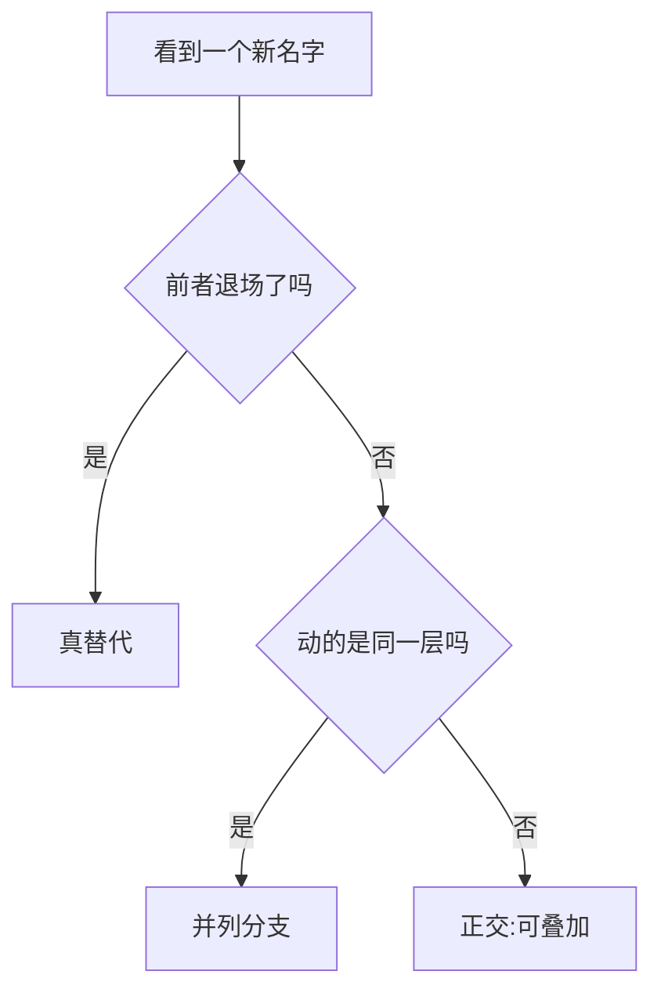

# 新架构追踪

> 🔴 重点考点:本篇是当前复习重点,文末「面试考点串联」给出问法对照。

一句话:本篇是本章的**串讲篇**——**不讲任何一项机制的原理**(每一项都有自己的专篇),只回答那个专篇答不了的问题:**这条演进线是怎么长出来的?谁真的接替了谁,谁只是并排的另一条路,谁根本不算新机制?** 末尾接一张「当季新出、还没单独成篇」的追踪表。

阅读约定:下文每提到一项技术,都只给一句定位加一个篇名,机制细节一律去那一篇看。本章的目录导航由总览页负责,本篇不做目录。

## 一、三条判据:替代、并列、正交

面试问「演进」,考的从来不是背一串名字,而是**名字之间的关系**。拿到一个新名字先问三句:

1. **它接替了谁?** 前者在新模型里彻底不出现了,才叫真替代——这一类其实极少。
2. **它和谁并排?** 两者各有场景、谁也没把谁挤走,是并列分支——这一类最多,也最容易被答成「后者淘汰前者」。
3. **它动的是哪一层?** 两者根本不在同一层做文章,就是**正交**,可以叠着用。

第三条要单独展开,因为它就是「现代大模型结构演进」那道题的题眼:**三类信息必须分开表述**,混在一起讲,结论会全错。

| 这是哪一层 | 里面是什么 | 怎么确认 | 混淆的典型后果 |
|---|---|---|---|
| **公开架构事实** | 层数、头数、专家数、窗口大小、KV/token | 只有官方报告或权重配置写了才算数 | 拿传言当事实:GPT-4 的「1.76T MoE」从未被官方确认 |
| **算法结构** | GQA / MLA / 稀疏 / 线性、SwiGLU、RMSNorm、MoE 路由 | 换一张卡结论仍然成立的,才是结构 | 把内核优化说成一种新注意力 |
| **系统实现优化** | FlashAttention、分页、连续批、量化 kernel | 判据只有一句:**它改模型的输出分布吗** | 把「推理快了三倍」记成架构进步 |

还有一条纪律必须说出口:**闭源模型没披露的细节不能补猜**。只有官方资料明确写了才能确认;从产品表现反推内部结构是无效推理——同一份表现可以由数据、训练配方、路由策略、推理系统里的任意一项造成,架构只占其中一格。所以本章所有横向对比,准确的名字都是「**开源**前沿模型的架构对比」;闭源那栏具体不知道什么,本章总览第八节列了清单。

## 二、注意力主线:从「读别人」到「读自己」

这条线的每一步都只解决上一步剩下的那个问题。**机制细节全部属于 注意力基础 篇**,这里只负责排顺序、说清每一步买到了什么。

### 起点是固定向量瓶颈

Seq2Seq 把整个源句压进 Encoder 最后一个隐状态,Decoder 从头到尾对着这一个向量解码——句子一长就装不下。第一版注意力拆的就是这个瓶颈:**每个解码步用当前 Decoder 状态给 Encoder 各个位置打一次分,再按分数加权取回**,读哪里由当前这一步自己决定。

### 软与硬:分岔在训练方式,不在效果

- **软注意力**对所有位置连续加权,整条路处处可导,梯度能直接反传到打分函数上——这是它成为主流的唯一原因。
- **硬注意力**每步只采样或选中少数几个位置。离散选择那一步没有梯度,只能绕过去:用强化学习式的梯度估计,或者把选择当成随机变量、去最大化一个变分下界。Show, Attend and Tell 原文给的两条训练路子,正是「确定性 + 标准反向传播」与「随机 + 最大化变分下界」。
- 答这条时**别说硬注意力被淘汰了**。它没留在 LLM 主干里,是因为训练方差大、代价高,不是思路错。今天动态稀疏注意力「先挑一小撮再精读」的做法,骨子里就是硬选择的工程化版本(见 稀疏注意力 篇)。

### 打分函数:加法 → 点积

早期用一个小前馈网络给「Decoder 状态 × Encoder 位置」打分,后来换成直接算内积。换的理由不是更准,而是**点积能整批塞进一次矩阵乘**,在 GPU 上快一个量级。两者的取舍、以及点积为什么要除以 $\sqrt{d_k}$,见 注意力基础 篇。

### 自注意力:把「读别人」改成「读自己」

Transformer 的新意不是注意力本身,而是 **Q、K、V 全部取自同一个序列**:同一层内任意两个位置直接交互,不必再沿 RNN 一步步传,长距离依赖的路径长度从 $O(n)$ 掉到 $O(1)$,而且整层能并行算。

代价当场出现:每个位置都要和所有位置配一次对,**配对数是 $n^2$**,这就是平方复杂度的来源。**这笔账本篇不展开**——配对项与投影项怎么拆、为什么不能合并成一项、序列多长时平方项才开始主导,见 注意力基础 篇。

### 多头:切子空间,不切总宽度

多头把表示投到 $h$ 个子空间分别算再拼回来,一次前向能同时维持好几种匹配关系。

但**它不会让总计算量自动除以头数**:固定 $d_{model}$ 时,头数只改「怎么切」,不改总宽度——每个头的维度是 $d_{model}/h$,$h$ 个头加起来的配对计算量和单头一模一样。**头数是把同样的宽度切成几份的旋钮,不是省算力的旋钮。** 真想省,得去动被切的那个东西:K/V 的份数或宽度。那是第四节的事。

## 三、长序列的四条路:并列,不是接力

平方级的配对数,加上随长度线性增长的缓存,是 2019 年之后所有长序列工作的共同起点。分岔就发生在 **「你打算改哪一件事」** 上:

| 路线 | 改的是哪一件事 | 结果还等于标准注意力吗 | 天生弱在哪 | 专篇 |
|---|---|---|---|---|
| **静态稀疏(滑窗)** | 看谁——由**位置**定死 | 否 | 窗口外本层看不见,只能靠层间接力 | SWA |
| **动态稀疏** | 看谁——由**内容**当场选 | 否 | 要多养一个选择器;省算不省存 | 稀疏注意力 |
| **线性注意力 / SSM** | 怎么算——去掉 softmax,历史压成固定状态 | 否 | 固定状态装不下细节,精确检索是弱项 | 线性注意力 |
| **序列压缩** | 存几个——先把历史折叠成更少的条目再算 | 否 | 压缩一定可能丢信息,块内细节难恢复 | 稀疏注意力 |

**四条并列的证据不在论文里,在各家 2026 年的选型上**:线性混合、压缩加稀疏 softmax、保守全注意力三条路同时在役,而且有模型从线性混合**掉头回**全注意力(路线之争与那个反例见 Hybrid注意力 篇)。如果真是接力关系,不会出现掉头。更常见的形态反而是**混着用**——同一个模型里几层滑窗、几层全局、几层线性,配比本身成了一个要调的超参。

**一条必须说准的分类**:滑窗**本身就是稀疏注意力的一种**(位置固定的静态稀疏),不是与稀疏平级的另一类。表里把它单列一行,是因为它在工程上砍的东西不同——滑窗真能减显存,而 token 级动态稀疏一条 KV 都不能丢,省的是 FLOPs。这条分界见 SWA 篇。

## 四、两条与它们正交的线

「正交」在这里是字面意思:下面两条**和上一节四条路里的任何一条都能同时开**,因为它们根本不在同一层做文章。

### FlashAttention:换实现,不换结果

它算的还是同一个 softmax 注意力,**一次配对都没跳过**;做的事是分块加在线归一化,把那张 $n \times n$ 的中间矩阵摁在片上不落显存,省掉 HBM 的来回搬运。所以两句话必须一起说:**IO 少了,平方级 FLOPs 一个没省**——它不是线性注意力,不是稀疏注意力,也不减 KV cache。分块与在线归一化怎么做,见 FlashAttention 篇;KV cache 是另一个东西,见 KVCache 篇。

这也是那道题为什么要单独问它:**把内核优化答成一种新的注意力近似,是这条线上最高频的丢分点。**

### KV 表示:MQA / GQA / MLA 治的是 decode 的带宽

它们在演进里解决的**不是计算,是带宽**。decode 每吐一个 token,都要把整个 KV cache 从显存完整读一遍,读的字节数直接决定这一步要多久——瓶颈在搬运不在算力,这个判据见 Roofline与Bound分析 篇。

- **GQA**:几个 query 头分组共用一套 K/V,缓存按分组数等比例缩;代价是组内被迫共用一套索引,质量要靠 uptraining 找回。见 KV共享注意力 篇。
- **MLA**:头数一个不减,减的是**每个 token 存多宽**——K/V 压成一个低维潜向量再缓存,用时上投影还原,decode 时靠矩阵吸收连解压都省了;代价是与 RoPE 冲突要打 decoupled 补丁,而且解码时的点积维度比 GQA 高(GLM-5 报告给的同规模对照是 576 维对 128 维)。见 MLA 篇。

它们和第三节那四条路正交:**改的是缓存里存什么,既不是注意力的连接图,也不是计算形式。** 所以「GQA + 滑窗 + FlashAttention」这种三件套是常态,不是矛盾组合。

一张表收口:

| | 改连接图 | 改计算形式 | 改缓存表示 | 改内存读写 |
|---|---|---|---|---|
| 稀疏 / 滑窗 | ✅ | | | |
| 线性 / SSM | | ✅ | | |
| MQA / GQA / MLA | | | ✅ | |
| FlashAttention | | | | ✅ |

同一列里的方法互相竞争,**不同列之间可以叠加**——这就是「哪些只是并行分支而不是互相替代」这道题的标准答法。

## 五、按组件读演进

按模型名字背清单必错,按**组件**读才稳:每个组件当年卡在哪、后来怎么改、代价是什么。

| 组件 | 原来卡在哪 | 现在怎么改 | 代价 | 专篇 |
|---|---|---|---|---|
| 注意力的 KV 表示 | MHA 的缓存随层数、头数、长度一起涨 | MQA/GQA 减份数,MLA 压宽度 | 共用带来的质量损失;MLA 的 RoPE 补丁与更宽的解码点积 | KV共享注意力 / MLA |
| 位置编码 | 绝对与正弦位置只能加在输入,相对距离表达不直接 | RoPE 把位置旋进 Q/K;全局层常用 partial RoPE 或 NoPE | **能算更长 ≠ 能可靠外推**,扩窗要额外训练 | RoPE |
| FFN | 单条通路,「运水」和「拧阀门」是同一股信号 | SwiGLU 拆成门控与内容两条分支 | 多一条升维矩阵,公平比较要把中间宽度缩回去 | FFN与激活 |
| 归一化 | Post-LN 深层难训;LN 要算均值又算方差 | 位置换 Pre-LN(或残差内 Post-Norm),类型换 RMSNorm | 位置和类型是**两个独立维度**,没有跨模型的绝对优劣 | Norm位置 |
| 容量 | Dense 的总参数和每 token 计算绑死 | 稀疏 MoE 把两者解耦 | 路由不稳、负载不均、all-to-all 通信 | MoE基础 / MoE路由 |
| 长序列建模 | 平方配对 + 线性增长的缓存 | 稀疏 / 线性 / SSM / 混合架构 | 各自的弱项见上一节的表 | 线性注意力 / Hybrid注意力 |
| 训练目标 | 一次前向只监督下一个 token | MTP 多加几项未来 token 的预测 | 权重要压着退火;推理侧留不留是另一笔账 | MTP |
| 残差流 | 所有层挤同一条 $d$ 维主干道 | 拓成多条并行流,或改成按需回取 | 新增的混合矩阵要配额外的稳定手段 | 残差流 |

### 三处最容易归错类

**第一处:SwiGLU 与 RMSNorm / Pre-LN 不是同一类改动。** SwiGLU 改的是**模型算什么**——FFN 里多了一条门控分支,函数本身变了;RMSNorm 改的是归一化用哪个统计量,Pre-LN 改的是 Norm 摆在残差的哪一侧,**这两个改的是训练动力学**,目的是让同样深的网络更好训。把三个并排说成「都是提升效果的小改进」,追问一句「那它们各自换来了什么」就答不上。Norm 的类型与位置为什么是两个独立维度,见 Norm位置 篇。

**第二处:Mamba 和 RWKV 都不能简单归成线性注意力,但理由不一样。** Mamba 出身是**选择性状态空间模型**,把 SSM 的参数变成输入的函数;它和线性注意力在对偶视角下确实能互相翻译,但**能翻译不等于是同一类**。RWKV 出身是 **RNN**,论文标题直说「为 Transformer 时代重造 RNN」,卖点是同一组权重有两副面孔——训练时按 Transformer 并行、推理时按 RNN 递归且复杂度恒定。把它写成「线性注意力的一种」,丢掉的正是这个双形态。两者的谱系见 线性注意力 篇;RNN 与 SSM 在训练部署上的整体差异,另有计划文章「序列模型」承接。

**第三处:训练算法和服务系统都不是模型骨架。** PPO、GRPO 这些后训练方法不会取代注意力或 FFN,分页缓存和连续批处理也不会;它们和骨架的关系是「在同一个骨架上做不同的事」。这条和第一节那张三层表是同一条纪律。

## 六、选型:先定场景,再谈架构

同一句「哪个架构好」,换个场景答案就翻转。三类场景各自**先测什么**:

- **长文档**:先测**精确检索**(多针、跨段引用这类任务),再看 prefill 时间与 KV 容量。「支持 1M」是配置项不是能力——DeepSeek-V4 报告自己的 MRCR 曲线在 128K 之后就开始下滑。**测出来找得到,才算能用。**
- **端侧**:先测**单请求延迟与显存峰值**(权重 + KV + 图池)。batch 恒等于 1,吞吐指标基本没有参考价值;能不能装下,往往比快多少更早卡人。
- **大吞吐服务**:先测**满足延迟约束下的有效吞吐**,而不是裸吞吐;KV/token 直接决定并发上限,所以它是这类场景里信息量最大的单个数字。

三类指标的口径见 推理服务指标 篇,手段按什么顺序上见 推理加速 篇。**架构选型只是这条链的第一环**——同一个架构配不同的并行策略、量化与调度,落地结论可以完全不同(见 并行策略 篇)。

## 七、当季追踪表

收本章还没单独成篇的新架构点。**升格成独立文章的门槛写死两条:有第二家独立采用,或者机制复杂到一句话说不清。** 下面几条目前都没过线,所以处置一律是「并进已有专篇」,不新开。

| 条目 | 一句话机制 | 出处 | 值得单开一篇吗 |
|---|---|---|---|
| **SiTU-GLU** | 给 GLU 的门控与内容两条分支各套一层 $\beta\tanh(\cdot/\beta)$ 软上限,输出绝对值封在 $\beta_1\beta_2=100$ 以内,原点附近仍近似 SwiGLU | Kimi K3 技术报告 — [arXiv:2607.24653](https://arxiv.org/abs/2607.24653) | 否;补进 FFN与激活 的例外角 |
| **Muon Split(逐头正交化)** | 把优化器正交化的粒度从整块 Q/K/V 上投影矩阵降到单个注意力头,让各头以不同尺度更新;报告称配上之后预训练期注意力 logits 尺度稳定、不需要裁剪策略 | GLM-5 技术报告 — [arXiv:2602.15763](https://arxiv.org/abs/2602.15763) | 否,而且不归本章;机制归 优化器 篇,注意力配件 篇只留一条与 QK-Clip 的对照 |
| **MTP 层参数共享** | 训练时摆 3 个 MTP 层但共享同一份参数:草稿的显存不随投机步数线性涨,同时让训练真的见过「连猜 3 步」 | GLM-5 技术报告 — [arXiv:2602.15763](https://arxiv.org/abs/2602.15763) | 否;补进 MTP 篇的配置谱,并注明接受长度那组对比跑在私有 prompt 集上 |
| **压缩 KV 同体时的部分维 RoPE** | 一份压缩缓存同时当 K 和 V,全维旋转会让加权求和后的 V 带上绝对位置;只旋最后 64 维,并在注意力输出上做一次逆向旋转 | DeepSeek-V4 技术报告 — [arXiv:2606.19348](https://arxiv.org/abs/2606.19348) | 否;补进 RoPE 篇的 partial RoPE 一节,它给这个手法补了一个新动机 |
| **MLA 的头维/头数再平衡** | 头维从 192 提到 256、头数减少三分之一:训练与 prefill 的计算量大致不变,而解码时每个 query 头都要对潜向量做一次点积,头数降三分之一就省三分之一 | GLM-5 技术报告 — [arXiv:2602.15763](https://arxiv.org/abs/2602.15763) | 否;补进 MLA 篇。同一份报告里「同规模下 MLA 打不平 GQA-8」那组对照更该补 |

两条使用纪律:**表里每一条目前都只有一家采用,不要当成趋势讲**;凡涉及具体模型的配置或收益数字,以 `reports/` 下的一手报告解读为准,二手手册与一手报告冲突过不止一次。

## 面试考点串联

| 高频问法 | 本文哪一节 |
| --- | --- |
| 注意力从 Seq2Seq 的软/硬注意力一路演进到 FlashAttention,每一步解决了什么?哪些只是并行分支而不是互相替代? | 二(主线)+ 三(四条并列的路)+ 四(两条正交线与收口表) |
| 软注意力与硬注意力的训练差别是什么? | 二(软与硬:可导直接反传 vs 离散采样要绕) |
| 自注意力为什么是 $O(n^2)$,长序列受什么限制? | 二(自注意力)给一句话,完整账本在 注意力基础 篇 |
| 多头注意力为何不会让总计算量自动除以头数? | 二(多头:头数只改怎么切,不改总宽度) |
| 稀疏注意力与线性注意力分别改变了什么? | 三(一个改「看谁」,一个改「怎么算」) |
| FlashAttention 怎样减少 IO,为什么它仍不是线性注意力?为什么说它是实现优化而不是新的注意力近似? | 四(换实现不换结果)+ 一(三层信息表) |
| MQA/GQA 在注意力演进中主要解决哪个推理瓶颈? | 四(KV 表示治的是 decode 带宽,不是计算) |
| 从原始 Transformer 出发,现代大模型按组件有哪些代表性演进?为什么选型时要区分公开架构事实、算法结构与系统实现优化? | 五(组件表)+ 一(三层信息表与「不补猜」) |
| GQA、MLA 分别怎样减少 KV Cache,代价是什么? | 四(两条各一句)+ 五(KV 表示那一行) |
| SwiGLU、RMSNorm 和 Pre-LN 分别改了哪一部分? | 五(第一处易错:改函数 vs 改训练动力学) |
| Mamba 与 RWKV 是否都属于线性注意力? | 五(第二处易错:一个是 SSM 出身,一个是 RNN 出身) |
| 为长文档、端侧或大吞吐服务选架构时,你会优先测哪些指标? | 六(三类场景各测什么) |
| 闭源模型的架构和成本信息应怎样表述才可靠? | 一(只认官方披露,产品表现不能反推结构) |
| 补充题:今年新出的架构点里,哪些够格单开一篇? | 七(追踪表 + 两条升格门槛) |

## 相关文献

- Neural Machine Translation by Jointly Learning to Align and Translate(注意力的起点:拆掉固定向量瓶颈)— [arXiv:1409.0473](https://arxiv.org/abs/1409.0473)
- Show, Attend and Tell: Neural Image Caption Generation with Visual Attention(软/硬注意力的训练分岔)— [arXiv:1502.03044](https://arxiv.org/abs/1502.03044)
- Effective Approaches to Attention-based Neural Machine Translation(全局与局部注意力的早期对照)— [arXiv:1508.04025](https://arxiv.org/abs/1508.04025)
- Attention Is All You Need(自注意力与多头)— [arXiv:1706.03762](https://arxiv.org/abs/1706.03762)
- Transformers are RNNs: Fast Autoregressive Transformers with Linear Attention(线性注意力与递归形态的等价)— [arXiv:2006.16236](https://arxiv.org/abs/2006.16236)
- Efficient Transformers: A Survey(长序列变体的分类框架)— [arXiv:2009.06732](https://arxiv.org/abs/2009.06732)
- FlashAttention: Fast and Memory-Efficient Exact Attention with IO-Awareness(精确、IO 感知,不是近似)— [arXiv:2205.14135](https://arxiv.org/abs/2205.14135)
- GQA: Training Generalized Multi-Query Transformer Models from Multi-Head Checkpoints — [arXiv:2305.13245](https://arxiv.org/abs/2305.13245)
- RWKV: Reinventing RNNs for the Transformer Era(RNN 出身、训练与推理两副面孔)— [arXiv:2305.13048](https://arxiv.org/abs/2305.13048)
- Mamba: Linear-Time Sequence Modeling with Selective State Spaces(选择性状态空间模型)— [arXiv:2312.00752](https://arxiv.org/abs/2312.00752)
- DeepSeek-V2: A Strong, Economical, and Efficient Mixture-of-Experts Language Model(MLA 把 KV 压成潜向量)— [arXiv:2405.04434](https://arxiv.org/abs/2405.04434)
- The MiniMax-M2 Series: Mini Activations Unleashing Max Real-World Intelligence(从线性混合掉头回全注意力的反例)— [arXiv:2605.26494](https://arxiv.org/abs/2605.26494)
- GLM-5: from Vibe Coding to Agentic Engineering(Muon Split、MTP 参数共享、MLA 头维再平衡的出处)— [arXiv:2602.15763](https://arxiv.org/abs/2602.15763)
- DeepSeek-V4: Towards Highly Efficient Million-Token Context Intelligence(压缩 KV 与部分维 RoPE 的出处)— [arXiv:2606.19348](https://arxiv.org/abs/2606.19348)
- Kimi K3: Open Frontier Intelligence(SiTU-GLU 的出处)— [arXiv:2607.24653](https://arxiv.org/abs/2607.24653)
