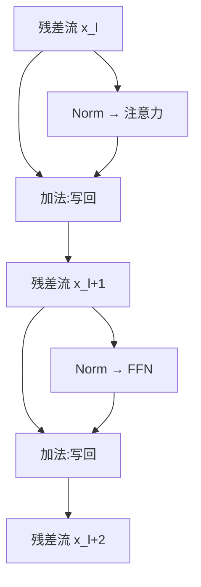

# 残差流(残差连接 → 超连接 / mHC / AttnRes)

> 🔴 重点考点:本篇是当前复习重点,文末「面试考点串联」给出问法对照。

一句话:**残差连接让每一层只学"在现有表示上打个补丁",再把原表示原样加回去**——它治的病叫「网络退化」,顺带给梯度开了一条直达电梯。这个十年没人动过的部件,2026 年被 DeepSeek V4(mHC)和 Kimi K3(AttnRes)分别从「把主干道拓宽」和「让层回头点名取」两个方向改写。

## 一、先说清它治的是什么病:网络退化

### 现象:加深反而更难训

ResNet 论文的原始对照很干脆。ImageNet 上把没有残差的普通卷积网从 18 层堆到 34 层,top-1 验证误差从 **27.94% 涨到 28.54%**,训练误差也是全程更高;换成残差版本,同一组深度立刻掉头——ResNet-18 是 27.88%,**ResNet-34 是 25.03%**,深的那个终于比浅的好。CIFAR-10 上把普通网从 20 层堆到 56 层,同样是越深训练误差越高。

这就是**网络退化(degradation)**:加深到一定程度之后,继续堆层不但没收益,**训练集上的误差本身都升高了**。

反直觉在哪:多出来的那 16 层,只要全部学成恒等映射,就能原样复现 18 层的解,误差**至少不该更差**。做不到,说明问题不在"模型装不下",而在**优化器找不到那个明明存在的解**。

### 退化、过拟合、梯度消失是三件事

| | 症状 | 病根 | 从哪看出来 |
|---|---|---|---|
| **网络退化** | **训练误差随深度升高** | 优化困难:好解存在但搜不到 | 只看**训练**曲线就够 |
| 过拟合 | 训练误差继续降,**测试误差升** | 容量相对数据太大 | 看训练与测试的**差** |
| 梯度消失 | 浅层梯度范数衰减到接近 0,参数几乎不动 | 反向连乘的因子长期小于 1 | 看**各层梯度范数** |

ResNet 作者把另外两个都排除掉了:不是过拟合,**因为训练误差就已经更高**;也不是单纯的梯度消失,因为那些普通网络配了 BN,前向方差非零,作者还验证过反向梯度范数是健康的。所以答这道题时**别把三件事糅成一句「层深了梯度就没了」**——那正是面试官等着抓的地方。

## 二、$x + F(x)$:一条恒等捷径同时救了前向和反向

### 前向:最差也只是退化成恒等

残差块不让这一层直接学目标映射 $H(x)$,只让它学**增量** $F(x) = H(x) - x$,算完再加回去:

$$
y = x + F(x)
$$

这个式子的意思是:这一层的职责从"从头造一个输出"变成"在别人给的表示上打个补丁"。好处很实在——想让某层什么都不做,只需要把 $F$ 的权重压到 0,**这比让一堆随机初始化的权重恰好学成恒等矩阵容易太多**。于是"加深最差也只是退化成浅网络"从愿望变成了默认起点,上一节缺的那把钥匙就是它。

### 反向:$I + J_F$ 里的那个 $I$

对残差块求导得 $\partial y / \partial x = I + J_F$,其中 $J_F$ 是分支 $F$ 的雅可比。跨多层展开:

$$
x_L = x_l + \sum_{i=l}^{L-1} F_i(x_i)
\quad\Longrightarrow\quad
\frac{\partial \mathcal{L}}{\partial x_l} = \frac{\partial \mathcal{L}}{\partial x_L}\Big(I + \frac{\partial}{\partial x_l}\sum_{i=l}^{L-1} F_i(x_i)\Big)
$$

人话:从损失回到第 $l$ 层的梯度里,**永远含一份没乘过任何权重矩阵的原件**,就是括号里那个 $I$。普通网络的梯度是一长串雅可比连乘,每项谱范数只要略小于 1,几十层乘下来就指数级衰减;有了 $I$,等于给梯度开了一部**不设站的直达电梯**,中间层学成什么样都不影响底层收到信号。

但边界要说准:**$I$ 只保证"有一条通路",不保证"幅度合适"**。真正连乘的是 $\prod_i (I + J_{F_i})$,$J_F$ 长期偏大照样爆炸,长期偏小则整个网络变成"只坐电梯不进办公室"。第四节还会回到这一点。

### 捷径必须保持干净

Identity Mappings 那篇直接做了对照实验:只是把捷径乘一个常数 0.5,CIFAR-10 误差就从 **6.61% 掉到 12.35%**;在捷径上加门控、$1\times1$ 卷积或 Dropout 也都变差。原因不难想——$I$ 一旦变成 $\lambda I$,$L$ 层连乘就是 $\lambda^L$,指数级地放大或消失。结论要记牢:**想调尺度就去调分支那一侧,别动主路。**

## 三、Transformer 的残差流:一条所有层共用的主干道

可解释性研究给这条通路起了个好名字:**residual stream(残差流)**。Transformer 里的部件——embedding、每个注意力子层、每个 FFN、最后的 unembedding——都不直接互相说话,而是统一从这条 $d$ 维通道上**读**,算完再把结果**加**回去。

> **类比**:残差流是一块全楼共用的公告板。注意力层看一眼板上内容、贴几张条子;FFN 再看一眼、又贴几张。板面($d$ 维)大小固定,层与层全靠它通气。

### 为什么常和 Pre-LN 搭

Pre-LN 写作 $x_{l+1} = x_l + F(\mathrm{Norm}(x_l))$:**Norm 只作用在分支上,主路从 $x_l$ 到加号一路恒等**。这正好接上第二节那条结论——捷径上不能有乘性变换。Post-LN 把 Norm 骑在相加之后,主路每层被重整一次,反向就要连乘一串 Norm 的雅可比,直达电梯被打断了。

站在残差这一侧只需记住这一句:**Pre-LN 配残差,是因为它把 Norm 挪出了主路**。Pre/Post 的完整对比、warmup 敏感性、Sandwich Norm、DeepNorm 与 OLMo 的残差内 Post-Norm,是 Norm位置 篇的地盘,这里不重复。

### 残差分支上的 Dropout

**位置**:Dropout 加在**子层输出上、相加之前**,即 $x + \mathrm{Drop}(F(\mathrm{Norm}(x)))$。别加在主路上——理由同上,那等于往捷径上压乘性噪声。

**训练与推理必须对齐**:主流实现用的是 inverted dropout——训练时以概率 $p$ 把分支输出的元素随机置零,并把留下来的元素**除以 $1-p$** 放大,使期望不变;推理时 Dropout **整个关掉**,既不置零也不缩放。这两件事必须成对出现,**两套规则混用**(比如训练时不放大、推理时也不缩小)会让推理时残差分支的注入幅度整体差 $1/(1-p)$ 倍,现象就是训练看着好好的,一切到 eval 就掉点。

另外两个常踩的坑:

- **忘了切 eval 模式**:推理时 Dropout 还在随机置零,同一条输入跑两次结果不同,评测数字来回抖;
- **深度上会累积**:每层都往主干注入一份带噪的增量,层数一多方差叠加。所以现代大模型预训练常直接把 dropout 设为 0(数据足够多,过拟合不是主要矛盾),它主要留给下游微调和小数据场景。

## 四、残差不是「无限加深许可证」

反例就在 ResNet 论文自己里:CIFAR-10 上 ResNet-110 的测试误差是 6.43%,**堆到 1202 层反而变成 7.93%**。注意这次病根换了——1202 层版本的训练误差已经压得很低,作者归因于**模型对这个小数据集来说太大、又没上强正则**,是过拟合而不是退化。另有研究指出残差网络的行为更像**许多条不同长度的浅路径的集成**,名义深度并不等于有效深度。两件事合起来说明:残差解决了"深了训不动",没解决"深了一定更好"。

极深能不能训起来,还捆着这些东西:

- **Norm**:残差主路无人限幅,Pre-LN 下残差流范数随深度单调膨胀,出口还得补一个 final norm 收口(细节归 Norm位置 篇);
- **初始化**:标准初始化下,深残差网在初始点的损失面非常陡(这正是 Fixup 论文的出发点),第一步就可能崩;
- **残差尺度**:每层往主干里注入多大的增量;
- **学习率与 warmup**:同一个结构,warmup 长度不同就是"能训"和"发散"的差别(调度细节见 优化器 篇);
- **数值精度**:BF16 下残差流幅度越滚越大时,加法里的小增量会被舍入吃掉(大数吃小数),等效于后面几十层白算。

### ReZero、Fixup、残差缩放:三个方法,同一个旋钮

这三者常被并排问,答题关键是先点破共性:**它们都不碰恒等捷径,只调残差分支的初始幅度**——让网络从"整体近似恒等"起步,再慢慢学会说话。

| 方法 | 具体动作 | 想解决的问题 | 论文自报的结果 |
|---|---|---|---|
| **残差缩放** | 初始化时把残差分支的输出投影权重按 $1/\sqrt{N}$ 缩小($N$ 为残差层数) | 主干范数随深度累积,深层增量占比失衡 | GPT-2 起的常规做法 |
| **ReZero** | 改成 $x + \alpha_l F(x)$,可学习标量 $\alpha_l$ **初始化为 0** | 深层信号传播:让网络从严格恒等出发 | 12 层 Transformer 在 enwiki8 上达到 1.2 BPB 快 56%;**训成 120 层 Transformer,不用 warmup 也不用 LayerNorm** |
| **Fixup** | 一套初始化规则:残差分支内的权重层按 $L^{-1/(2m-2)}$ 缩小($L$ 为残差块数,$m$ 为每块层数),配合部分零初始化与可学习偏置 / 缩放 | 想**完全不用归一化层**也能稳定训深残差网 | 无归一化训到 10000 层 |

参数初始化本身的方差控制与对称性破缺不在本篇,属于计划中的 参数初始化 篇。

## 五、单流的瓶颈:所有层挤同一条道

公告板面积固定,几十上百个子层的读写全压在**同一个 $d$ 维向量**上,于是有三个具体麻烦:

- **带宽互抢**:各层共享同一份写入空间,后写的会冲淡先写的;
- **远距离靠"一路带着走"**:浅层写下的特征想送到很深的地方,只能一层层扛过去,中途不断被稀释;
- **不能点名**:当前层拿到的是"过去所有层混在一起"的和,没法说"我只要第 5 层的那份表示"。

直接加宽 $d$ 当然能缓解,但注意力和 FFN 的主计算按 $d^2$ 涨,太贵(这两个子层本身见 注意力基础 篇与 FFN与激活 篇)。2026 年的改法正是从这里分岔:**要么把主干道拓宽(HC / mHC),要么让层回头点名取(AttnRes)**。

## 六、Hyper-Connections:一条道拓成 n 条

超连接(Hyper-Connections,HC)把单条残差流展开成 **$n$ 条并行流**,隐状态从 $x_l \in \mathbb{R}^{d}$ 变成 $H_l \in \mathbb{R}^{n \times d}$,并在流之间加可学习的映射:

$$
H_{l+1} = B_l H_l + C_l\, F\!\big(A_l H_l\big)
$$

一层里只发生三件事:$A_l$ 把 n 条流合并出**一份正常宽度**的输入喂给子层(所以注意力 / MoE 本身一行都不用改),$C_l$ 决定子层结果写回哪几条流,$B_l$ 决定旧的 n 条流之间怎么混合后传给下一层。

| 映射 | 规模 | 干什么 |
|---|---|---|
| $A_l$(读) | $n$ 量级 | 把 n 条流加权合并成一份 $d$ 维输入 |
| $C_l$(写) | $n$ 量级 | 把子层输出分发回 n 条流,各流分多少可学 |
| $B_l$(混) | $n \times n$ | n 条流之间跨层互相混合 |

取 $n=1$、三个映射全取 1,就退回普通残差——**HC 是残差连接的严格推广,不是另起炉灶**。映射既可以是静态参数,也可以由当前输入动态生成。

> **类比**:原来是一条主干道;现在是四条并行车道,中间有匝道互通。子层像高速服务区:进服务区前四条道并成一条($A$),出来再分流回四条($C$),车道之间随时能变道($B$ 就是匝道)。

**为什么开销几乎看不见**:额外的映射全发生在**流数 $n$** 这个很小的维度上(通常取 4),和 $d^2$ 量级的注意力 / FFN 主计算比可以忽略。论文给的对照是 OLMo-7B 每 token **13.36G FLOPs**,换成 $n=4$ 的动态版本是 **13.38G**;MoE 版 OLMoE-1B-7B 从 2.3580G 到 2.3629G,**只涨 0.2%**。收益侧论文自报**收敛快约 1.8 倍**(达到同一水平所需的训练量)。

**但 FLOPs 不变 ≠ 免费**:残差状态变成 n 份之后要**存、要搬、要混**,真实开销更多落在激活显存与内存带宽上,而这一项原论文没有测。评估这类结构时,**只盯 FLOPs 表格是最容易被骗的地方**。

## 七、mHC:给匝道装上稳定器(DeepSeek V4)

朴素 HC 一放大就出事:$B_l$ 是**自由学习的矩阵**,几十层堆下去等于几十个任意矩阵连乘,信号可能越传越大,也可能互相抵消到几乎消失。mHC 论文报告 HC 在深层堆叠时经常数值不稳——这其实就是第二节那条结论在多流上的复现:**捷径上一旦出现自由的乘性变换,深度一乘就失控**。

mHC(Manifold-Constrained Hyper-Connections,流形约束超连接)的修法是把 $B_l$ **投影到双随机矩阵**上:

$$
B_l \ge 0, \qquad B_l \mathbf{1} = \mathbf{1}, \qquad \mathbf{1}^{\top} B_l = \mathbf{1}^{\top}
$$

三条约束翻成人话:元素非负,不靠正负猛烈抵消;每行和为 1,所以新的每条流都是旧流的**加权平均**,不会放大;每列和为 1,所以旧的每条流的信号**恰好被分完**,不凭空丢失也不翻倍。合起来给出 $\lVert B_l \rVert_2 \le 1$,残差混合从"可能爆炸的任意线性变换"变成**非扩张**的;更关键的是双随机矩阵相乘仍是双随机矩阵,**网络再深,约束都能沿层保持**。

直觉记法:双随机矩阵是置换矩阵的加权平均,本质上就是一次"**软洗牌**"——车流只在车道之间重新分配,不造车也不销车。工程上用 Sinkhorn-Knopp 反复做行、列归一化把任意矩阵掰成双随机(V4 迭代 20 次);读写映射也各自用 Sigmoid 限成非负有界,并让动态部分从很小的门控系数起步,训练早期先接近静态连接。

**成本与归因要一起背**:mHC 论文在 **27B** 模型上取 $n=4$,报告**训练时间只多 6.7%**——这是配了融合 kernel、选择性重计算和流水线重叠之后的数字,不是裸实现。DeepSeek V4 全系(Flash 284B / Pro 1.6T)都采用 $n=4$ 的 mHC。**但 V4 技术报告明确没有做逐组件消融**,它自己就把"CSA/HCA、mHC、Muon、数据变化各自的独立贡献"列进了"报告没有告诉我们的事"。所以被问"mHC 到底带来多少提升"时,严谨答法是**引 mHC 论文自身的对照实验,不能拿 V4 的端到端进步给 mHC 记功**。

## 八、AttnRes:不拓宽,改成按需检索(Kimi K3)

第三条路根本不拓宽残差流,而是**把注意力的思路从序列方向搬到深度方向**:当前层不再被动接收"所有旧层的总和",而是拿一个可学习的**伪 query**,把各个旧层的表示当成 K/V,自己算权重去点名取用:

$$
\alpha_{i\rightarrow l} = \frac{\exp\big(q_l^{\top}\mathrm{RMSNorm}(k_i)\big)}{\sum_{j<l}\exp\big(q_l^{\top}\mathrm{RMSNorm}(k_j)\big)}, \qquad h_l = \sum_{i<l}\alpha_{i\rightarrow l}\, v_i
$$

这个式子在说:第 $l$ 层可以表达"我更需要第 5 层和第 20 层的表示",而不是只能接受一份平均混合;里面那个 RMSNorm 是为了**防止某一层仅仅因为幅度大就垄断权重**。

> **类比**:单流残差是"所有货一路带着走";AttnRes 是"沿途各层设仓库,要用什么回头去取"。

代价很直白:完整版要把**所有旧层的输出都留着**,显存与跨流水线阶段的通信按 $O(Ld)$ 增长($L$ 为层数,$d$ 为隐藏维)。K3 的解法是 **Block AttnRes**:把 93 层切成约 8 个块、每块约 12 层,块内只维护逐层累加的部分和,**只在块之间做完整的深度注意力**(把 embedding 也算一个来源,一共 9 个块级来源),复杂度降到 $O(Nd)$,$N$ 为块数。它另外要求 prefill 和 decode 用两套不同 kernel。

归因同样要克制:K3 报告给的是**整体** scaling efficiency 相对 K2 约 2.5 倍,并明确说**没有做全尺寸的逐组件消融**,AttnRes 单独贡献多少不可知。

### 四条路线放一起

| 方案 | 残差状态 | 关键改动 | 主要代价 |
|---|---|---|---|
| 经典残差 | 1 条 $d$ 维 | $x + F(x)$,捷径保持恒等 | 所有层挤一条道 |
| HC | $n$ 条 $d$ 维 | 读 / 写 / 混三个小映射;$n=1$ 时退回残差 | 激活显存与带宽约 ×$n$;$B$ 自由学习易失稳 |
| mHC | $n$ 条 $d$ 维 | 把混合矩阵约束成双随机(非扩张) | 27B 上 $n=4$ 训练时间 +6.7%;实现复杂 |
| AttnRes | 1 条流 + 块级历史 | 用伪 query 跨深度检索旧层 | 要存块级表示;prefill / decode 两套 kernel |

一条通用纪律:**这类结构的收益必须看论文自身的对照实验,不能拿旗舰模型的端到端进步倒推单个组件**——V4 和 K3 都公开承认没做逐组件消融。

## 九、面试考点串联

| 高频问法 | 本文哪一节 |
|---|---|
| 残差连接为什么能帮助训练深层网络?从 ResNet 的网络退化讲起 | 一 + 二 |
| 网络退化跟过拟合、梯度消失有什么区别? | 一(三行对照表) |
| 从 $I + J_F$ 怎样理解残差连接的梯度通路? | 二 |
| 什么是 residual stream?每层怎么读、怎么写? | 三 |
| Transformer 为什么常把残差连接与 Pre-LN 配合? | 三(Norm 挪出主路;位置之争见 Norm位置 篇) |
| 残差分支与 Dropout 同用时,训练和推理要注意什么? | 三(inverted dropout、eval 模式、别加在主路) |
| 为什么残差不能单独保证极深网络可训练? | 四(ResNet-1202 反例 + 五项依赖) |
| ReZero、Fixup、残差缩放分别试图解决什么问题? | 四(三者都只调分支初始尺度) |
| 单条残差流的瓶颈到底在哪? | 五 |
| HC 把残差改成了什么?FLOPs 为什么几乎不变? | 六 |
| 只看 FLOPs 评估一个新架构,错在哪? | 六(存储 / 搬运 / 带宽没算进去) |
| mHC 为什么要加流形约束?双随机保证了什么? | 七 |
| mHC 和 AttnRes 的思路差异在哪? | 七 + 八(拓宽主干 vs 跨深度检索) |
| 新架构的收益该怎么归因? | 八(没有消融就不能给单个组件记功) |

## 相关文献

- Deep Residual Learning for Image Recognition(ResNet,网络退化)— [arXiv:1512.03385](https://arxiv.org/abs/1512.03385)
- Identity Mappings in Deep Residual Networks(捷径必须保持干净)— [arXiv:1603.05027](https://arxiv.org/abs/1603.05027)
- Residual Networks Behave Like Ensembles of Relatively Shallow Networks — [arXiv:1605.06431](https://arxiv.org/abs/1605.06431)
- Fixup Initialization: Residual Learning Without Normalization — [arXiv:1901.09321](https://arxiv.org/abs/1901.09321)
- On Layer Normalization in the Transformer Architecture(Pre/Post-LN 梯度分析)— [arXiv:2002.04745](https://arxiv.org/abs/2002.04745)
- ReZero is All You Need: Fast Convergence at Large Depth — [arXiv:2003.04887](https://arxiv.org/abs/2003.04887)
- A Mathematical Framework for Transformer Circuits(residual stream 这个说法的出处)— https://transformer-circuits.pub/2021/framework/index.html
- Hyper-Connections — [arXiv:2409.19606](https://arxiv.org/abs/2409.19606)
- mHC: Manifold-Constrained Hyper-Connections — [arXiv:2512.24880](https://arxiv.org/abs/2512.24880)
- DeepSeek-V4: Towards Highly Efficient Million-Token Context Intelligence — [arXiv:2606.19348](https://arxiv.org/abs/2606.19348)
- Kimi K3: Open Frontier Intelligence — [arXiv:2607.24653](https://arxiv.org/abs/2607.24653)
