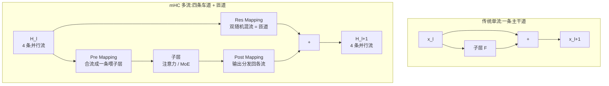

# 残差流(超连接 / mHC / AttnRes)

一句话:**残差连接是 transformer 里十年没人动过的部件,2026 年成了架构新战场**——DeepSeek V4(mHC)与 Kimi K3(AttnRes)先后动手,把「一条残差流」改成「多条并行流 / 可跨层检索的流」,用几个点的额外开销换训练效率的大幅提升。

## 一、复习:残差连接为什么救了深度学习

ResNet 的原始形式,每层只学「增量」:

$$
x_{l+1} = x_l + F(x_l)
$$

两个关键性质:

- **恒等通路**:就算子层什么都没学到($F \approx 0$),输入也能原样通过。网络堆得再深,「最差情况」也只是退化成浅网络,不会更糟;
- **梯度直达**:把递推展开,任意深层状态 $x_L$ 就是浅层 $x_l$ 加一串增量:

$$
x_L = x_l + \sum_{i=l}^{L-1} F_i(x_i)
\qquad\Rightarrow\qquad
\frac{\partial \mathcal{L}}{\partial x_l} = \frac{\partial \mathcal{L}}{\partial x_L}\left( I + \frac{\partial}{\partial x_l}\sum_{i=l}^{L-1} F_i(x_i) \right)
$$

括号里的恒等项 $I$ 意味着梯度有一条**不经过任何权重矩阵的直达电梯**,从最后一层直通任意浅层——深网络的梯度消失被结构性地解决,这就是残差连接统治深度学习十年的原因。

### residual stream 视角

可解释性研究把这条贯穿全部层的通路叫 **residual stream(残差流)**:一条 $d$ 维的「信息高速公路」,每个子层(注意力 / FFN)都从上面**读取**信息、算完再把结果**写回**。层与层不直接对话,全靠这条共享通道中转。

> 类比:残差流是一块所有层共用的公告板。注意力层看一眼板上内容、写几条新信息;FFN 再看一眼、又写几条。板的面积($d$ 维)是固定的。

## 二、单流的瓶颈:所有层挤一条道

公告板面积固定,问题就来了——几十上百个子层的读写全部挤在**同一个 $d$ 维向量**里:

- 各层要传递的信息共享同一份「带宽」,互相挤占、互相**覆盖**;
- 浅层写入的特征会被后面几十层的更新逐渐冲淡,想把信息跨很多层送到深处,只能「一路带着走」;
- 直接加宽 $d$ 能缓解,但参数量与主计算随 $d^2$ 增长,太贵。

用手册的话说:传统 transformer 的残差是「一条单线」——**一条主干道,所有信息挤在上面**。2026 年的新战场,就是把这条主干道拓开。

## 三、Hyper-Connections(超连接):一条道拓成 n 条

超连接(HC)的做法:把单条残差流展开成 **$n$ 条并行流**,并在流之间加**可学习的映射**。隐状态从 $x_l \in \mathbb{R}^{d}$ 变成 $H_l \in \mathbb{R}^{n \times d}$,一个层的计算示意:

$$
H_{l+1} = A_l^{\mathrm{res}}\, H_l + b_l\, F\!\big(a_l^{\top} H_l\big),
\qquad H_l \in \mathbb{R}^{n \times d}
$$

三个映射各司其职(名字沿用 mHC 论文的叫法):

| 映射 | 形状 | 干什么 |
|---|---|---|
| **Pre Mapping**($a_l$) | $\mathbb{R}^{n}$ | 把 n 条流**加权合并**成一个正常宽度的向量喂给注意力 / MoE(子层本身完全不用改) |
| **Post Mapping**($b_l$) | $\mathbb{R}^{n}$ | 把子层输出**分发**回 n 条流,各流分多少可学习 |
| **Res Mapping**($A_l^{\mathrm{res}}$) | $\mathbb{R}^{n \times n}$ | n 条流之间**跨层互相混合**再传给下一层 |

取 $n=1$、三个映射全为 1,就退回普通残差——所以这是残差连接的严格推广。映射既可以是静态参数,也可以由输入动态生成(原论文两版都做了)。

> **类比(手册版)**:原来是一条主干道,所有信息挤在上面;现在是四条并行车道,中间有匝道互通。子层像高速服务区:进服务区前四条车道并成一条(Pre),出来再分流回四条(Post),车道之间还能随时变道(Res 就是匝道)。

HC 原论文的两个关键数字:

- **收益**:达到基线性能只需**大约一半的训练 token**(原论文自报口径);
- **代价**:7B OLMo MoE 上 FLOPs 仅从 **13.36G 涨到 13.38G**,几乎不变——额外的映射都发生在很小的「流数量」维度 $n$ 上,和 $d^2$ 级别的主计算比可以忽略。

## 四、mHC:给匝道装上稳定器(DeepSeek V4)

HC 直接放大训练会出问题:**原版 Res Mapping 是自由学习的矩阵**,几十层堆下去等于几十个任意矩阵连乘,信号会被**不可预测地放大或缩小**——恰恰破坏了残差连接当初「恒等通路」的稳定性承诺。

mHC(Manifold-Constrained Hyper-Connections,流形约束超连接)的修法:把 $A^{\mathrm{res}}$ **投影到双随机矩阵流形**上:

$$
A_{ij} \ge 0,
\qquad \sum_{j=1}^{n} A_{ij} = 1,
\qquad \sum_{i=1}^{n} A_{ij} = 1
$$

- **元素非负 + 每行和为 1**:每条新流都是旧流的**加权平均**(凸组合),不会放大;
- **每列和为 1**:每条旧流的信号「总量」恰好全部分完,不会凭空丢失或翻倍;
- 数学直觉:双随机矩阵是置换矩阵的加权平均(Birkhoff 定理),本质上是一次「**软洗牌**」。

于是残差混合从「可能爆炸的任意线性变换」变成了「**稳定的信息再分配**」——车流只在车道间重新分布,总量守恒,不造车也不销车。

**成本**:DeepSeek 优化实现后,27B 模型上 $n=4$ 只增加 **6.7%** 训练时间;V4 全系(Flash 284B / Pro 1.6T)正式采用 $n=4$ 的 mHC。

**Raschka 的质疑(必须记住)**:只看 FLOPs 太简单了。残差状态加宽到 n 倍后仍然要**存储、搬运、混合**——真实开销可能更多来自**内存带宽与实现复杂度**,而不是浮点运算数,**这一点论文没有测**。「FLOPs 几乎不变」不等于「免费」。

## 五、AttnRes(Kimi K3):不拓宽,改成按需检索

Kimi K3 的 Attention Residuals 是另一条改法,官方描述为残差连接的 **drop-in 替代**:不再把每层输出均匀地逐层累加进一条流,而是**跨深度有选择地检索表示**——需要哪一层的信息,就回头去取哪一层的。

> 类比:单流残差是「所有货一路带着走」;AttnRes 是「沿途各层设仓库,要用什么回头去取」。

自报数字:**2% 的额外计算换 25% 的训练效率**。但要如实说明:**技术报告尚未完整发布,机制细节待补**——上述数字目前只有 Kimi 单方面口径,无法独立核验。

## 六、图解:单流 vs 四流加匝道

## 七、细节与常见坑

- **与 Norm 位置的纠缠**:HC 原论文的出发点之一就是 Pre-Norm / Post-Norm 的两难——Pre-Norm 梯度稳但深层容易表示塌缩(各层输出趋同),Post-Norm 表达力强但梯度易消失,单流残差在两端之间跷跷板。多流 + 可学习混合相当于让每层自己学「恒等与变换的配比」,试图同时缓解两端。Norm 位置本身的演化史见「Norm位置」篇。
- **推理与工程适配成本**:现成推理引擎的计算图都假设单流残差,多流意味着激活显存约乘 n、算子融合与并行切分都要改;好在子层看到的仍是合流后的正常宽度向量,**KV cache 大小不受影响**。Raschka 的内存带宽质疑在推理侧同样成立。
- **小模型验证 → 旗舰采用的标准路径**:HC 原论文在 7B 级模型上验证(2024-09)→ mHC 论文在 27B 上实验(2025-12)→ DeepSeek V4 旗舰 1.6T 采用(2026-04)。手册总结的规律:激进架构总是先在中小模型攒证据,6–12 个月后进旗舰。
- **收益归因要小心**:V4 的端到端提升里混着更好的数据、Muon 优化器、CSA/HCA 注意力与 mHC,技术报告**没有单独消融**。被问「mHC 带来多少提升」时,严谨的答案是引用 HC/mHC 论文自身的对照数字(如约一半训练 token 达基线),而不是把 V4 的整体进步都归给残差流;AttnRes 的 2% 换 25% 同理,报告未发布前存疑。

## 八、面试考点串联

1. 残差连接为什么有效 →「一」:恒等通路 + 梯度公式里的 $I$ 项,答出「结构性保证」
2. 什么是 residual stream、单流瓶颈在哪 →「一、二」:所有层读写共享同一 $d$ 维带宽,信息互相覆盖
3. HC 把残差改成了什么、FLOPs 为什么几乎不变 →「三」:n 条流 + 三个小映射,额外计算在 $n$ 维不在 $d$ 维
4. mHC 的流形约束为什么必要、双随机保证了什么 →「四」:自由矩阵多层连乘会爆炸;行/列和为 1 = 加权平均 + 总量守恒的信息再分配
5. 只看 FLOPs 评估新架构错在哪 →「四」:Raschka 质疑——存储/搬运/混合是内存带宽开销,FLOPs 反映不了
6. 多流残差的收益怎么归因 →「七」:端到端对比 ≠ 消融,分清论文对照数字与旗舰整体提升
7. mHC 与 AttnRes 的思路差异 →「四、五」:拓宽并行流做稳定再分配 vs 单流上跨深度选择性检索

## 相关文献

- ResNet(残差连接起点)— [arXiv:1512.03385](https://arxiv.org/abs/1512.03385)
- Hyper-Connections — [arXiv:2409.19606](https://arxiv.org/abs/2409.19606)
- mHC: Manifold-Constrained Hyper-Connections — [arXiv:2512.24880](https://arxiv.org/abs/2512.24880)
- Kimi K3(AttnRes,技术报告随权重发布)— https://www.kimi.com/blog/kimi-k3
