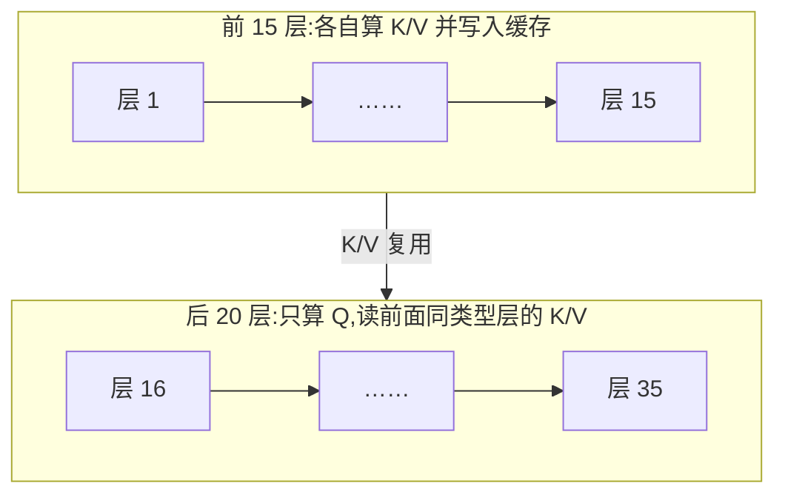

# 注意力配件(QK-Norm / 门控 / Sink / 跨层共享)

> ⚠️ 旧版:本篇写于写作契约确立之前,尚未按新标准审查重写。标准见 docs/04-知识库写作契约.md,样板见「GPU架构与执行模型」。

一句话:**一批不改变注意力复杂度、但几乎每家都在调的"周边件"**——它们不决定你走 GQA 还是 MLA 路线,却决定训练稳不稳、显存省不省。类比装机:CPU 和显卡(注意力主体结构)选完之后,散热、电源、机箱风道(本篇这些配件)才是日常翻车与省钱的细节战场。

主体结构的选型(GQA/MLA/滑窗/线性/混合)见「架构总览」与各单篇;本篇只讲挂在注意力上的五类小件:QK-Norm(及其变体 QK-Clip)、输出门控、attention sink、跨层 KV 共享、逐层注意力预算。每件按"是什么 / 为什么 / 谁在用"展开。

## 一、QK-Norm:算分前先"只比方向,不比嗓门"

**是什么**:在算注意力分数之前,对 Q 和 K 各做一次 RMSNorm(逐头做,带可学习缩放),再点积:

$$
\mathrm{score}_{ij} = \frac{\mathrm{RMSNorm}(q_i)\cdot \mathrm{RMSNorm}(k_j)}{\sqrt{d_k}}
$$

**为什么**:点积 = 模长 × 模长 × 夹角余弦。训练中 Q/K 的模长若悄悄变大,logits 会平方级放大,softmax 进入饱和区——某个 token 拿走几乎全部权重,梯度要么消失要么尖峰,宏观表现就是 loss spike。RMSNorm 把模长统一,点积只剩"方向合不合"(天然有界),相当于辩论评分只看论点对不对题、不看谁嗓门大。额外开销只是两次向量归一化,性价比极高。

**谁在用**:接近标配。OLMo 2、Qwen3、GLM、Gemma 3/4、MiniMax、Laguna 都用。

注意别与残差流上的 Pre/Post-Norm 混淆——那是"块与块之间"的归一化(见「Norm位置」篇);QK-Norm 是注意力**内部**、逐头对 Q/K 做的,两者解决的问题不同、可以同时存在。

**同题异解:QK-Clip**。Kimi 不在前向里加 norm,而是训练中监控每个头的注意力 logit 最大值,超过阈值就按比例把 $W_q$、$W_k$ 缩回去——事后裁剪,不改前向结构。它与 Muon 优化器打包成 **MuonClip**,Kimi K2 靠它在 15.5T token 的预训练里全程无 loss spike。展开见「优化器」篇。

## 二、Gated Attention:读出口加一道阀门

**是什么**:在注意力输出后面加一个逐头的 sigmoid 门控,门的输入通常是本 token 的 hidden state:

$$
o_h = \sigma(x W_{g,h}) \odot \mathrm{Attn}_h(x)
$$

**为什么帮助**:softmax 权重恒和为 1,每个头**必须**从上下文里"读点什么"回来——哪怕当前上下文对它毫无用处,读回的噪声也会直接汇入残差流。门控给了第二次机会:"读了,但可以不用"。类比:每个头是检索员,门控是主编——检索员必须交材料,主编可以把整份扣下不进终稿。论文还报告了两个附赠效果:门控引入的非线性与稀疏性让训练更稳(loss spike 减少);且能明显消除 attention sink 现象(见下一节)——头不再需要拿开头 token 当垃圾桶,因为读出口就能拦住。

**谁在用**:Qwen3-Next 首用(用在其混合架构的 softmax 注意力层),Arcee Trinity、Laguna 跟进;Kimi K3 的"门控 MLA"是同一思路挂到 MLA 上。

## 三、Attention Sink 与 attention bias:官方发一个垃圾桶

**现象**(StreamingLLM 的观察):训好的 LLM 里,大量注意力头把很大一部分权重砸在**开头几个 token** 上,哪怕那只是 `<bos>` 或没什么语义的词;而流式推理时若把这些初始 token 从 KV cache 里挤掉,困惑度立刻爆炸。开头 token 成了"注意力汇聚点"(attention sink)。

**为什么会这样**:还是 softmax 和为 1 的锅——头在"什么都不想看"时,权重总得有处安放;初始 token 对所有位置可见、出现最稳定,自然被学成了默认倾倒场。这是模型自发形成的行为,不是设计出来的。

> 🖼️ 占位:StreamingLLM 论文的逐层注意力热力图——除最前面两层外,大量注意力集中在开头几个 token

**工程含义一(不改模型)**:StreamingLLM 的做法——滑动窗口推理时永远保留开头约 4 个 token 的 KV 当"锚",无限长流式生成就不崩。

**工程含义二(改模型,GPT-OSS 的做法)**:既然模型总要垃圾桶,不如官方发一个。给每个头加一个**可学习的 sink logit**(一种 attention bias),直接进 softmax 分母:

$$
p_{ij} = \frac{\exp(z_{ij})}{\exp(s_h) + \sum_{j'} \exp(z_{ij'})}
$$

真实 token 的权重和从此可以小于 1:"没处安放的注意力"流向这个不指向任何真实 token 的虚拟位置,不必摊到无关 token 上污染读出。GPT-OSS 全系(20B/120B)配合交替滑窗/全局层使用。

**谁在用**:GPT-OSS(显式 sink + bias);StreamingLLM 式"保留初始 token"则是推理侧通用技巧。sink 在滑动窗口/长上下文场景里尤其要紧——窗口一滑最先丢的就是开头 token,滑窗主体设计见「SWA」与「Hybrid注意力」篇。

## 四、跨层 KV 共享(CLA):后层抄前层的笔记

**是什么**:Cross-Layer Attention——前面的层正常计算并缓存 K/V,后面的层**不再自己算 K/V**,直接复用前层缓存,自己只算 Q。类比:K/V 是课堂笔记,Q 是脑子里的问题;后排同学不记笔记,带着自己的问题去翻前排的笔记。

**规则**:同类型层才共享——滑动窗口层复用前面的滑动窗口层,全局层复用前面的全局层。两类层的 K/V 覆盖范围不同(窗口内 vs 全序列)、位置编码处理也常不同,混用会串味。

**谁在用、省多少**(Gemma 4 端侧系列,数字来自架构手册 2.9):

- E2B:35 层里只有前 15 层算自己的 KV,**后 20 层复用**;128k 上下文下省 **2.7 GB**
- E4B:42 层里 24 层自算、18 层复用;128k 下省约 **6 GB**

两款都省掉约一半 KV cache——对手机/端侧部署是决定性的数字。

**代价与限定**:这是一种近似,复用层失去了"为本层定制 K/V"的自由度,**降低了模型容量**。原论文的报告是"在小模型上影响很小"——注意「小模型上」这个限定;大模型上的代价没有同等证据,Gemma 4 也只在 E2B/E4B 这两个端侧小模型上用它。

## 五、逐层注意力预算:把钱花在便宜的地方

**是什么**:传统做法每层的注意力头数相同。Laguna XS.2 在 config 里加了 `num_attention_heads_per_layer`——**每层可以有不同的 query 头数**,同时保持 KV 形状兼容。

**反直觉的分配**:给便宜的滑动窗口层**更多** query 头(8 个 query 配 1 个 KV),给贵的全局层**更少**(6 配 1)。直觉上不该加强更重要的全局层吗?它的逻辑反过来:全局层每个头都要扫整个上下文,本来就贵,多一个头的边际成本高;滑窗层每头只看 512 个 token,便宜,多给几个头几乎不花钱。同样的预算,在便宜的线路上多开班次,总运力反而更高。

**溯源**:"逐层非均匀预算"的思路可以追溯到 Apple 2024 年的 OpenELM——它按深度逐层缩放注意力头数与 FFN 宽度(layer-wise scaling),Laguna 把这个思路带回了 2026 年的滑窗/全局混合架构。

## 六、汇总表

| 配件 | 解决什么问题 | 机制一句话 | 代表模型 |
|---|---|---|---|
| QK-Norm | 注意力 logits 爆炸 → loss spike | 算分前对 Q、K 各做 RMSNorm | OLMo 2、Qwen3、GLM、Gemma 3/4、MiniMax、Laguna(近标配) |
| QK-Clip | 同上(不改前向结构) | 监控 logit,超阈值就缩 Q/K 权重;配 Muon 成 MuonClip | Kimi K2 |
| 输出门控 | 头被迫读回无关内容 | 逐头 sigmoid 门,"读了可以不用" | Qwen3-Next、Arcee Trinity、Laguna、Kimi K3(门控 MLA) |
| Attention sink + bias | 无处安放的注意力污染真实 token | 可学习 sink logit 进 softmax 分母 | GPT-OSS |
| 跨层 KV 共享(CLA) | KV cache 显存 | 后层只算 Q,复用前层同类型层的 K/V | Gemma 4 E2B/E4B |
| 逐层注意力预算 | 均匀分头浪费算力 | 便宜的滑窗层多给 query 头,贵的全局层少给 | Laguna XS.2(溯源 OpenELM) |

一个共同主题:前四行治**稳定性**(都在跟 softmax 的两个脾气搏斗——饱和、以及"权重和恒为 1"),后两行治**显存与算力分配**。

## 七、面试考点串联

1. **QK-Norm 为什么有效?** → 点积随模长平方级增长 → softmax 饱和 → 梯度病态;归一化砍掉模长自由度,logits 有界(§一)
2. **QK-Norm 和 QK-Clip 什么关系?** → 同一问题的事前预防 vs 事后裁剪;QK-Clip 不改前向结构,与 Muon 绑定为 MuonClip(§一,详见「优化器」篇)
3. **attention sink 现象是什么?为什么删掉开头 token 模型会崩?** → softmax 和为 1 逼出来的默认倾倒场;流式推理必须保留 sink token,或像 GPT-OSS 用可学习 bias 官方供桶(§三)
4. **门控注意力为什么帮助?** → 打破"必须读点什么",过滤无关读出;顺带消 sink、减 loss spike(§二)
5. **CLA 与 GQA/MLA 是什么关系?** → 正交。KV cache ≈ 层数 × KV 头数 × 每头表示大小 × 序列长:GQA 砍"头数"轴,MLA 压"每头表示"轴,CLA 砍"层数"轴,滑窗/线性砍"序列长"轴——不同轴可叠加(Gemma 4 的 CLA+滑窗、Kimi 的门控 MLA 都是叠加案例)(§四,另见「GQA」「MLA」篇)
6. **逐层预算为什么给全局层更少的头?** → 边际成本思维:预算固定时,把 query 头加在便宜的滑窗层收益更高(§五)
7. **GPT-OSS 的 sink 和 StreamingLLM 的 sink 是一回事吗?** → 一个是训练时就内置的可学习虚拟位置(设计),一个是对既成现象的推理期保护(补救);现象同源,层次不同(§三)

## 相关文献

- Gated Attention(输出门控:非线性、稀疏性、消 sink)— [arXiv:2505.06708](https://arxiv.org/abs/2505.06708)
- StreamingLLM(attention sink 现象与流式推理)— [arXiv:2309.17453](https://arxiv.org/abs/2309.17453)
- Cross-Layer Attention(跨层 KV 共享)— [arXiv:2405.12981](https://arxiv.org/abs/2405.12981)
- Kimi K2 技术报告(MuonClip / QK-Clip)— [arXiv:2507.20534](https://arxiv.org/abs/2507.20534)
- OpenELM(逐层非均匀预算的溯源)— [arXiv:2404.14619](https://arxiv.org/abs/2404.14619)
