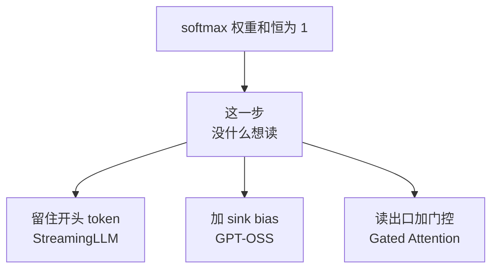

# 注意力配件(QK-Norm / 门控 / Sink / 跨层共享)

> 🔴 重点考点:本篇是当前复习重点,文末「面试考点串联」给出问法对照。

一句话:**五件不改变注意力复杂度、却几乎每家都在调的「周边件」**——它们不决定你走 GQA 还是 MLA 路线,却决定这条路线**训练稳不稳、缓存还能不能再省一刀**。

> **类比**:装机。CPU 和显卡(注意力的主体结构)决定这台机器的档次;散热、电源、机箱风道(本篇这五件)一分档次都不加,却决定它会不会跑着跑着蓝屏、以及电费单有多厚。

主体结构怎么选,见 KV共享注意力 篇(砍 KV 头数)、MLA 篇(压每头维度)、SWA 篇(砍序列长度)、线性注意力 篇(换掉 softmax);注意力公式本身、$\sqrt{d_k}$ 的方差推导、多头与掩码,见 注意力基础 篇。**本篇只讲挂在注意力上的五个小件**,每件按「治什么病 / 怎么治 / 代价 / 谁在用」展开。

## 一、QK-Norm:算分前只比方向,不比嗓门

### 先说病:注意力 logits 是怎么爆的

$\sqrt{d_k}$ 那个缩放是**一次性的静态修正**:它假设 Q、K 的每一维均值 0、方差 1 且互相独立,于是点积方差恰好是 $d_k$,除以 $\sqrt{d_k}$ 就把分数压回 1 附近。

**问题是这个假设只在初始化那一刻成立。** 训练一开,$W_Q$、$W_K$ 的范数会一路往上漂,而且损失里没有任何一项拦着它——恰恰相反,把 Q、K 拉长会让 softmax 更尖锐、对已经答对的位置更自信,短期内是真能降 loss 的,**这是一个正反馈**。

点积 = 模长 × 模长 × 夹角余弦,是**两个都在涨的量相乘**:Q、K 的范数各翻一倍,logit 就翻四倍。$\sqrt{d_k}$ 是个写死的常数,拦不住。

后果分两级:先是 **softmax 饱和**——权重逼近 one-hot、熵接近 0,穿过 softmax 的梯度几乎全是 0,这个头从此调不动了;再往上就是**数值溢出**,bf16/fp16 下 $\exp$ 的输入再大一点就成 `inf`,宏观表现就是训练曲线上那根 **loss spike**。

ViT-22B 是最早把这条链路写清楚的公开证据:模型放大到 **80 亿参数**量级时,训练几千步就发散,病因被明确归到「极大的 attention logits 导致几乎 one-hot、熵接近零的注意力权重」。

### 药:把范数直接钉住

QK-Norm 一句话说完:**算分之前,对 Q 和 K 各做一次归一化(现代实现是逐头 RMSNorm,带一个可学习增益),再点积**。

$$
\mathrm{score}_{ij} = \frac{\mathrm{Norm}(q_i)\cdot \mathrm{Norm}(k_j)}{\sqrt{d_k}}
$$

这个式子说的是:进点积的两个向量长度被强行统一,**点积只剩下「方向合不合」这一个自由度**——相当于辩论赛评分只看论点是否对题,不看谁嗓门大。

有多硬?RMSNorm 让每一维的均方根为 1,增益取 1 时归一化后向量的模长恒为 $\sqrt{d_k}$。两个这样的向量点积最大是 $d_k$,再除以 $\sqrt{d_k}$,**logit 被硬顶在 $\pm\sqrt{d_k}$**——$d_k = 128$ 时约 $\pm 11.3$,而且这是几何上限,不是统计期望。可学习增益是一个受权重衰减管着的小向量,不像投影矩阵那样能无限漂,所以这个上限基本靠得住。代价只有两次向量归一化,相对一次完整注意力可以忽略。

### 它和 $\sqrt{d_k}$ 是替代还是叠加

**要看你说的是哪一版**,只答一个字都可能被反问:

| | 原始 QKNorm 论文(2020) | 今天大模型里的 QK-Norm |
|---|---|---|
| 归一化方式 | 对 Q、K 做 $\ell_2$ 归一化 | 逐头 RMSNorm / LayerNorm,带可学习增益 |
| 点积变成了什么 | 严格的**余弦相似度**(所以也叫余弦注意力) | 模长被钉在 $\sqrt{d_k}$,近似只比方向 |
| 和 $\sqrt{d_k}$ 的关系 | **替代**:用一个可学习的温度取代 $1/\sqrt{d_k}$ | **叠加**:$\sqrt{d_k}$ 照除,QK-Norm 加在它前面 |
| 血脉 | Query-Key Normalization for Transformers | ViT-22B 那一支,被今天的 LLM 全盘继承 |

面试口径:**两者管的根本不是同一件事。$\sqrt{d_k}$ 是「按初始化时的方差假设做的静态补偿」,QK-Norm 是「运行时直接把那个假设变成事实」**。假设成真之后,$\sqrt{d_k}$ 就退化成一个无害的常数,留着还能让训练初期的尺度和老配方对齐——所以现代实现干脆两个都留。

### 同题异解:QK-Clip 不改前向

Kimi 走了另一条路:前向结构一个字不改,**训练中监控每个头的注意力 logit 最大值,超过阈值就按比例把 $W_q$、$W_k$ 缩回去**——事后裁剪,而不是事前约束。它和 Muon 优化器打包成 **MuonClip**,Kimi K2 靠它在 **15.5T token 的预训练里全程零 loss spike**。为什么 Muon 尤其需要它、裁剪怎么和优化器耦合,见 优化器 篇。

### 谁在用

已经接近标配,而且几乎总是和 GQA 一起出现:**Qwen3、GLM-4.5、MiniMax M2 都是「GQA + QK-Norm」**;Gemma 4 的架构描述是「pre-norm 与 post-norm 都用 RMSNorm,外加 QKNorm」;OLMo 2 把它列为主要的稳定性改动之一。别和残差流上的 Pre/Post-Norm 混淆:那是**块与块之间**的归一化(见 Norm位置 篇),QK-Norm 是注意力**内部**、逐头对 Q/K 做的,两者治的病不同、必然同时存在。

## 二、Gated Attention:给读出口装一道阀门

**是什么**:注意力算完之后、汇入残差流之前,加一道**逐头的 sigmoid 门**,门的输入是当前 token 的 hidden state。

$$
o_h = \sigma(x W_{g,h}) \odot \mathrm{Attn}_h(x)
$$

这个式子说的是:每个头的输出先被一个 0 到 1 的系数逐元素缩放一遍,门开到 0 就等于**这个头这一步什么都没读**。

**为什么有用**:softmax 权重恒和为 1,每个头**必须**从上下文里读点什么回来——哪怕这一步的上下文对它毫无用处,读回的噪声也会原封不动汇进残差流。**注意力自己没有「弃权」这个选项。** 门控给了第二次机会:检索员必须交材料,但主编可以把整份扣下、不进终稿。

论文报告的三个附赠效果值得记:门控带来的**非线性与稀疏性**让训练更稳、能吃更大的学习率;它**明显消除了 attention sink 现象**(见下一节);长上下文外推也更好。这些结论是在 30 个 15B MoE 与 1.7B dense 变体、3.5T token 上做出来的,规模够。

**代价**:多一组门控投影和一次逐元素乘,参数与算力都很便宜;真正的代价是**它必须在预训练时就装上**——门控改变了模型函数,不能给训好的模型事后加一个。

**谁在用**:Qwen3-Next 首用(用在其混合架构的 softmax 注意力层),Arcee Trinity、Laguna XS.2 跟进;**Kimi Linear / K3 的「门控 MLA」是同一个部件挂到 MLA 的读出口上**——门控和你用哪种 KV 组织方式完全正交(见 MLA 篇、线性注意力 篇)。

## 三、Attention Sink:softmax 那 1 份配额必须花掉

### 现象与根因

训好的 LLM 里,大量注意力头把很大一部分权重砸在**开头几个 token** 上,哪怕那只是 `<bos>` 或一个毫无语义的词。这不是设计出来的,是**学出来的**。

根因和上一节同源:**softmax 逐行归一化,权重和恒为 1**。一个头在「这一步没什么想读」时,那 1 份配额没有地方退回去,只能找个位置倒掉。开头的 token 对所有位置都可见、在所有样本里都出现、语义又最无关——**天生就是最合适的垃圾桶**,于是被学成了默认倾倒场。

> 🖼️ 占位:StreamingLLM 论文的逐层注意力热力图——除最前面两层外,大量注意力集中在开头几个 token

流式生成时这个垃圾桶会被误伤:滑动窗口一滑,最先被挤出缓存的正是开头那几个 token,配额被迫摊到真正的内容 token 上,分布当场变形。「滑窗 + 流式必须配 sink」这条结论和它的困惑度数字归 SWA 篇,本篇只管 sink 这个部件本身。

### 三条路,同一个根因

**路一:推理期保留 sink token(不改模型)**。StreamingLLM 的做法——滑动窗口之外,永久保留最开头的几个 token 的 K/V 当锚,模型自己长出来的那个垃圾桶就一直在,无限长流式生成不崩。这是**对既成现象的补救**,拿现成权重就能用。

**路二:训练期发一个官方垃圾桶(改模型)**。既然模型总要找地方倒,不如直接给每个头一个**可学习的 sink bias**,塞进 softmax 的分母。

$$
p_{ij} = \frac{\exp(z_{ij})}{\exp(s_h) + \sum_{j'} \exp(z_{ij'})}
$$

这个式子说的是:分母里多了一个不指向任何真实 token 的虚拟项 $\exp(s_h)$,于是**真实 token 的权重之和可以小于 1**——「没处安放的注意力」流向这个虚拟位置,不必摊到无关 token 上污染读出。GPT-OSS 的模型卡写得很直白:每个注意力头在 softmax 分母里有一个可学习偏置,**让注意力机制可以谁都不看**。它全系(20B/120B)配合 128 窗口的交替滑窗/全局层使用。

**路三:门控**,即上一节那道阀门——它不改 softmax,改的是读出之后进不进残差流。

工程上还有一条要记:**sink bias 是模型权重的一部分,必须由注意力 kernel 在算 softmax 时多加这一项**,没法在外面改 mask 模拟出来。vLLM 与 SGLang 都为此在各自的注意力后端里把 sink 项透传到了 kernel;换引擎或换后端前要先确认这条链路支持。

### 门控和 sink,是不是同一个问题

**根因是同一个,下刀的位置不同**——这是本节最容易被追问的一处:

| | sink bias | 输出门控 |
|---|---|---|
| 改在哪 | softmax **内部**(多一个分母项) | 注意力**外部**(读出之后) |
| 权重和还是 1 吗 | 真实 token 的和可以 < 1 | 仍然是 1,照读不误 |
| 怎么表达「不读」 | 配额全给虚拟位置 | 读回来了,但门关掉、不进残差流 |
| 能否事后加 | 否,要重训 | 否,要重训 |

StreamingLLM 两边都不属于:**它不改模型,只是保住模型自己长出来的那个桶**。而经验上门控和 sink bias **互为替代**:训练时上了门控的模型,注意力图里的 sink 基本消失,因为头有了正当的弃权渠道,不再需要自己造垃圾桶。所以别把它们并列成「两种优化」,准确说法是**同一个 softmax 约束逼出来的两种解法**。

## 四、跨层 KV 共享(CLA):后层抄前层的笔记

### 它砍的是公式里的层数 $L$

$$
\text{KV bytes} = 2 \times B \times \underbrace{L}_{\text{跨层共享}} \times \underbrace{S}_{\text{SWA}} \times \underbrace{n_{kv}}_{\text{GQA}} \times \underbrace{d_h}_{\text{MLA}} \times \underbrace{b}_{\text{量化}}
$$

这个式子说的是:KV cache 是五个因子连乘,**每条路线各砍一个因子,互不冲突、可以叠着用**。CLA(Cross-Layer Attention)动的是层数——前面的层照常算 K/V 并写缓存,**后面的层不再自己算 K/V,直接复用前层的缓存,自己只算 Q**。

> **类比**:K/V 是课堂笔记,Q 是脑子里的问题。后排同学不记笔记,带着自己的问题去翻前排的本子。**问题还是自己的,笔记省了。**

CLA 原论文的定位很清楚:它是**架在 MQA 之上的又一刀**——在 MQA 的基础上再省一半 KV cache,精度几乎不变,让同样显存下能开更长的序列和更大的批量。

### 为什么只能同类型层之间共享

在局部/全局混合模型里,滑窗层的缓存是**被截断过的**——窗口外的 K/V 早就回收了(见 SWA 篇)。于是:

- 全局层去复用滑窗层的缓存,**窗口之外根本没东西可读**,全局层直接废掉;
- 滑窗层去复用全局层的缓存,读是能读,但那份缓存仍随长度线性涨,**省下的显存又吐回去了**。

结论:**滑窗层复用滑窗层,全局层复用全局层**,这是机制上的硬约束,不是谁的口味偏好。两类层的位置编码处理通常也不同(局部层完整 RoPE、全局层 partial RoPE 或 NoPE,见 RoPE 篇),混用还会串味。

### Gemma 4 的数字,以及它没说的部分

Gemma 4 的两个端侧型号用了跨层 KV 共享,技术报告给出的**唯一**数字是共享比例:**E2B 是 20/35,E4B 是 18/42**。

必须诚实标注:**报告没有定义这两个分数的分子分母各代表什么,也没有给共享拓扑**(是复用相邻层,还是全体复用某一层)。最自然的读法是「35 层里有 20 层复用了别层的缓存」,但这是推测。报告同样没有单独给出这一项的显存节省——它公开的「全局 KV cache 最多降 37.5%」是 p-RoPE、跨层共享、以及「全局层里 value 直接用 key」三件事**合起来**的效果,拆不开。

顺带一提那第三件:**Gemma 4 在较大的型号上让全局层的 value 等于 key**,每个全局层少存一份 V;而 E2B/E4B 不用这招,改用跨层共享。同一个目标(砍全局层缓存)的两把不同的刀,一个模型族里按尺寸分别下注。

### 代价

**这是一种近似,复用层失去了「为本层定制 K/V」的自由度,直接削的是模型容量。** 原论文报告「小模型上影响很小」——注意「小模型上」这个限定:它的实验是 1B 与 3B 从头训练,**大模型上的代价没有同等强度的公开证据**。Gemma 4 也只在两个端侧小模型上用它,更大的型号选了别的刀。这个证据强度差,是本节最该记住的东西。

## 五、逐层注意力预算:把钱花在便宜的地方

传统做法是每层给一样的注意力配置。**逐层预算**的意思是:层与层之间可以有不同的 query 头数、不同的窗口、不同的局部/全局角色,**只要 KV 的形状保持兼容**(所以缓存管理不用改)。

Laguna XS.2 是最干净的公开例子:40 层里 30 层滑窗、10 层全局,两类层都用 8 个 KV 头、头维 128,但 query 头数不同——

| 层类型 | 层数 | query 头数 | 每套 KV 带几个 query | RoPE |
|---|---|---|---|---|
| 滑窗(窗口 512) | 30 | **64** | 8 | 底数 10k,完整旋转 |
| 全局 | 10 | **48** | 6 | 底数 500k,只旋转前 50% 维度 |

**反直觉在这里:更重要的全局层反而拿到更少的头。** 逻辑是边际成本——全局层每个头都要扫整个上下文,本来就贵,多加一个头的边际成本随上下文长度一起涨;滑窗层每个头只看 512 个 token,便宜,多给几个几乎不花钱。**同样的预算,在便宜的线路上多开班次,总运力更高。** 报告说这组配置是在更小的 MoE 代理模型上做消融选出来的,不是拍脑袋。

这个思路可以追溯到 Apple 2024 年的 **OpenELM**:它按深度逐层缩放注意力头数与 FFN 宽度(layer-wise scaling),浅层窄、深层宽。区别在分配依据——OpenELM 按**深度**分,Laguna 按**层的类型**分;后者只在滑窗/全局混合架构里才成立,因为得先有「贵的层」和「便宜的层」之分。

## 六、五件配件汇总

| 配件 | 治什么病 | 机制一句话 | 代表 |
|---|---|---|---|
| QK-Norm | 注意力 logits 爆炸 → loss spike | 算分前对 Q、K 各做一次 RMSNorm,把模长钉死 | Qwen3、GLM-4.5、MiniMax M2、Gemma 4、OLMo 2(近标配) |
| QK-Clip | 同上,但不改前向结构 | 训练中监控 logit 峰值,超阈值就缩 $W_q$、$W_k$ | Kimi K2(与 Muon 打包成 MuonClip) |
| 输出门控 | 头被迫读回无关内容 | 读出口加逐头 sigmoid 门,「读了可以不用」 | Qwen3-Next、Arcee Trinity、Laguna、Kimi 的门控 MLA |
| sink bias | 无处安放的配额污染真实 token | 每头一个可学习 logit 进 softmax 分母 | GPT-OSS(StreamingLLM 是它的推理期补救版) |
| 跨层 KV 共享 | KV cache 公式里的层数因子 | 后层只算 Q,复用前面同类型层的 K/V | Gemma 4 E2B/E4B |
| 逐层预算 | 均匀分头把钱花在贵的层上 | 便宜的滑窗层多给 query 头,贵的全局层少给 | Laguna XS.2(溯源 OpenELM) |

一条贯穿线索:**前四行都在和 softmax 的两个脾气搏斗**——「$\exp$ 会饱和」和「权重和恒为 1」;**后两行都在和 KV cache 那个连乘公式搏斗**。记住这两句,五件配件就串成两组,不用死背。

## 七、面试考点串联

本篇没有直接挂靠的题库真题——注意力公式、$\sqrt{d_k}$、多头、掩码那一批真题全部归 注意力基础 篇。下表因此**全部是补充题**:

| 高频问法(补充题) | 本文哪一节 |
|---|---|
| 大模型训到一半 loss 突然出现尖峰,你先怀疑注意力的哪个部分?怎么治 | 一 |
| QK-Norm 是干什么用的?有了它,$\sqrt{d_k}$ 那一除还要不要留 | 一 |
| 同样是防 logits 爆炸,QK-Norm 和 QK-Clip 差在哪?各自的代价是什么 | 一(优化器侧的耦合见 优化器 篇) |
| 门控注意力在注意力的哪个位置动手?加一道门为什么就能帮上忙 | 二 |
| attention sink 是个什么现象?模型为什么会自己长出来一个 | 三 |
| GPT-OSS 的可学习 sink 和 StreamingLLM 保留开头 token,是一回事吗 | 三 |
| 门控和 sink bias 解决的是同一个问题吗?能不能只留一个 | 三(对照表) |
| KV cache 还能从哪个方向再砍一刀?跨层共享和 GQA、MLA 打不打架 | 四(五因子连乘) |
| 后面的层复用前面的 K/V,为什么不能跨着层类型复用 | 四 |
| 跨层共享的代价是什么?你敢在千亿模型上用它吗 | 四(证据强度) |
| 逐层注意力预算是什么?为什么反倒给全局层更少的 query 头 | 五 |
| 这几件配件里,哪些必须预训练时就装上,哪些能事后加 | 一 + 二 + 三 |

边界说明:注意力本身的数学与实现见 注意力基础 篇;减 KV 头数见 KV共享注意力 篇;低秩压缩 KV 见 MLA 篇;滑窗机制与各家局部/全局比例见 SWA 篇;内容动态稀疏见 稀疏注意力 篇;线性注意力与 SSM 见 线性注意力 篇;位置编码见 RoPE 篇;缓存本身的机制与显存账见 KVCache 篇。

## 相关文献

- Query-Key Normalization for Transformers(QKNorm 原始版:$\ell_2$ 归一化 + 可学习温度)— [arXiv:2010.04245](https://arxiv.org/abs/2010.04245)
- Scaling Vision Transformers to 22 Billion Parameters(ViT-22B:8B 规模上的 logits 爆炸与 QK-Norm 解法)— [arXiv:2302.05442](https://arxiv.org/abs/2302.05442)
- 2 OLMo 2 Furious(QK-Norm 作为主要稳定性改动)— [arXiv:2501.00656](https://arxiv.org/abs/2501.00656)
- Qwen3 Technical Report(GQA + QK-Norm)— [arXiv:2505.09388](https://arxiv.org/abs/2505.09388)
- Kimi K2: Open Agentic Intelligence(MuonClip / QK-Clip,15.5T token 零 loss spike)— [arXiv:2507.20534](https://arxiv.org/abs/2507.20534)
- Gated Attention for Large Language Models: Non-linearity, Sparsity, and Attention-Sink-Free(逐头 sigmoid 门)— [arXiv:2505.06708](https://arxiv.org/abs/2505.06708)
- Efficient Streaming Language Models with Attention Sinks(StreamingLLM:sink 现象与推理期补救)— [arXiv:2309.17453](https://arxiv.org/abs/2309.17453)
- gpt-oss-120b & gpt-oss-20b Model Card(每头一个可学习的 softmax 分母偏置)— [arXiv:2508.10925](https://arxiv.org/abs/2508.10925)
- Reducing Transformer Key-Value Cache Size with Cross-Layer Attention(CLA 提出)— [arXiv:2405.12981](https://arxiv.org/abs/2405.12981)
- Gemma 4 Technical Report(E2B/E4B 的 20/35 与 18/42 共享比例、QKNorm)— [arXiv:2607.02770](https://arxiv.org/abs/2607.02770)
- Do Transformers Need Three Projections? Systematic Study of QKV Variants(全局层「键当值」的出处)— [arXiv:2606.04032](https://arxiv.org/abs/2606.04032)
- Laguna M.1/XS.2 Technical Report(逐层 query 头预算)— [arXiv:2605.27605](https://arxiv.org/abs/2605.27605)
- OpenELM: An Efficient Language Model Family with Open Training and Inference Framework(layer-wise scaling 溯源)— [arXiv:2404.14619](https://arxiv.org/abs/2404.14619)
