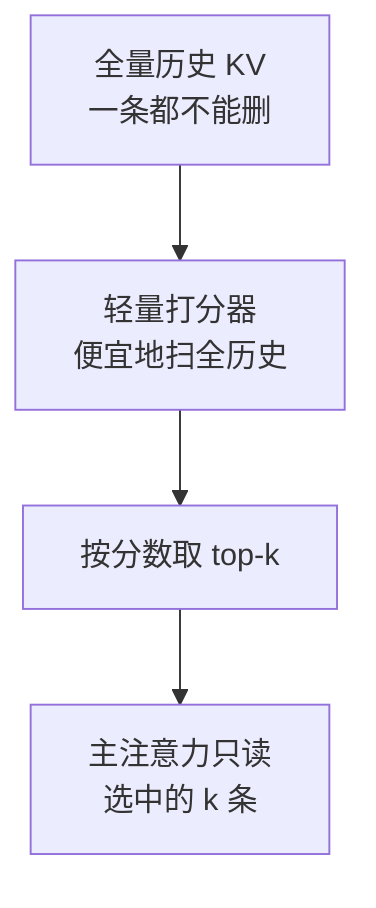

# 稀疏注意力(经典谱系 · NSA · DSA · CSA/HCA)

> 🔴 重点考点:本篇是当前复习重点,文末「面试考点串联」给出问法对照。

一句话:**注意力矩阵里那 $n^2$ 条边,绝大多数本来就没在起作用——稀疏注意力就是提前决定「只算哪几条」**。老一代用固定图案决定(滑窗、跨步、汇总列),新一代用内容当场挑(打分器选 top-k),两代人回答的是同一个问题:边少了,怎么保证该连的那条没被连丢。

> **类比**:全注意力是每写一句都把整本书重读一遍。**经典稀疏**是按固定规矩翻——最近两页 + 每隔十页抽一页 + 每章的摘要页;**现代动态稀疏**是先查索引,再挑最相关的十页精读。索引翻得飞快,精读才花真功夫。

## 一、先把「省法」分成三类,别混着答

标准注意力的开销来自两张 $n \times n$ 的交互:$QK^\top$ 和随后对 $V$ 的加权,单头算术量约 $O(n^2 d)$;训练时若显式保存注意力矩阵,还要 $O(n^2)$ 的中间内存。**这笔账本篇不重新推导**——两项怎么拆、为什么不能写成 $O(n^3)$、序列项到多长才开始主导,见 注意力基础 篇。

被问「有哪些优化方向」时,先把答案分成三类,后面每个方法都能挂进去:

| 类别 | 改的是什么 | 结果还等于标准注意力吗 | 代表 |
|---|---|---|---|
| 精确 IO 优化 | 只改中间矩阵的读写方式 | **是**,只差浮点舍入 | FlashAttention |
| 稀疏:少连边 | 改注意力的**连接图**,不该看的位置直接不算 | 否,等于加了结构假设 | 滑窗、block/strided/fixed、Longformer、BigBird、Reformer、NSA/DSA |
| 换计算形式 | 不动连接图,改**怎么算** | 否,是近似或换建模方式 | 低秩(Linformer)、核化(Performer)、线性注意力 |

四条必须说准的分类澄清,每一条都是高频误答:

- **FlashAttention 既不是稀疏也不是线性。** 它是**精确**算法,平方级 FLOPs 一个都没省,省的是那张大表在 HBM 上来回搬的四趟(见 FlashAttention 篇)。把它答成「把注意力变线性了」是这道题最常见的丢分点。
- **滑动窗口本身就是稀疏注意力的一种**——位置固定的静态稀疏,不是与稀疏并列的另一个类别。知识库把它单开成 SWA 篇只是因为内容多到写不下,不是因为分类上平级。
- **Mamba 是状态空间模型,不该归进 Linear Attention。** 两者在 SSD 对偶下确实能互相翻译,但出身与归类是两回事(见 线性注意力 篇)。
- **Ring Attention 不是稀疏注意力。** 它是把一条长序列切到多卡、沿环传 K/V 分块的分布式序列并行,算出来的仍是完整的全注意力(见 并行策略 篇)。

## 二、经典稀疏谱系:静态模式的时代(2019–2021)

这一批方法的共同做法是:**在训练前就把连接图画死**,谁能看谁与内容无关,只跟位置有关。

| 方法 | 机制 | 复杂度 | 精度代价 | 适用场景 |
|---|---|---|---|---|
| 滑窗 / 局部 | 每个 token 只连最近 $w$ 个 | $O(n w)$ | 长距信息只能逐层接力,每层都是一次有损压缩 | 局部依赖为主的语言建模 |
| 局部 + 全局 token(Longformer) | 少数任务指定的 token(如 `[CLS]`、问句)与全序列**双向**互连,其余走窗口;另有膨胀窗口变体 | 随长度**线性** | 全局点是唯一捷径,信息都要挤过这几个位置 | 有天然锚点的长文档任务(QA、共指) |
| 窗口 + 全局 + 随机(BigBird) | 在上面基础上,每行再随机连 $r$ 个位置 | 随长度**线性** | 随机边靠概率覆盖,单层不保证连到该连的那个 | 长文档编码;论文自报可处理约 8 倍长的序列 |
| block sparse | 以**块**为最小单位决定算或跳过 | 按保留块比例 | 块内全算、块外全丢,边界是断崖 | 任务本身有块结构,且有稀疏 kernel |
| strided sparse(Child 等) | 局部块 + 每隔 $l$ 个位置连一条(周期性的「列」) | $O(n\sqrt{n})$ | 数据没有周期结构时会成片漏看 | **图像**等有规则网格的数据 |
| fixed sparse(Child 等) | 局部块 + 几个**固定**的汇总位置,所有后续 query 都连过去 | $O(n\sqrt{n})$ | 汇总位置成为信息瓶颈 | **文本、音频**等无周期结构的数据 |
| 低秩近似(Linformer) | 不改连接图:把 K、V 沿**序列维**投影到 $k \ll n$ 维再做注意力 | $O(nk)$ | 秩不够就丢复杂依赖;投影长度固定,做因果/变长很别扭 | 定长编码器任务 |
| 核化线性(Performer) | 用随机特征近似 softmax 核,再靠结合律换乘法顺序 | $O(n d^2)$ | 只对特定核形式成立,方差与低精度数值都要实测 | 明确允许近似的场景 |
| LSH 分桶(Reformer) | 局部敏感哈希把相近的 q/k 扔进同一个桶,只在桶内算 | $O(n \log n)$ | 哈希碰撞造成召回误差,要多轮哈希补;分桶本身有开销 | 注意力天然极度稀疏时 |

**表格最后三行要单独说一句**:低秩、核化、LSH 常和稀疏一起被问,但它们改的不是连接图——Linformer 和 Performer 是换计算形式,Reformer 是用哈希**动态生成**连接图,已经不属于「静态模式」。真正的静态稀疏只有前六行。

> 🖼️ 占位:五种经典 mask 图案的并排对比(滑窗 / 膨胀窗口 / 局部+全局 / strided / fixed),行是 query、列是 key

### strided 与 fixed:同一篇论文里的两种连接模式

Sparse Transformer 的做法是把一次全连接**拆成两跳**:任意两个位置不必直连,只要能经一个中转点连上就行,于是复杂度从 $O(n^2)$ 掉到 $O(n\sqrt{n})$。两种模式的差别就在第二跳怎么连:

- **strided(跨步)**:把序列想象成宽度为 $l$ 的矩阵。第一跳走「行」——看同一行内最近的 $l$ 个位置;第二跳走「列」——看每隔 $l$ 个位置的那一条。中转点是**随 query 位置一起滑动**的。
- **fixed(固定)**:第一跳同样是局部块,但第二跳不再滑动,而是连到**每个块末尾的固定几个位置**。这些位置相当于该块选出来的「代表」,所有后来的 query 都往它们身上连。

**为什么要分两种?因为周期性假设成不成立。** 图像天生有周期:把 stride 取成图像宽度,「列」正好落在上一行的同一像素位置,是有意义的邻居。文本没有这种周期,滑动的列扫到的是一串随位置漂移、彼此无关的位置——论文报告 strided 在文本上效果不理想,换成 fixed 的汇总列才做得起来。一句话记法:**strided 赌数据有周期,fixed 不赌,改成给每一块指定固定代表。**

### 跨段信息:稀疏模式必须留一条捷径

纯局部的致命伤可以量化。相距 $D$ 的两个 token,在窗口为 $w$ 的纯局部注意力里要连上,至少需要:

$$
\text{层数} \ \ge\ \lceil D / w \rceil
$$

意思是:**层数不够就永远连不上;层数够了也是一层层转述过去的,每一跳都被压缩一次,传到高层只剩大意,做不了精确检索。** $w=1024$、$D=100\text{k}$ 时要 98 层,现实里根本不成立。

所以经典方案没有一个是纯局部的,全都额外留了一条**跳数为 2 的捷径**:Longformer 的全局 token、BigBird 的全局边加随机边、Child 的固定汇总列、后面 NSA 的压缩分支、V4 的 HCA 通道。设计稀疏模式时的验收判据就一句话:**任意两个位置最少几跳能连上?超过两跳的模式,在长文本上都靠不住。**

## 三、现代动态稀疏:从「看哪里固定」到「看谁由内容决定」

静态模式的问题是它押的是**位置先验**——赌「相关的都在附近或在固定几个点上」。赌错了就没有补救。2025 年起的这一代改成**内容驱动**:先便宜地把全历史扫一遍打分,再挑得分最高的一小撮精读,50 万 token 前的某个函数定义只要相关就能被直接命中。

### NSA:三分支端到端可训练(2025 初)

在 NSA 之前,稀疏基本是推理期的外挂:训练仍是全注意力,推理才切稀疏,训推分布不一致。**NSA(Native Sparse Attention)回答的是「稀疏能不能从预训练第一步就用」**,做法是把每个 query 的注意力拆成三条并行分支,输出用可学习门控加权合并:

| 分支 | 做法 | 作用 |
|---|---|---|
| 压缩 | 按块(块长 32、步长 16)用可学习函数把每块压成一个粗表示,对全部压缩块做注意力 | 便宜的全局概览,也是选择分支的打分依据 |
| 选择 | 复用压缩分支的注意力分数给块打分,取 top-$n$ 个块做完整注意力(论文 $n=16$、块大小 64) | 精读最相关的片段 |
| 滑窗 | 最近 512 个 token 的普通注意力 | 兜底局部依赖,防止局部模式「抄近路」主导训练、干扰前两支学习 |

两个必答的设计点:

- **为什么以「块」而不是 token 为选择单位?** 因为稀疏的天敌是随机访存。块级选择保证连续读内存,同组 query 头共享选中的块,才能喂饱 Tensor Core。论文自报 64k 上下文下前向 9.0 倍、反向 6.0 倍、解码 11.6 倍加速——**这些数字的前提就是这个块粒度**。
- **为什么「原生可训练」重要?** 三分支和门控全程可导,预训练即稀疏,不存在训密推稀的分布错配;论文自报同设置下长文与推理评测不输全注意力基线。

### DSA:轻量 indexer 打分 + top-k(DeepSeek V3.2)

V3.2 把 NSA 的思想收敛成更简单的生产形态:一个极轻量的 **lightning indexer** 给当前 query 和每个历史 token 打分,只让得分最高的 $k$ 个进主注意力。

$$
I_{t,s} = \sum_{h} w_{t,h}\,\mathrm{ReLU}\!\left(q^{I}_{t,h} \cdot k^{I}_{s}\right), \qquad S_t = \operatorname{top\text{-}k}_{\,s \le t}\ I_{t,s}
$$

这个式子说的是:几个「小侦察员」头各自判断第 $s$ 段历史跟当前 query 有多相关,负分被 ReLU 截成 0,当前 token 再给每个侦察员分配话语权 $w$,加起来就是最终分数,取前 $k$ 名。

- **便宜在三处**:头数极少(4 个量级)、FP8 计算、用 ReLU 代替 softmax(没有指数运算,低精度好实现)。主注意力的每 token 代价则从 $O(L)$ 降到 $O(k)$——V3.2 取 $k = 2048$,在 128K 上下文里只读到约 1.6% 的历史。
- **省算不省存**:任何历史 token 都可能被将来选中,所以 **KV cache 一条都不能丢**。DSA 砍的是「被访问的条目数」,不是缓存总量。真正把「存」也压下来的是下面的 CSA/HCA。
- **与 MLA 的组合**:V3.2 = MLA + DSA。打分和选择建在 MLA 的压缩 latent 上,每个 token 只有一份 latent、所有 query 头共享同一份选择结果,索引和取数都只扫一遍(MLA 怎么压 KV 见 MLA 篇)。
- **跟进者**:GLM-5 采用同一路线,「压缩 + 稀疏 softmax」自此与 hybrid 线性并立为两大省算力阵营(混合比例怎么定见 Hybrid注意力 篇)。

### CSA / HCA:压的是「存多少个 token」(DeepSeek V4)

此前所有方法压的都是「每个 token 存多大」(GQA 减头数、MLA 压维度),**V4 第一次去压「存多少个条目」**:

- **CSA(Compressed Sparse Attention)**:每 4 个 token 压成 1 个缓存条目($m=4$,压缩权重可学习、相邻块有重叠),再用 DSA 风格的打分器在压缩条目里选 top-k(Flash 选 512、Pro 选 1024)——保留细节,但挑着看;
- **HCA(Heavily Compressed Attention)**:每 128 个 token 压成 1 个条目($m'=128$),1M token 只剩约 7800 条,少到可以对它们做**稠密**注意力——看得全,但很粗。

> **类比**:CSA 是「把书按四页一组做摘要,再挑几组细读」;HCA 是「按 128 页一章做极简摘要,然后每章都扫一眼」。

两者互补(细 vs 全),所以 V4 **交替堆叠 CSA 层与 HCA 层**;而且两条路各带一个 128-token 的滑动窗口分支——因为当前 token 所在的压缩块还没凑满,不补一条窗口就会看不见眼前几个词。这和 NSA 的滑窗分支一脉相承。

### 静态 vs 动态:一张表看清区别

| 维度 | 滑窗(SWA) | block sparse | DSA | CSA | HCA |
|---|---|---|---|---|---|
| 谁来决定看哪里 | **位置**,训练前定死 | **位置**,块级定死 | **内容**,indexer 当场选 | **内容**,在压缩条目上选 | 全看,不选 |
| 每 token 注意力代价 | $O(w)$ | 按保留块比例 | $O(k)$ + 轻量全历史打分 | $O(k)$,条目数已 ÷4 | $O(L/128)$ |
| KV cache | 窗口外可丢 | 看模式 | **全量保留**(省算不省存) | 条目数 ÷4 | 条目数 ÷128 |
| 能精确随机访问任意历史吗 | 否 | 否 | **能,token 级** | 近似,4-token 粒度 | 只有粗轮廓 |
| 代表 | Gemma 3/4、GPT-OSS | 经典稀疏方案 | DeepSeek V3.2、GLM-5 | DeepSeek V4 | DeepSeek V4 |

**和 SWA 的本质区别一句话**:滑窗是位置固定的静态稀疏,内容再相关,窗口外就是看不见;DSA 这类是内容动态选择,位置多远都可能被选中。但别把这句话说成「滑窗不是稀疏」——**滑窗是稀疏的一个子类**,两者是包含关系,不是并列关系。

## 四、和别的手段能不能一起用

### 与 FlashAttention:能结合,但取决于 kernel

两件事本来就正交:**FlashAttention 管「这一块注意力怎么在片上算完、不让中间矩阵落显存」,稀疏管「哪些块需要算」**。分块形式的稀疏天生对得上 tiling 的粒度,kernel 在内层循环里直接跳过整块即可。

但「能结合」是有前提的,前提就是 kernel 支不支持:

| 稀疏形态 | kernel 现状 |
|---|---|
| 规则模式(滑窗) | FlashAttention 自 2.3 起提供 `window_size` 入参,斜带 mask 不必物化,几乎零成本(见 SWA 篇) |
| 块级动态选择 | 需要 kernel 支持「按索引取块」;NSA 特意选块粒度而不是 token 粒度,就是为了这个 |
| token 级任意稀疏(DSA) | 必须配专用稀疏后端,主流推理引擎为它单开了后端,不是给稠密 kernel 加个开关(具体实现见开源解读模块) |
| 逐 query 都不同的不规则图 | gather 把访存打散,纸面 FLOPs 降了、实际吞吐可能不升反降 |

一句话:**纸面稀疏度不等于加速比,没有配套 kernel 的稀疏模式落不了地。**

### 与 KV 分页、量化:三者砍的是不同维度

| 手段 | 改的是什么 | 省下来的是 |
|---|---|---|
| 稀疏 | 被访问的**位置数** | 注意力算力,以及每步实际读取的字节 |
| 量化 | 每个位置的**字节数** | 显存占用与带宽 |
| 分页 | 缓存的**物理布局** | 碎片;顺带支持前缀共享与抢占 |

**数学上正交,工程上真的叠着用**:打分器的索引缓存可以和主 KV 分开管理、用比主 KV 更低的精度存,主 KV 走分页块表;三者在同一个推理栈里并存。机制细节分别见 KVCache 篇、PagedAttention 篇、KVCache量化 篇。

但有两件事必须实测,不能靠推理:

1. **长距检索**。稀疏的漏召回和量化的数值误差都会伤精确回溯,两个误差叠在一起未必是线性相加。必须跑多针大海捞针、RULER 这类基准。
2. **端到端 kernel 效率**。三样各自都要 kernel 支持,组合之后能不能落进同一个 kernel、要不要额外的 gather 与反量化,只能实测端到端时延和吞吐。

### 为什么主流 LLM 仍然是标准 Attention + FlashAttention

三条理由,按重要性排:

1. **保住全连接的表达力**。任何稀疏都是往模型里塞结构假设,假设和任务不符就是净损失,而且是那种指标只掉一点、长尾任务悄悄崩掉的损失。
2. **GPU 上有成熟的稠密 kernel**。FlashAttention v2/v3 在 A100/H100 上能把算力利用率做到 50%–75%;稀疏 kernel 要处理 gather、变长块和动态 mask,同样的 FLOPs 往往跑不出同样的利用率。
3. **中等长度下,理论复杂度优势换不成端到端收益**。V3.2 报告的实测曲线里,DSA 与稠密的交叉点在 prefill 侧约 1 万 token、decode 侧更早;**短于交叉点时稀疏反而更贵**——历史还不到 2048 条,没什么可省,索引和选择的开销却照付。注意力基础 篇还有一条更前置的账:$d = 4096$ 的模型,序列要到 8k 左右序列项才和投影项相当。

## 五、100K–1M 上下文怎么分层选

顺序不能反:**先问任务要不要精确检索,再问长度,最后才问哪个方法便宜。**

| 任务特征 | 选什么 | 为什么 |
|---|---|---|
| 必须精确全局交互(跨文件代码理解、多跳检索、合同比对) | FlashAttention + 序列并行 | 一条边都不丢;单卡放不下就沿序列维切开(见 并行策略 篇) |
| 局部结构明确(长对话、日志、流式) | 滑窗或块稀疏,**并保留全局 token** | 局部够用,全局点兜住跨段;没有全局点就退化成第二节那条跳数陷阱 |
| 任务明确允许近似(摘要、粗排、分类) | 再评估线性或低秩 | 缓存能到 $O(1)$,但要先测精确检索掉多少 |

顺带回答一个常跟着来的追问:**线性注意力牺牲的是精确检索**——固定大小的状态装不下 $L \gg d$ 个 token 的细节,必须决定忘掉什么,所以大海捞针、多跳回溯这类任务不适合它,工程上的救法是与少数全注意力层混用(机制见 线性注意力 篇)。

## 六、细节与常见坑

- **选择器不是免费的,而且它没有消掉平方项**。DSA 的 indexer 仍要给全部历史打分,复杂度还是 $O(L^2)$,只是被压到最便宜的算子上(少头、FP8、ReLU)。上下文再往上走,打分本身就会变成新瓶颈——V4 的解法是让打分器在**压缩条目**上打分,1M token 先压成约 25 万条,顺带把这一项也压小了。
- **短序列上用稀疏是净亏**,理由见第四节的交叉点。长上下文才是它的主场。
- **不能把训好的稠密模型直接切成稀疏**。选择器和主注意力的分布一脱节就会选错位置,主模型跟着学不到东西。V3.2 的做法是**先密后稀**:先冻结全模型只训 indexer,用主注意力自己的分布做 KL 目标(1000 步、约 2.1B token),再打开 top-k、解冻全模型继续训(15000 步、约 943.7B token)。NSA 走的是另一条路——从预训练第一步就稀疏,靠三分支门控隔离梯度,防局部模式抄近路。长上下文阶段怎么排课程见 长上下文训练 篇。
- **引用 V4 的数字要带上警告**。1M 上下文下 V4-Pro 单 token 推理 FLOPs 降到 27%、KV cache 降到 10%,V4-Flash 是 10% 与 7%——但**论文没有做架构消融**,这些是整套配方(更好的数据、Muon、mHC、FP4 量化训练、推理系统改动)的合并结果,不能全算在 CSA/HCA 头上。面试时主动说明这一点是加分项。而且它自己的 MRCR 曲线在 128K 之后就开始下降:1M 是「可用且相对经济」,不是「和 8K 一样可靠」。
- **稀疏的验收指标是检索,不是 PPL**。困惑度对漏掉几个关键 token 极不敏感,而漏召回恰恰是稀疏最典型的失效方式。看大海捞针类评测,并且要看多针版本。
- **稀疏与压 KV 的手段互相正交**。MLA 压「每条存多大」,GQA 压「存几套头」,稀疏压「参与多少条」,CSA/HCA 压「一共存几条」——V3.2 和 V4 就是几个方向同时用(见 KV共享注意力 篇、MLA 篇)。

## 七、面试考点串联

| 高频问法 | 本文哪一节 |
|---|---|
| 标准多头 Attention 的计算和内存开销来自哪里 | 一(结论一句话;两项账本见 注意力基础 篇) |
| 比较 FlashAttention、局部/块稀疏、Longformer 类模式、低秩、Reformer/Performer 与线性注意力的机制、复杂度、精度与适用场景 | 一(三类划分)+ 二(谱系对照表) |
| strided 与 fixed sparse attention 的连接模式有何不同 | 二(两跳拆解;周期假设成不成立) |
| 稀疏模式怎样兼顾效率和跨段信息 | 二(跳数判据;必须留全局 token 或跨块通道) |
| 滑窗和稀疏注意力是什么关系?DSA 和滑窗本质差在哪 | 一(包含关系)+ 三(静态 vs 动态表) |
| NSA 三分支各自做什么?为什么非要那条滑窗分支 | 三 |
| DSA 的 indexer 怎么打分、凭什么便宜?为什么要先密后稀 | 三 + 六 |
| CSA 与 HCA 压的是什么?为什么互补、要交替堆叠 | 三 |
| FlashAttention 与稀疏 Attention 能否结合 | 四(正交,但取决于 kernel 支持) |
| 为什么主流 LLM 仍常用标准 Attention 加 FlashAttention | 四(三条理由,含交叉点数字) |
| 稀疏 Attention 怎样与 KV 分页和量化配合 | 四(位置数 / 字节数 / 布局,三者正交) |
| 100K 到 1M 上下文怎样选择精确、稀疏或线性方案 | 五 |
| FlashAttention 是稀疏吗?是线性吗 | 一(精确 IO 优化,平方 FLOPs 一个没省) |
| Mamba 算 Linear Attention 吗?Ring Attention 算稀疏吗 | 一(四条分类澄清) |
| 线性注意力牺牲什么能力、什么场景不适合 | 五(结论);机制见 线性注意力 篇 |
| 引用 V4 的 27% / 10% 时要注意什么 | 六(无消融,不能全归架构) |
| 稀疏注意力为什么难落地 | 四(kernel)+ 六(选择器成本、交叉点) |

## 相关文献

- Generating Long Sequences with Sparse Transformers(strided 与 fixed 两种因子化模式)— [arXiv:1904.10509](https://arxiv.org/abs/1904.10509)
- Longformer: The Long-Document Transformer(局部窗口 + 膨胀窗口 + 全局 token)— [arXiv:2004.05150](https://arxiv.org/abs/2004.05150)
- Big Bird: Transformers for Longer Sequences(窗口 + 全局 + 随机边)— [arXiv:2007.14062](https://arxiv.org/abs/2007.14062)
- Reformer: The Efficient Transformer(LSH 分桶)— [arXiv:2001.04451](https://arxiv.org/abs/2001.04451)
- Linformer: Self-Attention with Linear Complexity(沿序列维的低秩投影)— [arXiv:2006.04768](https://arxiv.org/abs/2006.04768)
- Rethinking Attention with Performers(随机特征核化)— [arXiv:2009.14794](https://arxiv.org/abs/2009.14794)
- Efficient Transformers: A Survey(这批方法的统一分类)— [arXiv:2009.06732](https://arxiv.org/abs/2009.06732)
- Native Sparse Attention: Hardware-Aligned and Natively Trainable Sparse Attention(NSA 三分支)— [arXiv:2502.11089](https://arxiv.org/abs/2502.11089)
- DeepSeek-V3.2: Pushing the Frontier of Open Large Language Models(DSA 与两阶段续训)— [arXiv:2512.02556](https://arxiv.org/abs/2512.02556)
- DeepSeek-V4: Towards Highly Efficient Million-Token Context Intelligence(CSA / HCA)— [arXiv:2606.19348](https://arxiv.org/abs/2606.19348)
- GLM-5: from Vibe Coding to Agentic Engineering(跟进 DSA 路线)— [arXiv:2602.15763](https://arxiv.org/abs/2602.15763)
