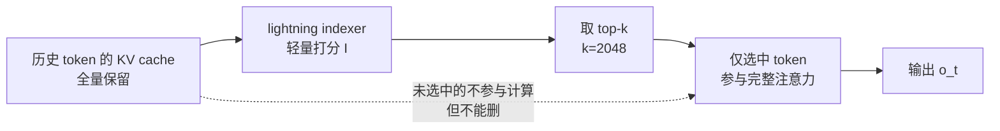

# 稀疏注意力(DSA / NSA / CSA / HCA)

一句话:**不改「看的方式」,改「看谁」**——保留 softmax 注意力本身,用一个轻量选择器从全部历史 token 里动态挑出最相关的一小撮参与计算,既省算力又保留随机访问任意历史位置的能力。这是 DeepSeek 从 NSA(论文)→ V3.2(DSA)→ V4(CSA/HCA)一路演进的主线,GLM-5/5.1 跟进,与「hybrid 线性」「保守全注意力」并列为 2026 年三条注意力路线之一。

## 一、动机:与 SWA 的本质区别

全注意力每生成一个 token 都要和前面所有 token 算一遍相关性,代价随上下文线性涨。最朴素的省法是 SWA(滑动窗口注意力):每个 token 只看最近固定窗口内的 token。两者的差别是**根本性**的:

- **SWA 是位置先验**:假设「相关的一定在附近」,窗口外的信息直接看不见,只能靠层间叠加间接传递;
- **稀疏注意力是内容驱动**:先便宜地扫一遍全历史、按相关性打分,挑出 top-k 再精读——50 万 token 前的一个函数定义,只要相关就能被直接命中。

> **类比**:SWA 是「写论文只翻最近两页笔记」;稀疏注意力是「先查索引,挑出最相关的十页来精读」。索引翻得快(轻量选择器),精读才花真功夫(完整 softmax 注意力)。

代价同样清楚:要多养一个选择器;而且对 DSA 这类 token 级稀疏,**KV cache 一条都不能丢**——任何历史 token 都可能被将来选中,省的是算、不是存。真正把「存」也压下来的是 V4 的 CSA/HCA(第四节)。

放进 KV cache 总公式看,各路线砍的是不同的项:

$$
\text{KV cache} = L_{\text{layers}} \times \underbrace{n_{kv} \cdot d_h}_{\text{GQA/MLA 压这里}} \times\, 2 \times \underbrace{S}_{\text{SWA/CSA/HCA 压这里}} \times\, b
$$

DSA 特殊:它不砍缓存公式里的任何一项,砍的是**注意力计算读取的条目数**(FLOPs 从 O(S) 到 O(k))。SWA 的窗口比例、GQA/MLA 的压维原理在知识库的滑动窗口注意力篇与 MLA 篇展开,此处不赘述。

## 二、NSA:三分支端到端可训练(2025 初,为 DSA 铺路)

DSA 不是凭空出现的。2025 年 2 月 DeepSeek 先发布 **NSA(Native Sparse Attention)**,回答的是「稀疏注意力能不能从预训练第一步就用」——此前的稀疏方案多为推理期外挂,训练仍是全注意力,训推不一致。

NSA 把每个 query 的注意力拆成**三条并行分支**,输出用可学习门控加权求和:

$$
o_t = g_t^{\mathrm{cmp}} \cdot o_t^{\mathrm{cmp}} + g_t^{\mathrm{slc}} \cdot o_t^{\mathrm{slc}} + g_t^{\mathrm{win}} \cdot o_t^{\mathrm{win}}
$$

| 分支 | 做法 | 作用 |
| --- | --- | --- |
| 压缩(cmp) | 按块(块长 32、步长 16)用可学习函数把每块压成一个粗粒度表示,对全部压缩块做注意力 | 便宜的全局概览 |
| 选择(slc) | 复用压缩分支的注意力分数给块打分,取 top-n 个块(论文 n=16、块大小 64)做完整注意力 | 精读最相关片段 |
| 滑窗(win) | 最近 512 token 的普通注意力 | 兜底局部依赖,防止局部模式「抄近路」主导训练、干扰前两支的学习 |

面试常追问的两个设计点:

- **硬件对齐**:稀疏的天敌是随机访存。NSA 以「块」为最小选择单位、GQA 同组 query 头共享选中的块,保证连续读内存、喂饱 Tensor Core;64k 上下文实测前向约 9 倍、反向约 6 倍、解码约 11.6 倍加速。
- **原生可训练**:三分支与门控全程可导,预训练即稀疏,不存在「训密推稀」的分布错配;同等设置下长文与推理评测不输全注意力基线。

这套「便宜打分 → top-k 精读 → 滑窗兜底」的组合,就是后来 DSA 与 CSA/HCA 的原型。

## 三、DSA:轻量 indexer 打分 + top-k(DeepSeek V3.2)

V3.2 把 NSA 的思想收敛成更简的生产形态 **DSA(DeepSeek Sparse Attention)**:一个极轻量的 **lightning indexer** 给当前 query 与每个历史 token 打相关分,只让得分 top-k 的 token 进注意力:

$$
I_{t,s} = \sum_{j} w_{t,j}\,\mathrm{ReLU}\!\left(q^{I}_{t,j} \cdot k^{I}_{s}\right),\qquad
S_t = \operatorname{top\text{-}k}_{\,s \le t}\; I_{t,s}
$$

indexer 便宜在三处:头数极少、FP8 计算、ReLU 代替 softmax;主注意力的每 token 代价则从 O(L) 降到 O(k)(V3.2 取 k=2048,远小于百 K 级的序列长度)。

- **与 NSA 的差别**:NSA 以「块」为选择单位、三分支并行,是面向 kernel 的折中;DSA 直接做 **token 级**打分选择,粒度更细,靠 FP8 + 极少头数把打分成本压到可忽略,结构上也更简单(单一注意力路径,无门控合流)。
- **与 MLA 的组合**:V3.2 = MLA + DSA。打分与选择建立在 MLA 的压缩 latent 之上,每个 token 只有一份 latent、所有 query 头共享同一份选择结果(MQA 式),索引与取数都只扫一遍;MLA 本身怎么压 KV,见知识库的 MLA 篇。
- **训练侧「先密后稀」**:从头稀疏训不稳。V3.2 在持续预训练里先跑**密集 warm-up**——主模型仍用全注意力,只训 indexer,用 KL 损失让它模仿全注意力的分布;再切入**稀疏阶段**,全模型在 top-k 选择下继续训练,indexer 持续对齐。
- **跟进者**:GLM-5/5.1 采用同路线,「压缩 + 稀疏 softmax」自此与 hybrid 线性并立为两大省算力阵营。

## 四、CSA / HCA:压的是「存多少个 token」(DeepSeek V4)

DSA 省了算,但 cache 仍是每 token 一条、随上下文线性涨。2026 年的 V4 更进一步:此前所有方法压的都是「每个 token 存多大」,**CSA/HCA 压的是「存多少个条目」**:

- **CSA(Compressed Sparse Attention)**:每 4 个 token 压成 1 个缓存条目(m=4),再用 DSA 风格的选择器在压缩条目里稀疏挑选——保留细节,但挑着看;
- **HCA(Heavily Compressed Attention)**:每 128 个 token 压成 1 个条目(m′=128),条目已经极少,反而可以对它们做**稠密**注意力——看得全,但极粗糙。

> **类比**:CSA 是「把书按四页一组做摘要,然后挑几组细读」;HCA 是「按 128 页一章做极简摘要,然后每章都扫一遍」。

两者互补(细 vs 全),V4 **交替堆叠 CSA 层与 HCA 层**;且两条路各保留一个 128-token 的滑动窗口分支处理最近的未压缩 token——和 NSA 的滑窗分支一脉相承。

> 🖼️ 占位:CSA/HCA 两级压缩(4:1 与 128:1)+ 滑窗分支的层级结构示意(V4 技术报告图)

自报效果(相对 V3.2,1M 上下文):V4-Pro 单 token 推理 FLOPs 降到 **27%**、KV cache 降到 **10%**;V4-Flash 更狠,FLOPs **10%**、cache **7%**(每 token 仅 5.4 KiB)。

⚠️ **必须带着的警告**:V4 论文**没有做消融实验**。上述数字是「完整 V4 配方」的结果,里面还混着更好的数据、Muon 优化器、mHC、精度优化和推理系统改动——**不能把收益全算在 CSA/HCA 头上**。面试引用这些数字时主动说明这一点是加分项。

## 五、对照表:SWA vs DSA vs CSA vs HCA

| 维度 | SWA | DSA | CSA | HCA |
| --- | --- | --- | --- | --- |
| 看谁 | 位置先验:最近 w 个 | 内容驱动:indexer 选 top-k token | 4:1 压缩条目中再选 top-k | 128:1 压缩条目全看(稠密) |
| 每 token 注意力代价 | O(w) | O(k) + 轻量 O(L) 打分 | O(k),条目数已 ÷4 | O(L/128) |
| KV cache | 窗口外可丢 | 全量保留(省算不省存) | 条目数 ÷4 | 条目数 ÷128 |
| 保留随机访问? | 否 | **是(token 级精确)** | 近似(4-token 粒度) | 仅粗粒度概览 |
| 代表模型 | Gemma 3/4、GPT-OSS 等 | DeepSeek V3.2、GLM-5/5.1 | DeepSeek V4(交替层) | DeepSeek V4(交替层) |

## 六、细节与常见坑

- **选择器不是免费的**:indexer 打分仍要扫全历史,是 O(L) 只是常数极小(FP8、少头、无 softmax);上下文长到一定程度,打分本身会成为新瓶颈——V4 把条目数 ÷4/÷128,顺带把打分范围也压小了。
- **训练稳定性靠对齐**:indexer 与主注意力分布脱节就会选错 token,主模型学不到东西。所以要 KL 蒸馏对齐 + 先密后稀的课程;NSA 则靠门控三分支隔离梯度,防局部模式抄近路。
- **稀疏模式必须迁就 kernel**:GPU 讨厌随机 gather。块级选择(NSA)、组内共享选择结果(NSA 的 GQA 组 / DSA 的 MQA 式共享 latent)都是为了连续访存与 Tensor Core 利用率——纸面 FLOPs 稀疏 ≠ 实际吞吐,没配套 kernel 就落不了地。
- **与 MLA 是正交组合**:MLA 压「每条存多大」(维度),DSA/CSA/HCA 压「参与多少 / 存多少条」(数量);V3.2、V4 两个方向同时用。
- **质量风险看检索**:top-k 太小可能漏掉关键 token,大海捞针类评测是这条路线的试金石(也是它相对纯线性注意力的卖点:至少还能捞)。

## 七、面试考点串联

1. SWA 与稀疏注意力的本质区别(位置先验 vs 内容驱动)→「动机」
2. NSA 三分支各自作用、为什么要滑窗分支 →「NSA」
3. 「原生可训练」解决什么问题(训推一致)→「NSA」
4. DSA 的 indexer 怎么打分、为何便宜、与 MLA 怎么组合 →「DSA」
5. 先密后稀的训练适配为什么必要 →「DSA」
6. CSA 与 HCA 为何互补、为何交替堆叠 →「CSA/HCA」
7. V4 的 27%/10% 数字怎么正确引用(无消融、不能全归架构)→「CSA/HCA 警告」
8. 稀疏注意力为什么难落地(随机访存、kernel 配套)→「细节与常见坑」

## 相关文献

- NSA:Native Sparse Attention(三分支可训练稀疏)— [arXiv:2502.11089](https://arxiv.org/abs/2502.11089)
- DeepSeek V3.2(DSA 首次上线)— [arXiv:2512.02556](https://arxiv.org/abs/2512.02556)
- DeepSeek V4(CSA/HCA)— 技术报告:https://huggingface.co/deepseek-ai/DeepSeek-V4-Pro
- GLM-5(DSA 路线跟进)— [arXiv:2602.15763](https://arxiv.org/abs/2602.15763)
