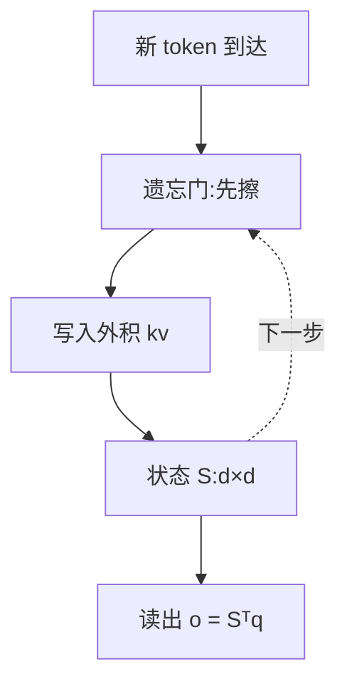

# 线性注意力与 SSM(Mamba / GDN / KDA)

> 🔴 重点考点:本篇是当前复习重点,文末「面试考点串联」给出问法对照。

一句话:**长序列的成本有六种砍法,线性注意力是最激进的那种——它不留历史 token 的 K/V,只维护一个固定大小的状态矩阵,新 token 来了就地改写它**。别的路线都在减小常数,只有这条路把缓存的增长率从「随长度线性涨」改成「跟长度无关」。

本篇有两个身份:一是**长序列六条路线的横向对照入口**(哪条路改了什么、别互相张冠李戴),二是**线性注意力/SSM 这一支的主篇**(遗忘门怎么演进、代价在哪)。

> **类比**(全文就靠这一个):
> - softmax 注意力 = 每天写一篇**日记**,全部留着,随时能翻回去查某一天说了什么——代价是本子越写越厚,而且每写新的一天都要把整本重读一遍;
> - 线性注意力 = 只维护一份不断改写的「**近况总结**」,发生新事就改总结——**总结的长度永远不变**,代价是旧细节会被后来的更新冲掉,想查「三月七号那天」多半查不到了。

## 一、六条路线,一张表

标准注意力的开销分两块:四次投影的 $O(nd^2)$,加上 $QK^\top$ 与 $AV$ 两次配对计算的 $O(n^2d)$;朴素实现还要显式保存 $n \times n$ 的分数矩阵,是 $O(n^2)$ 个元素。**这笔账怎么拆、为什么不能写成 $O(n^3)$,见 注意力基础 篇,本篇不重复推导**,只借它的结论往下走:长序列真正贵的是「配对数」和「必须留在显存里的东西」这两件事。

六条路线动的是不同的东西。**把它们混着说,是这道题最常见的翻车点**:

| 路线 | 改了什么 | 降的是哪一项 | 收益与代价 |
|---|---|---|---|
| 全局感受野(基线) | 什么都不改 | — | 任意两个位置一层内直连,精确检索最强;配对数 $O(n^2)$,缓存随长度线性涨 |
| 滑动窗口 | 每个位置只看最近 $W$ 个 | 配对数 + 单层缓存条目数 | 计算降到 $O(nWd)$、缓存封顶在 $W$;窗口外本层直接看不见,只能靠层间接力,精确回溯掉得厉害 |
| 稀疏注意力 | 用一个轻量选择器按内容挑出一小撮 token 精读 | 配对数(FLOPs) | 保住了「随机访问任意远处」的能力;要多养一个选择器,而且 token 级稀疏**一条 KV 都不能丢**——省的是算不是存,不规则访存还伤 kernel 效率 |
| 线性注意力 | 去掉 softmax,把历史压成固定大小的状态 | 配对数 + **缓存的增长率** | 每 token 计算变成与长度无关的常数,状态 $O(1)$;状态装不下全部细节,精确检索是天生弱项 |
| 分块 / 序列并行 | 把一条序列切给多张卡,注意力本身也分布式化 | **单卡要放下的长度** | 可处理长度随卡数扩展,**结果完全精确**;代价是通信量和分块边界的处理,总 FLOPs 一个没省 |
| FlashAttention | 只改中间矩阵的读写方式(分块 + online softmax) | **HBM 往返与中间激活** | 结果精确、省显存;**平方级 FLOPs 一个都没省**,KV cache 也一点没动 |

读表时抓住第三列:**先问「它降的到底是 FLOPs、中间激活、HBM IO、KV cache,还是单卡能塞下的长度」**,答不上来就说明还没分清。滑窗和稀疏的机制细节分别见 SWA 篇和 稀疏注意力 篇;序列并行见 并行策略 篇;IO 优化见 FlashAttention 篇。

### 两个最高频的误答

**FlashAttention 既不是稀疏也不是线性,它是精确 IO 优化。** 它算的还是同一个 softmax 注意力,一项配对都没跳过——靠分块和 online softmax 把那张 $n \times n$ 的中间矩阵摁在片上不落显存,省的是 HBM 读写次数和中间激活。**所以在「二次计算」这一栏它是零分,在「省显存、提吞吐」这一栏它是满分**,而且和 GQA、MLA、滑窗都能叠着用。它也**不减 KV cache**——那是另一个东西(见 KVCache 篇)。

**Ring Attention 是分布式序列并行,不是稀疏注意力。** 它把一条超长序列切给多张卡,各卡把自己那块 K/V 沿环逐跳传给下一张卡,本地边收边算,通信和计算重叠。**它扩展的是「单次能处理多长」,不是「每个 query 看多少个位置」**——每个 token 依然和全部历史配对,结果和单卡全注意力一模一样。代价是环上的通信量,以及因果 mask 下各卡负载不均要靠交错切分补救。细节见 并行策略 篇。

## 二、三个阶段的账要分开算

同一个方案,在训练、prefill、decode 三个阶段的效果**可以完全不同**。这是长序列选型题真正的分水岭,也是最容易被追问的一层:

| 阶段 | 一次处理多少 query | 主要瓶颈 | 哪些方案在这里有效 |
|---|---|---|---|
| 训练 | 整段序列 | 二次配对计算 + **中间激活**(注意力矩阵 $O(n^2)$ 个元素,反向还要重算或存下) | FlashAttention(不物化矩阵)、滑窗/稀疏/线性(少算配对) |
| Prefill | 整段 prompt(没有反向) | 同上,外加把 K/V 写进缓存 | 同上;此阶段算力吃紧,属于计算受限 |
| Decode | **只有 1 个新 query** | **内存带宽**:每生成一个 token 都要把全部历史 K/V 从 HBM 读一遍 | 只有**改了缓存增长率**的方案有效:滑窗封顶、线性的固定状态 |

Decode 这一行要说准:每步虽然只有一个新 query,但它要和**全部历史 K/V** 配对,所以**单层每步的工作量和缓存占用都随已生成长度增长**。这就引出那句必须能脱口而出的话——

**仅优化训练时的注意力矩阵,不等于消除了 KV cache。** FlashAttention 让训练和 prefill 不再物化 $n \times n$ 的矩阵,但 decode 阶段该存的 K/V 一个字节都没少、该读的一遍也没少。想动 decode,要么压缓存里每个 token 的字节数(见 KV共享注意力 篇、MLA 篇),要么改它的增长率(滑窗、线性)。**「省激活」和「省缓存」是两笔账。**

## 三、线性注意力改了什么:结合律只是三分之一

面试里最容易被追问穿的地方,就是只会背「矩阵结合律」。结合律只回答了「**能不能换个顺序算**」,没回答「**为什么允许把 softmax 去掉**」,更没回答「**去掉之后要补什么**」。完整的答案有三层。

### 第一层:去掉 softmax,乘法顺序才动得了

softmax 的分母要等 $q_t$ 到场、和**全部** $k_j$ 一起归一化才能定下来,权重和 $q_t$ 非线性纠缠,历史压不成一个与 $q$ 无关的摘要——这就是 KV cache 必须留全量的**结构性根源**。把 softmax 换成对 $q$、$k$ 分别作用的核函数 $\phi$(最早的做法是 $\phi(x) = \mathrm{elu}(x) + 1$,保证非负),注意力退化成纯矩阵乘,结合律才生效:

$$
(Q K^\top) V = Q (K^\top V)
$$

左边先算 $n \times n$ 的大矩阵,是 $O(n^2 d)$;右边先算 $K^\top V$——一个 $d \times d$ 的小矩阵,**和序列长度无关**。但这一步只换了乘法顺序,还没解释任何别的事情。

### 第二层:因果 mask 一插进来,结合律就不能直接用了

自回归模型里第 $t$ 个位置只能看 $i \le t$。mask 夹在两个矩阵乘中间,上面那个等式**不能照搬**,真正成立的是前缀和形式:

$$
o_t = \phi(q_t)^\top \sum_{i \le t} \phi(k_i) v_i^\top
$$

这句话是说:第 $t$ 步能用的不是整段的 $K^\top V$,而是**前 $t$ 项的部分和**。把部分和写成增量更新,就得到线性注意力的真身:

$$
S_t = S_{t-1} + \phi(k_t) v_t^\top, \qquad o_t = \phi(q_t)^\top S_t
$$

$S$ 是一个 $d \times d$ 的固定大小笔记本($d$ 为头维度,常见 128):外积 $\phi(k_t) v_t^\top$ = 「往 $k_t$ 这个方向的格子里记一条 $v_t$」;读取 $\phi(q_t)^\top S_t$ = 「按 $q_t$ 与各方向的相似度把内容加权取出来」。**同一组权重,训练时走前缀和的并行形式,推理时走这条递推——线性注意力本质是披着注意力外衣的 RNN。**

拿一组常见配置感受一下这个「固定」值多少钱:32 个头、头维 128、bf16,一个线性层每个请求的状态是 $32 \times 128 \times 128 \times 2\,\text{B} = 1$ MiB,**不管序列多长都是这个数**;同一层若换成全注意力(8 个 KV 头、头维 128),1M 上下文的 KV 是 $2 \times 2^{20} \times 8 \times 128 \times 2\,\text{B} = 4$ GiB——**差约四千倍**。(这是按上述假设算出的量级,不是某个具体模型的实测值。)

### 第三层:归一化没了,必须显式补一个遗忘机制

softmax 原本免费提供两件事:**权重非负且逐行加起来等于 1**(每个位置要和别人抢那 1 的预算),以及 **exp 带来的尖锐性**(真正相关的位置能拿到压倒性权重)。去掉之后两件事一起没了。

早期做法还留着一个分母 $\phi(q_t)^\top \sum_{i \le t}\phi(k_i)$,但它是一个**只增不减的累加和**:$t$ 越大,每条旧记忆被摊薄的比例完全一样,**和它重不重要毫无关系**。而 Mamba-2、GDN、KDA 这一代干脆把分母去掉,靠输出侧的归一化和门控稳住数值——于是 $S$ 成了纯累加器,不加约束范数会随 $t$ 一路涨,新旧关联挤在同一块 $d \times d$ 空间里互相污染,读出来全是串味的。

**所以「必须有遗忘门」不是锦上添花,是去掉 softmax 之后的补课。** 这就是下一节整部进化史的由头。



## 四、遗忘机制的四个台阶

2020 到 2026 的线性注意力史,基本就是一部遗忘门进化史。核心问题只有一个:**笔记本容量固定,该擦哪里?**

### 台阶 0:朴素累加——不忘,于是状态被污染

最早一代只加不减,旧关联永不清除,新旧内容在状态里互相叠加干扰。对应类比:近况总结从来不删旧条目,三个月后满纸过期信息。

### 台阶 1:Mamba / Mamba-2——由输入决定衰减多少

Mamba 的出发点是状态空间模型:状态更新的参数由**当前输入**算出(所谓「选择性」),等于在时间维上做动态滤波——重要的输入让状态多留一会儿,无关的输入让状态快速衰减。Mamba-2 把状态转移矩阵限制成「标量乘单位阵」,并用 SSD(结构化状态空间对偶)证明这类 SSM 可以写成带衰减门的线性注意力:

$$
S_t = \alpha_t\, S_{t-1} + k_t v_t^\top,\qquad \alpha_t \in (0,1)
$$

$\alpha_t$ 由输入算出:该记住的那一步 $\alpha_t \to 1$(整份状态全保留),该翻篇的那一步 $\alpha_t \to 0$(推倒重来)。**代价是衰减无差别**:一忘就是整份状态一起打折,没法只忘一条。

### 台阶 2:Gated DeltaNet——先把旧值擦掉,再写新值

delta 规则更像外科手术:写入 $k_t \to v_t$ 之前,先把 $k_t$ 方向上已经存着的旧值读出来,按强度 $\beta_t$ 擦掉,再写新值——同一个 key 被更新时是**覆盖**而不是叠加:

$$
S_t = \alpha_t \left(I - \beta_t\, k_t k_t^\top\right) S_{t-1} + \beta_t\, k_t v_t^\top
$$

括号里的 $(I - \beta_t k_t k_t^\top)$ 就是「擦除算子」,$\beta_t = 1$ 表示这条完全覆盖、$\beta_t = 0$ 表示不动。**两个门分工互补**:$\alpha$ 门负责整段过期记忆的快速清空,delta 规则负责单条的精准改写。关键限制是 $\alpha_t$ **每个头只有一个标量**,整个头一起决定这一步忘多少,一刀切。

> 🖼️ 占位:delta 规则在 d×d 状态矩阵上「读出旧值 → 擦除 → 写入新值」的三步几何示意

### 台阶 3:KDA——每个通道自己决定忘多少

KDA(Kimi Delta Attention)是 GDN 的细化版:把标量遗忘门换成**每个特征通道独立的门**($\alpha_t$ 从一个标量变成 $d$ 维向量,即对角门控矩阵)。

**为什么细粒度有用**:状态的不同通道存的东西不一样——有的偏位置/时间线索,有的偏语义内容。通道级的门允许「忘掉时间信息、保留语义信息」这种分工,标量门做不到。工程上 KDA 配了 DPLR(对角加低秩)转移矩阵的专用分块算法,细粒度没有以牺牲硬件效率为代价。

| 机制 | 出身 | 遗忘门粒度 | 代表模型 |
|---|---|---|---|
| Lightning Attention | 线性注意力 + 分块工程 | 粗粒度衰减,无 delta 规则 | MiniMax-01、Ling 2.5(70 Lightning + 10 MLA,7:1) |
| Mamba-2 | 选择性 SSM(SSD 对偶) | 每头一个标量 | Nemotron 3 全系 |
| Gated DeltaNet | delta 规则 + 衰减门 | 每头一个标量 $\alpha$ | Qwen3-Next / Qwen3.5 / Qwen3.6 |
| KDA | GDN 的通道级细化 | **每个特征通道各一个** | Kimi Linear、Kimi K3(KDA 与门控 MLA 约 3:1) |

各家线性层与 softmax 层的混合比例怎么定、为什么 MiniMax 又掉头回全注意力,见 Hybrid注意力 篇。

## 五、Mamba 和线性注意力,是同源不是同一个

这是个精确度考题,答错方向就露怯。**Mamba 是选择性状态空间模型(SSM),不该被归类成 Linear Attention。**

- **出身不同**:SSM 来自连续时间的状态空间方程(经离散化落到序列上),线性注意力来自「把 softmax 换成核函数」。两条完全不同的推导路径。
- **同源在哪**:两者都是**固定大小的状态 + 逐步递推更新**,状态不随序列变长,所以推理时都是每步常数开销。
- **合流到什么程度**:Mamba-2 的 SSD 证明了**这一类**(转移矩阵为标量乘单位阵的)SSM 与带衰减门的线性注意力在数学上等价,可以互相翻译。但这是「某一类 SSM ≅ 某一类线性注意力」,**不是「所有 SSM 都是线性注意力」**——Mamba-1 用的是更一般的对角状态转移,不落在那个等价类里。
- **顺带一句 RWKV**:它可以用线性注意力和循环网络两种视角描述,但**不该和 Mamba 合并成同一种结构**——同样是不同的推导路径。

面试口径:「**同源但不同宗**。都属于『固定状态 + 递推』这一大类,Mamba-2 那一支被证明和带衰减的线性注意力等价;但 Mamba 的自我定位是选择性 SSM,直接说『Mamba 是线性注意力』不准确。」

## 六、代价:它到底牺牲了什么

- **精确检索**。这是最根本的一条。$d \times d$ 的状态大约只能存下 $d$ 组互不干扰的键值关联(类比装载率过高的哈希表,再多就互相踩),而序列长度 $n \gg d$。**遗忘门再聪明也只是决定丢什么,不能不丢**,所以多针大海捞针、RULER 这类需要精确回溯任意历史位置的基准上,纯线性模型明显低于同规模 softmax。**头维度是这类模型记忆容量的核心旋钮。**
- **归一化性质**。第三节讲过:非负 + 逐行和为 1 + exp 的尖锐性一起没了,注意力分布被摊平,需要靠门控和输出归一化把数值稳回来。
- **没人用纯线性**。因为上一条,现代模型全是「大部分层线性、少数层保留 softmax」的混合形态。有意思的是混合之后不仅能补回检索能力,常常还反超——线性层承担压缩总结,让 softmax 层把有限的精确定位预算花在刀刃上。比例细节见 Hybrid注意力 篇。

**什么场景不适合**:

- **短序列**。每 token 计算量线性是 $O(d^2)$、softmax 是 $O(t \cdot d)$,理论交叉点在 $t \approx d$;但 FlashAttention 类内核的工程常数把真实收益推得更靠后。Kimi Linear 论文自报:4k 上与全注意力速度接近,128k 约 4 倍,1M 约 6 倍,KV cache 省约 75%。**几千 token 的场景换线性注意力基本白折腾。**
- **需要逐字回溯的任务**。几十万 token 里精确定位某段代码、逐条引用原文的长文问答,恰好踩在最弱的点上。
- **生态成本敏感的团队**。它不是「换个算子」那么简单,见下面那条。

### 两个必答的工程细节

**递推不等于只能串行训练。** 实际训练走 chunkwise(分块)扫描:序列切块,块内用矩阵乘并行,块间只传一次状态。DeltaNet 那串 $(I - \beta_t k_t k_t^\top)$ 连乘是 Householder 矩阵乘积,靠 WY 表示才做到了序列维并行,GDN/KDA 的高效内核都建在这条算法路线上。面试里「递推式怎么可能训得动」问的就是这个。

```python
# 同一组权重的两副面孔(伪代码,略去块内衰减的对齐细节)
def chunkwise(Q, K, V, alpha, C=64):        # C 是块长,训练走这条
    S, O = zeros(d, d), []
    for q, k, v, a in chunks(Q, K, V, alpha, C):
        O.append(intra_chunk(q, k, v, a)     # 块内:普通矩阵乘,完全并行
                 + q @ S)                    # 块间:只读一次进块时的状态
        S = decay(a) * S + k.T @ v           # 每块结束才更新一次状态
    return concat(O)

def decode_step(q, k, v, a, S):              # 每步 O(d²),与已生成长度无关
    S = a * S + outer(k, v)
    return S.T @ q, S
```

**推理栈要管两套缓存。** vLLM 和 SGLang 都把线性/SSM 层做成了与 softmax 注意力并列的独立后端(Mamba-1/2、GDN、KDA 各有各的内核)。混合模型跑起来时,softmax 层走分页 KV cache,线性层走另一套定长状态池;**前缀复用的逻辑也不一样**——KV cache 能按 token 前缀切片共享,递推状态切不开,只能在分块边界上存一份状态快照、命中时整份拷贝,SGLang 为此专门做了混合版的前缀树缓存。具体实现见开源解读模块。

**别把厂商自报的吞吐全记在机制头上**:「某某上下文下吞吐是某某的几倍」是系统级对比,混着推理栈和实现质量,不能孤立归因给线性注意力本身。

## 七、百万 token 文档怎么组合与验证

先说一句反直觉的:**感受野不是越大越好**。全局注意力能直接抓远依赖,但也会花大量算力在无关位置上,还丢掉了「相关的多半在附近」这个很有用的结构先验(原始 ViT 用全局注意力,窗口化是 Swin 这类变体的设计)。所以选型不是「谁的感受野大选谁」。

**组合顺序按「代价从小到大」来**,每一步都能停:

1. **先用「局部窗口 + 少量全局通道」建基线**。局部窗口把成本压成线性、吃掉绝大多数近距离依赖;少量全局层或全局 token 兜住跨越整篇的依赖。旋钮就两个:窗口大小、全局占比——**收益随全局占比上升很快饱和,成本却是线性涨的**,所以要在目标长度上实测拐点。比例与窗口的具体经验值见 SWA 篇和 稀疏注意力 篇。
2. **无脑上 FlashAttention 类精确内核**。它不改结果,纯赚,没有理由不用。
3. **单卡放不下再上序列并行**。它同样精确,买的是「单次能处理多长」,付的是通信。
4. **最后才考虑换线性混合**。它要重新训练、要专用内核、要改缓存管理,是这四步里唯一不可逆的一步。

**验证清单**(缺一项就不算验过):

| 看什么 | 用什么测 | 为什么必须单独看 |
|---|---|---|
| 精确检索 | 大海捞针(单针 / 多针)、长上下文检索基准 | 线性和滑窗最容易掉的就是这个,综合平均分会把它稀释掉 |
| 长文理解 | 长文问答、跨段推理 | 检索得到不等于用得对 |
| 语言建模 | 长序列困惑度 | 便宜的连续指标,能早期发现退化 |
| 显存 | 每 token KV(或状态)字节 × 目标长度 | 混合模型算的是 softmax 层那部分,注意木桶效应 |
| 端到端吞吐 | 目标并发下的首 token 延迟与单 token 延迟 | 机制的理论收益不等于服务的真实收益 |

最后一条纪律:**最大长度和加速倍数都必须绑定具体模型、内核和硬件**。「支持 1M 上下文」「快 6 倍」离开了模型规模、kernel 实现和卡型就是空话——这也是评审别人 benchmark 时的第一个追问点。长上下文的训练侧配方(位置编码外推、分阶段扩长)见 长上下文训练 篇。

## 八、面试考点串联

| 高频问法 | 本文哪一节 |
|---|---|
| 标准 Attention 的时间和空间成本来自哪里 | 一(结论;两项账本的完整拆法见 注意力基础 篇) |
| 全局感受野、滑窗、稀疏、线性、序列并行、FlashAttention 各改了什么 | 一(全景表) |
| 这些方案对训练、prefill、decode 的影响有什么不同 | 二 |
| 训练、prefill 与 decode 的内存瓶颈分别是什么 | 二 |
| 只优化了训练时的注意力矩阵,KV cache 就消失了吗 | 二 |
| FlashAttention 属于稀疏还是线性注意力,为什么 | 一(两个最高频误答) |
| Ring Attention 是稀疏注意力吗 | 一(两个最高频误答) |
| 线性注意力为什么不能只用「矩阵结合律」解释 | 三(三层递进) |
| 线性注意力的递推式长什么样?递推怎么还能并行训练 | 三 + 六(chunkwise) |
| Mamba 属于线性注意力吗?它和线性注意力什么关系 | 五 |
| 线性注意力牺牲了什么?什么场景不适合用 | 六 |
| 局部加全局 token 的稀疏模式怎么平衡感受野与成本 | 七(经验值见 SWA 篇、稀疏注意力 篇) |
| 面向百万 token 文档,你会怎么组合并验证这些方案 | 七(四步 + 验证清单) |
| 感受野是不是越大越好 | 七 |
| delta 规则比朴素累加、比纯衰减好在哪(补充题) | 四(台阶 2) |
| GDN 和 KDA 的门控粒度差在哪,细粒度为什么有用(补充题) | 四(台阶 2/3 + 对照表) |
| 一个长上下文服务,加速倍数的宣称该怎么审(补充题) | 七(绑定模型、内核、硬件) |

## 相关文献

- Transformers are RNNs: Fast Autoregressive Transformers with Linear Attention(Katharopoulos,线性注意力与递推形式)— [arXiv:2006.16236](https://arxiv.org/abs/2006.16236)
- Rethinking Attention with Performers(核方法近似 softmax 的另一条线路)— [arXiv:2009.14794](https://arxiv.org/abs/2009.14794)
- Mamba: Linear-Time Sequence Modeling with Selective State Spaces(选择性 SSM)— [arXiv:2312.00752](https://arxiv.org/abs/2312.00752)
- Transformers are SSMs(Mamba-2 与 SSD 对偶)— [arXiv:2405.21060](https://arxiv.org/abs/2405.21060)
- Parallelizing Linear Transformers with the Delta Rule over Sequence Length(WY 表示实现序列维并行训练)— [arXiv:2406.06484](https://arxiv.org/abs/2406.06484)
- Gated Delta Networks: Improving Mamba2 with Delta Rule(GDN)— [arXiv:2412.06464](https://arxiv.org/abs/2412.06464)
- Kimi Linear: An Expressive, Efficient Attention Architecture(KDA、通道级遗忘门与 chunkwise DPLR)— [arXiv:2510.26692](https://arxiv.org/abs/2510.26692)
- Lightning Attention-2(分块线性注意力的工程实现)— [arXiv:2401.04658](https://arxiv.org/abs/2401.04658)
- RWKV: Reinventing RNNs for the Transformer Era(线性注意力与循环两种视角)— [arXiv:2305.13048](https://arxiv.org/abs/2305.13048)
- FlashAttention: Fast and Memory-Efficient Exact Attention with IO-Awareness(精确 IO 优化,非近似)— [arXiv:2205.14135](https://arxiv.org/abs/2205.14135)
- Ring Attention with Blockwise Transformers for Near-Infinite Context(分布式序列并行)— [arXiv:2310.01889](https://arxiv.org/abs/2310.01889)
