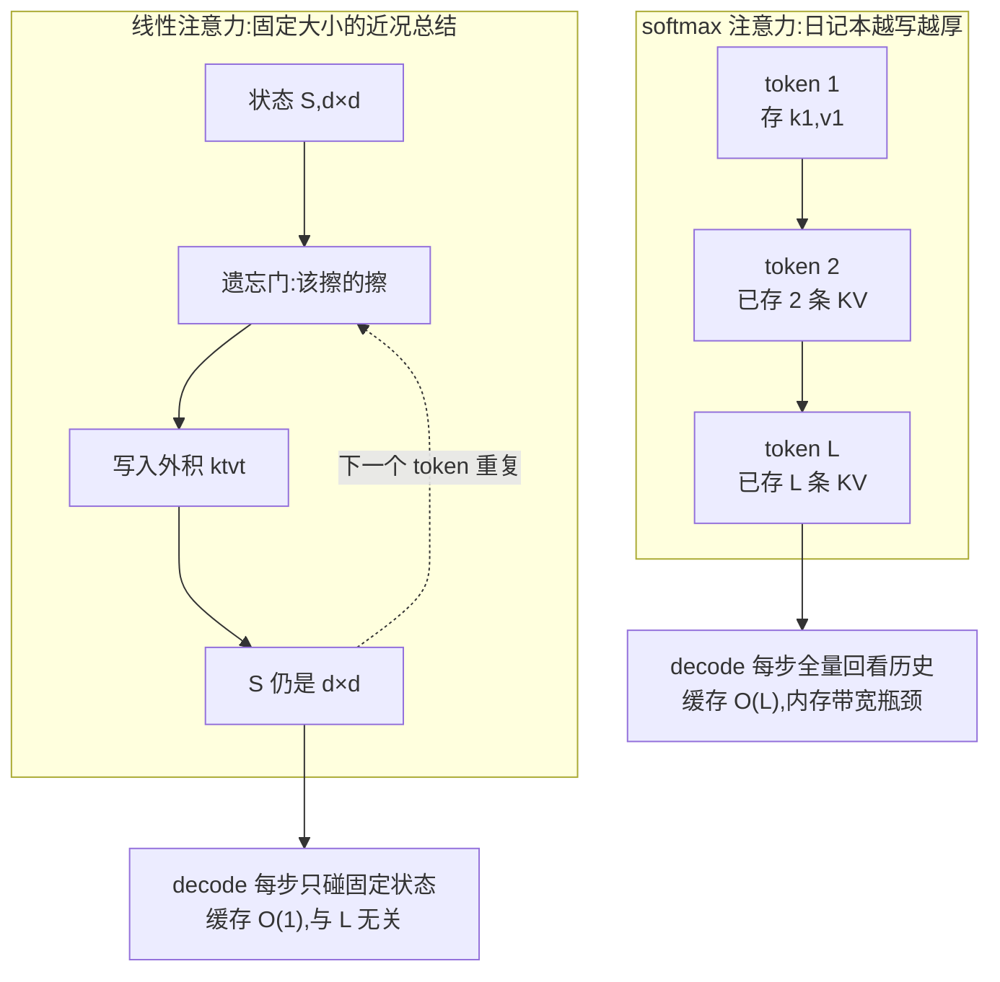

# 线性注意力与 SSM(Mamba / GDN / KDA)

> ⚠️ 旧版:本篇写于写作契约确立之前,尚未按新标准审查重写。标准见 docs/04-知识库写作契约.md,样板见「GPU架构与执行模型」。

一句话:**干脆不要 KV cache**——不存历史 token 的 K/V,只维护一个固定大小的状态矩阵 $S$,新 token 来了就地更新,缓存从 $O(L)$ 变 $O(1)$。KV cache 优化的几条路线里它最激进:别的路线都在减小常数,它直接改掉增长率。

> **类比**(全文就靠这一个类比):
> - softmax 注意力 = 把每一天都写成一篇**日记**,全部留着,随时可以翻回去查某一天——代价是本子越写越厚;
> - 线性注意力 = 只维护一份不断更新的「**近况总结**」,新事发生就改总结——**总结的长度永远不变**,代价是旧细节会被后来的更新冲掉。

## 一、原理推导:结合律的魔法

### softmax 为什么必须存下所有历史

因果 softmax 注意力在位置 $t$ 的输出:

$$
o_t = \sum_{i \le t} \frac{\exp(q_t^\top k_i)}{\sum_{j \le t} \exp(q_t^\top k_j)}\, v_i
$$

问题出在 softmax 的分母:每个历史位置的权重要等 $q_t$ 到场、和**全部** $k_j$ 一起归一化之后才能确定。权重和 $q_t$ 非线性纠缠,没法提前把历史压成一个与 q 无关的摘要——只能把所有 $k_i, v_i$ 原样存着等 q 来查。这就是 KV cache 随 $L$ 线性增长的**结构性根源**,压缩(GQA/MLA)只能减小常数,改不了增长率。

### 去掉 softmax 之后:结合律生效

把 softmax 拿掉(或换成对 q、k 分别作用的核函数 $\phi$),注意力退化成纯矩阵乘,矩阵结合律立刻可用:

$$
(Q K^\top) V = Q (K^\top V)
$$

左边先算 $L \times L$ 的注意力矩阵,$O(L^2)$;右边先算 $K^\top V$——一个 $d \times d$ 的小矩阵,**与序列长度无关**。把右边展开成逐 token 的递推:

$$
S_t = S_{t-1} + k_t v_t^\top,\qquad o_t = S_t^\top q_t
$$

状态 $S$ 是 $d \times d$ 固定大小($d$ 为头维度,如 128)。同一个模型,训练时用矩阵形式并行,推理时用递推形式逐 token 更新——线性注意力本质是「披着注意力外衣的 RNN」。

> **类比**:$S$ 是一个固定容量的键值笔记本。$k_t v_t^\top$ 这个外积 = 「往 $k_t$ 方向的格子里记一条 $v_t$」;读取 $S_t^\top q_t$ = 「按 $q_t$ 与各格子的相似度,把内容加权取出来」。

**代价一目了然**:$d \times d$ 的笔记本大约只能存 $d$ 组互不干扰的键值关联,装不下 $L \gg d$ 个 token 的全部细节,**必须决定忘掉什么**。这直接对应线性注意力最经典的弱项:大海捞针式的精确检索。

## 二、遗忘机制的进化:怎么忘得聪明

2020→2026 的线性注意力史,就是一部「遗忘门」的进化史。核心问题只有一个:笔记本写满了,擦哪里?

### 阶段 0:朴素累加——不忘,状态污染

最早一代线性注意力(2020 年前后)只加不减:旧关联永不清除,新旧内容在状态里互相叠加干扰,越写越糊。类比:近况总结从来不删旧条目,三个月后满纸过期信息,读出来全是串味的。

### 阶段 1:Mamba / Mamba-2——输入依赖的衰减(SSM 视角)

Mamba 从状态空间模型(SSM)出发:状态更新的参数由**当前输入**决定(所谓「选择性」),本质是时间维度上的动态滤波——重要的输入让状态多保留一会儿,无关的输入让状态快速衰减。Mamba-2 把转移矩阵限制成标量乘单位阵,并用 SSD(结构化状态空间对偶)证明:这类 SSM 就是带衰减门的线性注意力——

$$
S_t = \alpha_t\, S_{t-1} + k_t v_t^\top,\qquad \alpha_t \in (0,1)
$$

$\alpha_t$ 由输入算出:该记住的步 $\alpha_t \to 1$(全保留),该翻篇的步 $\alpha_t \to 0$(推倒重来)。**SSM 与线性注意力自此合流为一家。** 但衰减是无差别打折:一忘就是整个状态一起淡化。

### 阶段 2:Gated DeltaNet(GDN)——先擦旧值再写新值

delta 规则更像外科手术:写入 $k_t \to v_t$ 之前,先把 $k_t$ 方向上已存的旧值读出来、按强度 $\beta_t$ 擦掉,再写入新值——同一个 key 被更新时是**覆盖**而不是叠加:

$$
v_t^{\text{old}} = S_{t-1}^\top k_t,\qquad S_t = S_{t-1} + \beta_t\, k_t \left(v_t - v_t^{\text{old}}\right)^\top
$$

展开即

$$
S_t = \left(I - \beta_t\, k_t k_t^\top\right) S_{t-1} + \beta_t\, k_t v_t^\top
$$

$(I - \beta_t k_t k_t^\top)$ 就是「擦除算子」,$\beta_t \in (0,1]$ 控制覆盖强度($\beta=1$ 完全覆盖,$\beta=0$ 不动)。GDN = delta 规则再配一个 $\alpha$ 遗忘门,两者互补:$\alpha$ 门负责快速清空整段过期记忆,delta 规则负责精准改写单条:

$$
S_t = \alpha_t \left(I - \beta_t\, k_t k_t^\top\right) S_{t-1} + \beta_t\, k_t v_t^\top
$$

> 🖼️ 占位:delta 规则在 d×d 状态矩阵上「读出旧值 → 擦除 → 写入新值」的三步几何示意

关键限制:**$\alpha_t$ 是每个头一个标量**——整个头一起决定「这一步忘多少」,一刀切。

### 阶段 3:KDA(Kimi Delta Attention)——每个通道自己决定

KDA 是 GDN 的精细版:把标量遗忘门换成**每个特征通道独立的遗忘门**($\alpha_t$ 从标量变成 $d$ 维向量,即对角门控矩阵)。

直觉:状态的不同通道存的东西不一样——有的通道偏「位置/时间线索」,有的偏「语义内容」。KDA 允许「忘掉时间信息、保留语义信息」这种分工,标量门做不到。这是 2026 年架构圈最典型的「精细化」思路:同一个机制,把控制粒度从头级推到通道级。工程上 KDA 用 DPLR(对角 + 低秩)转移矩阵的专用 chunkwise 算法,保住了硬件效率。

## 三、主流机制对照(手册 2.6)

| 机制 | 出处/路线 | 遗忘门粒度 | 代表模型 |
|---|---|---|---|
| Mamba-2 | SSM(SSD 对偶) | 每头标量衰减 | Nemotron 3 全系 |
| Gated DeltaNet | delta 规则 + 门控 | 每头标量 $\alpha$,一刀切 | Qwen3-Next / Qwen3.5 / Qwen3.6 |
| KDA | GDN 精细化 | **每特征通道独立** | Kimi Linear / Kimi K3 |
| Lightning Attention | 无 delta 规则,胜在分块算法的工程效率 | 粗粒度衰减 | MiniMax-01、Ling 2.5 |

## 四、大规模验证:从试验田到旗舰

「激进架构先在中小模型验证、再进旗舰」的规律,在线性注意力上走完了完整闭环:

| 试验田 | 旗舰 | 线性机制 |
|---|---|---|
| Qwen3-Next 80B-A3B(2025-09) | Qwen3.5 397B-A17B(2026-02) | GDN,3:1 混合 |
| Kimi Linear 48B-A3B(2025-10) | **Kimi K3 2.8T(2026-07)** | KDA + 门控 MLA |
| Nemotron 3 Nano 30B(2025-12) | Nemotron 3 Super 120B(2026-03) | Mamba-2 + GQA |

- **Kimi K3 直接拿 KDA 当 2.8T 参数旗舰的骨干**——这条路线在超大规模上被验证。Kimi Linear 论文口径:同配方公平对比下整体优于全注意力(MLA),KV cache 省约 75%,1M 上下文 decode 提速约 6 倍。
- **Nemotron 3 是混合最极端的**:Nano 30B 共 52 层,只有 **6 层**是 GQA 注意力,其余 23 层 Mamba-2 + 23 层 MoE;KV/token 压到 6 KiB。对照全注意力阵营:MiniMax M2 是 248 KiB,Gemma 3 27B 是 496 KiB——差了近两个数量级。
- Qwen3-Next 24 KiB、Qwen3.5 30 KiB、Kimi Linear 7.9 KiB,都比同期全注意力低一个数量级以上。

## 五、与 hybrid、与稀疏 MoE 的关系

- **没人用纯线性**。检索弱项决定了它必须与少数 softmax 全注意力层混用,大部分层线性、少数层全注意力,3:1 已是事实标准;比例怎么定、MiniMax 为何掉头回全注意力,细节见 Hybrid注意力篇。
- **线性注意力 ↔ 极致稀疏 MoE 是配套件**(手册耦合①):前者砍 **KV cache 显存**,后者砍**每 token 算力**,卡的是同一个推理瓶颈的两半;只做一半,另一半立刻成为新瓶颈。所以 Qwen3-Next(3.8% 激活)、Kimi K3(16/896 专家,1.8%)、Nemotron Nano(30B/3B)全都同时把两头推到极致。roofline 视角:线性注意力把 decode 从带宽受限往算力受限推,稀疏 MoE 再把它推回去。

## 六、一图对比:日记本 vs 近况总结

## 七、细节与常见坑

- **递推 ≠ 只能串行训练**:实际训练用 chunkwise(分块)扫描——序列切块,块内用矩阵乘并行,块间只传一次状态。DeltaNet 的 $(I - \beta_t k_t k_t^\top)$ 连乘是 Householder 矩阵乘积,靠 WY 表示才实现了序列维并行(Parallelizing DeltaNet 一文的核心贡献);GDN/KDA 的高效 kernel 都建在这条算法路线上。面试里「递推式怎么可能训得动」就考这个。
- **检索弱项的量化表现**:多针大海捞针、RULER 这类精确回溯基准上,纯线性模型明显低于同规模 softmax——这是必须保留全注意力层的根本原因。有意思的是混合之后不仅能补回,甚至常反超:线性层承担「压缩总结」,让 softmax 层把有限的注意力预算集中在真正需要精确定位的地方。
- **状态容量由 $d$ 决定**:$d \times d$ 状态大约只能存 $d$ 组互不干扰的键值关联,再多就互相踩(类比装载率过高的哈希表)。遗忘门再聪明也只是决定「丢什么」,不能不丢;头维度是这类模型记忆容量的核心旋钮。
- **收益集中在长上下文**:每 token 计算量,线性是 $O(d^2)$、softmax 是 $O(t \cdot d)$,理论交叉点在 $t \approx d$;但 FlashAttention 类内核的工程常数让真实收益后移——Kimi Linear 在 4k 上与全注意力速度接近,128k 提速约 4 倍,1M 约 6 倍。短序列场景换线性注意力基本白折腾。
- **长度外推反而是强项**:状态大小与 $L$ 无关,递推天然按顺序消化输入,没有「RoPE 超出训练长度就失效」的问题,GDN 论文把 length extrapolation 列为优势项。混合架构里,顺序信息很大程度由衰减/递推自带,全局 softmax 层反而常削弱或去掉位置编码(Kimi Linear 的 MLA 层用 NoPE);层间位置编码分工的完整规律见 RoPE篇。
- **别把厂商自报吞吐全记在机制头上**:诸如「32k 下吞吐是某某的 3.5 倍」是系统级对比,混着推理栈与实现质量,不能孤立归因给线性注意力本身。

## 八、面试考点串联

1. 为什么 softmax 注意力必须 $O(L)$ 缓存、线性注意力为什么能 $O(1)$ →「原理推导」(结合律 + 递推式,必会手推)
2. 写出线性注意力递推式,解释「训练并行 / 推理递推」双形态 →「原理推导」+「细节:chunkwise」
3. delta 规则相比朴素累加、纯衰减改进了什么 →「遗忘机制:阶段 2」(先擦旧值再写新值)
4. GDN 和 KDA 的门控粒度差别、细粒度为什么有用 →「阶段 2/3」+ 对照表(标量门 vs 每通道门)
5. 线性注意力为什么大海捞针弱、工程上怎么救 →「原理的代价」+「与 hybrid 的关系」
6. Mamba/SSM 和线性注意力什么关系 →「阶段 1」(SSD 对偶,合流为一家)
7. 为什么用线性注意力的模型都配极稀疏 MoE →「耦合」(显存与算力,同一瓶颈的两半)

## 相关文献

- Mamba(选择性 SSM)— [arXiv:2312.00752](https://arxiv.org/abs/2312.00752)
- Mamba-2 / Transformers are SSMs(SSD 对偶)— [arXiv:2405.21060](https://arxiv.org/abs/2405.21060)
- Gated DeltaNet(delta 规则 + 门控)— [arXiv:2412.06464](https://arxiv.org/abs/2412.06464)
- Parallelizing DeltaNet(WY 表示实现序列维并行训练)— [arXiv:2406.06484](https://arxiv.org/abs/2406.06484)
- Kimi Linear(KDA:每通道遗忘门)— [arXiv:2510.26692](https://arxiv.org/abs/2510.26692)
