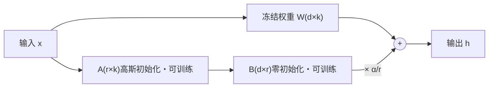

# LoRA(Low-Rank Adaptation)

> ⚠️ 旧版:本篇写于写作契约确立之前,尚未按新标准审查重写。标准见 docs/05-知识库写作契约.md,样板见「GPU架构与执行模型」。

LoRA 冻结原模型权重,只在选定矩阵旁训练低秩增量。可训练参数、梯度和优化器状态因此减少;节省多少取决于模型、目标层与秩,不保证任意模型都能放进单卡。

## 一、动机与核心假设

LoRA 的动机是减少微调时需要更新和保存的参数。原论文提出一个假设:

**某些任务需要的权重变化,可以用低秩增量有效近似。** 这是受实验支持的建模假设,不是所有微调任务都满足的定理;LoRA 限制的是增量,并没有把基座权重分解或压缩。

类比:给一张照片调色,很多像素都变了,但也许只需要调亮度、对比度、色温几个旋钮。LoRA 尝试用少量更新方向完成任务适配;当任务需要大量新知识或大幅改变能力时,这份低秩容量也可能不够。

既然 $\Delta W$ 低秩,就没必要用完整的 $d \times k$ 矩阵去表达它,两个瘦长矩阵的乘积就够了:

- 全参微调 = 把整本字典重印一遍;
- LoRA = 在字典里夹一张勘误表,原书一个字不动,查的时候对照勘误表修正。

## 二、核心机制

对选中的权重矩阵 $W \in \mathbb{R}^{d \times k}$,冻结之,旁路一个低秩分解:

$$
W' = W + \Delta W = W + \frac{\alpha}{r} BA
$$

其中 $B \in \mathbb{R}^{d \times r}$、$A \in \mathbb{R}^{r \times k}$,秩 $r \ll \min(d, k)$。前向变为:

$$
h = Wx + \frac{\alpha}{r} B(Ax)
$$

三个设计细节:

- **初始化:A 高斯、B 置零。** 训练开始时 $BA = 0$,输出与原模型逐 token 一致——贴膜刚贴上时是全透明的,随训练慢慢"显影"。若 A、B 都随机初始化,起点就偏离了预训练模型,等于凭空注入噪声;若都置零,梯度恒为零训不动。
- **秩 r:增量的容量。** 参数量是 $r(d+k)$,与 r 成正比。小 r 省训练参数及其优化器状态,但可能欠拟合;大 r 能表示更多更新方向,也可能拟合噪声。验证效果不会保证随 r 单调提高,训练耗时也不只由 r 决定。
- **缩放 α/r:控制增量幅度。** $\alpha$ 是缩放超参数。比较不同 r 时要记录缩放规则与学习率;不能把效果差异都归因于容量,也不能保证用了这个缩放就无需调参。

选秩时固定训练数据、目标层等条件,比较验证效果、显存和耗时。若训练损失下降而验证效果变差,需要检查过拟合,不能只继续增加 r。

参数量一笔账:$d = k = 4096$、$r = 16$ 时,一个补丁是 $2 \times 4096 \times 16 \approx 13$ 万参数,只有原矩阵 1678 万的 0.8%。LoRA 论文在 GPT-3 175B 上把可训练参数压掉约一万倍,checkpoint 从 350GB 缩到 35MB。

### 初始化与首步梯度

记缩放 $s=\alpha/r$,任务损失对有效权重 $W'=W_0+sBA$ 的梯度为 $G$。链式法则给出:

$$
\nabla_A L=sB^TG,\qquad \nabla_B L=sGA^T
$$

每个矩阵的梯度都要乘另一矩阵的当前值,所以谁置零决定谁在首步没有任务梯度。这里不包含权重衰减等优化器更新。

| 起点 | 初始增量 | 首步学习信号 |
|---|---|---|
| A 随机、B 零 | BA=0 | A 的任务梯度为零,B 可更新 |
| A 零、B 随机 | BA=0 | A 可更新,B 的任务梯度为零 |
| 两者都零 | BA=0 | 两边梯度都为零,无法自行离开起点 |
| 两者都随机 | BA 通常不为零 | 两边通常可更新,但不再从原模型的函数出发 |

**经典初始化并非“两边从第一步同时学习”;反向初始化也不是“初始输出非零”。** 首次更新后,下一次反向另一边才可能获得梯度。两者都随机不符合经典零增量起点,但不能由此断言所有非零初始化都会失败。

《The Impact of Initialization on LoRA Finetuning Dynamics》在其宽度极限假设与实验设置中发现,A 随机/B 零能使用较大学习率且平均效果更好。这个差异来自训练动态和尺度,不是反向方案永久卡死;不同方案需要分别选择初始化方差与学习率,不能保证固定的收敛顺序或最终性能。

He/Kaiming 初始化按输入维度和激活函数设计随机权重方差,目的是控制信号传播的尺度;LoRA 的零增量要求则是让新增残差在起点不改变基座。两种设计可以结合,但不能把某个高斯标准差写成所有模型的唯一标准。改变 r 时,还要一并检查随机矩阵尺度、$\alpha/r$ 和学习率。

排查时先固定输入、关闭随机层,比较初始输出与基座;再看 A/B 梯度和增量范数、loss、NaN/Inf。首步单边零梯度是预期行为;持续双零应查冻结设置、计算图或双零初始化,梯度异常放大则查尺度和学习率。

## 三、挂在哪些层

标准 LoRA 冻结原权重,选择的是哪些模块、哪些深度添加可训练的 A/B。若同时训练原 LayerNorm、embedding 或输出头,应说明这是混合微调,不能一边说基座全冻结一边把这些原参数计为可训练。冻结权重不计算其参数梯度,但为更早的适配器反传时仍会用到它,不等于免去全部反向计算。

LoRA 可以用于 attention 的 Q/K/V/O 投影,也可以用于 FFN 的线性层。原论文 §7.1 在 GPT-3 的特定任务、固定可训练参数预算下比较了注意力投影组合,Q/V 组合效果较好;这不能推出它在所有任务都最优,更不能据此断言 FFN 无效。

QLoRA 论文 §4 在 LLaMA 7B/Alpaca 的实验中发现,仅适配 Q/V 未能复现全参效果,适配全部 Transformer 线性层更有效。这是另一个有设置边界的实验,不能反过来写成“任何任务都必须全线性层”。

选层和选秩要一起考虑:相同总参数预算下,比较“少量层、较大 r”和“更多层、较小 r”,再比较只适配低层、高层及均匀分布。若输入域的变化主要需要底层表示适配、上层任务读出已经合适,只适配低层可以作为候选;没有一个固定任务列表能保证“冻结高层更好”。固定数据、训练预算与评测,多次运行比较目标效果、原有能力、显存和延迟,只能说明在已测候选中更好,不能由两三组实验证明全局最优。

## 四、为什么省显存:账本在优化器上

常见误解是"LoRA 省了模型权重的显存"——不对,基座权重无论训不训都得在卡上。**真正的大头是优化器状态和梯度。**

混合精度 + Adam 的每参数开销(显存全景拆解见知识库「ZeRO」篇):

| 项目 | 精度 | 字节/参数 |
| --- | --- | --- |
| 权重 | bf16 | 2 |
| 梯度 | bf16 | 2 |
| fp32 主权重 | fp32 | 4 |
| Adam 动量 m | fp32 | 4 |
| Adam 二阶矩 v | fp32 | 4 |
| **合计** | | **16** |

7B 全参:$7\text{B} \times 16\,\text{B} \approx 112\,\text{GB}$,还没算激活值,80GB 单卡直接出局。

Adam 相当于给每个参数配了两本账(m 和 v)外加一份 fp32 底稿;LoRA 把"记账范围"缩小到补丁参数(千分之几),基座只剩 2 字节/参数的只读权重:

- 基座 bf16:约 14 GB(只读,不记账、不存梯度);
- LoRA 参数 + 梯度 + 优化器状态:几十 M 参数 × 16 字节,零头;
- 若适配参数为几十 M,权重及训练状态约 15 GB,还须另加激活、临时缓冲等开销;能否放入 24GB 显卡取决于序列长度、批次及实现,不能只由参数账本保证。

显存特别紧时先识别瓶颈:减少适配层或 r 主要省可训练状态;量化基座省权重存储,梯度检查点主要省激活。只训最后几层不是通用解。上述字节数也有精度和优化器假设,不能直接推出“大模型 LoRA 总比小模型全参便宜”。

## 五、推理:merge 还是不 merge

旁路结构在部署时有两种用法:

- **merge:$W \leftarrow W + \frac{\alpha}{r}BA$ 在部署前合并。** 合并后的矩阵仍是 $d\times k$,推理只做一次原形状的线性变换。无论 r 大小,都可消去独立 LoRA 分支的计算;这是没有新增分支开销,不是保证比原基座更快。具体数值还受精度与实现影响。
- **不 merge:基座与补丁分开放。** 一个基座 + N 个 adapter(每个几十 MB),按请求热切换,像一台游戏机插不同卡带——多租户/多任务的标准玩法。S-LoRA 把它做到极致:统一分页管理 adapter 显存 + 定制 kernel,单卡批量服务上千个 adapter。

### 与 Adapter、Prefix-tuning 的区别

| 方法 | 学什么 | 部署时保留什么 |
|---|---|---|
| LoRA | 线性权重的低秩增量 | 可合并回原权重;需要切换多任务时也可保留分支 |
| Adapter(经典瓶颈模块) | 插入网络的小型非线性模块 | 推理仍经过新增模块,通常不能直接并入一个原线性矩阵 |
| Prefix-tuning | 供注意力使用的连续前缀 | 保留可训练的虚拟上下文及相应注意力开销 |

想把新增分支在部署前合并掉,LoRA 有结构上的便利。三者谁在任务上更好,仍需在相近训练预算下比较效果与实际延迟,不能只按参数量选。

### 与 Prompt Tuning 比较:100 个任务怎么存、怎么跑

Prompt Tuning 只学输入端的连续提示向量;Prefix-tuning 则让各层注意力使用连续前缀状态,两者不能混为一谈。Prompt Tuning 不更新基座,但训练信号仍需经过基座反向传播到软提示,可训练参数很少不等于几乎没有训练计算。

设第 j 个 LoRA 目标矩阵形状为 $d_j\times k_j$、秩为 $r_j$,一份任务增量有 $N_L=\sum_jr_j(d_j+k_j)$ 个参数;一份长度为 m、嵌入维度为 d 的软提示有 md 个参数。每参数 b 字节时,100 个任务除共享基座外分别需要 $100bN_L$ 与 $100bmd$ 字节。举例,m=20、d=4096、b=2 时,100 份软提示约 16.4 MB;这是配置示例,不是固定任务成本。

| 比较点 | LoRA | Prompt Tuning |
|---|---|---|
| 调整位置 | 选定的中间层线性变换 | 输入端的连续提示 |
| 推理成本 | 可合并掉分支;多任务共享时也可保留分支 | 保留额外提示位置,增加注意力和状态开销 |
| 迁移与切换 | 替换任务增量,依赖匹配基座与 tokenizer | 替换软提示,同样依赖基座与 tokenizer |
| 能力边界 | 表达范围受目标层及秩影响 | 从输入引导模型,效果依赖任务与基座规模 |

若为每个任务保存完整合并模型,存储就接近 100 份基座;不能一边宣称零分支开销,一边仍按只存小增量记账。实际多任务吞吐还取决于请求混合与批处理,需用相同负载比较。

Prompt Tuning 原论文在 T5 的特定实验中发现大模型能缩小与全参微调的效果差距,不是任何任务上的排名保证。只有文字输入的普通黑盒 API 缺少连续向量与梯度接口,不能直接训练标准软提示。两种方法可以组合训练,但须与单独方案对照,证明额外参数和调参成本确有收益。

## 六、QLoRA:把基座压到 4-bit 再训

LoRA 砍掉优化器账本后,瓶颈轮到基座权重本身(65B 的 bf16 要 130GB)。QLoRA 的做法:**基座量化成 4-bit 冻结,LoRA 补丁保持 bf16 照常训**。三件套:

- **NF4(NormalFloat4)**:预训练权重近似零均值正态分布,NF4 把 4 bit 的 16 个格子按标准正态的分位数摆放——高概率区间格子密、尾部格子疏,像地铁按客流量设站;在该分布假设下是信息论最优的量化格式,精度优于均匀的 INT4。
- **双重量化(double quantization)**:分块量化里每 64 个参数配一个 fp32 缩放常数,这些"刻度尺"本身要占约 0.5 bit/参数——把刻度尺再量化成 8-bit,又省约 0.37 bit/参数(65B 约省 3GB)。
- **paged optimizer**:借 CUDA 统一内存,显存尖峰时把优化器状态换页到 CPU 内存(操作系统虚拟内存的思路),防长序列偶发 OOM。

关键细节:**4-bit 只是存储格式,不是计算格式**。前向/反向时把用到的权重块反量化到计算精度再做矩阵乘;标准 QLoRA 只更新 LoRA 参数,冻结量化权重。反量化会带来额外计算,实际速度取决于精度、硬件与实现。

QLoRA 适合权重存储成为瓶颈且量化后任务质量可接受的情形。额外反量化的实际开销取决于实现,不能固定承诺训练速度;若量化误差超出质量要求、运行环境不支持所需计算,或需要更新基座本身,应比较较高精度的 LoRA 或其他训练方案。它不会压掉所有激活,也不是推理延迟一定下降的保证。

成果:48GB 单卡微调 65B(Guanaco);论文报告 4-bit 基座 + LoRA 在其指令微调评测上追平 16-bit 全参微调——注意这与第八节的边界结论一致:对齐类任务本就是 LoRA 的强项。量化格式的更大图景:数据类型谱系(fp8/int4/NF4/MXFP4)见 量化 篇,GPTQ/AWQ 这类算法见 权重与激活量化 篇。

## 七、变体:DoRA / rsLoRA / LoRA+

| 变体 | 改动 | 直觉 |
| --- | --- | --- |
| DoRA | 把权重按范数分解为幅度与方向,分别学习幅度及低秩方向增量 | 放宽单纯低秩增量的更新方式,是否更好需在任务上验证 |
| AdaLoRA | 用奇异值形式参数化更新,按重要性调整不同矩阵的秩预算 | 把有限参数分配给更需要适配的位置,不要求每个矩阵固定同一 r |
| rsLoRA | 缩放因子 $\alpha/r$ 改为 $\alpha/\sqrt{r}$ | $\alpha/r$ 在大 r 时把更新压得过小(梯度被"除没了"),r 加大反而学不动;$\sqrt{r}$ 缩放让大 r 真正换来收益 |
| LoRA+ | A、B 用不同学习率,B 的 lr 更大(论文建议约 16×) | B 零初始化、A 高斯初始化,两者的适配速度天然不对称,绑同一个 lr 对宽模型是次优的 |

LoRA 效果不佳时先排除数据与优化错误,再比较增大 r、扩大目标层、DoRA 或 AdaLoRA。变体改变了更新方式或预算分配,也带来额外调参和计算,不能代替受控实验。

## 八、效果边界:learns less and forgets less

**冻结基座保存了原权重,但不保证启用增量后的行为不变。** LoRA 限制更新范围,有时可以减少遗忘;训练后的增量仍会改变中间表示和输出。禁用独立增量可回到冻结基座,与“启用增量时也保留原有能力”是两个不同要求。

《LoRA Learns Less and Forgets Less》在代码、数学的继续预训练和指令微调实验中观察到:LoRA 在其设置中通常学到的目标领域能力少于全参,同时保留更多源领域能力。这是具体模型、数据及预算下的结果,不能推广成“LoRA 永不遗忘”或“指令任务必然追平全参”。

遇到强知识注入,先确认训练数据质量和优化设置,再比较目标层、秩及全参基线。若 PEFT 持续欠拟合且全参确实改善目标任务,可考虑全参或继续预训练;仍须比较原有能力退化与成本,没有“领域偏移达到某个阈值就必须全参”的通用规则。其他 PEFT 方法及数据重放、参数约束的遗忘防护见 SFT 篇。

### 小模型全参与大模型 LoRA 怎么选

模型容量与更新容量共同决定结果。大基座可能已经具备任务所需知识,低秩增量只需改变调用和输出方式;小模型全参可调整所有权重,却不因此自动拥有更强基座的能力。反过来,大基座若需要的变化超出当前适配范围,小模型全参也可能在特定任务胜出,没有按模型参数量或训练样本数划定的统一拐点。

| 比较点 | 小模型全参 | 大模型 LoRA |
|---|---|---|
| 可更新范围 | 所有原权重 | 目标层内的低秩增量 |
| 训练账本 | 全部参数的梯度和优化器状态 | 状态较少,但基座和激活可能更大 |
| 部署 | 能力足够时更容易满足小显存和低延迟要求 | 合并后仍是大基座,不会变成小模型 |
| 风险 | 过拟合、遗忘与资源开销 | 适配范围不足、启用增量后能力退化 |

在相同数据划分和任务评测下分别调参,明确训练预算,同时比较目标能力、保留能力和峰值显存。推理再固定精度、硬件、输入长度及并发实测延迟和吞吐。例如端侧抽取任务若小模型已达质量要求,紧凑部署有价值;复杂问答若能利用大基座能力且服务预算允许,LoRA 值得试验。这些是条件化场景,不是已完成的项目成绩。

若扩大适配范围和调整优化后,大模型 PEFT 仍在允许预算内持续欠拟合,且全参基线带来足够验证收益,大模型同样可以选择全参。合并只消去 LoRA 分支,不降低基座规模;保留分支则便于多任务共享。为每个任务保存独立合并模型会重复保存基座,应把存储、切换和批处理成本一起比较。

## 九、常见坑

### 调参顺序与容量、数据诊断

先核对模板、回答掩码、截断与数据拆分,做小样本拟合检查,确认适配器能收到训练信号。再固定数据和评测,比较目标层与候选秩,联合调整 alpha 和学习率;固定 alpha 增大 r 会改变 $\alpha/r$,不能把差异全归因于容量。没有“学习率必须是全参的若干倍”或“alpha 必须等于 2r”的规则。

LoRA dropout 在训练时随机丢弃部分适配分支输入,推理关闭。它可能缓解过拟合,也可能削弱有限训练信号,需与训练长度、数据量共同选择。监测梯度和增量范数,根据异常与验证表现决定是否降低学习率、裁剪或早停,不能用一个固定裁剪阈值包治训练不稳。

训练与验证都差,先排除数据质量与优化问题,再测试更大 r 或更多模块;训练改善而验证下降,优先检查噪声、覆盖不足和过拟合。分别增加可靠数据与扩大适配容量,记录学习曲线和成本,判断瓶颈。增量的奇异值可辅助观察使用情况,但不能独自证明哪个 r 最优。

回答个人调参经历时,只填写真实的任务/模型、数据拆分、目标层及 r/alpha/dropout/学习率、对照结果、显存/延迟与失败修正。没有实际运行就明确说明未实测,给出上述实验方案,不要把平台老师第一人称经历移植给自己。

### 合并和保存的检查

- **merge 与量化的顺序:**合并应按浮点有效权重计算 $W'=W_0+(\alpha/r)BA$,不能直接把浮点增量加到低位整数编码上。最终需低位存储时再量化并评测。QLoRA 训练针对的是反量化后的基座;改为原始高精度基座合并会改变这一计算起点,合并前后都要比较输出与质量。
- **区分 adapter 与完整模型:**独立保存增量及配置时,部署依赖匹配的基座与 tokenizer;保存完整合并模型则重复包含基座权重。合并移除独立分支,保留分支便于切换任务,不要把一次合并本身当作多适配器切换机制。这里描述算法与文件内容要求,不指代特定库接口的行为。

## 十、面试考点串联

| 问法 | 本文哪一节 | 来源 |
|---|---|---|
| LoRA 的数学形式与 A/B 形状是什么?反向、双零、双随机初始化及 He 初始化有何区别,怎样查梯度异常? | 一、动机与核心假设;二、核心机制;初始化与首步梯度 | P001-Q02;P002-Q002、Q004、Q021、Q025、Q034、Q044 |
| r 怎样影响效果与开销,如何联合调 alpha、dropout、学习率,区分容量和数据瓶颈? | 二、核心机制;初始化与首步梯度;调参顺序与容量、数据诊断 | P001-Q02;P002-Q002、Q008、Q021、Q023、Q025、Q034、Q044 |
| LoRA 与 Adapter、Prefix、Prompt Tuning 如何选?100 个任务的迁移、存储、推理与组合成本怎么比? | 与 Adapter、Prefix-tuning 的区别;与 Prompt Tuning 比较:100 个任务怎么存、怎么跑 | P001-Q02 追问;P002-Q002、Q008、Q021、Q023、Q034 |
| Q/K/V/FFN 及高低层如何选择冻结与适配,如何验证候选策略? | 三、挂在哪些层 | P001-Q02 追问;P002-Q002、Q056 |
| LoRA 权重怎么合并?合并与保留分支有什么权衡? | 五、推理:merge 还是不 merge;合并和保存的检查 | P001-Q02 追问;P002-Q002、Q044、Q058 |
| LoRA 到底省掉了哪部分显存,显存极紧时优先减少什么? | 四、为什么省显存:账本在优化器上 | P002-Q008、Q021、Q056、Q058 |
| LoRA、QLoRA、DoRA 有何区别,AdaLoRA 如何调整预算? | 六、QLoRA:把基座压到 4-bit 再训;七、变体:DoRA / rsLoRA / LoRA+ | P002-Q044、Q058 追问 |
| 冻结基座能防遗忘吗,何时考虑全参?小模型全参与大模型 LoRA 的效果、训练和部署成本怎么比? | 八、效果边界:learns less and forgets less;小模型全参与大模型 LoRA 怎么选 | P002-Q008、Q058;P002-Q021 老师答案涉及的边界 |

> 本表含平台整理题,非面经原题。来源为 P001-Q02 与 P002-Q002、Q004、Q008、Q021、Q023、Q025、Q034、Q044、Q056、Q058,原稿与老师答案见 docs/references/写作参考索引.md。同角度来源与追问合并为 8 行。本次仅增补来源涉及的小节,全文仍待按旧稿重写任务核验。

## 相关文献

- LoRA — [arXiv:2106.09685](https://arxiv.org/abs/2106.09685)
- QLoRA — [arXiv:2305.14314](https://arxiv.org/abs/2305.14314)
- DoRA — [arXiv:2402.09353](https://arxiv.org/abs/2402.09353)
- AdaLoRA — [arXiv:2303.10512](https://arxiv.org/abs/2303.10512)
- rsLoRA — [arXiv:2312.03732](https://arxiv.org/abs/2312.03732)
- LoRA+ — [arXiv:2402.12354](https://arxiv.org/abs/2402.12354)
- LoRA Learns Less and Forgets Less — [arXiv:2405.09673](https://arxiv.org/abs/2405.09673)
- S-LoRA — [arXiv:2311.03285](https://arxiv.org/abs/2311.03285)

- Adapter — [Parameter-Efficient Transfer Learning for NLP](https://proceedings.mlr.press/v97/houlsby19a.html)
- Prefix-tuning — [Prefix-Tuning: Optimizing Continuous Prompts for Generation](https://aclanthology.org/2021.acl-long.353/)
- Prompt Tuning — [The Power of Scale for Parameter-Efficient Prompt Tuning](https://aclanthology.org/2021.emnlp-main.243/)
- The Impact of Initialization on LoRA Finetuning Dynamics — [arXiv:2406.08447](https://arxiv.org/abs/2406.08447)
- Delving Deep into Rectifiers: Surpassing Human-Level Performance on ImageNet Classification — [arXiv:1502.01852](https://arxiv.org/abs/1502.01852)
