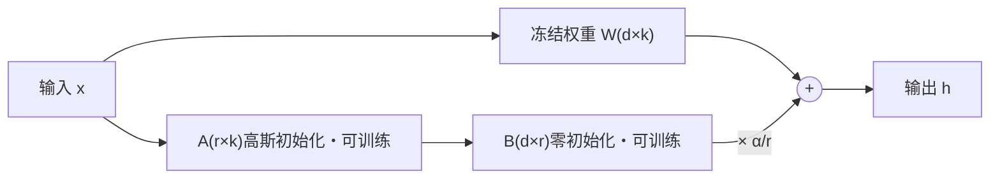

# LoRA(Low-Rank Adaptation)

> ⚠️ 旧版:本篇写于写作契约确立之前,尚未按新标准审查重写。标准见 docs/05-知识库写作契约.md,样板见「GPU架构与执行模型」。

一句话:**冻结原模型全部权重,只在若干权重矩阵旁并联一对可训练的低秩矩阵当"补丁"**——可训练参数量砍掉 99% 以上,微调显存从"集群级"降到"单卡级"。出自微软 2021 年的 LoRA 论文,是参数高效微调(PEFT)的事实标准。

## 一、动机与核心假设

全参微调一个 7B 模型,显存就不是单卡能讨论的问题(第四节算账)。LoRA 的立足点是一个经验观察:

**微调带来的权重增量 $\Delta W$ 的本征秩(intrinsic rank)很低。**

类比:给一张几百万像素的照片调色,表面上每个像素都变了,但真正被拧动的只有"亮度、对比度、色温"几个旋钮——变化发生在一个极低维的子空间里。微调同理:模型的能力在预训练时已经学成,微调多数时候只是"换个说话方式、对齐一下格式",用不着整个参数空间的自由度。

既然 $\Delta W$ 低秩,就没必要用完整的 $d \times k$ 矩阵去表达它,两个瘦长矩阵的乘积就够了:

- 全参微调 = 把整本字典重印一遍;
- LoRA = 在字典里夹一张勘误表,原书一个字不动,查的时候对照勘误表修正。

## 二、核心机制

对选中的权重矩阵 $W \in \mathbb{R}^{d \times k}$,冻结之,旁路一个低秩分解:

$$
W' = W + \Delta W = W + \frac{\alpha}{r} BA
$$

其中 $B \in \mathbb{R}^{d \times r}$、$A \in \mathbb{R}^{r \times k}$,秩 $r \ll \min(d, k)$。前向变为:

$$
h = Wx + \frac{\alpha}{r} B(Ax)
$$

三个设计细节都是高频考点:

- **初始化:A 高斯、B 置零。** 训练开始时 $BA = 0$,输出与原模型逐 token 一致——贴膜刚贴上时是全透明的,随训练慢慢"显影"。若 A、B 都随机初始化,起点就偏离了预训练模型,等于凭空注入噪声;若都置零,梯度恒为零训不动。
- **秩 r:补丁的容量。** 常用 8–64。越大表达力越强、可训练参数线性增多,但不是越大越好(第八节)。
- **缩放 α/r:固定的音量旋钮。** $\alpha$ 是常数,实践常取 $2r$(如 r=16、α=32)。除以 r 的直觉:r 翻倍后 $BA$ 的和式多了一倍的项,除以 r 抵消尺度膨胀,让不同 r 下的更新幅度大致可比——换 r 做实验时不必连学习率一起重调。

参数量一笔账:$d = k = 4096$、$r = 16$ 时,一个补丁是 $2 \times 4096 \times 16 \approx 13$ 万参数,只有原矩阵 1678 万的 0.8%。LoRA 论文在 GPT-3 175B 上把可训练参数压掉约一万倍,checkpoint 从 350GB 缩到 35MB。

## 三、挂在哪些层

原论文只挂 attention 的 q、v 投影;**现代实践是把所有线性层全挂上**(q/k/v/o + MLP 的 up/gate/down)。QLoRA 的消融支持这一点:总预算相同时,"低 r、全挂"比"高 r、只挂 attention"更稳、更接近全参效果。

一般**不挂** embedding 与 lm_head:参数占比大而收益小,词表维度上的低秩分解意义也不明确;只有任务需要新增 token 时,才单独把 embedding 放开训练。

## 四、为什么省显存:账本在优化器上

常见误解是"LoRA 省了模型权重的显存"——不对,基座权重无论训不训都得在卡上。**真正的大头是优化器状态和梯度。**

混合精度 + Adam 的每参数开销(显存全景拆解见知识库「ZeRO」篇):

| 项目 | 精度 | 字节/参数 |
| --- | --- | --- |
| 权重 | bf16 | 2 |
| 梯度 | bf16 | 2 |
| fp32 主权重 | fp32 | 4 |
| Adam 动量 m | fp32 | 4 |
| Adam 二阶矩 v | fp32 | 4 |
| **合计** | | **16** |

7B 全参:$7\text{B} \times 16\,\text{B} \approx 112\,\text{GB}$,还没算激活值,80GB 单卡直接出局。

Adam 相当于给每个参数配了两本账(m 和 v)外加一份 fp32 底稿;LoRA 把"记账范围"缩小到补丁参数(千分之几),基座只剩 2 字节/参数的只读权重:

- 基座 bf16:约 14 GB(只读,不记账、不存梯度);
- LoRA 参数 + 梯度 + 优化器状态:几十 M 参数 × 16 字节,零头;
- 合计约 15 GB + 激活值(可再用梯度检查点压)——24GB 消费级单卡可行。

## 五、推理:merge 还是不 merge

旁路结构在部署时有两种用法:

- **merge:$W \leftarrow W + \frac{\alpha}{r}BA$ 一次性加回去。** 网络结构与原模型完全一致,**零额外推理延迟**——这是 LoRA 相对 Adapter 系(串联小模块,必然加延迟)的核心卖点。
- **不 merge:基座与补丁分开放。** 一个基座 + N 个 adapter(每个几十 MB),按请求热切换,像一台游戏机插不同卡带——多租户/多任务的标准玩法。S-LoRA 把它做到极致:统一分页管理 adapter 显存 + 定制 kernel,单卡批量服务上千个 adapter。

## 六、QLoRA:把基座压到 4-bit 再训

LoRA 砍掉优化器账本后,瓶颈轮到基座权重本身(65B 的 bf16 要 130GB)。QLoRA 的做法:**基座量化成 4-bit 冻结,LoRA 补丁保持 bf16 照常训**。三件套:

- **NF4(NormalFloat4)**:预训练权重近似零均值正态分布,NF4 把 4 bit 的 16 个格子按标准正态的分位数摆放——高概率区间格子密、尾部格子疏,像地铁按客流量设站;在该分布假设下是信息论最优的量化格式,精度优于均匀的 INT4。
- **双重量化(double quantization)**:分块量化里每 64 个参数配一个 fp32 缩放常数,这些"刻度尺"本身要占约 0.5 bit/参数——把刻度尺再量化成 8-bit,又省约 0.37 bit/参数(65B 约省 3GB)。
- **paged optimizer**:借 CUDA 统一内存,显存尖峰时把优化器状态换页到 CPU 内存(操作系统虚拟内存的思路),防长序列偶发 OOM。

关键细节:**4-bit 只是存储格式,不是计算格式**。前向/反向时把用到的权重块即时反量化回 bf16 再做矩阵乘,算完即丢;梯度只流向 LoRA 参数,量化权重永远不更新。代价是每步多一次反量化,训练略慢。

成果:48GB 单卡微调 65B(Guanaco);论文报告 4-bit 基座 + LoRA 在其指令微调评测上追平 16-bit 全参微调——注意这与第八节的边界结论一致:对齐类任务本就是 LoRA 的强项。量化格式的更大图景:数据类型谱系(fp8/int4/NF4/MXFP4)见 量化 篇,GPTQ/AWQ 这类算法见 权重与激活量化 篇。

## 七、变体:DoRA / rsLoRA / LoRA+

| 变体 | 改动 | 直觉 |
| --- | --- | --- |
| DoRA | 把权重更新解耦为幅度 + 方向:每列范数单独学一个 magnitude 向量,方向增量用 LoRA 学 | 实测全参微调"改多大"与"往哪改"的模式和 LoRA 不同;解耦后更新行为更接近全参,低 r 下提升明显 |
| rsLoRA | 缩放因子 $\alpha/r$ 改为 $\alpha/\sqrt{r}$ | $\alpha/r$ 在大 r 时把更新压得过小(梯度被"除没了"),r 加大反而学不动;$\sqrt{r}$ 缩放让大 r 真正换来收益 |
| LoRA+ | A、B 用不同学习率,B 的 lr 更大(论文建议约 16×) | B 零初始化、A 高斯初始化,两者的适配速度天然不对称,绑同一个 lr 对宽模型是次优的 |

## 八、效果边界:learns less and forgets less

面试里最忌把 LoRA 吹成全参平替。「LoRA Learns Less and Forgets Less」在代码/数学的继续预训练与指令微调上做了严格对比,结论:

- **learns less**:目标领域效果普遍低于全参,数据量越大、领域偏移越大差距越大;继续预训练(注入新知识)场景差距尤其明显;
- **forgets less**:源领域通用能力保留显著好于全参,输出多样性也更高——低秩约束本身是一种强正则;
- **机理**:全参微调实际学到的 $\Delta W$ 并不那么低秩,有效秩比常用 LoRA 配置高 10–100 倍——大量新知识确实装不进低秩补丁;
- **实践口径**:格式/风格/对话/指令跟随类微调,LoRA ≈ 全参,放心用;新知识注入、大幅能力迁移,LoRA 有真实差距,单纯加大 r 也只能部分弥补(且大 r 要配 rsLoRA 式缩放,见第七节)。

## 九、常见坑

- **学习率要比全参大一档**:全参 SFT 常用 1e-5 量级,LoRA 常用 1e-4~3e-4。可训练参数少、B 从零起步,小 lr 训不动;直接沿用全参 lr 是"LoRA 没效果"的头号原因。
- **merge 与量化的顺序**:merge 必须发生在高精度权重上。想要量化推理时,正确顺序是"bf16 基座 merge → 再量化",把 adapter 直接加进 4-bit 权重是错的。QLoRA 训出的 adapter 还有一层细节:训练时对齐的是"量化再反量化"后的基座,merge 回原始 bf16 权重存在轻微不一致,上线前要评测确认。
- **存的是 adapter 还是 merged 权重要分清**:PEFT 默认只保存 adapter(几十 MB)+ 配置,部署必须配**同版本**基座,基座或 tokenizer 版本对不上会静默劣化;merge 后保存则是完整模型,与基座解耦但十几 GB 起步,且失去多适配器热切换能力。交付时务必写明是哪种。

## 十、面试考点串联

高频问法(与题库联动的切片点):

1. LoRA 原理、低秩假设为什么成立 →「动机 + 核心机制」
2. A/B 初始化为什么一个高斯一个零 →「核心机制」
3. r 与 α 的含义、除以 r 的缩放直觉 →「核心机制」+ rsLoRA
4. 挂哪些层、embedding/lm_head 挂不挂 →「挂在哪些层」
5. LoRA 到底省的是什么显存(优化器状态一笔账)→「显存账」
6. merge 与不 merge 的权衡、多适配器服务 →「推理」+ S-LoRA
7. QLoRA 三件套:NF4、双重量化、paged optimizer →「QLoRA」
8. LoRA 与全参的真实差距、什么任务能放心替代 →「效果边界」
9. LoRA 的 lr 怎么设、部署时 merge/保存的讲究 →「常见坑」

## 相关文献

- LoRA — [arXiv:2106.09685](https://arxiv.org/abs/2106.09685)
- QLoRA — [arXiv:2305.14314](https://arxiv.org/abs/2305.14314)
- DoRA — [arXiv:2402.09353](https://arxiv.org/abs/2402.09353)
- rsLoRA — [arXiv:2312.03732](https://arxiv.org/abs/2312.03732)
- LoRA+ — [arXiv:2402.12354](https://arxiv.org/abs/2402.12354)
- LoRA Learns Less and Forgets Less — [arXiv:2405.09673](https://arxiv.org/abs/2405.09673)
- S-LoRA — [arXiv:2311.03285](https://arxiv.org/abs/2311.03285)
