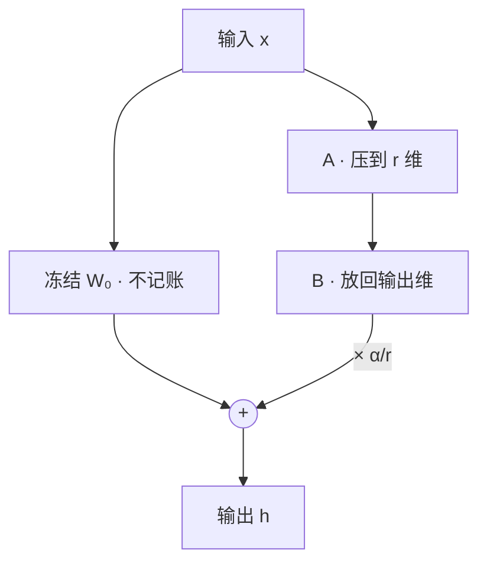

# LoRA(Low-Rank Adaptation)

一句话:LoRA 把微调从"改写整本权重"变成"在旁边挂一张低秩的勘误表"——原书一个字不动,查的时候对照勘误表修正;它省下的不是模型本身的显存,而是梯度和优化器状态那本账。

## 一、它到底省了什么

### 低秩假设与前向式

出发点是一个建模假设:**适配一个下游任务需要的权重变化 $\Delta W$,有用的方向数远少于矩阵的维度**。类比调照片:几百万个像素都变了,但你手上其实只有亮度、对比度、色温几个旋钮。既然只需要少数几个方向,就没必要用一个完整的大矩阵去存它,两个瘦长矩阵的乘积就够。注意这是**受实验支持的假设,不是定理**:它约束的是增量,没说基座权重本身低秩,也不保证任何任务都装得下。

对选中的权重 $W_0\in\mathbb{R}^{d_{\rm out}\times d_{\rm in}}$,冻结它,旁边挂一条支路:

$$
h = W_0 x + \frac{\alpha}{r} B(Ax)
$$

读法:输入 $x$ 同时走两条路。主路 $W_0x$ 是原模型,一个数没改;支路先用 $A\in\mathbb{R}^{r\times d_{\rm in}}$ 把 $x$ 压成 $r$ 维(相当于"这次任务只关心这 $r$ 个方向"),再用 $B\in\mathbb{R}^{d_{\rm out}\times r}$ 放回输出维度,乘上缩放系数 $\alpha/r$ 加到主路上。因为 $r\ll\min(d_{\rm in},d_{\rm out})$,乘积 $BA$ 的秩最多是 $r$——这就是"低秩"的全部含义。写成权重形式是 $W'=W_0+\frac{\alpha}{r}BA$,**加的是增量,不是把 $W_0$ 拆开**。

### 账本在优化器上,不在权重上

最常见的误解是"LoRA 省了模型权重的显存"——不对,**基座权重训不训都得在卡上**。真正被砍掉的是每个可训练参数背后那一串账:混合精度加 Adam 的口径是 **16 字节/参数**(bf16 权重 2 + bf16 梯度 2 + fp32 主权重 4 + 一阶矩 m 4 + 二阶矩 v 4)。Adam 为什么要额外记 m、v 两本账见 优化器 篇;这些状态怎么分摊到多卡见 ZeRO 篇。一算就清楚:7B 全参微调要 $7\times10^9\times16\approx112$ GB,还没算激活,80 GB 单卡直接出局。换成 LoRA,基座 bf16 约 14 GB 只读、不记账,可训练参数只有几百万到几千万,乘 16 字节是零头。LoRA 原论文在 GPT-3 175B 上把可训练参数压掉约一万倍,任务 checkpoint 从 350 GB 缩到 35 MB。

**但省下的不包括三样东西**:基座权重(仍要全量加载)、激活值(反向仍要保存,LoRA 支路自己还多存一份中间结果)、主干的前向与反向计算——冻结层不求参数梯度,却仍要把输入梯度往前传,否则更靠前的适配器收不到信号。所以**参数少一百倍绝不等于快一百倍**,流传的"快 2–10 倍"是配置相关的经验值,不是承诺。

## 二、为什么 A 高斯、B 置零

记 $s=\alpha/r$,任务损失对有效权重 $W'=W_0+sBA$ 的梯度为 $G$,链式法则给出:

$$
\nabla_A L = s\,B^{\mathsf T}G,\qquad \nabla_B L = s\,G A^{\mathsf T}
$$

读法:**每一边的梯度都要乘上另一边的当前值**。所以谁被置零,谁第一步就拿不到任务梯度。这一条把四种起点全解释了:

| 起点 | 初始增量 | 首步任务梯度 | 结论 |
|---|---|---|---|
| A 高斯、B 零(经典) | $BA=0$ | A 为零,B 可更新 | 起点与基座逐 token 一致 |
| A 零、B 高斯 | $BA=0$ | A 可更新,B 为零 | 同样合法,只是角色对调 |
| 两边都零 | $BA=0$ | 双零,永远启动不了 | 唯一真正的错误答案 |
| 两边都高斯 | $BA\neq0$ | 两边都能更新 | 起点已偏离基座,等于先注入噪声 |

- **起点为什么必须是零增量**?因为微调的起点就该是预训练模型本身。像贴膜,刚贴上时必须全透明,再随训练慢慢显影;起点自带随机扰动,等于先把模型弄坏再修。
- **反过来(A 零、B 高斯)会怎样**?它同样满足零增量,不会凭空产生扰动,只是首步换成 A 先动、B 后动,训练照样跑得起来。它不是错的,只是要重新调初始化尺度和学习率。The Impact of Initialization on LoRA Finetuning Dynamics 在它的宽度极限分析与实验里发现,A 随机 / B 零能用更大的学习率、平均效果更好;这是训练动态和尺度的差别,**不是"反向方案会卡死"**。
- **和 Kaiming/He 初始化什么关系**?两者管的事不同:He 按扇入和激活函数选随机权重的方差,目的是让信号逐层传播不放大也不衰减;LoRA 的零初始化管的是"新增残差在起点不改变基座"。两者可以叠加(A 用 He 式方差、B 置零),但没有一个高斯标准差能通吃所有模型——改 $r$ 时,随机矩阵尺度、$\alpha/r$ 和学习率要一起复查。

**怎么排查初始化异常**?固定输入、关掉 dropout 一类随机层,先比起始输出和基座是否逐 token 一致;再看 A/B 的梯度范数、增量 $\|sBA\|$、loss 和有没有 NaN/Inf。**首步单边零梯度是预期行为,不是 bug**;持续两边都零就去查冻结设置、计算图断没断、是不是真写成了双零;梯度异常放大则查尺度和学习率。

### 改进初始化:PiSSA、OLoRA、LoRA-FA

判断一个改进初始化合不合法只有一条:**有效权重在起点是否仍等于 $W_0$**,而不是"某一侧是不是零"。所以非零起点必须配一个冻结残差 $W_{\rm res}=W_0-sB_0A_0$,让 $W_{\rm res}+sB_0A_0=W_0$;不能一边保留完整的 $W_0$、一边又把主成分再加一遍。

| 方法 | 起点怎么造 | 想解决什么 | 代价与边界 |
|---|---|---|---|
| PiSSA | 对 $W_0$ 做截断 SVD,用前 $r$ 个主奇异方向构造 $B_0,A_0$(忽略缩放时可取 $B_0=U_r\Sigma_r^{1/2}$、$A_0=\Sigma_r^{1/2}V_r^{\mathsf T}$),余项留给冻结残差 | 让可训练分支从权重里最主要的方向出发,而不是随机方向 | 要做一次 SVD;主方向未必是这个任务需要的方向 |
| OLoRA | 对 $W_0$ 做 QR,用 Q 的前 $r$ 列、R 的前 $r$ 行构造 $B_0,A_0$,同样扣掉初始分支 | 引入正交基,改善条件与收敛 | 要做一次 QR;收益是实验结论,不是保证 |
| LoRA-FA | A 固定为随机、不训练,只训 B | 反向不必保存该层输入激活,省激活显存 | 更新被锁在 A 张成的固定子空间里 |

还有一种更轻的做法是只让随机 A 的行向量彼此正交、B 仍为零,零增量不变但方向冗余更少;它和 OLoRA 的基座分解不是一回事。另有两个高频误解要拆掉。其一,**LoRA-FA 不是双零的补救**:双零的病是梯度恒零,而 LoRA-FA 的 A 本来就是非零随机,它治的是激活显存。其二,**AdaLoRA、DoRA、QLoRA 都不是初始化技巧**:AdaLoRA 用随机 P/Q 加零对角系数凑零增量,DoRA 的幅度从基座范数初始化、方向分支沿用单零低秩起点,QLoRA 直接沿用 LoRA 的初始化,只是基座换成了量化的。顺带把邻近方法的起点摆一起看:经典 Adapter 把插入的残差模块初始化得接近恒等映射,Prefix-Tuning 的零前缀仍然会进 softmax 分母、并不自动等于"没影响",LLaMA-Adapter 则用零初始化的注意力门控把新增信号先关掉——**目标都是起点别扰动基座,但机制各不相同,不能互换着说**。

SVD 成本可以用随机化截断 SVD 近似,多做几轮子空间迭代更准也更慢,这笔时间要计进总训练耗时。实操顺序是:小数据或短训练先用经典初始化打基线,预算允许再上分解初始化,固定数据、秩与评测,分别调缩放和学习率再比。

## 三、秩、缩放与学习率:三个旋钮拧在一起

**秩 $r$ 是增量的容量**。参数量与优化器状态随 $r$ 线性涨;$r$ 太小装不下任务需要的变化,太大既多花显存也更容易拟合噪声。**验证效果不会随 $r$ 单调上升**,所以选秩的正确做法是固定数据、目标层和评测,把候选秩各跑一遍,比验证分、显存和耗时,不再涨就停。

**$\alpha/r$ 是支路的音量旋钮**。之所以要除以 $r$,是想让"换一个 $r$"不至于连带把增量的整体幅度也换掉,少调一次学习率。这里有个必踩的坑:**固定 $\alpha$ 去加大 $r$,缩放系数 $\alpha/r$ 会同步变小**,你以为在比容量,其实同时改了幅度——比较不同 $r$ 时必须把 $\alpha$ 和学习率一起记下来。rsLoRA 指出 $\alpha/r$ 在大 $r$ 时把更新压得过狠(梯度被"除没了"),改成 $\alpha/\sqrt{r}$ 才让大秩真正换来收益。至于"$\alpha$ 一定等于 $2r$""LoRA 学习率必须是全参的若干倍",都是口诀不是规则。**LoRA+ 则指出另一件事**:B 从零起步、A 从随机起步,两者的适配速度天生不对称,绑同一个学习率对宽模型是次优的,给 B 更大的学习率(论文实验取 16 倍量级)更合适。**LoRA dropout** 则在训练时随机丢掉支路输入的一部分、推理关闭,它可能缓解过拟合,也可能把本就不多的训练信号削掉,要和数据量、训练长度一起选。

### 调参顺序:先怀疑数据,再怀疑容量

顺序不能反,因为容量不足和数据不足在"效果差"上长得一模一样,但在曲线上不一样。步骤是:先查对话模板、回答掩码、截断和数据拆分(这几件事见 SFT 篇),做一次小样本过拟合检查——连几十条都记不住,说明训练信号根本没进适配器,调秩毫无意义;再固定数据与评测,比目标层组合和几个候选秩;最后联合搜 $\alpha$ 与学习率,再动训练步数和正则。

| 现象 | 更可能是 | 下一步 |
|---|---|---|
| 训练和验证都差 | 数据或优化错误,也可能容量真不够 | 先排除坏数据与掩码,再加秩、加目标层 |
| 训练在降、验证在升 | 过拟合,或数据覆盖不足 | 查噪声与覆盖,缩短训练、加 dropout、早停 |
| 小样本都拟合不了 | 信号没接上 | 查冻结、计算图、缩放是不是被写成零 |
| 加秩有收益但很快饱和 | 容量已够,瓶颈在数据 | 补可靠数据比继续加秩划算 |

想区分得更硬一点就做对照:**同样的预算,一边加秩、一边加数据,看验证收益哪边更陡**。增量的奇异值分布可以辅助观察秩用满没有,但它单独证明不了哪个 $r$ 最优。

## 四、挂在哪些层

选层选的是**在哪些矩阵、哪些深度添加 A/B**,基座始终冻结;顺手把 LayerNorm、embedding 或输出头也解冻,那是混合微调,不能一边说全冻结一边把这些原参数算进可训练量。各个位置改的东西不同:Q/K 改注意力**怎么分配权重**,V 改**被聚合的内容**,O 改多头结果**怎么汇总**,FFN 改**逐 token 的特征变换**。这能解释差异,却推不出固定优先级——两组公开实验就给了不同答案:LoRA 原论文在 GPT-3、固定可训练参数预算下比较注意力投影组合,**Q/V 组合较好**;QLoRA 论文在 LLaMA 7B / Alpaca 上则发现**只适配 Q/V 追不平全参,适配全部 Transformer 线性层才行**。两条都是有边界的实验结论,所以"挂哪层最好"没有理论保证。

正确答法是在相同参数预算下把候选各跑一遍:少量层配大 $r$ 对更多层配小 $r$、只低层对只高层对均匀分布;固定数据与评测,多次运行后比目标效果、原有能力、显存和延迟,结论只能说"在已测候选里更好"。什么时候值得试"只适配低层、冻住高层"?当输入域换了(新语种、新格式、新领域词汇)、但任务读出方式没变时——底层表示要重新对齐,上层的抽象和输出习惯还够用;反过来,任务本身变了(换输出格式、换判据),高层更可能是瓶颈。这是有依据的假设,不是任务清单,仍要靠对照实验定。显存特别紧时也要先定位瓶颈:减层或减秩省的是可训练状态,量化基座省的是权重,梯度检查点省的是激活(见 显存管理与OOM 篇),"只训最后两层"不是通用解。

### 线性层之外:嵌入、卷积与非线性

LoRA 要的不是"网络是线性的",而是**待更新参数能组织成一个有意义的矩阵**。在 $f(x)=\phi(Wx)$ 里改成 $\phi((W+sBA)x)$,激活函数原样保留,被低秩约束的只有 $W$ 的增量。

| 模块 | 能不能挂 | 边界 |
|---|---|---|
| 注意力 Q/K/V/O、FFN gate/up/down | 能,最常用 | FFN 矩阵通常更大,要按同参数预算比才公平 |
| 词嵌入 / LM Head | 能 | 离散索引不阻断权重梯度;但词表没变时参数大、收益小,一般先冻结,换词表或读出不匹配时再进候选 |
| 卷积 | 能 | 把卷积核按输出通道与其余维度展开后低秩化,须保持分组与空间结构;框架支持要单独确认 |
| LayerNorm 仿射、ReLU 等激活 | 直接训 / 不适用 | 仿射向量本来就小,直接训更简单;无参数激活没有可分解的权重 |

一句话边界:**可微只是必要条件**,给一个本来就小的参数硬套低秩,既不省参数也没收益。长上下文是另一个常见误会——**LoRA 不会自动扩展上下文窗口**,做长文适配得一并检查位置编码、训练长度和按长度分桶的评测,而且既看长文收益也看短文有没有退化,不能只看混合平均分。至于秩要不要每层一样,**AdaLoRA 把这条也放开了**:它用 $P\Lambda Q$ 参数化增量,训练中由梯度与权重的敏感度、平滑估计和不确定性算出每个奇异三元组的重要性,按逐渐收紧的全局预算屏蔽低分方向的对角系数,后段固定预算继续优化;它保留方向参数以便恢复,不需要每步对稠密权重重做完整 SVD。重要性只是分配依据,不是最优秩的理论保证。

## 五、参数量与显存怎么算

对一个 $d_{\rm out}\times d_{\rm in}$ 的目标矩阵,A 有 $r\,d_{\rm in}$ 个参数、B 有 $r\,d_{\rm out}$ 个,所以:

$$
N_{\rm LoRA}=\sum_{j\in\mathcal T} r_j\,(d_{{\rm in},j}+d_{{\rm out},j})
$$

$\mathcal T$ 是真正挂了适配器的矩阵集合。式子长这样的原因很直白:**两个瘦长矩阵各自贡献"秩 × 自己那一边的维度"**,所以参数量对 $r$ 线性、对维度也线性,而原矩阵是 $d_{\rm in}d_{\rm out}$ 的乘法关系——省下来的正是这个"加法换乘法"。方阵($d_{\rm in}=d_{\rm out}=d$)时简化成 $2rd$。额外解冻的 bias、嵌入或输出头要单独加上,不能漏。下面两笔账要能张口就算:

- 一个 $4096\times4096$ 的矩阵,$r=8$ 新增 65,536 个参数,是原矩阵 16,777,216 的 **0.39%**;$r=16$ 是 131,072,即 1/128。经典 MHA 的 Q/K/V/O 都是 $d\times d$,全挂每层 $8rd$、只挂 Q/V 每层 $4rd$;**GQA 的 K/V 是长方形,必须按真实形状重算**,不能套方阵公式
- LLaMA 7B(32 层、$d=4096$),只在每层 Q/V 挂:$r=8$ 时 $32\times4\times4096\times8=4{,}194{,}304$;$r=64$ 时 33,554,432,约占论文 6.7B 基座的 **0.50%**。这是从结构逐项加出来的,不是先猜"Q/V 占总参数百分之几"再估

显存的口径是另一本账:

$$
M\approx 2N_{\rm base}+16N_{\rm LoRA}+M_{\rm act}+M_{\rm workspace}
$$

单位字节,前提是 bf16 权重与梯度、fp32 主权重加 Adam 两个状态;换优化器或精度就要换系数。7B 加几千万 LoRA 参数大约 15 GB 的权重与训练状态,**能不能塞进 24 GB 卡完全取决于序列长度、批大小和实现**,光看参数账本推不出来。多卡更容易答错:**普通数据并行是每卡复制一份基座和训练状态,不能把上式直接除以卡数**;只有真做了参数/梯度/优化器分片才按分片范围摊,还要另加本卡激活、临时聚合缓冲和通信峰值(见 ZeRO 篇)。没给配置就报不出"多卡 LoRA 固定显存"这种数。

## 六、QLoRA:把冻结基座压进显存

LoRA 砍掉优化器账本之后,瓶颈轮到基座权重本身——65B 的 bf16 裸权重就要约 130 GB。QLoRA 的思路是:**基座量化成 4-bit 存着冻结,LoRA 分支保持高精度照常训**。三件套各管一件事:

- **NF4(NormalFloat 4-bit)**:预训练权重近似零均值正态分布,NF4 就把 4 bit 的 16 个格子按标准正态的**分位数**摆放,中间密、尾部疏,像地铁按客流密度设站。它是为正态分布定制的**非均匀码本**,不是"归一化浮点";它比 INT4 的均匀网格更贴合权重分布,只在权重确实接近正态时成立,不保证无损、也不保证每层都赢。要比就固定块大小与缩放,同时看权重重构误差和下游质量,没有"固定领先百分之多少"这种数
- **双重量化**:分块量化每 64 个权重配一个 fp32 缩放常数,这些"刻度尺"本身就占 $32/64=0.5$ bit/参数;把刻度尺再量化成 8-bit,省下约 0.37 bit/参数,65B 上约 3 GB。它压的是**元数据**,和"4-bit 存储 + 高精度计算"是两件事,自己也引入一层近似
- **分页优化器**:借 CUDA 统一内存,显存尖峰时把优化器状态换页到 CPU 内存(操作系统虚拟内存那一招),防长序列偶发 OOM。它管的是峰值,**修不了量化误差**

> 🖼️ 占位:标准正态密度曲线上标出 NF4 的 16 个分位点,与 INT4 的均匀网格叠放对比,直观显示"中间密、尾部疏"

**最关键的一句:4-bit 是存储格式,不是计算格式**。前向和反向时把用到的权重块反量化回计算精度再做矩阵乘,梯度经反量化后的权重传给 A/B,**冻结的 4-bit 编码本身不需要求梯度**。GPU 并不原生算 NF4,反量化要花时间,所以 QLoRA 省显存但不承诺更快。

**BF16 还是 FP16**?原论文用的是 BF16。BF16 的指数范围接近 FP32,不易溢出;FP16 尾数更细但动态范围窄,训练常要配损失缩放。选哪个看硬件和数值行为,不是"FP16 精度全面更高"。回答时把三件事分开说:A/B 的存储精度、矩阵乘的计算精度、优化器状态的精度。**块大小 64 同理,是配方不是最优值**。块越小越贴合局部分布、越抗异常值,代价是元数据更多、处理更碎;块越大越省元数据,却更容易被一个异常值把整块范围拉大。为什么不干脆用 INT8/FP8?因为它们每权重的编码位数大约是 4-bit 的两倍——显存够用、或者质量与算子支持更重要时,它们当然值得比。

QLoRA 论文在其指令微调评测上报告 4-bit 基座加 LoRA 能追平 16-bit 全参微调,并在单卡 48 GB 上微调 65B(Guanaco)。验证要分两步:**先单独测量化基座掉了多少点,再测微调收益**,否则分不清是量化的锅还是训练的锅。量化的通用原理(公式、粒度、PTQ/QAT、数据类型谱系)见 量化 篇,GPTQ/AWQ 这类算法见 权重与激活量化 篇。

## 七、合并、多适配器与部署

合并(merge)就是把增量真正算成权重改变量加回去:

$$
W' = W_0 + \frac{\alpha}{r}BA
$$

合并后矩阵**形状不变**,推理只做一次 $W'x$,那两次小投影、额外的 kernel 启动和中间张量全部消失。所以正确说法是**回到基座那一条矩阵乘路径**,而不是比原基座更快——秩很小时端到端差距本来就不大,实际收益取决于批大小、序列长度、算子融合和框架。合并前有四条检查,每条都对应一种线上事故。**基座必须匹配**:模型版本、权重修订、tokenizer、目标模块都要和训练时一致。**缩放不能漏**:$\alpha/r$ 以及实现里其他缩放约定都要应用上,不同库对 A/B 的形状和乘法方向定义不同,别凭变量名相加。**精度要够**:增量和加法在 fp32 一类足够稳的精度里算完,再转成推理 dtype。**做等价验证**:同一输入比合并前后的 logits 与生成结果,允许 dtype 级小误差,然后再跑任务指标。

**合并可逆吗**?看你留了什么:留着 $W_0$ 和适配器 checkpoint 就随时能卸载重来;只存了 $W'$、原始基座和 A/B 都丢了,就无法从一个矩阵里唯一还原出三者。**不可逆的是"只保存合并结果"这个选择,不是合并这个操作**。

**多适配器怎么办**?一个基座挂 N 个适配器(每个几十 MB),按请求切换分支,像一台游戏机插不同卡带。给每个任务各存一份完整合并模型,存储就变成 N 份基座,共享收益归零。工程上常见的组合是:热点适配器缓存合并副本、冷门的动态加载,同一适配器的请求分组批处理以减少切换。S-LoRA 把这条路做到极致——统一分页管理适配器显存加定制 kernel,单卡并发服务上千个适配器。想把多个任务**合成一个**是另一回事:$W_0+\sum_i c_is_iB_iA_i$ 可以试,但组合后的秩会涨、任务之间可能打架,而且**分别平均 A 和平均 B 并不等于平均增量**。

**量化基座上合并是个坑**。低位权重是"整数码 + scale"的形式,浮点的 $BA$ 不能直接加到整数码上。稳妥流程是:取到与训练时一致的有效基座权重 → 在足够高的浮点精度里反量化并加上增量 → 重新量化、校准、评测;再量化会引入新的舍入误差。还有一个更隐蔽的:QLoRA 训练时支路面对的是**反量化后的**基座,如果拿一个高精度原始基座去合并,起点就和训练时不是同一个权重,合并前后必须比 logits 和任务质量,不能只看文件存下来了没有。

先 LoRA 再全参也用得上合并:把有效权重合并回去,再解冻并重新配置优化器和学习率。这只是训练衔接,**不保证比同预算直接全参更好**。

## 八、选型:全参、小模型全参、软提示

### 和全参微调比

| 维度 | LoRA | 全参微调 |
|---|---|---|
| 可更新范围 | 只有目标层内秩不超过 $r$ 的增量 | 全部权重 |
| 训练状态 | 基座只读加少量可训练状态 | 全部参数的梯度与优化器状态 |
| 训练速度 | 省状态更新,主干前反向照算 | 多出全部权重的梯度与状态更新 |
| 任务副本 | 只存 A/B 与配置,依赖匹配基座 | 每个任务一份完整模型 |
| 部署 | 合并后与基座同形状 | 同架构同精度下计算规模相近 |

效果差多少**没有固定答案**:任务需要的更新超出当前秩、或落在没适配的模块上时,全参更好;数据少时 LoRA 的约束反而可能帮上泛化。"$r=64$""垂直领域""样本上万"都不是"必须全参"的判据。正确顺序是先排除坏数据和训练错误,再加秩、加目标层、试 DoRA(把权重拆成幅度与方向分别学)或 AdaLoRA,最后才拿全参当对照,同时看目标质量、原有能力退化和成本。

### 冻结基座为什么还会遗忘

这是本篇最容易答错的一问。**冻结保住的是"关掉适配器就能回到原模型",不是"开着适配器时行为不变"**。推理跑的是 $W_0+sBA$ 而不是 $W_0$,中间表示已经被改了。而且**低秩不等于小改动**:秩约束限制的是增量的方向数,完全不限制它的范数,$r=4$ 的增量照样可以有很大模长把输出推得很远。所以"秩小就不会遗忘"和"秩大必然遗忘"都是错的。QLoRA 也不额外提供知识隔离——关掉适配器恢复的是**量化后的**基座,量化误差本身就可能改变输出。

LoRA Learns Less and Forgets Less 在代码与数学的继续预训练、指令微调实验中观察到:LoRA 在它的设置下学到的目标领域能力少于全参,同时保留了更多源领域能力。这是同一枚硬币的两面(学得少所以忘得少),不是"LoRA 不会遗忘"。诊断要做三方对照:原始基座、量化后的基座、微调后模型,在目标任务和保留任务上分别比质量与错误类型,才能把量化损失和训练遗忘拆开。**遗忘的通用成因与 Replay 重放、EWC 参数约束这类防护手段见 SFT 篇**,本篇只负责"冻结为什么不管用"这一条。

### 小模型全参对大模型 LoRA

**没有按参数量或样本量划出来的分界线**,因为决定结果的是两件事的乘积:基座本身有没有这个能力,以及你允许它改多少。大基座可能已经具备任务所需知识,低秩增量只需改变调用与输出方式;小模型全参能调所有权重,却不会因此凭空拥有更强基座的能力。

| 比较点 | 小模型全参 | 大模型 LoRA |
|---|---|---|
| 可更新范围 | 所有权重 | 目标层内的低秩增量 |
| 训练账本 | 全部参数的梯度与优化器状态 | 状态少,但基座与激活更大 |
| 部署 | 能力够时更容易满足显存与延迟 | **合并之后仍是那个大基座,不会变小** |
| 主要风险 | 表示能力不够、过拟合 | 适配范围不够、开着增量时能力退化 |

条件化的例子:端侧抽取或分类,小模型全参已达质量要求时紧凑部署更划算;复杂问答要吃大基座已有的知识、服务预算又允许,先试 LoRA。比较必须同数据划分、各自调好参、记录训练预算与峰值显存,推理再固定精度、硬件、输入长度和并发实测延迟与吞吐。

### 和 Adapter、软提示类方法比

三类 PEFT 改的位置不同:Adapter 在层与层之间**插入**一个小型瓶颈模块(降维 → 非线性 → 升维),Prompt Tuning 只学**输入端**的一串连续提示向量(soft prompt),Prefix-Tuning 则给**每层注意力**提供前缀状态——后两者不是一回事。它们都冻结基座,但训练信号仍要穿过整个基座反传回去,**可训练参数少不等于训练计算少**。

| 比较点 | LoRA | Adapter(瓶颈模块) | Prompt Tuning |
|---|---|---|---|
| 改哪里 | 选定中间层的线性变换 | 层间插入的新模块 | 输入端的连续提示 |
| 参数量 | $\sum_j r_j(d_{{\rm in},j}+d_{{\rm out},j})$ | 瓶颈维度 × 两个投影 × 层数 | $md$($m$ 个提示位、$d$ 维嵌入) |
| 推理开销 | 可合并掉分支;多任务时保留分支 | 模块含非线性,通常合不回一个原矩阵,推理一直要过它 | 一直占着额外提示位置,吃注意力与 KV 开销 |
| 能力边界 | 受目标层与秩限制 | 有非线性容量,但动不了原权重 | 只从输入端引导,更依赖基座规模 |

**想在部署前把新增分支彻底去掉,只有 LoRA 有这个结构上的便利**;至于谁在任务上更好,要在相近训练预算下比效果和实测延迟,不能只按参数量选。

**100 个任务怎么存、怎么跑**?共享基座之外,每参数 $b$ 字节时分别是 $100\,b\,N_{\rm LoRA}$ 与 $100\,b\,m\,d$ 字节。举个配置:$m=20$、$d=4096$、$b=2$ 时,100 份软提示约 16.4 MB;LoRA 一份几十 MB,100 份是几个 GB 量级。但**只要给每个任务都存合并后的完整模型,就等于存 100 份基座,共享收益立刻归零**。两者都依赖匹配的基座与 tokenizer,不能跨模型直接迁移;只收文字的黑盒 API 没有连续向量和梯度接口,标准 Prompt Tuning 根本训不了。两者也可以混着训,但必须和各自单独的方案对照,证明多出来的参数与调参成本确实换到了收益。

## 九、面试考点串联

| 高频问法 | 本文哪一节 |
|---|---|
| LoRA 是怎么微调的?A、B 的形状和缩放系数各是什么?秩 $r$ 开大开小分别有什么影响? | 一、三 |
| 为什么 A 高斯、B 置零?反过来会怎样?两个都置零又会怎样,从梯度流动看是为什么? | 二 |
| 这套初始化和标准线性层的 Kaiming/He 是什么关系?训练里怎么发现初始化不当? | 二 |
| 除了高斯还有别的初始化吗?PiSSA、OLoRA 各解决什么问题?LoRA-FA 又改了什么? | 二(改进初始化) |
| 实际训练里 $\alpha$、dropout、学习率怎么设?怎么判断该加秩还是该加数据? | 三 |
| Q/K/V/FFN 挂哪一层最好,有理论保证吗?显存很紧时你会只训哪些层?怎么验证选层是不是最优? | 四 |
| LoRA 只能用在线性层吗?嵌入、卷积、非线性网络能不能扩?AdaLoRA 的动态秩怎么分? | 四(线性层之外) |
| 怎么推 LoRA 的额外参数量?拿 LLaMA 7B 估个具体数,再说说"参数省了"和"显存省了"差在哪 | 五 |
| QLoRA 为什么能在单卡 48 GB 上微调 65B?NF4 为什么比普通 INT4 更适合压权重? | 六 |
| 4-bit 存储和 4-bit 计算差在哪?梯度怎么穿过冻结的量化基座?双重量化到底量化了什么? | 六 |
| 为什么用 BF16 而不是 FP16?块大小改大改小有什么影响?为什么不干脆换 INT8/FP8? | 六 |
| 权重合并是怎么做的,为什么能省掉额外开销?合并可逆吗?量化基座上合并要注意什么? | 七 |
| 多个适配器要动态切换,还该不该合并?多个 LoRA 能直接加在一起吗? | 七 |
| LoRA 和全参微调怎么选?什么情况下大模型也得上全参? | 八 |
| 基座都冻结了,为什么还会遗忘?秩小是不是就不会遗忘? | 八(冻结基座为什么还会遗忘) |
| 同一个任务,小模型全参和大模型 LoRA 怎么选? | 八 |
| LoRA、Adapter、Prefix/Prompt Tuning 怎么选?100 个任务要部署,存储和推理成本怎么比? | 八 |
| LoRA 参数少一百倍,训练是不是也快一百倍?(补充题) | 一 |
| 先用 LoRA 训、再接全参,这么做有意义吗?(补充题) | 七 |

## 相关文献

- LoRA: Low-Rank Adaptation of Large Language Models — [arXiv:2106.09685](https://arxiv.org/abs/2106.09685)
- QLoRA: Efficient Finetuning of Quantized LLMs — [arXiv:2305.14314](https://arxiv.org/abs/2305.14314)
- The Impact of Initialization on LoRA Finetuning Dynamics — [arXiv:2406.08447](https://arxiv.org/abs/2406.08447)
- PiSSA: Principal Singular Values and Singular Vectors Adaptation of Large Language Models — [arXiv:2404.02948](https://arxiv.org/abs/2404.02948)
- OLoRA: Orthonormal Low-Rank Adaptation of Large Language Models — [arXiv:2406.01775](https://arxiv.org/abs/2406.01775)
- LoRA-FA: Efficient and Effective Low Rank Representation Fine-tuning — [arXiv:2308.03303](https://arxiv.org/abs/2308.03303)
- AdaLoRA: Adaptive Budget Allocation for Parameter-Efficient Fine-Tuning — [arXiv:2303.10512](https://arxiv.org/abs/2303.10512)
- DoRA: Weight-Decomposed Low-Rank Adaptation — [arXiv:2402.09353](https://arxiv.org/abs/2402.09353)
- A Rank Stabilization Scaling Factor for Fine-Tuning with LoRA(rsLoRA)— [arXiv:2312.03732](https://arxiv.org/abs/2312.03732)
- LoRA+: Efficient Low Rank Adaptation of Large Models — [arXiv:2402.12354](https://arxiv.org/abs/2402.12354)
- LoRA Learns Less and Forgets Less — [arXiv:2405.09673](https://arxiv.org/abs/2405.09673)
- S-LoRA: Serving Thousands of Concurrent LoRA Adapters — [arXiv:2311.03285](https://arxiv.org/abs/2311.03285)
- Parameter-Efficient Transfer Learning for NLP(经典 Adapter)— [arXiv:1902.00751](https://arxiv.org/abs/1902.00751)
- The Power of Scale for Parameter-Efficient Prompt Tuning — [arXiv:2104.08691](https://arxiv.org/abs/2104.08691)
- Prefix-Tuning: Optimizing Continuous Prompts for Generation — [arXiv:2101.00190](https://arxiv.org/abs/2101.00190)
- LLaMA-Adapter: Efficient Fine-tuning of Language Models with Zero-init Attention — [arXiv:2303.16199](https://arxiv.org/abs/2303.16199)
- Delving Deep into Rectifiers: Surpassing Human-Level Performance on ImageNet Classification(He 初始化)— [arXiv:1502.01852](https://arxiv.org/abs/1502.01852)
- LLaMA: Open and Efficient Foundation Language Models(表 2 架构参数)— [arXiv:2302.13971](https://arxiv.org/abs/2302.13971)
