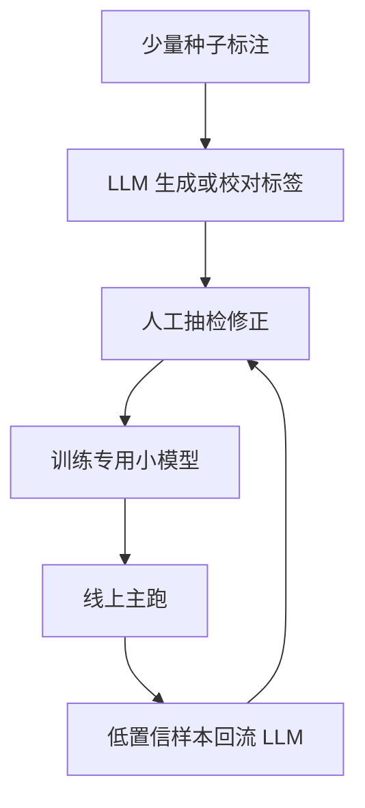

# NLP基础

一句话:分词、文本分类、NER、句法分析、机器翻译、问答这些「基础任务」的输入几乎都是一段文本,**真正把它们分开的是输出长什么样**——一个标签、每个位置一个标签、一段跨度、一棵树、还是一串自由文本;输出结构决定了模型怎么搭、指标怎么算,也决定了大模型时代哪些任务还值得留一个专用模型。

## 一、先立住:任务的区别在输出结构,所以指标不能统一

> **类比**:同样是批改作业,选择题看对错、填空题看有没有写对那个词、作文看整体好不好——不是老师偷懒不用一把尺子,而是答案的形状不同,一把尺子量不了。

| 任务 | 输入 | 输出结构 | 常用指标 |
|---|---|---|---|
| 分词 / Tokenization | 字符串 | 一串切分边界(词或子词序列) | 中文分词看词级 P/R/F1;子词切分看 fertility、OOV 率与下游效果 |
| 文本分类 / 情感 | 一段文本 | **一个**(或多个)标签 | Accuracy、Macro-F1、Micro-F1 |
| NER | token 序列 | 若干**跨度** + 类型 | 实体级 Precision / Recall / F1 |
| 句法分析 | 一句话 | 一棵**树**(依存边或成分括号) | UAS / LAS、成分 F1 |
| 机器翻译 | 源语言句子 | 目标语言**序列**,没有唯一正确答案 | BLEU、chrF、COMET + 人工评估 |
| 问答 | 问题(+ 段落) | 抽取式:一段跨度;生成式:自由文本 | EM / F1;事实性、引用支持率 |

**为什么不能拿一个生成指标(比如 BLEU)统一评价?** 因为指标必须和输出结构同形:树错一条边、实体少切一个字、分类判错一类,损失各不相同,而 BLEU 只会数「n-gram 重合了多少」,它既不知道什么是边也不知道什么是实体——把 NER 的输出拍平成字符串再算 BLEU,「边界切错一个字」和「整个实体漏掉」拿到的分数差不多,可下游系统拿到的都是一个错的实体。反过来,把翻译硬套 F1 也不行,因为翻译没有唯一标准答案,同义改写会被判错。**指标描述的是错误的形状,形状不同就得换尺子。** 还有一条通用的缝:这些指标几乎都不可微(先取 argmax 再数对错),训练用的是交叉熵一类代理目标,指标只在验收时用,原因见 损失函数 篇。

## 二、分词:字、词、子词三档,以及「算法」和「框架」是两层东西

### 三档各解决什么

| 粒度 | 它是什么 | 解决什么 | 代价 |
|---|---|---|---|
| 词级 | 按空格或词典切。**中文分词本身是一个任务**:通常做成给每个字打 B/M/E/S(词首/词中/词尾/单字词)标签的序列标注,评测看词级 P/R/F1 | 单元有明确语义,传统流水线(词性、句法)都建在词上 | 没见过的词只能变 `<unk>`;中文还要先解决边界歧义(「南京市长江大桥」) |
| 字 / 字节级 | 每个字符或每个 UTF-8 字节一个单元 | 永远没有 OOV | 序列长几倍,注意力按长度平方涨 |
| 子词 | 常见词整块保留、罕见词拆成常见片段 | 今天大模型的默认解:折中长度与覆盖 | 坑全在「切在哪」——数字、代码空白、低资源语言 |

这三档的机制、fertility 与词表缩放律,Tokenizer 篇已经写透;本篇只回答两个真题追问。

### BPE、WordPiece 是算法,SentencePiece 是框架

| 名字 | 层次 | 一句话 |
|---|---|---|
| BPE | 合并算法 | 从最小单元出发,反复把语料里**出现次数最多**的相邻对合成一个新符号(Sennrich 等 2015 年引入机器翻译) |
| WordPiece | 合并算法 | 同样是合并,但挑的是**合并后语料似然提升最大**的一对,实践上按 $f(ab)/(f(a)\,f(b))$ 打分——BPE 问「谁最常一起出现」,WordPiece 问「谁一起出现得比各自独立出现更不像巧合」 |
| Unigram | 剪枝算法 | 从大词表往下删,删掉后似然损失最小的先删 |
| **SentencePiece** | **工具框架** | 里面能装 BPE 也能装 Unigram;它解决的不是「怎么合并」,而是「不依赖任何语言的预分词器,直接在原始文本上训和切」 |

SentencePiece 为什么是框架不是算法?因为它改的是**输入约定**,不是合并准则:它把整句当成一串 Unicode 字符,**空格也当普通符号**(替换成元符号 `▁`,U+2581),于是中日文这种没有空格的语言和英文走同一条流水线,而且 `decode(encode(x))` 能精确还原原文——原论文管这叫 lossless tokenization。上一代工具(subword-nmt)要求输入先按空格切好词,这一步在中文上就不成立。所以「用 BPE 还是用 SentencePiece」这个问法本身错位:Llama 1/2 用的正是「SentencePiece 里的 BPE 实现」。合并表怎么训、推理时为什么切分唯一、BBPE 怎么消灭 OOV,见 Tokenizer 篇。

### 词表更大不等于低资源语言更好

BPE 的合并表只忠实反映训练语料的频次:**谁在语料里多,谁的合并就多**。把词表从 32K 扩到 128K,多出来的槽位仍按频次分配,低资源语言在语料里占千分之一,它分到的合并照样接近零——同一段文本在不同语言上的 token 数最多能差 15 倍,根因在数据配比不在词表大小(账见 Tokenizer 篇)。所以决定低资源语言切分质量的是四件事:**语料覆盖**(它的文本有没有进 tokenizer 的训练集)、**采样**(训词表时有没有给小语种升温采样,第五节的温度采样同样用在这一步)、**切分长度**(fertility 高就是上下文缩水、推理变慢、按 token 计费变贵)、**训练目标**(词表是给翻译还是给通用语言模型训的,最优切法不同)。词表大小只是其中一个旋钮,而且开大有参数与输出层的代价,见 Tokenizer 篇。

## 三、文本分类与 NER:一个标签,还是每个位置一个标签

### 文本分类:Macro-F1 与 Micro-F1 各对什么敏感

分类的输出是整段文本一个标签(情感、意图、主题),每个样本非对即错,所以 Accuracy 是天然指标——直到类别不平衡:99% 的样本是「中性」,全判中性就有 99% 的准确率。于是要看 F1,而 F1 有两种平均法,**差别在「先合并再算」还是「先算再平均」**:

| | 怎么算 | 对什么敏感 | 什么时候看 |
|---|---|---|---|
| Micro-F1 | 把所有类的 TP、FP、FN 加总,再算一个 P/R/F1 | **被大类主导**;单标签多分类下 Micro-F1 就等于 Accuracy(每个错样本恰好贡献一个 FP 和一个 FN) | 关心整体判对了多少条 |
| Macro-F1 | 每个类各算一个 F1,再取算术平均 | **每类权重相同**,一个小类塌方就把平均拉下来;小类样本少,分数抖动也大 | 关心少数类(欺诈、投诉)有没有被照顾到 |

所以报告分类结果时两个都报,再附各类召回——Macro 和 Micro 差得远,本身就是「大类好、小类差」的信号。类别不平衡在损失侧怎么处理(重加权、Focal、阈值与校准),见 分类损失 篇;用大模型做分类、标签常变时怎么落地,见 SFT 篇。

### NER 是序列标注:BIO 方案

NER 的输出是「哪几段是实体、各是什么类型」——跨度加类型。跨度不能直接当分类目标,经典做法是**把它转成每个 token 一个标签**:B-X 表示某个 X 类实体的开头,I-X 表示它的延续,O 表示不在任何实体里。为什么要区分 B 和 I?因为两个相邻的同类实体(「张三李四都到了」)如果只有 I-PER,就分不出是一个人还是两个人。变体 BIOES 再加上 E(结尾)和 S(单 token 实体),标签更多但边界更明确,Lample 等 2016 年的实验里它比 BIO 只好一点点、不显著。训练目标就是每个位置的交叉熵(见 分类损失 篇),或者 CRF 那种把整条标签序列一起打分的序列级负对数似然。

### 为什么用实体级 F1,而不是 token 级

因为下游要的是**一个完整的实体**,不是几个对的 token。CoNLL-2003 定下的口径至今是标准:一个预测实体**只有边界和类型都与标注完全一致才算正确**,在此基础上算 Precision(预测出的实体里对了多少)、Recall(标注的实体里找回多少)和 F1。token 级 F1 会给「北京大学」只标出「北京」这种错记大半分,可送进搜索或知识库的是一个错的机构名。于是各种错误在实体级怎么算分就清楚了:

| 错误类型 | 例子(标注:北京大学 / ORG) | 实体级怎么记 |
|---|---|---|
| 边界错 | 预测「北京」/ ORG | 一个 FP(多了个错实体)+ 一个 FN(标注实体没找回),**两头扣分** |
| 类型错 | 预测「北京大学」/ LOC | 同样一个 FP + 一个 FN |
| 嵌套实体 | 「北京大学」里套着「北京」/ LOC | BIO 给每个 token 只能一个标签,**表达不了嵌套**;要么换成「枚举所有跨度再分类」的 span 模型,要么按类型分别问(「文中的地点是?」);评测时每个标注跨度各算一个目标 |

Macro / Micro 的区别在 NER 里同样存在:Micro 按实体总数汇总(CoNLL 的官方口径),Macro 按类型平均——MISC 这种小类塌了,只有 Macro 看得出来。

### 经典做法各一句定位

| 做法 | 定位 |
|---|---|
| CRF | 手工特征 + 标签转移矩阵,转移矩阵天然禁掉 O → I-PER 这类非法序列;解码用 Viterbi |
| BiLSTM-CRF | 用双向 LSTM 学特征、CRF 管标签依赖,不用词典、不用手工特征;Lample 等 2016 年在 CoNLL-2003 英文上 F1 90.94 |
| BERT 微调 | 每个词取**第一个子词**的表示接一个分类头做 token 分类,连 CRF 都不用;BERT 论文报 CoNLL-2003 测试集 F1 92.4(BASE)/ 92.8(LARGE) |
| 生成式抽取 | 让 LLM 直接输出「实体 – 类型」列表或 JSON;不需要为每种类型训模型,代价是输出要解析、格式会飘、延迟高——第七节讲它和专用模型怎么配合 |

## 四、句法分析:输出是一棵树,所以解码也得是结构化的

### 两种树,两套指标

| | 依存句法 | 成分句法 |
|---|---|---|
| 树长什么样 | 每个词指向它的**中心词**(head),边上带关系标签(主语、宾语……),一句话恰好一棵以 ROOT 为根的树 | 把词组装成短语(NP、VP……)再层层套起来的**括号结构** |
| 指标 | **UAS**:有多少比例的词找对了 head;**LAS**:head 和边上的标签都对——LAS 永远不高于 UAS | **成分 F1**(PARSEVAL / evalb 口径):把树拆成一堆「带标签的括号」(跨度 + 标签),和标注的括号算 P/R/F1 |
| 量的是什么 | 每个词一条边,所以是**逐词**的准确率 | 每个短语一个括号,所以是**逐跨度**的 F1,和 NER 的实体级 F1 是一个思路 |

### 为什么需要结构化解码

如果让每个词独立挑一个 head(当成一个 $n$ 路分类),挑出来的边集合**不一定是树**:可能成环、可能两个根、可能有词悬空。树是全局约束,所以解码必须整体做,两条主流路线:

- **转移式(transition-based)**:像 shift-reduce 那样从左到右读词,每一步在「移进、把栈顶两个词连一条边」这几个动作里选一个,动作序列天然构造出一棵合法的树;线性时间,但早期的错会传下去,靠 beam search 缓解
- **图式(graph-based)**:先给每一对(词 $i$、词 $j$)打一个「$i$ 是 $j$ 的 head」的分,再在这张全连接图上找**得分最高的生成树**(非投影树用 Chu-Liu-Edmonds,投影树用 Eisner 动态规划);全局最优,代价是 $O(n^2)$ 次打分。Dozat 与 Manning 的 biaffine 打分器是这条线的代表,在英文 PTB 上 UAS 95.7 / LAS 94.1

对成分树,对应的是 CKY 一类的动态规划,思路相同:**局部打分、全局找合法结构**。这也是第七节的伏笔——树是「稳定结构约束」最典型的例子,让 LLM 自由生成很难保证输出是一棵合法的树。

## 五、机器翻译:BLEU 在算什么,为什么不够,低资源怎么办

### BLEU 在算什么

翻译没有唯一标准答案,所以 BLEU(Papineni 等 2002 年)不问「对不对」,而是问「译文里的 n-gram 有多少能在参考译文里找到」——它是一个**精度**指标,再配一个防止耍赖的惩罚项:

$$
\text{BLEU} = \text{BP} \cdot \exp\Big(\sum_{n=1}^{4} \tfrac{1}{4} \log p_n\Big),\qquad \text{BP} = \begin{cases} 1 & c > r \\ e^{\,1 - r/c} & c \le r \end{cases}
$$

这个式子说的是:分别数 1 到 4 元 n-gram 的精度 $p_n$,取几何平均;$c$ 是译文总长、$r$ 是参考译文总长,译文比参考短就按短的比例罚——因为精度指标天然偏爱短输出(只输出一个必对的词,精度就是 100%),要靠 BP(brevity penalty,短句惩罚)堵这个口子。$p_n$ 用的是**裁剪计数**:候选里某个 n-gram 出现的次数超过它在参考里的最大次数,多出来的不算,否则「the the the the」也能拿高分。几何平均意味着任一阶 $p_n$ 为 0 整体就是 0,所以 BLEU 是**语料级**指标,单句上没有意义。还有一条工程纪律:BLEU 的值随分词与大小写归一化的选择变化,Post 2018 年测出常见配置之间能差到 1.8 分,所以跨论文比 BLEU 必须用 sacreBLEU 这种带签名的标准实现。

### 为什么它和人工评估背离,chrF 与 COMET 各补了什么

BLEU 只看**表面重合**:它不知道同义词,也不知道语序换了之后还通不通。Callison-Burch 等 2006 年给了两类证据——同一句译文的词块有上百万种排列拿到相同的 BLEU,可其中大多数不成句;一个规则系统的 BLEU 明显落后于统计系统,人工评的质量却更高。今天的系统译文已经很流畅,BLEU 这种「数重合」的分辨率不够了,WMT22 指标评测的结论直接写进了标题:别再只用 BLEU,神经指标更好也更稳。

| 指标 | 补了什么 | 代价 |
|---|---|---|
| chrF(Popović 2015) | 把 n-gram 从词换成**字符**(默认 6 元),再算 F 值而不是精度:词形变化、拼写变体能拿到部分分,对形态丰富的语言和未见词更公平;原论文里 β=3(召回权重是精度的三倍)最好,sacreBLEU 实现的默认是 β=2 | 仍是表面匹配,不懂语义 |
| COMET(Rei 等 2020) | 用跨语言预训练模型同时读**源句、译文、参考**,在 WMT 的人工打分上训一个回归头,直接学「人会给几分」 | 要跑一个模型;训练数据没覆盖的语言对上要先和人评对一遍再信;分数只能比系统,绝对值没有解释 |

### 低资源翻译:为什么不能只靠扩词表

第二节已经说了词表:合并按频次分配,扩表不改变小语种的占比。真正起作用的是四件事,评测还要多一条纪律:

1. **增加可信的平行 / 单语数据**:平行句对是翻译的直接监督;单语数据多得多,用**回译**把它变成监督——用反向模型把目标语的单语句子翻回源语,拼成合成平行句(Sennrich 等 2016 年),源侧是机器译文、目标侧是真人文本,所以模型学到的输出仍然地道
2. **采样温度(多语言配比)**:多语言一起训时,按数据量采样会把小语种饿死。Arivazhagan 等训 103 种语言、204 个语向的单一模型,采样概率取 $p_l^{1/T}$——$T=1$ 是真实分布,$T=100$ 近似均匀,他们取 **$T=5$** 作为折中;温度调高则低资源语向涨、高资源语向掉,这是固定模型容量下的跷跷板。温度采样的一般机制见 数据工程 篇
3. **跨语言迁移**:和相关的高资源语言(同语系、同文字)联合训练,让低资源语向从共享参数里借表示;零资源语向也靠这条路
4. **词表**只是配合项:训 tokenizer 的语料同样要温度采样(Arivazhagan 等对词表语料也试了 $T$ = 1、5、100),否则小语种切得极碎

**评测要按语言对分开报。** 因为一个平均 BLEU 会被高资源语向拉高,低资源语向塌了看不见;而且 BLEU 的绝对值在不同语言对之间**没有可比性**(形态、分词都不同)——报「每个语向相对基线涨了多少」,再抽样人评,COMET 只在它覆盖的语言上用。

## 六、问答:抽取式与生成式的分野

| | 抽取式 | 生成式 |
|---|---|---|
| 输出 | 段落里的一段**跨度** | 自由文本 |
| 代表 | SQuAD:536 篇维基文章、107,785 个问题,答案必须是原文片段 | 开放式问答、长答案、要给依据的回答 |
| 指标 | **EM**(归一化后与任一标准答案完全一致的比例)和 **F1**(预测与答案的 token 集合重合,多个标准答案取最大);归一化去掉大小写、标点和 a / an / the | EM / F1 失效——同一个事实有无数种说法;改看**事实性**(每条可验证声明有没有依据)、**引用支持率**(引用是否真的支持那句话)、忠实度与拒答质量,该量哪几件事见 幻觉与事实性 篇 |
| 必答的坑 | SQuAD 1.1 里每个问题都有答案,模型学会「总能在段落里挑一段」;SQuAD 2.0 加了 5 万多条**无答案**问题,同一个强模型的 F1 从 86 掉到 66——**知道什么时候不答**是单独的能力 | 生成式同样要学拒答,而且要单独量 |

人在 SQuAD 1.1 上的 F1 是 86.8,原论文最强的基线只有 51.0;BERT 论文报的 SQuAD 1.1 测试 F1 是 93.2,已经高过排行榜上 91.2 的人类基准,研究重心于是转向无答案、多跳和开放域。**开放域问答**是「没给段落,先从大库里找」——检索器找出候选段落、阅读器从里面抽或生成答案,这套两段式结构今天叫 RAG;检索侧的指标与评测分层见 RAG评测 篇,检索器怎么训见 Embedding 篇。

## 七、大模型时代还要不要专用模型

### 统一成「指令 → 文本」省掉了什么

T5 把所有任务都写成文本进、文本出,指令微调再把「任务说明」也放进输入(怎么训见 SFT 篇),于是分类、NER、翻译、问答用**同一个模型、同一个接口、同一种损失**。省掉的是三样:每个任务一套标注数据加一个模型的**维护成本**;任务之间串联时的**流水线接口**(先分词再词性再句法再抽取,每一级的错误往下传);以及新任务的**冷启动**——写一句指令、给几个例子就能跑,不用等标注。

### 专用模型仍然赢的四种情况

| 情况 | 为什么专用模型赢 |
|---|---|
| **稳定的结构约束** | 树、BIO 序列、固定标签集,专用模型的解码器保证输出合法;LLM 生成的 JSON 会漏字段、编类型,要再写一层解析和校验 |
| **低延迟、高吞吐** | 一亿参数量级的 BERT 做分类是一次前向;LLM 逐 token 生成,长文本抽取要生成几十上百个 token,延迟与成本差一到两个数量级 |
| **端侧部署** | 手机、IoT 上装不下、跑不动 LLM,BiLSTM-CRF 量级的模型可以 |
| **严格的错误边界与可验证的中间结果** | 搜索、审计、规则系统要拿 NER、句法的结果继续算——结构化模块的输出能逐条核对、失败模式可枚举、能打补丁;LLM 的错误是概率性的,同一输入两次答案可能不同 |

实测也支持这条线:Ma 等 2023 年在信息抽取任务上比较,LLM 的 few-shot 在大多数设置下**效果、延迟、成本三项都不如微调过的小模型**,LLM 更适合给小模型拿不准的难样本做重排。

### 两条路怎么组合:LLM 当标注器和教师,小模型上线

UniversalNER 是这条路的样板:用 ChatGPT 给网页文本标实体,蒸出 7B / 13B 的 NER 专用模型,在 43 个数据集上零样本平均 F1 反超教师 7–9 分。所以「要不要专用模型」不是二选一——**LLM 解决冷启动和长尾,专用模型解决稳定、便宜、可验证**;判据是结构约束有多硬、延迟预算多少、数据够不够、错了谁负责。

## 八、资源受限:压缩的选型顺序与验收

追问「资源有限,怎么为一个具体任务压缩模型」,答案不是报菜名,而是**一个有顺序的排查**,每一步都在回答一个问题:

| 顺序 | 手段 | 它回答的问题 | 机制在哪篇 |
|---|---|---|---|
| 1 | **小模型全参微调** | 这个任务是不是窄到一个小模型就够?够就直接上,最便宜、最好部署 | LoRA 篇(小模型全参对大模型 LoRA) |
| 2 | **PEFT(LoRA 等)** | 小模型不够,是不是需要大基座已有的能力?LoRA 让你用一张卡试出这个答案,只训百分之一量级的参数 | LoRA 篇 |
| 3 | **蒸馏** | 大基座确实需要,但线上装不下——把它当教师,把行为压进一个能部署的学生 | 蒸馏 篇 |
| 4 | **量化** | 学生定了,再把位宽压下去换显存与带宽;放最后是因为量化误差要在一个固定的模型上量,先量化再训会把链路搞复杂 | 量化 篇 |

顺序的逻辑是**先便宜后昂贵、先回答「要不要大模型」再回答「怎么把大模型变小」**。验收的纪律只有一条:**同一份业务评测集**,把每个候选的精度(任务指标,且要看长尾与各类召回)、延迟(目标并发下的 p50 / p99)、成本(每千次请求的算力)摆在一张表里,而不是各报各的——蒸馏要专门覆盖长尾场景,量化要看任务成功率而不是困惑度,这两条 蒸馏 篇与 量化 篇各说过一遍。

## 九、F1、BLEU 在大模型评测里还适用吗

**适用,但只在它们量得了的那一段。** 判据回到第一节:指标要和输出结构同形。

- **固定结构的任务仍然用 F1 / EM / UAS**:让 LLM 做分类、NER、抽取式问答,先把输出解析成标签或跨度,再按老口径算——这些指标可复现、便宜、不带评委的主观偏差,而且和过去十年的结果可比。要多报一个数:**格式合规率**(有多少输出解析失败),它是 LLM 独有的失败模式,不能悄悄当成错答案混进 F1
- **翻译还是先用 BLEU / chrF 做回归测试,再用 COMET 与人评定结论**:BLEU 便宜、稳定,适合发现「这次改动把系统弄坏了」;但它分辨不出流畅译文之间的好坏,最终结论要靠第五节那套
- **开放生成必须换尺子**:对话、摘要、开放问答没有唯一答案,重叠指标基本失效。要补的是语义(BERTScore 一类用上下文向量算 token 相似度)、**事实性**(拆成原子声明逐条核)、**安全性**(有害输出率、该拒的拒了没)、**人工偏好**(成对盲测胜率)、以及 LLM-as-judge——judge 自带位置、长度、自我偏好三类偏差,必须先用人工校准集对一致率、只用来比版本不报绝对分,做法见 RAG评测 篇

## 十、面试考点串联

| 高频问法 | 本文哪一节 |
|---|---|
| 常见 NLP 基础任务有哪些?请说明分词、文本分类、NER、句法分析、机器翻译和问答的输入输出与常用指标 | 一(总表);二–六 逐任务展开 |
| 并讨论大模型时代是否还需要专用任务模型 | 七 |
| 大模型时代为什么还可能保留 NER 或句法分析模块? | 七(四种情况);四(树为什么需要结构化解码) |
| 资源受限时如何为特定 NLP 任务压缩模型? | 八 |
| F1、BLEU 在大模型评测中还适用吗? | 九 |
| BPE、WordPiece 与 SentencePiece 分别是什么? | 二 |
| 低资源语言的翻译质量应怎样改善和评估? | 五(四件事 + 按语言对分开报);二(词表为什么不是关键) |
| NER 为什么按实体算 F1 而不是按 token?边界切错一个字在指标上怎么体现?(补充题) | 三 |
| Macro-F1 和 Micro-F1 差得很远,说明了什么?该看哪一个?(补充题) | 三 |
| BLEU 到底在数什么?为什么译文越短它反而可能越高,它怎么防这一点?(补充题) | 五 |
| 依存句法为什么不能每个词各自挑一个 head 就完事?转移式和图式各怎么保证输出是棵树?(补充题) | 四 |
| 抽取式问答的 EM 和 F1 差在哪?为什么 SQuAD 2.0 加了无答案问题,模型分数掉那么多?(补充题) | 六 |
| 用 LLM 做 NER,除了 F1 还得报什么?为什么?(补充题) | 九 |

## 相关文献

- Bleu: a Method for Automatic Evaluation of Machine Translation(Papineni 等,ACL 2002)— https://aclanthology.org/P02-1040/
- chrF: character n-gram F-score for automatic MT evaluation(Popović,WMT 2015)— https://aclanthology.org/W15-3049/
- COMET: A Neural Framework for MT Evaluation — [arXiv:2009.09025](https://arxiv.org/abs/2009.09025)
- A Call for Clarity in Reporting BLEU Scores(sacreBLEU;配置差异可达 1.8 分)— [arXiv:1804.08771](https://arxiv.org/abs/1804.08771)
- Re-evaluating the Role of Bleu in Machine Translation Research(Callison-Burch 等,EACL 2006)— https://aclanthology.org/E06-1032/
- Results of WMT22 Metrics Shared Task: Stop Using BLEU – Neural Metrics Are Better and More Robust — https://aclanthology.org/2022.wmt-1.2/
- Neural Machine Translation of Rare Words with Subword Units(BPE 引入机器翻译)— [arXiv:1508.07909](https://arxiv.org/abs/1508.07909)
- SentencePiece: A simple and language independent subword tokenizer and detokenizer for Neural Text Processing — [arXiv:1808.06226](https://arxiv.org/abs/1808.06226)
- Improving Neural Machine Translation Models with Monolingual Data(回译)— [arXiv:1511.06709](https://arxiv.org/abs/1511.06709)
- Massively Multilingual Neural Machine Translation in the Wild: Findings and Challenges(103 语言、温度采样 T=5)— [arXiv:1907.05019](https://arxiv.org/abs/1907.05019)
- Introduction to the CoNLL-2003 Shared Task: Language-Independent Named Entity Recognition(实体级精确匹配 F1 的口径)— https://aclanthology.org/W03-0419/
- Neural Architectures for Named Entity Recognition(BiLSTM-CRF,CoNLL-2003 英文 F1 90.94)— [arXiv:1603.01360](https://arxiv.org/abs/1603.01360)
- BERT: Pre-training of Deep Bidirectional Transformers for Language Understanding(CoNLL-2003 测试 F1 92.4 / 92.8)— [arXiv:1810.04805](https://arxiv.org/abs/1810.04805)
- Deep Biaffine Attention for Neural Dependency Parsing(PTB UAS 95.7 / LAS 94.1)— [arXiv:1611.01734](https://arxiv.org/abs/1611.01734)
- SQuAD: 100,000+ Questions for Machine Comprehension of Text — [arXiv:1606.05250](https://arxiv.org/abs/1606.05250)
- Know What You Don't Know: Unanswerable Questions for SQuAD(SQuAD 2.0)— [arXiv:1806.03822](https://arxiv.org/abs/1806.03822)
- Exploring the Limits of Transfer Learning with a Unified Text-to-Text Transformer(T5)— [arXiv:1910.10683](https://arxiv.org/abs/1910.10683)
- UniversalNER: Targeted Distillation from Large Language Models for Open Named Entity Recognition — [arXiv:2308.03279](https://arxiv.org/abs/2308.03279)
- Large Language Model Is Not a Good Few-shot Information Extractor, but a Good Reranker for Hard Samples! — [arXiv:2303.08559](https://arxiv.org/abs/2303.08559)
- BERTScore: Evaluating Text Generation with BERT — [arXiv:1904.09675](https://arxiv.org/abs/1904.09675)
