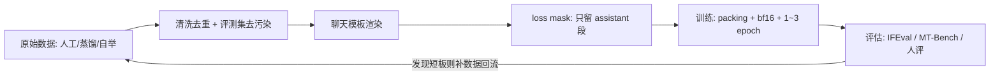

# SFT(Supervised Fine-Tuning)

> ⚠️ 旧版:本篇写于写作契约确立之前,尚未按新标准审查重写。标准见 docs/05-知识库写作契约.md,样板见「GPU架构与执行模型」。

一句话:**用「指令-回答」对做有监督微调**——预训练基座只会"文本接龙"(给上文补下文),SFT 拿成千上万条示范对话让它模仿,把它变成会听指令、按助手口吻答话的模型。类比:基座是博览群书但不懂应答的书呆子,SFT 是岗前培训——不重新教知识,只教"客人问话要答话,答话要有答话的样子"。

## 一、在训练全景中的位置

现代 LLM 训练三段式:**预训练 → SFT → 偏好对齐(RLHF/DPO)**。

| 阶段 | 学什么 | 数据 |
| --- | --- | --- |
| 预训练 | 语言与世界知识(读万卷书) | 万亿级 token 原始语料 |
| SFT | 指令遵循的格式与行为(学会应答) | 万级~百万级「指令-回答」对 |
| 偏好对齐 | 回答的好坏取舍(答得更合人意) | 偏好对比数据 / 奖励信号 |

关键认知:**SFT 教格式与行为,不主要注入新知识**。LIMA 把这称为"表面对齐假说"——模型的能力与知识几乎全部来自预训练,SFT 只是教它在众多"会说的话"里挑出助手该说的那种说法。想灌新领域知识应该用 continued pretraining(见「与 continued pretraining 的区别」一节),硬靠 SFT 塞知识容易学成背课文。

SFT 也是后续 RL 的地基:没有一个会按格式答题的 SFT 起点,RL 初期采样全是废样本(GRPO 篇讲的冷启动就是这件事)。

## 二、数据:质量 > 数量

### 三种来源

- **人工标注**:雇标注员按指令写示范回答(InstructGPT 路线)。质量上限高,最贵;
- **强模型蒸馏**:拿 GPT-4 级别的强模型生成回答当教材。便宜量大,但天花板是老师水平,还会继承老师的口癖与错误;
- **Self-Instruct 自举**:少量人工种子任务 → 让模型自己扩写新指令并作答 → 过滤后回流训练。Alpaca 就是这条路线的著名实践。

### 质量压倒数量

LIMA 只用 **1000 条**精心筛选的样本就完成了风格对齐,效果逼近大规模 SFT。类比:教孩子餐桌礼仪,10 顿饭的好榜样胜过 1000 顿边吃边玩手机的示范。脏数据(答非所问、格式混乱、事实错误)不是没用,是**负作用**——模型会忠实模仿错误。

### 多样性与任务配比

- **覆盖面**:问答、写作、代码、数学、翻译、多轮闲聊……像配营养餐,单一任务喂太多会"偏科",其他能力退化;
- **配比显式管理**:Tulu 3 的做法是按能力维度分桶、逐桶调配比并做消融验证;
- **难度分布**:全是简单题学不到东西,全是超纲题学出幻觉。

### 与评测集去污染

训练数据里混进 IFEval、MT-Bench 或考试类基准的题目 = 考前泄题,分数虚高、上线露馅。入库前要对评测集做 n-gram / 嵌入相似度匹配去重(decontamination),这是 Tulu 3 强调的标准工序。

## 三、模板与 chat format:loss mask 是灵魂

### 角色与特殊 token

训练前先把对话 JSON 用**聊天模板**渲染成一条 token 序列。以 ChatML 为例,system / user / assistant 三种角色用特殊 token 划界:

```text
<|im_start|>system
你是一个乐于助人的助手。<|im_end|>
<|im_start|>user
把这句话翻成英文:今天天气不错。<|im_end|>
<|im_start|>assistant
The weather is nice today.<|im_end|>
```

### loss 只对 assistant 段计算

SFT 的目标仍是 next-token 预测,但**只在 assistant 段的 token 上计损失**:

$$
\mathcal{L}=-\sum_{t \in \text{assistant}}\log p_\theta(y_t \mid y_{<t})
$$

system / user 段只作为条件(上下文)存在,不产生梯度。类比:批改作文只批学生写的正文,不批印在卷子上的题目——我们要模型学会"答",不是学会"问"。工程惯用实现:把非 assistant 位置的 label 置为 -100(PyTorch 交叉熵的 ignore_index),等价于 mask。

### 多轮对话的 mask

一条多轮样本里,**每一轮 assistant 回复都计损失**,穿插其间的 user 段照常 mask。也有实现只训最后一轮(前几轮当纯上下文),适合中间轮质量存疑的数据——两种都合法,但必须显式选择、全库一致。

### 经典事故:模板线上线下不一致

训练用模板 A 渲染,推理时用模板 B(少个换行、system 位置不同、漏了特殊 token)——模型看到的分布和训练时对不上,效果莫名其妙掉一截,而且极难排查。类比:培训时全说普通话,上岗后客人全讲方言。对策:模板写进 tokenizer 的 chat_template 随模型一起分发,训练推理共用同一份;上线前用同一条样本分别过训练 / 推理两条链路,逐 token diff。

## 四、工程细节

- **packing(样本拼接)**:SFT 样本长短不齐,padding 到定长会浪费大量算力;把多条短样本首尾拼进一条长序列(拼车),但要做两件事防"串台":**注意力隔离**(block-diagonal mask 或 flash-attention 的 varlen 接口,让样本互相看不见)和 **position id 重置**(每条样本的位置从 0 重新数);
- **序列长度**:按数据长度分布选(常见 4k / 8k),盖住绝大多数样本即可——过长浪费,过短截断的恰是最需要长上下文的样本;
- **超参基线**:lr 1e-5~2e-5(比预训练小约一个量级,轻拧螺丝不抡锤子)、cosine 衰减 + 少量 warmup、**epoch 1–3**——SFT 数据量小,多跑几轮很快过拟合;
- **全参 vs LoRA**:全参效果上限高、显存贵;LoRA 只训低秩增量,省显存、天然遗忘少,小数据 / 多任务切换场景常用(机制与超参详见 LoRA 篇);
- **精度**:bf16 是现代默认——动态范围与 fp32 相同,不易上溢,免掉 fp16 的 loss scaling 折腾。

## 五、灾难性遗忘与常见坑

### 灾难性遗忘

只拿窄领域指令数据猛训,模型会把预训练学到的通用能力忘掉一截——新话术背太狠,忘了老本行。缓解三板斧:

- **混入通用数据回放(replay)**:领域数据里掺一定比例的通用 SFT 数据,比例按验证集表现调;
- **小学习率**:降低对原有权重的扰动;
- **少 epoch**:见好就收,盯住通用能力评测不掉点。

### EOS 学不到,停不下来

如果渲染 / mask 时把 assistant 段末尾的结束 token(`<|im_end|>` 或 EOS)排除在 loss 之外,模型永远学不会"闭嘴"——推理时一路生成到 max length,答完了还在自问自答。教了说话,没教收尾。对策:**结束 token 必须计入 loss**(上面 ChatML 例子里 assistant 段的 `<|im_end|>` 要算),上线前专门检查生成能否正常停止。

## 六、评估:好不好,怎么知道

- **IFEval**:可程序验证的指令遵循——"写恰好 8 行""不许出现某个词"这类约束,脚本自动判分,便宜客观;
- **MT-Bench**:80 道多轮开放题,用强模型(如 GPT-4)当裁判打 1–10 分;注意 LLM 裁判自带长度偏好、位置偏好,结论要交叉验证;
- **人评**:金标准,常做 A/B 盲测算胜率;贵且慢,通常放在最后把关。

**过拟合信号**(SFT 特色病):验证 loss 回升只是其一,更典型的是行为层面——**风格僵化**(万物开头"当然!以下是……")、**多样性坍缩**(采样温度调高也千篇一律)、原样复读训练集短语。出现这些,先砍 epoch、查数据重复。

## 七、与 continued pretraining 的区别

同是"在基座上继续训",两者经常被混为一谈:

| 维度 | Continued Pretraining | SFT |
| --- | --- | --- |
| 目标 | 注入领域知识 / 语言 | 教指令遵循的格式与行为 |
| 数据形态 | 原始文档语料(无结构) | 结构化「指令-回答」对 |
| loss 范围 | 全部 token | 只有 assistant 段 |
| 数据量级 | 十亿级 token 起步 | 万级~百万级样本 |
| 类比 | 再读几年书 | 岗前培训 |

实践顺序:要补知识先 CPT,再 SFT 恢复对话能力——顺序反了,SFT 教好的行为会被 CPT 冲掉。

## 八、全流程一图



## 九、面试考点串联

高频问法(与题库联动的切片点):

1. SFT 在预训练与 RLHF 之间起什么作用、教格式还是教知识 →「训练全景」
2. loss mask 怎么做、为什么 user 段不计损失、多轮怎么处理 →「模板与 chat format」
3. SFT 数据怎么造、质量与数量怎么取舍(LIMA 结论)→「数据」
4. packing 的动机与注意事项(注意力隔离、位置重置)→「工程细节」
5. SFT 超参怎么定、为什么 epoch 只跑 1–3 →「工程细节」
6. 模型训完停不下来,查什么 →「常见坑:EOS」
7. 灾难性遗忘怎么缓解 →「灾难性遗忘」
8. SFT 与 continued pretraining 怎么选、能不能互替 →「与 continued pretraining 的区别」
9. SFT 效果怎么评、过拟合长什么样 →「评估」

## 相关文献

- InstructGPT(SFT→RM→RLHF 三段式对齐的奠基)— [arXiv:2203.02155](https://arxiv.org/abs/2203.02155)
- LIMA(1k 条精品数据完成风格对齐;表面对齐假说)— [arXiv:2305.11206](https://arxiv.org/abs/2305.11206)
- Self-Instruct(用模型自举生成指令数据)— [arXiv:2212.10560](https://arxiv.org/abs/2212.10560)
- FLAN(指令微调带来零样本泛化)— [arXiv:2109.01652](https://arxiv.org/abs/2109.01652)
- Tulu 3(现代 post-training 全配方:配比、去污染、全流程开源)— [arXiv:2411.15124](https://arxiv.org/abs/2411.15124)
