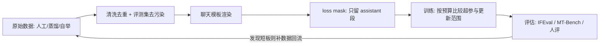

# SFT(Supervised Fine-Tuning)

> ⚠️ 旧版:本篇写于写作契约确立之前,尚未按新标准审查重写。标准见 docs/05-知识库写作契约.md,样板见「GPU架构与执行模型」。

一句话:**SFT 用「指令-回答」示范做有监督微调,让模型学会按要求组织回答。** 它以预训练能力为基础,也可能学入新知识;效果取决于示范数据、基座能力和更新方式。

## 一、在训练全景中的位置

现代 LLM 训练三段式:**预训练 → SFT → 偏好对齐(RLHF/DPO)**。

| 阶段 | 学什么 | 数据 |
| --- | --- | --- |
| 预训练 | 语言规律、知识和可迁移能力 | 大规模文本,监督标签从文本本身构造 |
| SFT | 指令遵循、任务执行和回答行为 | 经审核的「指令-回答」示范 |
| 偏好对齐 | 回答的好坏取舍(答得更合人意) | 偏好对比数据 / 奖励信号 |

关键认知:**SFT 常用于激发与组织已有能力,但“只教格式、不学知识”不是定律。** LIMA 的表面对齐假说及少样本结果来自其特定基座与评测,不能推出所有领域只需少量示范。大量新领域语料可考虑 continued pretraining,但是否需要全参更新仍须比较验证,不是由“知识注入”四个字决定。

以因果语言模型为例,两阶段都可用 next-token 交叉熵,主要区别是数据分布、训练起点和监督位置,不是“自监督损失”和“交叉熵”互斥。随机初始化后直接做少量 SFT 在数学上可行,但狭窄示范通常不足以建立语言与背景能力;已有基座也可能仅凭提示完成任务,是否需要 SFT 要比较效果与成本。

资源消耗由模型、训练 token、上下文和更新方式共同决定,不能用固定卡数区分阶段。以客服为例,先选择合适基座,必要时比较领域继续预训练,再用真实咨询与正确答复学习澄清和业务边界。SFT 还可为后续 RL 提供更好的初始回答分布,冷启动机制见 GRPO 篇。

## 二、数据:质量 > 数量

### 三种来源

- **人工标注**:雇标注员按指令写示范回答(InstructGPT 路线)。质量上限高,最贵;
- **强模型蒸馏**:拿 GPT-4 级别的强模型生成回答当教材。便宜量大,但天花板是老师水平,还会继承老师的口癖与错误;
- **Self-Instruct 自举**:少量人工种子任务 → 让模型自己扩写新指令并作答 → 过滤后回流训练。Alpaca 就是这条路线的著名实践。

### 质量压倒数量

LIMA 用 **1000 条**精心筛选的示范获得了其论文报告的效果,说明特定基座上少量可靠数据可能有效,不代表“一千条必胜十万条”。更多正确且补足覆盖的数据可以继续带来收益;风险来自错标、重复、分布失衡与过量更新。应固定训练预算比较候选集,同时看新任务收益和旧任务退化。

### 多样性与任务配比

- **覆盖面**:问答、写作、代码、数学、翻译、多轮闲聊……像配营养餐,单一任务喂太多会"偏科",其他能力退化;
- **配比显式管理**:Tulu 3 的做法是按能力维度分桶、逐桶调配比并做消融验证;
- **难度分布**:全是简单题学不到东西,全是超纲题学出幻觉。

指令数据的来源登记、任务边界、格式验收、分层抽检和合成质量闭环见 数据工程 篇。混入通用指令与混入原始预训练文本不是同一配置:后者要分别声明语言建模目标、聊天模板及损失位置,不能只给一个样本配比就声称保护了旧能力。

### 与评测集去污染

训练数据里混进 IFEval、MT-Bench 或考试类基准的题目 = 考前泄题,分数虚高、上线露馅。入库前要对评测集做 n-gram / 嵌入相似度匹配去重(decontamination),这是 Tulu 3 强调的标准工序。

## 三、模板与 chat format:loss mask 是灵魂

### 角色与特殊 token

训练前先把对话 JSON 用**聊天模板**渲染成一条 token 序列。以 ChatML 为例,system / user / assistant 三种角色用特殊 token 划界:

```text
<|im_start|>system
你是一个乐于助人的助手。<|im_end|>
<|im_start|>user
把这句话翻成英文:今天天气不错。<|im_end|>
<|im_start|>assistant
The weather is nice today.<|im_end|>
```

### loss 只对 assistant 段计算

SFT 的目标仍是 next-token 预测。常用的回答监督方案只在 assistant 段及其结束标记上计损失;设这些目标位置的 $m_t=1$,其余为 0:

$$
\mathcal{L}=-\frac{\sum_t m_t\log p_\theta(x_t \mid x_{<t})}{\sum_t m_t}
$$

也就是只平均有效回答目标的交叉熵,$x_t$ 是目标 token。可把其余位置的标签设为交叉熵忽略值(例如 `-100`),或对逐 token 损失乘掩码;整批无有效目标时应跳过,避免除零。

**system / user 没有直接预测损失,但它们的计算仍参与反向传播。** 回答会注意到提示词的隐藏状态,回答损失可以沿这条依赖更新共享权重。mask 掉标签没有执行 detach;删掉提示词会失去条件,截断其计算图则改变梯度。

误把 prompt 计入损失,等于额外训练模型预测用户输入,改变任务与目标权重;不应笼统称为“梯度污染”或保证效果变差。是否采用全序列监督可以实验比较,但必须与声明的目标一致。

### 标签、位移与注意力掩码

| 机制 | 控制什么 | 不能替代什么 |
|---|---|---|
| label mask | 哪些目标产生直接损失 | 不阻止读取提示词 |
| padding attention mask | 哪些填充位置不能被当作上下文读取 | 不自动删除这些位置的目标损失 |
| causal mask | token 不能读取未来位置 | 不区分 user 与 assistant 的监督责任 |

位置 $t-1$ 的输出预测 $x_t$。手算损失时将 `logits[:-1]` 与 `labels[1:]` 对齐;若调用的训练接口已完成位移,就不要重复位移。标签应依据渲染后的角色跨度生成,特别检查第一个回答 token。

例如序列 `[U1,U2,A1,A2,EOS,PAD]`,标签是 `[-100,-100,A1,A2,EOS,-100]`;U2 位置的输出负责预测 A1。即便 EOS 和 PAD 使用相同 ID,也应按真实长度区分,保留回答的结束监督。验证时解码有效标签,确认角色边界、首 token、结束标记和有效计数。

### 自回归损失与大词表

训练通常以真实前缀并行预测下一词元,因果掩码避免读取未来。单个目标的交叉熵等于“全词表 log-sum-exp 减去真实词元 logit”,对 logits 的梯度是预测概率减去独热目标,因此提高训练序列的条件似然。实现可直接用目标索引,无需显式构造 one-hot。对 token ID 作 MSE 没有合理的类别距离含义;概率 MSE 与交叉熵的梯度和目标不同,不能把离散token编号间的数值差当作语言误差。

大词表会产生很大的 token×词表 logits。可通过分块或融合计算正确词元 logit 与全词表 log-sum-exp,避免保存完整中间矩阵;Cut Cross-Entropy 给出了这种前向计算方式。词表分片时需正确的全局归约,采样 softmax 等近似则要另评目标或估计误差。padding 仍按有效目标归一化,标签 mask 与注意力可见性不能互相代替。

### 多轮对话的 mask

一条多轮样本可监督**所有高质量 assistant 回复**,也可只监督末轮、把前几轮当条件。前者充分利用样本,后者适合只审核了末轮的数据。两种都合法,要明确配置,不能凭字符串 “Assistant:” 在正文中猜角色边界。

### 多轮上下文、训练与一致性

多轮消息先保存为带角色的结构化列表,再按时间顺序渲染;工具调用与结果也有独立边界。`user1 → assistant1 → user2 → assistant2` 的目标掩码是 `0 → 1 → 0 → 1`,但所有位置仍遵守因果可见性:只能读取自身及之前,不是双向全可见。

长历史要按 token 预算保留 system、当前请求和回答所需证据;优先按完整轮次截断,早期关键事实可做摘要或检索补回。若删掉了目标答案的依据,应重写目标或去掉样本。跨会话打包必须隔离注意力,不能仅靠分隔符阻止信息泄漏。

客服要保留订单状态与澄清条件,角色扮演保留身份和状态,代码助手保留被修改的代码版本。按长度和轮数分桶采样,避免短对话占满训练;打包改善利用率,窗口长度按真实依赖评估,没有“4K–8K覆盖所有业务”的结论。

评测要覆盖跨轮指代、早期事实召回、条件更正、换话题和自相矛盾,结合任务成功率与人工审阅。缓解意图漂移,应补充用户改主意、明确更正和需要澄清的示范,让模型更新当前目标并保留仍有效的事实。扰动历史后要重新核验答案,不连贯响应不能直接当作正例做 SFT。

### 经典事故:模板线上线下不一致

训练用模板 A 渲染,推理时用模板 B(少个换行、system 位置不同、漏了特殊 token)——模型看到的分布和训练时对不上,效果莫名其妙掉一截,而且极难排查。类比:培训时全说普通话,上岗后客人全讲方言。对策:模板写进 tokenizer 的 chat_template 随模型一起分发,训练推理共用同一份;上线前用同一条样本分别过训练 / 推理两条链路,逐 token diff。

## 四、工程细节

### 超参数与结果背离怎样诊断

先固定数据、模板和新旧能力评测,检查小样本能否学会,再依次筛学习率、有效 batch、训练量和 LoRA 容量。学习率太大可能漂移或发散,太小则预算内学不够;微批决定激活峰值,累积与数据并行决定有效 batch;重复轮数是否过多要看独立验证和旧能力,不背固定配方。

验证 loss 下降而任务指标变差时,先核对解码、评价脚本和污染,再按任务与长度分组看是否只学会高频短答或格式。按真实验收指标选检查点。LoRA 还需联合比较 rank、alpha 与目标层;省下参数状态不代表激活也按比例减少。

- **packing(样本拼接)**:SFT 样本长短不齐,padding 到定长会浪费算力;把多条短样本拼进长序列,可用分块因果掩码隔离会话。位置编号通常按独立序列处理,但位置重置不能代替注意力隔离;
- **序列长度**:按长度分布与真实依赖选,检查截断是否删除答案依据;更长会增加激活与计算,只覆盖多数短样本也可能漏掉关键任务;
- **超参基线**:从可复现设置出发,比较学习率、有效 batch、训练量和调度。有效 batch 不是越大越好,梯度累积还会改变更新频率;用独立任务指标和验证损失选择检查点,不设固定轮数或早停耐心值;
- **全参 vs LoRA**:全参允许调整全部权重,LoRA 只训低秩增量,减少可训练参数及其梯度、优化器状态;激活和基座计算仍有成本。两者效果与遗忘程度都要实测,不能由参数量直接推出(机制与超参见 LoRA 篇);
- **精度**:bf16 是现代默认——动态范围与 fp32 相同,不易上溢,免掉 fp16 的 loss scaling 折腾。

实施时先定业务验收与新旧基线,再用少量样本检查模板、有效标签、EOS 和训练链路,之后才扩大训练。记录数据版本、配置、检查点与评测;显存不足时区分状态、激活和临时缓冲,分别比较 PEFT/ZeRO、重算与微批调整,不要同时堆选项后猜哪项有效。

LoRA 的秩从预算允许的候选范围验证,当新任务欠拟合且其他瓶颈已排除时再扩大;没有普适的 r、alpha/r 或目标层组合,机制见 LoRA 篇。QLoRA 冻结以 4-bit 存储的基座,通过较高精度计算训练适配器。应比较原基座、量化基座与微调模型;量化误差在关键任务造成不可接受退化时再提高精度,不能用固定任务黑名单选型。

### RAG 生成器的监督微调

RAG 的示范要让答案依赖提供的证据。输入分开标记问题、文档 ID、内容及必要的时间和来源,输出给出受支持的结论与引用;证据不足时澄清或拒答。例如财报问答须匹配公司和年份,不能因实体名相同就复制邻年数字。长上下文应检查证据截断和位置敏感性。

用实际检索结果构造正例,再加入无关、同主题但无法回答的文档、重复项和顺序变化。自动负例可从高分非支持文档及可控的实体/时间扰动中产生,但要核验并抽检,避免把另一条有效证据当作负例。**干扰上下文可以是负例,监督答案仍须正确**;删掉关键证据后也要修改目标。冲突信息按证据可信度、时间和任务规则处理,不能只因与模型旧知识不同就拒绝。

回答 token 交叉熵是基线,引用标记可纳入答案监督。相关性分类或排序属于可选辅助目标,需要标签、明确的输出或分类头以及损失权重;不是普通 SFT 自带的功能。可先固定检索器训生成器,再用支持文档标签或经审核的反馈训检索器,更新检索结果后继续训练;文档编码器变化时须刷新索引。普通离散 top-k 不可直接对文档选择求常规梯度;原 RAG 论文近似边缘化候选文档,联合更新查询编码器与生成器,文档编码器和索引保持固定。

验收分别看召回、答案正确和相关、断言的证据支持及引用准确性。对比真实检索、理想证据、无证据和不同干扰比例,加入未见实体、证据删除、顺序扰动和可信事实替换,看答案是否合理随证据变化。忠于上下文不等于外部事实真实,NLI/LLM 评分也只是辅助核验信号。

## 五、灾难性遗忘与常见坑

### 灾难性遗忘

窄领域训练只优化当前数据,可能改变原来有用的决策方式,导致通用能力或旧任务表现下降。保留新、旧及通用能力验证集,分别看收益和掉点,再调整学习率、训练轮数与保留机制。

### 参数高效微调仍可能遗忘

冻结基座让原权重保持不变,但**加上可训练增量后的模型函数仍会改变**。少量参数也可能显著改变输出,PEFT 不提供不遗忘保证。保留每个任务的独立适配器可以切回旧行为;持续更新同一个适配器,则仍会覆盖它先前学到的内容。

较大的秩允许更充分适配新任务,也允许更多改变,但遗忘不随秩单调变化。比较不同秩时还要控制学习率、训练量和目标层,同时报告新旧任务结果,不能把参数冻结当成函数不变。

| 方法 | 训练什么、主要取舍 |
|---|---|
| LoRA | 训练低秩增量;可在条件允许时合并为普通权重,减少部署分支 |
| Adapter | 插入小型瓶颈模块;便于独立保存任务模块,但多出前向运算 |
| Prefix-tuning | 学习供注意力读取的前缀表示;增加前缀相关的注意力与 KV 开销 |
| BitFit | 只训练偏置或其子集,不是训练整个 LayerNorm;可调容量很有限 |

需要新知识时,先区分“已有能力没被激发”与“基座缺少知识”。后者可比较领域继续预训练、增加高质量 SFT、检索以及扩大可训练容量,没有“知识注入必用全参”的定律。LoRA 的秩选择、合并与 Adapter 开销比较见 LoRA 篇;这里关注遗忘边界。

### Replay:重新提供旧任务信号

经验重放(ER)保存代表性旧样本,与新数据混训;生成重放则使用旧模型产生的伪样本。前者需数据存储和访问权限,后者增加生成成本与错误累积,也不能自动消除隐私风险。以客服新增业务为例,训练新业务问答时仍采样原业务问答,避免所有更新只服务新业务。

常用目标是新旧损失的加权平均。旧数据太少,保护信号不足;旧数据太多,会挤占学习新任务的预算。应固定新旧验证集比较候选比例,并按任务与难度维护缓冲区;不同回答长度、采样频次和损失归一化都会改变实际权重,不能只报告样本比。

LoRA 可冻结基座,让新旧样本共同更新当前适配器;省的是可训练状态,不是重放的前后向计算。GEM 用各旧任务记忆梯度限制新梯度方向,A-GEM 改为平均记忆目标的约束;两者依赖有限记忆与局部近似,不能保证所有旧任务测试损失不升。

### EWC:限制重要参数偏移

EWC 用旧任务参数 $\theta^*$ 作锚点,用 Fisher 对角项 $F_i$ 近似参数重要性,在新任务损失上加二次惩罚:

$$
\mathcal L=\mathcal L_{\text{新}}+\frac{\lambda}{2}\sum_i F_i(\theta_i-\theta_i^*)^2
$$

同样移动一步,越重要的参数代价越大;这是限制移动的软约束,不是冻结。$\lambda$ 越大越重视保旧,也越可能妨碍学新。其贝叶斯解释是用局部高斯近似旧任务的参数后验,以 Fisher 对角近似精度。

Fisher 估计需要旧任务似然的梯度,不只是前向传播。按样本计算梯度平方再平均,与“先平均梯度再平方”不同;若使用真实标签的经验估计,也要承认它与模型分布下的精确 Fisher 有差别。对角化、旧数据抽样、分层累计或仅估计可训练参数都能降低成本,同时损失近似精度。

普通 L2 通常拉向零,以旧权重为中心的统一 L2 也不区分重要性;EWC 则逐参数加权。只在冻结基座上施加 EWC 没有效果;与 LoRA 组合时可固定同一适配器参数化,保存旧因子并估计它们的 Fisher。改变秩、重初始化或合并后,不能直接沿用旧因子的统计量;这也是近似方案,需重新评测。

### 保留机制怎样取舍

| 方法 | 保留什么 | 主要边界 |
|---|---|---|
| Replay | 旧样本或生成样本 | 存储、敏感信息、计算和采样偏差 |
| EWC | 旧参数锚点与重要性 | 局部近似、额外状态和可塑性下降 |
| LwF | 旧模型在新输入上的输出 | 不必保存旧样本,但新输入未必覆盖旧分布,还需教师计算 |
| Progressive Networks | 冻结旧分支,新增分支并连接旧特征 | 旧路径保留,但模型规模随任务增长,需选择任务路径 |

方法可组合,没有对所有任务都更优的选项。选择时同时比较新任务表现、旧任务遗忘、额外存储和训练成本。

EWC 必须先保存旧参数锚点和旧任务重要性,旧数据不可再访问不等于可以没有旧统计。Replay 可用固定容量缓冲区,代价是任务增长时覆盖受限;LwF 教师可以预计算或卸载,并非必须常驻显存。新旧分布差异很大时,根据旧信号可得性比较回放与正则,任务边界明确则比较独立路径;没有只看分布距离就能决定的赢家。

严格保留旧行为时,可冻结旧检查点或独立适配器及其模板、依赖,显式路由旧请求,并回归旧路径、验收新路径。共享模型即使通过有限测试也不能保证所有旧输入行为不变;独立模块也要防路由错误。任务相近且希望共享迁移时,统一多任务训练可能更合适,需要权衡冲突、配比和版本管理。

### EOS 学不到,停不下来

如果渲染 / mask 时把 assistant 段末尾的结束 token(`<|im_end|>` 或 EOS)排除在 loss 之外,就失去了在示范终点停止的直接监督,可能出现答完后继续生成。对策是保留正确的结束监督,并核对推理的停止配置;EOS 与 PAD 同 ID 时按有效长度区分,上线前检查能否正常停止。

## 六、评估:好不好,怎么知道

- **IFEval**:可程序验证的指令遵循——"写恰好 8 行""不许出现某个词"这类约束,脚本自动判分,便宜客观;
- **MT-Bench**:80 道多轮开放题,用强模型(如 GPT-4)当裁判打 1–10 分;注意 LLM 裁判自带长度偏好、位置偏好,结论要交叉验证;
- **人评**:金标准,常做 A/B 盲测算胜率;贵且慢,通常放在最后把关。

**过拟合看当前任务的训练与验证差距,遗忘看固定旧任务相对训练前的退步**,两者可以同时发生。复读训练短语、单一文风和验证 loss 回升可作排查线索,但不能仅凭一种输出行为下结论。

固定互不泄漏的新任务、旧任务与通用能力测试集,保留基座或旧任务历史最佳成绩,逐检查点报告新收益与各旧任务掉点,不要只看平均总分。业务先给出旧能力容忍范围,再选择满足约束的新任务结果。必须全参微调时,先验证数据和模板,按同预算比较学习率、训练量、回放与正则的消融,依新旧指标早停和回滚。

出现明显通用退化,先排除模板、评测条件或量化变化,再查领域配比与更新强度。假设商品标题模型只会复读促销话术,可检查重复并补非促销场景,比较同预算下新任务泛化与旧能力;这只是设计示例,真实复盘须提供自己的基线、数据改动和测量结果。

## 七、与 continued pretraining 的区别

同是"在基座上继续训",两者经常被混为一谈:

| 维度 | Continued Pretraining | SFT |
| --- | --- | --- |
| 目标 | 注入领域知识 / 语言 | 教指令遵循的格式与行为 |
| 数据形态 | 原始文档语料(无结构) | 结构化「指令-回答」对 |
| loss 范围 | 通常覆盖有效文本位置 | 常只监督 assistant 段及结束标记 |
| 更新方式 | 通常更新全参,也可比较受限更新 | 全参或参数高效微调,按任务验证 |
| 类比 | 再读几年书 | 岗前培训 |

一种常用顺序是先用 CPT 适配领域语料,再用 SFT 学领域问答。CPT 可能影响已有对话行为,所以每阶段都要评测,不能把顺序当作效果保证。

### Few-shot 提示与参数微调怎样选

Few-shot 将示范放入上下文,通常不更新参数;SFT 将可靠示范用于参数更新。前者便于快速换任务,但有示例整理、输入窗口、prefill 和 token 成本;后者有训练与维护投入,可能缩短后续提示,也可能增加适配器开销。先建立提示基线,任务稳定且有可靠数据、提示已到质量或成本瓶颈时再比较微调,按预期请求量一起核算投入,没有固定样本门槛或效果排名。

提示不稳先查示例正确性、相关性、类别覆盖、顺序和输出模板。合适的推理任务可比较思维链示范;Self-Consistency 采样多条推理路径后聚合答案,增加生成成本,多数一致也不保证正确。微调后仍可用 system 约束、动态示例和检索证据处理最新需求,保持模板兼容。多任务是保存独立 LoRA 还是统一训练,按上文保留机制、路由与共享迁移的取舍验证。

## 八、全流程一图



## 九、面试考点串联

| 问法 | 来源 | 本文小节 |
|---|---|---|
| 预训练与 SFT 的目标、数据、资源有什么异同,为何通常不从随机初始化只做少量 SFT? | P002-Q009,仅 SFT 分工;P002-Q039 主问及追问 | 一、在训练全景中的位置;质量压倒数量;Few-shot 提示与参数微调怎样选 |
| PEFT 为什么省资源却仍会遗忘,缺少知识、必须全参或严格保留旧能力时怎样选并验证? | P002-Q008、Q089、Q189,秩与推理开销由 LoRA 篇负责;P002-Q038、Q042、Q051 主问及追问 | 灾难性遗忘;参数高效微调仍可能遗忘;保留机制怎样取舍;六、评估:好不好,怎么知道 |
| 怎样只监督回答;prompt 梯度、位移、padding 和多轮边界怎样处理? | P002-Q016、Q160 主问及全部追问 | loss 只对 assistant 段计算;标签、位移与注意力掩码;多轮对话的 mask |
| 多轮历史怎样组织;长对话、意图漂移和一致性评估怎样处理? | P002-Q027 主问及全部追问 | 多轮上下文、训练与一致性 |
| Replay 与 EWC 分别怎样保旧,采样比例和 Fisher 如何确定,与 LoRA/LwF 怎样配合? | P002-Q017、Q018、Q166 主问及全部追问;P002-Q037、Q040 保旧追问;P002-Q051 EWC 追问 | 多样性与任务配比;Replay:重新提供旧任务信号;EWC:限制重要参数偏移;保留机制怎样取舍 |
| 微调怎样实施并联合调整学习率、batch、训练轮数与 LoRA 容量,又怎样区分过拟合、遗忘和指标背离? | P002-Q041、Q048、Q080、Q156;数据质量由 数据工程 篇主负责 | 四、工程细节;超参数与结果背离怎样诊断;六、评估:好不好,怎么知道 |
| RAG 生成器怎样利用证据、挖负例、联合优化检索器并验证上下文利用? | P002-Q050 主问及全部追问 | RAG 生成器的监督微调 |
| Few-shot 和微调怎样按效果与成本选择,如何稳定提示、混合使用及支持多任务? | P002-Q060 主问及全部追问 | Few-shot 提示与参数微调怎样选;保留机制怎样取舍 |

> 本表均为平台整理题,非面经原题;按共同考点合并来源及追问。只补相应考点,全文仍为待重写旧稿。数据集构建与质量筛选由 数据工程 篇主负责。

## 相关文献

- InstructGPT(SFT→RM→RLHF 三段式对齐的奠基)— [arXiv:2203.02155](https://arxiv.org/abs/2203.02155)
- LIMA(1k 条精品数据完成风格对齐;表面对齐假说)— [arXiv:2305.11206](https://arxiv.org/abs/2305.11206)
- Self-Instruct(用模型自举生成指令数据)— [arXiv:2212.10560](https://arxiv.org/abs/2212.10560)
- FLAN(指令微调带来零样本泛化)— [arXiv:2109.01652](https://arxiv.org/abs/2109.01652)
- Tulu 3(现代 post-training 全配方:配比、去污染、全流程开源)— [arXiv:2411.15124](https://arxiv.org/abs/2411.15124)
- Overcoming catastrophic forgetting in neural networks(EWC)— [arXiv:1612.00796](https://arxiv.org/abs/1612.00796)
- On Tiny Episodic Memories in Continual Learning(经验重放)— [arXiv:1902.10486](https://arxiv.org/abs/1902.10486)
- Continual Learning with Deep Generative Replay — [arXiv:1705.08690](https://arxiv.org/abs/1705.08690)
- Gradient Episodic Memory for Continual Learning — [arXiv:1706.08840](https://arxiv.org/abs/1706.08840)
- Efficient Lifelong Learning with A-GEM — [arXiv:1812.00420](https://arxiv.org/abs/1812.00420)
- Learning without Forgetting — [arXiv:1606.09282](https://arxiv.org/abs/1606.09282)
- Progressive Neural Networks — [arXiv:1606.04671](https://arxiv.org/abs/1606.04671)
- LoRA — [arXiv:2106.09685](https://arxiv.org/abs/2106.09685)
- Parameter-Efficient Transfer Learning for NLP — [原论文](https://proceedings.mlr.press/v97/houlsby19a.html)
- Prefix-Tuning: Optimizing Continuous Prompts for Generation — [原论文](https://aclanthology.org/2021.acl-long.353/)
- BitFit: Simple Parameter-efficient Fine-tuning for Transformer-based Masked Language-models — [原论文](https://aclanthology.org/2022.acl-short.1/)
- PyTorch CrossEntropyLoss(ignore_index 语义)— [官方文档](https://docs.pytorch.org/docs/stable/generated/torch.nn.CrossEntropyLoss.html)
- QLoRA: Efficient Finetuning of Quantized LLMs — [arXiv:2305.14314](https://arxiv.org/abs/2305.14314)
- Retrieval-Augmented Generation for Knowledge-Intensive NLP Tasks — [arXiv:2005.11401](https://arxiv.org/abs/2005.11401)
- Language Models are Few-Shot Learners — [arXiv:2005.14165](https://arxiv.org/abs/2005.14165)
- Self-Consistency Improves Chain of Thought Reasoning in Language Models — [arXiv:2203.11171](https://arxiv.org/abs/2203.11171)
- LoRA Learns Less and Forgets Less — [arXiv:2405.09673](https://arxiv.org/abs/2405.09673)
- Cut Your Losses in Large-Vocabulary Language Models — [arXiv:2411.09009](https://arxiv.org/abs/2411.09009)
