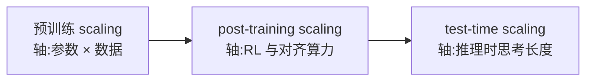

# Scaling Laws(规模定律)

> ⚠️ 旧版:本篇写于写作契约确立之前,尚未按新标准审查重写。标准见 docs/04-知识库写作契约.md,样板见「GPU架构与执行模型」。

一句话:**语言模型的测试损失随参数量 $N$、数据量 $D$、算力 $C$ 按幂律可预测地下降**——它是大模型时代所有「花多少钱、买多少智能」决策的定价公式:开训之前就能算出这笔算力该配多大的模型、多少数据、大致到什么水平。

幂律的直观感受:画在 log-log 坐标下是一条直线,含义是**回报递减,但递减得有规律**。像考试提分:60→80 靠努力,95→97 每一分都贵好几倍——贵,但贵得可预算,「可预算」正是 scaling law 的全部价值。

> 🖼️ 占位:log-log 坐标下 loss 随 N、D、C 分别下降的三条近似直线(Kaplan 论文图 1 风格)

## 一、Kaplan 定律(2020):三条幂律与「参数优先」

OpenAI 的 Kaplan et al. 首次大规模系统实验,发现当另外两个量不构成瓶颈时,测试损失对三个量分别呈幂律:

$$
L(N) \propto N^{-\alpha_N}, \qquad L(D) \propto D^{-\alpha_D}, \qquad L(C) \propto C^{-\alpha_C}
$$

拟合指数约 $\alpha_N \approx 0.076$、$\alpha_D \approx 0.095$、$\alpha_C \approx 0.05$——都很小,loss 每再降一格都要成数量级地加钱。两个附带发现同样影响深远:

- **形状不重要,规模才重要**:深宽比、FFN 倍数等架构细节对 loss 的影响远小于 N/D/C 本身;
- **大模型更省数据**:同样多的 token,大模型学到的更多(样本效率更高),所以「与其小模型训到收敛,不如大模型早停」;
- 三条律各自成立的前提是另两项管够;同时受限时,loss 由卡得最紧的一项主导。

据此推出的算力分配结论是「**参数优先**」:算力扩大时,大头加给参数(约 $N \propto C^{0.73}$),数据只需小幅增长(约 $D \propto C^{0.27}$)。

**历史影响**:这直接塑造了 2020–2021 的参数军备竞赛——GPT-3 175B 参数只喂 300B token(每参数不到 2 个),Gopher 280B 同样只喂 300B,MT-NLG 干脆冲到 530B。业界把钱几乎全换成了参数,而不是数据。

## 二、Chinchilla 修正(2022):参数与数据五五开

DeepMind 的 Hoffmann et al. 训练 400+ 个模型重做实验,用**三种独立方法**回答同一个问题——固定训练算力 $C$,$N$ 与 $D$ 怎么分:

1. **固定 N 扫 D**:对每个模型尺寸画训练曲线,取全体曲线的下包络;
2. **IsoFLOP 剖面**:固定总 FLOPs 横扫模型大小,得到一族 U 形曲线,把各谷底连起来;
3. **参数化拟合**:直接拟合联合损失函数,在算力约束下解析求最优。

> 🖼️ 占位:IsoFLOP 曲线族——横轴参数量、纵轴 loss,每条曲线固定 FLOPs、呈 U 形,谷底连线指向最优配比

三种方法结论一致,可信度因此很高。重点记这个联合损失形式:

$$
L(N, D) = E + \frac{A}{N^{\alpha}} + \frac{B}{D^{\beta}}
$$

三项可以类比为:$E$ 是**天花板**(自然语言自身的熵,再大的模型也消不掉的噪声地板,拟合值约 1.69);$A/N^{\alpha}$ 是**脑容量罚分**(模型不够大);$B/D^{\beta}$ 是**阅读量罚分**(书读得不够多)。拟合得 $\alpha \approx 0.34$、$\beta \approx 0.28$,两者接近——已经暗示 N 与 D 地位对等。

在算力约束 $C \approx 6ND$(每参数每 token,前向约 2 FLOPs、反向约 4 FLOPs)下最小化,得到算力最优解:

$$
N^* \propto C^{0.5}, \qquad D^* \propto C^{0.5}
$$

即**参数与数据应等比例增长**,翻成经验法则就是著名的 **$D \approx 20N$**:每个参数配约 20 个 token。

**实证故事**:照此配比训出的 Chinchilla(70B × 1.4T token)与 Gopher(280B × 300B)训练算力完全相同,却在几乎所有评测上全面胜出——参数只有对方 1/4,推理还便宜约 4 倍。「此前的大模型全都严重欠训练」一夜成为共识。

**为什么与 Kaplan 结论相反**:主因是技术细节——Kaplan 的各条曲线复用了长度未与实际训练步数对齐的 cosine 学习率调度,系统性高估了曲线中段的 loss、从而低估了数据的价值(另有小规模模型未计 embedding 参数等口径差异)。教训:做 scaling 实验,lr 调度必须逐点匹配训练时长。

### Kaplan vs Chinchilla 速查

| 维度 | Kaplan(2020) | Chinchilla(2022) |
| --- | --- | --- |
| 最优分配 | $N \propto C^{0.73}$,$D \propto C^{0.27}$ | $N^* \propto C^{0.5}$,$D^* \propto C^{0.5}$ |
| 口号 | 参数优先、大模型早停 | 五五开,$D \approx 20N$ |
| 分歧根源 | lr 调度未对齐 + 参数统计口径 | 三法互证、逐点对齐调度 |
| 代表产物 | GPT-3(175B/300B) | Chinchilla(70B/1.4T) |

## 三、算力最优 ≠ 部署最优:过训练时代

Chinchilla 回答的是「固定**训练**算力时 loss 最低」——一个科学问题。工程账本却是:**训练只花一次,推理要花无数次**。类比:训练是建厂,推理是电费——厂建得再精打细算,调用量一大,电费才是大头。

于是主流转向「**过训练**」(overtraining):故意偏离 20:1,把小模型喂远超配比的数据——

- 每训练 FLOP 换到的 loss 下降变少,训练性价比「亏了」;
- 但换来更小、每次调用更便宜、更好部署的模型,总账(训练 + 推理 × 调用量)反而赚;
- 过训练不会「训坏」:loss 仍按幂律缓慢下降,只是边际收益越来越薄。

| | 训练算力最优(Chinchilla) | 部署最优(过训练) |
| --- | --- | --- |
| 目标 | 固定训练 FLOPs 下 loss 最低 | 全生命周期总成本最低 |
| 计入的成本 | 只有训练 | 训练 + 推理 × 调用量 |
| 答案形态 | $D \approx 20N$ | 尽量小的 N + 远超 20:1 的 D |
| 代表 | Chinchilla 70B/1.4T | Llama 3 8B/15T |

**Llama 系是教科书案例**:Llama 1 用 7B × 1T(约 140:1)已远超配比,Llama 3 更把 8B 喂到 15T token——约 1900 token/参数,是 20:1 的近百倍。这不是不懂 scaling law,而是换了目标函数:从「训练算力最优」换成「部署最优」。面试答这题,先把两个「最优」拆开说。

## 四、数据受限 scaling:重复 epoch、数据墙与出路

以上定律都默认新数据无限供应。当高质量数据见顶、只能重复训练(多 epoch)时,Muennighoff et al. 的数据受限 scaling law 给出量化规律:

- **约 4 个 epoch 以内**,重复 token 的价值与新 token 几乎相同;
- 之后价值快速衰减,到十几个 epoch 额外收益趋近于零——像复习同一本书:第 2、3 遍仍有收获,第 10 遍只剩背诵;
- 数据固定而算力富余时,最优选择是把算力花在多 epoch 和相对小一点的模型上,而不是继续堆参数;混入代码等异源数据也有帮助。

由此引出「**数据墙**」讨论:互联网公开高质量文本存量有限,按旗舰模型的消耗速度将在可见的未来被「喂完」。主流出路:合成数据、多模态与私有数据——合成数据的造法与模型塌缩风险见数据工程篇。

## 五、涌现能力与「海市蜃楼」之争

**涌现派(Wei et al.)**:多位数算术、多步推理等能力在小模型上接近随机水平,规模跨过某个阈值后**急转弯式**出现,无法由小模型外推——像烧水,99 °C 都没动静,100 °C 突然沸腾。这也是「大模型能力不可预测论」的主要论据。

**质疑派(Schaeffer et al.)**:急转弯是**度量选择造成的海市蜃楼**——它集中出现在非线性、不连续的度量上(exact match、多选题正确率);换成线性平滑的度量(token 级似然、编辑距离),同一批模型的提升平滑且可预测。机制一句话:一道题要**连对 $k$ 步**才得分,单步正确率 $p$ 平滑上升时,整题通过率 $p^k$ 看上去就是悬崖。

**面试要两边都讲**:底层能力(per-token loss)大概率是平滑改善的,「量变质变」的神秘叙事要打折扣;但产品视角的「能用/不能用」阈值是真实体验——用户只在乎整题答没答对,不在乎编辑距离。一句话收束:**做预测用平滑度量,谈体验承认涌现**。

## 六、scaling 的当代形态:坐标轴在迁移

2024 年前后「预训练 scaling 放缓」成为公开讨论,论据大致三条:

- **数据侧**:高质量公开文本接近吃完(见上一节);
- **算力侧**:幂律本性就是指数投入换线性回报,单代模型再翻 10 倍算力越来越难筹;
- **观感侧**:旗舰代际提升不如 GPT-3→GPT-4 惊艳——注意这层属于公开讨论,并无定论。

更准确的说法是**坐标轴在迁移,而非幂律失效**——同配方下加算力仍会降 loss,争的只是性价比:

**Test-time scaling** 是最新的轴:o1 展示了准确率随「思考 token 数」近似对数线性提升,R1 开源复现了该现象——同一个模型,想得更久就更聪明。相当于把智能从「训练时一次性买断」改成「推理时按需购买」(考试多验算几遍)。思考长度是怎么被 RL 训出来的,见 GRPO 篇。

## 七、实用侧:小模型代理、外推与拟合的坑

工业里 scaling law 的日常用法是「**小模型代理 + 外推**」:训一个小模型梯队(如 100M–3B),拟合幂律,外推预测目标规模的 loss——用来定数据配比、选架构、校验超参;μP 等技术进一步让超参跨规模直接迁移(完整流程见预训练流程篇)。

拟合与使用时的高频坑:

- **区间外外推**:幂律只在拟合覆盖的 2–3 个数量级内可靠,外推更远曲线可能弯折;
- **系数不是宇宙常数**:$E$、$A$、$B$、$\alpha$、$\beta$ 全依赖数据质量、tokenizer 与架构——数据变好,最优配比会漂移,**别人的 20:1 不一定是你的 20:1**,要用自家管线重新拟合;
- **lr 调度逐点对齐**:每个数据量都要配一条完整走完的调度(Kaplan 教训的直接应用);
- **单点噪声**:同一配置多跑种子、多铺预算点再拟合,别拿三五个点画直线;
- **loss ≠ 下游**:loss 平滑不保证下游指标平滑(见第五节),下游能力要单独校准。

## 八、面试考点串联

1. Kaplan 与 Chinchilla 的结论差异及原因 →「一、二 + 速查表」
2. $D \approx 20N$ 怎么推出来的(三种方法、联合损失、$C \approx 6ND$)→「二」
3. Chinchilla 70B 凭什么赢 Gopher 280B →「二、实证故事」
4. 既然 20:1 最优,为什么 Llama 全在过训练 →「三」(两个「最优」的分野)
5. 数据不够,重复几个 epoch 还有用吗 →「四」(约 4 epoch 内近似免费)
6. 涌现能力是不是真的 →「五」($p^k$ 机制 + 两边都讲)
7. 预训练放缓后 scaling 还成立吗 →「六」(post-training 与 test-time 新轴)
8. 自己训模型时怎么用 scaling law →「七」(小模型代理 + 拟合的坑)

## 相关文献

- Scaling Laws for Neural Language Models(Kaplan 定律)— [arXiv:2001.08361](https://arxiv.org/abs/2001.08361)
- Training Compute-Optimal Large Language Models(Chinchilla)— [arXiv:2203.15556](https://arxiv.org/abs/2203.15556)
- Scaling Data-Constrained Language Models(重复 epoch 定律)— [arXiv:2305.16264](https://arxiv.org/abs/2305.16264)
- Emergent Abilities of Large Language Models(涌现)— [arXiv:2206.07682](https://arxiv.org/abs/2206.07682)
- Are Emergent Abilities of Large Language Models a Mirage?(海市蜃楼质疑)— [arXiv:2304.15004](https://arxiv.org/abs/2304.15004)
