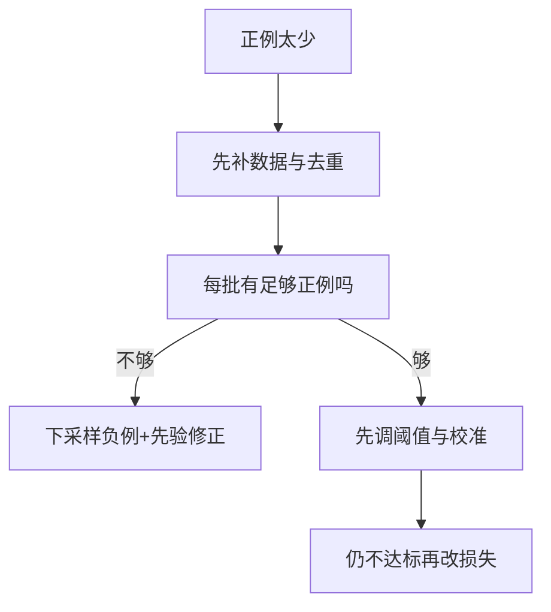

# 分类损失

一句话:分类损失回答的是「模型吐出来的那份概率,离标签有多远」——交叉熵之所以是默认答案,是因为它一头占住概率解释(它就是最大似然),另一头占住梯度形式(化简成一个干净的误差项,不带任何会在饱和区归零的系数)。按任务挑目标的总览、各族损失的横向对比,以及损失和评测指标的关系,见 损失函数 篇;本篇只管分类这一族。

## 一、交叉熵在说什么:最大似然和信息论是同一件事

### 从最大似然推过来

分类模型输出的不是一个数,是一个**概率分布** $p_\theta(y\mid x)$。最大似然要最大化全体样本正确标签概率的连乘 $\prod_i p_\theta(y_i\mid x_i)$;取对数把连乘变成求和,再加负号改成最小化,得到的就是交叉熵。取对数有三层好处,面试里最好都说到:**连乘变求和**,梯度可以逐样本相加、逐批平均;**避免下溢**,几千个小于 1 的数连乘,浮点很快就变成 0;**和指数族参数化对上**,sigmoid/softmax 里本来就有一个 $\exp$,取对数正好把它抵消掉——这正是第三节那个干净梯度的来源。另外 $-\log p$ 在 $p\to 0$ 时趋于无穷,意味着**它对「自信地答错」惩罚极重**,这个形状本身就是分类想要的。

### 信息论视角:最小化交叉熵就是让预测分布贴近经验分布

$$
H(q,p)=-\sum_c q_c\log p_c=H(q)+D_{\mathrm{KL}}(q\,\|\,p)
$$

这行的意思是:交叉熵能拆成「目标分布自己的熵」加「两个分布之间的 KL 距离」。$q$ 是标签给出的目标分布,$p$ 是模型预测。训练时 $q$ 是给定的,$H(q)$ 就是个常数——**所以最小化交叉熵完全等于最小化 KL**,也就是把预测分布往标签的经验分布上推。独热标签是把全部概率压在一个点上的退化经验分布,此时 $H(q)=0$,交叉熵和 KL 数值相等;软标签则是一个非退化的 $q$,两者只差那个常数。KL 的方向性、以及它当训练约束用时的区别,见 KL散度 篇。单位上提醒一句:自然对数算出来是 nat,以 2 为底才是 bit。

**还有一个常被跳过的性质:交叉熵是严格恰当评分规则。** 当真实条件分布是 $q$ 时,期望交叉熵 $\mathbb{E}_{y\sim q}[-\log p_y]$ **在且仅在** $p=q$ 时取到最小。这句话就是「优化交叉熵能得到有校准的概率」的理论出处。但它有前提:模型容量和数据量都够,**并且训练目标没被改动过**。第四到第六节要动的恰恰是这个目标,所以概率会跟着坏掉,第七节专门收拾这件事。顺带澄清一个常见问题:对比学习里的 InfoNCE 不是另一族损失,它把「一批候选里哪个是正样本」当成一道多选一的分类题,对相似度分数做 softmax 再取交叉熵,温度就是给分数统一除的那个缩放系数,所以下面讲的 softmax 交叉熵的性质对它一样成立。

## 二、二分类、多分类、多标签:三种写法

### 二分类:一个 sigmoid 加 BCE

$$
L_{\mathrm{BCE}}=-\frac1N\sum_{i}\Big[y_i\log p_i+(1-y_i)\log(1-p_i)\Big],\qquad p_i=\sigma(z_i)=\frac{1}{1+e^{-z_i}}
$$

意思是:模型只输出一个分数 $z$(logit),过 sigmoid 变成「是正类的概率」$p$;标签是 1 就罚 $-\log p$,标签是 0 就罚 $-\log(1-p)$,两项里每次只有一项生效。它是**一个伯努利变量**的负对数似然——正负两种结果互斥,不是两个独立事件。**能不能改用两维 softmax?能,而且等价。** 两维 softmax 的正类概率是 $e^{z_1}/(e^{z_0}+e^{z_1})=\sigma(z_1-z_0)$,只有**分数差**有意义:给两个 logit 同时加一个常数,结果一点不变。也就是说两维写法多带了一个冗余自由度,而一个 sigmoid 直接把那个差参数化了,参数更少、优化也更干净。

### 多分类:softmax 加 CE

$$
L_{\mathrm{CE}}=-\frac1N\sum_i\sum_{c=1}^{C}q_{ic}\log p_{ic},\qquad p_{ic}=\frac{e^{z_{ic}}}{\sum_j e^{z_{ij}}}
$$

意思是:softmax 把 $C$ 个分数压成一个和为 1 的分布(对应「类别互斥、一个样本只属于一类」这个假设),再按目标分布 $q$ 加权求 $-\log p$。**独热标签时求和只剩正确类那一项**,退化成 $-\log p_y$;**软标签时整个加权和都要留着**——标签平滑、多标注者投票、蒸馏的教师分布都走这条路(蒸馏里温度怎么用,见 蒸馏 篇)。

### 多标签:逐类 sigmoid 加 BCE

标签不互斥时(一张图既是「猫」又是「室内」),softmax 那个「和为 1」是错的约束。正确做法是**每个标签单独当一个二分类**,各自算一份 BCE 再求和或平均,各标签概率不必相加为 1。两个坑:这是**逐标签的边际预测**,不代表标签之间真的统计独立;**没标注的标签要按监督口径掩码掉,不能默认当负例**,否则等于在教模型「这条也不是」。

| | 二分类 | 多分类 | 多标签 |
|---|---|---|---|
| 输出层 | 1 个 logit + sigmoid | $C$ 个 logit + softmax | $C$ 个 logit,逐个 sigmoid |
| 概率约束 | $p$ 与 $1-p$ 互补 | 全部 $p_c$ 相加为 1 | 各类独立落在 $[0,1]$ |
| 损失 | BCE | CE | 逐类 BCE 求和或平均 |
| 典型场景 | CTR、风控 | 图像分类、下一个 token 预测 | 图像打标、意图多选 |

## 三、为什么二分类通常不用 MSE:梯度是命门

先把结论说死:**MSE 不是数学上不能做分类,它的问题是接上 sigmoid 之后,模型在「很自信却答错」时反而只收到极小的纠错信号。** 下面三条理由按重要性排。

### 主要理由:梯度里多出一个会归零的因子

设 $z$ 是 logit、$p=\sigma(z)$、$y\in\{0,1\}$。对同一个 $z$ 求导,前面那个 $\tfrac12$ 只是为了约掉系数:

$$
\frac{\partial}{\partial z}\Big[\tfrac12(p-y)^2\Big]=(p-y)\,\sigma'(z)=(p-y)\,p(1-p),\qquad
\frac{\partial}{\partial z}\Big[-y\log p-(1-y)\log(1-p)\Big]=p-y
$$

左边是 sigmoid 配 MSE,右边是 sigmoid 配 BCE。差别就是那个 $\sigma'(z)=p(1-p)$:它在 $p=0.5$ 时取最大值 0.25,往两头走迅速趋近于零。**这意味着 MSE 的梯度在饱和区几乎消失,而饱和区恰恰包含「答得又错又自信」这种最该被纠正的情况。** 举个数:$y=1$、$p=0.01$ 时,BCE 对 $z$ 的梯度是 $-0.99$,MSE 是 $-0.99\times0.01\times0.99\approx-0.0098$,差了约 100 倍;就算在最有利的 $p=0.5$ 处,MSE 也只有 BCE 的四分之一。

BCE 化简后的形状值得单独记:一层线性模型 $z=w^\top x$ 时,$\partial L/\partial w=(p-y)\,x$——**梯度正比于预测误差本身,错得越离谱推得越用力**,这就是「误差直接驱动更新」的含义。多分类同理,softmax 的雅可比是 $\partial p_i/\partial z_k=p_i(\delta_{ik}-p_k)$,和 $-\log$ 的导数一乘正好抵消:

$$
\frac{\partial L}{\partial z_k}=p_k-q_k
$$

意思是:多分类交叉熵对每个 logit 的梯度,就是「模型当前给这一类的概率」减去「目标给这一类的概率」,同样没有额外的饱和因子。要提醒一句,这只说明**损失这一层**不会自己制造梯度消失,深层网络里的梯度消失是另一回事。

### 两条次要理由:凸性与概率解释

**凸性,但别夸大。** BCE 对 $z$ 是凸的,sigmoid 配 MSE 对 $z$ 则可能非凸、带平坦区,单看这一层确实是 BCE 更好优化。但**换成整个神经网络的参数来看,两者通常都非凸**,不能据此声称交叉熵一定收敛更快或能找到全局最优,这是最常见的过度推广。**概率解释与校准。** BCE 正是伯努利分布的负对数似然,直接对应「标签非 0 即 1」这件事,而且是严格恰当评分规则(第一节),所以它训出来的概率有校准的理论基础。MSE 用在概率上也不是没有解释——那就是 **Brier 分数**,同样是恰当评分规则,能用来评价概率预测的好坏。所以「MSE 完全不能分类」是错的,真正站得住的理由只有一条:**它和 sigmoid 配合时的梯度不合适**。顺带回答一个常见对照:分类和回归的输出空间不同,分类的输出住在单纯形上(有界、和为 1),交叉熵匹配伯努利或类别似然;回归的输出是整条实轴,MSE 对应固定方差高斯噪声下的负对数似然,梯度正比于数值误差。回归任务里 MSE / MAE / Huber 怎么选、怎么逐层反传,见 回归损失 篇,本篇只用它做这一个对照。

### 两个高频追问

**多分类时问题一定更严重吗?不一定。** softmax 配 MSE 的梯度要乘上面那个雅可比 $\mathrm{diag}(p)-pp^\top$,当预测接近独热时它同样趋近于零,压制强度取决于**当前预测分布落在哪里**,而不是类别数有多少;类别多只是让每一类的概率普遍偏小,不直接等于饱和更严重。**必须用 MSE 时,标签平滑或温度缩放能救吗?能缓解,不能消除。** 先查更基础的东西:初始化、归一化和学习率是不是让模型一上来就冲进饱和区(学习率与调度本身怎么选,见 优化器 篇)。标签平滑把目标从 0/1 挪到内部,温度改变 sigmoid 的陡峭程度,两者都能让工作点远离饱和区,但**都不会让 $\sigma'(z)$ 这个因子消失**,所以必须实测,不能当成理论上的等价替换。

## 四、标签平滑:从损失视角看它改了什么

把独热目标换成 $q'=(1-\varepsilon)y+\varepsilon/C$。**它作为正则手段在防什么、$\varepsilon$ 从正则角度怎么权衡、以及「用它训出的模型当蒸馏教师会更差」这条反直觉代价,见 泛化与正则化 篇,本节不重复。** 这里只回答一件事:它在损失和梯度这一层动了什么。

### 梯度形式没变,零点挪了

softmax 交叉熵对 logit 的梯度永远是 $p_k-q_k$,换成软目标后形式一点没变,变的只是 $q$。这带来一个关键差别:独热目标下 $q_y=1$,而 $p_y<1$ 恒成立,所以**正确类那一项的梯度永远是负的、永远在把 $z_y$ 往上顶**,只是越接近 1 推力越小,但它从不为零——压力永不停止,模型只能把 logit 差越拉越大。加了平滑之后,梯度在 $p=q'$ 处**真的等于零**,存在一个有限的最优点:

$$
z_{y}-z_{j}=\log\frac{q'_y}{q'_j}=\log\Big(\frac{C(1-\varepsilon)}{\varepsilon}+1\Big),\qquad j\neq y
$$

意思是:正确类的 logit 该比其他类高多少,现在有了确切答案。四分类、$\varepsilon=0.1$ 时约 $\log 37\approx3.6$;一千类、$\varepsilon=0.1$ 时约 $\log 9001\approx9.1$。而 $\varepsilon=0$ 时分母是零,这个值是**无穷大**——这就是「独热目标要求把 logit 间隔无限拉大」的准确说法。一句限定:这是**单个样本、logit 可以自由取值**时的最优点,真实网络里所有样本共享参数,达不到逐样本精确最优,但「推力有上限」这个性质保留了下来。

**对校准的影响:方向是对的,过量会翻到另一边。** logit 间隔被钉在有限值,概率就不再贴着 1,通常能压掉过度自信,校准误差往往改善。但**它只朝一个方向推**:$\varepsilon$ 给大了,模型会系统性地欠自信,校准误差从「太高」翻成「太低」,一样不能用。做法是把 $\varepsilon=0$ 当基线,在验证集上同时看任务指标和校准误差(可靠性图与 ECE 见第七节),0.1 不是通用默认值。还有一条别夸大:它降低了模型对**任何**单条标签的信心,但并不识别哪条标签是错的,所以不能当成噪声标签的解药。

### 它和类别加权、Focal Loss 是三件不同的事

这是面试里最容易混的一组,三者动的是完全不同的轴:

| 手段 | 动哪根轴 | 对各类一视同仁吗 | 替代不了什么 |
|---|---|---|---|
| 标签平滑 | **目标分布的尖锐度** | 是 | 不改变类之间的相对权重,所以不负责类别不平衡 |
| 类别加权 | **类与类之间**的损失权重 | 否,按类给权 | 不区分同一类里的难易样本 |
| Focal Loss | **同一类内**难易样本的权重 | 是,按 $p_t$ 给权 | 不认识「哪一类是少数类」,不自动平衡类别 |

一句话记住:**平滑改目标,加权改类别,Focal 改难易。** 三个问题各不相同,谁也替代不了谁;叠加使用时要一个一个消融,否则分不清是谁在起作用。

## 五、类别不平衡:先分清是哪一种不平衡

**「正样本太少」和「易样本太多」是两件事。** 前者是类别轴上的失衡(一千次曝光只有三次点击),后者是难度轴上的失衡(大量一眼判负的样本,单条损失很小,但架不住数量,累加起来把前景的梯度淹掉)。密集检测里两者同时发生,所以 Focal Loss 常被误当成「专治类别不平衡」——它治的是后者。动手之前还得先把**标签定义**讲清楚:CTR 的正例是曝光之后的点击,未曝光的物品没有可靠负反馈,点赞、完播属于另外的目标,混进来等于换了个任务,后面所有比例和阈值都失去意义。

### 处理顺序:数据 → 采样 → 阈值与校准 → 才轮到改损失



这个顺序的理由是**副作用递增**:补数据和去重根本不动训练目标;下采样只改先验,而且有闭式修正;调阈值完全不碰模型;改损失则是直接改优化目标,一改就得重新验校准。数据侧怎么重采样、配比怎么定、样本加权该设多高的上限,见 数据工程 篇。

### 手段清单

| 手段 | 它到底改了什么 | 什么时候用 | 代价 |
|---|---|---|---|
| 类别加权 CE / 正类权重 | 每类损失前乘一个权重,等价于改了有效类先验 | 少数类样本够、只是比例低 | 概率整体偏高;和重采样叠加会过补偿 |
| 下采样负例 + 先验修正 | 只改训练数据的类比例,再用闭式公式把 logit 修回来 | 负例极多、想省训练成本 | 丢掉的负例里可能含难例;修正有前提 |
| logit adjustment | 训练时把类先验的对数加进 logit | 长尾多分类 | 需要可靠的类先验;缩放系数要调 |
| Focal Loss | 按当前置信度连续压低易样本权重(第六节) | 易样本主导的场景 | 伤校准;聚焦指数大了放大错标样本 |
| 调判决阈值 | 完全不碰训练,只在推理侧按业务代价挑阈值 | 几乎总该先试 | 需要一个校准良好的模型和原分布验证集 |

### 负采样为什么能用一个截距修回来

设正例、负例分别以与特征无关的概率 $s_1,s_0>0$ 保留,模型准确拟合了采样后的概率 $p_s$,那么由贝叶斯公式:

$$
\operatorname{logit}p=\operatorname{logit}p_s+\log\frac{s_0}{s_1}
$$

意思是:采样只把真实概率的**对数几率整体平移了一个与特征无关的常数**,所以推理时在 logit 上加回这个常数就还原了。保留全部正例、只留十分之一负例时,应在采样后的 logit 上加 $\log 0.1\approx-2.30$,**不是乘一个比例**。三条前提要说清:保留概率必须与特征无关,若采样依赖难度或特征,单一截距就不够;模型本身要拟合得动,欠拟合或没校准的模型不能靠它补救;任意的损失加权不等价于按概率采样,不能直接套这个式子。也可以按保留概率的倒数给损失加权来估计原分布上的风险,结论类似但方差更大。

```python
import torch
import torch.nn.functional as F

# 训练一律喂 logits:框架把 log_softmax 和 NLL 融成一个算子,自己先 softmax 反而丢精度
loss = F.cross_entropy(logits, target, weight=class_w)    # 多分类;去掉 weight 即普通 CE
loss = F.binary_cross_entropy_with_logits(z, y)           # 二分类与多标签

# logit adjustment:训练时把训练集类先验加进 logit,推理直接用原 logit(先验已扣掉)
log_prior = torch.log(class_count / class_count.sum())    # 各类训练先验,形状 (C,)
loss = F.cross_entropy(logits + tau * log_prior, target)  # tau=1 表示完全抵消先验
```

### 表示与结构侧,以及验证怎么做

**表示与结构侧**的思路是让稀疏的正例借到别处的监督:和数据更充足的相关目标**共享表征**;加**多任务辅助目标**(例如同时学曝光到点击、点击到转化,让梯度从数据多的那一路流回共享层),不过损失怎么配比、梯度冲突怎么调和是多任务学习自己的课题;或者加一点**对比辅助目标**。精排阶段引入对比学习**可行但不是白拿**:精排的负例来自「曝光未点击」,里面混着大量用户其实会喜欢、只是没注意到的**假负例**,直接当负样本推开会伤主目标;此外还有主辅梯度冲突和额外算力。当消融实验做,按精排指标验收,别默认加了就涨。**大模型 SFT 里某些指令类型只有几十条**时,除了重采样还有几条工程手段:定向补采真实样本、经人工审核的改写与合成、**任务均衡组批**(保证每个 batch 里稀有类型都出现,而不是靠全局比例碰运气)、适度的损失加权,以及只训少量参数以降低记忆风险。两条禁忌:**不能对离散 token 做 SMOTE 那样的插值**,两条指令 embedding 的中点不是一条合法指令;**重复放大少量模板不算增加多样性**,只会把模型训成背模板。

**验证一定要在原始分布上做**,不是在采样后的集合上。指标用 PR-AUC、分组召回与精确率、log loss 和校准误差,准确率在极端不平衡下几乎没有信息量(全判负类就有 99.7% 的准确率)。划分要按实体、时间或模板族去重,并留一份**未经增强**的稀有类测试样本;同时报告样本量和波动,少数类本来样本就少,分数抖动大。只有在**新表达、新实体**上仍然成立,才能说是可迁移的能力,而不是把那几条少数类训练样本背了下来。业务阈值也要在原分布上重选,不能沿用采样集上的那一个。

## 六、Focal Loss:它压的是易样本,不是多数类

$$
\mathrm{CE}=-\log p_t,\qquad \mathrm{FL}=-\alpha_t\,(1-p_t)^{\gamma}\log p_t,\quad \gamma\ge 0
$$

符号先说清:$p_t$ 是**模型给正确标签的那个概率**($y=1$ 时取 $p$,$y=0$ 时取 $1-p$),所以 $p_t$ 大就表示这条样本已经学会了;$\alpha_t$ 是类别权重,正类取 $\alpha$、负类取 $1-\alpha$;$\gamma$ 是聚焦指数。整个式子就是在交叉熵前面乘了一个**随置信度衰减的调制因子** $(1-p_t)^\gamma$。

数字最能说明问题。取 $\gamma=2$:$p_t=0.9$ 的易样本,因子是 $(1-0.9)^2=0.01$,权重掉到百分之一;$p_t=0.1$ 的难样本,因子是 $0.81$,两者的相对权重差了 81 倍。算总账更直观:一万个 $p_t=0.9$ 的易样本,在普通交叉熵下累计损失约等于 460 个难样本,**加上调制因子之后只相当于 6 个左右**。这正是它要解决的问题——单阶段检测器每张图要对上万个锚框做分类,绝大多数是一眼判负的背景,单条损失小但数量压倒性,累加后把前景信号淹没。注意它是**连续加权**,没有「只保留最难的 2%」这种硬筛选步骤,所有样本都仍在计算。$\gamma=0$ 时因子恒为 1,退化成带类别权重的交叉熵。

### 两个参数各管一根轴

$\gamma$ 管**难易轴**:同一类内部,置信度高的往下压,压多狠由它决定。$\alpha$ 管**类别轴**:正负两类的整体贡献比例。两者必须**联合搜索**,因为压低易负例之后负类的总贡献本来就掉了一大截,$\gamma$ 调大时 $\alpha$ 通常要跟着往回调——原论文里最优的这两个参数就是反向配对的。以加权交叉熵为基线,按分类型召回与精确率、或检测 AP 来选,不要按「样本越稀少 $\gamma$ 就越大」这种想当然的规则设值,也不要看训练损失。

### 四条边界

**它是为极端背景不平衡的密集检测设计的。** 搬到普通的不平衡分类上未必更好,收益取决于正负样本构成和标签噪声,所以必须以加权交叉熵为基线实测。**聚焦指数开太大还会放大标签噪声。** 错标样本天然置信度低,在 Focal 眼里就是「难样本」,$\gamma$ 一大它们的相对权重被抬得更高,等于让模型重点去拟合错的那批;而且 $\gamma$ 过大时大部分样本的权重都被压没,有效信号变少。$\alpha$ 设不当则整体偏向某一类。

**它会伤概率校准。** 调制因子让易样本几乎不再产生梯度,模型也就没有动力把它们推向 0 或 1 的极端,输出会系统性偏保守。有工作反过来把这一点当成一种校准手段来用,但那是另一个目的;默认情况下,**用了 Focal 之后概率值不能直接拿去算期望**,要么事后重新校准,要么只用排序类指标。**和 OHEM 的区别。** OHEM 按损失挑出一个难样本子集去训练,涉及「挑多少、怎么排序」这些离散超参,易样本被**完全丢掉**;Focal 用一个可微权重连续调节,所有样本都还参与计算,只是权重不同。共同风险是两者**都可能过度关注错标样本**。至于 Transformer 检测器还用不用得上,关键在分类目标和样本构成,和用不用 Transformer 没有直接的等价关系:原始 DETR 用类别负对数似然并调低「无目标」类的权重,Deformable DETR 则用了 Focal Loss——这是**可用的实例,不是换上去就一定涨的保证**。

## 七、概率校准:训练目标一动,概率就不能直接用了

**校准好**是指模型说 0.8 的那批样本里,真的约有 80% 是正类;**区分度好**是指正样本的分数普遍排在负样本前面。两者互不蕴含:对 logit 做任意单调变换,AUC 一点不变,校准却可以从完美变得离谱。所以「AUC 有 0.95,但拿概率去算期望收益全对不上」是很常见的现象,该查的是校准,不是排序。

### 可靠性图与 ECE 怎么看

**可靠性图**:把预测概率分箱,横轴取每箱的平均预测概率,纵轴取该箱的实际正例率,对角线就是完美校准;曲线整体压在对角线下方说明过度自信,压在上方说明欠自信。**ECE(期望校准误差)** 是把每箱这两个数的差取绝对值、按箱内样本量加权平均,给出一个标量。用它时记住两条:ECE **依赖分箱方式**,箱数一变数值就变,只能同口径横比;它也**不区分偏差方向**,过度自信和欠自信可能给出同一个数,所以图和数要一起看。

> 🖼️ 占位:可靠性图——横轴为分箱后的平均预测概率、纵轴为该箱的实际正例率,画出对角线、一条过度自信的曲线和一条欠自信的曲线,并在旁边标出各箱样本量

### 温度缩放:一个标量修掉大部分误校准

做法极简单:在一份**没参与训练的留出集**上,只学一个标量 $T>0$,推理时把 logit 除以 $T$ 再过 softmax 或 sigmoid,目标是最小化留出集上的负对数似然;$T>1$ 把分布压平、治过度自信,$T<1$ 让分布更尖。它有两个很实用的性质:**它不改变 argmax,也不改变任何排序**,因为除以一个正数是单调变换,所以准确率、AUC 全都原封不动,只有概率值变,这让它几乎零风险;**一个标量就够用**,是因为现代网络的误校准主要集中在「整体过度自信」这一个方向上。局限也清楚:它修不了「不同类别、不同概率区间偏的方向还不一样」这种结构化误校准,那要用分箱校准、等距回归或逐类的缩放;而且**分布一变就得重标**,线上数据漂移后老的 $T$ 不再有效。

### 哪些做法会把校准搞坏

- **类别加权与重采样**:等于系统性地改了训练时看到的类先验,模型拟合的是加权后的后验,不是真实后验,输出的正类概率会整体偏高。修法有两条——按第五节那个 logit 平移公式修回去(前提是采样与特征无关),或者事后重新校准。
- **Focal Loss**:调制因子让易样本不再被推向极端概率,输出系统性欠自信,方向和上一条相反。
- **标签平滑**:主动把最优 logit 间隔钉在有限值,通常压过度自信,但过量会翻成欠自信(第四节)。

收口成一句:**这三件事都在动「模型该输出什么概率」这个目标本身**,所以只要下游真的要用概率值(算期望收益、按代价定阈值、和别的分数融合),就必须重新校准、并在原始分布上验;如果下游只用排序,那影响小得多。

## 八、数值稳定:为什么框架把 softmax 和交叉熵融成一个算子

先 softmax 再取 log 会两头出事:logit 大一点,$e^{z}$ 就溢出成 inf;概率小一点,浮点直接截断成 0,再取对数是 $-\infty$。标准做法是减最大值加 logsumexp:

$$
L=\operatorname{logsumexp}(z)-z_y,\qquad \operatorname{logsumexp}(z)=m+\log\sum_j e^{z_j-m},\quad m=\max_j z_j
$$

意思是:所有 logit 先减去最大值,指数项最大就是 1,再也不会上溢;而下溢的那些项本来贡献就接近 0,丢掉不影响结果。BCE 也有对应的稳定写法 $\max(z,0)-yz+\log(1+e^{-|z|})$,它把 $z>0$ 和 $z<0$ 两种情况合并成一个指数永不上溢的表达式。融合还有第二个好处:**反向直接给出 $p-y$**,不必先存一份概率张量再走两遍链式,省访存也省显存(融合本身的通用收益,见 算子融合 篇)。落到实操只有一条纪律:用接受 logits 的接口,**不要自己先 sigmoid/softmax 再送进去**,这是最常见的实现错误。完整的手写交叉熵实现属于手撕代码题的范围,本篇不展开。词表极大时 softmax 本身的显存与加速是另一个课题(分层、自适应与采样 softmax),不在分类损失的讨论范围内。

## 面试考点串联

| 高频问法 | 本文哪一节 |
|---|---|
| 分类任务为什么通常用交叉熵?从信息论和机器学习角度说清定义、真实分布与预测分布的关系,以及它和 KL 散度什么时候等价 | 一 |
| 交叉熵为什么要取对数?直接最大化似然连乘会有什么问题?(补充题) | 一 |
| 对比学习里的 InfoNCE 和交叉熵是什么关系? | 一 |
| 分别写出二分类和多分类交叉熵的表达式,两者形式差在哪?为什么二分类常用 sigmoid,能不能改用两维 softmax | 二 |
| 标签是软标签(一个概率分布)时交叉熵怎么算?多标签又怎么变形,各标签概率还要和为 1 吗 | 二 |
| 二分类为什么不推荐 MSE?从梯度、收敛性、损失曲面和概率解释系统分析,并对比交叉熵 | 三 |
| 怎么推导 BCE 对 logit 的梯度?softmax 加交叉熵对 logits 的梯度又是什么形式 | 三 |
| 多分类用 MSE 时问题一定更严重吗?必须用 MSE 的话,标签平滑或温度缩放能改善吗 | 三(两个高频追问) |
| 为什么分类常用 softmax 加交叉熵、回归常用 MSE?从输出空间和梯度怎么解释 | 三(回归侧见 回归损失 篇) |
| 标签平滑改变了什么?它怎么影响梯度和最优 logit 间隔,$\varepsilon$ 怎么设置、对校准有什么影响 | 四(正则视角见 泛化与正则化 篇) |
| 标签平滑、类别加权和 Focal Loss 分别在解决什么问题?能互相替代吗?(补充题) | 四(三轴对照表) |
| 类别极度不平衡时,交叉熵需要做哪些改进? | 五 |
| 精排阶段正样本极稀少,采样、损失、模型结构各该怎么做?机制是什么 | 五 |
| 负采样比例怎么定?采样后的模型效果怎么评估 | 五(先验修正) |
| 精排引入对比学习可行吗?有什么潜在问题 | 五(假负例) |
| 大模型 SFT 里某些指令类型样本极少,除了重采样还有什么工程化技巧?怎么验证少数类是真泛化而不是过拟合 | 五 |
| 一上来就改损失是不是最优先的?阈值和校准能解决多少?(补充题) | 五 · 七 |
| 白板写出 Focal Loss 的公式,说清设计动机、参数作用,以及它怎么缓解类别不平衡 | 六 |
| Focal Loss 的 $\gamma$ 怎么调优?和样本稀疏程度什么关系,$\gamma$ 过大或 $\alpha$ 设得不当会出什么问题 | 六 |
| Focal Loss 和 OHEM 有什么区别?在 DETR 这类 Transformer 检测器里还有效吗,为什么 | 六(四条边界) |
| 模型 AUC 很高,但概率拿去算期望收益就不对,可能是怎么回事?(补充题) | 七 |
| 温度缩放为什么不改变准确率?它修不了哪一类误校准?(补充题) | 七 |
| 交叉熵和 softmax 组合的数值稳定性问题怎么解决? | 八 |

手写交叉熵的完整实现归题库的手撕代码题;各族损失的横向对比见 损失函数 篇。

## 相关文献

- Focal Loss for Dense Object Detection — [arXiv:1708.02002](https://arxiv.org/abs/1708.02002)
- On Calibration of Modern Neural Networks(温度缩放与 ECE)— [arXiv:1706.04599](https://arxiv.org/abs/1706.04599)
- Revisiting the Calibration of Modern Neural Networks — [arXiv:2106.07998](https://arxiv.org/abs/2106.07998)
- Calibrating Deep Neural Networks using Focal Loss — [arXiv:2002.09437](https://arxiv.org/abs/2002.09437)
- Long-tail learning via logit adjustment — [arXiv:2007.07314](https://arxiv.org/abs/2007.07314)
- Class-Balanced Loss Based on Effective Number of Samples(类别加权系数怎么定)— [arXiv:1901.05555](https://arxiv.org/abs/1901.05555)
- Rethinking the Inception Architecture for Computer Vision(标签平滑出处)— [arXiv:1512.00567](https://arxiv.org/abs/1512.00567)
- When Does Label Smoothing Help? — [arXiv:1906.02629](https://arxiv.org/abs/1906.02629)
- PyTorch BCEWithLogitsLoss(正类加权与稳定实现)— https://docs.pytorch.org/docs/stable/generated/torch.nn.BCEWithLogitsLoss.html
- scikit-learn Brier score loss(概率评分规则)— https://scikit-learn.org/stable/modules/generated/sklearn.metrics.brier_score_loss.html
