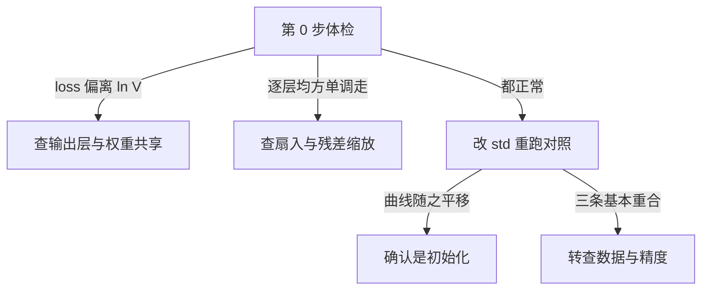

# 参数初始化

一句话:初始化只决定训练的**起点**,却能一步定生死——它要同时办成两件事,**让同一层的神经元从一开始就长得不一样**(打破对称性),和**让信号逐层传下去既不放大也不衰减**(控住方差);任何一件没办到,后面的优化器和学习率再怎么调都救不回来。

## 一、第一件事:打破对称性

### 全零为什么不行

同一层里的神经元靠**各自看到输入的不同方面**才有分工。如果这一层所有权重取同一个值(全零只是其中一种写法),那么:

- 前向:每个神经元的加权和完全相同,输出也完全相同;
- 反向:每个神经元收到的梯度完全相同,更新量一模一样;
- 于是下一步它们**仍然相同**,一直到训练结束。

这就是对称性没被打破的后果:**一层 4096 个神经元,实际只等于 1 个神经元被复制了 4096 份**,宽度白给。注意这个结论对"全都等于同一个常数"都成立,零只是最常见的那种。

全零还多犯一条罪:**它把梯度也一起掐断了**。反向传播往前一层送梯度要乘 $W^{\mathsf T}$,$W=0$ 就是乘 0。一个权重和偏置全为零的 ReLU 网络,前向所有隐藏层输出都是 0,反向每一层的权重梯度也是 0——整张网只有输出层那个偏置能动。所以"全零等于退化成线性模型"这个说法是错的,**它比线性模型还糟:它压根不学**。

### 偏置为什么可以置零

因为**对称性已经被权重的随机性打破了**:两个神经元的权重向量不同,即使偏置相同,输出也不同。而且偏置在方差递推里只是加一个常数,不像权重那样每层乘一次,不会造成指数级的放大或衰减。所以默认 bias 取 0、LayerNorm 的 $\gamma$ 取 1 而 $\beta$ 取 0,都是安全的。

三个值得记的例外,共同点是**故意用偏置或零去设一个先验**:

- **LSTM 的遗忘门偏置常初始化成 1 左右**,让门一开始默认打开,早期不至于把历史全忘掉;
- **类别极不平衡的二分类**,输出层偏置可以设成先验的对数几率,省得模型花几百步只为学会"多数类更常见";
- **零初始化的门控或缩放系数**是另一回事——ReZero 把残差分支的可学习标量初始化为 0、LoRA 把低秩支路的一侧置零,靠的都是"另一条路径已经提供了不同特征",所以不违反对称性(见 残差流 篇和 LoRA 篇)。

## 二、第二件事:让方差逐层守恒

### 尺度为什么会指数级失控

看一个线性层 $y=Wx$,权重各元素独立同分布、均值 0、方差 $\sigma_w^2$,输入各分量独立、均值 0:

$$
\operatorname{Var}(y)=n_{\text{in}}\,\sigma_w^2\,\operatorname{Var}(x)
$$

意思是:**过一层,激活方差就被 $n_{\text{in}}\sigma_w^2$ 乘一次**($n_{\text{in}}$ 是扇入,即每个输出神经元求和用到的输入维数)。把它记成这一层的增益 $g=n_{\text{in}}\sigma_w^2$,$L$ 层叠起来就是连乘:

$$
\operatorname{Var}\big(y^{(L)}\big)=\operatorname{Var}\big(x^{(0)}\big)\prod_{l=1}^{L} g_l
$$

连乘的可怕之处在于**它对 1 极其敏感**:$g=1.1$、$L=60$ 时激活方差涨约 300 倍;$g=0.9$ 时缩到约 1/550。所以初始化的目标不是"把权重设小一点",而是**把每层增益按到 1 附近**。

反向有一条形状一样的递推,只是扇入换成扇出:

$$
\operatorname{Var}\!\left(\frac{\partial \mathcal{L}}{\partial x}\right)=n_{\text{out}}\,\sigma_w^2\,\operatorname{Var}\!\left(\frac{\partial \mathcal{L}}{\partial y}\right)
$$

这是梯度爆炸和梯度消失最干净的解释:**梯度回传时同样在做连乘**,每层乘的是 $n_{\text{out}}\sigma_w^2$。于是前向想要 $n_{\text{in}}\sigma_w^2=1$、反向想要 $n_{\text{out}}\sigma_w^2=1$,**方阵之外这两个要求打架**——后面所有方案都是在这对矛盾里做取舍。

### Xavier / Glorot:两边各让一步

$$
\sigma_w^2=\frac{2}{n_{\text{in}}+n_{\text{out}}}
$$

**分母为什么是两个扇的和**?因为它取的正是 $1/n_{\text{in}}$ 与 $1/n_{\text{out}}$ 的折中:代进去算,前向增益是 $\frac{2n_{\text{in}}}{n_{\text{in}}+n_{\text{out}}}$、反向增益是 $\frac{2n_{\text{out}}}{n_{\text{in}}+n_{\text{out}}}$,两个都落在 1 附近,谁也不完美;**方阵时两者同时正好等于 1**,这也是它在 Transformer 那些方阵投影上表现不差的原因。写成均匀分布是 $U(-a,a)$、$a=\sqrt{6/(n_{\text{in}}+n_{\text{out}})}$——那个 6 不是玄学,均匀分布方差是 $a^2/3$,回代就出来了。它的**推导前提是激活在 0 附近近似线性、且关于原点对称**,tanh 满足,所以 tanh 与 sigmoid 时代它够用。

### He / Kaiming:ReLU 那一族要把方差乘 2

$$
\sigma_w^2=\frac{2}{n_{\text{in}}}
$$

**为什么多出一个 2**?因为 ReLU 把负半边直接砍成 0。预激活是零均值对称分布时,过一次 ReLU 之后二阶矩正好只剩一半,即 $\mathbb{E}\big[\max(0,y)^2\big]=\tfrac12\mathbb{E}[y^2]$。也就是说 ReLU 自带一个 0.5 的增益,不补回来的话每层信号衰减一半,60 层下去只剩 $2^{-60}$;把权重方差翻倍,正好补上这半边。

推广成一族:给每种激活配一个补偿增益,方差取"增益除以扇入"。PyTorch 把它做成 `calculate_gain`,注意**它返回的是标准差上的倍率**——ReLU 是 $\sqrt2$、Leaky ReLU(负斜率 $a$)是 $\sqrt{2/(1+a^2)}$、tanh 是经验值 $5/3$、恒等映射是 1,用在方差上要先平方。**换了激活就要换增益**,GELU、SiLU 这些平滑变体的实际增益和 ReLU 接近但不相等(激活函数本身见 FFN与激活 篇)。

### 扇入还是扇出

想让**前向**激活尺度稳就用 $n_{\text{in}}$,想让**反向**梯度尺度稳就用 $n_{\text{out}}$,两边都要照顾一点就用 Xavier 的求和式。实践里绝大多数实现默认用扇入(PyTorch 的 `fan_in` 模式),因为前向炸掉的后果更直接:注意力 logits 溢出、还没走到 Norm 就已经出 Inf,而梯度偏小至少还能靠学习率救一点。

一个高频事故是**扇入维度取反**:`nn.Linear` 的权重形状是 $(n_{\text{out}}, n_{\text{in}})$,把第 0 维当扇入,长方形层的方差就算错了——$d\to 4d$ 的 FFN 上升投影会差整整 4 倍,方阵层却看不出来,于是错误藏得很深。

### 正交初始化

把权重初始化成一个(半)正交矩阵,也就是让所有奇异值都等于 1。它和前两种的区别是**把"平均意义上守恒"升级成"对任意向量精确守恒"这一步**:$W$ 正交时 $\|Wx\|_2=\|x\|_2$ 恒成立,而 Xavier 与 He 只保证方差在期望意义上不变,单次抽出来的随机矩阵仍有长尾的奇异值谱,深下去会把某些方向放大、某些方向压死。

它适合三类场景:**很深、又没有残差和 Norm 兜底的纯前馈网络**(Saxe 等人在深线性网络上给出的结论是,正交初始化让学习时间与深度无关,高斯初始化做不到);**RNN 的循环权重矩阵**,同一个矩阵要被乘上百次,谱半径稍偏离 1 就是灾难;以及需要严格保范的可逆结构。代价与边界也要说清:要做一次 QR 或 SVD,大矩阵上不便宜;非方阵只能做到半正交;配 ReLU 时同样要乘增益;而**现代 Transformer 有残差加 Norm 兜着,正交初始化的收益通常测不出来**,不是默认项。同一路线上还有"实测校准"的 LSUV:先做正交初始化,再逐层前向一遍,按量到的激活方差把权重除回去,直接把增益调到 1;它在没有归一化层的网络上很实用,有 Norm 之后基本被取代。

### 四种做法放一起看

| 方法 | 方差或构造 | 配什么激活 | 什么时候选它 |
|---|---|---|---|
| Xavier / Glorot | $2/(n_{\text{in}}+n_{\text{out}})$ | tanh、sigmoid 等近似线性区 | 前向反向都想照顾;方阵上两边同时满足 |
| He / Kaiming | $2/n_{\text{in}}$ | ReLU 族(按增益推广) | 带整流型激活的深网络,通用默认项 |
| 正交 | 奇异值全为 1 | 按激活另乘增益 | 极深无残差网络、RNN 循环矩阵 |
| 固定小标准差(如 0.02) | 与扇入无关的常数 | 必须配 Norm 使用 | 大模型预训练的工程惯例,见第四节 |

一句必须说准的话:**高斯还是均匀只是分布形状,决定行为的是方差**。"标准差 0.02"对应的方差是 0.0004,和"方差 0.02"差了 50 倍,面试里说混会直接暴露没算过。

## 三、LayerNorm 与残差:为什么现代模型没那么怕初始化

### Norm 把尺度错误在每层入口抹平

LayerNorm 与 RMSNorm 会按输入自己的统计量重新标准化。这带来一个很强的性质:**把某一层权重整体乘上常数 $c$,Norm 之后的输出一个字都不变**——RMSNorm 对正数缩放严格不变,LayerNorm 还额外抹掉了均值平移。于是**尺度错误在每一个 Norm 的入口都被清零一次**,不会像裸深网那样连乘六十层。这正是"带 Pre-Norm 的 Transformer 对初始化尺度远没有裸深网敏感"的机制:每个子层的输入都刚被 Norm 过一遍,起点方差是被钉死的。

但有三条边界要说准:

1. **Norm 治不了对称性**。全零权重经过 Norm 依然全零,被抹平的只有尺度这一个维度。
2. **Norm 只管它自己入口那一段**。Pre-Norm 里残差主干本身不过 Norm,主干方差照样累加(见下一小节)。
3. **尺度不变会反过来咬一口**:既然函数对 $\|W\|$ 不敏感,损失对 $W$ 的梯度就大致与 $\|W\|$ 成反比。初始化设得越大,**有效学习率越小**,反之亦然——所以在带 Norm 的层里,"改初始化尺度"和"改学习率"是纠缠的,做对照实验时别以为只动了一个变量。Norm 的类型演进与摆在残差前后的选择见 Norm位置 篇。

### 残差:梯度好走了,方差却在累加

残差 $x_{l+1}=x_l+F_l(x_l)$ 的恒等通路让梯度可以绕过所有权重矩阵直接回到底层,这是深网能训起来的主因(完整分析见 残差流 篇)。代价是**方差沿深度累加**:各分支输出近似不相关时,

$$
\operatorname{Var}(x_N)\approx\operatorname{Var}(x_0)+\sum_{l=1}^{N}\operatorname{Var}\big(F_l(x_l)\big)
$$

也就是主干方差随层数**线性增长**、标准差按 $\sqrt{N}$ 增长。后果不是立刻发散,而是**深层被稀释**:第 $l$ 层的增量占主干的比例大约按 $1/\sqrt{l}$ 递减,越靠后的层说话越不算数,同时输出端的激活量级一路抬高。

标准解法是在**初始化时**就把每个残差分支的输出投影权重按深度缩小:

| 做法 | 缩多少 | 口径与出处 |
|---|---|---|
| GPT-2 式 | 残差层的输出权重乘 $1/\sqrt{N}$,$N$ 为残差层数 | 自 GPT-2 起成为常规做法 |
| Megatron 式 | 输出层标准差取 $\sigma/\sqrt{2L}$,$L$ 为 Transformer 层数 | 每层有注意力和 MLP **两条**残差分支,所以是 $2L$ 不是 $L$;默认 $\sigma$ 取 0.02 |
| DeepNorm | 放大恒等项 $\alpha$,并配一套按深度推导的初始化系数 | 残差尺度与 Norm 位置的联动见 Norm位置 篇 |
| Fixup / ReZero | 靠一套初始化规则(或初值为 0 的可学习标量)让网络从严格恒等出发 | 目标是**不用归一化层**也能训深网 |

摆在一起就能看出它们的共性:**改的都是"分支起步时有多大声",不是改网络结构**。$1/\sqrt{N}$ 让 $N$ 条分支的方差加起来仍是 $O(1)$,那个根号就是这么来的。

> 🖼️ 占位:同一个 60 层网络在三种初始化下的逐层激活均方曲线(纵轴取对数)——增益大于 1 时指数上翘、小于 1 时指数下坠、按 $1/\sqrt{N}$ 缩放后基本水平

## 四、大模型预训练的特殊考虑

### 不按扇入算,而是钉一个小常数

GPT-2 之后的主流做法是**所有权重统一用标准差 0.02 的正态分布**,再对残差分支的输出层按深度缩一道。为什么敢不按扇入算?**因为有 Norm 兜底**:每个子层入口的方差被重新钉死,扇入差异被吸收掉了。Megatron 的默认配置就是这个形状——基础标准差 0.02,残差分支的输出投影用 $0.02/\sqrt{2L}$。代价是**它是个经验常数,不随宽度自适应**:宽度从 1k 涨到 10k,同一个 0.02 对应的实际增益 $n_{\text{in}}\sigma_w^2$ 会跟着涨 10 倍,这正是 μP 要修的事。

### 词嵌入和输出层要单独算

这两处不能套通用规则,因为它们的"扇入"根本不是矩阵乘意义上的扇入:

- **词嵌入是查表,不是矩阵乘**。一个 token 只取走一行,词表维 $V$ 完全不参与求和,所以按 $2/V$ 定方差是错的。正确口径是**让取出来的那一行的量级对齐残差流的工作尺度**。原始 Transformer 与 Gemma 系还额外把 embedding 出口乘 $\sqrt{d}$ 来对齐量级(见 Norm位置 篇)。
- **输出层决定第 0 步的 logits 有多极端**。起点的 logits 应该接近 0、softmax 接近均匀,于是第 0 步的 loss 应该约等于 $\ln V$:词表 32k 时约 10.4,128k 时约 11.8。**开局 loss 明显高于这个数,基本可以断定输出层或 embedding 的尺度设大了**。

一条来自工程实践的经验:Megatron 允许把 embedding 的标准差单独设到 1.0 附近以减少 loss spike,而且**一旦这么设就同时关掉 embedding 上的 weight decay**,否则会被一路收缩回去。这条对应 Spike No More 那篇的分析,也是"embedding 该不该和其余权重同一个口径"的现实答案:不该。

### 权重共享(tied embedding)带来的约束

输入 embedding 和输出投影共用一张表时,**一个方差要同时满足两个互相拉扯的需求**:当查表用,它要匹配残差流的输入尺度;当输出投影用,它要让 logits 落在合理范围。两个最优值一般不重合,只能折中。连带三件事:

- 前面"输出层按 $1/\sqrt{2L}$ 缩小"的规则**不能直接施加在共享矩阵上**,那会把输入侧一起缩掉;
- 它同时收到两路梯度,weight decay 与学习率的实际效果和不共享时不同;
- 排查时先确认到底共没共享,**这是"两处单看都对、合起来不对"的典型来源**。

### μP 对初始化方差的规定

μP(maximal update parameterization)把参数按角色分成输入层、隐藏层、输出层三类,分别规定**初始化方差和学习率该怎么随宽度缩放**,目标是宽度变大时激活、logits 和每步的特征变化量都保持 $\Theta(1)$。对初始化最关键的一条是:**输出层的初始化方差要比标准做法额外压一档**(并给 logits 配一个与宽度成反比的乘子),否则宽度一涨 logits 就跟着涨。

落到实现上就是一行:Megatron 的 μP 版初始化在原有的 $\sigma/\sqrt{2L}$ 深度缩放之外,再除一个 $\sqrt{m}$($m$ 是当前宽度相对基准宽度的倍数)——**深度和宽度两个方向的缩放是叠加的,不是二选一**。μP 真正出名的超参迁移实验(小模型上调好直接搬到大模型)属于训练配方,见 预训练流程 篇;学习率与 warmup 本身见 优化器 篇。

### 微调时初始化什么

微调的默认动作是**什么都不初始化**——预训练权重就是最好的初始化。只有新增部件需要:新加的分类头、回归头用小方差随机,甚至直接置零也可以,因为它前面的特征本来就互不相同,对称性不成问题。PEFT 的适配器另有一整套让"起点等于基座"的零初始化设计,**LoRA 的一侧置零以及 PiSSA、OLoRA 这类改进起点,完整讲在 LoRA 篇**,本篇不重复。换词表时新增的 token 行也要单独处理,常见做法是用已有行的均值而不是随机——起点直接落在正确的量级上;这是经验做法,仍要用实测确认。

## 五、怎么判断是不是初始化的锅

### 开局体检:第 0 步就该看的三个数

```python
# 前向钩子:记录每层输出的均方,量级应逐层稳定,不该单调上翘或下坠
acts = {}
for name, m in model.named_modules():
    if isinstance(m, torch.nn.Linear):
        m.register_forward_hook(
            lambda mod, i, o, n=name: acts.__setitem__(n, o.float().pow(2).mean().item())
        )

loss = model(batch).loss
loss.backward()                                    # 前向反向各走一步,不要更新参数

print("step0 loss", loss.item(), "参考值 ln(V) =", math.log(vocab_size))
for n, v in acts.items():
    print(f"{n:50s} act_ms={v:.4g}")               # 逐层激活均方
for n, p in model.named_parameters():
    if p.grad is not None:
        print(f"{n:50s} grad_norm={p.grad.norm().item():.4g}")   # 逐层梯度范数
```

三个数各自在回答一件事:

- **第 0 步 loss 对得上 $\ln V$ 吗**——对不上,问题在输出层或 embedding 的尺度,以及有没有权重共享;
- **逐层激活均方是不是随深度单调走**——上翘是增益大于 1,下坠是增益小于 1,该查扇入维度取反、激活增益漏乘、残差缩放没做;
- **逐层梯度范数是不是跨了好几个数量级**——底层比顶层小几个数量级就是典型的梯度消失起点;某一层恒为 0 就去查是不是整层被置零或者冻错了参数。

再加一条早期观测:**注意力 logits 的最大值**。开局就冲到几十上百,通常是 q/k 投影的尺度偏大。这类不稳定在小模型上就能复现——Small-scale proxies 那篇正是用小模型稳定复现了大模型的注意力 logits 增长等现象(前向侧的 QK-Norm 见 注意力配件 篇)。

### 判别路径:换个尺度重跑

最有效的一次性实验是**只改初始化标准差,别的全部固定**:固定数据顺序、固定随机种子、固定学习率和调度,把 std 分别乘 0.5 和 2 各跑几百步。



配套还有两条便宜的对照:**换几个随机种子**,只有某些种子炸说明起点方差偏大、落点太靠边缘;**关掉一切随机性做小批过拟合**,几十条样本都记不住说明训练信号根本没接上,那不是尺度问题。

### 什么时候可以排除初始化

**初始化问题几乎都在最开始几十到几百步暴露。** 道理很直白:初始化只提供起点,优化器走了几百步之后权重早被数据带离起点,起点的影响被逐步稀释。所以:

| 现象 | 判断 |
|---|---|
| 第 0 步 loss 就离谱,或前几十步内发散 | 高度怀疑初始化 |
| 换随机种子结果差别巨大 | 高度怀疑初始化尺度偏大 |
| 稳跑几万步后突然 spike,从更早 checkpoint 重放同批数据不复现 | 基本不是初始化,走 预训练流程 篇的取证流程 |
| 只在 fp16 下炸、bf16 正常 | 数值动态范围问题,不是初始化(混合精度与 loss scale 见 预训练流程 篇) |
| loss 平稳但最终质量差 | 初始化**可能**有份,不能只看曲线断定,要做等预算对照 |

最后一条要老实说:**"没炸"不等于"初始化没问题"**。偏小的初始化可以让训练看起来一切正常,只是把模型带进了一个更差的解;这种情况只能靠固定预算的对照实验发现,而且它和数据、正则、学习率会互相伪装(泛化侧的手段见 泛化与正则化 篇)。

## 六、面试考点串联

| 高频问法 | 本文哪一节 |
|---|---|
| 参数初始化有哪些常用方法?为什么不能把权重全部初始化为零,它对梯度传播和收敛有什么影响? | 一 · 二 |
| 偏置可以置零,权重为什么不行?什么情况下零初始化反而是对的? | 一 |
| 初始化尺度怎么一层层影响梯度?为什么一点点偏差会被放大成指数级? | 二 |
| Xavier 的分母为什么是扇入加扇出?它对激活函数做了什么假设? | 二 |
| ReLU 网络为什么要把初始化方差乘 2?不乘会怎样? | 二 |
| 初始化按扇入算还是按扇出算?为什么大多数实现默认用扇入?(补充题) | 二 |
| 正交初始化在解决什么问题?现在的 Transformer 还需要它吗?(补充题) | 二 |
| LayerNorm 和残差连接怎么改变模型对初始化的敏感度?它们能自动修好不合理的初始化吗? | 三 |
| 残差网络为什么要把分支输出权重按 $1/\sqrt{N}$ 缩小?那个根号是怎么来的? | 三 |
| 大模型预训练的初始化有哪些特殊考虑?为什么敢统一用标准差 0.02?(补充题) | 四 |
| 词嵌入和输出层的初始化为什么不能套通用规则?第 0 步的 loss 应该是多少?(补充题) | 四 · 五 |
| 输入输出 embedding 共享之后,初始化上要额外注意什么?(补充题) | 四 |
| μP 对初始化方差提了什么要求?它和按深度缩放是叠加还是二选一?(补充题) | 四 |
| 微调时还需要初始化吗?新增的头和适配器分别怎么处理?(补充题) | 四 |
| 怎么诊断训练不稳定是不是初始化造成的?你会先看哪几个数? | 五 |
| 训了几万步才出现 loss spike,还怀疑初始化吗?为什么?(补充题) | 五 |

## 相关文献

- Understanding the difficulty of training deep feedforward neural networks(Xavier / Glorot 初始化;AISTATS 2010,不在 arXiv)— https://proceedings.mlr.press/v9/glorot10a.html
- Delving Deep into Rectifiers: Surpassing Human-Level Performance on ImageNet Classification(He 初始化)— [arXiv:1502.01852](https://arxiv.org/abs/1502.01852)
- Exact solutions to the nonlinear dynamics of learning in deep linear neural networks(正交初始化)— [arXiv:1312.6120](https://arxiv.org/abs/1312.6120)
- All you need is a good init(LSUV,按实测激活方差逐层校准)— [arXiv:1511.06422](https://arxiv.org/abs/1511.06422)
- Fixup Initialization: Residual Learning Without Normalization — [arXiv:1901.09321](https://arxiv.org/abs/1901.09321)
- ReZero is All You Need: Fast Convergence at Large Depth — [arXiv:2003.04887](https://arxiv.org/abs/2003.04887)
- DeepNet: Scaling Transformers to 1,000 Layers(深度相关的初始化与残差缩放)— [arXiv:2203.00555](https://arxiv.org/abs/2203.00555)
- Megatron-LM: Training Multi-Billion Parameter Language Models Using Model Parallelism(残差输出层按 $1/\sqrt{2L}$ 缩放)— [arXiv:1909.08053](https://arxiv.org/abs/1909.08053)
- Tensor Programs V: Tuning Large Neural Networks via Zero-Shot Hyperparameter Transfer(μP)— [arXiv:2203.03466](https://arxiv.org/abs/2203.03466)
- Spike No More: Stabilizing the Pre-training of Large Language Models(embedding 初始化与 loss spike)— [arXiv:2312.16903](https://arxiv.org/abs/2312.16903)
- Small-scale proxies for large-scale Transformer training instabilities — [arXiv:2309.14322](https://arxiv.org/abs/2309.14322)
