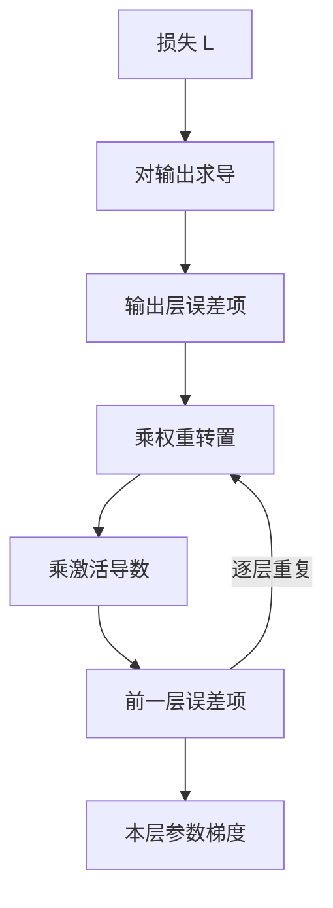

# 回归损失(MSE / MAE / Huber)

一句话:回归损失回答的是「预测偏了这么多,该罚多重」——罚的形状一改,模型拟合的统计量、对异常值的敏感度、往回传的梯度强度会同时跟着变,所以选损失不是挑个公式,是选一套关于数据的假设。

本篇只管三个基础回归损失的机制、选型,以及它们的梯度怎么一层层传回去。按任务选目标的横向总览见 损失函数 篇;交叉熵、Focal、标签平滑与类别不平衡见 分类损失 篇。

## 一、三个损失的形状与梯度

统一记号:单个标量预测记 $\hat y$,标签记 $y$,**残差** $e=\hat y-y$。批次损失是逐样本损失的平均。

$$
\ell_{\mathrm{MSE}}(e)=e^2,\qquad \ell_{\mathrm{MAE}}(e)=|e|,\qquad
\ell_\delta(e)=\begin{cases}\tfrac12 e^2,&|e|\le\delta\\[4pt]\delta\left(|e|-\tfrac12\delta\right),&|e|>\delta\end{cases}
$$

三个式子分别是平方、绝对值,以及「小残差按平方罚、大残差按线性罚」的分段拼接。Huber 第二段末尾那个 $-\tfrac12\delta^2$ 不是凑数,它保证两段在 $|e|=\delta$ 处**函数值和一阶导都接得上**,曲线没有折角。

真正决定训练行为的不是损失值,而是**它对预测的导数**:

$$
\frac{\partial \ell_{\mathrm{MSE}}}{\partial \hat y}=2e,\qquad
\frac{\partial \ell_{\mathrm{MAE}}}{\partial \hat y}=\operatorname{sign}(e),\qquad
\frac{\partial \ell_\delta}{\partial \hat y}=\operatorname{clip}(e,-\delta,\delta)
$$

读这三个式子:MSE 的梯度**正比于残差**,错得越离谱推得越狠;MAE 的梯度是个**常数符号**,错多少都只推一格;Huber 就是把 MSE 的梯度**掐在 $\pm\delta$ 之间**。所以 Huber 常被说成"自带梯度裁剪的 MSE",但要说准:这个裁剪按**单样本残差**做,和优化器那层按**全局梯度范数**做的裁剪完全是两件事(后者见 优化器 篇)。

| | MSE | MAE | Huber |
|---|---|---|---|
| 单样本形式 | $e^2$ | $\lvert e\rvert$ | 分段:小残差平方、大残差线性 |
| 对预测的梯度 | $2e$,无界 | $\operatorname{sign}(e)$,有界 | $\operatorname{clip}(e,-\delta,\delta)$,有界 |
| 零点可导 | ✅ 处处二阶光滑 | ❌ 只有次梯度 | ✅ 一阶连续 |
| 一个异常值的影响 | 按残差**平方**进损失、按残差进梯度 | 有上限 | 有上限($\delta$) |
| 接近最优时 | 梯度自动变小,能收住 | 步长不减,会绕着最优点抖 | 落进二次段后同 MSE |
| 要调的超参 | 无 | 无 | **$\delta$**,且绑定标签量纲 |

注意上表里一个惯例差:Huber 的二次段习惯带 $\tfrac12$,梯度是 $e$ 而不是 $2e$。这个常数因子会被学习率吸收,但**换实现时必须意识到它存在**——PyTorch 的 `HuberLoss(delta)` 和 `SmoothL1Loss(beta)` 就正好差一个 $\delta$ 倍,只有 $\delta=1$ 时两者相等,换过去不改学习率,等于把有效步长改了 $\delta$ 倍。

> 🖼️ 占位:上下两联图。上联是三条损失曲线随残差 $e$ 变化的对比(MSE 抛物线、MAE 折线、Huber 在 $\pm\delta$ 处从抛物线平滑切成直线);下联是对应的梯度曲线(MSE 一条斜直线、MAE 一个阶跃、Huber 一条被削平的斜线),两联共用横轴并标出 $\pm\delta$ 的位置

**一个高频的名词混淆**:回归里说的 L1/L2 损失作用在**预测残差**上,决定模型去拟合什么;正则化里说的 L1/L2 作用在**权重**上,决定模型能有多复杂。名字撞了,位置完全不同——权重那一路见 泛化与正则化 篇。

## 二、它们在建模什么:噪声假设与拟合的统计量

上一节是"长什么样",这一节回答"凭什么长这样"。把回归写成概率模型,三个损失就都是**某种噪声假设下的最大似然**。

$$
-\log p(y\mid \hat y)=\frac{(y-\hat y)^2}{2\sigma^2}+\log\left(\sqrt{2\pi}\,\sigma\right)
$$

这是「标签 = 模型输出 + 一个方差固定的高斯噪声」时,单个样本的负对数似然。$\sigma$ 固定,后一项就是常数,**最小化它完全等价于最小化 MSE**。换成拉普拉斯噪声 $p(y\mid\hat y)\propto e^{-|y-\hat y|/b}$,同样一算,剩下的是 $|y-\hat y|/b$,也就是 MAE。**MSE 假设的是"偏差小的多、偏差大的极少",MAE 假设的是"偏大的偏差没那么罕见"**——后者的分布尾巴厚得多,这就是它天然容忍异常值的来源。

假设不同,拟合出来的东西也就不同:

$$
\arg\min_c\ \mathbb{E}\left[(Y-c)^2\right]=\mathbb{E}[Y],\qquad
\arg\min_c\ \mathbb{E}\left[\,\lvert Y-c\rvert\,\right]=\operatorname{median}(Y)
$$

意思是:在给定输入下,**MSE 训出来的模型输出的是条件均值,MAE 输出的是条件中位数**。这才是"有异常值时 MAE 更稳"的根本原因——不是因为它梯度有界这个表面现象,而是**均值本身就不稳健**:一百个样本里混进一个大一万倍的值,均值被整个拖走,中位数纹丝不动。Huber 的定位也顺势清楚了:**小残差按高斯算、大残差按拉普拉斯算,$\delta$ 就是两套假设的切换点**,所以它估的是介于均值和中位数之间的某个量。

由此还能推出一条容易被忽略的坑:**条件分布是偏斜或多峰时,MSE 给出的"最优"预测可能是一个现实中根本不会出现的值**。典型例子是双峰分布——真实取值不是在 10 附近就是在 90 附近,MSE 会让模型稳稳地输出 50,而 50 从来没发生过。这种情况下要么换分位数损失只估某一侧,要么干脆放弃点估计,改成预测一个分布。

## 三、怎么选:异常值、误差代价与 $\delta$

### 先判断异常值是噪声还是信号

这是选损失之前的一步,顺序反了后面全白做:

- **是标注错误**(单位写错、数据串行、传感器故障)→ 优先**去修数据**,而不是换一个能忍它的损失。清洗、去重与异常检测的手段见 数据工程 篇。
- **是真实的重要样本**(极端行情、爆款、长尾大客户)→ 换成稳健损失等于**主动放弃这部分预测精度**。如果业务恰恰关心这一头,应该反过来给它加权,或者单独建一个模型。
- **分不清**→ 用 Huber 顶着先跑起来,同时把大残差样本按残差排序抽样人工看几十条。**不要仅仅因为"误差大"就删样本**,那是拿模型当前的无知去定义数据的对错。

真出现大量异常值,除了 Huber 还有一整排手段:改用 MAE 或分位数损失、按已知样本可靠性加权(标注质量高的权重大)、对长尾目标做 $\log$ 之类的单调变换、按稳健尺度对残差截断、或者把极端样本单拆一路。

还有一条必须说清的边界:**Huber 只限制了残差那一半的影响,管不住输入端的异常**。参数梯度是"下游误差 × 上游输入"(第五节),Huber 把误差掐在 $\delta$ 以内,但如果某个样本的输入特征本身大得离谱(统计上叫高杠杆点),乘出来的参数梯度照样能炸。输入侧的尺度问题得在特征处理里解决,损失函数解决不了。

### 误差代价对称吗

MSE、MAE、Huber 都默认**高估和低估一样糟**。现实里经常不是:库存预测少备一件的代价远高于多备一件,延迟预估报低了会挨骂、报高了只是保守。这时用**分位数损失(pinball loss)**——它把低估和高估按 $\tau$ 与 $1-\tau$ 两个不同的权重去罚:$\tau=0.5$ 时两边一样重,它就是 MAE 的一半、估的还是中位数;$\tau=0.9$ 时低估被罚得重九倍,模型只好往上顶,估出来的是 90% 分位数。注意换了它之后模型输出的语义也变了,评估口径要跟着改,不能再用 MAE 去验一个 90 分位的预测。

### $\delta$ 怎么定

$\delta$ 的单位就是残差的单位,所以**不存在一个通用的默认值**(PyTorch 的默认 `delta=1.0` 只在目标已经归一化到 $O(1)$ 时才有意义)。可操作的做法:先用 MSE 或 MAE 跑一小段,把训练残差的**稳健尺度**量出来——常用中位绝对偏差 MAD,高斯情形下 $\hat\sigma\approx1.4826\times\mathrm{MAD}$——再取它的 1 到 2 倍附近做候选,用验证集挑。

两头的代价也要说清:$\delta$ 取得过大,几乎所有残差都落在二次段,Huber 退化成 MSE,稳健性白给;$\delta$ 取得过小,几乎所有残差都在线性段,退化成 MAE,零点附近那段光滑性也就没了,收敛末期照样要靠学习率衰减收住。

### 选型速查

| 数据与目标长什么样 | 优先选 | 换来什么 / 代价 |
|---|---|---|
| 噪声接近高斯,异常值已清干净 | MSE | 拟合条件均值,梯度光滑;混进一个异常值就失守 |
| 标签里有改不掉的错标或长尾极端值 | MAE | 影响有界,估中位数;零点不可导,末期要靠学习率衰减 |
| 想要稳健,又想接近最优时能收住 | Huber | 两端兼顾;多一个 $\delta$ 要调,且绑定量纲 |
| 高估与低估的代价不对称 | 分位数损失 | 直接估指定分位数;评估口径要跟着换 |
| 目标跨几个数量级(点击量、耗时) | 先 $\log$ 变换再上 MSE | 把乘性误差变成加性;**还原时别直接取指数当均值**,那算出来是几何均值 |
| 只有「A 比 B 好」这种相对监督 | 这就不是回归 | 用成对偏好目标,见 RLHF与RM 篇 |

### 那"为什么 MSE 比 MAE 更常用"

从优化角度,MSE 确实有三条实打实的好处:**处处可导且二阶光滑**(MAE 在零点只有次梯度,实现上要人为指定一个值);**梯度随残差自动衰减**,接近最优时步子自己变小,固定学习率也能收敛,而 MAE 的常数梯度会让参数在最优点附近以学习率为幅度来回抖;以及它对应高斯似然,一整套解析结论(线性回归闭式解、方差分解)都建在上面。

但这**推不出"MSE 一定更快或一定更好"**。有异常值时 Huber 和 MAE 的最终指标常常更高;而且今天主流是 Adam 系优化器,更新量被 $1/\sqrt{\hat v}$ 逐参数归一过,"梯度幅度随残差自动缩小"这条优势本身就被削掉一截——它更多是 SGD 时代的直觉。面试被问到这条,正确姿势是**先讲优化上的三条理由,再补一句"但这是默认起点,不是结论"**。

### 大模型场景:回归头与奖励建模

SFT 阶段真正用到回归损失的地方不多,最典型的是**给模型接一个标量回归头**。这里有三种监督形态,别混:

1. **有可靠的绝对分数**(人工打的 1–5 分、可自动计算的指标)→ 用 MSE 或 Huber 都行,按误差代价选;关键前提是**先把评分尺度统一**,不同标注批次的分数分布不一致时,回归头学到的是标注习惯而不是质量。
2. **只有「回答 A 优于 B」**→ 这不是回归问题。奖励模型应该建成成对偏好,最小化 $-\log\sigma(r_A-r_B)$,只约束两者的**差**,不约束绝对值。"最后输出一个标量"不是用 MSE 的理由。完整的奖励模型训练见 RLHF与RM 篇。
3. **让模型用文本把数值生成出来**→ 那是 token 级交叉熵,又是另一种参数化。这时训练损失和你真正关心的数值误差**不是一回事**,必须额外评一遍实际数值误差。

## 四、量纲与尺度:回归损失被忽略的一半

分类任务的损失天然是 $O(1)$ 量级,回归不是——**损失值和梯度都跟着标签的单位走**。把标签整体乘 $c$:MSE 的损失值放大 $c^2$ 倍、输出梯度放大 $c$ 倍;MAE 的损失值放大 $c$ 倍,而**输出梯度完全不变**(符号只有 $\pm1$)。所以同一份房价数据,单位从"万元"换成"元",MSE 训练的初始梯度就大四个数量级,学习率、梯度裁剪阈值、Huber 的 $\delta$ **全部要重定**,否则第一步就把参数打飞。

这带来两条实操:

- **做目标归一化**(按训练集统计做 z-score,或对长尾目标先取 $\log$),让残差落在 $O(1)$ 量级,超参才有可迁移性。代价是**评估必须还原到原量纲**——归一化空间里的 MSE 是个没有物理意义的数,不能拿去跟业务指标对话。统计量只能用训练集算,用全量算就是泄漏。
- **多任务里更要归一化**。回归损失是 $O(10^3)$、分类交叉熵是 $O(1)$ 时,直接相加等于把分类任务的梯度淹掉,而这跟你想表达的重要性毫无关系。

多任务配权按代价从低到高有三档:①**先把各损失归一到可比尺度**再配固定权重(比如各除以自己的初始值或运行均值),这一步做完往往就够了;②**不确定性加权**——给第 $i$ 个任务学一个噪声尺度 $\sigma_i$,回归项写成 $L_i/(2\sigma_i^2)+\log\sigma_i$,前一项让噪声大的任务自动降权,后一项防止 $\sigma_i$ 一路涨到无穷;③**按梯度范数动态调权**(GradNorm 一路),让各任务回传的梯度量级对齐,代价是每步要多算一次梯度范数。「多个损失该不该加在一起」这个更上层的问题见 损失函数 篇;知识库的多任务专篇还没写,本篇只给到"回归项凭什么这么大"这一层。

## 五、从 MSE 出发的反向传播链

这一节回答:**损失算出来之后,那个数是怎么变成每一层权重的更新量的**。

对单个样本,把第 $l$ 层拆成两步:先仿射变换 $z^l=W^l a^{l-1}+b^l$,再过激活 $a^l=\phi(z^l)$。$a^0$ 就是输入,$a^L$ 就是预测 $\hat y$。

关键是先定义一个中间量,**误差项** $\delta^l\equiv\partial L/\partial z^l$——一句话:**把第 $l$ 层的加权输入推动一点点,损失会变多少**。有了它,链式法则能压成两条短式子,不必写一长串连乘。(这个带层号上标的 $\delta^l$ 和第一节 Huber 的阈值 $\delta$ 是两个毫不相干的符号,只是业界两处都习惯用这个字母,答题时最好点一句。)

### 第一步:损失对输出的梯度

$$
L=\frac1N\sum_{i}(\hat y_i-y_i)^2,\qquad
\frac{\partial L}{\partial \hat y_i}=\frac{2}{N}(\hat y_i-y_i)
$$

梯度就是"预测减标签"乘一个归约系数。这里两个口径必须当场说清,否则差的就是一个常数倍的有效学习率:**$N$ 是什么**——按样本平均时 $N=B$,按全部输出元素平均时 $N=Bd$($d$ 是输出维度);**写不写 $\tfrac12$**——损失定义里带了 $\tfrac12$,梯度里的 2 就消失。这两件事都只改梯度的整体尺度、不改方向,但换框架、换 `reduction` 设置时会让"同样的学习率"表现完全不同。

### 第二步:误差项的逐层递推

$$
\delta^L=\frac{\partial L}{\partial a^L}\odot\phi'(z^L),\qquad
\delta^{l}=\left((W^{l+1})^\top\delta^{l+1}\right)\odot\phi'(z^{l})
$$

$\odot$ 是逐元素相乘。前一式说:输出层的误差 = 损失给的原始梯度,再乘上输出层激活的斜率(线性输出层就没有这一乘,$\delta^L$ 直接等于上面那个 $\tfrac{2}{N}e$)。后一式说:**往前传一层永远是固定的两步**——先用 $W^{l+1}$ 的转置把下一层的误差按连接权重"分摊"回来,再乘上本层激活的斜率。

### 第三步:每层参数的梯度

$$
\frac{\partial L}{\partial W^l}=\delta^l\left(a^{l-1}\right)^\top,\qquad
\frac{\partial L}{\partial b^l}=\delta^l
$$

一句话:**某个权重的梯度 = 它下游的误差 × 它上游的输入**。偏置没有上游输入,所以梯度就是误差本身。参数更新照常 $W^l\leftarrow W^l-\eta\,\partial L/\partial W^l$,怎么把这个梯度变成实际步长是优化器的事(见 优化器 篇)。

### 从这条链能直接读出的三件事

**一,输入是梯度的一个乘数。** 上游激活 $a^{l-1}$ 直接乘在参数梯度上,所以输入尺度没处理好会等比例放大梯度;某条连接的上游输入恒为 0,它的权重梯度就恒为 0,永远学不动。这也是第三节那句"Huber 管不住高杠杆输入"的机制——稳健损失掐住的只是**误差**那个因子,**上游输入**这个因子它碰不到,两者相乘出来照样可以很大。

**二,每往前一层就乘一次 $\phi'$,激活饱和会掐断信号。** 最经典的反例是**输出层 sigmoid 配 MSE**:此时 $\phi'=p(1-p)$,最大也就 0.25,而当模型把一个 $y=1$ 的样本预测成 $p\approx0$ 时,$p(1-p)\approx0$——**错得最离谱的时候纠错信号反而最弱**,模型卡在那里不动。换成交叉熵,这一项会被约掉。完整的对照和「二分类为什么不用 MSE」见 分类损失 篇。

**三,深层是连乘,不是单调衰减。** $\delta^l$ 是一串 $W^\top$ 与 $\phi'$ 的连乘,整体尺度大于 1 就一路放大、小于 1 就一路衰减。所以"前层一定比后层更新慢"是**错的**,方向取决于这串连乘的尺度;真实网络里两种情况都会出现,得实测逐层梯度范数才知道。

### batch 平均到底改了什么

平均损失下,批梯度是**逐样本梯度的平均**:样本数变多,求和项也变多,两者相抵,所以**期望不变**,变的是**方差**(独立同分布下大约按 $1/B$ 下降)。因此"大 batch 会把梯度缩成 $1/B$"是错的。它真正带来的是:方向更准、单步能承受的学习率更大,同时同样的 token 预算下更新次数变少——这两股力量共同决定了学习率要重新定。线性缩放规则的适用条件、Adam 系为什么不满足它,见 优化器 篇。

## 六、梯度消失与爆炸:回归任务里怎么看、归谁管

检测手段不重复:全局梯度范数的时间序列、逐层梯度分布、有没有 NaN/Inf,这一套在 优化器 篇。这里只讲**回归任务特有的成因归属**:

| 现象 | 回归任务里典型的成因 | 该动哪里 |
|---|---|---|
| 一开训梯度就极大,几步内 NaN | **标签没归一化**,损失按量纲平方放大 | 先做目标归一化(第四节),而不是先加裁剪 |
| 训练中偶发尖峰 | 单个极端标签的残差经 $2e$ 原样变成大梯度 | 换 Huber 或分位数损失,并去查那一批数据 |
| 逐层梯度范数随深度指数衰减 | 激活落进饱和区、层间尺度失衡 | 换非饱和激活;架构级对策见 Norm位置 篇 与 残差流 篇 |
| 全局范数长期偏大但没发散 | 学习率与当前损失尺度不匹配 | 学习率与裁剪阈值怎么定见 优化器 篇 |

要强调的是第一行:**MSE 的输出梯度直接正比于残差,而残差的量纲就是标签的量纲**。所以"梯度爆炸"在回归任务里非常可能压根不是优化问题,而是**你把房价按元喂进去了**。先看一眼 loss 的绝对数量级,再决定要不要动优化器,顺序反了会一直在治标。

还有一层跟本篇平行、但知识库尚无对应文章的:**权重初始化通过控制每层的方差,让上面那串连乘在层间大致守恒**——前向激活的方差不炸不缩、反向梯度的方差也一样,这是让深层网络"能开始训练"的前提,和损失函数的选择相互独立。

## 七、面试考点串联

| 高频问法 | 本文哪一节 |
|---|---|
| 回归任务常用的损失有哪些?MSE 的形式和性质是什么,跟 MAE、Huber 怎么对比、按什么选? | 一 · 二 · 三 |
| 为什么 MSE 在神经网络里比 MAE 更常用?从优化角度怎么说? | 三(三条理由,以及它推不出"一定更好") |
| 数据里有大量异常值,除了 Huber 还有什么办法? | 三 |
| 大模型 SFT 里做回归(比如奖励建模),损失选择有什么特殊考虑? | 三 |
| 手推 MSE 对网络输出的梯度,它在反向传播里怎么一层层往前传、怎么影响前层参数? | 五 |
| MSE 前面那个分母到底是样本数还是全部输出元素?写不写 $\tfrac12$ 有什么区别? | 五 |
| 深层网络里梯度消失/爆炸和 MSE 的梯度是什么关系?怎么缓解? | 五 · 六 |
| batch size 变了 MSE 的梯度会怎么变?为什么大 batch 要调学习率? | 五 |
| 换成交叉熵之后,梯度会变成什么样? | 五(MSE 这一侧的机制;完整对照在 分类损失 篇) |
| 回归里的 L1/L2 损失,和正则化里的 L1/L2 是一回事吗?(补充题) | 一 |
| MAE 为什么对异常值稳健?它和 MSE 拟合的是同一个东西吗?(补充题) | 二 |
| 标签分布是双峰的,用 MSE 会发生什么?(补充题) | 二 |
| Huber 的 $\delta$ 凭什么定?设太大、设太小分别会怎样?(补充题) | 三 |
| 目标是房价,按「元」和按「万元」训练有区别吗?要不要归一化?(补充题) | 四 |
| 多任务里回归损失和分类损失量纲差几个数量级,权重怎么配?(补充题) | 四 |
| 输出层加了饱和激活之后,MSE 的纠错信号会怎么样?(补充题) | 五 |
| 前面几层的梯度一定比后面几层小吗?(补充题) | 五 |
| 回归任务遇到梯度爆炸,除了加裁剪还该先查什么?(补充题) | 六 · 四 |

## 相关文献

- Robust Estimation of a Location Parameter(Huber 1964,Huber 损失的出处;期刊论文,不在 arXiv)— https://doi.org/10.1214/aoms/1177703732
- Fast R-CNN(smooth L1,Huber 型损失在深度学习里的常见形态)— [arXiv:1504.08083](https://arxiv.org/abs/1504.08083)
- A General and Adaptive Robust Loss Function(把 L2 / L1 / Huber 等统一成一族可学形状参数的损失)— [arXiv:1701.03077](https://arxiv.org/abs/1701.03077)
- Understanding the difficulty of training deep feedforward neural networks(激活饱和与逐层梯度尺度)— https://proceedings.mlr.press/v9/glorot10a.html
- On the difficulty of training Recurrent Neural Networks(梯度消失与爆炸的分析)— [arXiv:1211.5063](https://arxiv.org/abs/1211.5063)
- Multi-Task Learning Using Uncertainty to Weigh Losses for Scene Geometry and Semantics(不确定性加权)— [arXiv:1705.07115](https://arxiv.org/abs/1705.07115)
- GradNorm: Gradient Normalization for Adaptive Loss Balancing in Deep Multitask Networks — [arXiv:1711.02257](https://arxiv.org/abs/1711.02257)
- PyTorch HuberLoss($\delta$ 与 SmoothL1 的 beta 差一个 $\delta$ 因子)— https://docs.pytorch.org/docs/stable/generated/torch.nn.HuberLoss.html
- PyTorch MSELoss(reduction 的归约口径)— https://docs.pytorch.org/docs/stable/generated/torch.nn.MSELoss.html
