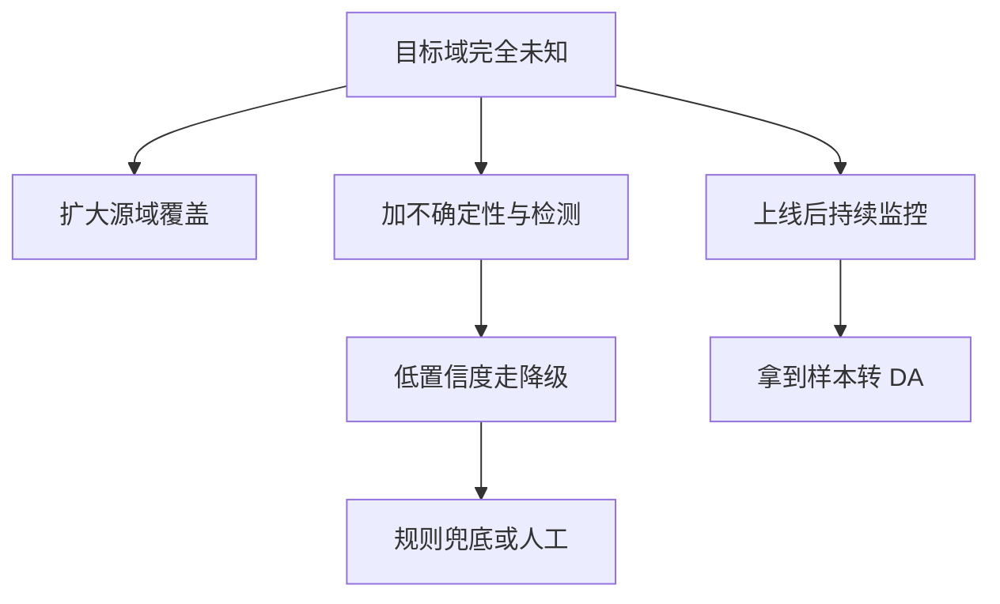

# 域泛化

一句话:域泛化(Domain Generalization,DG)问的是**训练时一个目标域样本都拿不到,却要在目标域上不崩**——它的全部赌注押在「多个源域里存在能迁移过去的共同规律」这一条前提上,所以它是一组有明确适用条件的方法,不是「让模型更泛化」的通用开关。

## 一、先把三个词分清:DG、DA、TTA

面试里最常见的失分点不是讲不清 DANN 的公式,而是**把三种设定混着说**。它们的差别只有一句话:**你手里有没有目标域的数据,以及什么时候有**。可用信息不同,能用的方法就完全不同。

| 设定 | 训练时能拿到目标域的什么 | 部署后改不改权重 | 典型手段 |
|---|---|---|---|
| **域泛化 DG** | 什么都拿不到,只有多个带标签的源域 | 不改 | 多源 ERM、保标签的增强、源域间对抗、IRM、MLDG 这类元学习 |
| **域适应 DA** | 目标域的**无标签**样本(UDA),有时还有少量标签 | 不改(训练阶段就用上了) | 特征分布对齐、对抗对齐、伪标签自训练 |
| **测试时适应 TTA** | 训练时同样拿不到 | **改**:上线后拿无标签的测试数据在线调 | 预测熵最小化、只更新 Norm 的统计量与仿射参数 |

三条必须说清的推论:

- **原始 DANN 不是 DG 方法**。它的设定是「有标签源域 + 无标签目标域」,那是标准的无监督域适应。要用在 DG 上,得改成**在多个源域之间**做对抗,效果是另一回事,不能拿 DA 的战绩替 DG 背书。
- **TTA 比 DG 便宜,但它换掉了前提**。它假设线上能攒到一批测试输入、并且允许改权重。典型做法(如 Tent)是只更新归一化层的仿射参数、用预测熵当无标签目标——因为**没有标签,你只能优化「模型对自己有多确定」这类代理量**,而模型完全可以自信地错。
- **一旦拿到目标域样本,你就已经离开 DG 了**。第八节讲 In-Context Learning 时这条还要再用一次:把目标域的几条示例塞进提示词,评估设定就变成了 DA / few-shot,不能再和 DG 方法同台比。

> 🖼️ 占位:DG / DA / TTA 三种设定的时间轴示意——横轴是「训练期 → 部署期」,分别标出它们第一次接触到目标域数据的时刻

## 二、分布偏移的三种类型,以及为什么概念漂移最难

「分布变了」这句话太粗。联合分布可以按两个方向拆开:

$$
P(X, Y) = P(Y \mid X)\,P(X) = P(X \mid Y)\,P(Y)
$$

左边这条拆法把数据看成「先有输入,再决定标签」,右边这条看成「先有类别,再生成输入」。三种偏移就是在问:**这四块里,哪一块变了、哪一块被假定没变**。

| 类型 | 什么变了 | 假定什么不变 | 例子 | 只看无标签数据能不能发现 |
|---|---|---|---|---|
| **协变量偏移** | $P(X)$ | $P(Y \mid X)$ | 换了一台成像设备,图像风格变了,但「什么是病灶」没变 | 能:直接比输入分布,或训一个域判别器看它分不分得开 |
| **标签偏移** | $P(Y)$ | $P(X \mid Y)$ | 流行季到了,阳性比例从 2% 涨到 20%,但「阳性长什么样」没变 | 能:在这个假定下,可以用模型的混淆矩阵反解出新的类别先验 |
| **概念漂移** | $P(Y \mid X)$ | 什么都不保证 | 同一段内容,上月算「优质」,评判标准改了这月就算「标题党」 | **不能**,必须拿到新标签 |

**为什么概念漂移最难,一句话:输入到输出的映射本身变了,所以任何只对齐输入分布的方法在原理上就无效。** 你可以把源域和目标域的 $P(X)$ 对齐到分毫不差,而每个样本的正确答案依旧是错的——对齐输入压根没碰到变化的那一块。更麻烦的是它**在无标签数据上不可观测**:输入看着一模一样,只有拿到新标签(哪怕是延迟回流的、抽样人工复核的)才能发现。所以概念漂移的正解从来不是「训一个更不变的模型」,而是**尽快拿到新标签并更新**(见第七、第八节)。

现实里三种偏移常常同时发生,而 DG 的方法论几乎都建立在**协变量偏移**这个假定上——这是很多方法「论文里有效、业务上无效」的根子。

## 三、DANN:用一个「分不出来」的判别器逼出域不变特征

### 机制:梯度反转层把 min-max 塞进一次反向传播

网络分三块:一个**特征提取器**、一个**标签分类头**、一个**域判别器**(判断这条特征来自哪个域)。训练目标是一对相反的诉求——分类头要把标签分对,特征提取器却要让判别器**分不出域**。直观上:如果一个特征连「这是哪家医院拍的」都看不出来,它就只剩跨域共有的信息了。

把这对相反诉求塞进一次普通反向传播的办法,是**梯度反转层**(Gradient Reversal Layer,GRL):前向恒等,反向把传回来的梯度乘上 $-\lambda$。于是判别器自己在正常变强,而回传给特征提取器的那份梯度被翻了号,等于在推它往「更难分辨」的方向走。工程上因此不用写交替优化循环,一次标准的 `backward` 就够了。$\lambda$ 通常从 0 慢慢升上去——一上来就给满,特征还没学出东西就先被抹平。

理论动机来自域适应的经典误差界:**目标域误差 ≤ 源域误差 + 两域表示分布的差异 + 一个理想联合误差项**。DANN 明确地压前两项;第三项——「究竟存不存在一个假设在两域上同时都好」——**它压不了,也测不了**。这一项正是下面所有边界的来源。

### 边界:三条,面试必答

- **它只对齐边缘分布 $P(X)$,对标签偏移和概念漂移无能为力**。更尖锐的一条:当两域的**标签分布**不同时,「对齐特征的边缘分布」和「源域误差小」这两个目标本身就冲突,已有工作给出信息论下界说明**两者不能同时满足**;此时对抗对齐不是收益变小,而是主动把源域加目标域的联合误差往上顶。
- **对抗训练本身不稳**。判别器太强,回传给特征提取器的梯度会饱和;太弱又没有信号。表现是 loss 曲线看着正常、下游指标乱跳,而且对 $\lambda$ 的调度很敏感。
- **对齐过头会连有判别力的信息一起抹掉**。「域不变」和「对任务有用」是两个不同的目标:不同医院的成像风格该被弱化,但**如果风格本身携带标签信息**(比如某型设备只服务重症患者),抹平它就等于删掉了证据。这条也是该不该用 DANN 的实操判据——**先问一句「域差异里有没有任务信号」**。

## 四、IRM:找一个各环境共用同一个最优分类器的表示

### 机制:不变性约束在约束什么

IRM(Invariant Risk Minimization)换了思路:不去对齐分布,而是**要求学到的表示满足一条不变性**——在这个表示之上,**同一个分类器在所有训练环境里都是最优的**。理想形式写出来是个双层问题:

$$
\min_{\Phi,\,w}\ \sum_{e \in \mathcal{E}_{tr}} R^{e}(w \circ \Phi)
\quad \text{s.t.}\quad w \in \arg\min_{\bar{w}}\ R^{e}(\bar{w} \circ \Phi)\ \ \forall\, e
$$

这个式子在说:把数据切成若干「环境」(不同医院、不同时间段、不同来源),先找一个表示 $\Phi$,再找一个分类器 $w$;约束要求这**同一个** $w$ 对每个环境 $e$ 单独看也都是最优的。为什么这能甩掉伪相关?因为伪相关(spurious correlation,指和标签统计相关但不是成因的特征,比如「草地背景」和「牛」)在不同环境里**强度不一样**——谁依赖它,谁的最优分类器就会随环境变;能让最优分类器不随环境变的,只剩那些**在各环境里关系稳定**的特征。

### 边界:三条

- **原始形式没法直接优化**。那个「对每个环境都最优」的约束是双层优化,实践中用的是**惩罚项近似**:把分类器固定成一个常数标量,看每个环境的风险对这个常数的梯度有多大,再把它的平方加进损失——梯度接近零意味着「这个环境不想动分类器」,近似满足了不变性。**它是近似,不是原目标**,惩罚系数给多大、从第几步开始加,都会显著改变结果。
- **对环境划分极其敏感**。环境必须在伪相关上真的有差异、在真规律上一致。**如果所有训练环境共享同一个伪相关,IRM 分不出它和真特征**——它唯一能用的信息就是「环境之间的差异」,你没给差异,它就没有信息。大模型场景还多一层:通用语料里「什么算一个环境」本来就没有定义。
- **后续工作直接质疑它的收益**。有工作指出:测试数据与训练分布不够相似时 IRM **可能灾难性失败**,线性与非线性设定下都可能恢复不出最优的不变预测器,而且**相比标准 ERM 没有实质改善**。这不等于 IRM 无用,但「上了 IRM 就更稳」不能当默认结论。

## 五、最该记住的反直觉结论:调好的 ERM 就是很强的基线

DG 这个领域出过一份把很多论文打回原形的对照研究:**DomainBed**。它做的事很朴素——把七个多域数据集、九个基线算法、三种模型选择准则放进同一套实验协议里跑一遍。结论是:**认真实现的经验风险最小化(ERM,就是「把所有源域数据混在一起正常训」)在所有数据集上都达到了当时的最好水平**。

它同时给出一条方法论判决:**没有配套模型选择策略的 DG 算法应当被视为不完整**。这句话是理解上面那个结论的钥匙——很多论文报出来的收益并不来自算法本身,而来自**实验协议不公平**:

- 用**目标域**的验证集挑超参和检查点(等于偷看答案),而基线只用源域信息挑;
- 超参搜索预算不对等,新方法搜得多、基线随手一跑;
- backbone、增强强度、训练轮数没有对齐。

所以这条要正着说也要反着说。正着说:**「用了 DG 方法」不等于「更泛化」,判据只有一个——在同一套协议、同样的调参预算下,它能不能稳定地打赢调好的多源 ERM。** 反着说:也不能得出「DG 都是骗人的」——DomainBed 的结论是**在那批基准和那套协议下** ERM 已经很强,不是「不变性思想被证伪」;换一批真实世界的偏移基准(如 WILDS 那类从实际采集条件构造的数据集),结论要重新测。

## 六、怎么评估:模型选择只能用源域信息

DG 评估最容易犯的错,是把「怎么选模型」和「效果有多好」混成一件事。DomainBed 用的三类准则值得原样记住:

| 模型选择准则 | 怎么选 | 能不能真的用 |
|---|---|---|
| **源域验证集** | 每个源域切一部分出来,合并成一个总验证集 | 能:只用了源域信息,符合 DG 设定 |
| **留一域交叉验证** | 轮流留出一个源域,在其余源域上训,用留出域挑 | 能:更贴近「遇到没见过的域」这件事,代价是要训多份 |
| **目标域验证集(oracle)** | 直接用服从目标域分布的验证集挑 | **不能**:这是偷看,只能当理论上界报出来 |

配套四条纪律:

1. **多次运行,报均值和方差**。DG 数据集通常不大,单次运行的域间差距经常被随机种子淹没;只报一个最好成绩不构成证据。
2. **按域分组看最差域,不是只看平均**。平均分会把某一个域的塌方藏起来,而线上体验往往由最差的那个切片决定。也有方法直接把「最差组的风险」当优化目标(分布鲁棒优化那一路),但**评估口径应该先改过来**,不必等换算法。
3. **单变量对照**。backbone、增强、训练量、调参预算全部对齐,一次只换算法。
4. **目标域完全未知时,你测不到真实收益**。源域留出和压力测试只是**代理证据**;面试里老实说清这一点,比给一个漂亮数字更有说服力。

还有一条时间维度上的:**数据带时间属性时必须按时间切,不能随机切**。随机切会把同一时段的近似样本同时放进两侧,测出来的分数是假的(划分泄漏的更多形态见 泛化与正则化 篇)。

## 七、实践优先级,与目标域完全未知时的退路

### 优先级:先做便宜且几乎总有效的

按性价比排,复杂 DG 算法排在最后:

1. **扩大数据覆盖**——直接把「没见过的域」变成「见过的域」,这是唯一从根上解决问题的动作。顺带澄清一个混淆:多个源域混在一起训**不是多任务学习**,前者任务相同、只是数据来源不同,后者是几个不同目标共用一个模型、要处理损失配比与梯度冲突。哪些域缺、怎么定向补样、配比怎么给,见 数据工程 篇。
2. **简单稳健手段**——保标签的数据增强(扩大源域内标签不变的变化范围)、换更强的预训练表示、多模型或多检查点集成。三者的共同点是**不引入新的失败模式**:集成就是把若干模型的预测平均或投票,靠各自误差不完全相关来压方差,代价是推理成本按份数翻倍。增强的模态做法与验收见 数据工程 篇;表示本身怎么训见 对比学习 篇。
3. **复杂 DG 算法**——DANN、IRM 这一类。它们引入额外的判别器、逐域批次和梯度惩罚,训练成本与调参难度都上一个台阶,收益必须按第五节的口径实测。

### 目标域完全未知时,五条现实做法

这也是「DG 效果不佳怎么办」的标准答法——**从「让模型自己扛住」换成「让系统扛住」**:

- **扩覆盖**:优先补「预计会偏移的那几个方向」,而不是无差别加量。
- **不确定性与 OOD 检测**:给每条预测配一个置信度,并单独判断这条输入是不是压根不在训练分布里。最朴素的基线是拿 softmax 最大概率当分数——它意外地难打败,但**必须先在留出域上验过校准再定阈值**,不能把原始概率直接当置信度用。
- **降级路径**:低置信度的样本不要硬答,交给保守规则、检索证据或人工复核。这一步的收益通常比再调一个 DG 算法大得多。
- **持续监控**:输入分布可以无标签监控(协变量偏移),但**概念漂移只能靠标签**——延迟回流的真实反馈、按比例抽样的人工复核,是唯一能发现它的通道。
- **及时改口**:一旦攒到目标域样本,明确宣布设定已经从 DG 变成 DA 或 TTA,方法和评估口径跟着换,不要继续用 DG 的话术汇报。

## 八、和大模型的关系:预训练、ICL 与快速漂移场景

### 大规模预训练本身就是最强的「多域覆盖」

**DG 想用算法约束换来的东西,预训练用数据规模直接买到了。** 预训练语料横跨的域数量远超任何 DG 基准,所以很多在小模型眼里算「新域」的输入,对大模型根本不新——零样本能力就是这件事的外在表现。两条边界要跟上:这只说明**覆盖**有效,**不证明任何一条不变性约束有效**;而且覆盖不到的地方(真正的新领域、新时间段、内部私有数据)照样掉,规模带来的收益怎么外推见 ScalingLaws 篇。

实操上因此有个默认动作:**固定预训练底座,先跑普通多源微调当基线,再去比源域增强和显式 DG 的增量与成本**。大模型上做显式 DG 还要额外付逐域批次、辅助判别器、梯度约束的算力,以及一个更难回答的问题——**在通用语料里,「域」到底怎么划**。

### ICL 是零训练成本的适应手段,不是显式 DG 的替代品

In-Context Learning 在上下文里给几条目标域样本,让模型当场对齐格式、口径和标签定义。它确实能缓解一部分偏移,但**它不改权重**,所以边界很清楚:

- **能补的是「说明」,不是「知识」**。提示词可以告诉模型新的标签定义和输出格式,补不了模型压根没有的领域知识。
- **概念漂移下只能治标**。标签定义变了,示例可以带上新定义;但能塞进上下文的例子有限,复杂的重定义讲不清,长尾也覆盖不到。
- **最关键的一条:用了目标域示例,评估设定就变了**。这时它对标的是 DA / few-shot,不是 DG。**拿「ICL 在目标域上表现不错」去论证「不需要显式 DG」,是在比两个不同的设定。**

### 兴趣快速漂移的场景:那是概念漂移,不是静态 DG

内容平台这类用户兴趣快速漂移的场景,常被拿来问「DG 是不是比持续微调更实用」。先纠正设定:**兴趣漂移的本质是随时间发生的概念漂移与协变量偏移,而不是静态 DG 假设的那种「永远见不到目标域」**——线上行为日志会在不长的延迟后回流,目标域其实是**看得见的**。既然看得见,把这份信息扔掉去训一个「一劳永逸的域不变模型」就不划算。

所以一般结论是:**持续或增量更新加监控,通常比追求一个静态的域不变模型更实用**;DG 在这里的位置是补冷启动——全新品类、全新人群这种确实一条数据都没有的切片。持续更新的代价也要一并说清:

- **遗忘与回滚**:每轮更新都可能打坏旧切片,所以要保留旧任务评测集、保留检查点、留一个明确的回滚开关(遗忘的成因,以及 Replay、参数重要性约束这些训练侧机制见 SFT 篇)。
- **更新频率是个权衡**:更勤更跟得上漂移,但每次更新都带评测与上线成本,也更容易被短期噪声带偏。
- **评估必须按时间切片**:用早期数据训、用后期数据测,并观察指标随时间衰减的速度;随机切分在这类场景下毫无意义。

顺带划清一条容易被拉进来的边界:生成任务里模型「一本正经地编事实」是另一码事,它的成因是训练目标与知识边界,不是训练和测试分布不一致,别拿域泛化的框架去套。

## 面试考点串联

| 高频问法 | 本文哪一节 |
|---|---|
| 训练与测试分布差异显著时,域泛化的学术方法能不能有效缓解?结合领域对抗训练、不变风险最小化说清原理、适用场景与局限,以及它们在大模型上的挑战和价值 | 一 · 三 · 四 · 五 · 八 |
| 内容平台这类用户兴趣快速漂移的场景,DG 方法是否比持续微调更实用? | 八(第三小节) |
| 大模型的 In-Context Learning 本身是否具备隐式域泛化能力,能不能替代显式 DG 训练? | 八(第二小节) |
| 目标域数据完全未知、DG 方法效果不佳怎么办? | 七(第二小节) |
| 域泛化与预训练大模型的泛化能力是什么关系? | 八(第一小节) |
| 如何评估域泛化方法的有效性? | 六 |
| 域泛化、域适应、测试时适应差在哪?原始 DANN 属于哪一种?(补充题) | 一 |
| 分布偏移分哪几类?为什么概念漂移最难,而且没法只靠无标签数据发现?(补充题) | 二 |
| 梯度反转层在干什么?为什么它能把一个 min-max 塞进一次普通反向传播?(补充题) | 三 |
| 特征对齐得越彻底越好吗?什么时候对齐反而有害?(补充题) | 三(边界) |
| IRM 的不变性到底在约束什么?为什么它对环境划分那么敏感?(补充题) | 四 |
| 为什么统一协议下调好的 ERM 能打平一大批 DG 方法?这说明了什么?(补充题) | 五 |
| 模型选择为什么不能用目标域的验证集?只报平均准确率有什么问题?(补充题) | 六 |
| 只有一份预算,先扩数据覆盖还是先上 DG 算法?为什么?(补充题) | 七(第一小节) |
| 上线之后怎么发现分布偏移?协变量偏移和概念漂移的监控手段有什么不同?(补充题) | 二 · 七 |

过拟合诊断、L1/L2、dropout、早停与标签平滑的正则视角见 泛化与正则化 篇;数据侧怎么发现分布失配、怎么定向补样与配比见 数据工程 篇;持续更新带来的遗忘与对策见 SFT 篇;表示学习本身怎么训见 对比学习 篇;规模带来的泛化收益怎么外推见 ScalingLaws 篇。

## 相关文献

- Domain-Adversarial Training of Neural Networks — [arXiv:1505.07818](https://arxiv.org/abs/1505.07818)
- Unsupervised Domain Adaptation by Backpropagation(梯度反转层的最早稿)— [arXiv:1409.7495](https://arxiv.org/abs/1409.7495)
- A theory of learning from different domains(域适应误差界,Machine Learning 79:151–175, 2010,不在 arXiv)— https://doi.org/10.1007/s10994-009-5152-4
- On Learning Invariant Representation for Domain Adaptation(标签分布不同时对齐边缘分布的下界)— [arXiv:1901.09453](https://arxiv.org/abs/1901.09453)
- Invariant Risk Minimization — [arXiv:1907.02893](https://arxiv.org/abs/1907.02893)
- The Risks of Invariant Risk Minimization — [arXiv:2010.05761](https://arxiv.org/abs/2010.05761)
- In Search of Lost Domain Generalization(DomainBed)— [arXiv:2007.01434](https://arxiv.org/abs/2007.01434)
- Learning to Generalize: Meta-Learning for Domain Generalization(MLDG)— [arXiv:1710.03463](https://arxiv.org/abs/1710.03463)
- Distributionally Robust Neural Networks for Group Shifts: On the Importance of Regularization for Worst-Case Generalization — [arXiv:1911.08731](https://arxiv.org/abs/1911.08731)
- Tent: Fully Test-time Adaptation by Entropy Minimization — [arXiv:2006.10726](https://arxiv.org/abs/2006.10726)
- Detecting and Correcting for Label Shift with Black Box Predictors — [arXiv:1802.03916](https://arxiv.org/abs/1802.03916)
- A Baseline for Detecting Misclassified and Out-of-Distribution Examples in Neural Networks — [arXiv:1610.02136](https://arxiv.org/abs/1610.02136)
- WILDS: A Benchmark of in-the-Wild Distribution Shifts — [arXiv:2012.07421](https://arxiv.org/abs/2012.07421)
- Learning under Concept Drift: A Review — [arXiv:2004.05785](https://arxiv.org/abs/2004.05785)
