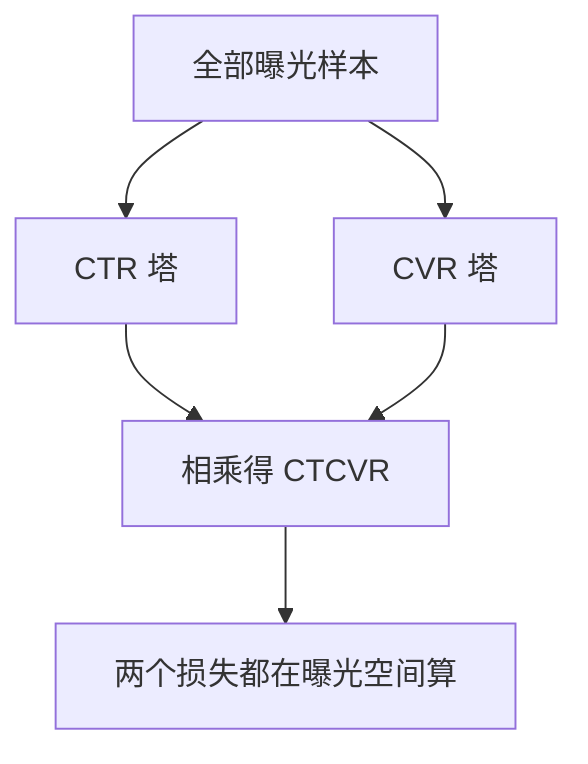

# 多任务学习

一句话:让一个模型同时学好几件事,省算力、省数据、还能互相借力,代价是这些任务会在共享参数上打架——这篇讲的就是**怎么先分清它们打的是哪一种架,再决定是调损失权重、动梯度,还是干脆在结构上给它们分家**。

## 一、先分清是哪一种打架

多任务的默认做法是**硬参数共享**:底层一套共享参数,上面每个任务接一个小塔。好处很直接:共享层同时见到多个任务的监督信号,相当于一种正则,数据少的任务能蹭到数据多的任务学出来的表示(偏差方差与过拟合的一般讨论见 泛化与正则化 篇)。坏处是所有矛盾都堆在共享层这一处。

出问题时的两个典型症状:**负迁移**,加了任务 B 之后任务 A 反而比单独训还差;**跷跷板效应**,怎么调都只能 A 涨 B 跌,总也调不到两头都好。这两个症状背后的病因不止一个,必须按下面的顺序往下排——顺序不能乱,**因为前一层不干净,后一层量出来的统计量全是错的**:

| 层次 | 现象 | 怎么量出来 | 对应手段 |
|---|---|---|---|
| 归约口径 | 各任务损失数值差几个数量级 | 直接看 loss 曲线 | 统一按 token / 样本 / 有效位置平均 |
| 梯度量级 | loss 数值相当,某任务梯度范数却大一个量级 | 同一段共享参数上量 $\|g_i\|$ | 调权重(第二节) |
| 梯度方向 | 范数接近,两任务梯度余弦却为负 | 量 $\cos(g_i,g_j)$ | 梯度手术(第三节) |
| 表示需求 | 前三层都干净,跷跷板依然在 | 消融:去掉某任务,主任务反而涨 | 改结构(第四、五节) |

三条最容易混的:**损失数值大不等于梯度大**,梯度还取决于损失对输出的形状,一个数值很小的交叉熵在自信答错时梯度可以很大;**梯度范数大不等于梯度爆炸**,先查有没有非有限值、统计用的是不是未缩放的梯度、实际更新幅度有多大,再谈裁不裁剪;**余弦为负只是当前这一步、这一批数据上的局部冲突**,不是「这两个任务天生不兼容」的证明,换个 batch 可能就转正了,所以要看一段窗口的均值而不是单点。

按什么口径归约、系数怎么和学习率与调度耦合、辅助项该盯现象而不是盯数值,这些总览级结论在 损失函数 篇第五节;本篇负责把机制讲透。

## 二、损失配比:从固定权重到自适应

### 固定权重:必须先做,而且经常够用

$\mathcal L=\sum_i w_i\mathcal L_i$,$w_i$ 靠验证指标扫出来。缺点只有一个,但很致命:**比例会随训练漂移**。一个任务早早收敛之后,另一个开始主导整个更新方向,而固定的 $w_i$ 不知道这件事,所以固定权重常常是「前半程好好的,后半程突然不管用了」。

但先说清一件容易被忽略的事:近几年有两篇专做对照的工作(见文末 In Defense of the Unitary Scalarization 与 Do Current Multi-Task Optimization Methods in Deep Learning Even Help?)发现,**只要正则化和超参调充分,朴素加权和就能追平大部分专用多任务优化方法**,那些方法的收益里有相当一部分其实来自它们隐式带来的正则或有效学习率变化。所以固定权重不是「凑合用的基线」,它是**必须认真调、并且要赢过它才有理由换掉**的对照组。

### 不确定性加权:让噪声大的任务自己降权

把多任务当成一个联合的最大似然问题:每个任务的输出带一个可学习的观测噪声 $\sigma_i$,噪声大的任务本身就不可信,应该少占权重。以高斯似然的回归任务为例,负对数似然整理出来是

$$
\mathcal L=\sum_i\left[\frac{1}{2\sigma_i^2}\mathcal L_i+\log\sigma_i\right]
$$

前一项在说「噪声越大,这个任务的损失越不值钱」,后一项是刹车:少了 $\log\sigma_i$,模型只要把所有 $\sigma_i$ 推到无穷大,总损失就趋近于零,等于允许全体摆烂。

三条边界:一、**分类任务不能照抄这个式子**,它要从缩放后的 softmax 似然重新推,系数不一样;二、工程上学的是 $\log\sigma_i^2$ 而不是 $\sigma_i$,因为前者天然无约束,也避免除以一个可能接近零的数;三、**它衡量的是标签噪声,不是业务价值**,一个噪声小但你根本不在乎的任务照样会被顶上高权重。

### GradNorm:谁落后就给谁加权

GradNorm 换了个角度:不看噪声,看**训练速度**。选一段共享参数 $W$(通常取共享层最后一层,省一次全网反传),对每个任务量两个数:

$$
G_i=\|\nabla_W(w_i\mathcal L_i)\|_2,\qquad r_i=\frac{\mathcal L_i(t)/\mathcal L_i(0)}{\frac{1}{T}\sum_j\mathcal L_j(t)/\mathcal L_j(0)}
$$

$G_i$ 是这个任务当前实际推动共享层的力度;$r_i$ 是**相对训练落后程度**,各任务先除以自己的初始损失做无量纲化,再和平均值比,$r_i>1$ 说明它降得比别人慢。然后让梯度范数去追一个目标:

$$
\mathcal L_{grad}=\sum_i\left|G_i-\operatorname{stopgrad}\left(\bar G\,r_i^{\alpha}\right)\right|
$$

$\bar G$ 是各任务梯度范数的均值,整句话的意思是**落后的任务应该拿到高于平均的梯度范数,落后越多给得越多**,$\alpha$ 控制追得多急。$\alpha=0$ 时目标退化成「所有任务范数相等」,所以 GradNorm 并不等于等范数目标。目标值上的 stopgrad 是关键:它把 $\bar G r_i^{\alpha}$ 当常数,于是 $\mathcal L_{grad}$ **只更新 $w_i$,完全不碰模型参数**,模型参数照旧由 $\sum_i w_i\mathcal L_i$ 更新;每步更新完再把 $w_i$ 归一化到和为 $T$,免得整体权重连带把有效学习率带跑。

常被追问的实现细节:$w_i$ 是正标量,所以 $G_i=w_i\|\nabla_W\mathcal L_i\|$,对基础范数停止梯度后,$G_i$ 对 $w_i$ 的导数就是那个范数本身,**求权重的梯度不需要对模型参数做二阶导**。

### GradNorm 为什么被说 tricky

因为它每一个环节都要你自己定一个口径,而这些口径都会改结果:

- **测哪一层**。换一层量出的范数分布完全不同,而这是个没有理论指导的选择
- **$\mathcal L_i(0)$ 这个分母太脆**。稀疏标签任务的初始损失本来就靠一个小批次估,近零或噪声大时 $r_i$ 会被放大成离谱的值;续训、warmup 之后重启、在线增量训练时,「初始」到底指哪一刻更是没有定义
- **多了一次逐任务反传**,还要每步做归一化,训练侧开销真实存在
- **分布式与混合精度的口径**。范数必须按统一方式跨卡归约,混合精度下要用**未缩放**的梯度统计,否则量到的是 loss scale
- **它只改幅度不改方向**。两个方向相反的任务,GradNorm 缩放之后照样抵消,或者由一方主导

配套的稳定化手段是预热、平滑统计、降低权重更新频率、给权重限幅——但这些都是**需要单独验证的工程改动**,不是免费的。可复现的做法是固定数据划分、随机种子和任务采样顺序,同时记录损失、权重、范数和分任务指标四条曲线。至于「工业界用得少」,这需要调查证据,不能由「算法复杂」直接推出。

**部署侧没有负担**:这些权重只活在训练里,上线时导出的就是一张普通网络,推理路径与固定权重完全一样;只有要恢复训练时才需要一并保存动态权重和它的优化器状态。

### DWA:更便宜的近似

只用损失值不用梯度:按最近两步的损失下降比率给进展慢的任务更高权重,再 softmax 归一。好处是零额外反传,坏处是**对噪声敏感**——它把「这一步 loss 没降」直接当成「这个任务落后了」,小批次上很容易误判。

## 三、梯度手术:方向冲突怎么处理

前面两节调的都是标量权重,只能改幅度。方向冲突要动梯度本身。

### PCGrad:把互相顶牛的分量投掉

判据就是内积:$g_i^\top g_j<0$ 说明这两个任务在共享参数上互相往回拉。PCGrad 的动作是把 $g_i$ 里沿 $g_j$ 的那个反向分量减掉:

$$
g_i'=g_i-\frac{g_i^\top g_j}{\|g_j\|^2}g_j\qquad(g_i^\top g_j<0)
$$

减完之后 $g_i'$ 与 $g_j$ 正交,也就是「我不再主动破坏你」。多任务时对每个 $g_i$ 按随机顺序依次处理其余任务,**处理完不能声称所有梯度都不冲突了**,因为后一次投影会把前一次的结果再改一遍。

两个必须记住的坑:**两个完全反向的非零梯度,分别做 PCGrad 会把两边都投成零**,这一步等于不更新,持续下去就是停滞;而且投影只保证「不互相破坏」,**不保证所有任务同时改善**。

### CAGrad 与 GradVac 各修了什么

| 方法 | 它盯的目标 | 边界 |
|---|---|---|
| PCGrad | 内积为负时投掉冲突分量 | 只处理成对关系;完全反向时双双归零 |
| CAGrad | 在平均梯度的一个小邻域里挑方向,尽量抬高**最差**那个任务的局部改善 | 收敛到平均损失的极小点,但多一个邻域半径超参 |
| GradVac | 不满足于「余弦非负」,给每个任务对设一个由历史滑动平均得来的相似度目标 | 目标本身是估出来的,任务对多时统计噪声大 |

另有一条不同的思路值得知道:把多任务当成多目标优化,求各任务梯度凸包里的最小范数点作为公共下降方向;它的常用近似只在共享表示的输出上求梯度,因此**只要一次反传**,这是这一族里成本最低的。

### 成本:为什么任务一多就用不动

梯度手术的前提是**拿到每个任务各自的梯度**,也就是一次前向要配 $T$ 次反传,再把 $T$ 份和模型同样大的梯度同时留在显存里。大模型 SFT 下这三笔账都很贵:计算翻 $T$ 倍、显存多占 $T$ 份梯度、分布式下每份都要单独 all-reduce。此外还得处理缺失标签的掩码(某条样本只有部分任务有标签)、长短样本的归约口径,以及跨卡统计量必须一致。

任务数超过二十时,两两处理按任务数平方增长,可行的降级方式是:**抽样任务对**、**按相关性把任务分组**、**降低检测与投影的频率**(比如每 $k$ 步做一次)、只在共享层顶部的一小段参数上做。代价一致:**部分冲突不会被处理**,所以必须同时盯着那些被忽略任务的分任务指标,别让它们静默掉点。注意「二十」不是算法失效的阈值,只是开销开始压过收益的经验区间。

## 四、结构上分家:多任务专家结构

前三节改的是优化过程。如果任务确实需要不同的表示,再怎么调权重也没用——**该改结构了**。

### 从共享底座到 MMoE

共享底座只有一份表示,任务一多就得互相将就。MMoE 把底座换成一组并列的专家网络 $f_j(x)$,再给**每个任务一个自己的门控** $g_k(x)$,任务 $k$ 拿到的是 $\sum_j g_{kj}(x)f_j(x)$ 再进任务塔。关键在于门控的输入是样本 $x$,所以**任务之间的相关性可以随样本变化**:相关的样本上两个任务的门控自然会挑到同一批专家,不相关时各挑各的,这是共享底座做不到的软共享。

**MMoE 和 LLM 里的 MoE 不是一回事**,这是高频追问。MMoE 的门控是**按任务**选共享表示,经典实现对全部专家做 softmax 加权、每个专家都要算,是稠密的;LLM 的稀疏 MoE 是**按 token** 选少数 FFN 专家,目的是把总参数量和每 token 计算量解耦,还要处理容量因子、丢 token、跨卡 all-to-all 通信和负载均衡损失。一个是「怎么分表示」,一个是「怎么扩容量」。后者的机制见 MoE基础 篇与 MoE路由 篇,本篇不重讲。

### PLE:共享专家和私有专家分开

MMoE 的所有专家仍然是全体任务共用的,冲突大时门控只能在同一批被拉扯的专家里挑。PLE 把专家显式拆成**共享专家**和**每任务私有专家**:任务 $k$ 的门控只从「共享 + 自己私有」里取,共享通道另有门控组合全部专家;这一层结构叠多层,逐层提取,越往上分得越开。它换来的是隔离能力,付出的是参数、计算和调参成本。

> 🖼️ 占位:CGC 单层结构示意——底部一排共享专家和两组任务私有专家,任务 A 的门控只连「共享 + A 私有」,任务 B 同理,顶部各接一个任务塔

**什么时候值得从 MMoE 换成 PLE**?判据不是「听说 PLE 更强」,而是消融:同预算下先跑共享底座和 MMoE 基线,分别看各任务的留出指标、梯度余弦和门控分布;只有当私有专家在消融里**持续**减少负迁移、且收益盖得住多出来的计算和调参成本,才有理由加结构。反过来说,**如果诊断显示只是损失量纲或梯度量级失衡,先调权重,不要立刻扩结构**——加专家解决不了量纲问题,只会把训练变贵。

### 专家同质化与门控塌缩:是两件事

**多个专家的输出趋同叫同质化,门控长期只往少数几个专家上压叫路由塌缩。** 二者常同时出现,但不是一回事:门控用得很均匀,专家仍可能学成同一个函数;门控极度集中,剩下的专家也可能各有分工只是没被用上。

同质化的成因至少三种:专家结构相同、初始化相近、拿到的梯度也相似,于是收敛到重复的函数;任务确实需要同一批特征,趋同是合理结果;早期门控偏好导致部分专家更新不足,越不用越不长本事。注意**不能仅凭专家相似就断定发生了梯度冲突或负迁移**,这是两条独立的证据链。

| 缓解手段 | 作用机制 | 边界 |
|---|---|---|
| 专家多样性约束 | 对**归一化后**的专家输出的相关性平方加一个小惩罚,压掉重复表示 | 直接压原始内积会被「把范数缩小」或「学成反向」钻空子;正交压太狠会连有益的共享一起破坏 |
| 调节门控使用 | 对平均门控分布加熵正则、加门控噪声、或对专家做 Dropout,给弱专家争取更新机会 | 稠密 MMoE 谈的「均衡」是梯度与贡献的均衡;用得均匀不保证输出不同 |
| 共享 + 私有专家 | 保住共享能力,同时给冲突任务独立容量,即 PLE 那条路 | 参数和成本都上去了,必须消融确认收益 |

熵正则那一项写出来是最小化 $\sum_j\bar g_j\log\bar g_j$,其中 $\bar g_j$ 是专家 $j$ 在一个批次上的平均门控值;最小化它等价于最大化平均分布的熵,鼓励的是**整体使用**更均匀,**不是要求每个样本都均匀混合**——后者恰恰会毁掉专业化。

**怎么检测极化**,四件事一起看,缺一件都可能得出反的结论:任务级与样本级的门控熵、专家输出的两两相似度或 CKA、各专家收到的梯度范数、以及最硬的一条——**留一消融**,把某个专家去掉看指标动不动,不动就说明它是冗余的。只看门控直方图判断不了功能是否重复。

### 门控怎么设计才能平衡任务专用与共享

三个可调的旋钮:**门控的输入**(只喂样本特征,还是把任务 ID 或场景特征一起喂进去,后者更容易分化)、**共享与私有专家的数量比**(私有多则隔离强、迁移弱)、**损失权重**(权重失衡会通过梯度间接把门控推向某一侧)。推荐场景里门控和专家吃的是什么特征、交叉怎么建,见 推荐模型 篇;通用特征处理见 特征工程 篇。

## 五、任务之间有概率依赖时:ESMM

前面几节假设任务是并列的。但曝光 → 点击 → 转化是一条链:**转化只可能发生在点击之后**。传统 CVR 模型只用点击过的样本训练,却要在全部曝光上打分,这就是**样本选择偏差**;再加上转化标签本来就稀疏,数据量小得可怜。

先把三者的关系摆正,这是被问 MMoE、PLE、ESMM 对比时最该先说的一句:**MMoE 和 PLE 回答的是「任务之间怎么共享表示」,ESMM 回答的是「有先后依赖的事件怎么联合建模」,两者不在同一个维度上,不是互斥替代**——ESMM 的两座塔底下照样可以换成一组专家加门控。

ESMM 的解法是绕开直接学 CVR:共享 embedding,一个塔出 $p(\text{点击}\mid x)$,一个塔出 $p(\text{转化}\mid\text{点击},x)$,两者相乘得到 $p(\text{点击且转化}\mid x)$,然后**在全部曝光样本上**同时优化点击的二分类损失和「点击且转化」的二分类损失。

CVR 塔从来没有独立的监督信号,它的梯度全部经由那个乘积回传;而点击信号远比转化稠密,共享 embedding 就把点击那边学到的用户与物品表示喂给了稀疏的转化任务。这里有个常见误解要挡住:**不是先单独预测 CTCVR 再除以 CTR**,那样小 CTR 会变成一个不稳定的分母;乘积建模从一开始就避开了除法。但它也**不会自动修好所有偏差**——曝光本身已经被上一版系统筛过一轮,链条外的选择偏差还在。

**延迟反馈**是这条链最麻烦的地方:转化可能在点击后好几天才发生,训练时打的负标签有一部分是「还没发生」而不是「不会发生」。可做的是先定义清楚观察窗口和特征可用时点,窗口内未转化的样本按未观测处理而不是直接当负例,或者用重要性加权、延迟建模来纠偏;**窗口定义变了,概率链的含义也跟着变**,离线线上必须同一口径。

**转化样本太稀疏时**的改进按性价比排:先共享更高质量的表示、把观察窗口和延迟标签处理干净;再引入链路上相关的辅助行为(加购、收藏、停留)当辅助任务;冷启动特征补齐;最后在原始曝光分布上检查概率校准。**不要靠不可靠的伪标签堆数据**,那只会把偏差放大。

**辅助任务怎么设计**,三条判据:标签要比主任务稠密(不然帮不上忙)、要和主任务共享真正有用的中间信号(不然是纯噪声)、要能通过**去掉辅助头或调低它的权重**来验证收益是否真实。新增一个任务之前先定义好观察窗口和特征可用时点,再加任务头和私有容量;加完立刻做一次消融,确认它没有把主任务拽下来。

## 六、落地:选型顺序、LLM 场景与怎么验收

### 选型顺序

| 症状 | 先做什么 | 不要先做什么 |
|---|---|---|
| 损失数值差几个数量级 | 统一归约口径 | 调权重(口径不齐时权重是在补偿单位) |
| 某任务梯度范数长期占优 | 固定权重扫一轮;不动就上 GradNorm 或不确定性加权 | 上梯度手术(它不解决量级) |
| 范数相当但余弦长期为负 | PCGrad / CAGrad,任务多就抽样降频 | 继续扫权重(标量权重改不了方向) |
| 前三项都干净,跷跷板还在 | MMoE,不够再上 PLE | 继续加优化 trick |
| 任务之间是概率链路 | ESMM 那套建模 | 把它们当并列任务加权 |

### LLM 的预训练和 SFT 有什么不同

**预训练阶段基本不谈损失加权**,因为多个领域共用同一个逐 token 交叉熵目标,量纲天然一致——**这时真正的「权重」是数据采样比例**,配比调的是每个域出现多少 token。到了 SFT,不同任务的样本长度、质量、业务优先级都不一样,才需要显式区分:先统一是按 token 平均还是按样本平均(这一步就决定了长回答的话语权),再谈任务权重。**别把「哪个阶段」当成选算法的依据**,两边都按验证指标选。

大模型上还有一条务实的结论:因为逐任务反传的三笔开销(算力、显存、通信),**梯度手术在大模型 SFT 上通常用不动**,能落地的多半是数据配比加固定权重,再加严格的分任务留出评测。

**能不能让一个模型来预测权重**?可以当成一个待验证的控制器方案,但必须加三道锁:权重限幅、变化平滑、以及**用独立验证集的反馈来检验**。少了第三道锁,控制器最省力的策略就是把难任务的权重压到接近零——训练损失确实好看了,那个任务也彻底不学了。

### 推荐类多目标场景

短视频、电商这类场景的典型形状是点击、时长、互动、转化几个目标并存,而且它们的**反馈稀疏度和业务优先级都不同**。稳妥的顺序是:先把每个任务的归约方式定死,把安全、合规这类硬约束单独拎出来做过滤而不是当一个可被抵消的小权重,设好分任务的留出指标,再比较动态加权方法。GradNorm 在这类场景的适配性要打问号,因为它依赖 $\mathcal L_i(0)$ 这个基线,而在线增量训练里数据分布持续漂移,「初始损失」根本不稳定。

### 怎么给出可信的对比结论

被问「你在业务里对比过这些方法吗」时,**没做过就说没做过**,然后给出一个能立刻执行的对照方案,这比编一个结论有说服力得多:同一份数据、同一训练预算、同一组超参搜索空间,多个随机种子跑重复实验,报告**每个任务各自**的留出指标和它们的方差,而不是只报平均分——平均分会把某一项塌方藏起来。再加上「移除某任务后主任务是否变好」的消融,才能把负迁移和普通的调参波动分开。

## 面试考点串联

| 高频问法 | 本文哪一节 |
|---|---|
| 多任务损失融合有哪些策略(固定权重、不确定性加权、梯度归一化、PCGrad)?各自的原理、优缺点、适用场景和潜在问题是什么,实际怎么选? | 一 · 二 · 三 · 六 |
| 这些方法在大模型 SFT 和预训练阶段的应用有何不同? | 六 |
| 任务数量很多(超过 20 个)时,梯度冲突怎么处理? | 三(成本一节) |
| 你是否在实际业务中对比过这些方法的效果? | 六(对照方案) |
| 怎样识别梯度方向冲突?两个完全相反的任务梯度会怎样更新? | 一 · 三 |
| 大模型 SFT 的逐任务梯度有什么工程成本?能不能用模型预测权重? | 三 · 六 |
| MMoE 的使用失衡怎么处理?什么时候该改结构而不是改损失权重? | 四 |
| 多目标优化常用的建模范式有哪些?MMoE、PLE、ESMM 的设计思想、结构特点、适用场景和对比优势? | 四 · 五 |
| 实际业务中怎么确定该用 PLE 而不是 MMoE? | 四(消融判据) |
| ESMM 的 CVR 预估在样本稀疏时有什么改进方法? | 五 |
| 多任务学习中怎么设计辅助任务来提升主任务效果? | 五(末段) |
| MMoE 的软门控和 LLM 稀疏 MoE 的 Top-k 路由有什么区别? | 四 |
| 点击到转化有延迟时,ESMM 的标签窗口和概率链怎么处理? | 五(延迟反馈) |
| GradNorm 的核心原理是什么?为什么被说太 tricky?训练稳定性、可复现性和部署上有哪些挑战? | 二 |
| GradNorm 和 PCGrad、CAGrad 怎么比?工业界更倾向哪个? | 二 · 三 |
| 业务里如果必须用多任务,你会怎么设计一套更鲁棒的训练方案? | 六 |
| 短视频推荐场景多任务的典型做法是什么?GradNorm 适配吗? | 六(推荐类场景) |
| MMoE 的专家同质化是怎么产生的?说两种以上缓解策略和它们的作用机制 | 四 |
| MMoE 和 LLM 里的 MoE 有什么异同? | 四 |
| 门控网络怎么设计才能更好地平衡任务专用与共享? | 四(三个旋钮) |
| 实际业务中怎么检测极化现象? | 四(四件事一起看) |
| 「负迁移」和「跷跷板」是一回事吗?你怎么定位到底卡在哪一层?(补充题) | 一 |
| 不确定性加权靠什么防止模型把噪声一路调大来逃避损失?(补充题) | 二 |
| PCGrad 做完投影,是不是所有任务就都能变好了?(补充题) | 三 |
| 加权和这么朴素,为什么还要先把它调到位再上自适应方法?(补充题) | 二(固定权重一节) |

## 相关文献

- An Overview of Multi-Task Learning in Deep Neural Networks — [arXiv:1706.05098](https://arxiv.org/abs/1706.05098)
- Multi-Task Learning Using Uncertainty to Weigh Losses for Scene Geometry and Semantics — [arXiv:1705.07115](https://arxiv.org/abs/1705.07115)
- GradNorm: Gradient Normalization for Adaptive Loss Balancing in Deep Multitask Networks — [arXiv:1711.02257](https://arxiv.org/abs/1711.02257)
- End-to-End Multi-Task Learning with Attention(DWA 的出处)— [arXiv:1803.10704](https://arxiv.org/abs/1803.10704)
- Multi-Task Learning as Multi-Objective Optimization — [arXiv:1810.04650](https://arxiv.org/abs/1810.04650)
- Gradient Surgery for Multi-Task Learning(PCGrad)— [arXiv:2001.06782](https://arxiv.org/abs/2001.06782)
- Gradient Vaccine: Investigating and Improving Multi-task Optimization in Massively Multilingual Models — [arXiv:2010.05874](https://arxiv.org/abs/2010.05874)
- Conflict-Averse Gradient Descent for Multi-task Learning(CAGrad)— [arXiv:2110.14048](https://arxiv.org/abs/2110.14048)
- In Defense of the Unitary Scalarization for Deep Multi-Task Learning — [arXiv:2201.04122](https://arxiv.org/abs/2201.04122)
- Do Current Multi-Task Optimization Methods in Deep Learning Even Help? — [arXiv:2209.11379](https://arxiv.org/abs/2209.11379)
- Entire Space Multi-Task Model: An Effective Approach for Estimating Post-Click Conversion Rate(ESMM)— [arXiv:1804.07931](https://arxiv.org/abs/1804.07931)
- Outrageously Large Neural Networks: The Sparsely-Gated Mixture-of-Experts Layer — [arXiv:1701.06538](https://arxiv.org/abs/1701.06538)
- Modeling Task Relationships in Multi-task Learning with Multi-gate Mixture-of-Experts(MMoE,KDD 2018)— https://research.google/pubs/modeling-task-relationships-in-multi-task-learning-with-multi-gate-mixture-of-experts/
- Progressive Layered Extraction (PLE): A Novel Multi-Task Learning (MTL) Model for Personalized Recommendations(RecSys 2020)— https://dl.acm.org/doi/10.1145/3383313.3412236
