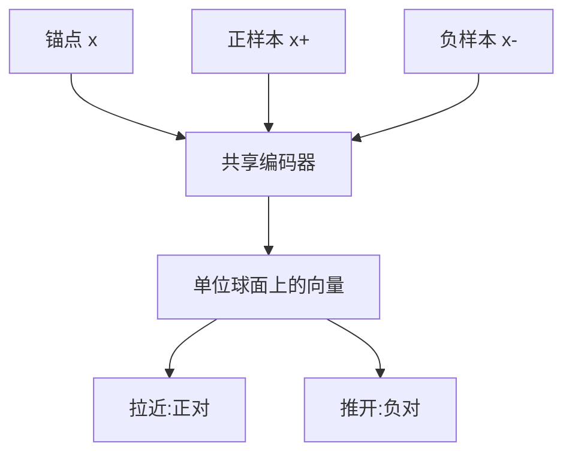

# 对比学习

一句话:对比学习是**不要类别标签、只要「谁和谁是一对」的表示学习**——把配对的拉近、把没配对的推开,学出来的向量直接拿去检索、分类和跨模态对齐。本篇是对比学习机制的主负责篇,InfoNCE、温度和负样本工程都在这里讲透;按任务选损失的总览见 损失函数 篇,交叉熵自身的梯度与标签平滑见 分类损失 篇,检索场景怎么建库、怎么做 ANN 与检索评测见 Embedding 篇。

## 一、它在学什么:监督信号从「是什么」换成「是不是一对」

监督学习要的是**每条样本的类别标签**,对比学习只要一件弱得多的东西:**哪两条样本该被看成同一个东西**。这个差别决定了它的适用面——类别随时新增(商品、人脸、文档)或者压根没有类别可言(一句话和一张图算哪一类?)的时候,分类范式定义不出来,而「这两条是一对」总能定义出来。

### 正对从哪来

三条最常见的造法,后面 SimCLR、SimCSE、CLIP 正好各占一条:

| 正对来源 | 具体做法 | 在要求模型对什么不变 |
|---|---|---|
| 人为增强 | 同一张图裁剪、变色、模糊两次(SimCLR) | 对这些增强不变,所以**增强设计就是任务定义** |
| 模型自身随机性 | 同一个句子过两次带 dropout 的编码器(SimCSE) | 对内部噪声不变,几乎不引入人为先验;文本侧成本最低,因为删词、替换很容易改掉语义 |
| 天然配对 | 图片和它的说明文字、query 和被点击的文档(CLIP) | 对模态与表达形式不变 |

第一行那句是这一族最容易被跳过的坑:**你增强掉的信息,模型就学会不在乎**。颜色抖动开得猛,模型就不再区分颜色,下游若是花卉分类直接废掉。各模态该怎么增强、增强质量怎么验收,见 数据工程 篇。

### 为什么这么训能学出可迁移的表示

因为「在一堆候选里认出配对的那个」是一道**必须靠语义才做得对的题**:要把自己这张图和另外几千张分开,编码器就得留住足以定位这个实例的信息;同时它又被要求在两个视图之间保持一致,于是那些随增强乱变的表面细节留着也没用。**留下语义、丢掉表面**,这就是可迁移性的来源。和生成式自监督(BERT 的掩码建模、MAE 的像素重构)的分工也在这里:重构目标**信号密集、不用设计负例,但会保留大量检索根本用不上的细节**(纹理、排版);对比目标直接优化「相似度结构」这件下游真正要用的性质,代价是全部押在正负样本怎么造上。两条路线的横向定位见 预训练流程 篇。



## 二、InfoNCE:说到底是一道 N 选 1 的分类题

$$
\mathcal{L}_{\mathrm{InfoNCE}}=-\log\frac{\exp\big(s(q,k^{+})/\tau\big)}{\sum_{j=1}^{N}\exp\big(s(q,k_j)/\tau\big)}
$$

意思是:给锚点 $q$ 配 $N$ 个候选,其中恰好一个是正例 $k^{+}$(分母里也包含它),把相似度除以温度当成 logits 做一次 softmax,再对正例取负对数。**这就是一道 $N$ 选 1 的选择题**,所以它和交叉熵不是两族东西,只是把「类别」换成了「这一批候选」,softmax 交叉熵的全部性质对它照样成立。

### 为什么要先 L2 归一化再算内积

三条理由说归一化,外加一条配套的维度对齐,面试里最好都说到:

1. **归一化之后内积就是余弦相似度**,取值被钉在 $[-1,1]$。不归一化的话模型可以靠**把向量拉长**来抬高所有相似度,这条捷径与语义无关,却真能让 loss 下降。
2. **尺度可比,温度才有意义**。$\tau$ 是给相似度统一做的缩放;量程随向量范数漂移时,同一个 $\tau$ 在训练前后完全不是一回事。
3. **数值上安全**。内积上界为 1,除以 $\tau=0.07$ 后 logits 最大约 14;不归一化时点积轻易上百,`exp` 直接溢出。
4. 两个模态或两个塔的原始维度不同时,要**各自过一个可训练的投影层映射到同一维度**,不能截断或补零——截断是人为丢掉某几维,投影层则是让模型自己学「怎么对齐到公共空间」。

### 温度 $\tau$ 在做什么

把梯度写出来最清楚。记 $z_j=s_j/\tau$、$p_j=\mathrm{softmax}(z)_j$:

$$
\frac{\partial \mathcal{L}_{\mathrm{InfoNCE}}}{\partial s_j}=\frac{1}{\tau}\big(p_j-\mathbf{1}[j=+]\big)
$$

意思是:每个候选拿到的推力,等于**它当前被判成正例的概率**减去它到底是不是正例,再统一放大 $1/\tau$ 倍。两个后果——**分数越高的负例 $p_j$ 越大,被推开的力气也越大**,这就是「对比损失自带难负例加权」的准确说法;而 $\tau$ 越小 softmax 越尖锐,权重越集中到最像的那几个负例上。

| $\tau$ | 分布形状 | 好处 | 代价 |
|---|---|---|---|
| 过小(如 0.01) | 极尖,近似只盯最难的一个负例 | 决策边界锐利,细粒度区分强 | 假负例和错标被同步放大;梯度方差大、易震荡 |
| 常用(0.05–0.2) | 适中,CLIP 初始化在 0.07 | 多数论文的取值区间 | 仍必须和负样本质量一起调 |
| 过大(如 1.0) | 接近均匀,各负例权重被拉平 | 训练稳,对假负例宽容 | 有效信号弱,表示区分度不足 |

**不要背固定数值**。合适的 $\tau$ 取决于相似度尺度、有没有归一化、负例数量和负例质量;单独扫温度没有意义,要和难例比例一起搜,按检索指标而不是训练 loss 选(它和学习率、调度的耦合见 优化器 篇)。CLIP 的做法是**把温度当参数一起学**,并对它设上限防止 logits 被放大到失控,这比人手定一个数省事得多。

### 那条互信息下界的成立条件

CPC 原论文给出 $I(q;k^{+})\ \ge\ \log N-\mathcal{L}_{\mathrm{InfoNCE}}$:损失压得越低、候选数 $N$ 越大,能保证的互信息下界就越高——这是「负样本多一点有好处」最常被引用的理论依据。但它有硬前提:**正例来自联合分布、其余候选独立采自边缘分布**。一旦做了难负例挖掘,负例就不再是独立的边缘样本,这个界不能直接沿用;而且它顶多给到 $\log N$,$N$ 从一万涨到十万也只多 2.3 nat,**不足以支撑「batch 越大越好」这种结论**。

## 三、InfoNCE 与 BCE:归一化和梯度分配的差别

这是最容易答得含糊的一道题。先把两个式子并排放着,令候选分数 $z_j=s_j/\tau$:

$$
\mathcal{L}_{\mathrm{InfoNCE}}=-\log\frac{e^{z_{+}}}{\sum_{j=1}^{N}e^{z_j}},\qquad
\mathcal{L}_{\mathrm{BCE}}=-\sum_j\big[y_j\log\sigma(z_j)+(1-y_j)\log\big(1-\sigma(z_j)\big)\big]
$$

意思是:左边先在 $N$ 个候选之间做一次 softmax 归一化,问的是**哪一个**是配对的;右边对每一对单独过 sigmoid,问的是这一对**是不是**配对的,各问各的,没有一个分母把它们连起来。梯度把这个差别放得更大:

$$
\frac{\partial \mathcal{L}_{\mathrm{InfoNCE}}}{\partial z_j}=p_j-\mathbf{1}[j=+],\qquad
\frac{\partial \mathcal{L}_{\mathrm{BCE}}}{\partial z_j}=\sigma(z_j)-y_j
$$

意思是:InfoNCE 那一列的梯度**加起来恒等于零**(因为 $\sum_j p_j=1$),正例被拉、负例被推,推力是从同一份预算里分出去的——一个负例分数涨了,别的负例拿到的梯度自动变小,**候选之间在竞争**。BCE 这一列各算各的,$\sigma(z_j)-y_j$ 只看自己的分数,别的候选怎么变都影响不到它。

| | InfoNCE | BCE(逐对 sigmoid) |
|---|---|---|
| 似然解释 | $N$ 个候选里选出正例的类别似然 | 每一对是否匹配的伯努利似然 |
| 归一化 | 候选集合上的 softmax 分母 | 没有,逐对独立 |
| 梯度分配 | 竞争式、零和;难负例自动拿到大权重 | 独立式;难例要靠采样或加权显式安排 |
| 对批大小 | 强依赖,一个批就是一个候选集 | 弱依赖,可以任意切分批次再累加 |
| 主要旋钮 | 温度、负例数量与质量 | 正负比例、分数尺度与偏置、判定阈值 |
| 天然场景 | 单正例检索、实例判别、图文对齐 | 二分类、多标签、独立配对判定 |

**CLIP 为什么选 InfoNCE**:图文对齐的任务形态本来就是「这批里哪段文本配这张图」,单正例、只关心相对顺序,softmax 直接把这件事写成了目标;而且它不必为「匹配/不匹配」调正负比例和绝对分数尺度,少一堆超参。**但 BCE 并不是做不了**——SigLIP 就用带可学习尺度和偏置的逐对 sigmoid 损失替掉了全局 softmax:每一对独立判定,不需要把整张相似度矩阵跨设备拼起来,于是小批量更友好、批也更容易做大。顺带纠一个常见误解:**这里的「是/不是一对」标签同样是配对关系自动生成的,BCE 并不比 InfoNCE 更依赖人工标注**,两者的分野在归一化方式,不在标签来源。代价是要显式处理极端不平衡(一个 $B\times B$ 矩阵里只有 $B$ 个正例),那个可学习的偏置正是干这个用的。两者的优劣**必须在同样的数据与算力预算下比**,不存在一个绝对更好。

## 四、三条代表路线:SimCLR、MoCo 与 CLIP

| | SimCLR | MoCo | CLIP |
|---|---|---|---|
| 正例哪来 | 同一图像的两次增强 | 同一图像的两次增强 | 天然配对的图文对 |
| 负例哪来 | 同一批里其余视图 | **队列里的历史 key** | 同一批里其余图文 |
| 负例数与批大小 | 绑死,批多大候选就多大 | **解耦**,队列长度独立于批 | 绑死 |
| 关键部件 | 非线性投影头 | 动量(EMA)key 编码器 + 队列 | 双塔 + 可学习温度 |
| 主要代价 | 大批量的显存与通信 | 队列里的表示是旧的,存在滞后 | 依赖大规模配对数据,假负例多 |
| 论文自报配置 | 批量最大 8192 | 队列 65536、动量 0.999 | 批量 32768 |

各自解决了什么,三句话:

- **SimCLR 证明的是配方比结构更重要**:强增强的组合、一个只在训练时用的非线性投影头、加上足够大的批量,不改结构也能把对比学习做上去。投影头的作用是**让对比损失去折腾投影后的空间,把主干表示保护起来**——下游取的是投影头之前的特征,因为投影之后的向量已经为了对比任务丢掉了一部分下游还想要的信息。
- **MoCo 解决的是负例数量被显存卡死**:把历史 batch 的 key 存进一个先进先出的队列,候选数就和批大小脱钩了。但队列里的 key 来自过去若干步的编码器,**如果这个编码器跟着梯度快速变化,队列里的表示彼此不一致,这道选择题的选项就等于各说各话**;所以 key 编码器不做反传,只按 query 编码器的指数移动平均慢慢跟,动量取 0.999 这种贴近 1 的值,正是为了让几万条跨度的队列保持可比。
- **CLIP 把正对的来源从人造增强换成互联网上天然存在的图文配对**,学到的于是不再只是模态内的不变性,而是**两个模态被强行放进同一个空间**:损失要求图像向量在一批文本里认出自己那段,文本向量也要在一批图像里认出自己那张。这个跨模态约束是 SimCLR 那种单模态目标推导不出来的;零样本分类就是共享空间的直接产物,把类别名写成一句话编码成向量,和图像向量比余弦即可。

### 双向图文对比损失:为什么必须算两个方向

一批 $B$ 对图文,归一化后的相似度矩阵 $s_{ij}$ 的对角线就是正例:

$$
\mathcal{L}=\frac{1}{2B}\sum_{i=1}^{B}\left[-\log\frac{e^{s_{ii}/\tau}}{\sum_{j}e^{s_{ij}/\tau}}-\log\frac{e^{s_{ii}/\tau}}{\sum_{j}e^{s_{ji}/\tau}}\right]
$$

意思是:第一项**按行**看,第 $i$ 张图要在 $B$ 段文本里挑出第 $i$ 段;第二项**按列**看,第 $i$ 段文本要在 $B$ 张图里挑出第 $i$ 张。两项的正例是同一个对角线元素,但分母不同——行的分母是这张图对所有文本的分数,列的分母是这段文本对所有图的分数。**只算一个方向,另一模态就永远只当候选、从没被要求主动去认人**,表示会偏;而检索本来也是双向使用的(以图搜文、以文搜图)。

```python
img = F.normalize(img_emb, dim=-1)        # L2 归一化后,点积才等于余弦相似度
txt = F.normalize(txt_emb, dim=-1)
logits = img @ txt.T / temperature        # (B, B);对角线是正例,同批其余为负例
labels = torch.arange(len(logits), device=logits.device)   # 第 i 行的答案就是第 i 列
loss = (F.cross_entropy(logits, labels)                    # 图 → 文:按行做 N 选 1
        + F.cross_entropy(logits.T, labels)) / 2           # 文 → 图:转置后再做一次
```

这几行只是损失本身。**离一套能跑的 CLIP 还差**:两个模态的编码器与投影头、可学习且需要设上限的温度、跨设备收集负例与随之而来的全局标签偏移、混合精度与大批量训练的整套工程(完整可跑实现归题库的手撕代码题)。后续改进沿两个方向走:**细粒度对齐**,FILIP 把单一全局向量的点积换成图像 patch 与文本 token 之间的后交互相似度,缓解「一个向量装不下一整幅图」;**数据效率**,DeCLIP 额外叠加模态内自监督、多视图与近邻监督,让每条配对数据被榨出更多信号。至于 LLaVA 这类多模态大模型,它**继承的是 CLIP 训好的视觉编码器,而不是继续优化 InfoNCE**——后面接投影层送进语言模型,训练目标换成生成式的逐 token 交叉熵(结构见 VLM结构 篇)。

## 五、负样本工程:难负例、假负例和批大小

### 难负例为什么有益,又为什么不是越难越好

从第二节那个梯度看:简单负例的 $p_j$ 接近 0,**它在这一批里几乎不产生梯度**,一万个这样的负例加起来也推不动决策边界。所以细粒度检索必须混进「长得像但确实不对」的负例,模型才被逼去看真正能区分它们的那点差异。但难度和正确性是两回事:**难度最高的那批候选,恰恰也是假负例、错标和异常点最集中的地方**。三类风险按踩中频率排:

| 风险 | 识别线索 | 处理办法 |
|---|---|---|
| 假负例(其实是正例) | 同义文本、重复商品、同一语义类别、一个 query 多个正确答案 | 去重;用交叉编码器或更强的教师复核;确认相关就改成多正例或屏蔽降权 |
| 标注噪声与异常点 | 难度分桶后该桶 loss 与梯度范数异常大,留出指标反而下降 | 降低最难桶的比例、更新挖掘模型、与随机负例混合 |
| 反馈本身有偏 | 未曝光、位置靠后、反馈延迟,「未点击」不等于不喜欢 | 区分曝光状态与观察窗口,按任务重新定义负例并校准采样分布 |

**高 loss 不能直接当删除依据**——困难样本可能正是关键长尾。自动过滤只能靠组合线索(模型分数、多模型一致性、重复检测、延迟反馈的修正),而且必须抽样人工审查、评估误删率,不能当成一套已验证的通用方案。

### 难度怎么控制

四个旋钮,建议按这个顺序上:

1. **先建随机负采样基线**,再按比例混入检索出的高分负例;按难度分桶控制配比,而不是把最难的一股脑全塞进去。
2. **课程式推进**:训练早期模型自己还不可靠,挖出来的「难例」多半是噪声,从中等难度起步、逐步加码更稳。但这不是铁律,数据信噪比高时一开始就上难例也行。
3. **semi-hard 采样**:只取比正例远、但还没远出 margin 的那批负例,避开最极端的一撮。
4. **去偏与可控难度**:有工作从「负例本来就是从边缘分布采的、天然混着同类样本」这个前提出发,给损失做一个统计修正,并把「要多难」做成可调系数,而不是靠硬阈值卡。

**温度和难例比例必须联合调**。第二节说过 $\tau$ 越小越集中在难负例上,所以难例已经很多时再调小温度是火上浇油——想软化分布得**调大**温度。这里最容易记反。

### 批大小与负例数量

批内负例是最省事的负例来源,一个 $B\times B$ 矩阵白送 $B-1$ 个候选,所以 InfoNCE 天然依赖批大小。但**大批量不是免费的**:显存与跨卡通信线性上涨;批一大,碰到真难例的机会和碰到假负例的机会**同步上升**,难度是被动抬高的而不是挑出来的;而收益按前面那个 $\log N$ 走、边际递减。所以「加难例」和「加批量」是两个不能互相替代的旋钮——前者提质,后者提量。四条解耦手段:

| 手段 | 怎么做 | 代价 |
|---|---|---|
| 跨设备收集 | all-gather 各卡的表示,拼成全局候选集 | 通信量上升;**全局标签要按本卡偏移重算**,否则正例对不上(通信原语见 集合通信 篇) |
| 队列 / 记忆库 | 存历史 batch 的表示当候选(MoCo、跨批记忆) | 表示陈旧;要靠动量编码器或足够小的学习率压住不一致 |
| 梯度缓存 | 先不带梯度算完整批的相似度,再分块重算反传 | 多一次前向的算力,换任意大的有效批 |
| 难负例挖掘 | 用少量高质量难例顶替海量随机负例 | 需要一个挖掘模型和定期刷新的索引 |

一条常见误解要澄清:**普通的梯度累积不会增加候选集合**。累积只是把几个小批的梯度加起来,每个小批的 softmax 分母还是只有那个小批,负例数一点没变。**loss 震荡先查什么**:标签和采样分桶对不对、相似度有没有归一化、梯度有没有裁剪;确认这些没问题,再单独调难例比例、温度或学习率,一次只动一个。**高 loss 本身不必然导致梯度爆炸**,InfoNCE 对 logits 的梯度被 softmax 概率界在 $[-1,1]$ 内,真正的放大器是那个 $1/\tau$。推荐场景还有一层特殊性:召回和精排的负例定义完全不同(全库随机采样 vs 曝光未点击),假负例比例也差一个量级,双塔结构与线上服务见 推荐模型 篇。

## 六、Triplet 与 margin:和 InfoNCE 怎么分工

$$
\mathcal{L}_{\text{triplet}}=\big[\,d(a,p)-d(a,n)+m\,\big]_{+}
$$

意思是:锚点 $a$ 到正例 $p$ 的距离,要比到负例 $n$ 的距离至少小一个间隔 $m$;差距已经够大时括号里为负,取正部之后损失为零,这个三元组**就再也不提供任何梯度**。注意方向,改用**相似度**(越大越近)时符号要整个反过来,写成 $[\,s(a,n)-s(a,p)+m\,]_{+}$,这是最常见的实现错误。$m$ 的两头:太小则大量三元组一开始就满足、有效梯度枯竭;太大则几乎所有三元组长期带损失,模型被迫去挤压本来合理的类内结构。判据不是 $m$ 的数值,而是**有效三元组(损失非零的那些)的占比还在不在合理区间**,以及类内、类间距离的实际分布。

| | Triplet | InfoNCE |
|---|---|---|
| 监督单位 | 一个三元组 | 一个锚点 + 一整批候选 |
| 每步用到的负例 | 1 个,或挖掘出的少数几个 | $N-1$ 个,批内全员 |
| 关键超参 | margin | 温度 |
| 更合适的场景 | 一次只拿得到「A 比 B 更相关」这种判断;或负例必须逐条筛过 | 能一次凑出大批候选,且每个锚点只有一个正例 |

还有一条边界:**InfoNCE 的标准形式假设只有一个正例**。一个 query 对应多个相关文档时直接套用,会把其余正确答案当负例推开;正确做法是换成多正例形式(把多个正例的项加进分子,或对每个正例各算一次再平均),或者把已知相关的候选从分母里屏蔽掉。有类别标签时,把同类样本全部当正例的监督式变体也走这条路。

## 七、不用负样本行不行:表示塌缩与 BYOL、SimSiam

**表示塌缩**是指编码器把所有输入都映射到同一个、或者极低维的向量。这时正对的相似度恒为 1,只拉近不推开的目标**直接就被优化到零**,而表示毫无用处。负样本的头号作用其实就是防这件事:它提供了一股把不同实例撑开的斥力。

但负样本不是唯一的防塌缩手段。BYOL 用**在线网络加目标网络**两条支路,目标网络的参数是在线网络的指数移动平均且不回传梯度,在线支路上多接一个 predictor 去预测目标支路的输出;SimSiam 更进一步,连动量都去掉,只靠 **predictor 与 stop-gradient** 这一对——论文的消融显示,把 stop-gradient 拿掉,训练立刻塌缩。所以**它们不代表负样本没用,只代表防塌缩这件事可以改由结构上的不对称来承担**。代价是这类方法对结构细节(predictor 的宽度、EMA 系数、归一化)更敏感,调不好就当场塌给你看,而 InfoNCE 至少塌不了。

## 八、怎么验收:训练 loss 是最不该看的那个数

**训练 loss 跨配置根本不可比**。批大小一变,这道选择题的选项数就变了,$\log N$ 那条基线跟着变;温度一变,logits 尺度也变。loss 降了,可能只是题变简单了。该看的是这三类:

- **表示质量**:线性探测(冻住主干,只在上面训一个线性分类器)、kNN 评测(完全不训,直接最近邻投票)、跨模态场景的零样本分类。线性探测的意义在于它测的是「表示里有没有这个信息、且以线性可读的方式存着」,而不是「再训一个大脑袋能不能救回来」。
- **检索指标**:Recall@K、MRR、nDCG,在**独立的、贴近线上分布的**验证集上算;难例比例一改就要重新验,不能沿用旧阈值。
- **对齐与均匀性**:把表示放到单位球面上看两个可测量的量——**对齐度**是正对之间的平均距离(越小越好),**均匀性**是全体表示在球面上的分散程度(越均匀,保留的信息越多)。它们给了温度一个可解释的说法:小温度把最像的负例推得更狠,球面更均匀,但对语义近邻更不宽容;大温度反过来。二者此消彼长,可以直接画出来当诊断工具。

> 🖼️ 占位:单位球面上的对齐与均匀性示意——左图为塌缩(所有点挤成一团)、中图为对齐好但分布不均、右图为两者兼顾,并用连线标出正对

## 面试考点串联

| 高频问法 | 本文哪一节 |
|---|---|
| SimCLR、MoCo、CLIP 各自怎么构造对比任务?正例和负例分别从哪来,演进上各解决了什么问题? | 四 |
| CLIP 的对比损失和 SimCLR 有什么本质区别,为什么它能学到跨模态对齐? | 四 · 一 |
| CLIP 训练里的难负样本问题怎么解决?有哪些改进工作? | 五 · 四(末段) |
| 对比学习在 LLaVA 这类多模态大模型里是被继承还是被改造了? | 四(末段) |
| 对比学习和生成式自监督(MAE、BERT 掩码建模)各自的优劣是什么? | 一 |
| 温度系数 $\tau$ 起什么作用?调大调小怎么影响优化动态,要不要和难负样本比例一起调? | 二 · 五 |
| 负样本的数量和难度分别与 batch size 是什么关系?负样本不足怎么缓解? | 五 |
| InfoNCE 和 BCE 在数学形式、优化目标和适用场景上差在哪?为什么两者都能做表示学习? | 三 |
| 为什么 CLIP 用 InfoNCE 而不是 BCE?BCE 就做不了图文对齐吗? | 三 |
| 难负样本是不是越难越好?它怎么影响收敛和泛化,什么场景该优先用? | 五 |
| 怎么自动识别「过难」的负样本并过滤?真难负例和假阴性怎么区分? | 五 |
| 推荐系统里做对比学习,难负样本有什么特殊考量? | 五(末段) |
| 训练中难负样本引起 loss 震荡,你怎么诊断和解决? | 五 |
| 批内负样本的图文对比损失怎么组织?为什么先 L2 归一化、为什么算两个方向?离完整 CLIP 还差什么? | 四 · 二 |
| 两个模态维度不同时,为什么要用投影层而不是直接截断比较? | 二 |
| 用队列或跨卡全局 batch 扩负样本时,陈旧表示和跨卡标签怎么处理? | 五 |
| MoCo 的 key 编码器为什么要动量慢更新?直接共用当前编码器会怎样?(补充题) | 四 |
| InfoNCE 那个互信息下界要什么条件才成立?挖了难负例之后还能这么讲吗?(补充题) | 二(末段) |
| 什么是表示塌缩?BYOL、SimSiam 不用负样本靠什么不塌?(补充题) | 七 |
| 什么时候该用 Triplet 而不是 InfoNCE?一个 query 有多个正例时还能直接用吗?(补充题) | 六 |
| 对比学习训完怎么验收?只看训练 loss 降不降行不行?(补充题) | 八 |

各族损失怎么横向选型见 损失函数 篇;交叉熵的梯度推导、标签平滑与类别不平衡见 分类损失 篇;数据增强的模态做法见 数据工程 篇;向量建库、ANN 与检索评测见 Embedding 篇;双塔召回的结构与线上服务见 推荐模型 篇。

## 相关文献

- Representation Learning with Contrastive Predictive Coding(InfoNCE 与互信息下界)— [arXiv:1807.03748](https://arxiv.org/abs/1807.03748)
- A Simple Framework for Contrastive Learning of Visual Representations — [arXiv:2002.05709](https://arxiv.org/abs/2002.05709)
- Momentum Contrast for Unsupervised Visual Representation Learning — [arXiv:1911.05722](https://arxiv.org/abs/1911.05722)
- Learning Transferable Visual Models From Natural Language Supervision(CLIP)— [arXiv:2103.00020](https://arxiv.org/abs/2103.00020)
- Sigmoid Loss for Language Image Pre-Training(SigLIP)— [arXiv:2303.15343](https://arxiv.org/abs/2303.15343)
- SimCSE: Simple Contrastive Learning of Sentence Embeddings — [arXiv:2104.08821](https://arxiv.org/abs/2104.08821)
- FaceNet: A Unified Embedding for Face Recognition and Clustering(Triplet 与难例挖掘)— [arXiv:1503.03832](https://arxiv.org/abs/1503.03832)
- Supervised Contrastive Learning(多正例形式)— [arXiv:2004.11362](https://arxiv.org/abs/2004.11362)
- Approximate Nearest Neighbor Negative Contrastive Learning for Dense Text Retrieval — [arXiv:2007.00808](https://arxiv.org/abs/2007.00808)
- Debiased Contrastive Learning — [arXiv:2007.00224](https://arxiv.org/abs/2007.00224)
- Contrastive Learning with Hard Negative Samples — [arXiv:2010.04592](https://arxiv.org/abs/2010.04592)
- Understanding the Behaviour of Contrastive Loss(温度的均匀性与宽容度权衡)— [arXiv:2012.09740](https://arxiv.org/abs/2012.09740)
- Understanding Contrastive Representation Learning through Alignment and Uniformity on the Hypersphere — [arXiv:2005.10242](https://arxiv.org/abs/2005.10242)
- Scaling Deep Contrastive Learning Batch Size under Memory Limited Setup(梯度缓存)— [arXiv:2101.06983](https://arxiv.org/abs/2101.06983)
- Cross-Batch Memory for Embedding Learning — [arXiv:1912.06798](https://arxiv.org/abs/1912.06798)
- Bootstrap your own latent: A new approach to self-supervised Learning(BYOL)— [arXiv:2006.07733](https://arxiv.org/abs/2006.07733)
- Exploring Simple Siamese Representation Learning(SimSiam)— [arXiv:2011.10566](https://arxiv.org/abs/2011.10566)
- FILIP: Fine-grained Interactive Language-Image Pre-Training — [arXiv:2111.07783](https://arxiv.org/abs/2111.07783)
- Supervision Exists Everywhere: A Data Efficient Contrastive Language-Image Pre-training Paradigm(DeCLIP)— [arXiv:2110.05208](https://arxiv.org/abs/2110.05208)
