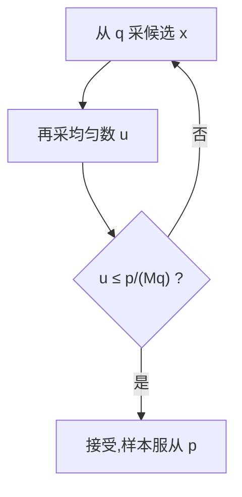

# 拒绝采样

一句话:拒绝采样是**从一个好采的分布里生成候选、再按一个精确算好的概率决定留不留**,留下来的样本严格服从目标分布——它是少数几个能把"我没采歪"当场证明出来的采样方法。面试里真正的坑不在算法本身,而在大模型圈把"采 N 个答案挑最好的"也叫拒绝采样,两件事除了名字之外没有一处相同。

## 一、它解决的是什么问题

有一类分布,你**写得出它的密度,却采不出它的样本**。比如"从模型分布里只要那些通过单元测试的回答""从一个加了硬约束的条件分布里采样""贝叶斯后验只知道正比于某个式子"。密度算得出来(哪怕只知道未归一化的部分),但没有现成的随机数发生器直接吐出这个分布的样本。

拒绝采样用三样东西把这件事绕过去:

| 记号 | 是什么 | 要求 |
|---|---|---|
| $p(x)$ | 目标分布,你想要的那个 | 密度**能算**,不必能采 |
| $q(x)$ | 提议分布,退而求其次的那个 | 必须**好采**,且 $p(x)>0$ 处 $q(x)>0$ |
| $M$ | 包络常数 | 对**所有** $x$ 满足 $p(x)\le M q(x)$ |

流程只有三步:从 $q$ 采一个候选 $x$,再采一个均匀随机数 $u\sim U(0,1)$,若 $u\le \dfrac{p(x)}{Mq(x)}$ 就接受,否则把这个候选整个扔掉、从头再来。



几何上更好记:$Mq(x)$ 是一顶罩住 $p(x)$ 的帐篷,在帐篷底下均匀撒点,落在 $p$ 曲线以下的点保留、夹在曲线和帐篷之间的点扔掉。留下来那些点的横坐标,就服从 $p$。

> 🖼️ 占位:$Mq(x)$ 的包络罩住 $p(x)$ 的几何示意——帐篷底下均匀撒点,曲线以下的保留、曲线与包络之间的扔掉;标出"帐篷越贴合,浪费越少"

## 二、为什么接受到的样本严格服从 $p$

这是本篇最该讲透的一条。分两步,每步只有一行。

**第一步,写出"采到 $x$ 并且接受它"的联合密度**。采到 $x$ 附近的密度是 $q(x)$,采到之后留下它的概率是 $p(x)/(Mq(x))$,两件事独立,相乘:

$$
q(x)\cdot\frac{p(x)}{M\,q(x)}=\frac{p(x)}{M}
$$

人话:$q(x)$ 被约掉了。**接受这一下,恰好把提议分布的形状抹干净,只留下目标分布的形状**——这就是全部魔法所在,后面一步只是算常数。

**第二步,把它归一化**。对全部 $x$ 积分,得到"任意一轮里发生接受"的总概率:

$$
\Pr[\text{接受}]=\int \frac{p(x)}{M}\,\mathrm{d}x=\frac{1}{M}
$$

人话:因为 $p$ 本身积分为 1,总接受率恰好是 $1/M$。于是"已知接受了,样本落在 $x$ 处"的条件密度是 $\dfrac{p(x)/M}{1/M}=p(x)$,$M$ 上下一约就消失了。

由此得到两条直接可用的结论:

- **只要上界成立,$M$ 取多大都不影响正确性**,它只影响效率。这解释了为什么"我怕不够大,把 $M$ 往上加一点"是安全的,而"我嫌太慢,把 $M$ 调小一点"是致命的
- **不需要知道归一化常数**。只有未归一化的 $\tilde p$ 时,找一个满足 $\tilde p(x)\le Mq(x)$ 的 $M$,同样的两步推导给出条件密度正比于 $\tilde p$,也就是 $p$。区别只在接受率:此时是 $Z/M$,其中 $Z=\int\tilde p$ 是那个你并不知道的归一化常数

一个能口算的例子:想要 A、B 的概率是 0.8 与 0.2,但手上只有一枚公平硬币(各 0.5)。上界要求 $0.8\le 0.5M$,取 $M=1.6$。接受概率:A 是 $0.8/(1.6\times0.5)=1$,B 是 $0.2/(1.6\times0.5)=0.25$。每轮留下 A 的概率 $0.5$、留下 B 的概率 $0.125$,总接受率 $0.625=1/1.6$;归一化后正是 0.8 与 0.2。

## 三、接受率就是 $1/M$:选错了会怎样

接受率 $1/M$ 意味着**平均要采 $M$ 个候选才留下 1 个**(尝试次数服从几何分布,期望为 $M$)。所以 $M$ 是效率的全部:最优取法是最紧的上界 $M=\sup_x p(x)/q(x)$。

三种典型的选错,后果完全不同:

| 选法 | 还无偏吗 | 后果 |
|---|---|---|
| $M$ 比最紧上界大很多 | 无偏 | 纯粹浪费吞吐,采 100 个扔 99 个 |
| $M$ 不满足上界(某处 $p>Mq$) | **不无偏** | 那一段的接受概率被截到 1,概率质量被系统性削掉,分布向 $q$ 偏 |
| $q$ 的支撑集盖不住 $p$ | **不无偏** | $p>0$ 而 $q=0$ 的地方比值发散,再大的 $M$ 也盖不住,那部分永远采不到 |

后两种最阴险的地方是**它们不会报错**:程序照常跑、样本看起来很正常,只是尾巴被悄悄削平了。所以工程实现里那句 `assert` 不是装饰。

```python
def rejection_sample(p, q_sample, q_pdf, M, rng):
    """从提议分布 q 采候选,按 p/(M·q) 接受;返回的样本严格服从 p"""
    while True:
        x = q_sample(rng)              # 第一步:从好采的 q 里抽一个候选
        a = p(x) / (M * q_pdf(x))      # 第二步:接受概率,必须处处 ≤ 1
        assert a <= 1 + 1e-9           # 上界一旦不成立,结果就不再无偏且不报错
        if rng.random() < a:           # 第三步:掷一枚偏心硬币
            return x                   # 接受;否则整个候选作废,重新来过
```

还有一个高频的实现坑:为了防死循环设一个"最多重试 K 次,超了就把最后那个候选交出去"。这一步直接毁掉无偏性——交出去的样本服从的是"连续被拒绝 K 次之后的候选"分布,而那正好是被 $p/q$ 压得最狠的那批。要么老实重试,要么明说这是近似,不能两边都要。

## 四、高维为什么会慢:失配按维度累乘

假设 $d$ 个维度互相独立,每一维上 $q$ 与 $p$ 的失配需要 $M_1$ 才盖得住,那么整体的最紧上界是 $M=M_1^{\,d}$,接受率是 $M_1^{-d}$——**每维那一点点失配,在维度上被连乘放大**。

代入看有多恐怖:每维接受率 0.9(已经算贴得很紧了),10 维还剩 0.35,50 维剩 0.5%,100 维剩 $2.7\times10^{-5}$,也就是平均要采将近 4 万个候选才留下一个。这就是"维度诅咒"在采样上的形态:$q$ 与 $p$ 的重叠随维度指数衰减。

MacKay 教材里有个例子更能说明"贴得很紧"有多不够用:目标和提议都是零均值高斯,提议的标准差只比目标大 **1%**,在 1000 维下所需的 $M$ 就是 $\exp(1000\ln 1.01)\approx\mathrm{e}^{10}\approx 20{,}000$,接受率就是 1/20000。**差这 1%,就够让两万个候选里只活下来一个**,这才是高维的真实手感。

必须带一个限定,否则会被追问打回:**这不是"高维必然慢"的定理**。$q=p$ 时 $M=1$,再高的维度也全部接受。真正的原因是失配被累乘,所以高维下的正确说法是——**能不能用,取决于你能不能找到贴合的提议分布**。

工程上的改善方向,按有效程度排:

| 方向 | 具体做法 | 代价 / 限制 |
|---|---|---|
| 让 $q$ 贴得更紧 | 用一个近似模型、矩匹配或分段拟合的提议分布 | 要额外建模,且 $q$ 自己仍必须好采 |
| 收紧包络 | 自适应拒绝采样:用分段线性包络边采边收紧 | 只对特定形状(如对数凹密度)成立 |
| 换不丢样本的方法 | 重要性采样(加权)、MCMC(相关样本) | 前者权重方差,后者收敛与自相关,见第五节 |
| 降维 / 分块 | 把一次高维接受拆成多次低维接受 | **分解必须合法**:逐 token 过滤与整段过滤一般不是同一个分布 |
| 批量并行 | 一次生成并评估一批候选 | 只压墙钟时间,接受率一点没变 |

最后一行值得单独记:批量化是纯工程收益,**它不解决统计问题**。接受率低到 $10^{-5}$ 时,并行度再高也救不回来。

## 五、和重要性采样的本质区别,以及 PPO 为什么用裁剪

重要性采样处理的是同一个困境,用的是同一个比值 $p/q$,但花法完全不同:

$$
\mathbb{E}_{x\sim p}[f(x)]=\mathbb{E}_{x\sim q}\!\left[\frac{p(x)}{q(x)}f(x)\right]
$$

人话:一个样本都不丢,而是给每个从 $q$ 采来的样本贴一个权重 $w(x)=p(x)/q(x)$——目标分布觉得常见、提议分布觉得罕见的样本要放大,反之缩小。

两者的分野可以一句话说死:**拒绝采样丢样本,换来手上剩下的每一个样本本身就服从 $p$;重要性采样一个不丢,换来的是一堆只能用于估期望的带权样本**。

- 拒绝采样的样本是"干净"的:拿去算任何函数的期望、当训练数据、做任何统计量都行。代价是必须存在有限上界 $M$,而且吞吐要打 $1/M$ 的折
- 重要性采样不需要上界,也不浪费任何一次昂贵的采样。但它的估计方差是 $\mathrm{Var}_q[wf]$,当 $p$ 与 $q$ 差得远时权重跨度极大,少数几个权重巨大的样本支配整个估计。常用的体检指标是有效样本量 $\mathrm{ESS}\approx(\sum_i w_i)^2/\sum_i w_i^2$,读作"这批带权样本相当于多少个等权样本";权重越悬殊,ESS 越小

**这正是 PPO 不敢直接用大比值、而要裁剪的原因。** 顺着上面的对照走三步就答完了:

1. **拒绝采样在这里根本用不了**。它要一个对所有轨迹成立的有限上界 $M\ge\sup \pi_\theta/\pi_{\text{old}}$,策略每步都在变,这个上确界既算不出也没有先验界;更要命的是 rollout 是 RL 里最贵的东西,按 $1/M$ 的比例扔掉大部分生成结果,成本上不可接受
2. **重要性采样能用,但方差先炸**。序列级比值是每步比值的连乘,几百个略偏离 1 的数相乘就指数放大,ESS 塌到个位数
3. **裁剪是第三条路**:既不丢样本、也不放任权重,而是把"比值过大的样本还能带来多少额外激励"截断掉。代价是**主动放弃无偏**,换回方差可控与单步更新幅度有界

一句话收口:**拒绝采样丢样本保无偏,重要性采样留样本保无偏但放任方差,PPO 裁剪则主动放弃无偏来换稳定**——三者是同一个 $p/q$ 的三种花法。裁剪的完整目标函数、$\varepsilon$ 怎么调、它到底裁的是什么,见 PPO 篇。

## 六、三个同名不同物:一张表分清

大模型语境里,"拒绝采样"这个词被借去指一件完全不同的事:**一个模型采 N 个答案、用奖励模型或规则打分、留下最好的那些拿去做 SFT**(常写作 RFT 或 best-of-N;Llama 2 的对齐流水线里就有这一步)。

它和经典拒绝采样只是撞了名:经典版按 $p(x)/(Mq(x))$ 这个**与好坏无关的概率**掷骰子决定去留;筛答案版按**分数排序取最优**,是确定性的择优。后果是留下的样本**不是模型分布的无偏样本**,而是一个被奖励重塑过的分布:高分区域被系统性放大,低分区域被清零。这正是它有用的原因(我们本来就想要更好的答案),但也意味着你不能拿它当"模型本来会说什么"的估计,更不能用它去估任何期望;多样性坍塌和模式集中都是这条的直接推论。

这中间还夹着一个值得记住的情形,面试里能拉开差距:**筛选规则如果是硬判据**(单元测试过不过、格式合不合法、答案对不对),那么"留下所有通过的"是一次**严格的**拒绝采样。此时 $q$ 就是模型自己的分布、接受概率取 0 或 1、$M=1/\Pr[\text{通过}]$,采到的样本精确服从条件分布"模型分布中通过校验的那一部分"。**按分数取 top-k 才是破坏无偏的那一步**,不是"筛"这个动作本身。

| | 经典拒绝采样 | 筛答案式(RFT / best-of-N) | 重要性采样 |
|---|---|---|---|
| 靠什么决定去留 | 概率比 $p/(Mq)$,掷骰子 | 奖励分数,排序择优 | 不做去留,只贴权重 $p/q$ |
| 丢不丢样本 | 丢,平均丢掉 $1-1/M$ | 丢,只留分数最高的那些 | 一个不丢 |
| 拿到的是什么 | 严格服从 $p$ 的干净样本 | 被奖励重塑过的分布 | 带权样本,只能用来估期望 |
| 保不保证无偏 | 保证(上界成立时) | **不保证**(硬判据筛选是例外,那时等价于条件分布的精确采样) | 期望无偏,但方差可能爆炸 |
| 代价是什么 | 吞吐打 $1/M$ 折,要找到有限 $M$ | 多样性坍塌、奖励投机 | ESS 塌缩,少数样本支配估计 |

四个边界,各留一句:奖励模型怎么训、best-of-N 与"算不算训练"的口径,见 RLHF与RM 篇;用筛出来的答案做 SFT 的训练侧做法(以及筛太狠会让训练分布只剩容易样本),见 SFT 篇;合成数据的验收与模型坍塌,见 数据工程 篇;教师模型采样造数据、序列级蒸馏,见 蒸馏 篇。

## 七、在解码里的位置:和 Top-p、Gumbel-Softmax 各管一件事

这三样经常被摆在一起问,但它们的目标根本不在同一个方向上:

| 方法 | 它到底在干什么 | 追不追求无偏 |
|---|---|---|
| Top-k / Top-p / 温度 | **主动改**分布——截掉尾巴、调整尖锐度,以提高文本质量 | 不追求,改分布本身就是目的 |
| Gumbel-Softmax | 把离散采样换成可导的连续松弛,好让梯度传回去 | 追求的是梯度可用,不是采样精确 |
| 拒绝采样 | 用**便宜分布的样本**,换**昂贵目标分布的无偏样本** | 追求,这是它存在的全部理由 |

所以在解码里,拒绝采样从来不是用来"改善文本质量"的——那是截断和惩罚的活。它的位置只有两个:

1. **加速**:目标分布贵(大模型一次前向),提议分布便宜(小模型或草稿头)。先用便宜的把后面几步猜出来,再用一次昂贵的前向批量做接受-拒绝判定,省下的是串行步数。这正是投机解码走的路。要注意规则本身被改造过:经典版被拒绝就整个作废、重新从 $q$ 采,而投机解码不能那样重来(重来要再花一次昂贵前向),算法细节见 投机解码 篇
2. **约束采样**:要从"满足某个条件的那部分分布"里采样时,直接采加判定是最朴素也最精确的做法,硬约束下就是第六节说的条件分布精确采样。工程上更常用的是在 logits 上打掩码(约束解码),因为它一次就中、不用重试,代价是掩码会把模型推离原分布,见 解码策略 篇

还有一个不显眼的位置:**采样 kernel 内部**。词表已经涨到十几万,朴素的 top-p 要对整个词表排序;有的推理引擎改用免排序的拒绝采样直接抽——猜一个阈值、试、不行再猜,同样是"用便宜的候选换目标分布的样本",细节同见 解码策略 篇。

## 面试考点串联

| 高频问法 | 本文哪一节 |
| --- | --- |
| 拒绝采样的原理和流程是什么?何时有效、何时效率低?它和大模型里的候选答案筛选、PPO 裁剪有什么区别? | 一、二(原理)+ 三、四(效率)+ 五、六(三处区别) |
| 拒绝采样与重要性采样本质上有什么区别,为什么 PPO 用裁剪? | 五 |
| 高维下拒绝采样为什么可能很慢,工程上怎样改善? | 四 |
| 与 Gumbel-Softmax、Top-p 相比,拒绝采样在解码中适合解决什么问题? | 七 |
| 为什么接受下来的样本"正好"服从目标分布?$M$ 在这个推导里去哪了?(补充题) | 二(两步推导,$M$ 在归一化时被约掉) |
| 只知道未归一化的密度,还能用拒绝采样吗?(补充题) | 二(能,但接受率不再是 $1/M$) |
| $M$ 取得比需要的大很多会怎样?取得不够大又会怎样?(补充题) | 三(前者只浪费,后者不再无偏且不报错) |
| 为了防死循环设一个"最多重试 K 次",这样做有什么问题?(补充题) | 三(交出去的是被压得最狠的那批候选) |
| 用规则筛掉不过单元测试的答案,和用奖励模型打分取最高分,这两种"拒绝采样"性质一样吗?(补充题) | 六(硬判据是精确的条件采样,取 top-k 不是) |
| 拿 best-of-N 筛出来的数据做 SFT,训练数据的分布发生了什么变化?(补充题) | 六(被奖励重塑,高分放大、低分清零) |
| 什么时候该放弃拒绝采样、改用 MCMC 或重要性采样?(补充题) | 四(找不到贴合的提议分布、接受率已经指数塌陷时) |
| 投机解码里的接受-拒绝,和经典拒绝采样是同一套规则吗?(补充题) | 七(思路同源但规则被改造过,细节见 投机解码 篇) |

延伸阅读顺序:本篇 → PPO(裁剪的完整形式)→ RLHF与RM(筛答案在对齐流水线里的位置)→ 投机解码 / 解码策略(采样在推理侧的落地)。

## 相关文献

本篇的核心是经典统计结论,主要出处是教材而非论文;下列 arXiv 条目只覆盖"大模型里叫这个名字的那些做法"。

- Information Theory, Inference, and Learning Algorithms(MacKay,教材;第 29 章 Monte Carlo Methods 的 29.3 节讲拒绝采样,含"高维下接受率指数衰减"的 1000 维高斯案例与 Gilks-Wild 自适应拒绝采样的凸性条件;官方免费 PDF)— https://www.inference.org.uk/mackay/itila/
- Pattern Recognition and Machine Learning(Bishop,教材;采样方法一章讲拒绝采样与重要性采样)— 作者/出版方页 https://www.microsoft.com/en-us/research/publication/pattern-recognition-machine-learning/
- Basic Sampling Algorithms(Gautam Iyer,CMU 课程讲义;拒绝采样的推导与例题)— https://www.math.cmu.edu/~gautam/c/2024-387/notes/02-sampling.html
- Proximal Policy Optimization Algorithms(裁剪目标的出处)— [arXiv:1707.06347](https://arxiv.org/abs/1707.06347)
- Llama 2: Open Foundation and Fine-Tuned Chat Models(对齐流水线里的 rejection sampling fine-tuning)— [arXiv:2307.09288](https://arxiv.org/abs/2307.09288)
- Scaling Relationship on Learning Mathematical Reasoning with Large Language Models(RFT 这个叫法的出处)— [arXiv:2308.01825](https://arxiv.org/abs/2308.01825)
- Statistical Rejection Sampling Improves Preference Optimization(把真正的拒绝采样用回偏好数据构造)— [arXiv:2309.06657](https://arxiv.org/abs/2309.06657)
- Fast Inference from Transformers via Speculative Decoding(解码侧用接受-拒绝换加速)— [arXiv:2211.17192](https://arxiv.org/abs/2211.17192)
