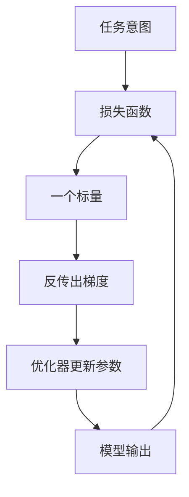

# 损失函数

一句话:损失函数是**唯一把「这个任务算什么叫做对」翻译成梯度的地方**——结构决定模型能表达什么,优化器决定它每步怎么走,而往哪里走完全由损失说了算。本篇是**总览篇**,只回答「这个任务该选哪个目标、为什么、什么时候该偏离默认」;分类与回归两族的完整机制交给 分类损失 篇与 回归损失 篇。

## 一、它到底在定义什么



这张图只有一个意思:整条训练回路里,**「什么算好」这件事只在损失这一个节点上被写死**。换数据、换结构、换优化器都不改变这个定义;想改变模型追求什么,只能改损失。

### 三件事决定选哪个损失

**输出的含义、噪声的假设、最终的评测目标**——这三条对齐了,损失就选对了。

同样是 0.3 的误差,分类里问的是「正确标签的概率够不够高」,回归里问的是「偏差有多大」,检索里问的是「正样本有没有排在负样本前面」。所以第一步永远不是背损失清单,而是先说清模型输出的那个数是什么:是概率、是数值,还是一个只有相对大小才有意义的分数。

第二条更隐蔽:**每个常用损失背后都藏着一个噪声假设**。MSE 对应「误差是固定方差的高斯」,MAE 对应拉普拉斯,交叉熵对应「标签是从类别分布里采出来的」。假设和数据对不上,损失就会在错误的地方使劲——标注里混着离群值时,MSE 会被那几条样本拽着走。

### 为什么不能直接优化准确率和 BLEU

因为它们**几乎处处梯度为零**。准确率是一个阶跃函数:把正确类的概率从 0.51 提到 0.99,准确率一动不动,梯度就是 0;而概率刚跨过 0.5 的那一瞬间它跳一格,那里根本不可导。BLEU、F1、任务成功率同理——它们都建立在「先取 argmax、再数对了几个」之上,argmax 这一步就把梯度掐断了。

所以能当损失的东西有硬门槛:**对参数可微、梯度不能大面积为零、还要好优化**。交叉熵三条全占:

$$
\mathcal{L}_{\mathrm{CE}}=-\sum_{c}y_c\log p_c=-\log p_{y}
$$

意思是:只盯模型给**正确那一类**的概率,取负对数。概率接近 1 时损失接近 0,概率趋近 0 时惩罚趋于无穷,所以它对「自信地答错」罚得最狠;独热标签下求和里只有正确类那一项非零,于是化简成右边那个写法。

代价是**代理目标和真实目标之间永远隔着一道缝**:交叉熵降了,不等于事实更准、格式更合法、该说的说全了。两条实操结论直接从这里长出来——验收必须按事先声明的业务指标做,不能只看 loss 曲线(验证 loss 在降而下游指标在跌怎么排查,见 泛化与正则化 篇);想让不可微的指标真的参与优化,只能换范式,把它当奖励交给强化学习(见 RLHF与RM 篇)。

### 那条经典的错:把分类当回归做

「分类为什么不用 MSE」问的就是前两条一起失效会怎样。类别编号不是数值,ID 相差 1 不代表语义相近,对 ID 做 MSE 没有任何距离含义;退一步,就算对概率做 MSE,把它接在 sigmoid 后面,链式法则会多乘一个 $p(1-p)$——模型**自信地答错**时 $p$ 接近 0 或 1,这个因子把梯度压得几乎为零,越错越学不动。交叉熵和 sigmoid/softmax 合起来对 logits 的梯度正好是 $p-y$,不带这个饱和因子。完整的梯度对照见 分类损失 篇。

## 二、按任务选:默认目标与偏离默认的条件

这张表是本篇的核心产出。**先看第二列**——输出的含义定了,默认目标基本就定了;第四列才是真正需要判断的地方。

| 任务 | 输出的是什么 | 默认目标 | 什么时候偏离默认 | 机制看哪里 |
|---|---|---|---|---|
| 分类 / 下一个 token | 类别上的概率分布 | 交叉熵 | 正负比例极端 → 加权或 Focal;标签有噪声 → 平滑或稳健变体 | 分类损失 篇 |
| 回归 | 一个连续数值 | MSE | 有离群值 → MAE 或 Huber;只关心相对误差 → 先做对数变换 | 回归损失 篇 |
| 排序 / 推荐 | 只有相对大小才有意义的分数 | 成对 logistic(BPR 形式) | 关心整张列表的顺序而不只是两两对 → 列表级目标 | 本篇第三节 |
| 表示学习 / 检索 | 一个向量,靠相似度使用 | InfoNCE | 一次只拿得到成对或三元组标签 → 对比损失 / Triplet | 本篇第三节 |
| 文本生成 | 逐位置的词表分布 | 逐 token 交叉熵 | 要按人类偏好排序而不是模仿参考答案 → 偏好优化 | 本篇第六节 |
| 图像生成 | 样本本身 | 重建项 + 分布匹配项 | 只做重建会糊 → 加对抗项或换扩散目标 | 本篇第三节 |

三条读法:

- **默认选择覆盖了绝大多数场景**。面试里说「我上来就换了 Focal」通常减分,正确顺序是先用默认目标建一条基线,确认它在哪个子集上失效,再谈换。
- **换损失不该是第一手段**。类别不平衡靠重采样和调阈值能解决一大半,离群值靠清洗能解决一大半;换损失是改优化目标,影响面比改数据大得多,也更难归因。
- **一个输入可以有多个都说得通的答案**,生成任务尤其明显。这时逐 token 交叉熵会惩罚「说得对但和参考答案不一样」的输出——这不是 bug,是这个代理目标的固有局限。

## 三、各族损失:一句话定位 + 什么时候选它

| 族 | 它在逼模型做什么 | 什么时候选它 |
|---|---|---|
| 交叉熵 | 抬高正确类的概率,自信答错时惩罚趋于无穷 | 输出是概率分布的一切场景,含语言建模 |
| MSE / MAE / Huber | 把预测拉向目标值,三者只差「对大残差罚多重」 | 输出是连续数值 |
| Focal | 用 $(1-p_t)^\gamma$ 压低已学会的易例的权重;$\alpha$ 管类别权重、$\gamma$ 管难易权重 | 易负例的数量级碾压正例,密集检测是典型;两个系数要联合验证,它还会改变概率校准、也可能把权重堆到错标样本上,机制见 分类损失 篇 |
| 对比 / Triplet / InfoNCE | 安排距离:正样本拉近、负样本推开 | 没有固定类别,或类别数极多、随时新增 |
| 排序损失 | 只要求正例分数高于负例,不管绝对值 | 只有点击、购买这类隐式反馈,拿不到绝对分数 |
| 对抗损失 | 让生成样本骗过一个同时在训练的判别器 | 目标是「像真的」,写不成逐点误差 |

### 对比、Triplet 与 InfoNCE:监督的是相对距离

三者的共同点是**都不给绝对答案,只规定谁离谁更近**;区别在监督单位和负样本的用法。

记嵌入距离为 $d$、间隔为 $m$。**对比损失**的监督单位是一个样本对,写成 $y d^2+(1-y)[m-d]_+^2$:相似对($y=1$)直接拉近,不相似对只在距离小于 $m$ 时才受罚,推开到 $m$ 之外就不再管。**Triplet** 的监督单位是三元组,写成 $[d(a,p)-d(a,n)+m]_+$,要求正例比负例至少近一个 $m$;它比成对形式更贴近检索真正要的性质,因为检索比的从来是「谁更近」而不是「距离绝对值是多少」。**InfoNCE** 的监督单位是「一个锚点 + 一整批候选」,写成 $-\log\big(e^{s_+/\tau}/\sum_j e^{s_j/\tau}\big)$:它把「在这批候选里认出那个正样本」当成一次分类,本质上就是候选集合上的交叉熵。

**负样本是这一族的命门**。全用随机负例,模型很快学会靠粗特征就区分开,梯度迅速趋零,学到的表示很粗糙;所以要么主动挖难负例,要么把批内其他样本全当负例、靠大批量堆出足够多的候选。三个旋钮的方向要记住:

- **margin**:太小则约束太弱,大量三元组一开始就满足、提供不了梯度;太大则几乎所有三元组长期带损失,模型被迫去挤压本来不该挤压的类内结构。判据是看类内与类间距离的实际分布,以及有效三元组(损失非零的那些)占比是否还在合理区间。
- **温度**(InfoNCE 里的 $\tau$):小温度放大分数差异,梯度集中到最难的几个负例上,区分更锐利,但假负例和错标会被同步放大;大温度让各负例权重更平均,训练更稳但区分更弱。它必须和负样本质量一起调,单独扫没有意义。
- **难样本挖掘(Hard Triplet)** 不是另一个公式,只是在批内或候选池里挑「最远的正例、最近的负例」再套同一个 Triplet 式子。它显著提高有效梯度,代价是最容易挑中的恰恰是假负例和异常点,常见缓解是 semi-hard 挖掘、距离加权采样或课程式地由易到难。

### 对抗损失:它不是一个公式

「对抗损失」是一类目标的统称,至少要说清两个角色:**判别器**学着把真实样本和生成样本分开,**生成器**学着让判别器分不开。具体写法有原始的极小极大形式、训练更稳的非饱和形式,以及 hinge 与 Wasserstein 形式,它们的梯度性质差别很大,所以不能只甩一个公式代表全部对抗训练。它适用于「目标是像真的、却写不成逐点误差」的场景;代价是训练变成两个网络的博弈,**不存在单调下降的 loss 曲线,收敛只能靠样本质量和评测指标判断**,盯 loss 数值毫无意义。

## 四、数值稳定:为什么工程实现都从 logits 出发

朴素实现有两个必炸的点:$e^{z}$ 在 $z$ 稍大时就溢出成 `inf`(fp32 约 $z>88$、fp16 约 $z>11$ 就到头),而 softmax 一旦下溢成 0,后面的 $\log 0$ 直接给出 `-inf`,梯度全变 `NaN`。标准修法是把「减最大值」和 log-sum-exp 合并进 log_softmax:

$$
\log\mathrm{softmax}(z)_i = z_i-\max_j z_j-\log\sum_k e^{\,z_k-\max_j z_j}
$$

意思是:先给所有 logit 平移同一个常数(softmax 对平移不变,结果一点不变),平移后最大的那一项正好是 $e^0=1$,其余都落在 $(0,1]$ 里——**指数不可能上溢,求和至少是 1,所以对数也不可能变成负无穷**。

```python
def log_softmax(z):                       # z: (N, C) 的 logits
    m = z.max(axis=1, keepdims=True)      # 每行的最大 logit
    s = z - m                             # 平移后最大项为 0,exp 上界就是 1
    return s - np.log(np.exp(s).sum(axis=1, keepdims=True))
```

二分类同理:`BCEWithLogits` 把 $z>0$ 和 $z<0$ 两种情形合并成一个不会溢出的表达式,而不是先算 sigmoid 再取对数。**为什么框架干脆把 softmax 和交叉熵融成一个算子**,三个理由一条比一条实在:

1. **数值**:分开写就必须把中间那个概率张量物化出来,极小的概率在有限精度下被舍成 0,再取对数就没救了;融合之后全程待在 log 空间,没有这一步损失。
2. **梯度**:融合算子可以直接吐出解析梯度 $p-y$,不用把 softmax 与 log 两层的雅可比乘回去,又快又稳。
3. **显存**:大模型的 logits 是「token 数 × 词表」的矩阵,词表 128K 量级时它本身就是显存大头;融合实现只需要正确词元的 logit 和全词表的 log-sum-exp 两个量,不必保存完整中间矩阵。

一条纪律:**不要自己先做 sigmoid 或 softmax 再送进带 WithLogits 后缀的接口**,那等于归一化了两次,是最常见的实现错误。手写实现的完整代码归题库的手撕题,本篇只讲为什么。

顺带把一个必考的关系说清:交叉熵与 KL 只差一项常数。$H(p,q)=H(p)+D_{\mathrm{KL}}(p\parallel q)$,当目标分布 $p$ 由数据固定时(独热标签是极端情形)$H(p)$ 与参数无关,于是**最小化交叉熵和最小化 KL 完全等价,梯度逐点相同**;而 $p$ 本身也在变时(蒸馏里教师分布随温度变、或者两边都是模型)那一项不再是常数,必须老老实实写成 KL。KL 的方向怎么选、只有采样时怎么估,见 KL散度 篇。

## 五、多个损失怎么加权:比想象中难

主损失 + 辅助损失是常态:MoE 的负载均衡项、router z-loss、多任务的各条支路、蒸馏的 KD 项与真标签项。写出来都是 $\mathcal L=\sum_i w_i\mathcal L_i$,难的全在那组 $w_i$ 上。三个坑按踩中频率排:

- **量纲不同**。交叉熵大致在 $0$–$10$ 这个量级,一个没归一化的 MSE 可能是 $10^4$,直接相加等于把其余项当成噪声。**先统一归约口径**(按 token 平均、按样本平均,还是按有效位置平均),再谈系数。
- **梯度尺度不同,而且会漂移**。两项 loss 数值相当,不代表它们回传的梯度范数相当;更麻烦的是比例随训练变——一项早早收敛之后,另一项开始主导。所以固定系数在长训练里常常在后半程失效。
- **系数不能凭直觉配**。它必须按验证指标扫出来,而且和学习率、调度形状耦合,改了调度就要重验(见 优化器 篇)。有一类自适应方法(按任务不确定性加权、按梯度范数归一化)能少扫几轮,但各自引入了新的假设,不是免调参。

两条更具体的:**辅助项要盯的是它自己该管的那个现象,不是它的数值**——MoE 负载均衡项该看专家使用是否真的均衡了,而不是看这一项降到多少;系数一大就开始伤主任务质量,必须和主指标一起验收。**质量加权 SFT 的权重不能由当前 loss 决定**——大 loss 既可能来自难样本,也可能来自错标或多种合理表达之一,按 loss 加权等于奖励噪声;该用的是独立的可信度信号(标注来源、模型打分、规则校验),并配合过滤错答与屏蔽无效 token。多任务的梯度冲突与专家结构不在本篇范围。

## 六、LLM 语境:交叉熵为什么是默认,偏好优化换掉了什么

**语言建模就是逐 token 分类**——每个位置在整个词表上做一次多分类,所以交叉熵是默认;预训练和 SFT 共用同一个目标,变的只是数据分布和监督位置。

**为什么用 token 级而不是序列级**?因为标准做法下这两者根本不对立:序列概率按条件概率连乘,取负对数**恰好**变成各位置交叉熵之和,token 级损失并没有放弃序列目标。真正的区别在梯度密度——一条 $n$ 个 token 的样本给出 $n$ 个监督信号,而「整条序列打一个分」只给一个,信号稀疏得多、方差大得多,那是强化学习那一套要处理的问题。至于**按 token 平均还是按样本先平均**,前者让长回答贡献更多,后者更接近每条样本等权,这是必须显式选的口径而不是细节。SFT 只监督回答那一段的掩码怎么写、EOS 为什么不能漏,见 SFT 篇。

**偏好优化换的是目标,不是架构**。模型还是那个模型,前向还是逐 token 算 logits,变的是「什么算好」的定义:

| 阶段 | 监督信号从哪来 | 目标形状 |
|---|---|---|
| 预训练 / SFT | 参考答案的每个 token | 逐 token 交叉熵 |
| 奖励模型 | 同一问题下两个回答的**相对**好坏 | 成对 logistic:$-\log\sigma\big(r(x,y_w)-r(x,y_l)\big)$ |
| PPO | 采样出来的回答拿到的标量奖励 | 最大化裁剪后的期望优势,另加价值拟合、熵项与参考策略 KL |
| DPO | 同样是成对偏好 | 对「含参考策略的对数概率比」做一次分类式优化 |

这张表要能说出三条。**只有正向示范训不出奖励模型**,因为缺的正是同一请求下候选之间的比较标签;**有绝对分数标注时才考虑给 RM 上回归损失**,否则成对形式更稳,因为标注者对相对好坏的一致性远高于对绝对分数。**PPO 里的优势估计不是分类标签**,把偏好优化理解成「把回答当标签再算一次交叉熵」是最常见的误解。三者的推导与调参见 RLHF与RM 篇、PPO 篇与 DPO 篇。

还有两条也长在这条线上。**蒸馏**把硬标签换成教师分布,损失变成对教师软标签的 KL,温度与配套系数见 蒸馏 篇。**正则项**虽然也加在损失里,但它约束的是模型本身而不是任务,L1/L2、weight decay 与 label smoothing 作为正则的定位见 泛化与正则化 篇;label smoothing 只动目标那一项——把独热换成「$1-\varepsilon$ 给正确类、$\varepsilon$ 均摊给其余类」,好处是不再逼 logit 差无限拉大、校准通常变好,代价是抹掉了 logit 里携带的类间相似度信息,用它训出来的模型当蒸馏教师会更差,完整机制见 分类损失 篇。

> 🖼️ 占位:一张「同一个模型、四种目标」的对照图——横轴是预训练 / SFT / 奖励模型 / 偏好优化四个阶段,每段标出监督信号的来源与损失形状,强调前向结构自始至终没变

## 面试考点串联

| 高频问法 | 本文哪一节 |
|---|---|
| 深度学习和大模型训练里常用的损失函数有哪些?怎么按分类、回归、表示学习去选,依据是什么? | 二 · 三 |
| 交叉熵、MSE、对比损失、Triplet、Focal、对抗损失各自的定位和典型场景是什么? | 三 |
| 为什么不能直接拿准确率或 BLEU 当损失?代理目标和真实目标之间那道缝怎么处理? | 一 |
| 分类为什么不用 MSE?自信地答错时梯度会怎样? | 一(第三小节) |
| 交叉熵和 KL 散度差在哪?为什么优化时等价?什么时候那个常数不再是常数? | 四(末段) |
| 工程实现为什么都从 logits 出发?直接写 log(softmax(z)) 会在哪一步炸? | 四 |
| 框架为什么把 softmax 和交叉熵融成一个算子?省的是什么? | 四 |
| 大模型 SFT 为什么用 token 级交叉熵而不是序列级损失? | 六 |
| 对比学习里的温度调大调小分别有什么影响? | 三(对比族) |
| 对比损失和 Triplet Loss 的监督单位、对负样本的依赖有什么不同? | 三(对比族) |
| Triplet 的 margin 太大或太小,会怎样改变有效三元组的比例? | 三(对比族) |
| 「对抗损失」是一个公式吗?训练时靠什么判断收敛? | 三(对抗损失) |
| BPR 和 Focal 各适合什么任务? | 二 · 三 |
| 奖励模型和 PPO 的损失分别是什么?和预训练的目标差在哪? | 六 |
| 多任务训练里不同损失的量级差很多怎么处理?系数凭什么定? | 五 |
| MoE 的辅助损失怎么设计?质量加权 SFT 的权重能不能由 loss 决定? | 五 |
| 类别不平衡上来就换 Focal 合适吗?换损失应该排在第几步?(补充题) | 二(三条读法) |
| 主损失加辅助项,前期有效后期突然不管用了,可能是什么原因?(补充题) | 五(梯度尺度会漂移) |

交叉熵的推导、二分类与多分类的计算、标签平滑、Focal、类别不平衡与概率校准归 分类损失 篇;MSE/MAE/Huber 的梯度形状与离群值敏感性归 回归损失 篇;正则项归 泛化与正则化 篇;梯度怎么被用掉归 优化器 篇。

## 相关文献

- Focal Loss for Dense Object Detection — [arXiv:1708.02002](https://arxiv.org/abs/1708.02002)
- Representation Learning with Contrastive Predictive Coding(InfoNCE 的出处)— [arXiv:1807.03748](https://arxiv.org/abs/1807.03748)
- FaceNet: A Unified Embedding for Face Recognition and Clustering(Triplet 与难样本挖掘)— [arXiv:1503.03832](https://arxiv.org/abs/1503.03832)
- A Simple Framework for Contrastive Learning of Visual Representations(温度与批内负例)— [arXiv:2002.05709](https://arxiv.org/abs/2002.05709)
- Learning Transferable Visual Models From Natural Language Supervision(CLIP 的图文对比目标)— [arXiv:2103.00020](https://arxiv.org/abs/2103.00020)
- BPR: Bayesian Personalized Ranking from Implicit Feedback(成对排序目标)— [arXiv:1205.2618](https://arxiv.org/abs/1205.2618)
- Generative Adversarial Networks — [arXiv:1406.2661](https://arxiv.org/abs/1406.2661)
- Sequence Level Training with Recurrent Neural Networks(不可微指标怎么进优化)— [arXiv:1511.06732](https://arxiv.org/abs/1511.06732)
- Rethinking the Inception Architecture for Computer Vision(标签平滑出处)— [arXiv:1512.00567](https://arxiv.org/abs/1512.00567)
- Multi-Task Learning Using Uncertainty to Weigh Losses for Scene Geometry and Semantics — [arXiv:1705.07115](https://arxiv.org/abs/1705.07115)
- GradNorm: Gradient Normalization for Adaptive Loss Balancing in Deep Multitask Networks — [arXiv:1711.02257](https://arxiv.org/abs/1711.02257)
- Proximal Policy Optimization Algorithms — [arXiv:1707.06347](https://arxiv.org/abs/1707.06347)
- Direct Preference Optimization: Your Language Model is Secretly a Reward Model — [arXiv:2305.18290](https://arxiv.org/abs/2305.18290)
- Deep Learning 第 4 章 Numerical Computation(上溢下溢与 softmax 的稳定化)— https://www.deeplearningbook.org/contents/numerical.html
- PyTorch 文档 — CrossEntropyLoss(融合算子与 ignore_index 的官方口径)— https://docs.pytorch.org/docs/stable/generated/torch.nn.CrossEntropyLoss.html
