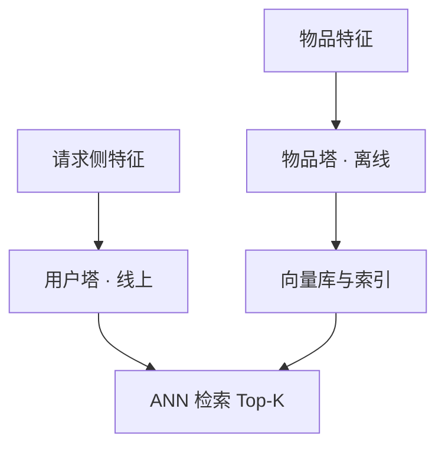

# 推荐模型

一句话:CTR 与推荐模型要解决的是**在几亿维、极度稀疏的离散特征上,把「哪些特征凑在一起才有信号」自动学出来**——从 LR 到 FM、DeepFM、DCN,再到 DIN/SIM 这些行为序列模型、双塔召回和生成式推荐,整条演进线只有一个主题:交互怎么建、建到几阶、成本谁付。特征本身怎么造(类别编码、缺失值、数值缩放、CTR 特征设计)见 特征工程 篇,本篇只讲模型这一层。

## 一、核心矛盾:高维稀疏,而且只有组合才有信号

CTR 任务的形式很简单:给定「用户 × 物品 × 上下文」预测点击概率,训练样本是曝光日志,标签是这次曝光有没有被点。难的是特征长什么样——它们几乎全是离散 ID(user_id、item_id、类目、城市、时段、来源),做完 one-hot 维度上亿,而**单条样本里非零的位置只有几十到几百个**。

在这种数据上,单个特征的边际贡献往往很弱:「性别=女」和「品类=口红」各自都只是一个先验,真正携带信息的是两者**同时出现**。所以 CTR 模型的表达力,几乎就等于「能不能表示特征组合」。那为什么不直接给每个特征对各学一个权重(即 POLY2)?两个死结:$n$ 个特征要 $n(n-1)/2$ 个交叉权重,存不下;更致命的是 $w_{ij}$ **只有在样本里 $x_i$ 与 $x_j$ 同时非零时才收到梯度**,而稀疏数据下绝大多数特征对从没共现过,这些权重训完还停在初始值,对没见过的组合也毫无外推能力。后面所有模型都是在绕开这一条。

目标函数这一侧反而是最标准的:模型输出一个 logit $z$,$\sigma(z)$ 才是点击概率,用曝光样本的 0/1 标签算 BCE。为什么用交叉熵而不是 MSE、梯度长什么样、正例极少怎么办、概率校准的机制,见 分类损失 篇;按任务选目标的总览见 损失函数 篇;日志清洗与样本配比见 数据工程 篇。

## 二、演进主线:交叉这件事是怎么从人手里交出去的

| 模型 | 交叉由谁做 | 能到几阶 | 关键代价 |
|---|---|---|---|
| LR | 人工构造交叉特征 | 只有你写得出来的那些 | 可解释、上线快,但表达力完全由特征工程决定 |
| FM | 隐向量内积自动生成 | 固定二阶 | 三阶以上要另想办法 |
| Wide & Deep | wide 侧人工交叉负责记忆,deep 侧 embedding 负责泛化 | wide 二阶(人工)+ deep 隐式高阶 | wide 侧仍然要人去写特征 |
| DeepFM | FM 分支自动二阶 + DNN 分支隐式高阶,**共享同一份 embedding** | 显式二阶 + 隐式高阶 | 免掉人工 wide,但高阶仍是隐式、不可控 |

### FM 为什么能在稀疏数据上把交叉学动

$$
\hat z(x)=w_0+\sum_{i=1}^{n}w_ix_i+\sum_{i=1}^{n}\sum_{j=i+1}^{n}\langle v_i,v_j\rangle\,x_ix_j
$$

人话:每个特征 $i$ 除了自己的权重 $w_i$,还带一个 $k$ 维隐向量 $v_i$;第 $i$、$j$ 两个特征交叉项的权重不再是一个自由参数,而是**两个隐向量的内积**。这一步换来两件事:参数量从 $O(n^2)$ 降到 $O(nk)$;更关键的是 $v_i$ **只要特征 $i$ 出现过就会被更新,不管它当时是和谁一起出现的**。所以「口红 × 25 岁女性」这个组合哪怕训练集里一次都没见过,模型也能用 $\langle v_{\text{口红}},v_{25\text{岁女}}\rangle$ 给出估计——这就是 FM 相对暴力交叉的全部优势:把「每个组合各学一个权重」换成「每个特征学一个向量,组合权重由向量算出来」。

上式直接算是 $O(kn^2)$,但它能化简:

$$
\sum_{i<j}\langle v_i,v_j\rangle x_ix_j=\frac12\sum_{f=1}^{k}\left[\Big(\sum_{i=1}^{n}v_{i,f}x_i\Big)^2-\sum_{i=1}^{n}v_{i,f}^2x_i^2\right]
$$

人话:按隐向量的每一维,先算「和的平方」再减「平方的和」,除以二——两两枚举就被消掉了,复杂度降到 $O(kn)$,而且 $n$ 只需数非零特征。FM 能在工业规模跑起来,靠的就是这一步。

### Wide & Deep 与 DeepFM:wide 侧到底差在哪

Wide & Deep 的出发点是一对反义词。**记忆**是把训练数据里真实出现过的共现关系记牢,wide 侧就是一个 LR,输入是人工写出来的交叉特征;**泛化**是让没见过的组合也能得到合理分数,deep 侧把稀疏 ID 压成低维 embedding 再过 MLP。两侧是**联合训练**,最终 logit 相加后一起反传,不是各训各的再做集成。

DeepFM 只改了一件事:把 wide 侧的人工交叉换成 FM,并让 FM 与 DNN 共用同一份 embedding。本质区别有三条:

| | Wide & Deep 的 wide 侧 | DeepFM 的 FM 侧 |
|---|---|---|
| 交叉从哪来 | 人写出来的那些 | 全部二阶交叉自动生成 |
| 没共现过的组合 | 学不到(权重收不到梯度) | 能外推(隐向量内积) |
| 与 deep 侧的关系 | 输入不同、参数不共享 | 共享同一份 embedding,端到端一起训 |

> 顺手拆一个高频混淆:**DeepFM 的两个分支不是召回双塔**。它的 FM 分支和 DNN 分支吃的是同一份全量特征(用户、物品、上下文拼在一起),在同一次前向里被同时算出来;双塔是两座塔各吃一半特征,而且**必须在打分前互不相见**,物品侧才能被预计算掉(第五节)。

共享 embedding 也不是「一定更好」的定理:FM 侧想要的表示和 DNN 侧想要的未必一致,梯度会互相拉扯。它确实省掉了人工特征工程,收益仍要在同一数据切分、同一算力预算下做消融。

## 三、显式高阶交叉:DCN、DCNv2、xDeepFM、AutoInt

### DCN 的交叉层:每层升一阶,参数只多 $2d$

先把符号说清楚:把所有类别特征的 embedding 和归一化后的数值特征**拼成一根长向量**,这就是 $x_0\in\mathbb{R}^d$,它是交叉网络的原始输入,也是每一层都要用到的那个锚;$x_l$ 是第 $l$ 层交叉层的输出,与 $x_0$ 同维。交叉层定义为:

$$
x_{l+1}=x_0\,(x_l^{\top}w_l)+b_l+x_l
$$

人话:$x_l^{\top}w_l$ 先把当前表示压成**一个标量**,这个标量再去缩放原始输入 $x_0$,最后加回 $x_l$ 形成残差。整层新增参数只有 $w_l,b_l$ 两个 $d$ 维向量,合计 $2d$ 个。

**为什么每层都要保留 $x_0$?** 两个理由要分开讲。一是**阶数**:若 $x_l$ 里最高含 $l+1$ 阶乘积项,再乘一次 $x_0$ 的分量就升到 $l+2$ 阶,所以层数每加一层最高阶数就加一;$x_0$ 是唯一那份「一阶原料」,换成任何中间量都会失去对阶数的控制。二是**残差**:末尾的 $+x_l$ 让低阶项一路直通输出,不会被后续层洗掉,同时缓解深层的优化困难。

DCN 论文自己证过一条(Theorem 3.1):$l$ 层交叉网络能复现次数不超过 $l+1$ 的多变量多项式类里的全部交叉项,而同阶多项式本身有 $O(d^{\,l+1})$ 个系数——**每层只用 $O(d)$ 的参数,就把这么多项全覆盖了**,这就是「显式堆高阶又不爆参数」的准确含义。代价是这些系数不再彼此自由,而是由各层 $w$ 相乘决定。

### DCNv2 改了什么

瓶颈在哪,DCNv2 论文说得很直白:交叉网络能复现的那族多项式**总共只由 $O(d)$ 个参数刻画**,面对真实业务里没有规律的交叉模式不够用;而且交叉网络和 DNN 之间容量分配失衡,绝大多数参数都被 DNN 拿去学隐式交叉了。改法是把标量投影换成矩阵:

$$
x_{l+1}=x_0\odot\big(W_lx_l+b_l\big)+x_l
$$

人话:$W_lx_l$ 不再坍缩成一个标量,而是给出一个 $d$ 维向量,再与 $x_0$ **逐元素相乘**——原来每层只能给 $x_0$ 整体乘一个数,现在能给 $x_0$ 的每一维单配一个系数。代价是参数从 $2d$ 涨到 $d^2$,而 web 规模下 $d$ 常在千级以上。所以论文再补两刀:**低秩分解**把 $W_l$ 写成 $U_lV_l^{\top}$($U_l,V_l\in\mathbb{R}^{d\times r}$),参数降到 $2dr$;**低秩专家混合**把若干低秩交叉层当专家、用门控加权,同样算力下换到更多样的交叉子空间。秩不用开大——论文在 Criteo 上的消融里 $r=4$ 就追平了一批基线,$r$ 从 4 涨到 64 时 LogLoss 近似线性改善,过了 64 明显放缓,论文推测这个阈值秩的量级是 $O(\text{字段数})$(Criteo 共 39 个字段)。交叉网络与 DNN 的接法还有**堆叠**(先交叉再进 DNN)和**并联**(两路各自出分)两种,也是要消融的一个维度。

### 各家的差别在「交互的粒度」

| 方法 | 交互在什么粒度上做 | 阶数怎么来 | 成本 |
|---|---|---|---|
| FM / DeepFM | 字段隐向量的**内积**,结果是一个标量 | 固定二阶 | 化简后 $O(kn)$,最便宜 |
| DCN | **元素级**:$x_0$ 的任意两个分量都能相乘 | $L$ 层最高 $L+1$ 阶 | 每层 $2d$ 参数 |
| DCNv2 | 元素级,但每一维配独立系数 | 同上 | 每层 $d^2$,低秩后 $2dr$ |
| xDeepFM 的 CIN | **向量级**:以整个字段 embedding 为单位做 Hadamard 积再加权求和 | 第 $k$ 层恰好给出 $k+1$ 阶 | 随字段数 $m$、层宽 $H$、层数增长,是多项式不是指数 |
| AutoInt | 字段级,靠**多头自注意力**按样本动态决定谁和谁组合 | 层层叠加,但不是每层翻倍 | 一层约 $O(m^2d+md^2)$,对字段数是二次 |

CIN 值得单独说一句:它保持 embedding 维度不动,每层拿上一层的特征图与**原始**字段矩阵做逐位置 Hadamard 积,再用一组权重把 $H\times m$ 个组合压成新的特征图。所以它的交互单位是「一整个字段向量」,而 DCN 打散到「某一维数字」——这正是 xDeepFM 相对 DCN 的核心论点。它每层做 sum pooling 输出,阶数与层号一一对应,比 DCN 的「最高 $L+1$ 阶」更明确。

### AutoInt 的三条边界

AutoInt 把每个字段(类别或连续)映射成同维向量,让多头自注意力在**字段之间**跑:每个头做 $Q/K/V$ 投影,注意力权重决定一个字段去聚合哪些字段,多头拼接后加残差得到新的字段表示,堆几层再送去预测。注意力机制本身见 注意力基础 篇。三条边界必须说清:

- **连续特征不能把裸标量塞进去和 embedding 混排。** 常见做法是先归一化,再乘一个该字段的可学习向量(或过小 MLP)映射到 $d$ 维,并单独留一位缺失标识。
- **它不是照搬序列 Transformer。** 字段之间没有天然的时间顺序,「位置」在这里只代表字段身份,把序列版的位置编码原样搬过来是错的。
- **注意力权重不是特征重要性。** 它只是这一层的聚合系数,不等于因果贡献;要谈重要性得配置换检验、消融或 SHAP 独立验证。字段很多时那个 $O(m^2)$ 也要靠分组、低秩投影或稀疏注意力压下去。

### 层数怎么定,三元关系怎么建

交叉层不是越深越好:阶数一高,组合本身更稀疏、更容易过拟合,线上延迟也跟着涨。做法是在固定字段数、样本量和延迟预算下把交叉层数从 1 扫到几层,**并且和 DNN 深度做二维消融**——显式交叉与隐式交叉互相替代,一边加深另一边就该减浅,单调一个维度会得出错误结论。「三阶以上交给 DNN 还是换显式模型」也只能这么定:DNN 理论上能逼近任意函数,但它学交叉是靠隐式拟合、样本效率低且不可控;显式模型把阶数变成一个可调旋钮,代价是多一路参数和延迟。用户、内容、创作者这类三元关系,常规做法是三方各自 Embedding 后拼进 $x_0$ 交给交叉网络自己发现;若业务上确认这个三元项重要,可以显式构造该组合特征或做分组交叉,但同样要用消融证明,不能因为「听上去合理」就加。

## 四、用户行为序列:从固定池化到候选感知,再到先检索后聚合

### DIN:同一个用户,面对不同候选该激活不同兴趣

Embedding&MLP 的老做法是把历史行为**求和或平均**池化成一个固定向量,这等于假设「用户兴趣与当前候选无关」。DIN 的观察正相反:一个同时买母婴和数码的用户,推奶粉时该看母婴那段历史,推耳机时该看数码那段。

$$
u(a)=\sum_{j=1}^{H}\alpha\big(e_j,\,e_a\big)\,e_j
$$

人话:$e_j$ 是第 $j$ 条历史行为的 embedding,$e_a$ 是当前候选的 embedding,$\alpha$ 是一个小网络(输入是两者以及它们的外积,输出一个标量权重)。候选一换,整套权重就变——**用户兴趣向量成了候选的函数**,这是 DIN 与一切固定池化方法的分界线。

两个细节常被追问。**权重不做 softmax 归一化**:原论文特意放开「权重和为 1」这个约束,因为归一化会把「相关历史很多」和「只有一条勉强相关」抹成同一个强度,而兴趣的强度本身就是有用信号。**DIN 的注意力和 Transformer 的 self-attention 不是一回事**:DIN 是候选查历史的一路交叉注意力,一个候选对长度 $L$ 的历史做 $L$ 次相关性计算,历史行为之间并不互看;self-attention 是序列内部两两互查,规模是 $L^2$ 对。所以这个聚合操作**本身不建模行为顺序**,要顺序信息得另外加位置或时间编码。成本口径也别记错:DIN 那 $L$ 次计算是**每个候选各做一遍**,候选一多总量并不小。

> 🖼️ 占位:DIN 局部激活单元结构图——候选物品 embedding、单条历史行为 embedding 及两者的外积一起进小 MLP 输出标量权重;右侧并排画同一用户面对「奶粉」和「耳机」两个候选时,同一段历史上权重分布的差异

### BST 与 SDM:把顺序和真实时间显式建进去

DIN 之后分了两个方向。**DIEN** 在前面加一层 GRU 抽兴趣、再用带注意力更新门的 GRU 建「兴趣随时间演化」,治的是兴趣漂移;**BST** 换了条路,直接用 Transformer 编码行为序列,让历史行为之间也互相看。

BST 有个值得记的细节:它的位置特征不是 0,1,2 这种序号,而是 $pos(v_i)=t(v_t)-t(v_i)$,即**推荐发生的时刻减去这条行为发生的时刻**,直接把真实时间差当位置喂进去。这正好回答「顺序和时间怎么同时编码」:**序号只知道先后,不知道是昨天还是半年前**,时间差、时间间隔、周期特征(星期几、时段)要显式加进 embedding,或者在注意力分数上加一个随时间衰减的偏置,或者在采样时提高近期行为的权重;衰减形状应由数据学或消融选,写死固定规则容易把长期的周期性兴趣抹掉。另一条经验:Transformer 堆几层并非越多越好,BST 论文里 $b=1$ 的离线 AUC 是 0.7894,$b=2$ 为 0.7885、$b=3$ 为 0.7823,他们的解释是行为序列的依赖没有自然语言那么复杂。

**SDM 是召回侧的对应物**,目标是产出一个能做大规模匹配的用户向量,而不是给某个候选打分:短期侧用多头自注意力聚合当前 session 的行为、并用用户画像做 query 再抽一次,长期侧从更长历史和画像里提稳定偏好,两者经**长短期门控融合**合成最终用户向量。别把它简写成「底层 LSTM、上层 Transformer」——论文短期模块的核心是多头自注意力,长短期的合成是门控而不是拼接。BST 用 CTR 的 BCE,SDM 用匹配目标,**两者服务的阶段不同、损失也不同**;真要在一个系统里联合训练召回与排序,必须明确共享哪些 embedding、各损失怎么配权、负采样口径怎么统一,而不能假定论文原生就是同一张分层网络。

### SIM:上万条历史怎么办

DIN/BST 都要过一遍完整历史,序列一长(工业场景动辄上千到上万条)延迟就顶不住。SIM 的思路是**先搜再算**,拆成两级:

- **GSU(General Search Unit)** 用便宜的方式从超长历史里挑出与候选相关的子序列。两种实现:**hard search** 按规则筛(例如只留与候选同类目的行为),不需要额外模型和索引,工程最省;**soft search** 用一套可学习表示做内积检索、配近邻索引取 Top-k,能抓跨类目的相关性,代价是要额外训一个辅助模型并维护索引。两者是 GSU 的**替代实现,不是必须串行的两个阶段**。
- **ESU(Exact Search Unit)** 只对挑出来的短子序列做精细的候选感知聚合,并把「这条行为距今多久」当作时间间隔特征加进去。

论文自报能吃到最长 54000 的行为序列、把当时的长度上限推了 54 倍——这是它自己的数据、索引与线上配置下的结果,不能当成任何业务都能兑现的能力。工程上百万级历史的关键是**把行为存储与在线模型拆开**:离线或增量维护行为索引(按时间窗、类目、向量近邻分片),缓存物品表示,再限制进 ESU 的长度。Top-k 是个两头都不好的旋钮——**太小漏兴趣,太大既贵又带进噪声**;可以按延迟预算离线网格搜,也可以让预算随用户活跃度浮动,但必须同时看子序列的召回覆盖和最终排序指标,只盯 GSU 自己的命中率会跑偏。行为序列的噪声也在这一层治:按请求时点截断(严禁用未来信息)、去掉机器人与重复曝光、处理延迟反馈,并按活跃度和历史长度分组评估。

| 模型 | 服务阶段 | 怎么用历史 | 主要解决什么 |
|---|---|---|---|
| DIN | 排序 | 候选感知加权池化,权重不归一 | 兴趣多样:不同候选该看不同历史 |
| DIEN | 排序 | GRU 抽兴趣 + 带注意力更新门的 GRU | 兴趣随时间演化 |
| BST | 排序 | Transformer 编码序列,位置取时间差 | 行为之间的顺序与依赖 |
| SIM | 排序 | GSU 粗检索 + ESU 精聚合 | 超长历史的成本 |
| SDM | 召回 | 短期多头自注意力 + 长短期门控融合 | 产出可匹配的用户向量 |

内容社区想加图文这类多模态特征,常规做法是**离线**用图文编码器把内容编成向量,再和 ID、作者、行为类型特征一起融合;新内容还没有行为时,内容向量是缓解冷启动的主要抓手。上线后要盯特征版本一致性、缓存新鲜度和延迟,并**分别**评估召回、排序和多模态切片上的收益,不能只看大盘。

## 五、双塔召回:为什么它必须是两座塔

结构上的约束来自一条硬账:全库有千万到十亿个物品,**不可能每次请求都把用户和每个物品拼起来跑一遍模型**。双塔把打分函数强行拆成 $s(u,i)=\langle f(u),g(i)\rangle$ 这种可分离形式,于是 $g(i)$ 与请求无关,可以离线全量算好写进向量索引;线上只剩一次用户塔前向加一次近邻检索。两座塔可同构可异构、可共享可不共享参数,取决于两侧输入语义是否对称——搜索里 query 和 doc 都是文本,倾向共享;推荐里用户特征和物品特征完全不同,通常不共享。打分用点积还是余弦也是个真实选择:**点积保留模长**,模长能携带热度或置信度,但也可能被大模长的热门物品主导 Top-K;**余弦只比方向**,消掉了热度,通常要配一个温度系数才好训。没有普适答案,得在同一负采样和索引配置下比。

### 样本构造:双塔最容易翻车的地方

正样本一般取点击、购买、完播或成对文本,但口径要先说死:**未曝光的物品没有可靠负反馈**,点赞和完播属于另外的目标,混进来等于换了任务。负样本有四种来源,性质完全不同:

| 负样本来源 | 教模型什么 | 主要风险 |
|---|---|---|
| 批内(in-batch)其他样本的物品 | 便宜,天然按曝光分布采 | **热门物品被当负例的次数天然多**,会被系统性压低 |
| 全局随机采样 | 覆盖长尾,拉开「完全不相关」的距离 | 太容易,训到后期几乎不产生梯度 |
| 曝光未点击 | 贴近精排的决策边界 | 混着大量假负例(用户会喜欢但没注意到) |
| Hard negative(线上召回出来又被后链路淘汰的) | 信息量最大 | 假负例风险最高,量一多会伤主目标 |

批内负采样的热门偏置有个标准修正:训练时把每个批内物品的 logit 减去它的采样对数概率 $\log p_j$。直觉是**越稀有的物品出现一次就该顶更多份量**,减掉一个很负的 $\log p_j$ 相当于把它的分数放大,正好补偿它出现次数少;热门物品的 $\log p_j$ 接近 0,几乎不被放大,于是不再被过度惩罚。工业实现里 $p_j$ 通常用流式估计的物品频率。

损失一般就是批内 softmax,**它和 InfoNCE 是同一个式子**:把一批候选当成一道「哪个是正样本」的多选一分类题,对相似度做 softmax 再取交叉熵。温度怎么设、难负样本与假负例的机制见 对比学习 篇;本篇只留召回场景的两条口径——**训练时的负样本分布应尽量贴近线上真正要打分的候选分布**,以及假负例必须治(去偏权重、同一用户多正例、把已知相关项从负例里排掉)。

### 建库、检索,和双塔的天花板

训练完把全库物品过一遍物品塔,写进 HNSW / IVF 这类近邻索引;线上算一次用户向量再检索 Top-K,与其他召回路合并去重后交给后链路。两句必须说清:**ANN 不是 $O(1)$ 保证**,十亿规模能否毫秒级返回取决于维度、索引类型、目标召回率、硬件、并发和过滤条件,脱离这些条件的延迟承诺是空的;索引更新与模型版本必须对齐,否则会出现「向量来自新模型、查询来自旧模型」这种静默故障。

**双塔的根本局限只有一句话:两侧在打分前不能交互。** 「某个用户特征恰好和某个物品特征搭配」这种细粒度组合它天生表达不了,因为算 $f(u)$ 的时候还不知道 $i$ 是谁。所以召回做不了精排的活,这不是调参能补的。四种常见缓解:让用户塔输出**多个**兴趣向量覆盖兴趣多峰;用交互式单塔当教师**蒸馏**双塔分数;在双塔上面挂一层很轻的交叉(代价是失去纯 ANN,一般只用在粗排);或者干脆承认分工,把深度交互留给精排——业界最常见的级联就是双塔召回、单塔精排。短期兴趣漂移也在用户塔这一侧解决:实时行为特征喂进用户塔、加一个短期 session 塔、维护增量用户状态,再配合周期性重建索引。

## 六、生成式推荐:把「挑一个物品」改成「生成一个物品标识」

传统链路是判别式的:先召回候选,再逐个打分排序。生成式推荐换了个提法——**给定用户历史序列,直接自回归地写出下一个物品的标识**。物品怎么表示决定了这套方法的上限,公开做法有三种:直接用原始物品 ID(词表等于全库,长尾学不动)、**语义 ID**(把物品的内容表示做残差量化,得到一串分层码字)、以及自然语言描述(靠 LLM,但写出来的东西不一定存在)。TIGER 是语义 ID 这一路的公开代表:内容 embedding 过 RQ-VAE 得到多级 semantic ID,再用 Transformer 按交互序列生成下一个物品的码字串;后续的 HSTU 这类工作则把召回与排序统一成一个生成式序列问题去做规模化。

**对冷启动的意义在哪。** 语义相近的物品共享码字前缀,**一个全新物品只要有内容就能拿到语义 ID**,不需要任何交互就可能被生成出来。但共享码字只让它「可达」,不保证推得准,这一步仍要靠内容质量和探索策略。

**合法性是硬约束。** 自回归模型完全可能拼出一串不对应任何真实物品的码字,所以解码必须受限:用前缀树或 token mask 把每一步候选限制在真实目录内,并把「合法率」当成必须监控的线上指标。大目录下通常还是**检索—生成级联**:先用 ANN 或规则粗召一批,再受限生成或重排,而不是对着上亿目录裸跑。

**取舍要说全。** 好处是把召回与排序的目标统一到一个序列建模问题上,历史顺序天然被建进去,新物品靠内容语义就能进候选;代价是自回归解码有延迟(生成 $K$ 个码字要 $K$ 步,还要叠 beam search)、目录与码本要长期维护、而且**训练目标是下一个物品的最大似然,和点击率、停留、长期价值都不是一回事**。缓存、批处理、缩短 ID 长度、蒸馏都能压延迟,但都要实测。所以**目录极不稳定、延迟预算极紧、或者已有链路的多目标融合调得很成熟**的场景,不该贸然换生成式。奖励稀疏也在这里得到部分回答:与其直接优化稀疏的转化信号,不如用「下一个物品」这种天然稠密的序列监督做主目标,再把点击、停留、完播当作稠密代理目标叠上去;偏好数据可靠时才谈成对偏好优化。

**评测为什么难。** 离线用 Recall/NDCG 对着日志里的「下一个物品」打分,而日志是旧策略产生的——生成式模型很可能推出旧策略从没曝光过的物品,这些没有标签,离线指标会系统性低估它。所以离线之外必须补:合法率、长尾覆盖、多样性、新用户留存、延迟,以及隐私与公平的检查,最后仍以线上实验为准。

**完全没有行为的新用户**分两种情况。零交互时只能用经授权的上下文(设备、地域、时段、来源渠道)、内容语义,以及**主动让用户选兴趣**这类显式信号,再叠一层「热门 + 多样性」保底,保证不开天窗;有了少量反馈之后转成上下文 bandit,在少量槽位做受控探索、其余给已确认的兴趣,并限制打扰频次。探索成功与否不能用当次点击衡量,该看的是**后续几天的兴趣覆盖广度和留存**。模型可以生成一段兴趣描述再去检索真实物品,但**不能让它直接幻想 item ID**;RAG 能取实时内容、Agent 能澄清偏好,它们都是补充,替代不了召回排序链路。

## 七、训练与评测:排序好不等于预估准

**对 logit 做任何单调变换,AUC 一点不变,概率值却可以从准变得离谱。** 纯推荐场景只用排序时这不要紧;**广告不行**——竞价里 eCPM 等于 bid 乘 pCTR,预估系统性偏高 20% 就等于多花 20% 的钱,出价、预算控制和 ROI 全依赖概率值本身。所以广告侧的 CTR 模型必须报 LogLoss、可靠性图和校准误差,不能只看 AUC。推荐链路里会破坏校准的三件事也全都躲不掉:**负样本下采样**(改了训练时的类先验,输出整体偏高)、**样本加权**、以及 Focal 这类改目标的损失。它们的机制、闭式修正(在 logit 上加一个与特征无关的常数)和温度缩放怎么做,见 分类损失 篇;本篇只留结论:**只要下游要用概率值,采样或加权之后就必须重新校准,并且在原始分布上验**。

### AUC 之外为什么要看 GAUC

全局 AUC 把所有请求的样本混在一起排,这和线上做的事对不上——**线上永远只在一次请求内部排序,从来不需要比较「张三的候选」和「李四的候选」**。一个模型只要学会「活跃用户整体点击率高」,靠拉开用户之间的分差就能把全局 AUC 顶上去,而每个用户内部的顺序可能一团糟。GAUC 的修法很直接:**按用户(或用户 × 场景)分组各算一个 AUC,再按曝光数或点击数加权平均**,只有组内的相对顺序才计分。DIN 论文提出它,正是因为全局 AUC 和线上 CTR 对不上。实践上还要按活跃度、历史长度、新老用户分组看指标,大盘涨而新用户掉是很常见的事;离线涨不等于线上涨,最终以 A/B 为准。

### 样本偏差:模型只看得见系统曝光过的东西

训练数据是**旧策略筛过一遍的曝光日志**,这带来两类偏差。**位置偏置**:同一个物品放第 1 位和第 10 位点击率差很多,模型只看点击标签就会把「位置好」学成「物品好」。两种常见修法——把位置(以及设备等)喂进一个**浅层旁路塔**,输出一个偏置项加到主 logit 上,线上推理时把这一路固定成同一个位置;或者显式把点击拆成「被看到」乘「看到后点击」两项,只用后一项做排序。**曝光偏差**:没被曝光过的物品永远没有标签,模型会越来越只认自己推得出来的东西,靠随机流量、探索槽位和覆盖率指标打破。还有**延迟反馈**:转化可能几小时后才回来,当时记成负例的样本其实是正例,这会同时污染标签和校准。多目标(点击、时长、完播、转化)怎么配权、专家怎么共享是另一个课题,常规做法是多目标共享底层表示、各出一个塔,再用融合公式合成排序分,这里不展开。

## 面试考点串联

| 高频问法 | 本文哪一节 |
|---|---|
| LR、FM、Wide & Deep、DeepFM、DIN 各自怎么建模 CTR?设计动机和选型条件是什么 | 一 · 二 · 四 |
| CTR 的特征为什么是几亿维稀疏的?为什么不能给每个特征对各学一个交叉权重(补充题) | 一 |
| FM 把交叉权重换成隐向量内积换来了什么?为什么它在稀疏数据上比暴力交叉学得动(补充题) | 二 |
| DeepFM 和 Wide & Deep 的 wide 侧本质区别在哪?共享 embedding 一定更好吗 | 二 |
| CTR 里的特征工程还有哪些实践经验 | 一(特征造法见 特征工程 篇) |
| DCN 的交叉层怎么把阶数堆上去?为什么每层都保留 $x_0$,参数量为什么没跟着爆炸 | 三 |
| DCNv2 的矩阵交叉、低秩分解和低秩专家混合分别解决了什么问题 | 三 |
| DCN、DeepFM、xDeepFM 的交叉方式差在哪?CIN 的「向量级」是什么意思 | 三 |
| 三阶以上的交互该交给 DNN 还是换 DCN / xDeepFM / AutoInt?交叉层数和 DNN 层数怎么一起调 | 三 |
| AutoInt 怎么用多头自注意力做字段交互?它和 DCNv2、xDeepFM 各适合什么场景 | 三 |
| 为什么 AutoInt 不直接照搬带位置编码的序列 Transformer?连续数值特征怎么进字段自注意力,字段多了复杂度怎么控 | 三 |
| AutoInt 的注意力权重能不能直接当特征重要性看?用户、内容、创作者这种三元关系又该怎么建模 | 三 |
| DIN 的候选感知激活在解决什么问题?它的注意力和 Transformer 的 self-attention 有什么区别和联系 | 四 |
| 用户行为序列太长、太脏怎么办?SIM 的两阶段检索怎么降的成本,它相对 DIN 和 DIEN 的改进分别是什么 | 四 |
| SIM 的 hard search 和 soft search 怎么选?Top-k 能不能按用户或请求动态调 | 四 |
| 百万级行为历史下,存储、检索和在线聚合怎么设计 | 四 |
| BST 怎么把真实时间差和序列位置同时编码?它和 DIN 差在哪 | 四 |
| SDM 的短期和长期兴趣怎么融合?它和 BST 服务的阶段一样吗,联合训练时损失和共享参数怎么设计 | 四 |
| 内容社区里图像、文本、作者特征怎么加进行为序列模型 | 四 |
| 召回为什么常用双塔?从样本、负采样、损失到离线建库和线上 ANN 怎么配套 | 五 |
| 批内负采样为什么会系统性压低热门物品?怎么修(补充题) | 五 |
| 点积和余弦各保留了什么信息?InfoNCE 和双塔的批内 softmax 是什么关系 | 五 |
| 双塔的表达力天花板在哪?怎么和交互式单塔组成级联,交叉不足和兴趣漂移分别怎么补 | 五 |
| 生成式推荐怎么表示物品、怎么训练和解码?相比传统召回排序的优劣是什么 | 六 |
| 怎么保证生成结果落在真实目录里?大目录下的自回归延迟怎么优化 | 六 |
| 什么场景不该上生成式方案?奖励稀疏时训练目标怎么设计 | 六 |
| 完全没有画像和行为的新用户怎么推?探索成功怎么量化、怎么避免过度打扰 | 六 |
| CTR 模型 AUC 很高,广告计费却对不上,可能是哪里出了问题(补充题) | 七 |
| 离线 AUC 涨了线上 CTR 没涨,为什么要看 GAUC?它怎么算(补充题) | 七 |
| 训练数据是曝光日志会带来什么偏差?位置偏置怎么处理(补充题) | 七 |

## 相关文献

- Factorization Machines(Rendle,ICDM 2010,不在 arXiv)— https://doi.org/10.1109/ICDM.2010.127
- Wide & Deep Learning for Recommender Systems — [arXiv:1606.07792](https://arxiv.org/abs/1606.07792)
- DeepFM: A Factorization-Machine based Neural Network for CTR Prediction — [arXiv:1703.04247](https://arxiv.org/abs/1703.04247)
- Deep & Cross Network for Ad Click Predictions — [arXiv:1708.05123](https://arxiv.org/abs/1708.05123)
- DCN V2: Improved Deep & Cross Network and Practical Lessons for Web-scale Learning to Rank Systems — [arXiv:2008.13535](https://arxiv.org/abs/2008.13535)
- xDeepFM: Combining Explicit and Implicit Feature Interactions for Recommender Systems — [arXiv:1803.05170](https://arxiv.org/abs/1803.05170)
- AutoInt: Automatic Feature Interaction Learning via Self-Attentive Neural Networks — [arXiv:1810.11921](https://arxiv.org/abs/1810.11921)
- Deep Interest Network for Click-Through Rate Prediction(GAUC 的出处)— [arXiv:1706.06978](https://arxiv.org/abs/1706.06978)
- Deep Interest Evolution Network for Click-Through Rate Prediction — [arXiv:1809.03672](https://arxiv.org/abs/1809.03672)
- Behavior Sequence Transformer for E-commerce Recommendation in Alibaba — [arXiv:1905.06874](https://arxiv.org/abs/1905.06874)
- SDM: Sequential Deep Matching Model for Online Large-scale Recommender System — [arXiv:1909.00385](https://arxiv.org/abs/1909.00385)
- Search-based User Interest Modeling with Lifelong Sequential Behavior Data for Click-Through Rate Prediction — [arXiv:2006.05639](https://arxiv.org/abs/2006.05639)
- Learning Deep Structured Semantic Models for Web Search using Clickthrough Data(DSSM,不在 arXiv)— https://www.microsoft.com/en-us/research/publication/learning-deep-structured-semantic-models-for-web-search-using-clickthrough-data/
- Sampling-Bias-Corrected Neural Modeling for Large Corpus Item Recommendations(批内负采样修正,RecSys 2019,不在 arXiv)— https://research.google/pubs/sampling-bias-corrected-neural-modeling-for-large-corpus-item-recommendations/
- Recommender Systems with Generative Retrieval(TIGER)— [arXiv:2305.05065](https://arxiv.org/abs/2305.05065)
- Actions Speak Louder than Words: Trillion-Parameter Sequential Transducers for Generative Recommendations — [arXiv:2402.17152](https://arxiv.org/abs/2402.17152)
- Recommending What Video to Watch Next: A Multitask Ranking System(浅层旁路塔纠位置偏置,RecSys 2019,不在 arXiv)— https://research.google/pubs/recommending-what-video-to-watch-next-a-multitask-ranking-system/
