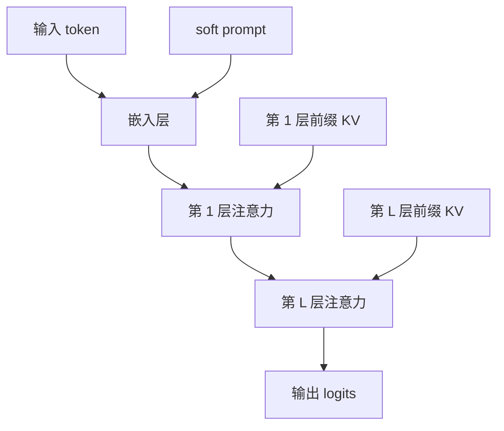

# 提示微调(Prompt / Prefix / P-Tuning)

一句话:这三种方法都不改基座的任何一个权重,只学一小段**连续向量**再塞进模型;真正的分野不在"学了什么",而在**这段向量从哪一层进去**——Prompt Tuning 只从入口进,Prefix-Tuning 和 P-Tuning v2 从每一层的 K/V 进。

## 一、先分清:软提示不是"写得更好的提示词"

你手写的提示词是**离散 token**:先在词表里查到编号,再取出对应的嵌入向量,所以它只能落在词表那几万个点上。**软提示(soft prompt)跳过查表这一步**,直接把一个可训练的实数向量当成嵌入送进去——它不对应任何一个词,也不需要对应。

两个后果都是面试爱问的:

- **能用梯度优化**。离散提示只能靠人写或搜索,软提示可以像普通参数一样反传更新
- **必须有梯度接口**。只收文字的黑盒 API 给不了这个接口,标准的提示微调在闭源 API 上根本训不了

离散提示怎么写、怎么自动搜索与评估,是另一套东西,本篇不展开;上下文学习(给几个示例让模型现学)同理,它连参数都不更新。

### 三种方法的注入位置对照

这张表是本篇的骨架,后面几节都在展开它的某一列。记号:$m$ 是提示长度,$L$ 是层数,$d$ 是隐藏维,$d_{kv}$ 是一个 token 的 K(或 V)向量维度。

| 方法 | 注入到哪 | 可训练参数量 | 位置编码怎么办 | KV 缓存怎么办 |
|---|---|---|---|---|
| Prompt Tuning | 嵌入层之后、第 1 层之前 | $md$ | 占掉 $m$ 个真实位置索引,真实 token 后移 | 和普通 token 一样算一遍再进缓存 |
| Prefix-Tuning | **每一层**注意力的 K 和 V 前面 | $2Lmd_{kv}$ | 走缓存注入时不参与旋转 | 可预计算一次,常驻并跨请求复用 |
| P-Tuning v1 | 输入侧,可插在模板中间、位置不必连续 | $md$ 加一个提示编码器 | 同 Prompt Tuning | 同 Prompt Tuning |
| P-Tuning v2 | **每一层**,实质等价于 Prefix 的做法 | $2Lmd_{kv}$ | 同 Prefix-Tuning | 同 Prefix-Tuning |



> 🖼️ 占位:一张 Transformer 侧视图,左侧一个箭头指向嵌入层标注 Prompt Tuning,右侧 L 个箭头分别指向每层注意力的 K/V 入口标注 Prefix-Tuning 与 P-Tuning v2,直观显示"一个入口"对"L 个入口"

## 二、Prompt Tuning:只在入口拼一段向量

做法只有一步:token 过完嵌入层得到 $X\in\mathbb{R}^{n\times d}$,在它前面拼上可训练矩阵 $P\in\mathbb{R}^{m\times d}$,把 $[P;X]$ 当作第 1 层的输入。模型内部一个参数都不动。

$$
N_{\text{prompt}} = m\,d
$$

读法:$m$ 个提示位,每位一个 $d$ 维向量,乘起来就完了——它是三种方法里最小的一本账。代进 LLaMA-2 7B($d=4096$)、$m=20$,只有 81,920 个参数,约占 6.7B 基座的 0.0012%。

**关键性质:它只影响第 1 层的输入。** 第 5 层、第 30 层看到的"提示",不是你直接控制的东西,而是 $P$ 经过前面若干层自然传播之后的产物。这一条解释了它的全部长处和短处:参数最省、实现最简单,但你**只有一个入口**,任务信息能不能送到深层完全取决于基座自己肯不肯传。Lester 等人在 T5 上的规模消融正是这个结论——模型越大,提示微调与全参微调的差距越小,过了十亿量级基本追平。**这是在他们那套模型与任务上的结论,不是任何模型任何任务的保证**。

训练时有三件事必须同步改,漏一件就出错:注意力掩码要放宽 $m$ 列(所有真实 token 都得看见提示);位置编号从提示开始排,真实 token 顺延;**标签掩码要把提示位排除在损失之外**,因为它没有对应的目标 token。损失掩码的通用做法见 SFT 篇。

**初始化有讲究。** 三种起点是随机采样、从词表里采真实词的嵌入、用类别标签词的嵌入。后两者的道理很直白:随机向量落在嵌入空间里模型从没见过的地方,而真实词嵌入本来就在模型熟悉的流形上,起点更"合法"。Lester 等人的观察是,小模型上这个选择影响明显,规模上去之后差距被抹平。SPoT 把这条推到底:先在源任务上训好一组提示,再拿它当目标任务的起点。

## 三、Prefix-Tuning:改的是每一层被读到的东西

Prefix-Tuning 不碰嵌入。它给**每一层的注意力**各准备一对可训练的 $P_k,P_v\in\mathbb{R}^{m\times d_{kv}}$,算注意力前拼到该层的 K 和 V 前面。换个说法更好记:**它给每层凭空塞进 $m$ 条不来自任何输入的 KV 条目**,后面的 token 可以像看普通 token 一样看它们。

$$
N_{\text{prefix}} = 2\,L\,m\,d_{kv},\qquad d_{kv} = H_{kv}\times d_h
$$

读法:2 是 K 和 V 各存一份,$L$ 是每层都要一份——所以同样的 $m$,Prefix 的参数量正好是 Prompt Tuning 的 $2L$ 倍。$d_{kv}$ 必须按真实的 KV 形状算:MHA 时它等于 $d$,GQA 把 KV 头数砍掉之后它比 $d$ 小得多,**直接套 $2Lmd$ 会高估**(KV 头怎么影响这个维度见 KVCache 篇)。两笔账对照着记:

- LLaMA-2 7B(32 层、$d=4096$、MHA),$m=20$:$2\times32\times20\times4096=5{,}242{,}880$,约 524 万
- LLaMA-3 8B(32 层、KV 头 8 × head 维 128,即 $d_{kv}=1024$),同样 $m=20$:1,310,720,只有前者的四分之一

对照第二节里 $d=4096$ 上的 8.2 万,**$2L=64$ 倍的差距就是"每层开一个入口"的价钱**。

### 拼进 K/V 之后,那一层实际在算什么

前缀进了 K/V,softmax 的分母里就同时有真实 token 和前缀两部分。把它拆开写:

$$
\mathrm{head} = (1-\lambda)\,\mathrm{softmax}(qK^{\mathsf T})V + \lambda\,\mathrm{softmax}(qP_k^{\mathsf T})P_v
$$

读法:这一层的输出等于**原来的注意力结果**和**只看前缀的注意力结果**的凸组合,权重 $\lambda$ 就是前缀分走的注意力质量占比(前缀那部分 exp 打分之和,除以全部 exp 打分之和)。He 等人的统一视角论文正是这么改写的,由此得到两条结论。其一,**Prefix-Tuning 实质上是给每个注意力头的输出挂了一个修正项**,修正强度由 query 自己决定,所以它逐 token 生效而不是全局加一个偏置。其二,**前缀不可能"不起作用"**:哪怕把前缀初始化成零向量,零打分进 exp 也等于 1,照样占掉一份分母。想让起点真的不扰动基座,得像 LLaMA-Adapter 那样把前缀这一路单独做 softmax、再乘一个零初始化的门控。注意力本身的打分与掩码见 注意力基础 篇。

```python
# 每层各有一份可训练前缀,形状 (m, H_kv, d_h);基座全程冻结
p_k, p_v = prefix_k[layer], prefix_v[layer]     # 与输入无关,可离线算好

q, k = apply_rope(q, k, positions)              # 关键:只旋转真实 token 的 Q/K
k = torch.cat([p_k.expand(B, -1, -1, -1), k], dim=-2)   # 前缀永远排最前面
v = torch.cat([p_v.expand(B, -1, -1, -1), v], dim=-2)   # 前缀不参与旋转

mask = F.pad(causal_mask, (m, 0), value=0.0)    # 左边补 m 列可见,前缀对所有 token 开放
out = attention(q, k, v, mask)                  # K/V 序列比原来长了 m,Q 没变长
```

### 重参数化:训练时套一层网络,训完丢掉

直接优化 $P_k,P_v$ 会不稳。原论文的做法是让一个更小的矩阵过一个前馈网络生成前缀,并明确写了直接更新会导致**优化不稳定并轻微掉点**;训练结束后这层网络可以丢掉,只保存前缀本身。所以要点是:**重参数化只活在训练期,不进推理开销,也不进任务副本**。

## 四、P-Tuning:v1 插在模板里,v2 把作用点挪到每一层

### v1 治的是"手写提示太脆"

v1 的出发点很具体:手写离散模板换一个词,分数就可能大幅波动。它的做法是在模板里插入连续提示向量,并且**位置不必连续、也不必都在最前面**——可以在输入前、输入与标签之间、标签之后各插几个,原文的经验是别插在会把句子切断的地方。为了缓解优化困难,它不直接训那几个向量,而是让一个**小编码器**(原文比较过 LSTM、MLP 和恒等映射三种)吐出提示向量,结论是 LSTM 和 MLP 都能用,直接训嵌入(恒等映射)不稳定。注意 v1 原文同时研究了冻结基座和连同基座一起训两种设定,谈 PEFT 配置时要说清楚是哪一种。

### v2 的关键改动:把作用点从入口挪到每一层

v2 只改了一件核心的事:**连续提示不再只放在输入侧,而是每一层都放一份**,也就是把注入点从"一个入口"换成"L 个入口",实现上等价于 Prefix-Tuning 的深层前缀。它围绕这个核心做了几处适配:分类任务改用一个随机初始化的分类头,不再依赖把标签映射成词的 verbalizer;提示长度按任务定,简单分类偏短、序列标注这类难任务偏长;**重参数化在 v2 里不是必选项**,原文自己的结论是有的任务有收益、有的没有。

**稳定性提升来自哪里?** 来自作用点。v1 那种入口注入,深层能拿到多少信号要看基座愿不愿意传,中小模型传不动,序列标注这种需要每个位置都有精确表示的任务更传不动;每层都有一个可训练前缀之后,高层直接拿到了可调信号,不再依赖这条长传播链。

**是不是就保证稳定了?不是。** 论文自己的口径是"跨多种模型规模与 NLU 任务普遍有效",可调参数占 0.1%–3%,评测集中在 NLU 与序列标注。这是一个有范围的实验结论,不能外推成"在任何 LLaMA 任务上都追平全参"。

**那在 LLaMA 上该用哪个?** 能先验说清的只有代价,不是效果:soft prompt 参数最少、实现最简单、任务副本最小,但只有入口这一个作用点,能不能成很吃基座规模;Prefix 与 v2 每层都有作用点,更容易在中小模型和难任务上调动模型,代价是 $2L$ 倍参数外加常驻的 KV 与注意力开销。**谁效果更好没有先验答案**,只能在同一基座上固定数据、训练预算和评测各跑一遍,没有可通用引用的效果排名。

## 五、位置编码怎么办:RoPE 下两种做法差在哪

RoPE 是**在注意力里按 token 位置旋转 Q 和 K**(机制见 RoPE 篇)。两类注入方式在这里的行为完全不同,这也是本题最容易答错的地方。

**soft prompt 占真实位置索引。** 它就在输入序列里,位置 0 到 $m-1$ 归它,真实 token 从 $m$ 开始。要说准三件事:

1. **真实 token 之间的打分不变**。RoPE 的内积只依赖相对位移,整段一起后移,两个真实 token 的相对距离没变
2. **变的是位置预算**。$m$ 个位置被吃掉了,能装的真实 token 少了 $m$;真实 token 的绝对索引上界也整体抬高,做长文时要按 $m+n$ 去核训练长度与外推边界(见 长上下文训练 篇)
3. **提示拼在最前面时,位置 0 就不再是 BOS**,而是一个可训练向量。因果注意力里首位天然会吸走大量注意力质量(见 注意力配件 篇的 attention sink),这个位置换成谁,影响不能默认为零;拼在 BOS 之后还是之前是实现选择,要和评测口径对齐

如果基座用的是可学习或绝对位置编码,情况更直接:整体后移会真的改变每个真实 token 拿到的位置向量。

**Prefix 走 KV 缓存注入,通常不给位置。** 主流实现的顺序是先对当前这批 token 的 Q/K 做旋转,再把结果拼进 KV 缓存;所以从缓存那一侧塞进去的前缀 K **根本没经过旋转**。这样做的理由很实在:前缀不对应任何真实 token,硬给它分配位置等于凭空声称序列里多了 $m$ 个位置。

但要老实说清一个坑:**"不旋转前缀"不等于"前缀与位置无关"**。Q 那一侧仍然按 query 的绝对位置旋转过了,所以 query 在位置 $i$ 时,它和未旋转前缀的打分等价于"前缀待在位置 0"——距离随生成推进不断拉大,前缀的影响会跟着变化。想让前缀真正与位置脱钩,只能像 LLaMA-Adapter 那样把前缀拆成独立的注意力分支单独归一化。

**这条的依据要交代**:Prefix-Tuning 原论文用的是 GPT-2 与 BART,那时还没有 RoPE,原文并没有规定这件事;"前缀不旋转"是从当前主流 LLaMA 实现的执行顺序推出来的(旋转发生在写缓存之前,只作用于当前 token),不是论文结论。另一种做法当然存在——给前缀分配真实位置索引并照常旋转,那它就退化成"占位置"的方案,位置账和 soft prompt 一样。**所以面试时正确的答法是给出两种口径和各自后果,而不是背一个统一结论。**

## 六、KV 缓存怎么办:能预计算,但永久占窗口

**Prefix 的 K/V 与输入无关**,这是它最大的工程红利:训练结束后把每层的 $P_k,P_v$ 算好存起来,推理时直接当作已经存在的缓存条目,**一次预计算、常驻显存、所有请求共用一份**。增量解码时它永远排在最前面、永远不变,所以生成第几个 token 都不用重新插入——**每步重复插一遍前缀是常见实现 bug**,会让缓存越长越离谱。

**soft prompt 没有这个红利。** 它是正常 token,要走完整前向,每层算出 K/V 再进缓存,和普通 prefill 没有区别。它能享受的是通用的前缀缓存(同一段前缀只算一次),这是服务层的能力,不是方法本身的性质。

**代价是同一件事的另一面:前缀永久占着 KV 缓存和注意力窗口。** 它不像普通 token 那样用完就随请求释放,每一步解码都要被注意到。按 Llama-3-8B 的口径(全部 32 层加起来,每个 token 的 K/V 是 128 KiB,见 KVCache 篇),$m=20$ 的前缀常驻 2.5 MiB;单看不多,但它同时意味着:有效上下文长度少了 $m$;每步注意力多算 $m$ 列;$m$ 开到上百时,这笔常驻开销在高并发下要计进容量规划。**这就是"提示类方法无法像 LoRA 那样把开销归零"的物理原因**——它改的是每一层要读的东西,读就得有地方放。

## 七、训练与工程:参数少,不等于训练便宜

**提示长度 $m$ 是容量旋钮**,和 LoRA 的秩扮演同一个角色:太短装不下任务,太长既吃上下文又更容易过拟合,而且**收益不随 $m$ 单调上升**。原论文里的量级只能当锚点,不是最优值——Prefix-Tuning 的默认前缀长度是 10、摘要任务上用到 100,Prompt Tuning 在 $\{1,5,20,100,150\}$ 里比过、默认取 100,P-Tuning v2 的口径是简单分类偏短、序列标注偏长。正确做法还是固定数据与评测,把几个候选长度各跑一遍。

**学习率经常要比全参微调大,但"大多少"各家差得很远,别背一个数。** 道理是清楚的:这些是从随机起点出发的新参数,基座权重却已经在一个好位置上,用全参那套小步子,几万个参数推不动整个模型的行为。但论文口径确实分裂——Lester 等人在 T5 上用的是**恒定 0.3**(配 Adafactor),而 Prefix-Tuning 原论文的默认值是 $5\times10^{-5}$,和全参微调同一个量级。差别来自优化器、有没有重参数化、以及注入在入口还是每层,**所以这一项必须实测,不能照抄**。

**优化为什么不稳?** 三个成因叠在一起:一是这些向量没有预训练先验,起点是"嵌入空间里模型没见过的地方";二是它们的梯度要穿过整个冻结基座才回得来,路径长、信号弱;三是它们通过 softmax 影响输出,和其他 token 是竞争关系,更新一点点就可能把注意力分配改掉。重参数化(v1 的 LSTM/MLP、Prefix 的前馈网络)就是针对第一、二条的缓解手段,不是万灵药。

**"参数少所以训练便宜"是最常见的误判。** LoRA 篇已经点过冻结不阻断反传这一条,机制上还可以再拆细一层:

- **梯度路径长度不同**。soft prompt 在最底下,它的梯度必须从最后一层一路回传到第 1 层输入,是全网络里**最长**的一条反传路径;Prefix 的第 $L$ 层前缀路径很短,但第 1 层前缀同样要走完全程。无论哪种,**整个基座的反向计算一次都省不掉**,省掉的只是"给基座权重求梯度并更新"这部分
- **前向反而更贵了**。序列变长 $m$,注意力多算 $m$ 列;而且 soft prompt 和 Prefix 在这里的账不一样——soft prompt 多出 $m$ 个 **query 位置**,这 $m$ 个位置每层都要过 FFN;Prefix 只多出 $m$ 条 **K/V 条目**,不产生新的 query 行,也就不过 FFN。**同样的 $m$,Prefix 的每层计算增量比 soft prompt 小**
- **激活显存照旧**。反向要用的中间激活还是得存,省下的主要是梯度与优化器状态那本账(口径见 优化器 篇)
- **步数往往更多**。路径长、信号弱意味着收敛更慢,墙上时间可能不降反升

## 八、和 LoRA 的机制分野:改权重还是改激活

这是两类方法的根本分野,一句话能说清:**LoRA 改的是权重增量,提示类方法改的是激活与 KV**。

| | LoRA | Prompt / Prefix / P-Tuning |
|---|---|---|
| 改什么 | 选定线性层的权重增量 $\Delta W$ | 第 1 层的输入,或每层注意力的 K/V |
| 能否合并 | **能**,$W_0+\Delta W$ 形状不变,推理零额外开销 | **不能**,它不是权重,没有可加回去的对象 |
| 占不占序列 | 不占 | **永久占 $m$ 个 K/V 位置与注意力窗口** |
| 容量来源 | 秩 $r$ 与目标层的选择 | 提示长度 $m$ 与注入深度(入口还是每层) |
| 起点是否扰动基座 | 零初始化的一侧保证零增量 | 零前缀仍占 softmax 分母,要额外加零门控才不扰动 |

为什么提示类"不能合并"是结构性的、不是实现没做?因为要合并就得找到一个权重矩阵,使它对**任意输入**都等价于多了 $m$ 条 KV 条目——而这 $m$ 条参与 softmax 归一化,产生的修正项强度依赖 query(第三节那个 $\lambda$),不是一个固定的线性变换。所以它天然合不掉。

反过来,提示类也有 LoRA 没有的东西:它完全不触碰权重,只要基座和 tokenizer 匹配,同一份权重可以在请求之间切换不同前缀,而且前缀能预计算复用。**PEFT 方法的横向选型、以及 100 个任务的存储与推理成本对比,见 LoRA 篇第八节**,本篇不重复;LoRA 的低秩机制、秩与缩放、目标层选择、QLoRA 与权重合并同样见 LoRA 篇;SFT 的模板、损失掩码与灾难性遗忘见 SFT 篇。

## 九、面试考点串联

| 高频问法 | 本文哪一节 |
|---|---|
| 结合 LLaMA 的结构说说 Prompt、Prefix、P-Tuning 分别注入在哪?冻结范围和可训练参数各是什么? | 一、二、三 |
| 软提示拼进去之后位置编码怎么处理?前缀到底给不给位置索引? | 五 |
| 这些前缀在 KV 缓存里怎么存?能不能预计算?代价是什么? | 六 |
| Prompt Tuning 和 Prefix-Tuning 在 LLaMA 上怎么比效果和适用场景? | 三、四、七 |
| P-Tuning v2 相比 v1 改了什么?是不是就保证稳定了? | 四 |
| 这些方法和 LoRA 各有什么优势和局限? | 八 |
| Prefix-Tuning 为什么要改每一层的 KV,只改输入不行吗?(补充题) | 二、三 |
| 把前缀拼进 K/V 之后,那一层的注意力实际在算什么?(补充题) | 三 |
| 为什么说前缀不可能"不起作用",哪怕初始化成零向量?(补充题) | 三 |
| Prefix-Tuning 训练时那个重参数化网络是干什么的?推理时还在不在?(补充题) | 三 |
| 软提示的初始化有讲究吗?随机初始化和从词表里采词初始化差在哪?(补充题) | 二 |
| 同样的提示长度,为什么 Prefix 的参数量比 soft prompt 多几十倍?GQA 模型上这笔账怎么改?(补充题) | 三 |
| 可训练参数只有几万,训练是不是就便宜了?它和 LoRA 在梯度路径上有什么不同?(补充题) | 七 |
| 提示长度开大开小分别有什么影响?学习率为什么要比全参大很多?(补充题) | 七 |
| 软提示能不能像 LoRA 那样合并回权重?为什么?(补充题) | 八 |
| 长文场景上前缀有什么额外代价?(补充题) | 六 |

## 相关文献

- The Power of Scale for Parameter-Efficient Prompt Tuning — [arXiv:2104.08691](https://arxiv.org/abs/2104.08691)
- Prefix-Tuning: Optimizing Continuous Prompts for Generation — [arXiv:2101.00190](https://arxiv.org/abs/2101.00190)
- GPT Understands, Too(P-Tuning v1)— [arXiv:2103.10385](https://arxiv.org/abs/2103.10385)
- P-Tuning v2: Prompt Tuning Can Be Comparable to Fine-tuning Universally Across Scales and Tasks — [arXiv:2110.07602](https://arxiv.org/abs/2110.07602)
- Towards a Unified View of Parameter-Efficient Transfer Learning — [arXiv:2110.04366](https://arxiv.org/abs/2110.04366)
- SPoT: Better Frozen Model Adaptation through Soft Prompt Transfer — [arXiv:2110.07904](https://arxiv.org/abs/2110.07904)
- LLaMA-Adapter: Efficient Fine-tuning of Language Models with Zero-init Attention — [arXiv:2303.16199](https://arxiv.org/abs/2303.16199)
- RoFormer: Enhanced Transformer with Rotary Position Embedding — [arXiv:2104.09864](https://arxiv.org/abs/2104.09864)
