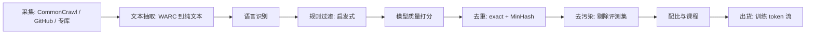

# 预训练数据工程

> ⚠️ 旧版:本篇写于写作契约确立之前,尚未按新标准审查重写。标准见 docs/04-知识库写作契约.md,样板见「GPU架构与执行模型」。

一句话:**同样的算力、同样的架构,数据管线的好坏能差出一代模型**——DCLM 的 7B 模型在 53 项评测均值上追平 Llama 3 8B,算力却少 6.6 倍,靠的不是新结构,而是一个选对了正例的 fastText 过滤器。「数据质量主导模型质量」如今是连专讲架构的手册都承认的第一性结论:架构决定效率的下限,数据决定能力的上限。

## 一、管线全景

把预训练数据管线想成**自来水厂**:上游是浑浊的江水(全网爬取),经过层层沉淀、过滤、消毒,最后出厂的才是能喝的水。每一环都是漏斗——DCLM 从 240T token 的原始池最后精选出 3.8T,留存率约 1.6%。好数据是筛出来的,不是捡来的。

顺序有讲究:便宜的环节放前面——规则过滤先扔掉大头,昂贵的模型打分只扫幸存者;去重放在过滤之后,先把垃圾扔了再去重,省一大截两两比较的计算。

## 二、采集与抽取

**CommonCrawl(CC)** 是非营利组织维护的全网爬取快照,约每月一档,是几乎所有开源预训练集网页部分的源头。每档提供三种格式:

- **WARC**:原始 HTML + HTTP 头(最全,需要自己抽正文)
- **WAT**:元数据(链接、header 摘要)
- **WET**:官方抽好的纯文本(方便,但质量差)

关键的坑与选择:

- **WET 的坑**:导航栏、菜单、版权声明、cookie 提示等模板噪声全混在正文里。RefinedWeb 与 FineWeb 的共同选择是**回到 WARC、用 trafilatura 类工具重抽正文**——光这一步就能明显涨分。类比:WET 是整页复印,自己抽取是只剪下正文那块豆腐块。
- **专库补源**:代码(GitHub / Stack 系列,按 license 过滤、按文件级规则清洗)、论文(arXiv、Semantic Scholar)、书籍、百科、高质量问答论坛。Dolma 是多源混合的代表:CC + 代码 + 论文 + 书籍 + 百科 + Reddit,共 3T token,且全套清洗工具链开源。
- **语言识别**:fastText 语言分类器按置信度切分语种,决定保留哪些语言、各留多少(多语言配比是后面配比环节的输入)。

## 三、过滤:先规则、后模型的两段式

类比机场安检:规则过滤是**金属探测门**,模型打分是**开箱细查**——门先把明显违禁的拦下,细查只对过了门的行李做,顺序反了成本爆炸。

### 启发式规则(便宜,先跑)

Gopher rules 风格的一票否决:文档词数在合理区间、平均词长 3–10、符号/词比不过高、重复行与重复段落占比不过高、以 bullet 开头的行不过多、必须命中若干常用停用词(这是"自然语言而非乱码"的证据)……外加 URL 黑名单与成人内容词表。此外还有合规清洗:PII 遮蔽(邮箱/电话/IP,Dolma 的标准工序)与毒性过滤。

### 模型质量打分(贵,后跑)

- **fastText 质量分类器**:拿"公认的好文本"(维基、书籍、被引用页面)当正例、随机网页当负例,训一个线性小分类器给每页打分,按分数截断或采样。
- **教育价值打分**:FineWeb-Edu 的配方——用 LLM 给几十万页面标 0–5 的"教育价值"分,再把标注蒸馏成小分类器扫全库。LLM 只出一次卷,批改交给小模型。
- **DCLM 的实证发现**:一个训练得当的 fastText 过滤器(正例用指令数据 OH-2.5 + ELI5 高赞回答)胜过一堆更花哨的质量打分方法。教训:**过滤器不用大,正例选对才是关键**——"什么算好数据"的定义本身就是最重要的超参。

## 四、去重(重点)

### 为什么关键:重复的三宗罪

1. **变相加权**:一段文本出现 100 次,梯度权重就 ×100,而你并没有打算这么配比。Lee et al. 发现 C4 里有一句 61 词的英文句子重复了 6 万多次——没人想让模型"重点背诵"它。
2. **记忆化**:Lee et al. 实证,去重后训练的模型逐字背诵训练数据的概率降约 10 倍(同时是隐私风险的直接缓解),且用更少步数达到同等或更好的困惑度——等价于白赚算力。
3. **评测虚高**:重复还常伴随训练/测试集重叠,跑分好看、能力没涨(与去污染一体两面)。

### 两级去重

- **精确去重(exact)**:URL 去重最便宜、放最前;然后是文档/段落哈希(SHA 或 Bloom filter 省内存,Dolma 的做法)。抓的是逐字节相同的拷贝。
- **近似去重(near-dup)**:抓"改了几个词的转载"。主流是 **MinHash-LSH**,三步:

**第 1 步 shingle**:文档切成 n-gram 集合(如 5-gram),两文档的相似度定义为集合的 Jaccard 相似度。

**第 2 步 MinHash 签名**:取 K 个哈希函数,每个函数对集合取最小哈希值,拼成 K 维签名。核心性质:

$$
P\left[\min_{x \in A} h(x) = \min_{x \in B} h(x)\right] = J(A,B) = \frac{|A \cap B|}{|A \cup B|}
$$

签名逐位相等的比例就是 Jaccard 的无偏估计。类比:两个班各自报出"学号最小"的学生,两班共同学生占比越高,报出同一个人的概率越大——用 K 次"选最小"把变长集合压成定长指纹。

**第 3 步 LSH 分桶**:把 K 维签名切成 $b$ 个 band、每个 band $r$ 行($K = br$),任何一个 band 完全相同就落进同一候选桶,桶内才做精确比对。两文档成为候选的概率:

$$
P_{\text{candidate}} = 1 - \left(1 - s^{r}\right)^{b}
$$

它关于真实相似度 $s$ 是一条 S 形曲线,阈值约在 $(1/b)^{1/r}$:高于阈值的对几乎必被抓住,低于则几乎必漏——把 $O(N^2)$ 的两两比较降为桶内小范围比较,这正是它能扫万亿 token 的原因。

> 🖼️ 占位:MinHash-LSH 候选概率随 Jaccard 相似度变化的 S 形曲线(不同 b/r 取值的对比)

### 粒度与分寸

- **文档级**为主,**段落/行级**补刀(清除抽取残留的页眉页脚等 boilerplate)。
- **去重不是越狠越好**:FineWeb 发现跨全部 CC 快照的全局激进去重反而伤性能——被反复转载的往往恰是好文本,全删掉后剩下的长尾质量更差;按快照独立去重效果更好。

## 五、去污染

- **做法**:评测集(MMLU、GSM8K 等)的题面与答案对训练集做 n-gram 匹配(常用 10–13 gram),命中即剔除文档或片段;更严格的还会查改写/翻译式污染(模糊匹配、嵌入相似度、LLM 判重)。
- **坑:污染让你自我感觉良好**。泄题涨的是分数不是能力,榜单上多出来的点,真实使用里全要吐回去。类比:背过题库答案的考生模拟考满分,上了没见过题的考场就现原形。
- 这条纪律在训练的每个阶段都成立:RL 的 prompt 池、SFT 数据同样要与评测严格去重(GRPO 篇的数据构建一节讲的是同一件事)。

## 六、配比与课程

- **领域配比**(网页/代码/数学/多语言各占多少)怎么定:主流做法是**小模型代理实验**——同一配比空间训一批小模型,按 scaling law 外推大模型表现后选优(外推为何合法见 ScalingLaws 篇);也有 DoReMi 这类用代理模型自动学域权重的方法。
- **数据受限时**:重复使用数据的收益递减但前几遍仍划算——约 4 个 epoch 内接近换新数据的效果,再往上性价比迅速崩塌。
- **两阶段课程**:主训练阶段配比均衡、覆盖面优先;**退火期**(学习率衰减段)把高质量数据加浓——数学、代码、教科书式与合成数据上采样,让影响力最大的收尾 token 花在最好的数据上(完整流程见预训练流程篇)。
- **代码的溢出效应**:加代码不只涨代码——对自然语言推理、结构化输出等能力也有正迁移,这是代码在配比中地位持续走高的原因。
- **出货前两件小事**:全局 shuffle(避免无意间形成"按域排队"的假课程)、在最终混合物上训练/校验 tokenizer。

## 七、合成数据

- **蒸馏式**:强模型出题、改写、扩写(把低质网页"重述"成干净文风也算)——本质是把强模型的能力烤进语料。
- **教科书式**:Phi 路线——按主题大纲批量生成"教科书质量"的课文与习题,小模型也能练出超龄表现。
- **自举风险:模型崩塌**。反复用模型输出训练下一代模型,分布的尾部(罕见知识、少数派表达)逐代丢失,输出越来越同质平庸。类比:复印件的复印件,越印越糊;克隆的克隆,代代递减。缓解:始终保留真实数据锚、控制合成占比、对合成源做主题与风格的多样性约束。
- **趋势**:现代配方里合成数据在退火期与后训练的占比越来越高——真实网页负责"见过世面",合成数据负责"精讲精练"。

## 八、开源数据集地标速览

| 数据集 | 规模 | 地标贡献 |
| --- | --- | --- |
| RefinedWeb | 5T token(公开 600B) | 证明"纯网页 + 严抽取严过滤"可匹敌精挑的多源混合语料 |
| Dolma | 3T token | 多源混合 + 全套清洗工具链开源,OLMo 的粮仓 |
| FineWeb / FineWeb-Edu | 15T / 1.3T token | 逐决策消融的透明网页配方;LLM 标教育分再蒸馏小分类器 |
| DCLM | 池 240T、baseline 3.8T | 数据配方的公共竞技场;fastText 过滤的 7B 用 2.6T token 达 MMLU 64 |

四家的路线之争也值得记:RefinedWeb / FineWeb / DCLM 是"网页可以自足"派,Dolma 是"多源混合"派;后来的配方基本是两派合流——网页为体、专库与合成为翼。

## 九、面试考点串联

高频问法(与题库联动的切片点):

1. MinHash-LSH 的原理、为什么能扫万亿 token →「去重:三步 + S 形曲线」
2. 去重为什么能涨分、不去重有什么后果 →「去重:三宗罪 + Lee et al. 实证」
3. WET 和 WARC 选哪个、抽取为什么重要 →「采集与抽取」
4. 质量过滤怎么做、DCLM / FineWeb-Edu 的配方 →「过滤两段式」
5. 数据配比怎么定、退火期加浓什么 →「配比与课程」
6. 合成数据有什么风险、模型崩塌怎么缓解 →「合成数据」
7. 怎么查评测污染、污染为什么危险 →「去污染」

## 相关文献

- Deduplicating Training Data Makes Language Models Better(Lee et al.)— [arXiv:2107.06499](https://arxiv.org/abs/2107.06499)
- The RefinedWeb Dataset for Falcon LLM — [arXiv:2306.01116](https://arxiv.org/abs/2306.01116)
- Dolma: an Open Corpus of Three Trillion Tokens — [arXiv:2402.00159](https://arxiv.org/abs/2402.00159)
- The FineWeb Datasets(含 FineWeb-Edu 配方)— [arXiv:2406.17557](https://arxiv.org/abs/2406.17557)
- DataComp-LM(DCLM)— [arXiv:2406.11794](https://arxiv.org/abs/2406.11794)
