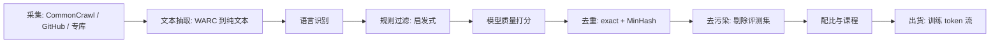

# 预训练数据工程

> ⚠️ 旧版:本篇写于写作契约确立之前,尚未按新标准审查重写。标准见 docs/05-知识库写作契约.md,样板见「GPU架构与执行模型」。

一句话:**同样的算力、同样的架构,数据管线的好坏能差出一代模型**——DCLM 的 7B 模型在 53 项评测均值上追平 Llama 3 8B,算力却少 6.6 倍,靠的不是新结构,而是一个选对了正例的 fastText 过滤器。「数据质量主导模型质量」如今是连专讲架构的手册都承认的第一性结论:架构决定效率的下限,数据决定能力的上限。

## 一、管线全景

把预训练数据管线想成**自来水厂**:上游是浑浊的江水(全网爬取),经过层层沉淀、过滤、消毒,最后出厂的才是能喝的水。每一环都是漏斗——DCLM 从 240T token 的原始池最后精选出 3.8T,留存率约 1.6%。好数据是筛出来的,不是捡来的。

顺序有讲究:便宜的环节放前面——规则过滤先扔掉大头,昂贵的模型打分只扫幸存者;去重放在过滤之后,先把垃圾扔了再去重,省一大截两两比较的计算。

## 二、采集与抽取

**CommonCrawl(CC)** 是非营利组织维护的全网爬取快照,约每月一档,是几乎所有开源预训练集网页部分的源头。每档提供三种格式:

- **WARC**:原始 HTML + HTTP 头(最全,需要自己抽正文)
- **WAT**:元数据(链接、header 摘要)
- **WET**:官方抽好的纯文本(方便,但质量差)

关键的坑与选择:

- **WET 的坑**:导航栏、菜单、版权声明、cookie 提示等模板噪声全混在正文里。RefinedWeb 与 FineWeb 的共同选择是**回到 WARC、用 trafilatura 类工具重抽正文**——光这一步就能明显涨分。类比:WET 是整页复印,自己抽取是只剪下正文那块豆腐块。
- **专库补源**:代码(GitHub / Stack 系列,按 license 过滤、按文件级规则清洗)、论文(arXiv、Semantic Scholar)、书籍、百科、高质量问答论坛。Dolma 是多源混合的代表:CC + 代码 + 论文 + 书籍 + 百科 + Reddit,共 3T token,且全套清洗工具链开源。
- **语言识别**:fastText 语言分类器按置信度切分语种,决定保留哪些语言、各留多少(多语言配比是后面配比环节的输入)。

## 三、过滤:先规则、后模型的两段式

类比机场安检:规则过滤是**金属探测门**,模型打分是**开箱细查**——门先把明显违禁的拦下,细查只对过了门的行李做,顺序反了成本爆炸。

### 启发式规则(便宜,先跑)

Gopher rules 风格的一票否决:文档词数在合理区间、平均词长 3–10、符号/词比不过高、重复行与重复段落占比不过高、以 bullet 开头的行不过多、必须命中若干常用停用词(这是"自然语言而非乱码"的证据)……外加 URL 黑名单与成人内容词表。此外还有合规清洗:PII 遮蔽(邮箱/电话/IP,Dolma 的标准工序)与毒性过滤。

### 模型质量打分(贵,后跑)

- **fastText 质量分类器**:拿"公认的好文本"(维基、书籍、被引用页面)当正例、随机网页当负例,训一个线性小分类器给每页打分,按分数截断或采样。
- **教育价值打分**:FineWeb-Edu 的配方——用 LLM 给几十万页面标 0–5 的"教育价值"分,再把标注蒸馏成小分类器扫全库。LLM 只出一次卷,批改交给小模型。
- **DCLM 的实证发现**:一个训练得当的 fastText 过滤器(正例用指令数据 OH-2.5 + ELI5 高赞回答)胜过一堆更花哨的质量打分方法。教训:**过滤器不用大,正例选对才是关键**——"什么算好数据"的定义本身就是最重要的超参。

### 数据质量诊断与清洗回归

样本通过训练目标和采样权重影响梯度。筛选时先识别问题类型,再选择检测方法;把所有高 loss 样本删除,会误伤正确但困难的数据。

| 问题与例子 | 影响与识别 | 处理 |
|---|---|---|
| 错标:下单日期被标成退款日期 | 学到错误映射;对照原文、规则和人工复核 | 重标或剔除,回查同来源样本 |
| 分布失配:只有短咨询,缺多轮纠纷 | 上线长尾失败;比较任务、领域、长度、标签分布 | 定向补样、调混合权重,不能只看 token 直方图 |
| 行为偏差:普通问题大量标为拒答 | 过度拒答、单一文风;分组检查正确应答与拒答 | 修订边界示范,保留合理的困难请求 |
| 冗余重复与评测污染 | 有效覆盖减少、记忆或测试分虚高 | 文档/片段去重,隔离评测来源并查近似重复 |

错误标签可能被记住而变成低 loss,重复也不保证梯度方差一定增大。loss、模型评分和置信度只用于排查,不能替代答案正确性核验。规则先去明显噪声,对答案疑点再做模型辅助审阅和分层抽检。

**clean data 训练后反而变差,应先查清洗改变了什么。** 可能误删稀有表达、有效难例或高质量材料,也可能改变任务配比、有效 token 和更新次数。保存各环节留存率、误删例及规则版本,用相同训练预算比较原集、筛选集和恢复某类样本后的结果,分别看抽检正确率与分组任务成绩。

实际复盘需报告自己参与的来源登记、清洗、质检与训练验证环节,不能把平台所列企业经验写成自身实测。低质量数据再多也要先定位错误类型,数据不足则定向补采、补标或审核合成候选,而不是无限复制少量精品样本。

对于大规模或UGC数据,便宜规则先去格式、广告和明显重复,昂贵模型检查剩余候选,再做分层抽检与独立任务验证。困惑度、模型分歧、梯度冲突或互动率仅是线索,高loss可能是有效难例。专业领域另查来源、时效、适用条件和依据,关键边界由对应专家复核。样本加权要设上限并归一化,检查少量样本是否占据过多更新,保证其他任务覆盖;与均匀权重基线比较,防止重复高权重样本放大错标或过拟合。

## 四、去重(重点)

### 为什么关键:重复的三宗罪

1. **变相加权**:一段文本出现 100 次,梯度权重就 ×100,而你并没有打算这么配比。Lee et al. 发现 C4 里有一句 61 词的英文句子重复了 6 万多次——没人想让模型"重点背诵"它。
2. **记忆化**:Lee et al. 实证,去重后训练的模型逐字背诵训练数据的概率降约 10 倍(同时是隐私风险的直接缓解),且用更少步数达到同等或更好的困惑度——等价于白赚算力。
3. **评测虚高**:重复还常伴随训练/测试集重叠,跑分好看、能力没涨(与去污染一体两面)。

### 两级去重

- **精确去重(exact)**:URL 去重最便宜、放最前;然后是文档/段落哈希(SHA 或 Bloom filter 省内存,Dolma 的做法)。抓的是逐字节相同的拷贝。
- **近似去重(near-dup)**:抓"改了几个词的转载"。主流是 **MinHash-LSH**,三步:

**第 1 步 shingle**:文档切成 n-gram 集合(如 5-gram),两文档的相似度定义为集合的 Jaccard 相似度。

**第 2 步 MinHash 签名**:取 K 个哈希函数,每个函数对集合取最小哈希值,拼成 K 维签名。核心性质:

$$
P\left[\min_{x \in A} h(x) = \min_{x \in B} h(x)\right] = J(A,B) = \frac{|A \cap B|}{|A \cup B|}
$$

签名逐位相等的比例就是 Jaccard 的无偏估计。类比:两个班各自报出"学号最小"的学生,两班共同学生占比越高,报出同一个人的概率越大——用 K 次"选最小"把变长集合压成定长指纹。

**第 3 步 LSH 分桶**:把 K 维签名切成 $b$ 个 band、每个 band $r$ 行($K = br$),任何一个 band 完全相同就落进同一候选桶,桶内才做精确比对。两文档成为候选的概率:

$$
P_{\text{candidate}} = 1 - \left(1 - s^{r}\right)^{b}
$$

它关于真实相似度 $s$ 是一条 S 形曲线,阈值约在 $(1/b)^{1/r}$:高于阈值的对几乎必被抓住,低于则几乎必漏——把 $O(N^2)$ 的两两比较降为桶内小范围比较,这正是它能扫万亿 token 的原因。

> 🖼️ 占位:MinHash-LSH 候选概率随 Jaccard 相似度变化的 S 形曲线(不同 b/r 取值的对比)

### 粒度与分寸

- **文档级**为主,**段落/行级**补刀(清除抽取残留的页眉页脚等 boilerplate)。
- **去重不是越狠越好**:FineWeb 发现跨全部 CC 快照的全局激进去重反而伤性能——被反复转载的往往恰是好文本,全删掉后剩下的长尾质量更差;按快照独立去重效果更好。

## 五、去污染

- **做法**:评测集(MMLU、GSM8K 等)的题面与答案对训练集做 n-gram 匹配(常用 10–13 gram),命中即剔除文档或片段;更严格的还会查改写/翻译式污染(模糊匹配、嵌入相似度、LLM 判重)。
- **坑:污染让你自我感觉良好**。泄题涨的是分数不是能力,榜单上多出来的点,真实使用里全要吐回去。类比:背过题库答案的考生模拟考满分,上了没见过题的考场就现原形。
- 这条纪律在训练的每个阶段都成立:RL 的 prompt 池、SFT 数据同样要与评测严格去重(GRPO 篇的数据构建一节讲的是同一件事)。

## 六、配比与课程

**配比先从目标任务与独立验证集出发。** 把网页、代码、领域和多语言语料分别统计质量、可用 token 与重复度,在相同训练预算下比较少量候选混合方案,同时看目标能力和通用能力是否退步。不能把某模型的代码比例或中文比例直接复制成通用配方。

课程学习是有意改变训练顺序或配比,例如先覆盖基本任务,再增加困难且可靠的样本;不是简单按长度排序。每次调整都要与固定配比的基线比较,避免把训练时间增加误当成课程收益。样本数量比例也不等于 token 比例,长回答会实际贡献更多训练位置。

领域 SFT 若要保留通用能力,可混入代表性通用指令或旧任务数据,按固定新旧验证集的收益和掉点调权重。若混入原始预训练文本,要分别声明语言建模目标、模板和损失位置,不能只套一个样本比例;损失与遗忘机制见 SFT 篇。数据量增加是否有益,看质量、覆盖与训练预算,没有领域、通用或合成数据的固定最佳百分比。

- **领域配比**(网页/代码/数学/多语言各占多少)怎么定:主流做法是**小模型代理实验**——同一配比空间训一批小模型,按 scaling law 外推大模型表现后选优(外推为何合法见 ScalingLaws 篇);也有 DoReMi 这类用代理模型自动学域权重的方法。
- **数据受限时**:重复使用数据的收益递减但前几遍仍划算——约 4 个 epoch 内接近换新数据的效果,再往上性价比迅速崩塌。
- **两阶段课程**:主训练阶段配比均衡、覆盖面优先;**退火期**(学习率衰减段)把高质量数据加浓——数学、代码、教科书式与合成数据上采样,让影响力最大的收尾 token 花在最好的数据上(完整流程见预训练流程篇)。
- **代码的溢出效应**:加代码不只涨代码——对自然语言推理、结构化输出等能力也有正迁移,这是代码在配比中地位持续走高的原因。
- **出货前两件小事**:全局 shuffle(避免无意间形成"按域排队"的假课程)、在最终混合物上训练/校验 tokenizer。

### 温度采样与配比验证

领域大小为$n_i$时,一种定义是$p_i=n_i^{1/T}/\sum_j n_j^{1/T}$。在此定义下$T=1$按规模,$T>1$拉平分布、相对增加小领域,$T<1$偏向大领域。按样本均匀抽不等于按领域均匀抽;有效token、长度和损失归一化还会改变更新贡献。重要小任务可设最低覆盖,同时补数据、限制重复并观察过拟合。多语言要看质量、任务需求、分词成本和低资源表现,不能只按字符量配平。旧域下降先查质量和覆盖,再补代表性旧样本或限制新域权重,回归新旧任务。

固定独立验证集及训练预算,先比较少量混合方案,再在候选中联调学习率与LoRA rank,观察交互效应。看任务成功率、约束遵循、拒答边界与最差子组,不只看总体loss;清洗收益也需原始/清洗/恢复某类样本的同预算消融。小模型代理、网格或贝叶斯搜索可以节省试验成本,但迁移到目标模型仍需复验。DoReMi 用相对参考模型的超额损失优化代理模型域权重,并将平均权重用于更大模型;单纯追最高原始loss会放大不可学习的噪声。

## 七、合成数据

- **蒸馏式**:强模型出题、改写、扩写(把低质网页"重述"成干净文风也算)——本质是把强模型的能力烤进语料。
- **教科书式**:Phi 路线——按主题大纲批量生成"教科书质量"的课文与习题,小模型也能练出超龄表现。
- **自举风险:模型崩塌**。反复用模型输出训练下一代模型,分布的尾部(罕见知识、少数派表达)逐代丢失,输出越来越同质平庸。类比:复印件的复印件,越印越糊;克隆的克隆,代代递减。缓解:始终保留真实数据锚、控制合成占比、对合成源做主题与风格的多样性约束。
- **趋势**:现代配方里合成数据在退火期与后训练的占比越来越高——真实网页负责"见过世面",合成数据负责"精讲精练"。

### 指令样本的设计与质量闭环

**先写清任务和验收,再扩数据。** 以客服为例,覆盖正常咨询、缺信息需澄清、订单更正和超出业务范围,不能只复制同一种礼貌问候。建立任务、领域、难度、长度和表达风格的覆盖清单,冻结独立评测集;来源可包括实际业务记录、专家标注、适用的公开数据及合成候选,登记版本、来源和使用范围。

指令说明输入、目标、输出格式与边界,如“提取订单号并输出 JSON”;输入缺必要信息时配正确澄清目标。多样性既包括自然表达,也包括任务条件、边缘情况和用户意图,同义改写数量不等于任务多样性。保存结构化角色、消息和回答,再按训练模板渲染;空 input 可以合法,截断不能删除答案依据,模板与监督边界见 SFT 篇。

质量验收按“来源登记 → 格式及明显噪声检查 → 精确/近似去重与去污染 → 答案审阅 → 分层抽检 → 下游验证”推进。分别统计格式合格率、约束满足率、分层抽检正确率、重复率和任务覆盖,用独立评测确认收益。困惑度、奖励模型分数或流畅度不能证明答案正确,也不宜按固定 top 百分比放行。

标注预算有限时,先审核一小份代表性种子,按覆盖缺口生成指令、输入和候选回答,再用规则、可核验资料或执行结果筛查,去重后人工抽检。Self-Instruct 提供生成候选再过滤的参考。始终保留真实数据锚点和独立验证,逐批检查继承错误、长尾丢失与文风同质化;不能仅用同一生成器自评分决定回流。

清洗后数量不足,先查看是否误删有效难例,再定向补真实样本或可靠合成数据。固定预算比较不同规模和筛选强度,新增样本应补足能力缺口。完整保存来源、生成方式、筛选规则和评测版本,失败时才能回查并修订整批。

分类样本需固定标签语义,抽取需明确字段与必要位置,生成需定义回答约束与可接受变体,不能共用一种自动分数。标注前用指南和正反例校准,对分歧记录原因、仲裁并修订指南,回查同类样本;一致率高不证明标签正确。有限预算可将规则/模型预标、分层随机抽检与难例复核结合,既查典型错误也估计总体质量。

按用户、会话、文档来源或时间隔离训练与评测,再检查精确重复、近似文本及改写污染;发现问题后追溯版本,清理并重新训练或评测。事实性回答须核查实体、数字和引用,模型多次回答一致仍可能共同犯错;MinHash针对词面集合,不直接判断语义真假。

均衡采样不等于每类等量:匹配真实任务并保留关键长尾,课程阶段改变难度后也要维持基础覆盖。长短样本按真实依赖、token预算与分桶表现配比,不能截断答案来凑长度。某领域下降先查质量、难度与覆盖,再定向补样或调权重,与固定配比做同预算对照并回归其他任务。

### 自动构造、人工标注与质量一致性

自动化适合扩大覆盖和稳定规则,人工适合含糊、复杂或错误代价高的样本。比较单位合格样本成本时要算生成、审核、返工与规则维护。先用代表性种子建立指南,机器出候选并做格式/证据/执行检查,人工复核分歧和高影响样本,同时分层随机抽检普通样本。金融等领域也按影响与可核验性分工,不能据企业名称推断固定流程。独立审核集统计正确率、误放率、覆盖和返工,再用同预算训练检验真实收益。

一致性是发现歧义的工具。两人分类标注可用 Cohen’s Kappa,$\kappa=(p_o-p_e)/(1-p_e)$,分别扣除观察一致率中的偶然一致部分;多人应选适配多人设计的指标。得到0.6时先看类别失衡、样本量、混淆类型和指南问题,再仲裁、培训与回查,没有所有任务通用的及格线。专家和多数人也可能共同犯错,须对照事实或执行结果。交叉验证检查模型泛化,不证明标注正确;交叉校验才是对照独立证据核查。开放生成按约束、连贯、事实和创意等维度盲评或成对比较,允许多个合格答案,无需追求字符串一致。

### 行为日志、归一化与偏好构造

保留用户/会话时序与必要上下文,统一API字段、类型、单位及时区,把等义操作抽象成动作和参数,但不丢渠道、金额与执行状态。点击、意图和执行成功不是同一标签;抽象过粗损失条件,过细则稀疏且耦合界面。保存原日志、抽象结果、规则版本和未知事件回退路径,更新前并行回放并回归旧任务。

去除重复、测试流量和不必要个人信息;短确认可能有效,误触、中断或无结果会话先标不确定。SFT 只用核验过的目标回答。偏好对需同一请求下可比较的候选,停留时长、点击受到曝光、位置和用户状态影响,未点击不等于不喜欢。用显式偏好或专家审核样本校准代理信号,低置信度降权或不用。按用户/时间隔离评测,比较意图、槽位与执行结果正确率,最终看真实任务完成率和适用的线上对照,不以奖励分上涨代替收益。

### 数据增强的语义与分布边界

图像可用裁剪、翻转、颜色扰动;检测框和分割标签需随变换移动,OCR翻转可能破坏任务。文本可用改写、回译、受控实体替换,必须核查否定、数字、事实和相应答案。语音可用噪声、混响、变速及时频遮挡,需保留可辨内容,调整时间标注并检查说话人/情感标签。增强要求输入与监督相容,并非标签一概不变:mixup混合输入及标签,SpecAugment在语音特征上做时频扰动。

先清洗再增强可靠样本,保留真实数据锚。多模态生成描述或回译要核查图像依据与配对关系,裁剪后不能仍描述已消失的物体。SFT增强检查目标正确,偏好数据还需复核原排序是否成立;只改一侧可能改变事实和偏好。按原始样本及衍生族隔离测试,同预算比较无增强、单方法和组合方案,看真实及分布外分组成绩;子集下降时按方法、强度、来源消融,撤回有害变换并恢复覆盖。

## 八、中文指令数据:先保留语义,再统一格式

中文指令数据的关键是**要求明确、回答正确、表达覆盖真实用户**。没有空格并不等于必须预先分词;是否损失信息要用实际 tokenizer 和样本检查,而不是套固定的“中英文 token 长度比”。

| 问题 | 怎么发现 | 怎么处理 |
|---|---|---|
| 翻译后改了条件、对象或否定关系 | 把两种语言的任务要求逐项对照,核对数字、单位、实体与答案 | 修订翻译或重写本地表达;双语抽检,回译仅作辅助 |
| 繁简、全半角、乱码混杂 | 按来源统计并抽样查看 | 修复编码和明确的格式噪声;保留人名、代码、公式及有任务意义的差异 |
| 方言、网络用语或中英混写被当成低质 | 按目标用户场景单独抽检 | 有业务需求就保留并补释义/对应回答,不能全部改成书面语 |
| 指令含糊或回答自相矛盾 | 检查任务能否完成,回答是否满足约束且事实一致 | 补上下文、重标或剔除,不因文字流畅就保留 |
| 模板与任务分布单一 | 按任务、领域、难度、长度、表达风格统计覆盖 | 针对缺口补样本,用验证结果调配比,不设通用的六四开比例 |

**资源有限时先做一小份可信的种子集。** 选代表性的真实任务,写清标注要求与正确答案;再用种子扩写或生成候选,经过规则、模型辅助检查和人工抽检。Self-Instruct 提供了“生成候选再过滤”的参考方法,但生成数量多不等于质量高。用未参与生成和筛选的验证集检查收益。

实际清洗可按“来源登记 → 规则检查 → 去重/去污染 → 答案质量检查 → 分层抽检 → 版本化交付”推进。MinHash 用于近似重复检测,不能判断答案真假;模型评分也不能替代事实核验。翻译、合成样本与原始样本保持来源可追溯,发现一类错误时才能回查整批。

训练与上线的对话模板、角色边界及损失掩码由 SFT 篇负责;本篇只负责数据内容与质量。

## 九、开源数据集地标速览

| 数据集 | 规模 | 地标贡献 |
| --- | --- | --- |
| RefinedWeb | 5T token(公开 600B) | 证明"纯网页 + 严抽取严过滤"可匹敌精挑的多源混合语料 |
| Dolma | 3T token | 多源混合 + 全套清洗工具链开源,OLMo 的粮仓 |
| FineWeb / FineWeb-Edu | 15T / 1.3T token | 逐决策消融的透明网页配方;LLM 标教育分再蒸馏小分类器 |
| DCLM | 池 240T、baseline 3.8T | 数据配方的公共竞技场;fastText 过滤的 7B 用 2.6T token 达 MMLU 64 |

四家的路线之争也值得记:RefinedWeb / FineWeb / DCLM 是"网页可以自足"派,Dolma 是"多源混合"派;后来的配方基本是两派合流——网页为体、专库与合成为翼。

## 十、面试考点串联

| 问法 | 本文哪一节 |
| --- | --- |
| 中文数据怎样保留语义和长尾,预算有限时怎样扩充? | 八、中文指令数据:先保留语义,再统一格式;指令样本的设计与质量闭环 |
| 指令数据怎样设计任务、来源、格式、多样性并验收,不足时怎样补充? | 指令样本的设计与质量闭环;数据质量诊断与清洗回归 |
| 噪声怎样影响训练,如何规模化过滤、加权并诊断清洗退化? | 数据质量诊断与清洗回归;四、去重(重点) |
| 自动构造与人工如何分工,如何评估半自动偏好和专业数据? | 自动构造、人工标注与质量一致性 |
| Kappa、多人标注、校验与专家审核怎样配合,开放生成怎样评? | 自动构造、人工标注与质量一致性;行为日志、归一化与偏好构造 |
| 日志如何抽象、处理噪声并构造SFT或偏好数据,怎样更新规则和验收? | 行为日志、归一化与偏好构造 |
| 各模态增强怎样保留监督语义,跨模态与偏好增强有何边界? | 数据增强的语义与分布边界 |
| 配比、温度、课程怎样保护小任务/多语言/旧能力,怎样联合调参与验证? | 六、配比与课程;温度采样与配比验证 |

> 本篇仍保留旧稿重写状态。

## 相关文献

- Self-Instruct: Aligning Language Models with Self-Generated Instructions — [arXiv:2212.10560](https://arxiv.org/abs/2212.10560)
- Deduplicating Training Data Makes Language Models Better(Lee et al.)— [arXiv:2107.06499](https://arxiv.org/abs/2107.06499)
- The RefinedWeb Dataset for Falcon LLM — [arXiv:2306.01116](https://arxiv.org/abs/2306.01116)
- Dolma: an Open Corpus of Three Trillion Tokens — [arXiv:2402.00159](https://arxiv.org/abs/2402.00159)
- The FineWeb Datasets(含 FineWeb-Edu 配方)— [arXiv:2406.17557](https://arxiv.org/abs/2406.17557)
- DataComp-LM(DCLM)— [arXiv:2406.11794](https://arxiv.org/abs/2406.11794)
- Understanding deep learning requires rethinking generalization(随机标签拟合实验说明训练拟合不等于标签正确)— [arXiv:1611.03530](https://arxiv.org/abs/1611.03530)

- Cohen’s Kappa 定义与范围 — [scikit-learn](https://scikit-learn.org/stable/modules/generated/sklearn.metrics.cohen_kappa_score.html)
- mixup — [arXiv:1710.09412](https://arxiv.org/abs/1710.09412)
- SpecAugment — [arXiv:1904.08779](https://arxiv.org/abs/1904.08779)
- DoReMi — [arXiv:2305.10429](https://arxiv.org/abs/2305.10429);[作者算法说明](https://crfm.stanford.edu/2023/09/14/doremi.html)
