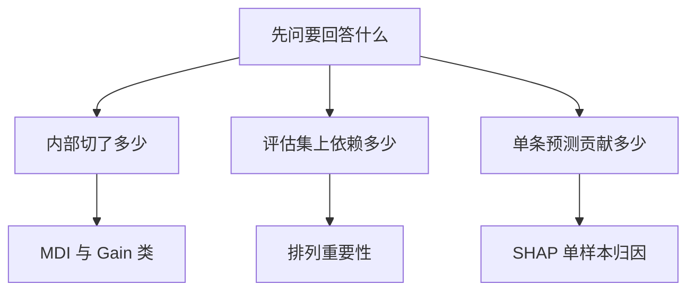

# 模型可解释性

一句话:「特征重要性」不是一个数,而是**三个不同问题的答案**——模型内部用它切了多少(MDI、Gain/Cover/Weight)、模型在这份评估数据上依赖它多少(排列重要性)、这一条预测里它贡献了多少(SHAP);面试里绝大多数翻车都来自把其中一个当成另外两个来用。本篇只讲树模型怎么解释,树本身怎么长见 集成学习 篇。

## 一、先立住:三个问题,不是一个量

> **类比**:问「这家公司谁最重要」,可以数谁开会最多(内部统计),可以看谁请假一天业绩掉最多(拿掉后看结果),也可以问「这单合同签下来谁功劳多大」(单件事归因)。三种答案经常不一致,而且**都对**——它们本来就不是同一个问题。

| 问题 | 方法 | 用不用标签 | 在哪份数据上算 | 全局还是单样本 |
|---|---|---|---|---|
| 模型内部用它切了多少 | MDI、Gain / Cover / Weight | 不用(训练时已算完) | 训练集 | 全局 |
| 模型在这份评估分布上依赖它多少 | 排列重要性 | **要**,还要一个评估指标 | 独立验证 / 测试集 | 全局 |
| 这一条预测里它贡献了多少 | SHAP | 不用 | 任意样本 + 一个背景分布 | 单样本,可汇总成全局 |

为什么不能互相替代:**第一类量的是「训练时发生了什么」**,一个只在训练集上帮着过拟合的噪声列照样能拿高分,因为它确实被切了很多次;**第二类量的是「拿掉它,评估指标掉多少」**,它和指标、和评估集绑定,换一个指标排名就变;**第三类量的是「这次预测为什么是这个数」**,它不关心预测对不对——SHAP 不看标签,一个把错误预测推得更错的特征照样拿到很大的贡献值。所以面试里先问清对方要哪一类,再谈方法。

## 二、MDI:训练时顺手记下的不纯度下降

### 定义

树每分裂一次,节点的「不纯度」就降一点:分类树用 Gini($1-\sum_k p_k^2$,scikit-learn 分类树的默认 `criterion`)或熵,回归树用节点内 MSE(也就是方差)——熵与交叉熵的含义见 分类损失 篇,MSE 见 回归损失 篇,这里只把它们当「这个节点有多混」的刻度。**MDI(Mean Decrease in Impurity,平均不纯度减少)就是把每个特征参与的所有分裂带来的不纯度下降加起来。** 对一棵树、特征 $j$,记 $T_j$ 为用它分裂的节点集合:

$$
\mathrm{MDI}(j)=\sum_{t\in T_j}\frac{N_t}{N}\left[I_t-\frac{N_L}{N_t}I_L-\frac{N_R}{N_t}I_R\right]
$$

意思是:每个用特征 $j$ 切的节点,先算「切之前的不纯度减去左右子节点按样本数加权的不纯度」,再乘上这个节点占全体样本的比例(越靠近根、覆盖样本越多的分裂权重越大),最后对该特征所有的分裂求和。scikit-learn 的做法是**每棵树先归一化到和为 1,森林再对所有树取平均、再归一化**,所以 `feature_importances_` 永远非负、和为 1;它的文档把这个量也叫 Gini importance,但分裂准则换成熵或 MSE 时公式形状不变,**不能说「提升树的重要性都是 Gini」**。

### 它偏在哪

三条偏差,第一条最要命。

**偏爱可切分点多的连续 / 高基数特征。** 因为分裂是在所有候选切点里挑最好的:一列有 $n$ 个不同取值的连续特征有 $n-1$ 个候选阈值,一个三档的类别特征只有 2 个。候选越多,**凭巧合找到一个能降一点不纯度的切法**的概率越高——这是「在越多次尝试里取最大值,最大值越大」的纯统计效应,和特征有没有信息无关。scikit-learn 官方示例在 Titanic 数据上加了一列**纯随机的连续数** `random_num`(取值个数等于样本数)和一列三档随机类别 `random_cat`,MDI 把 `random_num` 排进最重要的几个特征里;换成在测试集上算排列重要性,两列随机特征都接近 0,真正有用的低基数特征 `sex` 和 `pclass` 才排到前面。Strobl 等人 2007 年的论文把这件事讲透了:Gini 重要性系统性偏向类别数多的变量,根源一是 CART 类分裂准则本身的选择偏差,二是**有放回的 bootstrap** 会在类别多的变量上制造虚假关联;他们的解法是换成用假设检验选分裂变量的条件推断树,再配无放回子采样。

**只反映训练集。** MDI 是训练时累计的,一个特征只要「模型有能力拿它来过拟合」,就能拿到高分,和它对留出集有没有用无关。scikit-learn 用户指南列的正是这两条缺陷:它算自训练集统计量,以及它偏向高基数。

**相关特征之间分摊。** 两个高度相关的特征,树在每个节点随便选一个都行,重要性被随机地摊到两边;随机森林的列采样会让这种分摊更均匀一些,但总量怎么分是训练随机性决定的,不是它们各自的「真实贡献」。

### 成本

近乎零。因为每个节点分裂时本来就要算不纯度下降,MDI 只是把这个数按特征累加起来;训练完直接读属性,不需要任何额外推理。这就是它作为默认输出的原因,也是它被过度使用的原因。

## 三、Gain / Cover / Weight:提升树的三本账

### 三个量各自记什么

XGBoost 一类的提升树不用 Gini,它每次分裂在算的是 集成学习 篇第四节那个带正则的增益(一阶梯度和的平方除以二阶梯度和加 $\lambda$,再减 $\gamma$)。每个节点在树结构里存两个统计量:这次分裂带来的损失下降,以及落到这个节点的样本的二阶导之和(XGBoost 源码给这个字段的注释就是「用来度量数据覆盖」)。三本账就是从这两个数和分裂次数汇总出来的:

| 名字 | 记的是什么 | 回答什么问题 | 直觉 |
|---|---|---|---|
| Gain | 该特征所有分裂的损失下降 | 它替模型降了多少损失 | 「干活干出了多少成果」 |
| Cover | 该特征所有分裂节点上的样本权重(二阶导之和) | 它的分裂波及多少样本 | 「管着多少人」 |
| Weight / Frequency / Split | 该特征被用来分裂的次数 | 模型有多常拿它切 | 「被叫到多少次」 |

Cover 为什么是二阶导之和而不是样本数:因为 XGBoost 里每个样本在增益公式里的「分量」就是它的二阶导 $h_i$——平方损失下 $h_i\equiv1$,Cover 就退化成样本数;对数损失下 $h_i=p_i(1-p_i)$,模型已经很有把握的样本几乎不算数。`min_child_weight` 卡的就是这个量。

### 为什么不能互相替代

一个特征可以「用一次、在根节点、增益巨大」——Gain 很高、Weight 只有 1;另一个特征可以「在几百棵树的最深处各切一小刀」——Weight 很高、每刀的增益都很小。**Weight 会像 MDI 一样偏向连续 / 高基数特征**,因为候选阈值多的特征更容易在深处被反复选中;Gain 偏向靠近根节点的强特征,因为根附近的分裂覆盖样本最多、损失下降最大;Cover 偏向早期、覆盖广的分裂。三者的排名经常互相打架,而且 Lundberg 等人 2018 年证明 Gain 和分裂次数都**不满足一致性**(第五节解释这个词):把模型改得更依赖某个特征,它的 Gain 反而可能下降。

### 求和还是平均:两个库的口径不同,先核对

| 库 | 接口 | 默认 `importance_type` | `gain` 的含义 | 求总量用哪个 |
|---|---|---|---|---|
| XGBoost 原生 `Booster.get_score` | `weight` | 分裂次数 | **每次分裂的平均增益** | `total_gain`、`total_cover` |
| XGBoost sklearn 封装 `feature_importances_` | 树模型默认 `gain`,线性模型 `weight` | 同上 | 同上(平均),再归一化到和为 1 | 显式传 `total_gain` |
| LightGBM `Booster.feature_importance` | `split` | 分裂次数 | **所有分裂增益的总和** | `gain` 本身就是总量 |

这张表的教训只有一句:**XGBoost 的 `gain` 和 LightGBM 的 `gain` 不是同一个量**——前者是平均、后者是求和,拿两边的「gain 排名」直接对比是错的;要对齐得用 XGBoost 的 `total_gain`。同一个库里默认值也各不相同,报数字前先说清是哪个口径。成本和 MDI 一样近乎零,都是从训练好的树结构里读出来的。

## 四、排列重要性:在评估集上把一列打乱

### 怎么算,在哪算,为什么要重复

思路是 Breiman 在随机森林原文里提出的:**把某一列的取值随机打乱,其它列不动,看模型分数掉多少**。打乱切断了这一列和标签(以及和其它列)的关系,分数掉得越多,说明模型越依赖它。三条纪律:

1. **在独立的验证 / 测试集上算**,因为它想回答的是「模型的泛化能力靠谁」;在训练集上算,过拟合到噪声列的模型会把噪声列也报成重要。scikit-learn 的示例里同一个森林、同两列随机特征,在训练集上算排列重要性明显高于在测试集上算,把 `min_samples_leaf` 提到 20 压住过拟合后才降下去。
2. **重复打乱、报均值和标准差**,因为一次打乱是一次随机抽样,分数的下降本身有方差;scikit-learn 的 `permutation_importance` 默认 `n_repeats=5`,返回 `importances_mean` 与 `importances_std`,标准差和均值同量级的特征不能下结论。
3. **说清用的是哪个指标**,因为它度量的是「指标下降」——同一个模型在 AUC 下和 logloss 下的排名可以不同。

手写实现属于题库的手撕代码题,本篇不贴。

### 它回答的是预测依赖,不是因果

打乱一列只说明**模型**用了它,不说明这个特征在现实里驱动了标签。一个和真正原因高度相关的代理变量(比如「邮编」代理「收入」)会拿到很高的排列重要性,干预它在现实中什么也不会发生。它也**不保证无偏**:Strobl 2007 年的实验里排列重要性的偏差比 Gini 重要性轻,但并没有消失:在类别数多的变量上方差被明显抬高;Altmann 等人 2010 年的 PIMP 方法就是为此设计的——**反复打乱的是标签**(通常 50–100 次),每次重算重要性得到「没有任何关系时」的零分布,再对真实重要性算 p 值,把「高基数带来的虚高」从「真有信号」里剥出来。

### 相关特征:两种效应,方向相反

**替代效应,把双方压低。** 两个高度相关的特征,打乱其中一个,模型仍能从另一个拿到几乎同样的信息,分数几乎不掉;两列各自的重要性都接近 0,尽管它们合起来可能是最重要的信号。scikit-learn 的对策是先把相关特征聚成簇,每簇只留一个再算。

**外推效应,把数值抬高。** Hooker 与 Mentch 的批评指向另一边:打乱一列会造出**训练分布里根本不存在的特征组合**——「年龄 5 岁、学历博士」这种点。模型在没见过的区域怎么预测是任意的,分数的下降可能反映的是「模型在分布外瞎猜」,而不是「它依赖这个特征」;强相关的特征恰恰最容易被这样高估。这篇论文的结论写在标题里:不额外训一个模型,就没有免费的变量重要性。

两条缓解思路。**条件排列**(Strobl 等人 2008 年):不在全体样本上打乱,而是按其它相关特征划出的格子,在每个格子内部打乱,让打乱后的样本仍落在训练分布里。**分组排列**:把一簇相关特征当作一个单元一起打乱,回答「这一组信息模型依赖多少」,避开组内互相替代。再往上一层就是 Hooker 提出的「拿掉这个特征重训一遍,比较两个模型」——最干净,也最贵。

### 成本

特征数 × 重复次数 次完整推理再加一次基线:100 个特征、5 次重复就是 501 遍评估集推理。对树模型这通常是分钟级,对大模型或大评估集会成为主要开销;好处是**完全不依赖模型内部结构**,任何能出预测的黑盒都能算。

## 五、SHAP:把这一条预测的差额公平地摊给每个特征

### Shapley 值的直觉与公式

问题是这样的:模型对某个样本给出 $f(x)$,平均而言给出 $\mathbb{E}[f]$(基线),这两者的差额要**摊给每个特征**。Shapley 值是合作博弈论里「公平分账」的唯一解:把特征当成一个个「加入联盟」的玩家,一个特征的贡献等于它**在所有可能的加入顺序下带来的边际增量的平均**。

$$
\phi_j=\sum_{S\subseteq F\setminus\{j\}}\frac{|S|!\,(|F|-|S|-1)!}{|F|!}\left[v(S\cup\{j\})-v(S)\right]
$$

意思是:枚举不含 $j$ 的每个特征子集 $S$,看「已经知道 $S$ 时再告诉模型 $j$」预测变了多少,按这个子集在随机顺序里出现的概率加权求和。$v(S)$ 是「只知道 $S$ 里的特征时模型的期望输出」,这个期望对没在 $S$ 里的特征要按某个背景分布积掉——**背景分布怎么选,SHAP 值就跟着变**,这是它最常被忽视的自由度。这样分出来的 $\phi_j$ 有三条性质:所有特征的 $\phi$ 加起来**恰好等于** $f(x)-\mathbb{E}[f]$(局部准确),模型不用的特征贡献为 0,以及**一致性**——只要把模型改得更依赖某个特征(其它不变),它的归因不会下降。Gain 和分裂次数恰恰没有第三条。

### TreeSHAP 为什么能精确、又是多项式时间

按定义算要枚举 $2^{|F|}$ 个子集,20 个特征就是一百万个,一般模型只能采样近似(KernelSHAP)。树模型不一样:「只知道 $S$ 里的特征」时的期望输出可以沿着树走——遇到 $S$ 里的特征就按取值走一边,遇到不在 $S$ 里的特征就按训练样本落到两边的比例把两边加权。Lundberg 等人 2018 年的算法把「对所有子集求和」折叠成沿每条从根到叶的路径同时追踪各种子集大小的统计量,复杂度是 $O(TLD^2)$——$T$ 棵树、每棵最多 $L$ 片叶、深度 $D$。1000 棵深度 6 的树,一个样本大约是 $1000\times64\times36\approx2.3\times10^6$ 次基本操作,毫秒级。这个实现已经合进 XGBoost(`predict` 传 `pred_contribs=True`)和 LightGBM(`pred_contrib=True`)。

背景分布有两种给法,shap 库的 `TreeExplainer` 由 `feature_perturbation` 控制:不给背景数据时默认 `tree_path_dependent`,用每个分支上训练样本的数量当背景;给了背景数据则默认 `interventional`,按因果推断的规则把不在 $S$ 里的特征换成背景样本的值,**运行时间随背景样本数线性增长**,文档建议 100–1000 条。两种口径下同一个模型的 SHAP 值不同,相关特征强的时候差得更多。

### 局部与全局:mean(|SHAP|) 是什么

单样本的 SHAP 值**带符号**:正的把预测往上推,负的往下拉。把一批样本每个特征的 $|\phi_j|$ 取平均,就得到最常见的全局重要性 $\text{mean}(|\text{SHAP}|)$——它回答的是「平均而言这个特征把预测挪动了多远」,不管方向。Lundberg 2020 年那篇的主张就是:全局理解应该从大量局部解释**汇总**上来,而不是另起一套统计;同一份 SHAP 矩阵还能画依赖图(某特征取值 vs 它的 SHAP)和交互值,后者要算所有特征对,复杂度在特征数上是平方的。

### 成本与边界

成本:树模型上 TreeSHAP 每样本毫秒级,乘以样本数;`interventional` 再乘背景样本数;非树模型只能靠 KernelSHAP 等采样近似,慢几个数量级。边界三条:**相关特征下的分账依赖背景口径**——`interventional` 只按模型真实使用的特征分账,模型从不使用的特征严格为 0,`tree_path_dependent` 按训练样本沿分支的比例估背景,两者在强相关特征上给出的分账可以差很多;**它解释的是 $f(x)$ 不是标签**,不看标签就分不清「模型依赖」和「模型依赖得对」;**依赖不等于因果**,和排列重要性一样。

## 六、三条真题追问

### Permutation 和 SHAP 什么时候各自更合适

先问三件事。**问的是全局依赖还是单样本归因?** 「模型在这份评估集上靠哪些特征拿分」「删掉哪些特征不掉点」是排列重要性的题,它直接量指标下降;「这个用户为什么被拒」「这条预测为什么比基线高 0.3」只能用 SHAP,排列重要性根本没有单样本版本。**有没有标签和指标?** 排列重要性必须有,SHAP 不用——线上没有标签的新样本只能 SHAP。**要不要一致性和可加性?** SHAP 的贡献加起来严格等于预测与基线之差,改模型后的归因变化方向可信;排列重要性和指标、评估集、随机种子绑定,跨模型版本对比要小心。成本上树模型 SHAP 极便宜,非树模型则反过来,排列重要性只要能推理就能算。两者常常一起用:排列重要性做特征筛选与泛化诊断,SHAP 做单样本解释与方向分析;**两者都不是因果**。

### 全局重要性高,单样本 SHAP 为负,怎么解释

不矛盾,因为**全局是平均绝对值,局部是带符号的值**。一个特征全局 $\text{mean}(|\text{SHAP}|)$ 排第一,说的是它平均把预测挪得最远;某个样本上它为负,说的是在这个样本的取值下它把预测往下拉。三种常见原因:**取值区间不同方向相反**——「收入」在低区间压低违约概率、在高区间可能因为和别的信号交互反而抬高,依赖图上能直接看到同一特征上下都有点;**归因是相对基线的**——这个样本的取值低于平均,一个正向特征在它身上自然给负贡献;**交互效应**——SHAP 把交互项摊给参与的双方,某特征在这个样本上「和另一个特征一起」拉低了预测,单看它就是负的,交互值能把这部分单独拆出来。回答时把「全局 = 幅度平均」「局部 = 有向贡献」这两句说死,再举一个方向翻转的例子就够了。

### 高基数类别特征怎样减少重要性偏差

按顺序做五件事。**第一,别用 MDI 和 Weight 下结论**,换成留出集上的排列重要性或 SHAP,它们没有「候选切点多就占便宜」的机制。**第二,目标编码必须折内做**:高基数 ID 若用全量标签编码,每条样本自己的标签就在编码里,这一列的重要性会高到离谱——那是泄漏不是信号;折外编码、留一、有序统计的做法见 特征工程 篇。**第三,压基数**:合并稀有类别、按频次截断、用 LightGBM 原生类别分裂时把 `min_data_per_group` 这类参数收紧(见 集成学习 篇),候选切法少了偏差自然小。**第四,放一列随机噪声当基线**:加一列纯随机数、一列随机类别一起训,重要性不高于噪声列的特征一律不算数,这正是 scikit-learn 那个示例的做法。**第五,要 p 值就用 PIMP**:打乱标签重算重要性得到零分布,把高基数的虚高剥掉。若能换算法,Strobl 推荐的条件推断树加无放回子采样从分裂准则上就去掉了这个偏差。

## 七、解释边界:重要性是线索,不是证据

**训练集与验证集重要性不一致只是诊断线索。** 某特征训练集上排第一、验证集上接近 0,可能是过拟合,可能是泄漏,也可能只是这个特征在验证集里分布不同(过拟合与分布偏移怎么区分见 泛化与正则化 篇第二节);要证明泄漏得回到特征构造的时间线上查,要证明因果得做干预或用因果推断,**单凭重要性两边都证不了**。

**四样东西一变,重要性就变。** 模型变(换超参、换种子、换库)、评估分布变(换一批验证集)、相关性结构变(加一个相关特征进来就把原特征的排列重要性稀释掉)、指标变(AUC 和 logloss 对同一个特征的敏感度不同)。所以重要性要和它的条件一起报:哪个模型、哪份数据、哪个指标、哪种口径。

LIME 是另一条路:在单个样本周围扰动采样,用一个线性模型局部拟合黑盒,读线性系数当解释;它和 SHAP 一样是局部方法,但它的系数不满足 Shapley 的局部准确与一致性,换一种扰动方式解释就会变,这里只做定位不展开。

## 八、一张总表

| 方法 | 回答什么问题 | 主要偏差 | 计算成本 | 适用 |
|---|---|---|---|---|
| MDI | 训练时该特征切掉了多少不纯度 | 偏向高基数 / 连续;只看训练集;相关特征分摊 | 近乎零 | 训练完快速看一眼 |
| Gain | 该特征分裂累计降了多少损失 | 偏向靠近根的强特征;不一致;各库求和 / 平均口径不同 | 近乎零 | 提升树内部诊断 |
| Cover | 该特征分裂波及的样本权重 | 偏向早期、覆盖广的分裂 | 近乎零 | 辅助看 Gain 落在多少样本上 |
| Weight / Split | 被用来分裂的次数 | 和 MDI 同样偏向高基数;不一致 | 近乎零 | 几乎只用来发现被反复切的噪声列 |
| 排列重要性 | 模型在这份评估集上依赖它多少 | 相关特征双向失真;分布外组合;和指标绑定 | 特征数 × 重复数 × 一次推理 | 泛化诊断、特征筛选、任何黑盒 |
| SHAP | 这条预测里它贡献了多少,可汇总 | 背景分布依赖;相关特征分账口径;不看标签 | 树上每样本毫秒级;非树慢几个量级 | 单样本解释、方向与交互分析 |

## 九、面试考点串联

| 高频问法 | 本文哪一节 |
| --- | --- |
| 在随机森林、GBDT、XGBoost、LightGBM 等树模型中,常见特征重要性怎样计算? | 一、二、三、四、五 |
| 说明不纯度减少的含义、优缺点、计算成本及解释边界 | 二 |
| 说明排列重要性的含义、优缺点、计算成本及解释边界 | 四 |
| 说明 Gain/Cover/Frequency 的含义、优缺点、计算成本及解释边界 | 三 |
| Permutation Importance 和 SHAP 什么时候各自更合适? | 六(第一小节)、一 |
| 某特征全局重要性高,但一个样本的 SHAP 为负,怎样解释? | 六(第二小节)、五 |
| 高基数类别特征怎样减少重要性偏差? | 六(第三小节)、二 |
| 为什么一列纯随机数在 MDI 里能排到前面?换成哪种方法就不会了?(补充题) | 二、四 |
| XGBoost 和 LightGBM 都能输出 gain,两边的排名能直接对比吗?(补充题) | 三 |
| 两个高度相关的特征,排列重要性会怎么样?怎么缓解?(补充题) | 四 |
| Shapley 值的「公平」指什么?树模型上为什么算得快?(补充题) | 五 |
| 训练集和验证集上的重要性差很多,能据此说数据泄漏了吗?(补充题) | 七 |

## 相关文献

- Random Forests(Breiman,Machine Learning 45, 2001;排列重要性的出处)— https://link.springer.com/article/10.1023/A:1010933404324
- Bias in random forest variable importance measures: Illustrations, sources and a solution(Strobl 等,BMC Bioinformatics 8:25, 2007)— https://doi.org/10.1186/1471-2105-8-25
- Conditional variable importance for random forests(Strobl 等,BMC Bioinformatics 9:307, 2008)— https://doi.org/10.1186/1471-2105-9-307
- Permutation importance: a corrected feature importance measure(Altmann 等,Bioinformatics 26(10), 2010;PIMP)— https://academic.oup.com/bioinformatics/article/26/10/1340/193348
- A Unified Approach to Interpreting Model Predictions — [arXiv:1705.07874](https://arxiv.org/abs/1705.07874)
- Consistent Individualized Feature Attribution for Tree Ensembles(TreeSHAP 与一致性)— [arXiv:1802.03888](https://arxiv.org/abs/1802.03888)
- From local explanations to global understanding with explainable AI for trees(Nature Machine Intelligence 2, 56–67, 2020)— [arXiv:1905.04610](https://arxiv.org/abs/1905.04610)
- XGBoost: A Scalable Tree Boosting System — [arXiv:1603.02754](https://arxiv.org/abs/1603.02754)
- Unrestricted Permutation forces Extrapolation: Variable Importance Requires at least One More Model, or There Is No Free Variable Importance(Hooker、Mentch、Zhou;初版题为 Please Stop Permuting Features)— [arXiv:1905.03151](https://arxiv.org/abs/1905.03151)
- "Why Should I Trust You?": Explaining the Predictions of Any Classifier(LIME)— [arXiv:1602.04938](https://arxiv.org/abs/1602.04938)
- scikit-learn 用户指南 · Permutation feature importance — https://scikit-learn.org/stable/modules/permutation_importance.html
- scikit-learn 示例 · Permutation Importance vs Random Forest Feature Importance (MDI) — https://scikit-learn.org/stable/auto_examples/inspection/plot_permutation_importance.html
- scikit-learn 用户指南 · Ensembles 中的 Feature importance evaluation(MDI 两条缺陷的原话)— https://scikit-learn.org/stable/modules/ensemble.html
- XGBoost Python API · Booster.get_score 的 importance_type 定义 — https://xgboost.readthedocs.io/en/stable/python/python_api.html
- LightGBM Python API · Booster.feature_importance — https://lightgbm.readthedocs.io/en/latest/pythonapi/lightgbm.Booster.html
- shap 文档 · TreeExplainer 的 feature_perturbation — https://shap.readthedocs.io/en/latest/generated/shap.TreeExplainer.html
