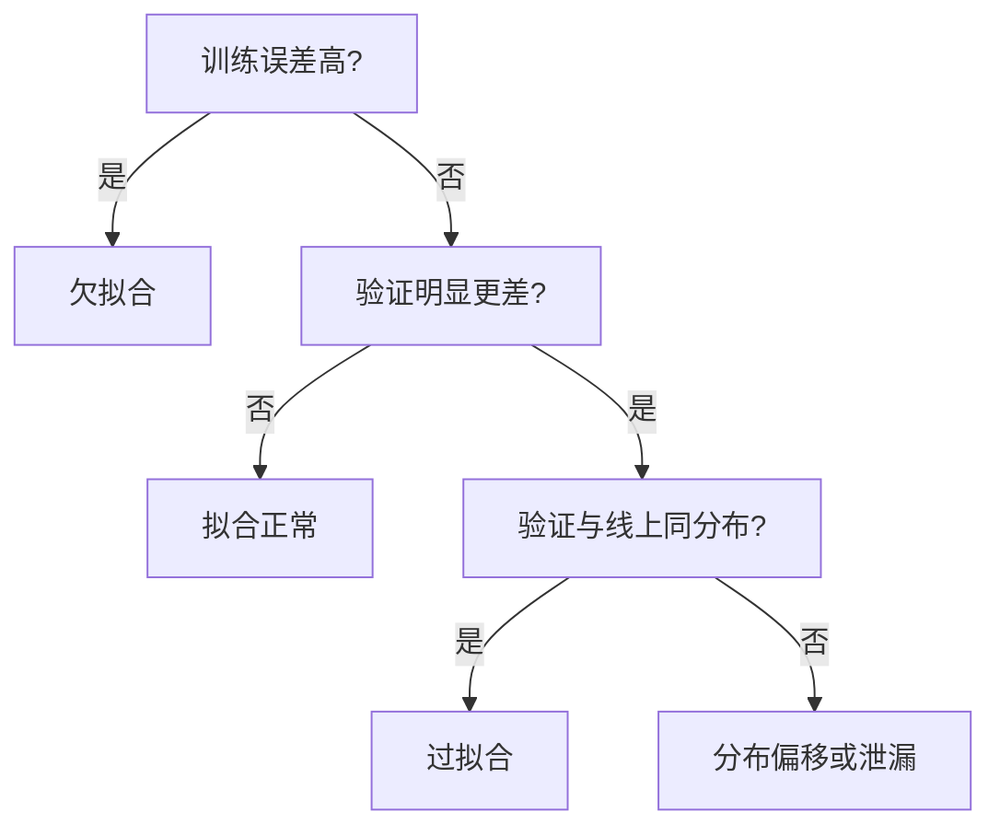

# 泛化与正则化

一句话:泛化是**训练集上学到的规律在没见过的数据上还成立**,正则化则是为了缩小「训练误差」与「新数据误差」之间那道缝而主动付出的代价——每一条手段都在放弃一点训练集上的拟合能力,换新数据上的稳定。

## 一、泛化在说什么

### 三个误差,别混成一个

**训练误差**在训练集上算,只说明模型有没有把这批数据学下来;**泛化误差**是模型在真实分布上的期望误差,是你真正想要的东西,但它永远算不出来;**验证 / 测试误差**在没参与训练的同分布样本上算,是泛化误差的一次**带噪估计**。于是:**过拟合**是训练误差还在降、泛化误差却已经掉头往上;**欠拟合**是训练误差本身就没降下来。「带噪估计」这四个字直接影响操作——**验证曲线抖一下不等于开始过拟合**,所以早停必须设最小改善幅度和等待窗口(第六节)。

### 偏差-方差:成立的条件,和剩下的解释力

在**平方损失、且噪声的条件均值为零**这个设定下,固定输入处的期望测试误差可以干净地拆成三块:

$$
\mathbb{E}\big[(y-\hat f(x))^2\big]=\big(\mathbb{E}[\hat f(x)]-f(x)\big)^2+\operatorname{Var}\big[\hat f(x)\big]+\sigma^2
$$

三项依次是**偏差的平方**(换无穷多批训练数据、平均之后的预测,离真实规律还差多远)、**方差**(换一批训练数据,预测会变动多大)和**不可约噪声**(标注本身的随机性,再好的模型也吃不掉)。欠拟合常对应高偏差,过拟合常对应高方差。但这套语言有两个必须说清的边界:**它是平方损失下的分解**,交叉熵、0-1 损失都没有同样形状的分解式,别当成任意任务都成立的定理;**它预测的那条经典 U 形曲线在深度模型上不完整**——容量一过某个点、测试误差就单调上升,这件事经常不发生。

### 为什么「参数多就一定过拟合」在大模型上不成立

四条原因,按重要性排。**参数量不是容量**:真正决定泛化的是「优化过程实际能到达的函数集合有多大」,不是权重张量里有多少个数——同一个 7B 模型,全参微调和只训一组低秩增量,可达到的函数范围差着量级(秩与容量的关系见 LoRA 篇)。**优化器自带偏好**:梯度下降不是在所有能拟合训练集的解里随机挑一个,一个干净的例子是线性可分数据上训线性分类器,一点正则不加,参数方向也会收敛到**最大间隔解**。**起点不是随机的**:微调从一份已经编码了大量真实规律的预训练权重出发,更新只在它附近小范围移动,可探索的坏解本来就少。**双下降**:测试误差在「刚好能把训练集插值下来」的容量阈值附近先抬头,继续加容量之后**又开始下降**,沿训练轮数和沿数据量也观察到过类似形状——它说明经典 U 形不是全部情形,但**推不出**「大模型不会过拟合」,只说明「加容量一定更差」这条直觉不可靠。还有一条最锋利的证据:同一个深度网络,把标签全部打乱成随机的,它照样能把训练集拟合到零误差——这意味着**光凭模型类的表达能力解释不了泛化**,显式正则(weight decay、dropout、增强)能改善泛化,但不是泛化成立的必要条件。

> 🖼️ 占位:双下降示意图——横轴模型容量,纵轴测试误差,标出经典 U 形段、插值阈值处的尖峰,以及阈值右侧再次下降的现代区间

## 二、拟合诊断:先归类,再动手

### 从曲线上区分三件事



同时看两组曲线才有结论:**沿训练步数**看训练/验证损失,**沿数据量**看学习曲线。训练误差高就是欠拟合,不管验证怎么样;训练低验证高时,先别急着叫过拟合——如果验证集和线上分布本来就不一致,那是数据划分或分布偏移的问题,加正则一点用没有。

### 过拟合的信号:五个,单个都不能确诊

①训练损失继续降而**验证损失回升**;②验证集上的业务指标(F1、任务成功率)变差,即使损失还看得过去;③模型能**复述训练样本**,换成没见过的同类输入就做不好;④决策边界追着个别噪声点走;⑤对输入做**保语义改写**(换个说法、调整语序)后表现骤降。

**边界复杂、对扰动敏感只是线索,必须有独立验证集上的退步来佐证。** 大模型场景下③⑤比④更常见:传统模型的过拟合表现为几何上的边界扭曲,大模型的过拟合表现为**只认训练时那套模板和文风**——换个提示词说法、换个指令格式就掉,这是拟合到了表面形式而不是任务。

### 欠拟合怎么办,过拟合怎么办

| 现象 | 干预 | 为什么有用 | 边界 |
|---|---|---|---|
| 欠拟合 | 加容量、补有效特征 | 让模型有能力表达这个规律 | 先排除错标和目标不匹配 |
| 欠拟合 | 减弱正则 | 正则过强会直接压住拟合能力 | 改善之后继续盯验证集 |
| 欠拟合 | 调学习率、训得更久 | 很多「学不会」其实是没优化到位 | 损失已经不再下降时,堆步数没用 |
| 过拟合 | 补独立数据 / 保语义增强 | 减少对个别样本的依赖 | 重复同一个模板**不算**增加多样性 |
| 过拟合 | weight decay / L2 | 限制权重规模,压掉极端拟合(第四节) | 系数要连同学习率、轮数一起验 |
| 过拟合 | Dropout | 随机屏蔽激活,打断特征间共依赖(第五节) | 强度过大直接变成欠拟合 |
| 过拟合 | 早停 + 恢复最佳检查点 | 限制实际用掉的更新量(第六节) | 需要有代表性的验证集 |
| 过拟合 | 缩小可训练容量(冻结层、PEFT) | 减少自由度 | 减少不等于消除,PEFT 一样会过拟合 |

### 数据问题还是容量问题,以及「验证集也会被过拟合」

两步,顺序不能反。**先做小批量拟合测试**:拿几十条样本,关掉正则、训到过拟合。如果连这几十条都拟合不了,问题几乎一定在标签、特征、掩码或优化设置上,加容量白搭。能拟合了再做第二步:**控制其他变量,分别清洗数据和增加容量,比较两条学习曲线**——数据量继续加、验证还在稳步改善的,是数据不足;两条曲线都平在高位、且训练误差本身就下不去的,才轮到容量。**加了容量仍学不好不能直接判为容量不足**,更常见的是优化没做对。

划分本身也会骗人。时间相关或用户相关的数据必须**按时间或按用户划分**,随机划分会让同一用户、同一时段的近似样本同时出现在两侧,测出来的分数是假的;增强过的数据要按「原始样本及其衍生族」整族划分,否则副本泄漏(方法见 数据工程 篇)。还有一层更隐蔽的:**反复按验证集调超参、选检查点,等于在验证集上做了一次搜索**,它的分数就不再是无偏估计了。对策是另留一份**完全不参与任何决策**的测试集,只在最后看一次;小数据可以用交叉验证,超参搜索则用嵌套验证。

## 三、L1 与 L2:一个筛特征,一个压幅度

设数据损失为 $L_0$、权重为 $w$、正则强度 $\lambda>0$,两者只差一个范数:

$$
J_{L1}=L_0+\lambda\sum_j |w_j|,\qquad J_{L2}=L_0+\frac{\lambda}{2}\sum_j w_j^2
$$

意思是:在原来的损失上额外收一笔「权重费」,L1 按权重的绝对值收,L2 按平方收。区别全在收费方式对**梯度**的影响:

$$
\frac{\partial}{\partial w_j}\lambda|w_j|=\lambda\operatorname{sign}(w_j)\ (w_j\neq 0),\quad \partial|w_j|\big|_{w_j=0}=[-\lambda,\lambda];\qquad \frac{\partial}{\partial w_j}\frac{\lambda}{2}w_j^2=\lambda w_j
$$

这行是全篇最该记住的对比。**L1 的惩罚梯度是一个常数大小的、只看方向的推力**:不管权重是 0.001 还是 100,它都以同样的力度往零推;而在 $w_j=0$ 这一点它不可导,次梯度是一整个区间。**L2 的惩罚梯度正比于权重本身**:权重越大压得越狠,越接近零压得越轻,到零就正好不压了。

### L1 为什么产生稀疏解

两个角度,面试里最好两个都给。

**次梯度角度(更本质)**。$w_j=0$ 处的次梯度是区间 $\lambda[-1,1]$,而不是一个点。只要数据损失在这个坐标上的梯度绝对值不超过 $\lambda$,零就**已经满足最优性条件**——这是一个有宽度的「死区」,权重一旦被推进去就出不来了。L2 没有这个区间:它在零点的导数正好是 $\lambda\cdot 0=0$,吸不住任何东西,所以只是把权重一路缩小、无限逼近零而不到零。

**几何角度(更好讲)**。把正则写成等价的约束形式:在 $\|w\|_1\le t$ 或 $\|w\|_2^2\le t$ 的范围内最小化 $L_0$。二维时 L1 的可行域是**菱形**(高维是 cross-polytope),尖角正好落在坐标轴上;损失的等高线从外面收缩过来,最先碰到的往往是那些尖角,而尖角上某些坐标恰好是 0。L2 的可行域是光滑的球,没有尖角,切点一般不落在坐标轴上。

### 三个高频纠错

**「稀疏最优解」不等于「迭代能到达精确的零」。** 直接把 L1 的梯度加进 SGD 或 Adam,权重会在零附近来回抖,浮点上几乎不会正好是 0;要真的得到零,得用**近端(proximal)更新**——先走一步数据梯度得到 $u$,再做软阈值 $\operatorname{sign}(u)\max(|u|-\eta\lambda,0)$,小于阈值的整段被直接削平成零。Adam 还多一层麻烦:它的逐参数缩放会把这个阈值按各参数的梯度历史扭曲掉。另外两条:**L2 不主动偏好稀疏,但这不代表权重绝不可能为零**;**凸问题的保证不能搬到神经网络**——「L1 能选出正确特征」「L2 解唯一」都要求目标凸且有额外条件,非凸网络上一条都不保证,线性回归 Ridge 的闭式解更不能外推。

### 怎么选,以及一个容易漏的前提

高维特征、想做**特征选择**就用 L1,稀疏解直接告诉你哪些特征没用;只想**限制权重规模、稳住训练**就用 L2 / weight decay,光滑好优化,和梯度方法天然兼容;**特征之间高度相关又想筛**,可以比较 Elastic Net($\lambda_1\|w\|_1+\tfrac{\lambda_2}{2}\|w\|_2^2$)——纯 L1 在一组共线特征里挑谁非常不稳定,换一批数据就换一个,加一点 L2 让它们共同分担会稳得多。**大模型微调想改善泛化,第一手不是 L1/L2**,数据、早停和容量约束的性价比高得多(第七节)。一个容易漏的前提:**数值特征的量纲会直接改变惩罚的公平性**,尺度大的特征系数天然小、被罚得轻,所以要先按训练集统计做标准化。另外,数据损失取负对数似然时,L1 与 L2 分别对应拉普拉斯先验与高斯先验下的 MAP 估计——这是它们「为什么长这样」的概率解释。

**大模型微调为什么不首选 L1**:它产生的是**非结构化零**,散落在矩阵各处;稠密 GEMM 内核照样把整块矩阵乘一遍,「参数为零」换不来任何速度或显存。想压缩就得同时设计稀疏结构、优化方法和部署内核三件事,那是另一个课题。而且把预训练权重往零拉本身就在破坏已学到的能力——要保持原模型行为,更对路的做法是加参考分布约束(如对参考策略的 KL,见 RLHF与RM 篇),而不是一味往零拉。

## 四、weight decay:作为正则,它到底想干什么

先把三个名字理清:**L2 正则**是往损失里加 $\tfrac{\lambda}{2}\|w\|^2$;**weight decay** 是每步直接把权重乘一个略小于 1 的系数;在**不带动量的普通 SGD** 上,这两件事在相应系数下可以互相换算,写出来都是 $w\leftarrow(1-\eta\lambda)w-\eta\nabla L_0$。

在 Adam 上它们**不等价**:加进损失的那一项会跟着任务梯度一起进入一阶、二阶矩,衰减强度被 $1/\sqrt{v}$ 按参数扭曲,AdamW 的解耦就是为了拆开这一步。**优化器侧的完整推导和它与学习率调度的耦合,见 优化器 篇,本篇不重复。** 本篇要补的是另一个视角:**它作为正则,约束的到底是什么?** 教科书说法是「小权重 = 简单函数」,但这个说法在带 Norm 的现代网络里基本失效——把一层权重整体放大一倍,后面的 LayerNorm 会把这个尺度直接归掉,函数根本没变(Norm 的机制见 Norm位置 篇)。此时 weight decay 更像是在**调有效学习率**:权重范数被压小之后,同样大小的梯度对权重方向的相对影响变大,等效于步子迈得更大。这解释了两件实践上的事——它和学习率调度深度耦合、改了调度就得重验;以及**它不是修 NaN 或修震荡的开关**,那是学习率和数据的事。

两条实操:**bias 和 Norm 的 $\gamma$、$\beta$ 通常排除在衰减之外**(它们不承担函数的尺度自由度,数量也少,压它们只会平白削弱表达);系数没有可外推的默认值,要在固定数据和固定 token 预算下扫一个小网格,按验证指标定。

## 五、Dropout:训练时丢,推理时保持期望

### 训练侧怎么丢,期望怎么保住

设丢弃概率 $p<1$,每个元素独立采一个伯努利掩码 $m\sim\mathrm{Bernoulli}(1-p)$。**inverted dropout** 把缩放放在训练侧:

$$
\tilde h=\frac{m\odot h}{1-p},\qquad \mathbb{E}[\tilde h\mid h]=h
$$

意思是:丢掉一部分元素之后,把活下来的按存活率放大回去,**这一层输出的期望和不丢时一模一样**;于是推理阶段什么都不用做,直接输出 $h$ 即可——这正是「inverted」这个名字的由来,也是所有主流框架的默认约定。

```python
def dropout(x, p, training=True):
    if not 0 <= p <= 1:
        raise ValueError("p 必须落在 [0, 1]")
    if not training or p == 0:
        return x               # 推理态、或 p=0:恒等,不生成掩码
    if p == 1:
        return torch.zeros_like(x)   # 全丢:必须特判,否则下面除以 0
    keep = (torch.rand_like(x) >= p).to(x.dtype)   # 伯努利掩码,存活概率 1-p
    return x * keep / (1 - p)  # 训练侧就把期望补回来,推理端才能是恒等
```

**另一种约定**是训练时只乘掩码不缩放,推理时给对应层乘 $1-p$。两种都对,但**绝不能混用**:两阶段各缩一次等于缩了两遍;也不能只在整网最终输出上乘一次 $1-p$——每一层都丢过,每一层都得补。这是手写 dropout 最常见的错。

### 它凭什么正则,以及代价

**打断共适应**:某个神经元随时可能消失,别的神经元就不能依赖「它一定在」这个假设,只好各自学出更独立、更冗余的特征。另一个常见解释是「训练了指数多个共享权重的子网络、推理时做平均」——直觉有用,但要说准:**期望保持只保住了这一层输出的期望,整个非线性网络并不等于所有子网络的精确平均**,那只在线性/单层这种特例下才严格成立。代价也有三条,都是追问的高发区:随机掩码**增大梯度噪声、拖慢收敛**;稠密实现照样跑完整的矩阵乘,置零只是逐元素乘掩码,**不能按丢弃比例宣称提速**,反而多了掩码生成与一次额外的逐元素读写;强度开大则直接把过拟合换成欠拟合。

### 和 BatchNorm 一起用为什么会打架

这是 dropout 最出名的坑,根子是**方差偏移**。对 inverted dropout,给定 $h$ 时 $\mathbb{E}[\tilde h^2]=h^2/(1-p)$:期望保住了,**二阶矩却被放大了 $1/(1-p)$ 倍**($p=0.1$ 时约 1.11 倍,$p=0.5$ 时正好 2 倍)。于是:训练时,排在 dropout 后面的 BN 看到的是**被放大过方差**的输入,它把这个方差攒进运行统计;推理时 dropout 关掉、输入方差缩回原值,BN 却还在用训练期攒的那份统计去归一化——**训练和推理成了两个不同的函数**,数值系统性偏移,越深越明显。两条修法:把 dropout 放到**所有 BN 层之后**(实践中常常就是只留在最后的分类头前),或者换用方差更稳定的 dropout 变体。**LayerNorm 没有这个问题**,因为它不维护跨批的运行统计,每次前向都用当前输入现算——但**顺序仍然改变函数**,不能随便交换。Pre-LN 残差块的标准写法是 $x+\mathrm{Dropout}(F(\mathrm{LN}(x)))$:dropout 作用在子层输出上、进残差之前(Norm 的位置选择见 Norm位置 篇)。

### Transformer 里丢在哪,丢多少

| 位置 | 扰动的是什么 | 备注 |
|---|---|---|
| 注意力概率上 | **token 之间的连接**,某些位置这一步读不到 | 掩码作用在 softmax 之后 |
| FFN 输出上 | **通道/特征维的表示** | 和上一条不是同一回事,不能互相替代 |
| 整条残差分支(DropPath) | 按**样本**丢掉整个子层,残差直通 | 即 Stochastic Depth,深残差网络里有效;**不能声称所有 Transformer 都更常用它** |

**概率怎么选**:把 $p=0$ 作为基线,和一个较小的非零值对照;attention、FFN、adapter 分别验,不同层用不同数值是合理的,但**没有通用最优值**,别照搬「默认 0.1」。

### 为什么现代大模型预训练里 dropout 越来越少

三条叠加。**第一,矛盾变了**:预训练是 $10^{12}$–$10^{13}$ 量级 token、多数配方只过一到几遍,单条样本被看到的次数极少,记忆式过拟合本来就不是主要风险,真正的对手是欠拟合和算力预算。**第二,它是纯开销**:掩码生成、额外访存、更慢的收敛,在固定 FLOPs 预算下都直接换算成质量损失。**第三,数据侧有更划算的替代**:去重、质量过滤、配比调整对泛化的回报比 dropout 高得多(见 数据工程 篇)。反过来,**这些微调场景仍然值得开**:示范只有几千到几万条、要训好几轮的小数据 SFT,适配器 / LoRA 分支上的 dropout,以及需要输出多样性或不确定性估计的场合——但同样要拿 $p=0$ 当基线实测,别默认它一定有用。

### MC Dropout:推理时故意留着

推理阶段**保持掩码开启**,同一条输入前向 $N$ 次,取预测的均值和方差——在一组特定假设下,这近似于贝叶斯神经网络的预测不确定性,方差大表示模型对这条输入没把握。三个注意点:代价是 $N$ 倍前向;它**不保证校准**,方差大小要在留出集上验过才能拿来定阈值;只把 dropout 切回训练模式,**BN 必须保持评估统计**,整网 `train()` 会把 BN 一起切过去,那是另一个 bug。

## 六、其他正则手段:早停、label smoothing、数据与噪声

### 早停:最便宜的那一条

早停正则的是**实际用掉的更新量**——训练步数本身就是一种容量预算,提前停等于不让模型走到那些只对训练集有利的区域。在「二次损失近似 + 小学习率梯度下降」这个受限设定下,它可以和 L2 建立近似对应,但**在一般非凸网络上不等价**,别把这条当定理讲。

操作要点五条:①**固定评估口径**——同一套提示、解码参数、精度和测试集版本;②按主指标而不是训练损失判定,并设**最小改善幅度**,免得被评测噪声牵着走;③**等待窗口要给学习率衰减留出机会**,余弦或 WSD 的收尾段常常还有一波改善,窗口太短会停在衰减之前(调度形状见 优化器 篇);④停下之后**恢复到最佳检查点**,不是用最后一个;⑤同时开了正则时**要重调等待时间**,因为正则改变了收敛速度——约束过强又停得太早,得到的是欠拟合。还有一条纪律:**不要把带正则项的训练损失直接和不带正则项的验证损失比**,那是两个定义不同的数,曲线交叉不说明任何事。

### label smoothing:别让模型把话说满

把独热目标换成 $y'=(1-\varepsilon)y+\varepsilon/C$,$C$ 是类别数。例如四分类、$\varepsilon=0.1$ 时,正确类的目标从 1 变成 0.925,其余三类各 0.025。**它在防什么**:独热目标要求正确类概率逼近 1,模型只能把 logit 差无限拉大,结果是过度自信、对噪声标签也照单全收。给目标留一点余量,这个无限拉大的压力就没了。三个边界:**可能改善校准和泛化,但要验**,$\varepsilon=0$ 是基线,0.1 不是通用默认,过强会欠拟合;**它不负责类别不平衡**,那要靠加权、重采样或 Focal Loss;还有一个反直觉的代价——**用它训出来的模型当蒸馏教师时,学生往往更差**,因为平滑把同类样本挤成更紧的簇,抹掉了 logit 里携带的类间相似度信息,而那正是蒸馏要传的东西(蒸馏机制见 蒸馏 篇)。

### 数据、噪声与结构:三条不长在损失里的正则

**数据永远是回报最高的那条**:补充真正不同的样本、或做保语义的增强,直接压低方差项;前提是**变换后监督必须仍然成立**,而且「重复模板」不等于「增加多样性」(各模态做法与怎么验收增强真的有用,见 数据工程 篇)。**梯度噪声是隐式正则**:小 batch 的采样噪声、dropout 的掩码噪声都在起类似作用,「小批噪声有助于找到平坦解」有一定经验支持,但 **「小批一定泛化更好」不是定律**(batch 与噪声的关系见 优化器 篇);想显式追求平坦解有专门方法(如 SAM,在参数邻域内的最坏点上算梯度),代价是每步大约翻倍的计算。**结构上的容量约束**:冻结部分层、只训一小块参数,直接缩小可达到的函数集合(秩与容量见 LoRA 篇);但**限制容量不等于不需要正则化**——冻结主干之后,照样可以给低秩参数设 weight decay 或 dropout。

### 一句话收口:每条正则各自约束什么

排成一行就清楚了——**补数据**改的是经验分布本身,**weight decay** 管权重规模与有效步长,**L1** 管稀疏结构,**Dropout** 管特征之间的共依赖,**早停**管实际用掉的更新量,**label smoothing** 管目标分布的尖锐度,**冻结 / PEFT** 管可达到的函数集合。约束的对象各不相同,所以**没有哪一条能替代另一条**;也不该一次全打开——一次只动一个、拿同一套验收口径比,才知道是谁在起作用。

## 七、落到大模型微调:哪几条真有效,哪些搬过来会失效

### 小数据 SFT 的优先级排序

经典正则在这里排得很靠后,按性价比从高到低是:①**数据**——先去重(尤其是同模板批量复制)、纠错标、按错误类型补覆盖缺口,小数据 SFT 里绝大多数「过拟合」其实是数据重复和覆盖不足;②**验证口径 + 早停**——事先指定主指标和通用能力底线,固定评估配置,按第六节的做法停并回滚到最佳检查点;③**降更新强度**——更小的学习率、更少的轮数,示范只有几千条却训三五轮,模型很容易开始背答案,注意**没有「小数据就用大学习率」这条规则**;④**限制可训练容量**——冻结层或 PEFT,它减少自由度但**不保证消除过拟合**;⑤**经典正则**(dropout、weight decay)——收益通常小于上面四条,而且一开就要重调早停窗口。

### 预训练很少过拟合、SFT 容易,差在哪

差在**重复曝光次数**,不在参数量。预训练面对 $10^{12}$ 量级 token、通常只过一到几遍;SFT 面对 $10^4$–$10^6$ 条示范却常训 2–3 轮,同一条样本被看到的次数高出好几个数量级。所以两个阶段该盯的东西不同:预训练重点在去重、质量过滤和域外验证(**预训练同样可能过拟合**,尤其在数据受限、需要重复训多轮时,重复训练的收益衰减规律见 ScalingLaws 篇);SFT 重点在低学习率、早停、限制可训练参数,并且额外检查通用能力有没有退。同理,**「全量微调的过拟合风险一定比小模型高」是错的**。风险来自更新强度和数据量之比,不是参数量本身;一个从良好预训练起点出发、低学习率短训的全参微调,可能比一个从零训的小模型稳得多。该做的是在同预算下实测,而不是按参数量下结论。

### 三件常被混成「过拟合」的事

| 现象 | 判据 | 该动什么 |
|---|---|---|
| 过拟合 | **新任务**的训练集与验证集差距拉开 | 数据、早停、降更新强度、限容量 |
| 灾难性遗忘 | **固定的旧任务**相对训练前掉点 | 回放、参数重要性约束、独立路径(全部见 SFT 篇) |
| reward hacking | 奖励在涨,**独立人评或留出任务**在跌 | 修奖励数据、控参考偏离(见 RLHF与RM 篇) |

第三条尤其要说清:**奖励投机可以在完全没有样本记忆的情况下发生**,它利用的是奖励代理本身的漏洞,不是把训练集背下来了,所以加正则化基本无效。SFT 阶段的过拟合表现为**照抄示范的措辞与格式**;RLHF 阶段则表现为**奖励曲线漂亮、真人评价下降**,两者的诊断入口完全不同。

### 还有一种情况:验证 loss 在降,下游指标在跌

交叉熵量的是「参考答案那些 token 的概率」,任务指标量的是「事实对不对、格式合不合法、该说的说没说全」,两者本来就不等价,生成任务还存在多个都正确的答案。所以**该不该早停,要按事先声明的主指标判,不能只凭一次 loss 上升**。排查顺序:先查解码配置、评测脚本和数据污染,再按任务与长度分组看是不是只学会了高频短答和某种文风,最后按真实验收指标选检查点。

### 老经验搬过来会失效的几条

**CV 的像素增强搬到文本**:翻转、裁剪、颜色扰动在文本上没有对应物,文本改写必须逐条核否定、数字、实体和答案是否还成立,否则是在制造错标。**「参数多就把 weight decay 调大」**:大模型的 $\lambda$ 与参数量之间没有可外推的关系,而且它和学习率调度耦合,改了调度就得重验(见 优化器 篇)。**「dropout 默认 0.1」照搬**:现代预训练配方多数把它关掉,微调时要拿 $p=0$ 当基线分层验证。**靠加 L1 做「大模型剪枝」**:非结构化零换不来速度,还在破坏预训练能力。**拿带正则项的训练损失和验证损失直接比**:两个数定义就不同,交叉点没有意义。最后一条纪律面试里很值钱——**项目经验题要按真实的划分方式、真实曲线、单变量干预和独立复验来回答**,说不清就说没做过,不要编造收益数字。

## 面试考点串联

| 高频问法 | 本文哪一节 |
|---|---|
| 什么是欠拟合和过拟合?结合偏差-方差说清成因,以及它们对泛化的影响 | 一 |
| 大模型参数量这么大为什么还能泛化?双下降现象说明了什么? | 一 |
| 怎么识别过拟合?举五种表现,单个信号能不能确诊?大模型的表现和传统机器学习有什么不同? | 二 · 七 |
| 欠拟合和过拟合各举三种以上缓解方法,说清原理和适用边界 | 二(干预表) |
| 怎么判断是数据问题还是模型容量问题导致的欠拟合?验证集被反复调参过拟合了怎么办? | 二(第三小节) |
| L1 和 L2 的数学形式、梯度、优化难度和适用场景差在哪? | 三 |
| L1 为什么会把权重压到正好是 0,而 L2 只是把它变小? | 三(次梯度与几何) |
| L1 在零点不可导怎么优化?为什么普通 Adam 加 L1 不保证精确稀疏? | 三(近端与软阈值) |
| 高维共线特征为什么可以考虑 Elastic Net?大模型微调为什么通常不首选 L1? | 三 |
| L2 正则和 weight decay 在 Adam 里有什么区别?带 Norm 的网络里它实际在调什么? | 四(解耦推导见 优化器 篇) |
| Dropout 训练和推理阶段分别怎么做?激活为什么要缩放,缩放放在哪一侧? | 五(期望保持) |
| 怎么手写 Dropout?$p=0$、$p=1$ 怎么处理,训练时没做 inverted 缩放怎么补? | 五(代码与两种约定) |
| Dropout 为什么能防过拟合?说它等于集成多个子网络准确吗?代价是什么? | 五(打断共适应) |
| Dropout 和 BatchNorm、LayerNorm 的顺序为什么影响训练和推理? | 五(方差偏移) |
| 注意力概率上和 FFN 输出上的 Dropout 各扰动什么?和 DropPath 有什么区别? | 五(位置表) |
| 为什么很多大模型预训练配方关掉了 Dropout?哪些微调场景仍值得开?概率怎么选? | 五 |
| 从贝叶斯角度怎么理解 MC Dropout?推理时开着它要注意什么? | 五(MC Dropout) |
| 早停具体怎么做?和学习率衰减、和其他正则同时用时要注意什么? | 六(早停) |
| 标签平滑改变了什么?它有什么代价?(补充题) | 六(label smoothing) |
| 除了 L1/L2,大模型场景还有哪些正则手段?LoRA 上还要不要加正则,系数怎么设? | 六(收口、结构约束)· 四 |
| SFT 阶段怎么判断过拟合?early stopping 怎么落地?验证 loss 一直降但任务指标变差该不该停? | 七 · 六 |
| 为什么预训练很少过拟合、SFT 容易?全量微调的风险真的比小模型高吗? | 七 |
| SFT 和 RLHF 阶段的过拟合表现有什么不同?奖励投机和过拟合是一回事吗? | 七(三件事表) |
| 大模型微调场景下过拟合有什么特殊性?小数据 SFT 该按什么顺序处理? | 七(优先级排序) |

遗忘、参数重要性与持续学习见 SFT 篇;秩与容量见 LoRA 篇;增强的模态做法与验收见 数据工程 篇;衰减在优化器里怎么实现见 优化器 篇。

## 相关文献

- Understanding deep learning requires rethinking generalization — [arXiv:1611.03530](https://arxiv.org/abs/1611.03530)
- Reconciling modern machine learning practice and the bias-variance trade-off(双下降)— [arXiv:1812.11118](https://arxiv.org/abs/1812.11118)
- Deep Double Descent: Where Bigger Models and More Data Hurt — [arXiv:1912.02292](https://arxiv.org/abs/1912.02292)
- The Implicit Bias of Gradient Descent on Separable Data — [arXiv:1710.10345](https://arxiv.org/abs/1710.10345)
- Dropout: A Simple Way to Prevent Neural Networks from Overfitting(JMLR 15(56), 2014,不在 arXiv)— https://jmlr.org/papers/v15/srivastava14a.html
- Improving neural networks by preventing co-adaptation of feature detectors(Dropout 的最早稿)— [arXiv:1207.0580](https://arxiv.org/abs/1207.0580)
- Understanding the Disharmony between Dropout and Batch Normalization by Variance Shift — [arXiv:1801.05134](https://arxiv.org/abs/1801.05134)
- Deep Networks with Stochastic Depth(DropPath)— [arXiv:1603.09382](https://arxiv.org/abs/1603.09382)
- Dropout as a Bayesian Approximation: Representing Model Uncertainty in Deep Learning(MC Dropout)— [arXiv:1506.02142](https://arxiv.org/abs/1506.02142)
- Rethinking the Inception Architecture for Computer Vision(标签平滑出处)— [arXiv:1512.00567](https://arxiv.org/abs/1512.00567)
- When Does Label Smoothing Help? — [arXiv:1906.02629](https://arxiv.org/abs/1906.02629)
- Decoupled Weight Decay Regularization(AdamW)— [arXiv:1711.05101](https://arxiv.org/abs/1711.05101)
- Three Mechanisms of Weight Decay Regularization — [arXiv:1810.12281](https://arxiv.org/abs/1810.12281)
- Sharpness-Aware Minimization for Efficiently Improving Generalization(SAM)— [arXiv:2010.01412](https://arxiv.org/abs/2010.01412)
- Proximal Algorithms(近端算法与软阈值,Parikh & Boyd)— https://web.stanford.edu/~boyd/papers/prox_algs.html
